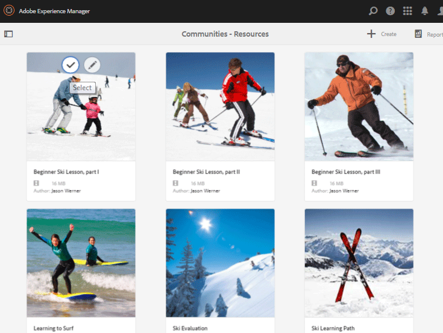
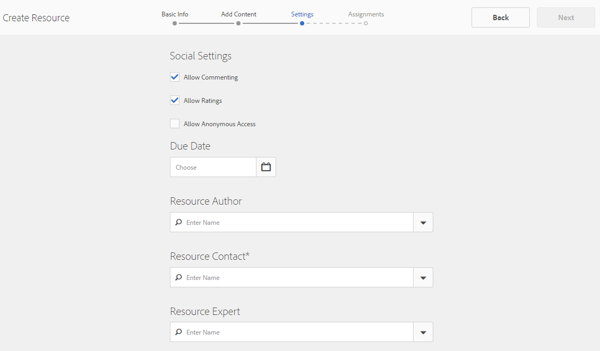

# 啟用資源主控台 {#enablement-resources-console}

對於AEM Communities,「資源」主控台是「 [Enablement Managers](users.md) 」建立、管理和指派資源給啟用社群網站成員的地方。

## 需求 {#requirements}

在新增社群網站的啟用資源之前，AEM例項必須正確設定，包括：

* SCORM
* FFmpeg

如需詳細資訊，請參 [閱設定啟用](enablement.md)。

>[!CAUTION]
>
>如果在建立社群網站後安裝了SCORM，則必須重新建立安裝SCORM前所顯示的任何啟用資源。

>[!NOTE]
>
>隨著 [AEM 6.3](deploy-communities.md#latestfeaturepack) 和相當的社群功能套件 [AEM 6.2 FP3](deploy-communities.md#latestfeaturepack) 和 [AEM 6.1 FP7](https://docs.adobe.com/content/docs/en/aem/6-1/deploy/communities.html#Latest功能套件)的推出，啟用功能不再需要 aMySQL資料庫(C)。

## 術語 {#terminology}

### 資源 {#resource}

資源對實施社群 [至關重要](overview.md#enablement-community)。 它們是指派給成員的材料，可讓他們提高技能。

資源的特性：

* 可能是
   * 影像(JPG、PNG、GIF、BMP)
   * 視訊(MP4)
   * Flash(SWF)
   * 檔案(PDF)
   * 隨堂測驗(SCORM)
* 可參考一或多個學習路徑

### 學習路徑 {#learning-path}

學習路徑是一組邏輯上的啟用資源，可分組在一起，以方便指派給成員。

### 成員組 {#members-group}

在建立社群網站時，URL的指定網站名稱會用於建立以各種角色的不同權限設定的 [網站特定使用者群組](users.md) 。 所有這些自動建立的群組都會加上前置詞 `Community *<site-name>*`。

其中一個使用者群 `Community *<site-name>* Members` 組是群組，可將發佈環境中的註冊使用者識別為社群成員。 如需範例， [請參閱AEM Communities的教學課程](getting-started-enablement.md) 「快速入門」。

對於 [參與社群](overview.md#egagementcommunity)，允許網站訪客自行註冊或使用社交登入是合理的，在此時，網站訪客會自動新增至成員群組。

若要 [啟用社群](overview.md#enablement-community)，建議將網站設為私用，然後需要管理員將使用者新增至成員群組。

## 存取社群網站的啟用資源 {#accessing-a-community-site-s-enablement-resources}

### 導覽至社群資源 {#navigate-to-communities-resources}

在作者環境中，若要進入資源主控台

* 從全域導覽：導 **[!UICONTROL 覽>社群>資源]**

### 選擇社群網站 {#select-a-community-site}

「社群資源」控制台將顯示所有社群網站。

在從「資源」主控台選取網站後，會針對特定社群網站建立啟用資源。

一旦選擇了特定的社群網站，任何現有的啟用資源和學習路徑都可供管理和修改，並且可以建立新的啟用資源和學習路徑。

#### 搜尋 {#search-features}

選取側面板切換圖示，以搜尋啟用資源或學習路徑。 選取後，控制台左側的搜尋面板會開啟，並提供可輸入搜尋詞的文字方塊。

#### 選擇模式 {#selection-mode}

若要選取多個啟用資源，請將滑鼠指標暫留在資訊卡上並選取核取標籤圖示，以選取第一個。 選取後，選取任何其他卡片會將其新增至選取群組。 選取第二次時間會取消選取卡片。

## 建立資源 {#create-a-resource}

要向社群站點添加新的啟用資源

* 選擇圖 `Create` 標
* 從顯示的子菜單中，選擇 `Resource`

這會啟動

* 說明資源（名稱、卡片影像和文字）
* 選擇資源內容
* 為資源選擇封面影像
* 標識資源聯繫人
* 為成員分配資源

當資源是課程的一部分（學習路徑）時，成員只應被指派到學習路徑。 可在建立啟用資源後添加分配。

### 1 Basic Info {#basic-info}

* **[!UICONTROL 新增影像]**

   (可&#x200B;*選*)要在成員的分配頁面以及資源控制台中啟用資源的卡片上顯示的影像。 從伺服器的本地檔案系統中選擇映像。 如果未提供影像，則會為上傳的資源產生縮圖。

   ***注意***:建議的影像大小不僅是480 x 480像素。 由於卡片的回應式設計會隨各種瀏覽器尺寸而改變，所以顯示大小會從220 X 165像素變更為400 x 165像素。

* **[!UICONTROL 網站名稱]**

   (*唯讀*)要向其添加資源的社區站點。

* **[!UICONTROL 資源名稱&amp;ast;]**

   (必&#x200B;*要*)資源的顯示名稱。 根據顯示名稱建立有效的節點名稱。

* **[!UICONTROL 標記]**

   (可&#x200B;*選*)可以選擇一個或多個標籤，其將啟用資源與一個或多個目錄相關聯。 請參閱 [標籤啟用資源](tag-resources.md)。

* **[!UICONTROL 在目錄中顯示]**

   取消選取後，啟用資源將不會顯示在任何目錄中。 如果勾選，除非預先篩選或UI中的成員篩選，否 [則啟用資源](catalog-developer-essentials.md#pre-filters) 將會顯示在所有目錄中。 預設為未勾選。

* **[!UICONTROL 說明]**

   (可&#x200B;*選*)要顯示啟用資源的說明。

* **[!UICONTROL 小型資產]**

   (選&#x200B;*用*)從AEM Assets中選取。 代表發佈環境（例如目錄）中資源的縮圖影像。

* **[!UICONTROL 大型資產]**

   (選&#x200B;*用*)從AEM Assets中選取。 用於表示發佈環境中資源（如資源的首頁）的大型影像。

* **[!UICONTROL 內容片段資產]**

   (選&#x200B;*用*)從AEM Assets中選取。 內容片段，可在發佈環境中參考，但預設未使用。

* 選擇下 **[!UICONTROL 一步]**

### 2 Add Content {#add-content}

雖然它看起來好像可以選擇多個啟用資源，但僅允許一個。

在右 `'+' icon`上角選擇，通過標識源開始選擇資源的過程。

* **[!UICONTROL 從我的本機檔案上]**&#x200B;傳從本機檔案系統上傳將使用原生檔案瀏覽器來選擇並上傳檔案。 支援的檔案類型包括SCORM.zip（HTML5或SWF）、MP4視訊、SWF、PDF和影像類型(JPG、PNG、GIF、BMP)。 檔案名稱會變成資產的名稱，並新增至資產庫。

* **[!UICONTROL 瀏覽資產庫]**&#x200B;從資產庫中選擇。 選取範圍僅限於在社群網站中可見的選取範圍。

* **[!UICONTROL 新增外部 URL]**

   輸入學習內容的連結。

   在開啟的對話框中，輸入：

   * **[!UICONTROL 標題]**

      啟用資源的資產名稱。

   * **[!UICONTROL URL]**

      資產的URL。

* **[!UICONTROL 新增 Adobe 連線 URL]**

   輸入Adobe connect作業的連結。

   在開啟的對話框中，輸入：

   * **[!UICONTROL 標題]**

      啟用資源的資產名稱。

   * **[!UICONTROL URL]**

      Adobe connect作業的URL。

* **[!UICONTROL 定義外部資源]**

   輸入要呈現物料的位置。 成功狀態和分數的值會手動輸入(請參 [閱報表](reports.md))。 上傳的封面影像可用來提供其他資訊。

   在開啟的對話框中，輸入：

   * **[!UICONTROL 標題]**

      啟用資源的資產名稱。

   * **[!UICONTROL 位置]**

      實體網站的位置，例如教室。

#### 新增視訊資源的範例 {#example-of-an-added-video-resource}

* **[!UICONTROL 資源封面影像]**

   所述封面影像是當第一次查看所述啟用資源時要顯示的影像。 例如，當視訊資源尚未播放時，會顯示封面影像。 如果未上傳自訂影像，則會顯示預設影像。 對於視訊資源，可能會產生縮 [圖](enablement.md#ffmpeg)，但只有在上傳時，而非在視訊參照為URL時。 對於位置資源，影像可用來提供其他資訊。

   封面影像的建議大小為640 x 360 px。

* 選擇下 **[!UICONTROL 一步]**

### 3 Settings {#settings}

>[!NOTE]
>
>學員不應直接註冊要從學習路徑參考的啟用資源。 學員只需在學習路徑中註冊。
>
>如果成員同時註冊了資源和參考該資源的學習路徑，則其分配將同時顯示學習路徑中的單個資源和資源。

* **[!UICONTROL 社會化設定]**

   這些設定可控制學員是否能夠提供有關啟用資源的輸入。 協調 [設定](sites-console.md#moderation) ，是父社群網站的協調設定。

   * **[!UICONTROL 允許評論]**

      如果選中此選項，則允許成員對資源進行注釋。 已勾選預設值。

   * **[!UICONTROL 允許評等]**

      如果選中此選項，則允許成員對資源評級。 已勾選預設值。

   * **[!UICONTROL 允許匿名存取]**

      如果勾選此選項，當社群網站也允許匿名存取時，匿名網站訪客即可檢視目錄中的資源。 預設為未勾選。

* **[!UICONTROL 到期日期]**
   *（可選）* ，可以選擇完成分配的日期。

* **[!UICONTROL 資原作者]**
   *（選擇性）* ，啟用資源的作者。 使用下拉菜單從成員組的成員中選 [擇](#members-group)。

* **[!UICONTROL 資源Contact&amp;ast;]**
   *（必要）* ，會員可聯絡有關啟用資源的人員。 使用下拉菜單從成員組的成員中選 [擇](#members-group)。

* **[!UICONTROL 資源專家]**
   *（可選）* ，會員可聯絡的人員，其具備相關啟用資源的專業知識。 使用下拉菜單從成員組成員中選擇 [用戶](#members-group)。

### 4 Assignments {#assignments}

* **[!UICONTROL 新增受]**&#x200B;聘者使用下拉式選單從要註冊為學員的 [成員](#members-group) -使用者和使用者群組（以粗體列出）中進行選擇。 當會員登入社群網站時，其註冊的啟用資源（和學習路徑）會顯示在其「工作總攬」 [頁面](functions.md#assignments-function) 。

* 選擇創 **[!UICONTROL 建]**

成功建立啟用資源將返回「資源」控制台，並選擇新建的資源。 通過此控制台，可以管 [理資源](#managing-a-resource)。

## Create a Learning Path {#create-a-learning-path}

若要新增學習路徑至社群網站

* 選擇圖 `Create` 標
* 從顯示的子菜單中，選擇 `Learning Path`

這會啟動

* 識別學習路徑
* 提供卡片影像以代表學員的學習路徑
* 參考要包含在學習路徑中的啟用資源
* （可選）排序資源
* 選擇性地識別先決條件學習路徑
* 識別學習路徑連絡人
* 註冊成員

對於學習路徑中包含的啟用資源，指派的作業只能針對學習路徑，而非個別資源。

### 基本資訊 {#basic-info-1}

* **[!UICONTROL 新增影像]**

   (可&#x200B;*選*)要顯示在成員分配頁以及資源控制台中學習路徑的卡片上的影像。 從伺服器的本地檔案系統中選擇映像。 如果未提供影像，則會為上傳的資源產生縮圖。

   ***注意***:建議的影像大小不再是480 x 480像素。 由於卡片的回應式設計會隨各種瀏覽器尺寸而改變，所以顯示大小會從220 X 165像素變更為400 x 165像素。

* **[!UICONTROL 網站名稱]**

   (*唯讀*)要向其添加資源的社區站點。

* **[!UICONTROL 學習路徑名稱]**

   (必&#x200B;*要*)學習路徑的顯示名稱。 根據顯示名稱建立有效的節點名稱。

* **[!UICONTROL 標記]**

   (可&#x200B;*選*)可選擇將學習路徑與一個或多個目錄關聯的一個或多個標籤。 請參閱 [標籤啟用資源](tag-resources.md)。

* **[!UICONTROL 在目錄中顯示]**

   如果取消選中，學習路徑將不顯示在任何目錄中。 如果勾選，除非預先篩選或UI中的成員篩選，否則學習 [路徑會顯示在](catalog-developer-essentials.md#pre-filters) 所有目錄中。 在目錄中顯示學習路徑將間接授予其所有包含資源的READ訪問權。 預設為未勾選。

* **[!UICONTROL 說明]**

   (可&#x200B;*選*)要顯示啟用資源的說明。

* **[!UICONTROL 小型資產]**

   (選&#x200B;*用*)從AEM Assets中選取。 代表發佈環境（例如目錄）中資源的縮圖影像。

* **[!UICONTROL 大型資產]**

   (選&#x200B;*用*)從AEM Assets中選取。 用於表示發佈環境中資源（如資源的首頁）的大型影像。

* **[!UICONTROL 內容片段資產]**

   (選&#x200B;*用*)從AEM Assets中選取。 內容片段，可在發佈環境中參考，但預設未使用。

* 選擇下 **[!UICONTROL 一步]**

### 新增必備條件 {#add-prerequisites}

* **[!UICONTROL 先決條件學習路徑]**(*可選*)選取其他已發佈的學習路徑時，必須先完成這些路徑，學員才能選取此學習路徑。

* 選擇下 **[!UICONTROL 一步]**

### 新增資源 {#add-resources}

* **[!UICONTROL 強制實施學習路徑中的排序]**

   (可&#x200B;*選*)如果設為「開啟」，則新增啟用資源的順序是學員在學習路徑中的學習順序。 預設為「關閉」。

* **[!UICONTROL 資源]**

   從為目前社群網站建立的*已發佈*啟用資源中選擇一或多個資源。

>[!NOTE]
>
>您只能選擇與學習路徑位於同一級別的可用資源。 例如，對於在群組中建立的學習路徑，只有群組層級資源可供使用；對於在社群網站中建立的學習路徑，該網站中的資源可供新增至學習路徑。

* 選擇 **[!UICONTROL 下一步]**。

### 設定 {#settings-1}

* **[!UICONTROL 新增註冊]**

   使用下拉菜單從社區站點成員組的成員和成員組（以粗體列出）中選 [擇](#members-group)。 首次建立學習路徑時，不需要添加指派。 可修改學習路徑屬性，以便稍後新增學員。

* **[!UICONTROL Learning Path Contact&amp;ast;]**

   *（必要）* ，會員可聯絡有關學習路徑的人員。 使用下拉菜單從社區站點成員組的成員中選 [擇](#members-group)。

* 選擇「創 **[!UICONTROL 建」]**

>[!NOTE]
>
>從學習路徑參考的啟用資源不應列出相同的受助者（學員）（如果有）。
>
>如果成員同時註冊了啟用資源和參考該資源的學習路徑，則其分配將同時顯示學習路徑中的單個資源和資源。

## 管理資源 {#managing-a-resource}

要管理單一啟用資源

* 從資源控制台
* 選擇包含資源的社區站點
* 選擇資源

對於選定的啟用資源，您可以：

* 檢視屬性（預設）
* 編輯屬性
* 刪除
* 發佈
* 未發佈

若要上傳新版啟用資源，建議您建立新資源，然後從舊版中取消註冊成員，然後將他們註冊到新版本。

### 編輯資源 {#edit-resource}

通過選擇鉛筆表徵圖，使用用於建立啟用資源的顯示步驟，以便可以修改提供的任何資訊。

如果唯一的變更是修改「設定」步驟中的指派，則儲存變更會導致發佈修改。 如果進行了其他更改，則必須在保存後明確發佈資源。

### 刪除資源 {#delete-resource}

通過選擇傳輸表徵圖，在確認後將 `Delete`啟用資源。

### 發佈 {#publish}

學員必須先發佈它，才能看到指派的啟用資源：

* 選取全球圖示 `Publish`
* 在彈出的對話方塊中，再次選 **[!UICONTROL 取「發佈]** 」
* 選擇關 **[!UICONTROL 閉]**

即使對話方塊指出動作已排入佇列，但通常也會立即發佈。

### 未發佈 {#unpublish}

若要暫時讓發佈環境中的成員無法存取啟用資源，而不要加以刪除，請使用資源的世界 `Unpublish`圖示。

### 報表 {#report}

「報表」圖示可讓學員在發佈環境中與指派的啟用資源互動時，存取產生的報表。 報表會依資源類型而異。

對於所有學習路徑，您可以根據資源或學員( `User Report`)來檢視報表。

此報告專門針對目前的啟用資源或學習路徑。 提供的報表深度取決於 [Adobe Analytics](analytics.md) 是否已授權並啟用社群網站。 「時 [間軸](#timeline)」、「檢 [視器參與](#viewer-engagement)」和「依裝置 [的參與」報表會根據投票間隔從Adobe Analytics](#engagement-by-device)匯入。

對於所有啟用資源，不論Adobe Analytics是否啟用，都會有「受託人狀態」和「分級」的報表，以及「報表 [摘要](#assignee-status) 」表格。

#### 時間軸 {#timeline}

「Analytics時間軸」報表會顯示此啟用資源的事件在一段時間內何時發生：

* **檢視**

   檢視是當學員瀏覽資源詳細資料頁面時

* **播放**

   播放是指alLearner與資源互動，例如播放影片或開啟PDF

* **評等**

   評分是當學員指派星級給資源時

* **評論**

   注釋是alLearner新增注釋時

垂直軸是事件數。

水準軸是日曆時間。

[需要Adobe Analytics](sites-console.md#analytics)。

#### 檢視者參與 {#viewer-engagement}

「Analytics檢視器參與」報錶針對視訊資源顯示已檢視資源的學員人數，若未播放到最後，學員會在何時停止播放該資源。

垂直軸是檢視過此資源的學員人數。

水準軸是此資源的持續時間。

[需要Marketing cloud組織ID](sites-console.md#enablement)。

#### 依裝置的參與數 {#engagement-by-device}

「依裝置分析參與」報錶針對視訊資源，說明從桌上型電腦和行動裝置播放的檢視百分比。

[需要Marketing cloud組織ID](sites-console.md#enablement)。

#### 被指定者的狀態 {#assignee-status}

「受託人狀態」報表會根據學員人數，說明有多少學員

* **未開始**
* **進行中**
* **完成**

#### 評等 {#ratings}

「評分」報表以已對啟用資源評分的學員人數為基礎，顯示每個星號評分的數目，接著是評分總數和平均評分的摘要。

#### 報表摘要 {#report-summary}

對於啟用資源，「報表摘要」是一個表格

* 與資源互動的每位學員
   * 他們的狀態
   * 是否已為他們分配資源
      * 而不是在目錄中尋找資源
   * 張貼的留言數
   * 給予的評分（如果有）

對於學習路徑資源報表，報表摘要是一個表

* 學習路徑中包含的每個資源
   * 發佈狀態
   * 檢視次數
   * 播放次數
   * 平均評分
   * 格式
   * 大小
   * 社群網站名稱

對於學習路徑「用戶報告」,「報告摘要」是一個表

* 指派給學習路徑的每個學員
   * 完成的資源數
   * 他們的狀態

通過使用選擇器選擇列，可以調整表的顯 `Show / hide columns` 示。

#### Download Report as CSV {#download-report-as-csv}

「報表摘要」表格可使用控制台上方的按鈕以CSV格式下載。

* 對於啟用資源：按鈕 `Download Resource Report as CSV`
* 學習路徑：按鈕 `Download Learning Path Report as CSV`

無論選擇要顯示的欄，都會下載完整的報表摘要。
