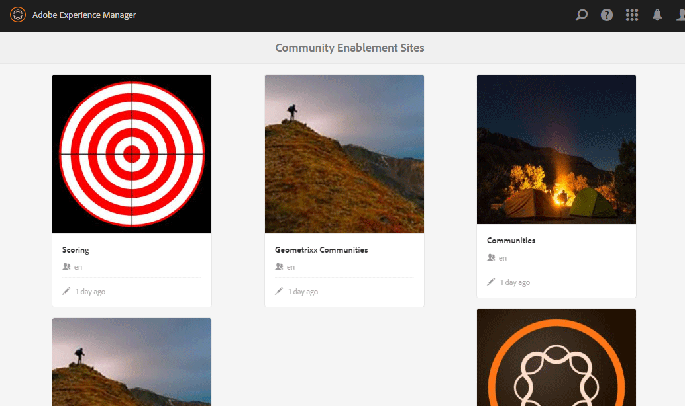
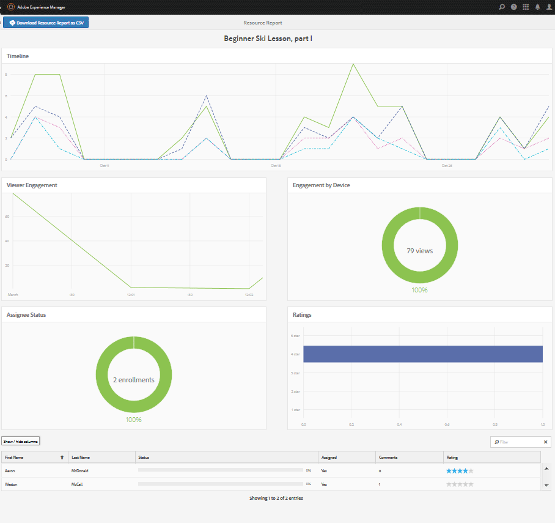

# 啟用資源控制台{#enablement-resources-console}

對於AEM Communities，資源控制台是[啟用管理員](users.md)建立、管理資源並將資源指派給啟用社群網站成員的位置。

## 需求 {#requirements}

新增社群網站的啟用資源之前，必須正確設定AEM例項，包括：

* SCORM
* FFmpeg

如需詳細資訊，請參閱[設定啟用](enablement.md)。

>[!CAUTION]
>
>如果在建立社群網站後安裝了SCORM，則必須重新建立安裝SCORM前存在的任何啟用資源。

>[!NOTE]
>
>隨著[AEM 6.3](deploy-communities.md#latestfeaturepack)和同等的Communities功能套件[AEM 6.2 FP3](deploy-communities.md#latestfeaturepack)和[AEM 6.1 FP7](https://docs.adobe.com/content/docs/en/aem/6-1/deploy/communities.html#Latest Feature Pack)的發行，此功能不再需要[MySQL資料庫](mysql.md)。

## 術語 {#terminology}

### 資源 {#resource}

資源對於[啟用社群](overview.md#enablement-community)至關重要。 它們是分配給成員的材料，使他們能夠提高技能。

資源的特性：

* 可能屬於以下類型：
   * 影像(JPG、PNG、GIF、BMP)
   * 視頻(MP4)
   * Flash(SWF)
   * 文檔(PDF)
   * 測驗(SCORM)
* 可從一個或多個學習路徑引用。

### 學習路徑 {#learning-path}

學習路徑是一組邏輯的啟用資源，這些資源分組在一起，以方便分配給成員。

### 成員組{#members-group}

建立社群網站時，在建立[網站特定使用者群組](users.md)時，會使用為URL指定的網站名稱，這些使用者群組設定了各種角色的各種權限。 所有這些自動建立的群組都會加上前置詞`Community <site-name>`。

`Community <site-name> Members`群組即是此類使用者群組，可將發佈環境中的註冊使用者識別為社群成員。 如需範例，請參閱教學課程[啟用AEM Communities快速入門](getting-started-enablement.md)。

對於[參與社群](overview.md#egagementcommunity)，允許網站訪客自行註冊或使用社交登入是合理的，屆時他們會自動新增至成員群組。

對於[啟用社區](overview.md#enablement-community)，建議將站點設為私有，然後需要管理員將用戶添加到成員組。

## 訪問社區站點的啟用資源{#accessing-a-community-site-s-enablement-resources}

### 導航到Communities資源{#navigate-to-communities-resources}

在製作環境中，前往資源主控台

* 從全局導航：**[!UICONTROL 導航]** > **[!UICONTROL Communities]** > **[!UICONTROL 資源]**

   

### 選擇社區站點{#select-a-community-site}

「社區資源」控制台將顯示所有社區站點。

從「資源」控制台選取網站後，會為特定社群網站建立啟用資源。

選取特定社群網站後，即可存取任何現有的啟用資源和學習路徑，以便管理和修改，並可建立新的啟用資源和學習路徑。

#### 搜尋 {#search-features}

選取側面板切換圖示，以搜尋啟用資源或學習路徑。 選中後，控制台左側將開啟一個搜索面板，並提供一個文本框，可在其中輸入搜索詞。

#### 選擇模式 {#selection-mode}

若要選取多個啟用資源，請將游標移至資訊卡上並選取核取標籤圖示，以選取第一個資源。 選取後，選取任何其他卡片即會將其新增至選取群組。 選擇第二次時，將取消選擇卡。

## 建立資源{#create-a-resource}

向社群網站新增啟用資源的方式

* 選取`Create`圖示。
* 從顯示的子菜單中，選擇&#x200B;**[!UICONTROL 資源]**。

這會啟動下列逐步程式：

* 說明資源（名稱、卡片影像和文字）。
* 選擇資源內容。
* 為資源選取封面影像。
* 標識資源聯繫人。
* 為成員分配資源。

當資源是課程的一部分時，學習路徑只應將成員分配給學習路徑。 可在建立啟用資源後添加分配。

### 1基本資訊{#basic-info}

* **[!UICONTROL 新增影像]**

   （*可選*）要在成員分配頁面和資源控制台中啟用資源的卡上顯示的影像。 從伺服器的本地檔案系統中選擇映像。 如果未提供影像，則會為上傳的資源產生縮圖。

   ***注意***:建議的影像大小不只是480 x 480像素。由於卡片的回應式設計對各種瀏覽器尺寸有所影響，因此顯示大小會從220 X 165像素變更為400 x 165像素。

* **[!UICONTROL 網站名稱]**

   (*readonly*)要向其添加資源的社區站點。

* **[!UICONTROL 資源名稱]**

   （*必要*）資源的顯示名稱。 從顯示名稱中建立有效的節點名稱。

* **[!UICONTROL 標記]**

   （*可選*）可以選擇一個或多個標籤，將啟用資源與一個或多個目錄相關聯。 請參閱[標籤啟用資源](tag-resources.md)。

* **[!UICONTROL 在目錄中顯示]**

   取消勾選後，啟用資源將不會顯示在任何目錄中。 如果勾選此選項，除非[預先篩選](catalog-developer-essentials.md#pre-filters)或UI中的成員篩選器，否則啟用資源會顯示在所有目錄中。 預設為未勾選。

* **[!UICONTROL 說明]**

   （*選用*）要針對啟用資源顯示的說明。

* **[!UICONTROL 小型資產]**

   （*選用*）從AEM Assets中選取。 代表發佈環境中資源（例如目錄）的縮圖影像。

* **[!UICONTROL 大型資產]**

   （*選用*）從AEM Assets中選取。 在發佈環境中代表資源的大型影像，例如資源的主要頁面上。

* **[!UICONTROL 內容片段資產]**

   （*選用*）從AEM Assets中選取。 可在發佈環境中參考，但預設未使用的內容片段。

* 選擇&#x200B;**[!UICONTROL Next]**

### 2添加內容{#add-content}

雖然看起來好像可以選取多個啟用資源，但僅允許一個資源。

選取右上角的`'+' icon`，以透過識別來源來開始選擇資源的程式。

* **[!UICONTROL 從我的本機檔案上傳]**

   從本機檔案系統上傳將使用原生檔案瀏覽器來選取及上傳檔案。 支援的檔案類型為SCORM.zip（HTML5或SWF）、MP4視訊、SWF、PDF和影像類型(JPG、PNG、GIF、BMP)。 檔案名稱會變成資產的名稱，並新增至資產資料庫。

* **[!UICONTROL 瀏覽資產庫]**

   從「資產庫」中選取。 選取範圍限於社群網站內可見的項目。

* **[!UICONTROL 新增外部 URL]**

   輸入學習內容的連結。

   在開啟的對話方塊中，輸入：

   * **[!UICONTROL 標題]**

      啟用資源的資產名稱。

   * **[!UICONTROL URL]**

      資產的URL。

* **[!UICONTROL 新增 Adobe 連線 URL]**

   輸入Adobe Connect工作階段的連結。

   在開啟的對話方塊中，輸入：

   * **[!UICONTROL 標題]**

      啟用資源的資產名稱。

   * **[!UICONTROL URL]**

      Adobe Connect工作階段的URL。

* **[!UICONTROL 定義外部資源]**

   輸入要呈現物料的位置。 手動輸入成功狀態和分數的值（請參閱[Reports](reports.md)）。 上傳的封面影像可用來提供其他資訊。

   在開啟的對話方塊中，輸入：

   * **[!UICONTROL 標題]**

      啟用資源的資產名稱。

   * **[!UICONTROL 位置]**

      物理站點的位置，如教室……

#### 新增的視訊資源{#example-of-an-added-video-resource}範例

* **[!UICONTROL 資源封面影像]**

   封面影像是首次檢視啟用資源時要顯示的影像。 例如，當視訊資源尚未播放時，會顯示封面影像。 如果未上傳自訂影像，則會顯示預設影像。 對於視訊資源，您可能會[產生縮圖](enablement.md#ffmpeg)，但上傳時才可能，參考視訊為URL時不可能。 對於位置資源，可使用影像來提供其他資訊。

   封面影像的建議大小為640 x 360 px。

* 選擇&#x200B;**[!UICONTROL Next]**。

### 3設定 {#settings}

>[!NOTE]
>
>不應直接將學習者註冊到要從學習路徑參考的啟用資源中。 學習者只需註冊到學習路徑中。
>
>如果成員同時註冊了資源和引用該資源的學習路徑，則其分配將同時顯示學習路徑內的單個資源和資源。

* **[!UICONTROL 社會化設定]**

   這些設定可控制學習者是否能提供有關啟用資源的輸入。 [協調設定](sites-console.md#moderation)是父社群網站的設定。

   * **[!UICONTROL 允許評論]**

      如果選中，則允許成員對資源進行注釋。 已勾選預設值。

   * **[!UICONTROL 允許評等]**

      如果選中，則允許成員對資源進行評級。 已勾選預設值。

   * **[!UICONTROL 允許匿名存取]**

      如果選中此選項，則允許匿名站點訪客查看目錄中的資源，而社區站點也允許匿名訪問。 預設為未勾選。

* **[!UICONTROL 到期日期]**

   *（可選）* 可以選擇完成分配的日期。

* **[!UICONTROL 資原作者]**

   *（選用）* 啟用資源的作者。使用下拉菜單從[成員組](#members-group)的用戶中進行選擇。

* **[!UICONTROL 資源聯繫人(&amp;A);]**

   *（必要）* 成員可聯絡與啟用資源有關的人員。使用下拉菜單從[成員組](#members-group)的用戶中進行選擇。

* **[!UICONTROL 資源專家]**

   *（選用）* 會員可聯絡且具備啟用資源相關專業知識的人員。使用下拉菜單從[成員組](#members-group)的成員中選擇。

### 4項任務 {#assignments}

* **[!UICONTROL 新增被指定者]**

   使用下拉菜單從[members](#members-group) — 要註冊為學習者的用戶和用戶組（以粗體面列出）中進行選擇。 成員登入社群網站時，其登入的啟用資源（和學習路徑）會顯示在其[Assignments](functions.md#assignments-function)頁面上。

* 選擇 **[!UICONTROL 建立]**。

   

成功建立啟用資源後，系統會將新建立的資源選取，並返回「資源」主控台。 在此控制台中，[可以管理資源](#managing-a-resource)。

## 建立學習路徑{#create-a-learning-path}

向社區站點添加新學習路徑

* 選取`Create`圖示
* 從顯示的子菜單中，選擇&#x200B;**[!UICONTROL 學習路徑]**。

這會啟動下列逐步程式：

* 識別學習路徑。
* 提供卡片影像以表示學習者的學習路徑。
* 參考要包含在學習路徑中的啟用資源。
* （可選）排序資源。
* （可選）標識必備學習路徑。
* 識別學習路徑聯繫人。
* 正在註冊成員。

對於學習路徑中包含的啟用資源，只應為學習路徑而不應為個別資源進行指派。

### 基本資訊 {#basic-info-1}

* **[!UICONTROL 新增影像]**

   （*可選*）要在成員分配頁面和資源控制台中學習路徑的卡上顯示的影像。 從伺服器的本地檔案系統中選擇映像。 如果未提供影像，則會為上傳的資源產生縮圖。

   ***注意***:建議的影像大小不再只是480 x 480像素。由於卡片的回應式設計對各種瀏覽器尺寸有所影響，因此顯示大小會從220 X 165像素變更為400 x 165像素。

* **[!UICONTROL 網站名稱]**

   （*只讀*）要向其添加資源的社區站點。

* **[!UICONTROL 學習路徑名稱]**

   （*必要*）學習路徑的顯示名稱。 從顯示名稱中建立有效的節點名稱。

* **[!UICONTROL 標記]**

   （*可選*）可以選擇一個或多個標籤，其將學習路徑與一個或多個目錄相關聯。 請參閱[標籤啟用資源](tag-resources.md)。

* **[!UICONTROL 在目錄中顯示]**

   取消勾選後，學習路徑將不會顯示在任何目錄中。 如果選中，則學習路徑將顯示在所有目錄中，除非[預先篩選](catalog-developer-essentials.md#pre-filters)或UI中的成員篩選器。 在目錄中顯示學習路徑將間接授予對其所有包含資源的READ訪問權。 預設為未勾選。

* **[!UICONTROL 說明]**

   （*選用*）要針對啟用資源顯示的說明。

* **[!UICONTROL 小型資產]**

   （*選用*）從AEM Assets中選取。 代表發佈環境中資源（例如目錄）的縮圖影像。

* **[!UICONTROL 大型資產]**

   （*選用*）從AEM Assets中選取。 在發佈環境中代表資源的大型影像，例如資源的主要頁面上。

* **[!UICONTROL 內容片段資產]**

   （*選用*）從AEM Assets中選取。 可在發佈環境中參考，但預設未使用的內容片段。

* 選擇&#x200B;**[!UICONTROL Next]**。

### 新增必備條件 {#add-prerequisites}

* **[!UICONTROL 必備條件學習路徑]**

   （*選用*）選取其他已發佈的學習路徑時，必須先完成這些路徑，學習者才能選取此學習路徑。

* 選擇&#x200B;**[!UICONTROL Next]**。

### 新增資源 {#add-resources}

* **[!UICONTROL 強制實施學習路徑中的排序]**

   （*選用*）如果設為「開啟」，則新增啟用資源的順序為要求學習者繼續完成學習路徑的順序。 預設值為Off。

* **[!UICONTROL 資源]**

   從為目前社群網站建立的&#x200B;*published*&#x200B;啟用資源中選擇的一或多個資源。

>[!NOTE]
>
>您只能選擇與學習路徑位於同一級別的可用資源。 例如，對於在組中建立的學習路徑，只有組級別資源可用；對於在社區站點中建立的學習路徑，該站點中的資源可用於添加到學習路徑。

* 選擇&#x200B;**[!UICONTROL Next]**。

### 設定 {#settings-1}

* **[!UICONTROL 新增註冊]**

   使用下拉菜單從成員和成員組（以粗體面列出）中選擇屬於社區站點的[成員組](#members-group)的成員組。 首次建立學習路徑時不需要添加分配。 可修改學習路徑屬性以稍後添加學習者。

* **[!UICONTROL 學習路徑聯繫人(&amp;A);]**

   *（必要）* 成員可以聯絡的與學習路徑相關的人。使用下拉菜單從社區站點的[成員組](#members-group)的成員中選擇。

* 選擇&#x200B;**[!UICONTROL 建立]**

>[!NOTE]
>
>從學習路徑引用的啟用資源不應列出相同的受助者（學習者）（如果有）。
>
>如果成員同時註冊了啟用資源和引用該資源的學習路徑，則其分配將同時顯示學習路徑中的單個資源和資源。

## 管理資源{#managing-a-resource}

要管理單個啟用資源，請執行以下操作：

* 從&#x200B;**[!UICONTROL Resources]**&#x200B;控制台中，選擇包含資源的社群站點。
* 選取資源。

對於所選啟用資源，可以：

* 檢視屬性（預設）
* 編輯屬性
* 刪除
* 發佈
* 未發佈

若要上傳新版本的啟用資源，建議您建立新資源，然後從舊版中取消註冊成員，並在新版本中註冊成員。

### 編輯資源 {#edit-resource}

通過選擇鉛筆表徵圖，將提供用於建立啟用資源的步驟，以便可以修改提供的任何資訊。

如果唯一的變更是修改「設定」步驟上的指派，則儲存變更會導致發佈修改。 如果進行了任何其他變更，則資源必須在儲存後明確發佈。

### 刪除資源 {#delete-resource}

選取轉譯圖示後，啟用資源將在確認後為`Deleted`。

### 發佈 {#publish}

必須先發佈指派的啟用資源，使用者才能看到該資源：

* 選擇`Publish`的世界表徵圖。
* 在彈出的對話方塊中，再次選取&#x200B;**[!UICONTROL Publish]**。
* 選擇&#x200B;**[!UICONTROL 關閉]**。

即使對話方塊指出動作已排入佇列，它通常會立即發佈。

### 未發佈 {#unpublish}

若要暫時讓發佈環境中的成員無法存取啟用資源而不刪除，請使用世界圖示來`Unpublish`資源。

### 報表 {#report}

「報表」圖示可讓使用者在發佈環境中與指派的啟用資源互動時，所產生的報表存取權。 報表會依資源類型而異。

對於所有學習路徑，都可以根據資源或學習者(`User Report`)來檢視報表。

此報告專門用於當前啟用資源或學習路徑。 提供的報表深度取決於是否為社群網站授權並啟用[Adobe Analytics](analytics.md)。 [時間軸](#timeline)、[檢視器參與](#viewer-engagement)和[依裝置參與](#engagement-by-device)報表是根據[輪詢間隔](analytics.md#report-importer)從Adobe Analytics匯入。

對於所有啟用資源，無論是否啟用Adobe Analytics，都有關於[受託人狀態](#assignee-status)和[評等](#ratings)以及[報表摘要](#report-summary)表格的報表。

#### 時間軸 {#timeline}

Analytics時間軸報表會顯示此啟用資源的事件在一段時間內的發生時間：

* **檢視**

   檢視是學習者造訪資源詳細資料頁面時的檢視。

* **播放**

   播放是所有學習者與資源互動時的播放，例如播放影片或開啟PDF。

* **評等**

   評等是當學習者將星級分配給資源時。

* **評論**

   alLearner新增留言時即為留言。

垂直軸是事件數。

水準軸是日曆時間。

[Adobe Analytics為必要](sites-console.md#analytics)。

#### 檢視者參與 {#viewer-engagement}

「Analytics檢視器參與」報表會針對視訊資源顯示已檢視資源的使用者人數，若未播放到最後，則使用者會在何時停止播放該資源。

垂直軸是已檢視此資源的使用者人數。

水準軸是此資源的持續時間。

[Marketing Cloud組織ID為必要](sites-console.md#enablement)。

#### 依裝置的參與數 {#engagement-by-device}

針對視訊資源，「依裝置的Analytics參與」報表會說明從案頭和行動裝置播放的檢視百分比。

[Marketing Cloud組織ID為必要](sites-console.md#enablement)。

#### 被指定者的狀態 {#assignee-status}

「受託人狀態」報表根據使用者人數，說明有多少使用者

* **未啟動**
* **進行中**
* **完成**

#### 評等 {#ratings}

「評等」報表以已對啟用資源進行評等的使用者人數為基礎，顯示每個星級評等的數量，接著是總評等數和平均評等的摘要。

#### 報表摘要{#report-summary}

對於啟用資源，「報表摘要」是表格清單。

* 已與資源互動的每個學習者
   * 他們的狀態
   * 是否已為他們分配資源
      * 與在目錄中尋找資源相反
      * 已張貼的留言數
      * 給出的評級（如果有的話）

對於學習路徑資源報告，報告摘要是一個表

* 學習路徑中包含的每個資源
   * 發佈狀態
   * 檢視次數
   * 播放次數
   * 平均評等
   * 格式
   * 大小
   * 社群網站名稱

對於學習路徑用戶報告，報告摘要是表清單。

* 分配給學習路徑的每個學習者：
   * 已完成的資源數。
   * 他們的身份。

您可以使用`Show / hide columns`選擇器選取欄，以調整表格的顯示。

#### 以CSV格式下載報表{#download-report-as-csv}

「報表摘要」表格可使用控制台上方的按鈕以CSV格式下載。

* 啟用資源：`Download Resource Report as CSV`按鈕。
* 學習路徑：`Download Learning Path Report as CSV`按鈕。

無論選擇哪些欄以顯示，都會下載完整的報表摘要。
