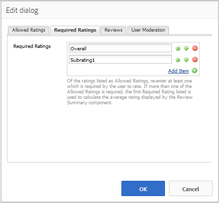

# 使用稽核和稽核摘要（顯示） {#using-reviews-and-reviews-summary-display}

`Reviews`元件是[Comments](comments.md)和[Rating](rating.md)元件組成的複合元件，可供使用。

`Reviews Summary (Display)`元件提供`Reviews`元件的作用中或已關閉執行個體的摘要，以顯示在網站上的其他位置。

>[!NOTE]
>
>不支援評論的匿名張貼。 網站訪客必須註冊（成為會員）並登入才能參與。 登入的訪客可隨時更新其評論。

## 新增複查至頁面 {#adding-a-review-to-a-page}

若要在作者模式中新增`Reviews`元件至頁面，請使用元件瀏覽器來找到`Communities / Reviews`並將其拖曳至頁面上的適當位置，例如相對於該功能以供使用者檢閱的位置。

如需必要資訊，請造訪[社群元件基本知識](basics.md)。

當包含[必要的使用者端資料庫](reviews-basics.md#essentials-for-client-side)時，`Reviews`元件就會以這種方式顯示。

## 設定稽核 {#configuring-reviews}

選取置入的`Reviews`元件，以便您可以存取並選取開啟編輯對話方塊的`Configure`圖示。

在&#x200B;**[!UICONTROL 允許的評等]**&#x200B;標籤下，指定要顯示給成員的完整評等清單。 第一個評等應該是整體/一般評等，因為它是提供`Review Summary (Display)`元件平均評等的評等。 預設設定中的下兩個評等應該指定不同的標題，「子評等1」或「子評等2」除外。

* **[!UICONTROL 允許的評等]**

  成員可選擇的評等清單。

  使用向上鍵、向下鍵和刪除按鈕來修改可見選取專案。

  按一下&#x200B;**[!UICONTROL 新增專案]**&#x200B;以新增其他評等選擇。

在「**[!UICONTROL 必要的評等]**」標籤下，從&#x200B;**[!UICONTROL 允許的評等]**&#x200B;清單重新輸入評等所需的專案。 如果專案僅在「允許的評等」標籤上指定，則成員提交時可能會保留未標示的專案。

在網站上，必要評等會以星號標示。 如果專案是必要專案且未標籤，則會向成員顯示訊息，並在標籤所有必要評等之前拒絕提交。

* **[!UICONTROL 必要的評等]**

  允許的評等子集，指出所需的評等。

  使用向上鍵、向下鍵和刪除按鈕來修改可見選取專案。

  按一下&#x200B;**[!UICONTROL 新增專案]**&#x200B;以新增其他回應選擇。

>[!NOTE]
>
>如果在&#x200B;**[!UICONTROL 必要的評等]**&#x200B;標籤上輸入的專案未在&#x200B;**[!UICONTROL 允許的評等]**&#x200B;標籤上指定，則它不會包含在要評等的專案中。

在&#x200B;**[!UICONTROL 稽核]**&#x200B;標籤下，指定稽核的處理方式。

* **[!UICONTROL 允許回覆]**

  如果勾選，則允許回複評論。 預設為未勾選。

* **[!UICONTROL 已關閉]**

  如果勾選，則新評論和回覆將關閉審閱。 預設為未勾選。

* **[!UICONTROL 允許檔案上傳]**

  如果勾選，允許上傳檔案附件以供稽核。 預設為未勾選。

* **檔案大小上限**

  只有在勾選&#x200B;**[!UICONTROL 允許檔案上傳]**&#x200B;時才相關。 此欄位會限制已上傳檔案的大小（以位元組為單位）。 預設為10 MB。

* **[!UICONTROL 郵件長度上限]**

  可輸入文字方塊的最大字元數。 預設為4096個字元。

* **[!UICONTROL 允許的檔案型別]**

  只有在勾選&#x200B;**[!UICONTROL 允許檔案上傳]**&#x200B;時才相關。 以「點」分隔符號的副檔名清單（以逗號分隔）。 例如，.jpg、.jpeg、.png、.doc、.docx、.pdf。 如果指定了任何檔案型別，則不允許未指定的檔案型別。 預設為「無」，因此允許所有檔案型別。

* **[!UICONTROL RTF編輯器]**

  如果勾選，可輸入帶有標示的貼文。 預設為未勾選。

* **[!UICONTROL 允許投票]**

  如果勾選，請包含主題的投票功能。 預設為未勾選。

在「**[!UICONTROL 使用者稽核]**」標籤下，指定如何管理已發佈的評論。 如需詳細資訊，請參閱[仲裁使用者產生的內容](moderate-ugc.md)。

* **[!UICONTROL 預先稽核]**

  如果勾選，則必須先核准稽核，才能將其顯示在發佈網站上。 預設為未勾選。

* **[!UICONTROL 刪除評論]**

  如果勾選，則發佈評論的成員可以將其刪除。 預設為未勾選。

* **[!UICONTROL 拒絕評論]**

  如果勾選，則允許版主拒絕評論。 預設為未勾選。

* **[!UICONTROL 關閉/重新開啟評論]**

  如果勾選，則允許版主關閉和重新開啟檢閱。 預設為未勾選。

* **[!UICONTROL 標幟評論]**

  如果勾選，則允許成員將稽核標籤為不適當。 預設為未勾選。

* **[!UICONTROL 標幟原因清單]**

  如果勾選，則允許成員從下拉式清單中選擇將稽核標籤為不適當的原因。 預設為未勾選。

* **[!UICONTROL 自訂標幟原因]**

  如果勾選，則允許成員輸入將稽核標籤為不適當的原因。 預設為未勾選。

* **[!UICONTROL 稽核閾值]**

  輸入在通知版主前，成員必須標幟稽核的次數。 預設為一次(1)。

* **[!UICONTROL 標幟限制]**

  輸入將評論從公開檢視隱藏之前必須加以標幟的次數。 此數字必須大於或等於&#x200B;**[!UICONTROL 仲裁臨界值]**。 預設值為5。

### 新增檢閱摘要（顯示）至頁面 {#adding-a-review-summary-display-to-a-page}

若要將`Reviews Summary (Display)`元件新增至作者模式的頁面，請找到該元件

* `Communities / Reviews Summary (Display)`

並將其拖曳至將顯示進行中或已關閉稽核摘要的頁面上。

如需必要資訊，請造訪[社群元件基本知識](basics.md)。

當包含[必要的使用者端資料庫](reviews-basics.md#essentials-for-client-side)時，`Reviews Summary (Display)`元件就會以這種方式顯示。

>[!NOTE]
>
>「平均」反映所彙總稽核的「允許的評等」標籤上所列第一個專案的票數。

### 設定稽核摘要（顯示） {#configuring-reviews-summary-display}

選取置入的`Reviews Summary (Display)`元件，以便您可以存取並選取開啟編輯對話方塊的`Configure`圖示。

在&#x200B;**[!UICONTROL 檢閱摘要]**&#x200B;標籤下

* `Review Path`

  輸入或瀏覽至`reviews`元件的置入執行個體，這樣您就可以摘要資訊，例如，如果新增至[Geometrixx參與網站](getting-started.md)的網頁，路徑會是：

  `/content/sites/engage/en/page/jcr:content/content/primary/reviews`

* `Include histogram`

  如果勾選，納入橫條圖的顯示，指出正在摘要的評論中有多少星級評等。 預設為未勾選。

### 變更為自訂稽核型別 {#changing-to-a-custom-review-type}

「稽核」元件使用「註解系統」。

透過變更註解資源型別，註解系統不再使用預設值產生註解的執行個體，而是由開發人員自訂（延伸）的執行個體。

當自訂資源型別已知時，請輸入[設計模式](../../help/sites-authoring/default-components-designmode.md)並連按兩下置入的`Comments`元件，以開啟具有額外索引標籤的對話方塊。

在&#x200B;**[!UICONTROL 資源型別]**&#x200B;索引標籤下，指定`Comments or Voting`元件的新執行個體的自訂resourceType：

* **[!UICONTROL 註解資源型別]**

  導覽至/apps中延伸`comment`元件的resourceType （單一註解）。 例如，`/apps/social/commons/components/hbs/comments/comment`。

  此資源可識別訪客發表評論時建立的UGC的resourceType。

* **[!UICONTROL 投票資源型別]**

  導覽至/apps中延伸`voting`元件的resourceType。 例如，`/apps/social/components/hbs/voting`。

  此資源會識別訪客張貼投票時建立的UGC資源型別。

* **[!UICONTROL 註解系統資源型別]**

  導覽至/apps中延伸`comments`元件（註解系統）的resourceType。 除非頁面範本[在基礎指令碼中動態包含](scf.md#add-or-include-a-communities-component)註解系統，而非以資源（註解節點）的形式新增至頁面，否則請保留空白。 閱讀有關[`{{include}}`協助程式](handlebars-helpers.md#include)的資訊，以瞭解更多資訊。

## 網站訪客體驗 {#site-visitor-experience}

### 版主和管理員 {#moderators-and-administrators}

當登入的使用者具有版主或管理員許可權時，無論審閱的作者是誰，他們都能執行元件設定所允許的版主工作。

### 成員 {#members}

網站訪客登入時，根據設定，他們可能：

* Post新稽核
* 編輯自己的評論
* 刪除自己的評論
* 標示其他人的評論意見

每個成員只允許一個評等。 成員可隨時變更其評等。

### 匿名 {#anonymous}

未登入的網站訪客只能讀取張貼的評論，並在支援時進行翻譯，但不得新增評等或評論，亦不得標示其他人的評論意見。

## 其他資訊 {#additional-information}

如需開發人員的[檢閱Essentials](reviews-basics.md)頁面上的詳細資訊。

如需稽核張貼的評論，請參閱[稽核使用者產生的內容](moderate-ugc.md)。

如需已張貼評論的翻譯，請參閱[翻譯使用者產生的內容](translate-ugc.md)。
