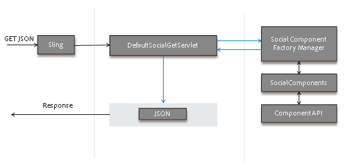

# 社交元件架構 {#social-component-framework}

社交元件架構(SCF)可簡化設定、自訂及擴充伺服器端和使用者端之Communities元件的程式。

此架構的優點：

* **功能**：開箱即用的簡易整合，對80%的使用案例很少自訂或完全不自訂。
* **可外觀化**：CSS樣式的HTML屬性使用方式一致。
* **可擴充**：元件實作是物件導向且符合商業邏輯 — 可輕鬆在伺服器上新增漸進式商業登入。
* **彈性**：簡單無邏輯的JavaScript範本，可輕鬆覆蓋和自訂。
* **可存取**： HTTP API支援從任何使用者端張貼，包括行動應用程式。
* **可攜式**：整合/內嵌至任何建置在任何技術上的任何網頁。

使用互動式瀏覽製作或發佈例項 [社群元件指南](components-guide.md).

## 概觀 {#overview}

在SCF中，元件由SocialComponent POJO、Handlebars JS範本（用於呈現元件）和CSS （用於設定元件樣式）組成。

Handlebars JS範本可延伸模型/檢視JS元件，以處理使用者與使用者端元件之間的互動。

如果元件必須支援資料修改，則可以撰寫SocialComponent API的實作來支援編輯/儲存資料，類似於傳統Web應用程式中的模型/資料物件。 此外，可以新增作業（控制器）和作業服務來處理作業請求、執行商業邏輯，以及叫用模型/資料物件上的API。

SocialComponent API可延伸以提供使用者端檢視層或HTTP使用者端所需的資料。

### 如何為使用者端呈現頁面 {#how-pages-are-rendered-for-client}


### 元件自訂和延伸 {#component-customization-and-extension}

若要自訂或擴充元件，您只需將覆蓋圖和擴充功能寫入/apps目錄，即可簡化升級至未來版本的程式。

* 外觀設定：
   * 僅限 [CSS需要編輯](client-customize.md#skinning-css).
* 外觀與風格：
   * 變更JS範本和CSS。
* 外觀、觸感和UX：
   * 變更JS範本、CSS和 [擴充/覆寫JavaScript](client-customize.md#extending-javascript).
* 若要修改JS範本或GET端點可用的資訊：
   * 擴充 [社交元件](server-customize.md#socialcomponent-interface).
* 若要在作業期間新增自訂處理：
   * 撰寫 [Operationextension](server-customize.md#operationextension-class).
* 若要新增自訂作業：
   * 建立 [Sling貼文操作](server-customize.md#postoperation-class).
   * 使用現有 [OperationServices](server-customize.md#operationservice-class) 視需要。
   * 新增JavaScript程式碼以視需要從使用者端叫用作業。

## 伺服器端架構 {#server-side-framework}

此架構提供API來存取伺服器上的功能，並支援使用者端與伺服器之間的互動。

### Java™ API {#java-apis}

Java™ API提供可輕鬆繼承或子類別的抽象類別和介面。

主要類別的說明請參閱 [伺服器端自訂](server-customize.md) 頁面。

造訪 [儲存資源提供者概觀](srp.md) 瞭解如何使用UGC。

### HTTP API {#http-api}

HTTP API支援輕鬆自訂，並可為PhoneGap應用程式、原生應用程式以及其他整合和混合程式選擇使用者端平台。 此外，HTTP API允許社群網站在沒有使用者端的情況下以服務形式執行，使得框架元件可以整合到任何技術建置的任何網頁中。

### HTTP API -GET要求 {#http-api-get-requests}

框架會為每個SocialComponent提供HTTP型API端點。 透過傳送GET要求至具有「.social.json」選擇器+擴充功能的資源來存取端點。 使用Sling時，請求會傳遞至 `DefaultSocialGetServlet`.

**`DefaultSocialGetServlet`**

1. 將資源(resourceType)傳遞給 `SocialComponentFactoryManager` 並接收能夠選取 `SocialComponent` 代表資源。

1. 叫用工廠並接收 `SocialComponent` 能夠處理資源與要求。
1. 叫用 `SocialComponent`，會處理要求並傳回結果的JSON表示法。
1. 傳回JSON回應給使用者端。

**`GET Request`**

預設的GETservlet會監聽.social.json請求，SocialComponent會以可自訂的JSON回應這些請求。



### HTTP API -POST要求 {#http-api-post-requests}

除了GET（讀取）作業之外，框架還定義了端點模式，以啟用元件上的其他作業，包括建立、更新和刪除。 這些端點是HTTP API，可接受輸入並使用HTTP狀態代碼或JSON回應物件回應。

此框架端點模式可讓CUD作業可擴充、可重複使用且可測試。

**`POST Request`**

每個SocialComponent作業都有SlingPOST：operation。 每個操作的商業邏輯和維護程式碼都包裝在OperationService中，可透過HTTP API或從其他位置以OSGi服務的形式存取。 提供鉤點可支援之前/之後動作的可插接操作延伸模組。


### 儲存資源提供者(SRP) {#storage-resource-provider-srp}

瞭解如何處理 [社群內容存放區](working-with-srp.md)，請參閱：

* [儲存資源提供者概觀](srp.md)  — 簡介和存放庫使用概述。
* [srp和UGC Essentials](srp-and-ugc.md) - SRP API公用程式方法與範例。
* [使用SRP存取UGC](accessing-ugc-with-srp.md)  — 程式碼指南。

### 伺服器端自訂 {#server-side-customizations}

造訪 [伺服器端自訂](server-customize.md) 有關在伺服器端自訂Communities元件之商業邏輯和行為的資訊。

## Handlebars JS範本語言 {#handlebars-js-templating-language}

新架構中比較明顯的變更之一，就是使用了 `Handlebars JS` (HBS)範本化語言，伺服器使用者端轉譯的常用開放原始碼技術。

HBS指令碼簡單、不含邏輯、可在伺服器和使用者端上編譯、易於覆蓋和自訂，且會與使用者端UX自然繫結，因為HBS支援使用者端轉譯。

此架構提供數個 [Handlebars協助程式](handlebars-helpers.md) 在開發SocialComponents時很有用。

在伺服器上，當Sling解析GET請求時，它會識別用於回應請求的指令碼。 如果指令碼是HBS範本(.hbs)，Sling會將請求委派給Handlebars引擎。 接著Handlebars引擎會從適當的SocialComponentFactory取得SocialComponent、建置上下文，然後轉譯HTML。

### 無存取限制 {#no-access-restriction}

Handlebars (HBS)範本檔案(.hbs)類似於.jsp和.html範本檔案，但它們可用於在使用者端瀏覽器和伺服器上呈現。 因此，請求使用者端範本的使用者端瀏覽器會從伺服器接收.hbs檔案。

這要求Sling搜尋路徑中的所有HBS範本（/libs/或/apps下的任何.hbs檔案）可由任何使用者從製作或發佈中擷取。

可能無法禁止對.hbs檔案的HTTP存取。

### 新增或包含Communities元件 {#add-or-include-a-communities-component}

大部分的Communities元件必須 *已新增* 作為Sling可定址資源。 Communities的部分元件可能是 *已包含* 在非現有資源範本中，允許動態包含和自訂寫入使用者產生內容(UGC)的位置。

無論是哪種情況，元件的 [必要的使用者端程式庫](clientlibs.md) 也必須出現。

**新增元件**

新增元件是指新增資源（元件）例項的程式，例如從元件瀏覽器(sidekick)拖曳至作者編輯模式下的頁面時。

結果為par節點下的JCR子節點，該節點為Sling可定址。

**包含元件**

包含元件是指將參照加入至元件的 [「不存在」資源](srp.md#for-non-existing-resources-ners) （無JCR節點），例如使用指令碼語言。

截至Adobe Experience Manager (AEM) 6.1，當動態包含元件而非新增元件時，即可在作者中編輯元件的屬性 *設計* 模式。

您只能動態納入少數AEM Communities元件。 它們是：

* [評論](essentials-comments.md)
* [評等](rating-basics.md)
* [評論](reviews-basics.md)
* [投票](essentials-voting.md)

此 [社群元件指南](components-guide.md) 允許將包含元件從新增到包含之間切換。

**使用Handlebars時** 範本化語言，非現有資源會使用 [包含協助程式](handlebars-helpers.md#include) 透過指定其resourceType：

`{{include this.id path="comments" resourceType="social/commons/components/hbs/comments"}}`

**使用JSP時**，使用標籤包含資源 [cq：include](../../help/sites-developing/taglib.md#lt-cq-include)：

```
<cq:include path="votes"
 resourceType="social/tally/components/voting" />
```

>[!NOTE]
>
>若要以動態方式將元件新增至頁面，而非將元件新增或納入範本，請參閱 [元件側載](sideloading.md).

### Handlebars協助程式 {#handlebars-helpers}

另請參閱 [SCF Handlebars協助程式](handlebars-helpers.md) 以取得SCF中可用的自訂協助程式清單和說明。

## 使用者端架構 {#client-side-framework}

### 模型檢視JavaScript架構 {#model-view-javascript-framework}

此架構包含 [Backbone.js](https://backbonejs.org/)，此元件為模型檢視JavaScript架構，可協助開發豐富的互動式元件。 物件導向的性質支援可擴充/可重複使用的架構。 HTTP API可簡化使用者端與伺服器之間的通訊。

此架構使用伺服器端Handlebars範本來呈現使用者端的元件。 這些模型是根據HTTP API產生的JSON回應。 檢視會將自身繫結到Handlebars範本產生的HTML，並提供互動功能。

### CSS慣例 {#css-conventions}

以下是定義和使用CSS類別的建議慣例：

* 使用明確命名的CSS類別選擇器名稱並避免泛型名稱，例如「heading」和「image」。
* 定義特定的類別選取器樣式，讓CSS樣式表可以搭配頁面上的其他元素和樣式正常運作。 例如：`.social-forum .topic-list .li { color: blue; }`
* 針對由JavaScript驅動的UX，將用於樣式設定的CSS類別與用於UX的CSS類別分開。

### 使用者端自訂 {#client-side-customizations}

若要自訂使用者端上Communities元件的外觀和行為，請參考 [使用者端自訂](client-customize.md)，包括下列專案的資訊：

* [覆蓋](client-customize.md#overlays)
* [擴充功能](client-customize.md#extensions)
* [HTML標籤](client-customize.md#htmlmarkup)
* [建立CSS外觀](client-customize.md#skinning-css)
* [擴充JavaScript](client-customize.md#extending-javascript)
* [適用於SCF的Clientlibs](client-customize.md#clientlibs-for-scf)

## 功能和元件要點 {#feature-and-component-essentials}

有關開發人員的基本資訊，請參閱 [功能和元件要點](essentials.md) 區段。

如需其他開發人員資訊，請參閱 [編碼准則](code-guide.md) 區段。

## 疑難排解 {#troubleshooting}

常見問題和已知問題的說明，請參見 [疑難排除](troubleshooting.md) 區段。
