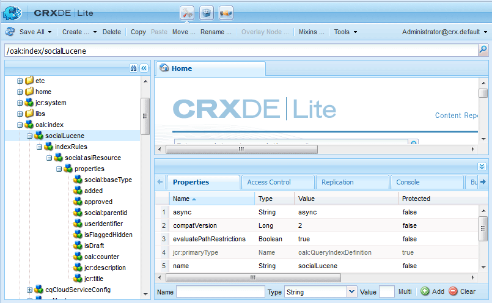

# 搜索要件 {#search-essentials}

## 概觀 {#overview}

搜索功能是AEM Communities的一個基本功能。 除 [AEM平台搜索](../../help/sites-deploying/queries-and-indexing.md) 功能，AEM Communities提供 [UGC搜索API](#ugc-search-api) 用於搜索用戶生成的內容(UGC)。 UGC具有唯一屬性，因為它是與其他內容和用戶資料分AEM開輸入和儲存的。

對於社區，通常搜索的兩個內容是：

* 社區成員發佈的內容

   * 使用AEM社區的UGC搜索API。

* 用戶和組（用戶資料）

   * 使用平AEM台搜索功能。

文檔的這一部分對建立建立或管理UGC的自定義元件的開發人員很有興趣。

## 安全和陰影節點 {#security-and-shadow-nodes}

對於自定義元件，必須使用 [社會資源實用程式](socialutils.md#socialresourceutilities-package) 的雙曲餘切值。 建立和搜索UGC的實用程式方法將建立所需的 [陰影節點](srp.md#about-shadow-nodes-in-jcr) 並確保成員對請求具有正確的權限。

未通過SRP實用程式管理的是與審核相關的屬性。

請參閱 [SRP和UGC軟體包](srp-and-ugc.md) 有關用於訪問UGC和ACL卷影節點的實用程式方法的資訊。

## UGC搜索API {#ugc-search-api}

的 [UGC公用商店](working-with-srp.md) 由多種儲存資源提供器(SRP)之一提供，每個提供器可能具有不同的本機查詢語言。 因此，無論選擇何種SRP，自定義代碼都應使用 [UGC API包](https://helpx.adobe.com/experience-manager/6-5/sites/developing/using/reference-materials/javadoc/com/adobe/cq/social/ugc/api/package-summary.html) (*com.adobe.cq.social.ugc.api*)，它將調用適合所選SRP的查詢語言。

### ASRP搜索 {#asrp-searches}

對於 [ASRP](asrp.md),UGC儲存在Adobe雲中。 雖然UGC在CRX中不可見， [緩和](moderate-ugc.md) 在作者和發佈環境中都可用。 使用 [UGC搜索API](#ugc-search-api) 對於ASRP的工作方式與其他SRP相同。

當前不存在用於管理ASRP搜索的工具。

建立可搜索的自定義屬性時，必須遵循 [命名要求](#naming-of-custom-properties)。

### MSRP搜索 {#msrp-searches}

對於 [MSRP](msrp.md), UGC儲存在配置為使用Solr進行搜索的MongoDB中。 UGC在CRX中不可見，但 [緩和](moderate-ugc.md) 在作者和發佈環境中都可用。

關於MSRP和Solr:

* 平台的嵌入式AEMSolr不用於MSRP。
* 如果將遠程Solr用AEM於平台，則可以與MSRP共用，但應使用不同的集合。
* Solr可配置用於標準搜索或多語言搜索(MLS)。
* 有關配置詳細資訊，請參閱 [Solr配置](msrp.md#solr-configuration) MSRP。

自定義搜索功能應使用 [UGC搜索API](#ugc-search-api)。

建立可搜索的自定義屬性時，必須遵循 [命名要求](#naming-of-custom-properties)。

### JSRP搜索 {#jsrp-searches}

對於 [JSRP](jsrp.md), UGC儲存在 [橡樹](../../help/sites-deploying/platform.md) 並且僅在輸入該作者或發AEM布實例的儲存庫中可見。

由於UGC通常在發佈環境中輸入，因此對於多發佈者生產系統，必須配置 [發佈群集](topologies.md)，而不是發佈場，以便所有發佈者都可以看到輸入的內容。

對於JSRP，在發佈環境中輸入的UGC在作者環境中永遠不會可見。 所以 [緩和](moderate-ugc.md) 任務在發佈環境中發生。

自定義搜索功能應使用 [UGC搜索API](#ugc-search-api)。

#### 橡樹索引 {#oak-indexing}

雖然Oak索引不會自動為平台搜索創AEM建，但從AEM6.2開始，它們已經為AEM Communities添加，以在顯示UGC搜索結果時提高效能並提供分頁支援。

如果自定義屬性正在使用，並且搜索速度慢，則需要為自定義屬性建立附加索引，以使其效能更高。 要保持便攜性，請 [命名要求](#naming-of-custom-properties) 建立可搜索的自定義屬性時。

要修改現有索引或建立自定義索引，請參閱 [Oak查詢和索引](../../help/sites-deploying/queries-and-indexing.md)。

的 [Oak索引管理器](https://adobe-consulting-services.github.io/acs-aem-commons/features/oak-index-manager.html) 可從ACS公AEM域獲得。 它提供：

* 現有索引的視圖。
* 啟動重新索引的能力。

查看中的現有Oak索引 [CRXDE Lite](../../help/sites-developing/developing-with-crxde-lite.md)，位置為：

* `/oak:index/socialLucene`



## 索引搜索屬性 {#indexed-search-properties}

### 預設搜索屬性 {#default-search-properties}

以下是用於各種社區功能的一些可搜索屬性：

| **屬性** | **資料類型** |
|---|---|
| 已標籤 | *布林值* |
| 是垃圾郵件 | *布林值* |
| 讀 | *布林值* |
| 影響 | *布林值* |
| 附件 | *布林值* |
| 情緒 | *長整數* |
| 已標籤 | *布林值* |
| 已新增 | *日期* |
| 修改日期 | *日期* |
| 狀態 | *字串* |
| 用戶標識符 | *字串* |
| 回復 | *長整數* |
| jcr:title | *字串* |
| jcr：說明 | *字串* |
| sling:resourceType | *字串* |
| allowThreadedReply | *布林值* |
| 為草稿 | *布林值* |
| 發佈日期 | *日期* |
| 發佈作業ID | *字串* |
| 已回答 | *布林值* |
| 喬森納 | *布林值* |
| 標籤 | *字串* |
| cq：標籤 | *字串* |
| 作者_顯示_名稱 | *字串* |
| 位置 | *字串* |
| 父路徑 | *字串* |
| 父標題 | *字串* |

### 自定義屬性的命名 {#naming-of-custom-properties}

添加自定義屬性時，以便這些屬性對使用 [UGC搜索API](#ugc-search-api)，它 *要求* 將尾碼添加到屬性名稱中。

尾碼用於使用架構的查詢語言：

* 它將屬性標識為可搜索。
* 它標識資料類型。

Solr是使用架構的查詢語言的示例。

| **字尾** | **資料類型** |
|---|---|
| _b | *布林值* |
| _dt | *日曆* |
| _d | *雙精度* |
| _tl | *長整數* |
| _s | *字串* |
| _t | *文字* |

**附註:**

* *文本* 是一個標籤字串， *字串* 不。 使用 *文本* 模糊搜索（更類似）。

* 對於多值類型，將「s」添加到尾碼，例如：

   * `viewDate_dt`:單日期屬性
   * `viewDates_dts`:日期屬性清單

## 篩選條件 {#filters}

包含 [注釋系統](essentials-comments.md) 支援將篩選器參數添加到其端點。

AND和OR邏輯的篩選器語法如下所示（在編碼URL之前顯示）:

* 要指定OR，請使用一個帶逗號分隔值的篩選器參數：

   * `filter=name eq 'Jennifer',name eq 'Jen'`

* 要指定AND，請使用多個篩選器參數：

   * `filter = name eq 'Jackson'&filter=message eq 'testing'`

的預設實現 [搜索元件](search.md) 使用此語法，如在中開啟「搜索結果」頁的URL中可看到的 [社區元件指南](components-guide.md)。 要進行實驗，請瀏覽到 [http://localhost:4503/content/community-components/en/search.html](http://localhost:4503/content/community-components/en/search.html)。

篩選器運算子為：

| 情商 | 等於 |
|---|---|
| 新 | 不等於 |
| LT | 小於 |
| LTE | 小於或等於 |
| GE | 大於 |
| GTE | 大於或等於 |
| 喜歡 | 模糊匹配 |

URL引用社區元件（資源），而不是放置該元件的頁，這一點很重要：

* 正確：論壇元件
   * `/content/community-components/en/forum/jcr:content/content/forum.social.json`
* 錯誤：論壇頁面
   * `/content/community-components/en/forum.social.json`

## SRP工具 {#srp-tools}

有一個Adobe Marketing CloudGitHub項目，其中包含：

[AEM CommunitiesSRP工具](https://github.com/Adobe-Marketing-Cloud/aem-communities-srp-tools)

此儲存庫包含用於管理SRP中資料的工具。

目前，有一個Servlet提供從任何SRP中刪除所有UGC的功能。

例如，要刪除ASRP中的所有UGC:

```shell
curl -X POST http://localhost:4502/services/social/srp/cleanup?path=/content/usergenerated/asi/cloud -uadmin:admin
```

## 疑難排解 {#troubleshooting}

### 索爾查詢 {#solr-query}

要幫助解決Solr查詢問題，請啟用DEBUG日誌記錄

`com.adobe.cq.social.srp.impl.SocialSolrConnector`。

實際的Solr查詢將顯示在調試日誌中編碼的URL:

要解決的查詢是： `sort=timestamp+desc&bl=en&pl=en&start=0&rows=10 &q=%2Btitle_t:(hello)+%2Bprovider_id:\/content/usergenerated/asi/mongo/content/+%2Bresource_type_s:&df=provider_id&trf=verbatim&fq={!cost%3D100}report_suite:mongo`

的值 `q` 參數是查詢。 一旦URL編碼被解碼，該查詢就可以傳遞到Solr Admin Query工具，以便進一步調試。

## 相關資源 {#related-resources}

* [社區內容儲存](working-with-srp.md)  — 討論UGC公用儲存的可用SRP選項。
* [儲存資源提供程式概述](srp.md)  — 簡介和儲存庫使用概述。
* [使用SRP訪問UGC](accessing-ugc-with-srp.md)  — 編碼准則。
* [SocialUtils重構](socialutils.md)  — 替換SocialUtils的SRP的實用程式方法。
* [搜索和搜索結果元件](search.md)  — 將UGC搜索功能添加到模板。
