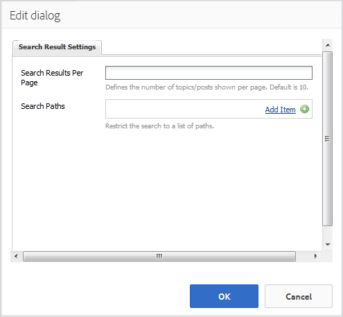

# 搜索功能 {#search-feature}

該搜索功能可與各種其它功能（如論壇）配合使用，以提供搜索內容的能力。

添加搜索社區成員輸入的帖子(稱為用戶生成內容(UGC))的功能時，有兩個元件： [搜索](#search) 和 [搜索結果](#search-results)。

包含 `Search Results` 元件支援搜索和結果顯示。

包含 `Search` 元件提供了啟動搜索的位置，結果將出現在 `Search Results` 的子菜單。

該搜索特徵可以與允許站點訪問者和成員查看內容的任何其他特徵一起使用。

## 搜尋 {#search-features}

### 將搜索添加到頁面 {#add-search-to-a-page}

添加 `Search` 在作者模式下對頁面的元件，使用元件瀏覽器查找 `Communities / Search` 然後拖到頁面上。 使用 `Search` 需要第二頁 `Search Results.`

如需必要資訊，請訪問 [社區元件基礎](basics.md)。

當所需的客戶端庫時， `cq.social.hbs.search`，包括，這是 `Search` 元件。

### 配置添加的搜索 {#configure-the-added-search}

選取已放置的 `Search` 要訪問和選擇的元件 `Configure` 表徵圖。

在 **[!UICONTROL 搜索設定]** 頁籤，指定訪問者輸入查詢時搜索的路徑。

* **[!UICONTROL 搜索路徑]**
通過使用「添加項」按鈕添加搜索路徑，內容搜索受到限制。 例如，要將搜索限制到特定論壇，請選擇位於頁面中的論壇元件：

   * `/content/community-components/en/forum/jcr:content/content/forum`

* **[!UICONTROL 結果頁]**
結果將顯示在使用瀏覽器選擇包含 
`Search Results` 元件.

## 搜尋結果 {#search-results}

### 將搜索結果添加到頁面 {#add-search-results-to-a-page}

添加 `Search Results` 在作者模式下對頁面的元件，使用元件瀏覽器查找

* `Communities / Search Results`

然後拖到頁面上。 與搜索元件不同，不需要第二頁，因為結果將顯示在同一頁上。

如果在網站的其他位置使用「搜索」，則此頁面 `Search Results` 可以配置為 `Result Page` 對於任何或所有實例 `Search`。

如需必要資訊，請訪問 [社區元件基礎](basics.md)。

當所需的客戶端庫時， `cq.social.hbs.search`，包括，這是 `Search Result` 元件將出現：

### 配置添加的搜索結果 {#configure-the-added-search-result}

選取已放置的 `Search Results` 要訪問和選擇的元件 `Configure` 表徵圖。

在 **[!UICONTROL 搜索結果設定]** 頁籤中，可以指定訪問者輸入查詢時搜索中包含的路徑。

* **[!UICONTROL 每頁搜尋結果數]**

   定義每頁顯示的主題/帖子數。 預設值為10。

* **[!UICONTROL 搜索路徑]**

   通過使用「添加項」按鈕添加搜索路徑，內容搜索受到限制。

## 其他資訊 {#additional-information}

有關 [搜索要件](search-implementation.md) 頁面。
