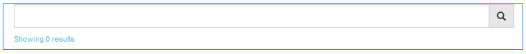

# 搜尋功能 {#search-feature}

搜尋功能可與各種其他功能（例如論壇）搭配使用，以提供搜尋內容的功能。

新增搜尋由社群成員輸入的貼文(稱為使用者產生的內容(UGC))的功能時，有兩個元件： [搜尋](#search)和[搜尋結果](#search-results)。

包含`Search Results`元件的頁面同時支援搜尋和顯示結果。

包含`Search`元件的頁面提供啟動搜尋的位置，搜尋結果會顯示在`Search Results`頁面上。

搜尋功能可與任何其他可讓網站訪客和成員檢視內容的功能搭配使用。

## 搜尋 {#search-features}

### 將搜尋新增至頁面 {#add-search-to-a-page}

若要將`Search`元件新增至作者模式的頁面，請使用元件瀏覽器來找到`Communities / Search`並將其拖曳至頁面上的適當位置。 使用`Search`需要`Search Results.`的第二頁

如需必要資訊，請造訪[社群元件基本知識](basics.md)。

當包含必要的使用者端程式庫`cq.social.hbs.search`時，`Search`元件的顯示方式如下。

### 設定新增的搜尋 {#configure-the-added-search}

選取要存取的置入`Search`元件，並選取開啟編輯對話方塊的`Configure`圖示。

在&#x200B;**[!UICONTROL 搜尋設定]**&#x200B;索引標籤下，指定當訪客輸入查詢時如何搜尋路徑。

* **[!UICONTROL 搜尋路徑]**
透過使用新增專案按鈕新增搜尋路徑，內容搜尋受到限制。 例如，若要將搜尋限制在特定論壇，請選取放置在頁面中的論壇元件：

   * `/content/community-components/en/forum/jcr:content/content/forum`

* **[!UICONTROL 結果頁面]**
結果將出現在使用瀏覽器選取包含`Search Results`元件的頁面所指定的個別頁面上。

## 搜尋結果 {#search-results}

### 將搜尋結果新增至頁面 {#add-search-results-to-a-page}

若要將`Search Results`元件新增至作者模式的頁面，請使用元件瀏覽器來尋找

* `Communities / Search Results`

並將其拖曳至頁面上的適當位置。 與搜尋元件不同，不需要第二個頁面，因為結果將顯示在同一頁面上。

如果在網站內的其他位置使用「搜尋」，這個含有`Search Results`的頁面可設定為`Search`的任何或所有執行個體的`Result Page`。

如需必要資訊，請造訪[社群元件基本知識](basics.md)。

當包含必要的使用者端程式庫`cq.social.hbs.search`時，`Search Result`元件的顯示方式如下：

### 設定新增的搜尋結果 {#configure-the-added-search-result}

選取要存取的置入`Search Results`元件，並選取開啟編輯對話方塊的`Configure`圖示。

在&#x200B;**[!UICONTROL 搜尋結果設定]**&#x200B;索引標籤下，可以指定當訪客輸入查詢時，搜尋中包含哪些路徑。

* 每頁&#x200B;**[!UICONTROL 個搜尋結果]**

  定義每個頁面顯示的主題/帖子數。 預設值為10。

* **[!UICONTROL 搜尋路徑]**

  透過使用新增專案按鈕新增搜尋路徑，內容搜尋受到限制。

## 其他資訊 {#additional-information}

如需開發人員的[Search Essentials](search-implementation.md)頁面上的詳細資訊。
