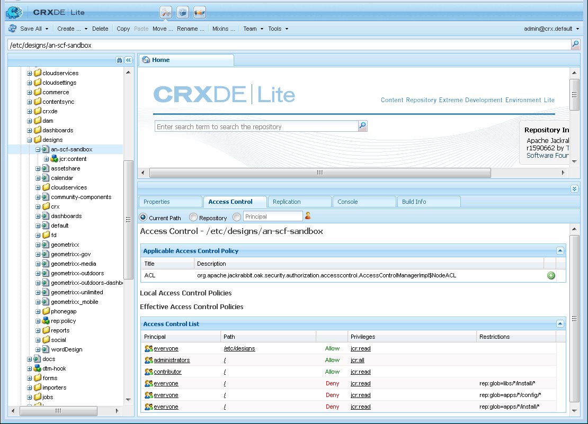

# 設定網站結構 {#setup-website-structure}

要設定網站，以下說明將介紹要在以下位置建立的資料夾：

* `/apps/an-scf-sandbox`

   這是自定義應用程式和模板所在的位置。

* `/etc/designs/an-scf-sandbox`

   這是可下載設計元素所在的位置。

* `/content/an-scf-sandbox`

   這是可下載網頁所在的位置。

本教程中的代碼將依賴於應用程式、設計和內容的主資料夾名稱相同。 如果為網站選擇其他名稱，則始終替換 `an-scf-sandbox` 你選的名字。

>[!NOTE]
>
>關於名稱：
>
>* CRXDE中看到的名稱是構成可定址內容路徑的節點名稱。
>* 節點名稱可能包含空格，但在URI中使用時，必須將空格編碼為「%20」或「+」。
>* 節點名稱可能包含連字元和下划線，但當作為Java檔案中的包名引用時，必須對它們進行編碼。 連字元和下划線都用下划線和其unicode值進行轉義：
   >
   >   * 連字元變為「_002d」
   >   * 下划線變為「_005f」

## 設定應用程式目錄(/apps) {#setup-the-application-directory-apps}

儲存庫中的/apps目錄包含用於實現從/content目錄提供的頁面的行為和呈現的代碼。

/apps目錄受保護，並且不能像/content和/etc/designs目錄那樣公開訪問。

1. 建立 `/apps/an-scf-sandbox` 的子菜單。

   使用 **[!UICONTROL CRXDE Lite]**，在瀏覽器窗格中

   1. 選擇 `/apps` 的子菜單。
   1. 按一下右鍵 **[!UICONTROL 建立]**...或者下拉 **[!UICONTROL 建立……]** 的子菜單。
   1. 選擇 **[!UICONTROL 建立資料夾……]**。
   1. 在 **[!UICONTROL 建立資料夾]** 對話框，輸入 `an-scf-sandbox`。
   1. 按一下&#x200B;**[!UICONTROL 「確定」]**。

1. 建立 **[!UICONTROL 元件]** 子資料夾。

   1. 選擇 `/apps/an-scf-sandbox` 的子菜單。
   1. 按一下 **[!UICONTROL 「建立」>「建立資料夾」]**。
   1. 在 **[!UICONTROL 建立資料夾]** 對話框，輸入 **[!UICONTROL 元件]**。
   1. 按一下&#x200B;**[!UICONTROL 「確定」]**。

1. 建立 **[!UICONTROL 模板]** 子資料夾。

   1. 選擇 `/apps/an-scf-sandbox` 的子菜單。
   1. 按一下 **[!UICONTROL 「建立」>「建立資料夾」]**。
   1. 在 **[!UICONTROL 建立資料夾]** 對話框，輸入 **[!UICONTROL 模板]**。
   1. 按一下&#x200B;**[!UICONTROL 「確定」]**。
   1. 重新選擇 `/apps/an-scf-sandbox`。
   1. 選擇 **[!UICONTROL 全部保存]**。

   與任何編輯過程一樣，經常保存。 如果您在輸入資料時遇到問題，可能是因為登錄已超時，或者您需要保存以前的編輯。

1. 現在，CRXDE Lite的瀏覽器窗格中的結構應如下所示：

   

## 設定設計目錄(/etc/designs) {#setup-the-design-directory-etc-designs}

/etc/designs目錄包含要與頁面內容一起下載的影像、指令碼和樣式表。

1. 要在經典用戶介面中使用設計器工具，請瀏覽至 [https://&lt;server>:&lt;port>/miscadmin](http://localhost:4502/miscadmin)。

   注：如果使用CRXDE Lite建立類型的節點 `cq:Page`，「訪問控制」和「複製」不會設定為頁面的預設設定。

1. 在瀏覽器窗格中，選擇 **[!UICONTROL 設計]** 資料夾，然後按一下 **[!UICONTROL 新建]** > **[!UICONTROL 新建頁面]**。

   輸入：

   * 標題： **[!UICONTROL SCF沙盒]**
   * 名稱： **[!UICONTROL 一個SCF沙盒]**
   * 選擇 **[!UICONTROL 設計頁模板]**

   按一下&#x200B;**[!UICONTROL 建立]**。

   

1. 如果未顯示「SCF沙盒」資料夾，請刷新瀏覽器窗格。

1. 返回CRXDE Lite(http:// localhost:4502/crx/de)，然後展開/etc/designs，查看名為&quot;an-scf-sandbox&quot;的節點。

   在CRXDE的右下窗格中，可以查看「屬性」頁籤、「訪問控制」頁籤和「複製」頁籤，以查看使用「設計頁模板」定義的內容。

   

## 設定內容目錄(/content) {#setup-the-content-directory-content}

儲存庫中的/content目錄是網站內容所在的位置。 /content下的路徑包括瀏覽器請求的URL路徑。

*之後* 這樣 [頁面模板](initial-app.md#createthepagetemplate) 作為初始應用程式的一部分建立，可基於模板建立初始頁面內容……。 [**⇒**](initial-app.md)
