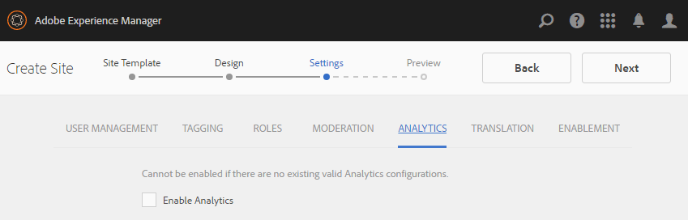

# 社區站點控制台 {#communities-sites-console}

「社區站點」控制台提供對以下內容的訪問：

* 網站建立
* 網站編輯
* 站點管理
* [建立和編輯嵌套組](/help/communities/groups.md) （子社區）

請參閱 [AEM Communities入門](/help/communities/getting-started.md) 體驗在作者環境中建立社區網站的速度，以及如何從作者和發佈環境建立社區組。

>[!NOTE]
>
>建立的主要社區菜單 [社區站點](/help/communities/sites-console.md)。 [社區網站模板](/help/communities/sites.md)。 [社區組模板](/help/communities/tools-groups.md) 和 [社區功能](/help/communities/functions.md) 僅在作者環境中使用。

## 必備條件 {#prerequisites}

在建立社區站點之前，它 *要求* 至：

* 確保一個或多個發佈實例正在運行。
* 啟用 [隧道服務](/help/communities/deploy-communities.md#tunnel-service-on-author) 管理成員和成員組。
* 確定 [主發佈者](/help/communities/deploy-communities.md#primary-publisher)。
* [配置複製](/help/communities/deploy-communities.md#replication-agents-on-author) 主發佈伺服器埠不是預設埠(4503)。

最佳做法是，為確保站點準備好支援許多功能，請執行以下步驟：

* 安裝 [最新功能包](/help/communities/deploy-communities.md#latestfeaturepack)。
* 啟用 [Adobe Analytics](/help/communities/analytics.md) AEM Communities。
* 配置 [電子郵件](/help/communities/email.md)
* 識別 [社區管理員](/help/communities/users.md#creating-community-members)。
* [啟用OAuth處理程式](/help/communities/social-login.md#adobe-granite-oauth-authentication-handler) 進行社交登錄。

## 訪問社區站點控制台 {#accessing-communities-sites-console}

在作者環境中，要訪問社區站點控制台：

* 從全局導航： **[!UICONTROL 社區]** > **[!UICONTROL 站點]**

「社區站點」控制台顯示任何現有的社區站點。 在此控制台中，可以建立、編輯、管理和刪除社區站點。

要建立新社區網站，請選擇 **建立** 表徵圖

要訪問現有社區網站，為了創作、修改、發佈、導出或添加嵌套組，請選擇網站的資料夾表徵圖。

## 建立網站 {#site-creation}

站點建立控制台提供了一種逐步方法，以基於選定的 [社區網站模板](/help/communities/sites.md) 和設定。

建立的每個站點都包括登錄功能，因為站點訪問者必須先登錄才能發佈內容、發送消息或參與組。 其他包括的功能包括用戶配置檔案、消息、通知、站點菜單、搜索、主題和品牌。

通過選擇 `Create` 按鈕。

建立過程是一系列步驟，這些步驟被呈現為包含要配置的一組特徵的面板（被呈現為子面板）。 可以向 **下一個** 步驟或 **後退** 在最後一步中提交站點之前，先執行上一步。

### 步驟1 :站點模板 {#step-site-template}

在「站點模板」面板上，指定「標題」、「說明」、「站點根」、「基本語言」、「名稱」和「站點模板」：

* **社群網站標題**

   站點的顯示標題。

   標題將出現在已發佈的站點以及站點管理員UI中。

* **社群網站說明**

   站點的說明。

   該說明未出現在發佈的站點上。

* **社區站點根**

   站點的根路徑。

   預設根為 `/content/sites`，但根目錄可移到網站中的任何位置。

* **社群網站基本語言**

   (對於單語言，保留原狀：英語)使用下拉菜單選擇一個 *或* 基本語言 — 德語、義大利語、法語、日語、西班牙語、葡萄牙語（巴西）、中文（繁體）和簡體中文。 將為添加的每種語言建立一個社區站點，並且按照中介紹的最佳做法存在於同一站點資料夾中 [翻譯多語言站點的內容](/help/sites-administering/translation.md)。 每個站點的根頁將包含一個子頁，該子頁由所選語言之一的語言代碼命名，如英語的「en」或法語的「fr」。

* **社群網站名稱**:

   顯示在URL中的站點根頁的名稱。

   * 在建立站點後，由於名稱不易更改，請按兩下該名稱。
   * 基本URL( `https://server:port/site root/site name)` 將顯示在下面 `Community Site Name`。

   * 對於有效的URL，請附加基本語言代碼+ &quot;。html&quot;

      *例如*。 `https://localhost:4502/content/sites/mysight/en.html`

* **社區網站模板** 菜單

   使用下拉菜單選擇可用 [社區網站模板](/help/communities/tools.md)。

* 選擇 **下一個**。

### 第2步：設計 {#step-design}

「設計」面板包含2個子面板，用於選擇主題和品牌標題：

#### 社區網站主題 {#community-site-theme}

框架使用 `Twitter Bootstrap` 為現場提供快速靈活的設計。 可以選擇多個預載的Bootstrap主題之一以對所選社區網站模板進行樣式化，或者可以上載Bootstrap主題。

選中後，主題將用不透明的藍色複選標籤疊印。

發佈社區網站後， [編輯屬性](#modifying-site-properties) 並選擇其他主題。

#### 社區網站品牌 {#community-site-branding}

社區網站品牌推廣是顯示為每個頁面頂部標題的影像。

影像的大小應與瀏覽器中頁面的預期顯示大小相同，高度應為120像素。

建立或選擇影像時，請牢記：

* 影像高度將從影像的上邊緣裁切到120個像素。
* 影像被固定到瀏覽器窗口的左邊緣。
* 影像沒有調整大小，因此當影像寬度為……

   * 小於瀏覽器的寬度，影像將水準重複。
   * 大於瀏覽器的寬度，影像將被裁剪。

* 選擇 **下一個**。

### 第3步：設定 {#step-settings}

「設定」面板包含幾個子面板，這些子面板在轉到建立站點的最後一步之前顯示要配置的功能。

* [用戶管理](#user-management)
* [標籤](#tagging)
* [角色](#roles)
* [審核](#moderation)
* [分析](#analytics)
* [翻譯](#translation)

>[!NOTE]
>
>**啟用隧道服務**
>
>幾個「設定」子面板允許分配受信任成員以調節UGC、管理組或作為聯繫人以在發佈環境中啟用資源。
>
>公約是為了發佈方 [用戶和用戶組](/help/communities/users.md) （成員和成員組）。
>
>因此，當在作者環境中建立社區站點並將受信任的成員分配給各種角色時，需要從發佈環境中檢索成員資料。
>
>這是通過 ` [AEM Communities Publish Tunnel Service](/help/communities/deploy-communities.md#tunnel-service-on-author)` 為作者提供環境。

#### 用戶管理 {#user-management}

* **允許使用者註冊**

   如果選中，站點訪問者可以通過自註冊成為社區成員。
如果未選中，則社區站點 *限制* 並且必須將站點訪問者分配給社區站點的成員組、發出請求或通過電子郵件發送邀請。 如果未選中，則不允許匿名訪問。
取消選中 *私* 社區網站。 選中預設值。

* **允許匿名存取**

   如果選中，則社區站點是*open * ，任何站點訪問者都可以訪問該站點。
如果未選中，則只有登錄成員才能訪問該站點。
取消選中*private *community站點。 選中預設值。

* **允許傳訊**

   如果選中，成員可以向彼此發送消息併發送到社區站點內的組。
如果未選中，則不為社區設定消息。
未選中預設值。

* **允許社交登入: Facebook**

   如果選中，允許站點訪問者使用其Facebook帳戶憑據登錄。 所選 [Facebook雲配置](/help/communities/social-login.md#create-a-facebook-connect-cloud-service) 應配置為在建立社區站點後將用戶添加到社區站點的成員組。
如果未選中，則不顯示Facebook登錄。
對於 *私* 社區網站。 未選中預設值。

* **允許社交登入: Twitter**

   如果選中，允許站點訪問者使用其Twitter帳戶憑據登錄。 所選 [Twitter雲配置](/help/communities/social-login.md#create-a-twitter-connect-cloud-service) 應配置為在建立社區站點後將用戶添加到社區站點的成員組。
如果未選中，則不顯示Twitter登錄。
對於 *私* 社區網站。 未選中預設值。

>[!NOTE]
>
>**允許社交登錄**
>
>雖然Facebook和Twitter配置示例可能存在，並且可以選擇， [生產環境](/help/sites-administering/production-ready.md)需要建立自定義的Facebook和Twitter應用程式。 請參閱 [與Facebook和Twitter社會登錄](/help/communities/social-login.md)。

#### 標籤 {#tagging}

通過選擇以前通過 [標籤控制台](/help/sites-administering/tags.md#tagging-console)。

此外，為社區站點選擇標籤命名空間會限制在定義目錄和資源時顯示的選擇。

* 文本搜索框：開始鍵入以標識允許在站點上使用的標籤。

#### 角色 {#roles}

的 [社區成員的角色](/help/communities/users.md) 已分配這些設定。

使用「提前類型搜索」可輕鬆查找社區成員。

* **社群管理員**

   開始鍵入以選擇一個或多個可管理社區成員和成員組的社區成員或成員組。

* **社群版主**

   開始鍵入以選擇一個或多個社區成員或成員組，這些成員組將作為用戶生成內容的審閱者受信任。

* **社群有特殊權限的成員**

   開始鍵入以選擇一個或多個社區成員或成員組，以便在 `Allow Privileged Member` 已為 [社區功能](/help/communities/functions.md)。

* **社群管理員**

   開始鍵入以選擇一個或多個站點管理員，這些管理員可以獨立於其他站點管理員和預設社區管理員處理站點結構。 它們可以在層次結構的任何級別建立組，並成為嵌套組的預設管理員（但以後可以從嵌套組的管理員角色中刪除這些組）。

#### 審核 {#moderation}

用於調節用戶生成的內容(UGC)的全局設定由這些設定控制。 單個元件具有控制調節的附加設定。

* **內容已預先審核**

   如果選中，則在版主批准之前不會顯示已發佈的社區內容。 未選中預設值。 有關詳細資訊，請參見 [調節社區內容](/help/communities/moderate-ugc.md#premoderation)。

* **隱藏內容之前的標幟臨界值**

   如果大於0，則在將主題或帖子隱藏到公共視圖之前必須標籤的次數。 如果設定為–1，則標籤的主題或帖子永遠不會隱藏在公共視圖中。 預設值為5。

#### 分析 {#analytics}

* **啟動 Analytics**

   僅在Adobe Analytics [配置](/help/communities/analytics.md) 框中。
未選中預設值。 選中後，將出現附加的選擇菜單：

* **雲端設定框架引用**

   從下拉菜單中，選擇為此社區站點配置的分析雲服務框架。
   `Communities` 是框架示例 [社區功能的分析配置](/help/communities/analytics.md#aem-analytics-framework-configuration) 文檔。

#### 翻譯 {#translation}

* **允許機器翻譯**

   選中（未選中預設值）後，將為站點中的UGC啟用機器翻譯。 這不會影響任何其他內容，例如頁面內容，即使該站點被設定為多語言站點。 請參閱 [翻譯用戶生成的內容](/help/communities/translate-ugc.md) 有關為AEM Communities配置授權翻譯服務的資訊。 請參閱 [翻譯多語言站點的內容](/help/sites-administering/translation.md) 的子菜單。

* **為選取的語言啟用機器翻譯**

   為機器翻譯啟用的語言預設為由 [翻譯整合配置](/help/communities/translate-ugc.md#translation-integration-configuration)。 通過刪除預設值和/或從下拉菜單中選擇其他語言，可以覆蓋此站點的這些預設設定。

* **選擇翻譯提供者**

   預設情況下，服務提供商是試用服務 `microsoft` 僅供演示。 如果沒有授權翻譯服務提供商， **允許機器翻譯** 應該不受制。

* **選擇全域共用存放區**

   對於具有多個語言副本的網站，全局共用儲存提供單個會話線程，可從每個語言副本中看到。 這是通過選擇作為語言副本所包括的語言之一來實現的。 預設值為 *無全局共用儲存*。

* **選擇翻譯提供者設定**

   選擇 [翻譯整合框架](/help/sites-administering/tc-tic.md) 為許可翻譯提供程式建立。

* **選取您社群網站的翻譯選項**

   * **翻譯整個頁面**

      如果選中，則頁面上的所有UGC都將轉換為頁面的基本語言。

      預設值為 *未選定*。

   * **只翻譯選取項目**

      如果選中，則每個帖子旁邊都會出現一個翻譯選項，允許將單個帖子翻譯成頁面的基本語言。
預設值為 *選定*。

* **選取保留選項**

   * **根據用戶請求轉換稿件，然後保留**
如果選中，則在發出請求之前不會翻譯內容。 翻譯後，翻譯將儲存在儲存庫中。

      預設值為 *未選定*。

   * **不保留翻譯**

      如果選中，則翻譯不會儲存在儲存庫中。

      如果未選擇，則保留翻譯。

      預設值為 *未選定*。

* **智慧型轉譯**

   選擇以下選項之一：

   * `Always show contributions in the original language` (預設)
   * `Always show contributions in user preferred language`
   * `Show contributions in user preferred language for only logged-in users`

### 第4步：建立社區站點 {#step-create-communities-site}

如果需要任何調整，請使用 **後退** 按鈕來製作。

一次 **建立** 選中並啟動，則無法中斷建立站點的過程。

建立網站後：

* 不支援更改URL（節點名稱）。
* 將來對社區網站模板所做的更改不會影響建立的社區網站。
* 禁用社區網站模板不會影響建立的社區網站。
* 可以編輯 [結構](#modify-structure) 修改其屬性。

進程完成後，新站點的資料夾將顯示在社區站點控制台中，作者可以從中添加頁面內容，或管理員可以修改站點的屬性。

要修改社區網站，請選擇其項目資料夾以開啟它：

當用滑鼠懸停在站點上或觸摸站點卡時，會顯示允許 [以作者模式編輯網站](#authoring-site-content)。 [開啟站點屬性以進行修改](#modifying-site-properties)。 [發佈網站](#publishing-the-site)。 [導出站點](#exporting-the-site), [刪除站點](#deleting-the-site)。

## 創作網站內容 {#authoring-site-content}

網站的內容可以用與任何其他網站相同的工具AEM創作。 要開啟創作網站，請選擇 `Open Site` 表徵圖。 該站點將在新頁籤中開啟，以使「社區站點」控制台仍可訪問。

>[!NOTE]
>
>如果不熟悉AEM，請查看 [基本處理](/help/sites-authoring/basic-handling.md) 和 [創作頁面的快速指南](/help/sites-authoring/qg-page-authoring.md)。

## 修改站點屬性 {#modifying-site-properties}

通過選擇 `Edit Site`表徵圖。

`Details of the following properties match the descriptions provided in the` [網站建立](#site-creation) 的子菜單。

### 修改基本 {#modify-basic}

BASIC面板允許修改：

* 社群網站標題
* 社群網站說明

不能修改社區站點名稱。

選擇不同的社區站點模板不會對現有社區站點產生任何影響，因為模板和站點之間沒有任何連接。

相反， [結構](#modify-structure) 可以修改社區站點。

### 修改結構 {#modify-structure}

「結構」(STRUCTURE)面板允許修改最初從所選社區站點模板建立的結構。 從面板，可以：

* 拖放附加 [社區功能](/help/communities/functions.md) 進入現場結構。
* 在站點結構中社區功能的實例上：

   * **`gear icon`**

      編輯設定，包括顯示標題和URL名稱*，以及 [特權成員組](/help/communities/users.md#privilegedmembersgroups)。

   * **`trashcan icon`**

      從站點結構中刪除（刪除）函式。

   * **`grid icon`**

      修改站點頂級導航欄中顯示的函式順序。

>[!NOTE]
>
>除了頂部的函式外，您可以更改「站點結構」中所有函式的順序。 因此，不能更改社區站點的首頁。

>[!CAUTION]
>
>* 雖然顯示標題可以不產生副作用地更改，但建議不要編輯屬於社區站點的社區函式的URL名稱。
>
>例如，更名URL不會移動現有UGC，因此會產生「丟失」UGC的效果。

>[!CAUTION]
>
>組函式必須 *不* 是 *第一，也是唯一* 的子菜單。
>
>任何其他函式，如 [頁面函式](/help/communities/functions.md#page-function)，必須先包括並列出。

#### 示例：向社區站點結構添加目錄函式 {#example-adding-a-catalog-function-to-a-community-site-structure}

### 修改設計 {#modify-design}

「設計」面板允許應用新主題：

* [社群網站主題](#community-site-theme)
* [社群網站品牌](#community-site-branding)

   * 滾動到面板底部以更改品牌影像。

### 修改設定 {#modify-settings}

「設定」面板允許訪問社區站點建立步驟3的子面板下的大多數設定：

* [使用者管理](#user-management)
* [標記](#tagging)
* [審核](#moderation)
* [會員角色](#roles)
* [分析](#analytics)
* [轉換](#translation)

### 修改縮略圖 {#modify-thumbnail}

「縮略圖」面板允許上載影像以在「社區站點」控制台中表示站點。

## 發佈網站 {#publishing-the-site}

新建或修改社區網站後，可以通過選擇 `Publish Site` 表徵圖，該表徵圖在滑鼠懸停於站點上。

網站成功發佈後，將出現一個指示。

### 使用嵌套組發佈 {#publishing-with-nested-groups}

發佈社區網站後，必須單獨發佈使用 [組控制台](/help/communities/groups.md)。

## 導出站點 {#exporting-the-site}

選擇滑鼠懸停在站點上的導出表徵圖，以建立同時儲存在 [軟體包管理器](/help/sites-administering/package-manager.md) 下載。

請注意，UGC不包括在站點包中。

## 刪除站點 {#deleting-the-site}

要刪除社區站點，請選擇「社區站點控制台」中滑鼠懸停在站點上的「刪除站點」表徵圖。 此操作將刪除與站點關聯的所有項，如UGC、用戶組、資產和資料庫記錄。

## 建立的社區用戶組 {#created-community-user-groups}

發佈新社區網站後，新成員組（用戶組在發佈環境中建立）具有為各種管理角色和成員角色設定的適當權限。

為成員組建立的名稱包括 *站點名稱* 在 [步驟1](#step13asitetemplate) （URL中顯示的名稱）以及唯一ID，以避免與不同社區站點根目錄具有相同站點名稱的社區站點和組發生衝突。

例如，如果標題為「入門教程」的站點的名稱為「engage」，則審閱人的用戶組將為：

* 標題：社區參與審查者
* 名稱：社區&#x200B;*接合UID*&#x200B;版主

請注意，在建立站點時，任何分配角色作為審閱人或組管理員的成員都將被分配到相應的組，並被分配到成員組。 發佈新網站時，將在發佈時建立這些組和成員分配。

有關詳細資訊，請參閱 [管理用戶和用戶組](/help/communities/users.md)。

>[!NOTE]
>
>如果 [允許社交登錄：Facebook](#user-management) 在用戶組後啟用
>
>* `community-<site-name>-<uid>-members`
>
>建立，應用 [Facebook雲服務](/help/communities/social-login.md#createafacebookcloudservice) 應配置為將用戶添加到此組。

## 配置身份驗證錯誤 {#configure-for-authentication-error}

預設情況下，當用戶輸入錯誤的憑據且無法登錄時，社區站點將重定向到示例登錄頁。 此示例登錄名將不出現在 [生產伺服器](/help/sites-administering/production-ready.md)。

要正確重定向，在配置站點並推送其發佈後，請完成以下步驟以獲得身份驗證失敗以重定向到社區站點：

* 在每個發AEM布實例上。
* 使用管理員權限登錄。
* 訪問 [Web控制台](/help/sites-deploying/configuring-osgi.md)。

   * 比如說， [https://localhost:4503/system/console/configMgr](https://localhost:4503/system/console/configMgr)。

* 定位 `Adobe Granite Login Selector Authentication Handler`。
* 選擇 `pencil` 表徵圖以開啟要編輯的配置。
* 輸入 **登錄頁映射** 如下：

   `/content/sites/<site-name>/path/to/login/page:/content/sites/<site-name>`

   例如：
   `/content/sites/engage/en/signin:/content/sites/engage/en`

* 選取&#x200B;**儲存**。

### Test身份驗證重定向 {#test-authentication-redirection}

在為社區AEM站點配置登錄頁映射的同一發佈實例上：

* 瀏覽到社區網站首頁。

   * 比如說， [https://localhost:4503/content/sites/engage/en.html](https://localhost:4503/content/sites/engage/en.html)

* 選擇註銷。
* 選擇登錄。
* 輸入明顯不正確的憑據，如用戶名&quot;x&quot;和密碼&quot;x&quot;。
* 登錄頁應顯示「無效登錄」錯誤。

## 從主站點控制台訪問社區站點 {#accessing-community-sites-from-main-sites-console}

從全局導航站點控制台，社區站點位於 `Community Sites` 的子菜單。

雖然可以以這種方式訪問社區站點，但對於管理任務，應從社區站點控制台訪問社區站點。

