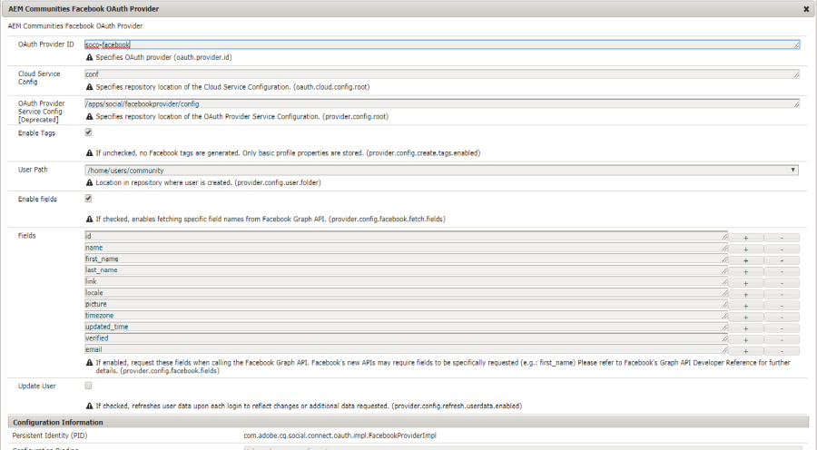
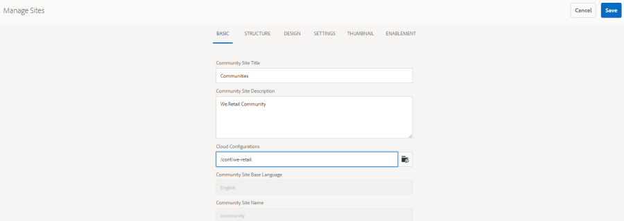

# 使用Facebook和Twitter進行社交登入 {#social-login-with-facebook-and-twitter}

社交登入是一種功能，可讓網站訪客選擇使用其Facebook或Twitter帳戶登入。 因此，請在其AEM會員個人檔案中加入允許的Facebook或Twitter資料。

## 社交登入概觀 {#social-login-overview}

若要加入社交登入，*必須使用*才能建立自訂Facebook和Twitter應用程式。

雖然我們零售的範例提供範例Facebook和Twitter應用程式以及雲端服務，但是無法在製作網站 [上使用](../../help/sites-administering/production-ready.md)。

所需步驟包括：

1. [在所有AEM發佈例項上](#adobe-granite-oauth-authentication-handler) ，啟用OAuth驗證。

   未啟用OAuth時，嘗試登入失敗。

1. **建立** 社交應用程式和雲端服務。

   * 若要支援使用Facebook登入：

      * 建立 [Facebook應用程式](#create-a-facebook-app)。
      * 建立和發佈 [Facebook connect雲端服務](#create-a-facebook-connect-cloud-service)。
   * 若要支援使用Twitter登入：

      * 建立 [Twitter應用程式](#create-a-twitter-app)。
      * 建立和發佈 [Twitter connect雲端服務](#create-a-twitter-connect-cloud-service)。

1. [**啟用&#x200B;**社群網站](#enable-social-login)的社交登入。

有兩個基本概念：

1. **範圍** （權限）會指定應用程式可請求的資料。

   * 依預設，Facebook和Twitter  Adobe Granite OAuth應用程式和提供者例項會在其範圍內包含基本應用程式權限。

1. **欄位** (params)會指定使用URL參數要求的實際資料。

   * 這些欄位是在 [AEM Communities Facebook OAuth提供者和](#aem-communities-facebook-oauth-provider)[AEM Communities twitterOAuth提供者中指定](#aem-communities-twitter-oauth-provider)。
   * 預設欄位適用於大多數使用案例，但可加以修改。

## Facebook登入 {#facebook-login}

### Facebook API版本 {#facebook-api-version}

社交登入和we-retail facebook範例是在Facebook Graph API 1.0版時開發的。自AEM 6.4 GA和AEM 6.3 SP1社交登入已更新，可與較新的Facebook Graph API 2.5版本搭配使用。

>[!NOTE]
>
>對於舊版AEM，如果您在記錄檔中遇到例外情況**無法從中擷取Token,**升級至該AEM版本的最新CFP。

如需Facebook圖形API版本資訊，請參閱 [Facebook API變更記錄](https://developers.facebook.com/docs/apps/changelog)。

### 建立Facebook應用程式 {#create-a-facebook-app}

必須有正確設定的Facebook應用程式，才能啟用Facebook社交登入。

若要建立Facebook應用程式，請依照Facebook的指示，網址為 [https://developers.facebook.com/apps/](https://developers.facebook.com/apps/)。 下列資訊不會反映對其指示的變更。

一般而言，自Facebook API v2.7起：

* *新增Facebook應用程式：*
   * 針對 *Platform*，選擇「網站」
      * 若為 *網站URL*，請輸入 `  https://<server>:<port>.`
   * 在「 *顯示名稱*」中，輸入要用作Facebook連線服務標題的標題。
   * 對於 *類別*，建議選擇「頁 *面的應用程式」* ，但可以是任何項目。
   * *新增產品： Facebook登入*
      * 若為 *有效的OAuth重新導向URI*，請輸入 `  https://<server>:<port>.`

>[!NOTE]
>
>若要開發，http://localhost:4503將有效。

建立應用程式後，請找出「應用程式 **[!UICONTROL ID」和「應用程式]****[!UICONTROL 密碼」設定]** 。 設定 [Facebook雲端服務時需要此資訊](#createafacebookcloudservice)。

### 建立Facebook Connect cloud服務 {#create-a-facebook-connect-cloud-service}

Adobe Granite OAuth應用程式和Provider  （透過建立雲端服務設定實例化）例項可識別新增使用者的Facebook應用程式和成員群組。

1. 在AEM作者例項上，以管理員權限登入。
1. 從全域導覽中，選 **[!UICONTROL 取「工具>雲端服務> Facebook Social登入設定」]**。
1. 選擇配置上 **[!UICONTROL 下文路徑]**。

   **[!UICONTROL 上下文路徑]** ，應與您在建立／編輯社群網站時選取的雲端設定路徑相同。

1. 檢查您的上下文路徑是否已啟用，以在其下方建立雲端服務。
1. 前往「工 **[!UICONTROL 具>一般>設定瀏覽器]**」。 選取您的上下文並編輯屬性。 如果尚未啟用，請啟用雲端設定。

   

1. 建立／編輯Facebook雲端服務設定。

   

   * **[!UICONTROL 標題]** (必&#x200B;*要*)輸入識別Facebook應用程式的顯示標題。 建議您使用與Facebook應用程式的「顯 *示名稱* 」輸入相同的名稱。
   * **[!UICONTROL 應用程式ID/API金鑰]** (必&#x200B;*要*)輸入Facebook應 ***用程式的應用程式ID*** 。 這會識別 [從對話方塊建立的Adobe Granite OAuth應用程式和Provider](https://helpx.adobe.com/experience-manager/6-3/communities/using/social-login.html#AdobeGraniteOAuthApplicationandProvider) 執行個體。
   * **[!UICONTROL App Secret]** (必&#x200B;*要*)輸入Facebook應 ***用程式的App Secret*** 。
   * **[!UICONTROL 建立使用者]** ：如果勾選，使用Facebook帳戶登入將建立AEM使用者項目，並將其新增為所選使用者群組的成員。  已勾選預設值（強烈建議）。
   * **[!UICONTROL 遮色片使用者ID]**:保持未選定狀態。
   * **[!UICONTROL 範圍電子郵件]**:應從Facebook擷取使用者的電子郵件ID。
   * **[!UICONTROL 「新增至使用者群組]** 」選取「新增使用者群組」，為要新增使用者的社群 [網站](https://helpx.adobe.com/experience-manager/6-3/communities/using/users.html) ，選擇一或多個成員群組。
   >[!NOTE]
   >
   >您可隨時新增或移除群組。 但現有使用者的會籍不會受到影響。 自動會籍僅適用於在此欄位更新後建立的新使用者。 對於匿名用戶被禁用的站點，選擇將用戶添加到為該封閉社區站點指定的相應社區成員組。

   * 選擇 **[!UICONTROL 保存]**。
   * **[!UICONTROL 發佈]**.

結果會是 [Adobe Granite OAuth應用程式和Provider](https://helpx.adobe.com/experience-manager/6-3/communities/using/social-login.html#adobe-granite-oauth-application-and-provider) 例項，除非新增其他範圍（權限），否則不需要進一步修改。 預設範圍是Facebook登入的標準權限。 如果需要其他範圍，則需要直接編輯OSGI配置。 如果有修改是透過系統／主控台直接完成，請避免從觸控式使用者介面編輯您的雲端服務設定，以避免覆寫。

### AEM Communities Facebook OAuth提供者 {#aem-communities-facebook-oauth-provider}

AEM Communities提供者可擴充 [Adobe Granite OAuth應用程式和提供者例項](#adobe-granite-oauth-application-and-provider) 。

此提供者需要編輯才能：

* 允許使用者更新
* 在範圍內新增其 [他欄位](#adobe-granite-oauth-application-and-provider)

   * 並非預設允許的所有欄位都包含在內。

如果需要編輯，請在每個AEM發佈例項上：

1. 以管理員權限登入。
1. 導覽至 [Web主控台](../../help/sites-deploying/configuring-osgi.md)。 例如，http://localhost:4503/system/console/configMgr。
1. 尋找AEM Communities Facebook OAuth提供者。
1. 選取要開啟以進行編輯的鉛筆圖示。

   

   * **[!UICONTROL OAuth提供者ID]**

      (必&#x200B;*要*)預設值 *為soco -facebook*。 不要編輯。

   * **[!UICONTROL 雲端服務設定]**

      預設值為 */etc/ cloudservices / facebookconnect*。 不要編輯。

   * **[!UICONTROL OAuth提供者服務設定]**

      預設值為 */apps/social/facebookprovider/config/*。 不要編輯。

   * **[!UICONTROL 啟用標籤]**

      不要編輯。

   * **[!UICONTROL 使用者路徑]**

      儲存用戶資料的儲存庫中的位置。 對於社群網站，為確保成員能夠檢視彼此的描述檔的權限，路徑應為預設 */home/users/community*。

   * **[!UICONTROL 啟用欄位]**

      如果勾選，則會在向Facebook要求使用者驗證和資訊時指定列出的欄位。 預設值為取消選中。

   * **[!UICONTROL 欄位]**

      啟用「欄位」後，呼叫Facebook圖形API時會包含下列欄位。 這些欄位必須允許在雲端服務設定中定義的範圍內。 其他欄位可能需要Facebook核准。 參考Facebook檔案的「Facebook登入權限」區段。 新增為參數的預設欄位為：

      * id
      * 名稱
      * first_name
      * last_name
      * link
      * 地區設定
      * 圖片
      * 時區
      * updated_time
      * 已驗證
      * 電子郵件
   如果添加或更改了任何欄位，請更新相應的預設同步處理程式配置以更正映射。

   * **[!UICONTROL 更新用戶]**：如果選中此選項，則每次登錄時都會刷新儲存庫中的用戶資料，以反映配置檔案更改或請求的其他資料。 已取消選取預設值。

#### 後續步驟 {#next-steps}

Facebook和Twitter的後續步驟相同：

* [發佈雲端服務設定](#publishcloudservices)
* [為社群網站啟用](#enable-social-login)

## Twitter登入 {#twitter-login}

### 建立Twitter應用程式 {#create-a-twitter-app}

必須有已設定的Twitter應用程式，才能啟用Twitter社交登入。

請依照最新指示，在https://apps.twitter.com建立新的Twitter應用 [程式](https://apps.twitter.com/)。

一般而言：

1. 輸入 *Name* ，以識別您的Twitter應用程式給您網站的使用者。
1. 輸入說 *明。*
1. 對於 *網站* -輸入https://&lt;server>/。
1. 對 *於回呼URL* —— 輸入https://&lt;server>/。

   >[!NOTE]
   >
   >無需指定埠。
   >
   >若要開發，https://127.0.0.1/將有效。

1. 建立應用程式後，請找出 **[!UICONTROL 使用者(API)金鑰]****[!UICONTROL 和使用者(API)密碼]**。 設定 [Twitter雲端服務時，需要此資訊](#createatwittercloudservice)。

#### 權限 {#permissions}

在Twitter應用程式管理的權限區段中：

* **[!UICONTROL 存取]**:選擇 `Read only`。

   * 不支援其他選項

* **[!UICONTROL 其他權限]**:（可選）選 `Request email addresses from users`擇。

   * 如果未選取，AEM中的使用者設定檔將不包含其電子郵件地址。
   * Twitter的指示說明需要採取的其他步驟。

對社交登入提出的唯一REST要求是 *[GET帳戶／驗證憑證](https://dev.twitter.com/rest/reference/get/account/verify_credentials)*。

### 建立Twitter Connect cloud服務 {#create-a-twitter-connect-cloud-service}

Adobe Granite OAuth應用程式和Provider  （透過建立雲端服務設定實例化）例項可識別新增使用者的Twitter應用程式和成員群組。

1. 在作者例項上，以管理員權限登入。
1. 從全域導覽中，選 **[!UICONTROL 取「工具>雲端服務> twitter社交登入設定」]**。
1. 選擇上 **[!UICONTROL 下文路徑]** 。

   上下文路徑應與您在建立／編輯社群網站時選取的雲端設定路徑相同。

1. 檢查您的上下文路徑是否已啟用，以在其下方建立雲端服務。
1. 前往「工 **[!UICONTROL 具>一般>設定瀏覽器]**」。 選取您的上下文並編輯屬性。 如果尚未啟用，請啟用雲端設定。

   

1. 建立／編輯Twitter雲端服務設定。

   

   * **[!UICONTROL 標題]** (必&#x200B;*要*)輸入識別Twitter應用程式的顯示標題。 建議您使用與Twitter應用程式的「顯 *示名稱* 」輸入相同的名稱。

   * **[!UICONTROL 消費者金鑰]** (必&#x200B;*要*)輸入Twitter應 **用程式的消費者(API)金鑰** 。 這會識別 [從對話方塊建立的Adobe Granite OAuth應用程式和Provider](https://helpx.adobe.com/experience-manager/6-3/communities/using/social-login.html#AdobeGraniteOAuthApplicationandProvider) 執行個體。

   * **[!UICONTROL 消費者密碼]** (必&#x200B;*要*)輸入Twitter應 ***用程式的消費者(API)密碼*** 。

   * **[!UICONTROL 建立使用者]** ：如果勾選，使用Twitter帳戶登入將建立AEM使用者項目，並將其新增為所選使用者群組的成員。 已勾選預設值（強烈建議）。

   * **[!UICONTROL 遮色片使用者ID]** 保留未選取狀態。

   * **[!UICONTROL 「新增至使用者群組]** 」選取「新增使用者群組」，為要新增使用者的社群 [網站](https://helpx.adobe.com/experience-manager/6-3/communities/using/users.html) ，選擇一或多個成員群組。
   >[!NOTE]
   >
   >您可隨時新增或移除群組。 但現有使用者的會籍不會受到影響。 自動會籍僅適用於在此欄位更新後建立的新使用者。 對於匿名使用者被停用的網站，請將使用者新增至該封閉社群網站的對應社群成員群組。

1. 選擇 **[!UICONTROL 「儲存]** 」和「 **[!UICONTROL 發佈」]**。

結果會是  Adobe Granite OAuth應用程式和Provider實例，不需要進一步修改。 預設範圍是Twitter登入的標準權限。

### AEM Communities twitterOAuth提供者 {#aem-communities-twitter-oauth-provider}

AEM Communities設定可擴充 [Adobe Granite OAuth應用程式和提供者例項](#adobe-granite-oauth-application-and-provider) 。 此提供者需要編輯才能允許使用者更新。

如果需要編輯，請在每個AEM發佈例項上：

1. 以管理員權限登入。
1. 導覽至 [Web主控台](../../help/sites-deploying/configuring-osgi.md)。

   例如，http://localhost:4503/system/console/configMgr。

1. 尋找AEM Communities twitter的OAuth提供者。
1. 選取要開啟以進行編輯的鉛筆圖示。

   

   * **[!UICONTROL OAuth提供者ID]** (必&#x200B;*要*)

      預設值為 *soco -twitter*。 不要編輯。

   * **[!UICONTROL 雲端服務設定]**

      預設值為 *conf。* 不要編輯。

   * **[!UICONTROL OAuth提供者服務設定]**

      預設值為 */apps/social/twitterprovider/config/*。 不要編輯。

   * **[!UICONTROL 使用者路徑]**

      儲存用戶資料的儲存庫中的位置。 對於社群網站，為確保成員能夠檢視彼此的描述檔的權限，路徑應為預設 */home/users/community*。

   * **[!UICONTROL 啟用參數]** ，不要編輯
   * **[!UICONTROL URL參數]** ：不編輯
   * **[!UICONTROL 更新使用者]**

      如果選中此選項，則每次登錄時都會刷新儲存庫中的用戶資料，以反映配置檔案更改或請求的其他資料。 預設值為取消選中。

#### 後續步驟 {#next-steps-1}

Facebook和Twitter的後續步驟相同：

* [發佈雲端服務設定](#publishcloudservices)
* [為社群網站啟用](#enable-social-login)

## 啟用社交登入 {#enable-social-login}

### AEM Communities Sites Console {#aem-communities-sites-console}

在設定雲端服務後，在建立或管理社群網站時，可使用「使用者管理設定」子面板，為社群網站啟用相關的「社交登入」設 [定](https://helpx.adobe.com/experience-manager/6-3/communities/using/sites-console.html#USERMANAGEMENT)。

1. 選擇您儲存社交登入設定的網站設定內容。

1. 在「一般」標籤上，設定雲端設定。

   

1. 在「設定」標籤上，啟 **[!UICONTROL 用「社交登入]** 」和「儲存」。

   

## 測試社交登入 {#test-social-login}

* 確 [保已在所有發佈例項上啟用Adobe Granite OAuth驗證處理常式](#adobe-granite-oauth-authentication-handler)
* 確保已發佈雲端服務
* 確保社群網站已發佈
* 在瀏覽器中啟動發佈的網站例如http://localhost:4503/content/sites/engage/en.html
* 選擇 **[!UICONTROL 登入]**
* 選擇「 **[!UICONTROL 使用Facebook登入]** 」或「 **[!UICONTROL 使用Twitter登入」]**
* 如果尚未登入Facebook或Twitter，請使用適當的認證登入
* 根據Facebook或Twitter應用程式顯示的對話方塊，可能需要授與權限
* 請注意，頁面頂端的工具列已更新，以反映成功登入
* 選擇 **[!UICONTROL 配置檔案]**:「設定檔」頁面會顯示使用者的頭像、名字和姓氏。 它也會根據允許的欄位／參數，顯示來自Facebook或Twitter設定檔的資訊。

## AEM Platform OAuth組態 {#aem-platform-oauth-configurations}

### Adobe Granite OAuth驗證處理常式 {#adobe-granite-oauth-authentication-handler}

預 `Adobe Granite OAuth Authentication Handler` 設未啟用，且必 ***須在所有AEM發佈例項上啟用。***

若要在發佈時啟用驗證處理常式，只要開啟OSGi組態並儲存它：

* 以管理員權限登入
* 導覽至 [Web Console](../../help/sites-deploying/configuring-osgi.md)例如http://localhost:4503/system/console/configMgr
* 尋找 `Adobe Granite OAuth Authentication Handler`
* 選擇以開啟要編輯的配置
* 選擇保 **[!UICONTROL 存]**

>[!CAUTION]
>
>請小心不要將驗證處理常式與 *Adobe Granite OAuth應用程式和提供者的Facebook或Twitter例項混淆*。

### Adobe Granite OAuth應用程式與供應商 {#adobe-granite-oauth-application-and-provider}

當建立Facebook或Twitter的雲端服務時，會建立例 `Adobe Granite OAuth Authentication Handler` 項。

若要尋找Facebook或Twitter應用程式的已建立例項：

1. 以管理員權限登入。
1. 導覽至 [Web主控台](../../help/sites-deploying/configuring-osgi.md)。

   例如，http://localhost:4503/system/console/configMgr。

1. 找到Adobe Granite OAuth應用程式和供應商。

   * 找出用戶端ID與 **[!UICONTROL 應用程式ID相符]** 的例 **[!UICONTROL 項。]**
   

   除了下列屬性外，請保留組態的其他屬性不變：

   * **[!UICONTROL 設定ID]**

      (必&#x200B;*要*)OAuth組態ID必須是唯一的。 在建立雲端服務時自動產生。

   * **[!UICONTROL 用戶端識別碼]**

      (必&#x200B;*要*)建立雲端服務時提供的應用程式ID。

   * **[!UICONTROL 用戶端密碼]**

      (必&#x200B;*要*)建立雲端服務時提供的應用程式密碼。

   * **[!UICONTROL 範圍]**

      (可&#x200B;*選*)供應商可詢問允許的額外範圍。 預設範圍涵蓋提供社交驗證和個人檔案資料的必要權限。

   * **[!UICONTROL 提供者ID]**

      (必&#x200B;*要*)建立雲端服務時，會設定AEM Communities的提供者ID。 不要編輯。 對於Facebook Connect，其值為 *soco -facebook*。 對於Twitter Connect，其值為 *soco -twitter*。

   * **[!UICONTROL 群組]**

      (建&#x200B;*議*)新增已建立使用者的一或多個成員群組。 對於AEM Communities，建議列出社群網站的成員群組。

   * **[!UICONTROL 回呼 URL]**

      (可&#x200B;*選*)URL已與OAuth提供者一起設定，以重新導向用戶端。 使用相對URL來使用原始請求的主機。 留空可改用原本要求的URL。 尾碼&quot;/callback/j_security_check&quot;會自動附加到此URL。
   >[!NOTE]
   >
   >回呼的網域必須向提供者（Facebook或Twitter）註冊。

對於每個OAuth驗證處理常式設定，例項中會另外建立兩個組態：

* Apache Jackrabbit Oak預設同步處理常式(org.apache.jackrabbit.oak.spi.security.authentication.external.impl.DefaultSyncHandler)-不需要進行編輯，但您可以檢視使用者欄位對應，Facebook欄位如何對應至CQ使用者描述檔節點。 另請注意，「同步處理常式名稱」與OAuth提供者設定的設定ID相符。
* Apache Jackrabbit Oak外部登入模組(org.apache.jackrabbit.oak.spi.security.authentication.external.impl.ExternalLoginModuleFactory)-不需要進行編輯，但您可能會注意到「身分提供者名稱」和「同步處理常式名稱」分別指向對應的OA和同步處理常式uth組態。

如需詳細資訊，請參 [閱「使用Apache Oak外部登入模組驗證」](https://jackrabbit.apache.org/oak/docs/security/authentication/externalloginmodule.html)。

## OAuth使用者周遊效能 {#oauth-user-traversal-performance}

對於使用Facebook或Twitter登入功能註冊數十萬使用者的社群網站，當網站訪客使用其社交登入時，可新增下列Oak索引來改善查詢的周遊效能。

如果日誌中出現遍歷警告，建議添加此索引。

在作者例項上，以管理權限登入：

1. 從全域導覽：選 **擇「工[具」,CRX/DE Lite](../../help/sites-developing/developing-with-crxde-lite.md)。**
1. 從ntBaseLucene的副本建立名為ntBaseLucene-oauth的索引：

   * 在node /oak:index下
   * 選擇node ntBaseLucene
   * 選擇復 **[!UICONTROL 制]**
   * 選取 `/oak:index`
   * 選擇 **[!UICONTROL 貼上]**
   * 將ntBaseLucene的副本更名為ntBaseLucene-oauth

1. 修改node ntBaseLucene-oauth的屬性：

   * **[!UICONTROL indexPath]**:/oak:index/ntBaseLucene-oauth
   * **[!UICONTROL 名稱]**:oauthid-123****
   * **[!UICONTROL reindex]**:true
   * **[!UICONTROL reindexCount]**:1

1. 在node /oak:index/ntBaseLucene-oauth/indexRules/nt:base/properties下：

   * 刪除所有子節點，cqTags除外。
   * 將cqTags重新命名為oauthid-123****
   * 修改節點oauthid-123的屬性****

      * **[!UICONTROL 名稱]**:oauthid-123****
   * 選擇「 **[!UICONTROL 全部保存]**」。

**** &amp;ast;對於名 **稱** Authid-*123*，名稱為Adobe App Granite Application *OAA AndFacebook Proviroderconfiguration的Authid-* APP Or KeyCouser ****************(KEYKeyJDConsumer)，是CroidAdGridComeChid Chidid Chrid PrininidTPaninThidTinin的PanidTinidTP(AininidininininininininPPTTPPTinTPTAp(TheA)的值，其為Tini

如需其他資訊和工具，請參閱 [Oak Queries and Indexing](../../help/sites-deploying/queries-and-indexing.md)。

## Dispatcher Configuration {#dispatcher-configuration}

請參 [閱配置Dispatcher for Communities](dispatcher.md)。
