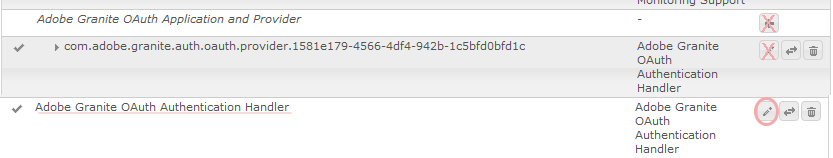

# 與Facebook和Twitter社會登錄 {#social-login-with-facebook-and-twitter}

社交登錄是指向站點訪問者提供使用其Facebook或Twitter帳戶登錄的選項。 因此，將允許的Facebook或Twitter資料納入其成AEM員簡介中。

## 社交登錄概述 {#social-login-overview}

要包括社交登錄，請 *要求* 建立自定義Facebook和Twitter應用程式。

雖然我們零售的示例提供了Facebook和Twitter的應用和雲服務的示例，但在 [生產網站](../../help/sites-administering/production-ready.md)。

所需步驟包括：

1. [啟用OAuth身份驗證](#adobe-granite-oauth-authentication-handler) 所有發佈AEM實例。

   如果未啟用OAuth，則嘗試登錄失敗。

1. **建立** 社交應用和雲服務。

   * 要支援登錄Facebook:

      * 建立 [Facebook應用](#create-a-facebook-app)。
      * 建立和發佈 [Facebook連接雲服務](#create-a-facebook-connect-cloud-service)。
   * 要支援登錄Twitter:

      * 建立 [Twitter應用](#create-a-twitter-app)。
      * 建立和發佈 [Twitter連接雲服務](#create-a-twitter-connect-cloud-service)。

1. [**啟用** 社交登錄](#enable-social-login) 社區網站。

有兩個基本概念：

1. **範圍** （權限）指定允許應用請求的資料。

   * facebook和Twitter [Adobe花崗岩OAuth應用程式和提供程式](#adobe-granite-oauth-application-and-provider) 預設情況下，實例在其範圍內包括基本應用權限。

1. **欄位** (params)指定使用URL參數請求的實際資料。

   * 這些欄位在 [AEM CommunitiesFacebookOAuth提供程式](#aem-communities-facebook-oauth-provider) 和 [AEM CommunitiesTwitterOAuth提供程式](#aem-communities-twitter-oauth-provider)。
   * 預設欄位對於大多數使用情形都足夠，但可以修改。

## Facebook登錄 {#facebook-login}

### FacebookAPI版本 {#facebook-api-version}

社交登錄和我們零售的Facebook示例是在Facebook圖形API版本1.0時開發的。截至AEM6.4 GA和AEM6.3 SP1社交登錄已更新，以與較新的Facebook圖形API 2.5版本配合使用。

>[!NOTE]
>
>對於較AEM舊版本，如果日誌中遇到異常 **無法從中提取令牌**，升級到該版本的最新CFPAEM。

有關Facebook圖形API版本資訊，請參見 [FacebookAPI更改日誌](https://developers.facebook.com/docs/apps/changelog)。

### 建立Facebook應用 {#create-a-facebook-app}

需要正確配置的Facebook應用程式才能啟用Facebook社會登錄。

要建立Facebook應用程式，請按照Facebook的說明 [https://developers.facebook.com/apps/](https://developers.facebook.com/apps/)。 對其說明的更改不會反映在以下資訊中。

總的來說，從FacebookAPI v2.7開始：

* *添加新的Facebook應用*
   * 對於 *平台*，選擇網站：
      * 對於 *網站URL*&#x200B;輸入 `  https://<server>:<port>.`
      * 對於 *顯示名稱*，輸入用作Facebook連接服務的標題。
      * 對於 *類別*，建議選擇 *頁面應用*&#x200B;但可以是任何東西。
      * *添加產品：Facebook登錄*
      * 對於 *有效的OAuth重定向URI*&#x200B;輸入 `  https://<server>:<port>.`

>[!NOTE]
>
>對於發展，http://localhost:4503將起作用。

建立應用程式後，找到 **[!UICONTROL 應用ID]** 和 **[!UICONTROL 應用密碼]** 的子菜單。 配置 [Facebook雲服務](#createafacebookcloudservice)。

### 建立Facebook連接Cloud Service {#create-a-facebook-connect-cloud-service}

的 [Adobe花崗岩OAuth應用程式和提供程式](#adobe-granite-oauth-application-and-provider) 實例（通過建立雲服務配置實例化）標識Facebook應用程式和新用戶添加到的成員組。

1. 在作AEM者實例上，以管理員權限登錄。
1. 從全局導航中，選擇 **[!UICONTROL 工具]** > **[!UICONTROL Cloud Services]** > **[!UICONTROL Facebook社會登錄配置]**。
1. 選擇配置 **[!UICONTROL 上下文路徑]**。

   **[!UICONTROL 上下文路徑]** 應與建立/編輯社區站點時選擇的雲配置路徑相同。

1. 檢查上下文路徑是否已啟用，以在其下建立雲服務。
1. 轉到 **[!UICONTROL 工具]** > **[!UICONTROL 常規]** > **[!UICONTROL 配置瀏覽器]**。 選擇上下文並編輯屬性。 如果尚未啟用，則啟用雲配置。

   

   * 查看 [配置瀏覽器](/help/sites-administering/configurations.md) 的子菜單。

1. **建立/編輯** Facebook雲服務配置。

   

   * **[!UICONTROL 標題]** (*必需*)輸入標識Facebook應用的顯示標題。 建議使用與 *顯示名稱* facebook應用。
   * **[!UICONTROL 應用ID/API密鑰]** (*必需*)輸入 ***應用ID*** facebook應用。 這表示 [Adobe花崗岩OAuth應用程式和提供程式](https://helpx.adobe.com/experience-manager/6-3/communities/using/social-login.html#AdobeGraniteOAuthApplicationandProvider) 從對話框建立的實例。
   * **[!UICONTROL 應用密碼]** (*必需*)輸入 ***應用密碼*** facebook應用。
   * **[!UICONTROL 建立用戶]** 如果選中，使用Facebook帳戶登錄將AEM建立用戶條目並將其作為成員添加到選定用戶組。  選中預設值（強烈建議）。
   * **[!UICONTROL 掩碼用戶ID]**:保持未選定狀態。
   * **[!UICONTROL 範圍電子郵件]**:應從Facebook獲取用戶的電子郵件ID。
   * **[!UICONTROL 添加到用戶組]** 選擇添加用戶組以選擇一個或多個 [成員組](https://helpx.adobe.com/experience-manager/6-3/communities/using/users.html) 為要向其中添加用戶的社區站點。

   >[!NOTE]
   >
   >可以隨時添加或刪除組。 但現有用戶的成員資格不會受到影響。 自動成員資格僅適用於在更新此欄位後建立的新用戶。 對於禁用匿名用戶的站點，選擇將用戶添加到針對該關閉的社區站點的相應社區成員組。

   * 選擇 **[!UICONTROL 保存]**。
   * **[!UICONTROL 發佈]**.

結果是 [Adobe花崗岩OAuth應用程式和提供程式](https://helpx.adobe.com/experience-manager/6-3/communities/using/social-login.html#adobe-granite-oauth-application-and-provider) 實例，除非添加其他作用域（權限），否則不需要進一步修改。 預設範圍是Facebook登錄的標準權限。 如果需要其他範圍，則需要直接編輯OSGI配置。 如果通過系統/控制台直接進行修改，請避免從觸摸UI編輯雲服務配置以避免覆蓋。

### AEM CommunitiesFacebookOAuth提供程式 {#aem-communities-facebook-oauth-provider}

AEM Communities提供商 [Adobe花崗岩OAuth應用程式和提供程式](#adobe-granite-oauth-application-and-provider) 實例。

此提供程式將需要編輯以：

* 允許用戶更新
* 添加其他欄位 [範圍](#adobe-granite-oauth-application-and-provider)

   * 預設情況下，並非所有允許的欄位都包括在內。

如果需要編輯，請在每個發AEM布實例上：

1. 使用管理員權限登錄。
1. 導航到 [Web控制台](../../help/sites-deploying/configuring-osgi.md)。 例如，http://localhost:4503/system/console/configMgr。
1. 找到AEM CommunitiesFacebookOAuth提供程式。
1. 選擇要開啟以進行編輯的鉛筆表徵圖。

   

   * **[!UICONTROL OAuth提供程式ID]**

      (*必需*)預設值為 *索科 — facebook*。 不要編輯。

   * **[!UICONTROL Cloud Service配置]**

      預設值為 `/etc/  cloudservices /  facebookconnect`. 不要編輯。

   * **[!UICONTROL OAuth提供程式服務配置]**

      預設值為 `/apps/social/facebookprovider/config/`. 不要編輯。

   * **[!UICONTROL 啟用標籤]**

      不編輯。

   * **[!UICONTROL 用戶路徑]**

      儲存用戶資料的儲存庫中的位置。 對於社區站點，為了確保成員有權查看彼此的配置檔案，路徑應為預設路徑 */home/users/community*。

   * **[!UICONTROL 啟用欄位]**

      如果選中，則在向Facebook請求用戶身份驗證和資訊時指定列出的欄位。 取消選擇預設值。

   * **[!UICONTROL 欄位]**

      啟用「欄位」後，調用Facebook圖形API時將包括以下欄位。 必須在雲服務配置中定義的範圍內允許這些欄位。 其他欄位可能需要Facebook批准。 參考Facebook文檔的「Facebook登錄權限」部分。 作為參數添加的預設欄位為：

      * ID
      * 名稱
      * 名字
      * 姓氏
      * 連結
      * 地區設定
      * 圖片
      * 時區
      * 更新時間
      * 驗證
      * 電子郵件

   如果添加或更改了任何欄位，請更新相應的預設同步處理程式配置以更正映射。

   * **[!UICONTROL 更新用戶]**

      如果選中，則在每次登錄時刷新儲存庫中的用戶資料，以反映配置檔案更改或請求的其他資料。 取消選擇預設值。

#### 後續步驟 {#next-steps}

facebook和Twitter的後續步驟是相同的：

* [發佈雲服務配置](#publishcloudservices)
* [為社區站點啟用](#enable-social-login)

## Twitter登錄 {#twitter-login}

### 建立Twitter應用 {#create-a-twitter-app}

需要配置的Twitter應用程式才能啟用Twitter社會登錄。

按照最新的說明建立新的Twitter應用程式， [https://apps.twitter.com](https://apps.twitter.com/)。

總的來說：

1. 輸入 *名稱* 將您的Twitter應用程式標識給您網站的用戶。
1. 輸入 *說明*。
1. 對於 *網站*  — 輸入 `https://<server>`。
1. 對於 *回調URL*  — 輸入 `https://server`。

   >[!NOTE]
   >
   >無需指定埠。
   >
   >對於發展，https://127.0.0.1/將起作用。

1. 建立應用程式後，找到 **[!UICONTROL 使用者(API)密鑰]** 和 **[!UICONTROL 使用者(API)密碼]**。 配置 [Twitter雲服務](#createatwittercloudservice)。

#### 權限 {#permissions}

在Twitter應用程式管理的權限部分：

* **[!UICONTROL 訪問]**:選擇 `Read only`。

   * 不支援其他選項

* **[!UICONTROL 其他權限]**:（可選）選擇 `Request email addresses from users`。

   * 如果未選中，則中的用戶配置AEM檔案將不包括其電子郵件地址。
   * Twitter的指示說明需要採取其他步驟。

為社交登錄而發出的唯一REST請求是 *[GET帳戶/驗證憑據](https://dev.twitter.com/rest/reference/get/account/verify_credentials)*。

### 建立Twitter連接Cloud Service {#create-a-twitter-connect-cloud-service}

的 [Adobe花崗岩OAuth應用程式和提供程式](#adobe-granite-oauth-application-and-provider) 實例（通過建立雲服務配置實例化）標識Twitter應用程式和新用戶添加到的成員組。

1. 在作者實例上，使用管理員權限登錄。
1. 從全局導航中，選擇 **[!UICONTROL 工具]** > **[!UICONTROL Cloud Services]** > **[!UICONTROL Twitter社會登錄配置]**。
1. 選擇 **[!UICONTROL 上下文路徑]** 配置。

   上下文路徑應與建立/編輯社區站點時選擇的雲配置路徑相同。

1. 檢查上下文路徑是否已啟用，以在其下建立雲服務。
1. 轉到 **[!UICONTROL 工具]** > **[!UICONTROL 常規]** > **[!UICONTROL 配置瀏覽器]**。 選擇上下文並編輯屬性。 如果尚未啟用，則啟用雲配置。

   

   * 查看 [配置瀏覽器](/help/sites-administering/configurations.md) 的子菜單。

1. 建立/編輯Twitter雲服務配置。

   

   * **[!UICONTROL 標題]**

      (*必需*)輸入標識Twitter應用的顯示標題。 建議使用與 *顯示名稱* twitter應用。

   * **[!UICONTROL 消費者金鑰]**

      (*必需*)輸入 **使用者(API)密鑰** twitter應用。 這表示 [Adobe花崗岩OAuth應用程式和提供程式](https://helpx.adobe.com/experience-manager/6-3/communities/using/social-login.html#AdobeGraniteOAuthApplicationandProvider) 從對話框建立的實例。

   * **[!UICONTROL 消費者機密]**

      (*必需*)輸入 ***使用者(API)密碼*** twitter應用。

   * **[!UICONTROL 建立使用者]**

      如果選中，使用Twitter帳戶登錄將AEM建立用戶條目並將其作為成員添加到選定用戶組。 選中預設值（強烈建議）。

   * **[!UICONTROL 隱藏使用者 ID]**

      保持未選定狀態。

   * **[!UICONTROL 新增到使用者群組]**

      選擇添加用戶組以選擇一個或多個 [成員組](https://helpx.adobe.com/experience-manager/6-3/communities/using/users.html) 為要向其中添加用戶的社區站點。
   >[!NOTE]
   >
   >可以隨時添加或刪除組。 但現有用戶的成員資格不會受到影響。 自動成員資格僅適用於在更新此欄位後建立的新用戶。 對於禁用匿名用戶的站點，將用戶添加到針對該關閉的社區站點的相應社區成員組。

1. 選擇 **[!UICONTROL 保存]** 和 **[!UICONTROL 發佈]**。

結果是 [Adobe花崗岩OAuth應用程式和提供程式](https://helpx.adobe.com/experience-manager/6-3/communities/using/social-login.html#adobe-granite-oauth-application-and-provider) 不需要進一步修改的實例。 預設範圍是Twitter登錄的標準權限。

### AEM CommunitiesTwitterOAuth提供程式 {#aem-communities-twitter-oauth-provider}

AEM Communities配置擴展了 [Adobe花崗岩OAuth應用程式和提供程式](#adobe-granite-oauth-application-and-provider) 實例。 此提供程式需要編輯以允許用戶更新。

如果需要編輯，請在每個發AEM布實例上：

1. 使用管理員權限登錄。
1. 導航到 [Web控制台](../../help/sites-deploying/configuring-osgi.md)。

   例如，http://localhost:4503/system/console/configMgr。

1. 找到AEM CommunitiesTwitterOAuth提供程式。
1. 選擇要開啟以進行編輯的鉛筆表徵圖。

   

   * **[!UICONTROL OAuth提供程式ID]**

   (*必需*)預設值為 *索科 — twitter*。 不要編輯。

   * **[!UICONTROL Cloud Service配置]**

      預設值為 *會議。* 不要編輯。

   * **[!UICONTROL OAuth提供程式服務配置]**

      預設值為 `/apps/social/twitterprovider/config/`。不要編輯。

   * **[!UICONTROL 用戶路徑]**

      儲存用戶資料的儲存庫中的位置。 對於社區站點，為了確保成員有權查看彼此的配置檔案，路徑應為預設路徑 `/home/users/community`。

   * **[!UICONTROL 啟用參數]** 不編輯
   * **[!UICONTROL URL參數]** 不編輯
   * **[!UICONTROL 更新用戶]**

      如果選中，則在每次登錄時刷新儲存庫中的用戶資料，以反映配置檔案更改或請求的其他資料。 取消選擇預設值。

#### 後續步驟 {#next-steps-1}

facebook和Twitter的後續步驟是相同的：

* [發佈雲服務配置](#publishcloudservices)
* [為社區站點啟用](#enable-social-login)

## 啟用社交登錄 {#enable-social-login}

### AEM Communities站點控制台 {#aem-communities-sites-console}

配置雲服務後，可以使用 [用戶管理](https://helpx.adobe.com/experience-manager/6-3/communities/using/sites-console.html#USERMANAGEMENT) 社區站點期間的設定子面板 [建立](https://helpx.adobe.com/experience-manager/6-3/communities/using/sites-console.html#SiteCreation) 或 [管理](https://helpx.adobe.com/experience-manager/6-3/communities/using/sites-console.html#ModifyingSiteProperties)。

1. 選擇保存社交登錄配置的站點配置上下文。

1. 在「常規」頁籤上，設定雲配置。

   

1. 在「設定」頁籤上，啟用 **[!UICONTROL 社交登錄]** 保存。

   

## Test社交登錄 {#test-social-login}

* 確保 [Adobe花崗岩OAuth身份驗證處理程式](#adobe-granite-oauth-authentication-handler) 已在所有發佈實例上啟用。
* 確保已發佈雲服務。
* 確保已發佈社區網站。
* 在瀏覽器中啟動已發佈站點。
例如，http://localhost:4503/content/sites/engage/en.html
* 選擇 **[!UICONTROL 登錄]**。
* 選擇 **[!UICONTROL 使用Facebook登錄]** 或 **[!UICONTROL 使用Twitter登錄]**。
* 如果尚未登錄Facebook或Twitter，請使用相應的憑據登錄。
* 可能需要根據Facebook或Twitter應用顯示的對話框授予權限。
* 請注意，頁面頂部的工具欄已更新以反映成功登錄。
* 選擇 **[!UICONTROL 配置檔案]**:配置檔案頁顯示用戶的虛擬形象影像、名和姓。 它還根據允許的欄位/參數顯示Facebook或Twitter檔案的資訊。

## 平AEM台OAuth配置 {#aem-platform-oauth-configurations}

### Adobe花崗岩OAuth身份驗證處理程式 {#adobe-granite-oauth-authentication-handler}

的 `Adobe Granite OAuth Authentication Handler` 預設情況下未啟用，並且 ***必須在所有發佈實例AEM上啟用。***

要在發佈時啟用驗證處理程式，只需開啟OSGi配置並保存：

* 使用管理員權限登錄。
* 導航到 [Web控制台](../../help/sites-deploying/configuring-osgi.md)。
例如，http://localhost:4503/system/console/configMgr
* 定位 `Adobe Granite OAuth Authentication Handler`。
* 選擇以開啟要編輯的配置。
* 選取&#x200B;**[!UICONTROL 儲存]**。

>[!CAUTION]
>
>請小心，不要將身份驗證處理程式與Facebook或Twitter實例混淆 *Adobe花崗岩OAuth應用程式和提供程式*。

### Adobe花崗岩OAuth應用程式和提供程式 {#adobe-granite-oauth-application-and-provider}

建立Facebook或Twitter的雲服務時， `Adobe Granite OAuth Authentication Handler` 的子菜單。

要查找為Facebook或Twitter應用建立的實例，請執行以下操作：

1. 使用管理員權限登錄。
1. 導航到 [Web控制台](../../help/sites-deploying/configuring-osgi.md)。

   例如，http://localhost:4503/system/console/configMgr。

1. 找到Adobe花崗岩OAuth應用程式和提供程式。

   * 查找實例 **[!UICONTROL 客戶端ID]** 與 **[!UICONTROL 應用ID]**。

      

      除下列屬性外，保留配置的其他屬性不變：

   * **[!UICONTROL 配置ID]**

      (*必需*)OAuth配置ID必須唯一。 建立雲服務時自動生成。

   * **[!UICONTROL 用戶端識別碼]**

      (*必需*)建立雲服務時提供的應用程式ID。

   * **[!UICONTROL 用戶端密碼]**

      (*必需*)建立雲服務時提供的應用程式密鑰。

   * **[!UICONTROL 範圍]**

      (*可選*)可以從提供程式詢問允許的其他範圍。 預設範圍涵蓋提供社會身份驗證和配置檔案資料所需的權限。

   * **[!UICONTROL 提供程式ID]**

      (*必需*)建立雲服務時設定AEM Communities的提供程式ID。 不要編輯。 對於Facebook連接，其價值是 *索科 — facebook*。 對於Twitter連接，其價值是 *索科 — twitter*。

   * **[!UICONTROL 群組]**

      (*推薦*)將建立的用戶添加到的一個或多個成員組。 對於AEM Communities，建議列出社區站點的成員組。

   * **[!UICONTROL 回呼 URL]**

      (*可選*)使用OAuth提供程式配置的URL將客戶端重定向回。 使用相對URL來使用原始請求的主機。 留空以改用最初請求的URL。 尾碼「/callback/j_security_check」自動附加到此URL。
   >[!NOTE]
   >
   >回調的域必須向提供程式(Facebook或Twitter)註冊。

對於每個OAuth身份驗證處理程式配置，實例中還建立了兩個附加配置：

* Apache Jackrabbit Oak預設同步處理程式(org.apache.jackrabbit.oak.spi.security.authentication.external.impl.DefaultSyncHandler) — 不需要編輯，但您可以查看用戶欄位映射Facebook欄位如何映射到CQ用戶配置檔案節點。 另請注意，「同步處理程式名稱」與OAuth提供程式配置的配置ID匹配。
* Apache Jackrabbit Oak外部登錄模組(org.apache.jackrabbit.oak.spi.security.authentication.external.impl.ExternalLoginModuleFactory) — 無需編輯，但您可能會注意到「身份提供程式名稱」和「同步處理程式名稱」相同，並分別指向相應的OAuth和同步處理程式配置。

有關詳細資訊，請參見 [使用Apache Oak外部登錄模組進行身份驗證](https://jackrabbit.apache.org/oak/docs/security/authentication/externalloginmodule.html)。

## OAuth用戶遍歷效能 {#oauth-user-traversal-performance}

對於看到數十萬用戶使用其Facebook或Twitter登錄註冊的社區站點，通過添加以下Oak索引，可以改善站點訪問者使用其社會登錄時執行的查詢的遍歷效能。

如果日誌中出現遍歷警告，建議添加此索引。

在使用管理權限登錄的作者實例上：

1. 從全局導航：選擇 **工具， [CRX/DE簡化版](../../help/sites-developing/developing-with-crxde-lite.md)。**
1. 從ntBaseLucene的副本建立名為ntBaseLucene-oauth的索引：

   * 節點下 `/oak:index`
   * 選擇節點 `ntBaseLucene`
   * 選擇 **[!UICONTROL 複製]**
   * 選取 `/oak:index`
   * 選擇 **[!UICONTROL 貼上]**
   * 將ntBaseLucene的副本更名為 `ntBaseLucene-oauth`

1. 修改節點ntBaseLucene-oauth的屬性：

   * **[!UICONTROL 索引路徑]**: `/oak:index/ntBaseLucene-oauth`
   * **[!UICONTROL 名稱]**: `oauthid-123****`
   * **[!UICONTROL 重新索引]**: `true`
   * **[!UICONTROL 重新索引計數]**: `1`

1. 在節點/oak:index/ntBaseLucene-oauth/indexRules/nt:base/properties下：

   * 刪除除cqTags之外的所有子節點。
   * 將cqTags更名為 `oauthid-123****`
   * 修改節點的屬性 `oauthid-123****`

      * **[!UICONTROL 名稱]**: `oauthid-123****`
   * 選擇 **[!UICONTROL 全部保存]**。

* 對於 **名稱** `oauthid-123`，替換 *123* 和Facebook ***應用ID*** 或Twitter ***使用者(API)密鑰*** 就是 **客戶端ID** 的 [Adobe花崗岩OAuth應用程式和提供程式](social-login.md#adobe-granite-oauth-application-and-provider) 配置。

   

有關其他資訊和工具，請參閱 [Oak查詢和索引](../../help/sites-deploying/queries-and-indexing.md)。

## 調度程式配置 {#dispatcher-configuration}

請參閱 [為社區配置調度程式](dispatcher.md)。
