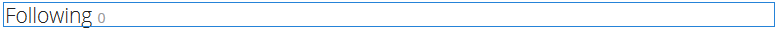

# 使用社交圖{#using-social-graph}

## 簡介 {#introduction}

社區成員遵循[活動](activities.md)以及遵循的能力通過兩個元件建立：`Follow`和`Following`。

`Follow`元件必須與其他資源相關聯，並且此關聯已為社區成員和功能建立。

`Following`元件僅列出當前成員後面或當前成員後面的成員。 此成員間關係的社交圖表包含在為[社群網站](overview.md#communitiessites)建立的用戶配置檔案中。

## 將以下內容添加到頁{#adding-following-to-a-page}

如果想要以製作模式將`Following`元件新增至頁面，請找出元件`Communities / Following`，並將其拖曳至應該出現社交圖形的頁面上。

如需必要資訊，請造訪[Communities Components Basics](basics.md)。

包含[必要的用戶端程式庫](essentials-socialgraph.md#essentials-for-client-side)時，以下是`Following`元件的顯示方式：

## 正在配置{#configuring-following}

目前，必須設定屬性以判斷元件是顯示`follows`關係，還是顯示`following`關係。

## 其他資訊 {#additional-information}

如需詳細資訊，請參閱開發人員的[社交圖表要點](essentials-socialgraph.md)頁面。
