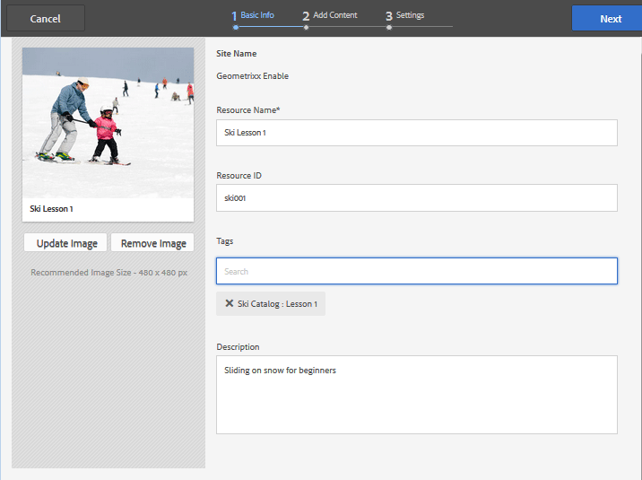

# 標籤啟用資源{#tagging-enablement-resources}

## 概覽 {#overview}

標籤啟用資源允許在成員瀏覽[目錄](functions.md#catalog-function)時過濾資源和學習路徑。

基本上：

* [為每個目錄創](../../help/sites-administering/tags.md#creating-a-namespace) 建標籤名稱

   * [設定標籤權限](../../help/sites-administering/tags.md#setting-tag-permissions)
   * 僅限社群成員（封閉社群）

      * 允許[社區站點成員組](users.md#publish-group-roles)的讀訪問
   * 對於任何網站訪客，不論登入或匿名（開放社群）

      * 允許`Everyone`組的讀訪問
   * [發佈標籤](../../help/sites-administering/tags.md#publishing-tags)

* [定義社群網站的標籤範圍](sites-console.md#tagging)

   * [設定網站結構中存在的目錄](functions.md#catalog-function)

      * 可新增標籤至目錄例項，以控制UI篩選器中顯示的標籤清單。
      * 可以添加[pre-filters](catalog-developer-essentials.md#pre-filters) ，以限制目錄包含的資源。

* [發佈社群網站](sites-console.md#publishing-the-site)
* [套用標籤至啟用](resources.md#create-a-resource) 資源，以便可斷斷續續地篩選
* [發佈啟用資源](resources.md#publish)

## 社群網站標籤{#community-site-tags}

在建立或編輯社區站點時，[標籤設定](sites-console.md#tagging)通過選擇現有標籤命名空間的子集來設定站點功能可用的標籤範圍。

雖然可隨時建立標籤並新增至社群網站，但建議事先設計分類法，類似於設計資料庫。 請參閱[使用標籤](../../help/sites-authoring/tags.md)。

稍後將標籤新增至現有社群網站時，必須先儲存編輯，才能將新標籤新增至網站結構中的目錄函式。

對於社群網站，發佈網站和發佈標籤後，必須啟用社群成員的讀取存取權。 請參閱[設定標籤權限](../../help/sites-administering/tags.md#setting-tag-permissions)。

以下是管理員對組`Community Enable Members`的`/etc/tags/ski-catalog`應用讀取權限時，CRXDE中顯示的方式。

## 目錄標籤名稱空間{#catalog-tag-namespaces}

型錄功能使用標籤來定義自身。 在社群站點中配置目錄函式時，要選擇的標籤名稱空間集由社區站點的標籤命名空間集的範圍定義。

Catalog函式包含標籤設定，可定義目錄篩選器UI中所列的標籤。 設定「所有名稱空間」是指為社區站點選擇的標籤名稱空間的範圍。

## 套用標籤至啟用資源{#applying-tags-to-enablement-resources}

勾選`Show in Catalog`後，啟用資源和學習路徑會顯示在所有目錄中。 新增標籤至資源和學習路徑可讓您預先篩選至特定目錄，以及在目錄UI中篩選。

通過建立[pre-filters](catalog-developer-essentials.md#pre-filters)來將啟用資源和學習路徑限制到特定目錄。

目錄UI可讓訪客將標籤篩選套用至該目錄中顯示的資源和學習路徑清單。

將標籤應用到啟用資源的管理員必須知道與目錄相關聯的標籤名稱空間以及分類，以便選擇子標籤以進行更精確的分類。

例如，如果在名為`Ski Catalog`的目錄上建立並設定了`ski-catalog`命名空間，則可能有兩個子標籤：`lesson-1`和`lesson-2`。

因此，任何標有下列其中一項的啟用資源：

* ski-catalog:leansion-1
* ski-catalog:lession-2

將在啟用資源發佈後出現在`Ski Catalog`中。

## 在發佈時查看目錄{#viewing-catalog-on-publish}

一旦從作者環境設定並發佈所有內容後，就可以在發佈環境中體驗使用目錄尋找啟用資源的經驗。

如果下拉式清單中未顯示任何標籤名稱空間，請確定權限已在發佈環境中正確設定。

如果新增標籤名稱空間且遺失，請確定標籤和網站已重新發佈。

如果在檢視目錄時選取標籤後未顯示啟用資源，請確定目錄的命名空間中有標籤套用至啟用資源。

