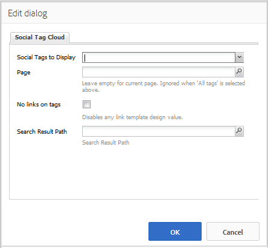

# 使用社交標籤雲 {#using-social-tag-cloud}

## 簡介 {#introduction}

`Social Tag Cloud`元件會醒目顯示社群成員在發佈內容時所套用的標籤。 這是識別趨勢主題並允許網站訪客快速找到標籤內容的方法。

若要取得其他識別目前趨勢的方法，請造訪[活動趨勢](trends.md)。

此頁面會記錄`Social Tag Cloud`元件對話方塊設定，並描述使用者體驗。

如需開發人員的詳細資訊，請參閱[標籤基本資訊](tag.md)。

請參閱[管理標籤](../../help/sites-administering/tags.md)，以取得建立和管理標籤以及已套用至哪些內容標籤的資訊。

## 新增社交標籤雲端 {#adding-a-social-tag-cloud}

若要以作者模式將`Social Tag Cloud`元件新增至頁面，請使用元件瀏覽器來找到`Communities / Social Tag Cloud`，並將其拖曳至應顯示標籤雲的頁面上。

如需必要資訊，請造訪[社群元件基本知識](basics.md)。

納入[必要的使用者端資料庫](tag.md#essentials-for-client-side)時，`Social Tag Cloud`元件的顯示方式如下：

## 設定社交標籤雲 {#configuring-social-tag-cloud}

選取置入的`Social Tag Cloud`元件，以便您可以存取並選取開啟編輯對話方塊的`Configure`圖示。

在&#x200B;**[!UICONTROL 社交標籤雲端]**&#x200B;標籤下方，指定要顯示的標籤，如果標籤是作用中的連結，請指定搜尋結果頁面的位置：

* **[!UICONTROL 要顯示的社交標籤]**
識別要顯示的UGC標籤。 下拉式選項包括：

   * `From page and child pages`
   * `All tags`

  預設值為`From page and child pages`，其中「page」是指下方的&#x200B;**頁面**&#x200B;設定。

* **[!UICONTROL Page]**

  (若不是`All tags)`則為必要}頁面的UGC路徑。 如果留白，預設為目前頁面。

* **[!UICONTROL 標籤上沒有連結]**

  如果勾選，標籤會在標籤雲中顯示為純文字。 如果取消勾選，標籤會顯示為作用中的連結，搜尋套用該標籤的所有內容。 預設為未勾選，且需要設定&#x200B;**[!UICONTROL 搜尋結果路徑]**。

* **[!UICONTROL 搜尋結果路徑]**

  放置`Search Result`元件的頁面的路徑，已設定為參考UGC，其中包括&#x200B;**頁面**&#x200B;設定所指定的UGC路徑。

## 變更社交標籤雲的顯示 {#change-display-of-social-tag-cloud}

若要編輯&#x200B;**社交標籤雲端**&#x200B;的顯示，請輸入[設計模式](../../help/sites-authoring/default-components-designmode.md)並連按兩下置入的`Social Tag Cloud`元件，以開啟具有額外索引標籤的對話方塊。

使用&#x200B;**[!UICONTROL Social Tag Cloud （設計）]**&#x200B;標籤，指定如何顯示標籤。 標籤可能是簡單標籤、預設名稱空間中的單一字詞或階層式分類法：

* **[!UICONTROL 顯示完整的標題路徑]**

  如果勾選，會顯示上層標籤的標題和每個套用標籤的名稱空間。

  例如：

   * 已核取： `Geometrixx Media: Gadgets / Cars`
   * 未核取： `Cars`

  簡單標籤沒有差異。

  預設為未勾選。

* **[!UICONTROL 僅顯示分葉標籤]**

  如果勾選，僅顯示不包含其他標籤的已套用標籤。

  例如，假定TagID為：

  `Geometrixx Media: Gadgets / Cars`

  有三個可套用的標籤：

  `Geometrixx Media (the namespace)`、`Gadgets`和`Cars`

   * 已核取：如果套用，則只會顯示`Cars`。
   * 取消核取： `Geometrixx Media`、`Gadgets`和`Cars`如果套用，則會顯示。

  簡單標籤是葉標籤。

  預設為未勾選。

* **[!UICONTROL 連結範本]**

  預設以外的範本，用於在透過元件編輯對話方塊啟用連結時，顯示標籤雲中的連結。

* **[!UICONTROL 所有標籤的大小都相同]**

  如果勾選，則標籤雲中的所有字詞的樣式都相同。 如果未勾選，則字詞的樣式會根據其使用情況而有所不同。 預設為未勾選。

## 其他資訊 {#additional-information}

開發人員的[Tag Essentials](tag.md)頁面上可找到更多資訊。

如需建立和管理標籤的相關資訊，請參閱[標籤使用者產生的內容](tag-ugc.md) (UGC)。
