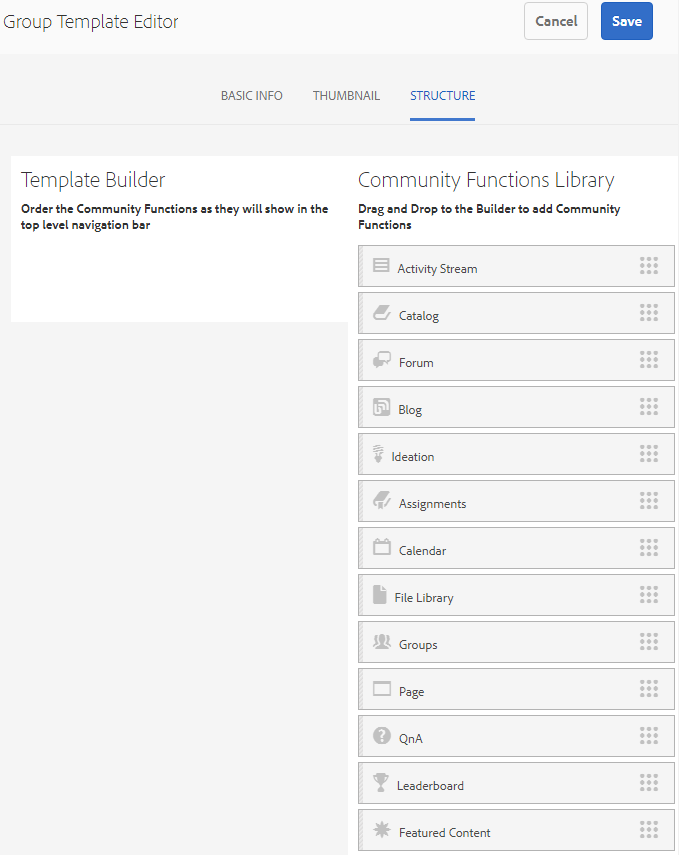

# 群組範本{#group-templates}

「群組範本」主控台類似於「網 [站範本](/help/communities/sites.md) 」主控台。 兩者都是構成社群網站的預先連線頁面和功能的藍圖。 區別在於，網站範本是主社群的範本，而群組範本是社群群組（主社群內巢狀的子社群）的範本。

社群群群組會納入網站範本，方法是加入 [Groups函式](/help/communities/functions.md#groups-function) （該函式可能不是範本中的第一個或唯一函式）。

自Communities功 [能套件1起](/help/communities/deploy-communities.md#latestfeaturepack)，您就可以將群組功能加入群組範本中，以巢狀內嵌群組。

當採取動作建立新社群群組時，就會選取群組的範本（結構）。 選取範圍取決於新增至網站或群組範本時，群組功能的設定方式。

>[!NOTE]
>
>用於建立社區站點的控 [制台](/help/communities/sites-console.md)、社 [區站點模板](/help/communities/sites.md)、 [社區組模板和社區功](/help/communities/tools-groups.md) 能僅供作者環境使用。

## 群組範本主控台 {#group-templates-console}

若要觸及AEM Author環境中的群組範本主控台：

* 選擇工 **具|社群|群組範本** ，來自全域導覽。

此控制台顯示可從中創 [建社區站點](/help/communities/sites-console.md) 的模板，並允許建立新組模板。

## 建立群組範本 {#create-group-template}

若要開始建立新群組範本，請選取 `Create`

這會顯示「網站編輯器」面板，其中包含3個子面板：

### 基本資訊 {#basic-info}

在「基本資訊」面板上，會設定名稱、說明以及範本是啟用還是停用：

* **新群組範本名稱**&#x200B;範本名稱ID

* **說明**

   範本說明

* **已禁用／啟用**

   切換開關控制模板是否可引用

#### 縮圖 {#thumbnail}

（可選）選取「上傳影像」圖示，向社群網站的建立者顯示縮圖以及名稱和說明。

#### 結構 {#structure}

>[!CAUTION]
>
>如果使用AEM 6.1 Communities FP4或更舊版本，請勿將群組函式新增至群組範本。
>
>自Communities [FP1起，巢狀群組功能就可使用](/help/communities/communities.md#latestfeaturepack)。
>
>仍不允許將群組函式新增為範本中的第一個或唯一函式。

若要新增社群功能，請依網站功能表連結的顯示順序，從右側拖曳至左側。 在建立網站時，樣式會套用至範本。

例如，如果您想要論壇，請將論壇函式從程式庫拖曳至範本產生器下方。 這將導致論壇配置對話框開啟。 有關配置 [對話框的資訊](/help/communities/functions.md) ，請參見函式控制台。

根據此範本，繼續拖放子社群網站（群組）所需的任何其他社群功能。

將所有所需功能拖放至範本建立工具區域並加以設定後，請選取右上角的「儲存**」。

## 編輯群組範本{#edit-group-template}

在主群組範本主控台中檢 [視社群群組時](#group-templates-console)，可以選取現有的群組範本進行編輯。

編輯群組範本不會影響已從範本建立的社群網站。 您可以直接 [編輯社群網站](/help/communities/sites-console.md#modify-structure)的結構。

此程式提供與建立群組范 [本相同的面板](#create-group-template)。
