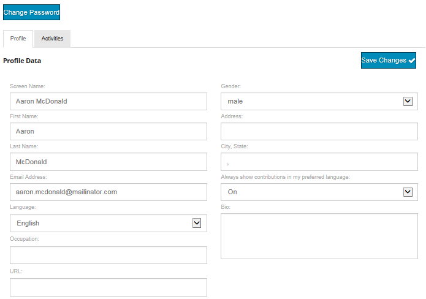

# 轉譯使用者產生的內容{#translating-user-generated-content}

AEM Communities的翻譯功能將[翻譯頁面內容](../../help/sites-administering/translation.md)的概念擴展到使用[社交元件框架(SCF)元件](scf.md)發佈到社區站點的用戶生成內容(UGC)。

UGC的翻譯可讓網站訪客和成員透過移除語言障礙來體驗全球社群。

例如，假設：

* 一位來自法國的成員用法語向一家跨國烹飪網站的社區論壇發佈食譜。
* 另一名來自日本的成員使用翻譯功能觸發將配方從法語翻譯成日語。
* 從日本來的會員讀完食譜後，用日文發了條評論。
* 來自法國的成員使用翻譯功能將日文評論翻譯成法文。
* 全球通信。

## 概覽 {#overview}

本文檔部分具體討論翻譯服務如何與UGC一起工作，同時假定您了解如何將AEM連接到[翻譯服務提供商](../../help/sites-administering/translation.md#connectingtoatranslationserviceprovider)，並通過配置[翻譯整合框架](../../help/sites-administering/tc-tic.md)將該服務整合到網站中。

當翻譯服務提供者與站點相關聯時，站點的每個語言副本維護其通過SCF元件（如注釋）發佈的UGC線程。

當除了翻譯服務提供者之外配置翻譯整合框架時，站點的每個語言副本可以共用UGC的單個線程，從而提供跨語言副本的全局通信。 配置的[全局共用儲存](#global-translation-of-ugc)使整個線程可以顯示，而不管從哪個語言副本查看它，都不能顯示討論線程。 此外，可以配置多個翻譯整合配置，為全局參與者的邏輯分組（例如按區域）指定不同的全局共用儲存。

## 預設翻譯服務{#the-default-translation-service}

AEM Communities包含[試用授權](../../help/sites-administering/tc-msconf.md#microsoft-translator-trial-license) ，適用於[預設翻譯服務](../../help/sites-administering/tc-msconf.md)，適用於多種語言。

當[建立社區站點](sites-console.md)時，當從[TRANSLATION](sites-console.md#translation)子面板中檢查`Allow Machine Translation`時，將啟用預設翻譯服務。

>[!CAUTION]
>
>預設翻譯服務僅用於演示。
>
>對於生產系統，需要許可的翻譯服務。 如果未獲得許可，預設翻譯服務應為[關閉](../../help/sites-administering/tc-msconf.md#microsoft-translator-trial-license-geometrixx-outdoors)。

## UGC {#global-translation-of-ugc}的全局轉換

當網站有多個[語言副本](../../help/sites-administering/tc-prep.md)時，預設翻譯服務不識別在一個網站上輸入的UGC可能與在另一個網站上輸入的UGC有關，就像UGC基本上由同一元件（包含該元件的頁面的語言副本）產生一樣。

與參加一個對話的一個大型群組中的每個人相比，這類群組討論話題時，他們不知道在非他們自己的群組中發表的評論。

如果需要「一個組對話」，則可以在具有多個語言副本的網站上啟用全局翻譯，這樣，無論從哪個語言副本查看該線程，整個線程都可以被看到。

例如，如果在基站上建立了論壇、建立了語言副本並啟用了全局翻譯，則以一個語言副本發佈到論壇的主題將出現在所有語言副本中。 對於任何答復，無論從哪個語言副本輸入答復，都是相同的。 結果是，無論檢視主題的語言副本為何，主題及其回覆的整個執行緒皆可看見。

>[!CAUTION]
>
>全域轉譯前存在的任何UGC都不再可見。
>
>雖然UGC仍位於[common store](working-with-srp.md)中，但它位於語言特定的UGC位置下，而配置全域轉換後新增的新內容則從全域共用儲存位置中擷取。
>
>沒有移轉工具可將語言特定內容移動或合併至全域共用存放區。

### 翻譯整合配置{#translation-integration-configuration}

若要建立新的翻譯整合，將翻譯服務連接器與製作執行個體上的網站整合：

* 以管理員身分登入
* 從[主菜單](http://localhost:4502/)
* 選擇&#x200B;**[!UICONTROL 工具]**
* 選擇&#x200B;**[!UICONTROL 操作]**
* 選擇&#x200B;**[!UICONTROL 雲]**
* 選擇&#x200B;**[!UICONTROL Cloud Services]**
* 向下捲動至&#x200B;**[!UICONTROL 翻譯整合]**

   

* 選擇&#x200B;**[!UICONTROL 顯示配置]**

   

* 選擇&#x200B;**[!UICONTROL 可用配置]**&#x200B;旁的`[+]`表徵圖以建立新配置

#### 建立配置對話框{#create-configuration-dialog}

* **[!UICONTROL 父設定]**

   （必要）通常保留為預設值。 預設值為`/etc/cloudservices/translation`。

* **[!UICONTROL 標題]**

   （必要）輸入您選擇的顯示標題。 無預設值。

* **[!UICONTROL 名稱]**

   （可選）輸入配置的名稱。 預設值是基於標題的節點名稱。

* 選擇&#x200B;**[!UICONTROL 建立]**

#### 翻譯配置對話框{#translation-config-dialog}

有關詳細說明，請訪問[建立翻譯整合配置](../../help/sites-administering/tc-tic.md#creating-a-translation-integration-configuration)

* **** Sitestab:可保留為預設值。

* **** 通訊標籤：
   * **[!UICONTROL 翻譯提]**
供程式從下拉清單中選擇翻譯提供程式。預設為 
`microsoft`，試用版。

   * **[!UICONTROL 內]**
容類別選擇描述要翻譯的內容的類別。預設為 
`General.`

   * **[!UICONTROL 選擇地區……]**
（可選）選擇儲存UGC的地區設定後，來自所有語言副本的貼文將出現在一個全域對話中。根據慣例，為網站的[基語](sites-console.md#translation)選擇語言環境。 選擇`No Common Store`將禁用全局轉換。 預設情況下，全局翻譯將被禁用。

* **** Assetstab:可保留為預設值。
* 選擇&#x200B;**[!UICONTROL OK]**

#### 啟動 {#activation}

新的翻譯整合雲端服務需要啟動至發佈環境。 與網站建立關聯後，如果尚未啟用，則啟動工作流程會在發佈與其關聯的頁面時，提示發佈此雲端服務設定。

## 管理翻譯設定{#managing-translation-settings}

>[!NOTE]
>
>**首選語言**
>
>為了偵測貼文是否使用與慣用語言不同的語言，必須建立網站訪客的慣用語言。
>
>首選語言是當網站訪客登入且已指定語言偏好設定時，在使用者設定檔中設定的語言偏好設定。
>
>當網站訪客是匿名的，或未在其設定檔中指定語言偏好設定時，偏好的語言為頁面範本的基本語言。

### 用戶首選項{#user-preference}

#### 使用者設定檔 {#user-profile}

所有社區站點都提供一個用戶配置檔案，這些用戶配置檔案可以編輯，以向社區標識自己並設定其首選項。

其中一種設定是是否一律以其偏好的語言顯示社群內容。 預設情況下，未設定此設定，並將預設為系統設定。 用戶可以將設定更改為「開啟」或「關閉」，從而覆蓋系統設定。

當頁面自動翻譯為使用者偏好的語言時，仍可使用顯示原始文字和改善翻譯的UI。

### 社區站點設定{#community-site-setting}

建立社群網站時，可以啟用和設定翻譯選項。 翻譯設定對匿名網站訪客可檢視的內容有效，但使用者的設定檔設定會覆寫。
