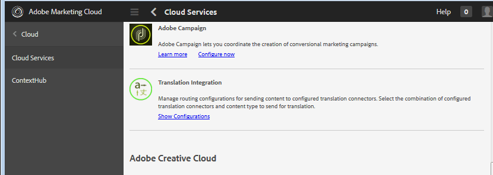

# 翻譯用戶生成的內容{#translating-user-generated-content}

用於AEM Communities的翻譯功能將[翻譯頁面內容](../../help/sites-administering/translation.md)的概念擴展到使用[社交元件框架(SCF)元件](scf.md)發佈到社區站點的用戶生成的內容(UGC)。

UGC的轉譯可讓網站訪客和成員透過移除語言障礙，體驗全球社群。

例如，假設：

* 一位來自法國的成員用法語向一家跨國烹飪網站的社區論壇發佈配方。
* 另一位來自日本的會員使用翻譯功能觸發將配方從法語翻譯成日語。
* 讀完日文配方後，來自日本的會員會以日文發表評論。
* 來自法國的成員使用翻譯功能將日文注釋翻譯成法文。
* 全球通訊。

## 概覽 {#overview}

本文檔部分專門討論翻譯服務如何與UGC一起使用，同時假定瞭解如何連接到AEM[翻譯服務提供商](../../help/sites-administering/translation.md#connectingtoatranslationserviceprovider)，並通過配置[翻譯整合框架](../../help/sites-administering/tc-tic.md)將該服務整合到網站。

當翻譯服務提供者與站點相關聯時，站點的每個語言副本會維護其通過SCF元件（如注釋）發佈的UGC線程。

當除了翻譯服務提供者之外配置翻譯整合框架時，站點的每個語言副本可以共用UGC的單個線程，從而跨語言副本提供全局通信。 配置的[全局共用儲存](#global-translation-of-ugc)使整個線程能夠顯示，而不管從哪個語言副本查看該線程。 此外，可以配置多個翻譯整合配置，以指定不同的全局共用儲存，用於全局參與者的邏輯分組，例如按區域進行。

## 預設翻譯服務{#the-default-translation-service}

AEM Communities包含[試用版授權](../../help/sites-administering/tc-msconf.md#microsoft-translator-trial-license)，適用於對多種語言啟用的[預設翻譯服務](../../help/sites-administering/tc-msconf.md)。

當[建立社區站點](sites-console.md)時，當從[TRANSLATION](sites-console.md#translation)子面板檢查`Allow Machine Translation`時，將啟用預設翻譯服務。

>[!CAUTION]
>
>預設翻譯服務僅用於演示。
>
>對於生產系統，需要許可的翻譯服務。 如果未獲得許可，則預設翻譯服務應關閉。

## UGC的全局翻譯{#global-translation-of-ugc}

當網站有多個[語言副本](../../help/sites-administering/tc-prep.md)時，預設翻譯服務不識別在一個網站上輸入的UGC可能與在另一個網站上輸入的UGC有關，因為UGC實際上是由同一元件（包含該元件的頁面的語言副本）生成。

這類似於討論某個主題的群組，與參與一個對話的群組中的每個人相比，這些群組並不知道在非他們自己的群組中發表的評論。

如果需要「單一群組對話」，則可以跨具有多語言副本的網站啟用全域翻譯，如此，無論從哪個語言副本檢視整個執行緒，都可以看到它。

例如，如果論壇是在基本網站上建立、建立語言副本並啟用全域翻譯，則張貼在論壇的主題會以一種語言副本顯示在所有語言副本中。 任何回覆也會如此，無論回覆是從哪種語言輸入。 結果是，無論檢視主題的語言副本為何，主題及其整個回覆執行緒都可見。

>[!CAUTION]
>
>在全域轉譯之前存在的任何UGC都不再可見。
>
>雖然UGC仍位於[common store](working-with-srp.md)中，但位於語言特定的UGC位置下，而在設定全域轉換後新增的新內容則從全域共用商店位置擷取。
>
>沒有移轉工具可將特定語言的內容移入或合併至全域共用商店。

### 翻譯整合配置{#translation-integration-configuration}

要建立新的翻譯整合，將翻譯服務連接器與作者實例上的網站整合：

* 以管理員身分登入
* 從[主菜單](http://localhost:4502/)
* 選擇&#x200B;**[!UICONTROL 工具]**
* 選擇&#x200B;**[!UICONTROL 操作]**
* 選擇&#x200B;**[!UICONTROL Cloud]**
* 選擇&#x200B;**[!UICONTROL Cloud Services]**
* 向下滾動到&#x200B;**[!UICONTROL 翻譯整合]**

   

* 選擇&#x200B;**[!UICONTROL 顯示配置]**

   

* 選擇&#x200B;**[!UICONTROL 可用配置]**&#x200B;旁邊的`[+]`表徵圖以建立新配置

#### 建立配置對話框{#create-configuration-dialog}

* **[!UICONTROL 父設定]**

   （必要）通常保留為預設值。 預設值為`/etc/cloudservices/translation`。

* **[!UICONTROL 標題]**

   （必要）輸入您選擇的顯示標題。 無預設值。

* **[!UICONTROL 名稱]**

   （可選）輸入配置的名稱。 預設值是基於「標題」的節點名稱。

* 選擇&#x200B;**[!UICONTROL 建立]**

#### 翻譯配置對話框{#translation-config-dialog}

有關詳細說明，請訪問[建立翻譯整合配置](../../help/sites-administering/tc-tic.md#creating-a-translation-integration-configuration)

* **[!UICONTROL 網]** 站標籤：可以保留為預設值。

* **[!UICONTROL 社]** 區：
   * **[!UICONTROL 翻譯提]**
供者從下拉清單中選擇翻譯提供者。預設值為 
`microsoft`、試用版服務。

   * **[!UICONTROL 內容]**
類別選擇說明要翻譯內容的類別。預設值為 
`General.`

   * **[!UICONTROL 選擇地區……]**
（選擇性）透過選取儲存UGC的地區設定，所有語言副本的貼文都會出現在一個全域對話中。根據慣例，請為網站選擇[基本語言](sites-console.md#translation)的地區。 選擇`No Common Store`將禁用全局轉換。 預設情況下，全局轉換處於禁用狀態。

* **** Assetstab:可以保留為預設值。
* 選擇&#x200B;**[!UICONTROL 確定]**

#### 啟動 {#activation}

新的翻譯整合雲端服務必須啟動至發佈環境。 當與網站關聯時，如果尚未啟動，啟動工作流程會在發佈與其關聯的頁面時提示發佈此雲端服務設定。

## 管理翻譯設定{#managing-translation-settings}

>[!NOTE]
>
>**首選語言**
>
>為了偵測貼文是否使用不同於偏好語言的語言，必須建立網站訪客的偏好語言。
>
>首選語言是當網站訪客登入並指定語言偏好設定時，在使用者描述檔中設定的語言偏好設定。
>
>當網站訪客是匿名的，或未在其描述檔中指定語言偏好設定時，首選語言是頁面範本的基本語言。

### 用戶首選項{#user-preference}

#### 使用者設定檔 {#user-profile}

所有社群網站都提供登入會員的使用者設定檔，供其編輯，以便向社群識別自己並設定其偏好設定。

其中一項設定是是否一律以其偏好的語言顯示社群內容。 預設情況下，設定未設定，將預設為系統設定。 用戶可以將設定更改為「開啟」或「關閉」，從而覆蓋系統設定。

當頁面自動翻譯為使用者偏好的語言時，仍可使用顯示原始文字和改善翻譯的UI。

### 社群網站設定{#community-site-setting}

建立社區站點時，可以啟用和配置翻譯選項。 轉換設定適用於匿名網站訪客可檢視的內容，但會由使用者的設定檔設定覆寫。
