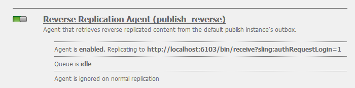

# 部署社群{#deploying-communities}

## 必備條件 {#prerequisites}

* [AEM 6.5平台](/help/sites-deploying/deploy.md)

* AEM Communities授權

* 可選許可：

   * [Adobe Analytics for Communities功能](/help/communities/analytics.md)
   * [MSRP適用的MongoDB](/help/communities/msrp.md)
   * [適用於ASRP的Adobe雲](/help/communities/asrp.md)

## 安裝檢查清單 {#installation-checklist}

**若 [AEM platform](/help/sites-deploying/deploy.md#what-is-aem)**:

* 安裝最新 [AEM 6.5更新](#aem64updates).

* 如果不使用預設埠(4502、4503)，則 [配置複製代理](#replication-agents-on-author).
* [複製加密密鑰](#replicate-the-crypto-key)
* 如果支援全球化， [設定自動翻譯](/help/sites-administering/translation.md)
（提供開發用的範例設定）。

**若 [社群功能](/help/communities/overview.md)**:

* 若部署 [發佈農場](/help/sites-deploying/recommended-deploys.md#tarmk-farm), [識別主要發行者](#primary-publisher)

* [啟用通道服務](#tunnel-service-on-author)
* [啟用社交登入](/help/communities/social-login.md#adobe-granite-oauth-authentication-handler)
* [設定Adobe Analytics](/help/communities/analytics.md)
* 設定 [預設電子郵件服務](/help/communities/email.md)
* 確定 [共用UGC儲存](/help/communities/working-with-srp.md) (**SRP**)

   * 如果MongoDB SRP [(MSRP)](/help/communities/msrp.md)

      * [安裝和配置MongoDB](/help/communities/msrp.md#mongodb-configuration)
      * [配置Solr](/help/communities/solr.md)
      * [選擇MSRP](/help/communities/srp-config.md)
   * 如果關係資料庫SRP [(DSRP)](/help/communities/dsrp.md)

      * [安裝MySQL的JDBC驅動程式](#jdbc-driver-for-mysql)
      * [安裝和配置DSRP適用的MySQL](/help/communities/dsrp-mysql.md)
      * [配置Solr](/help/communities/solr.md)
      * [選擇DSRP](/help/communities/srp-config.md)
   * 如果AdobeSRP [(ASRP)](/help/communities/asrp.md)

      * 與您的帳戶代表合作以進行布建。
      * [選擇ASRP](/help/communities/srp-config.md)
   * 如果JCR SRP [(JSRP)](/help/communities/jsrp.md)

      * 不是共用UGC儲存：

         * UGC從未複製。
         * UGC只會顯示在輸入UGC的AEM例項或叢集上。
      * 預設為JSRP


## 最新發行 {#latest-releases}

AEM 6.5 Communities GA包含Communities套件。 了解AEM 6.5的更新 [社群](/help/release-notes/release-notes.md#experiencemanagercommunities)，請參閱 [AEM 6.5發行說明](/help/release-notes/release-notes.md#communities-release-notes.html).

### AEM 6.5更新 {#aem-updates}

自AEM 6.4開始，Communities的更新會隨AEM Cumulative Fix Pack和Service Pack一併提供。

如需AEM 6.5的最新更新，請參閱 [Adobe Experience Manager 6.4 Cumulative Fix Pack和Service Pack](https://helpx.adobe.com/tw/experience-manager/aem-releases-updates.html).

### 版本記錄 {#version-history}

如同AEM 6.4及更新版本，AEM Communities功能和Hotfix是AEM Communities Cumulative Fix Pack和Service Pack的一部分。 因此，沒有單獨的功能套件。

### MySQL的JDBC驅動程式 {#jdbc-driver-for-mysql}

一個Communities功能使用MySQL資料庫：

* 針對 [DSRP](/help/communities/dsrp.md):儲存用戶生成的內容(UGC)

必須單獨獲得並安裝MySQL連接器。

必要步驟為：

1. 從下載ZIP封存 [https://dev.mysql.com/downloads/connector/j/](https://dev.mysql.com/downloads/connector/j/)

   * 版本必須>= 5.1.38

1. 提取 `mysql-connector-java-&lt;version&gt;-bin.jar (bundle) from the archive`
1. 使用Web主控台來安裝和啟動套件組合：

   * 例如， https://localhost:4502/system/console/bundles
   * 選取 **`Install/Update`**
   * 瀏覽……以選取從下載的ZIP封存擷取的套件組合
   * 檢查 *Oracle公司的MySQLcom.mysql.jdbc JDBC驅動程式* 處於作用中狀態，若非則啟動（或檢查記錄）

1. 如果在配置JDBC後在現有部署上進行安裝，則從Web控制台中重新保存JDBC配置，將JDBC重新綁定到新連接器：

   * 例如， https://localhost:4502/system/console/configMgr
   * 找出 `Day Commons JDBC Connections Pool` 設定，然後選取以開啟設定。
   * 選取 `Save`.

1. 在所有製作和發佈執行個體上重複步驟3和4。

有關安裝套件的詳細資訊，請參閱 [Web主控台](/help/sites-deploying/web-console.md#bundles) 頁面。

#### 範例：已安裝的MySQL連接器套件組合 {#example-installed-mysql-connector-bundle}


### AEM進階MLS {#aem-advanced-mls}

為了支援進階多語言搜尋(MLS),SRP集合（MSRP或DSRP）除了自訂結構和Solr組態外，還需要新的Solr外掛程式。 所有必要項目都封裝成可下載的zip檔案。

您可從Adobe存放庫取得進階MLS下載（也稱為「phasetwo」）:

* [AEM-SOLR-MLS-phasetwo](https://repo1.maven.org/maven2/com/adobe/tat/AEM-SOLR-MLS-phasetwo/1.2.40/)

   * 1.2.40版，2016年4月6日
   * 下載AEM-SOLR-MLS-phasetwo-1.2.40.zip

如需詳細資訊和安裝資訊，請造訪 [Solr配置](/help/communities/solr.md) SRP.

### 關於封裝共用的連結 {#about-links-to-package-share}

**AdobeAEM Cloud中可見的套件**

此頁面上的套件連結不需要執行任何AEM例項，因為它們要在上封裝共用 `adobeaemcloud.com`. 當可檢視套件時， `Install` 按鈕，將套件安裝至Adobe托管網站。 如果要安裝在本機AEM執行個體，請選取 `Install` 會導致錯誤。

**如何在本機AEM執行個體上安裝**

若要安裝中可見的套件 `adobeaemcloud.com` 在本機AEM執行個體上，必須先將套件下載至本機磁碟：

* 選取 **資產** 標籤
* 選擇 **下載到磁碟**

在本機AEM例項上，使用套件管理器(例如 [https://localhost:4502/crx/packmgr/](https://localhost:4502/crx/packmgr/))，上傳至本機AEM套件存放庫。

或者，從本機AEM例項使用套件共用來存取套件(例如 [https://localhost:4502/crx/packageshare/](https://localhost:4502/crx/packageshare/)), `Download` 按鈕會下載至本機AEM例項的套件存放庫。

進入本機AEM例項的套件存放庫後，請使用套件管理器來安裝套件。

如需詳細資訊，請造訪 [如何使用套件](/help/sites-administering/package-manager.md#package-share).

## 建議的部署 {#recommended-deployments}

在AEM Communities中，通用存放區用於儲存使用者產生的內容(UGC)，通常稱為 [儲存資源提供程式(SRP)](/help/communities/working-with-srp.md). 建議的部署中心是為通用商店選擇SRP選項。

通用商店支援在發佈環境中協調和分析UGC，同時不需要 [複製](/help/communities/sync.md) UGC的。

* [社群內容商店](/help/communities/working-with-srp.md) :討論AEM社群的SRP儲存選項

* [建議的拓撲](/help/communities/topologies.md) :根據使用案例和SRP選擇討論要使用的拓撲

## 升級 {#upgrading}

從舊版AEM升級至AEM 6.5平台時，請務必閱讀 [升級至AEM 6.5](/help/sites-deploying/upgrade.md).

除了升級平台外，請閱讀 [升級至AEM Communities 6.5](/help/communities/upgrade.md) 了解社群變更。

## 設定 {#configurations}

### 主要發行者 {#primary-publisher}

當選擇的部署為 [發佈農場](/help/communities/topologies.md#tarmk-publish-farm)，則必須將一個AEM發佈例項識別為 **`primary publisher`** 適用於不應發生在所有例項的活動，例如依賴的功能 **通知** 或 **Adobe Analytics**.

依預設， `AEM Communities Publisher Configuration` OSGi設定是使用 **`Primary Publisher`** 核取方塊，使發佈伺服器陣列中的所有發佈執行個體都能自行識別為主要。

因此，有必要 **在所有次要發佈執行個體上編輯設定** 取消選中 **`Primary Publisher`** 框。


針對發佈伺服器陣列中的所有其他（次要）發佈執行個體：

* 以管理員權限登入
* 存取 [Web主控台](/help/sites-deploying/configuring-osgi.md)

   * 例如， [https://localhost:4503/system/console/configMgr](https://localhost:4503/system/console/configMgr)

* 找出 `AEM Communities Publisher Configuration`
* 選取編輯圖示
* 取消核取 **主要發行者** 核取方塊
* 選擇 **儲存**

### 製作上的復寫代理 {#replication-agents-on-author}

復寫適用於在發佈環境中建立的網站內容，例如社群群組，以及使用 [隧道服務](#tunnel-service-on-author).

對於主要發佈者，請確定 [複製代理配置](/help/sites-deploying/replication.md) 正確識別發佈伺服器和授權使用者。 預設授權用戶， `admin` 已具有適當的權限(是 `Communities Administrators`)。

為了讓某些其他使用者擁有適當的權限，他們必須新增為 `administrators` 使用者群組(也是 `Communities Administrators`)。

製作環境中有兩個復寫代理需要正確設定傳輸設定。

* 在作者上存取復寫主控台

   * 從全域導覽： **工具，部署，複製，作者代理**

* 請對兩個代理執行相同的程式：

   * **預設代理（發佈）**
   * **反向復寫代理（發佈反向）**

      1. 選擇代理。
      1. 選擇 **編輯**.
      1. 選取 **運輸** 標籤
      1. 如果不是埠 `4503`，編輯 **URI** 指定正確的埠。

      1. 如果不是用戶 `admin`，編輯 **使用者** 和 **密碼** 指定 `administrators` 使用者群組。

下圖顯示將埠從4503更改為6103的結果：

#### 預設代理（發佈） {#default-agent-publish}


#### 反向復寫代理（發佈反向） {#reverse-replication-agent-publish-reverse}



### 作者的通道服務 {#tunnel-service-on-author}

將製作環境用於 [建立網站](/help/communities/sites-console.md), [修改站點屬性](/help/communities/sites-console.md#modifying-site-properties) 或 [管理社群成員](/help/communities/members.md)，則必須存取在發佈環境中註冊的成員（使用者），而非在作者上註冊的使用者。

隧道服務使用製作上的復寫代理提供此存取。

啟用通道服務：

* 開啟 **作者**，請使用管理權限登入。
* 如果發佈者不是localhost:4503或傳輸使用者不是 `admin`，然後 [配置複製代理](#replication-agents-on-author).

* 存取 [Web主控台](/help/sites-deploying/configuring-osgi.md)

   * 例如， [https://localhost:4502/system/console/configMgr](https://localhost:4502/system/console/configMgr)

* 找出 `AEM Communities Publish Tunnel Service`
* 選取編輯圖示
* 選取 **啟用** 核取方塊
* 選取 **儲存**


### 複製加密密鑰 {#replicate-the-crypto-key}

AEM Communities有兩項功能需要所有AEM伺服器執行個體使用相同的加密金鑰。 這些是 [Analytics](/help/communities/analytics.md) 和 [ASRP](/help/communities/asrp.md).

自AEM 6.3起，重要資料會儲存在檔案系統中，而不再儲存在存放庫中。

若要將主要材料從作者複製到所有其他執行個體，必須：

* 存取AEM例項，通常為製作例項，其中包含要複製的重要資料

   * 找出 `com.adobe.granite.crypto.file` 本地檔案系統中的綁定

      例如，

      * `<author-aem-install-dir>/crx-quickstart/launchpad/felix/bundle21`
      * 此 `bundle.info` 檔案將識別套件組合
   * 導覽至資料夾，例如

      * `<author-aem-install-dir>/crx-quickstart/launchpad/felix/bundle21/data`
   * 複製hmac和主節點檔案。


* 針對每個目標AEM例項

   * 導覽至資料夾，例如

      * `<publish-aem-install-dir>/crx-quickstart/launchpad/felix/bundle21/data`
   * 貼上先前複製的2個檔案
   * 有必要 [重新整理Granite加密套件](#refresh-the-granite-crypto-bundle) 如果target AEM例項目前執行中。


>[!CAUTION]
>
>如果已基於加密密鑰配置了另一個安全功能，則複製加密密鑰可能會損壞配置。 為了協助， [聯絡客戶服務](https://helpx.adobe.com/tw/marketing-cloud/contact-support.html).

#### 存放庫復寫 {#repository-replication}

如同AEM 6.2及更舊版本一樣，將關鍵資料儲存在儲存庫中，可借由在每個AEM例項（會建立初始存放庫）首次啟動時指定下列系統屬性來保留：

* `-Dcom.adobe.granite.crypto.file.disable=true`

>[!NOTE]
>
>請務必確認 [製作時的復寫代理](#replication-agents-on-author) 已正確設定。

將金鑰資料儲存在存放庫中，將加密金鑰從製作複製到其他執行個體的方式如下：

使用 [CRXDE Lite](/help/sites-developing/developing-with-crxde-lite.md) :

* 瀏覽至 [https://&lt;server>:&lt;port>/crx/de](https://localhost:4502/crx/de)
* 選取 `/etc/key`
* 開啟 `Replication` 標籤
* 選取 `Replicate`

* [重新整理Granite加密套件](#refresh-the-granite-crypto-bundle)


#### 重新整理Granite加密套件組合 {#refresh-the-granite-crypto-bundle}

* 在每個發佈例項上，存取 [Web主控台](/help/sites-deploying/configuring-osgi.md)

   * 例如， [https://&lt;server>:&lt;port>/system/console/bundles](https://localhost:4503/system/console/bundles)

* 找出 `Adobe Granite Crypto Support` 套件組合(com.adobe.granite.crypto)
* 選擇 **重新整理**


* 過了一會兒， **成功** 對話方塊中顯示：
   `Operation completed successfully.`

### Apache HTTP Server {#apache-http-server}

如果使用Apache HTTP伺服器，請確保對所有相關條目使用正確的伺服器名稱。

尤其是，請小心使用正確的伺服器名稱，而非 `localhost`，在 `RedirectMatch`.

#### httpd.conf範例 {#httpd-conf-sample}

```shell
<IfModule alias_module>
     # XAMPP does not have a favicon; this prevents any 404 errors which may arise.
     Redirect 404 /favicon.ico
     <Location /favicon.ico>
         ErrorDocument 404 "No favicon"
     </Location>

    # Return from "Sign Out" generates response header directing you to "/", generating a 404 error
    # The RedirectMatch resolves it correctly when modified for the target Community Site :
    RedirectMatch ^/$ https://[server name]/content/sites/engage/en.html
 ...
 </IfModule>
```

### Dispatcher {#dispatcher}

如果使用Dispatcher，請參閱：

* AEM [Dispatcher](https://helpx.adobe.com/experience-manager/dispatcher/using/dispatcher.html) 檔案
* [安裝 Dispatcher](https://helpx.adobe.com/experience-manager/dispatcher/using/dispatcher-install.html)
* [為社群設定Dispatcher](/help/communities/dispatcher.md)
* [已知問題](/help/communities/troubleshooting.md#dispatcher-refetch-fails)

## 相關社群檔案 {#related-communities-documentation}

* 瀏覽 [管理社群網站](/help/communities/administer-landing.md) 了解如何建立社群網站、設定社群網站範本、協調社群內容、管理成員及設定訊息。

* 瀏覽 [開發社區](/help/communities/communities.md) 了解社交元件架構(SCF)和自訂社群元件和功能。

* 瀏覽 [編寫Communities元件](/help/communities/author-communities.md) 了解如何使用和設定Communities元件。

