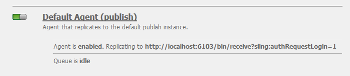

# 部署社區{#deploying-communities}

## 必備條件 {#prerequisites}

* [6AEM.5平台](/help/sites-deploying/deploy.md)

* AEM Communities牌照

* 可選許可證：

   * [Adobe Analytics社區功能](/help/communities/analytics.md)
   * [用於MSRP的MongoDB](/help/communities/msrp.md)
   * [用於ASRP的Adobe雲](/help/communities/asrp.md)

## 安裝核對表 {#installation-checklist}

**對於 [AEM平台](/help/sites-deploying/deploy.md#what-is-aem)**:

* 安裝最新 [AEM6.5更新](#aem64updates)。

* 如果未使用預設埠(4502、4503)，則 [配置複製代理](#replication-agents-on-author)。
* [複製加密密鑰](#replicate-the-crypto-key)
* 如果支援全球化， [設定自動翻譯](/help/sites-administering/translation.md)
（提供開發示例設定）。

**對於 [社區功能](/help/communities/overview.md)**:

* 如果部署 [發佈場](/help/sites-deploying/recommended-deploys.md#tarmk-farm)。 [標識主發佈者](#primary-publisher)

* [啟用隧道服務](#tunnel-service-on-author)
* [啟用社交登錄](/help/communities/social-login.md#adobe-granite-oauth-authentication-handler)
* [配置Adobe Analytics](/help/communities/analytics.md)
* 設定 [預設電子郵件服務](/help/communities/email.md)
* 確定 [共用UGC儲存](/help/communities/working-with-srp.md) (**SRP**)

   * 如果MongoDB SRP [(MSRP)](/help/communities/msrp.md)

      * [安裝和配置MongoDB](/help/communities/msrp.md#mongodb-configuration)
      * [配置Solr](/help/communities/solr.md)
      * [選擇MSRP](/help/communities/srp-config.md)
   * 如果關係資料庫SRP [(DSRP)](/help/communities/dsrp.md)

      * [為MySQL安裝JDBC驅動程式](#jdbc-driver-for-mysql)
      * [安裝和配置MySQL for DSRP](/help/communities/dsrp-mysql.md)
      * [配置Solr](/help/communities/solr.md)
      * [選擇DSRP](/help/communities/srp-config.md)
   * 如果AdobeSRP [(ASRP)](/help/communities/asrp.md)

      * 與您的客戶代表合作進行預配。
      * [選擇ASRP](/help/communities/srp-config.md)
   * 如果JCR SRP [(JSRP)](/help/communities/jsrp.md)

      * 不是共用UGC儲存：

         * UGC從不複製。
         * UGC僅在輸入AEM它的實例或群集上可見。
      * 預設值為JSRP


## 最新版本 {#latest-releases}

AEM6.5 《社區一般化》包括社區一攬子方案。 瞭解6.AEM5的更新 [社區](/help/release-notes/release-notes.md#experiencemanagercommunities)，請參閱 [AEM6.5發行說明](/help/release-notes/release-notes.md#communities-release-notes.html)。

### AEM6.5更新 {#aem-updates}

從6.AEM4開始，將社區更新作為累積修復包和AEMService Pack的一部分提供。

有關6.5的最AEM新更新，請參見 [Adobe Experience Manager6.4累積修復包和服務包](https://helpx.adobe.com/tw/experience-manager/aem-releases-updates.html)。

### 版本歷史記錄 {#version-history}

與6.4及更AEM高版本一樣，AEM Communities功能和修補程式是AEM Communities累積修復包和服務包的一部分。 因此，沒有單獨的功能包。

### MySQL的JDBC驅動程式 {#jdbc-driver-for-mysql}

「一個社區」功能使用MySQL資料庫：

* 對於 [DSRP](/help/communities/dsrp.md):儲存用戶生成的內容(UGC)

必須單獨獲取和安裝MySQL連接器。

必要的步驟是：

1. 從下載ZIP存檔 [https://dev.mysql.com/downloads/connector/j/](https://dev.mysql.com/downloads/connector/j/)

   * 版本必須>= 5.1.38

1. 提取 `mysql-connector-java-&lt;version&gt;-bin.jar (bundle) from the archive`
1. 使用Web控制台安裝並啟動包：

   * 例如，https://localhost:4502/system/console/bundles
   * 選取 **`Install/Update`**
   * 瀏覽……選擇從下載的ZIP存檔中提取的包
   * 檢查 *Oracle公司的MySQLcom.mysql.jdbc的JDBC驅動程式* 活動，如果不活動，則啟動（或檢查日誌）

1. 如果在配置JDBC後在現有部署上安裝，則通過從Web控制台重新保存JDBC配置，將JDBC重新綁定到新連接器：

   * 例如，https://localhost:4502/system/console/configMgr
   * 定位 `Day Commons JDBC Connections Pool` 並選擇以開啟配置。
   * 選取 `Save`.

1. 對所有作者和發佈實例重複步驟3和4。

有關安裝捆綁包的詳細資訊，請參閱 [Web控制台](/help/sites-deploying/web-console.md#bundles) 的子菜單。

#### 示例：已安裝的MySQL連接器包 {#example-installed-mysql-connector-bundle}


### 高AEM級MLS {#aem-advanced-mls}

為了支援高級多語言搜索(MLS),SRP集合（MSRP或DSRP）需要新的Solr插件，此外還需要自定義架構和Solr配置。 所有必需項都打包到可下載的zip檔案中。

高級MLS下載（也稱為「phasetwo」）可從Adobe儲存庫獲得：

* [AEM-SOLR-MLS — 相二](https://repo1.maven.org/maven2/com/adobe/tat/AEM-SOLR-MLS-phasetwo/1.2.40/)

   * 版本1.2.40 , 2016年4月6日
   * 下AEM載 — SOLR-MLS-phasetwo-1.2.40.zip

有關詳細資訊和安裝資訊，請訪問 [Solr配置](/help/communities/solr.md) SRP

### 關於到包共用的連結 {#about-links-to-package-share}

**在Adobe雲中可AEM見的包**

此頁上到包的連結不需要運行實例，AEM因為它們要在上共用包 `adobeaemcloud.com`。 當可查看包時， `Install` 按鈕用於將包安裝到Adobe托管站點中。 如果要安裝在本地實例AEM上，請選擇 `Install` 將導致錯誤。

**如何在本地實例上安AEM裝**

安裝中可見的軟體包 `adobeaemcloud.com` 在本AEM地實例上，必須先將包下載到本地磁碟：

* 選擇 **資產** 頁籤
* 選擇 **下載到磁碟**

在本地實AEM例上，使用包管理器(例如 [https://localhost:4502/crx/packmgr/](https://localhost:4502/crx/packmgr/))，上載到本地包存AEM儲庫。

或者，使用包共用從本地實例訪AEM問包(例如， [https://localhost:4502/crx/packageshare/](https://localhost:4502/crx/packageshare/)) `Download` 按鈕將下載到AEM本地實例的包儲存庫。

在本地實例AEM的包儲存庫中，使用包管理器安裝包。

有關詳細資訊，請訪問 [如何使用包](/help/sites-administering/package-manager.md#package-share)。

## 建議的部署 {#recommended-deployments}

在AEM Communities，公共儲存用於儲存用戶生成的內容(UGC)，通常稱為 [儲存資源提供程式(SRP)](/help/communities/working-with-srp.md)。 建議的部署重點是為公用儲存選擇SRP選項。

公用儲存支援在發佈環境中對UGC進行審核和分析，同時消除對 [複製](/help/communities/sync.md) UGC。

* [社區內容儲存](/help/communities/working-with-srp.md) :討論社區的SRP儲存選AEM項

* [推薦的拓撲](/help/communities/topologies.md) :討論根據使用情形和SRP選擇使用的拓撲

## 升級 {#upgrading}

從以前版本AEM升級到6.5平台AEM時，必須閱讀 [升級AEM到6.5](/help/sites-deploying/upgrade.md)。

除升級平台外，請閱讀 [升級到AEM Communities6.5](/help/communities/upgrade.md) 瞭解社區更改。

## 設定 {#configurations}

### 主發佈伺服器 {#primary-publisher}

當選擇的部署是 [發佈場](/help/communities/topologies.md#tarmk-publish-farm)，則必須AEM將一個發佈實例標識為 **`primary publisher`** 不應在所有實例上發生的活動，例如依賴的功能 **通知** 或 **Adobe Analytics**。

預設情況下， `AEM Communities Publisher Configuration` OSGi配置配置 **`Primary Publisher`** 複選框，這樣發佈場中的所有發佈實例都將自我標識為主實例。

因此，有必要 **編輯所有輔助發佈實例的配置** 取消選中 **`Primary Publisher`** 的子菜單。


對於發佈場中的所有其他（輔助）發佈實例：

* 使用管理員權限登錄
* 訪問 [Web控制台](/help/sites-deploying/configuring-osgi.md)

   * 比如說， [https://localhost:4503/system/console/configMgr](https://localhost:4503/system/console/configMgr)

* 查找 `AEM Communities Publisher Configuration`
* 選擇編輯表徵圖
* 取消選中 **主發佈伺服器** 複選框
* 選擇 **保存**

### 作者上的複製代理 {#replication-agents-on-author}

複製用於在發佈環境中建立的站點內容，以及使用 [隧道服務](#tunnel-service-on-author)。

對於主發佈者，確保 [複製代理配置](/help/sites-deploying/replication.md) 正確標識發佈伺服器和授權用戶。 預設授權用戶， `admin` 已具有相應權限(是 `Communities Administrators`)。

為了使某些其他用戶具有相應的權限，必須將其作為成員添加到 `administrators` 用戶組(也是 `Communities Administrators`)。

作者環境中有兩個複製代理需要正確配置傳輸配置。

* 在作者上訪問複製控制台

   * 從全局導航： **工具、部署、複製、作者代理**

* 對兩個代理執行相同的過程：

   * **預設代理（發佈）**
   * **反向複製代理（發佈反向）**

      1. 選擇代理。
      1. 選擇 **編輯**。
      1. 選擇 **運輸** 頁籤
      1. 如果不是埠 `4503`編輯 **URI** 指定正確的埠。

      1. 如果不是用戶 `admin`編輯 **用戶** 和 **密碼** 指定成員 `administrators` 用戶組。

下圖顯示了將埠從4503更改為6103的結果：

#### 預設代理（發佈） {#default-agent-publish}



#### 反向複製代理（發佈反向） {#reverse-replication-agent-publish-reverse}


### 作者隧道服務 {#tunnel-service-on-author}

使用作者環境時 [建立站點](/help/communities/sites-console.md)。 [修改站點屬性](/help/communities/sites-console.md#modifying-site-properties) 或 [管理社區成員](/help/communities/members.md)，必須訪問在發佈環境中註冊的成員（用戶），而不是在作者上註冊的用戶。

隧道服務使用作者上的複製代理提供此訪問。

啟用隧道服務：

* 開 **作者**，使用管理權限登錄。
* 如果發佈伺服器不是localhost:4503或傳輸用戶不是 `admin`，則 [配置複製代理](#replication-agents-on-author)。

* 訪問 [Web控制台](/help/sites-deploying/configuring-osgi.md)

   * 比如說， [https://localhost:4502/system/console/configMgr](https://localhost:4502/system/console/configMgr)

* 查找 `AEM Communities Publish Tunnel Service`
* 選擇編輯表徵圖
* 選擇 **啟用** 複選框
* 選擇 **保存**


### 複製加密密鑰 {#replicate-the-crypto-key}

AEM Communities有兩項功能，要求所AEM有伺服器實例使用相同的加密密鑰。 這些 [分析](/help/communities/analytics.md) 和 [ASRP](/help/communities/asrp.md)。

截至AEM6.3，密鑰材料已儲存在檔案系統中，而不再儲存在儲存庫中。

為了將關鍵材料從作者複製到所有其他實例，必須：

* 訪問AEM包含要複製的關鍵材料的實例（通常為作者實例）

   * 查找 `com.adobe.granite.crypto.file` 本地檔案系統中的捆綁

      例如，

      * `<author-aem-install-dir>/crx-quickstart/launchpad/felix/bundle21`
      * 的 `bundle.info` 檔案將標識包
   * 導航到資料資料夾，例如

      * `<author-aem-install-dir>/crx-quickstart/launchpad/felix/bundle21/data`
   * 複製hmac和主節點檔案。


* 對於每個目標實AEM例

   * 導航到資料資料夾，例如

      * `<publish-aem-install-dir>/crx-quickstart/launchpad/felix/bundle21/data`
   * 貼上以前複製的2個檔案
   * 有必要 [刷新花崗岩加密捆綁包](#refresh-the-granite-crypto-bundle) 目標實例AEM當前正在運行。


>[!CAUTION]
>
>如果已經配置了基於加密密鑰的另一個安全功能，則複製加密密鑰可能會損壞配置。 為了幫助， [聯繫客戶](https://helpx.adobe.com/tw/marketing-cloud/contact-support.html)。

#### 儲存庫複製 {#repository-replication}

將關鍵材料儲存在儲存庫中（與6.2及更早版本的情況相同）AEM，可通過在每個實例的首次啟動時指定以下系統屬性（建立初始儲存庫）來保AEM留：

* `-Dcom.adobe.granite.crypto.file.disable=true`

>[!NOTE]
>
>驗證 [作者中的複製代理](#replication-agents-on-author) 已正確配置。

將密鑰材料儲存在儲存庫中，將加密密鑰從作者複製到其他實例的方式如下：

使用 [CRXDE Lite](/help/sites-developing/developing-with-crxde-lite.md) :

* 瀏覽到 [https://&lt;server>:&lt;port>/crx/de](https://localhost:4502/crx/de)
* 選取 `/etc/key`
* 開啟 `Replication` 頁籤
* 選取 `Replicate`

* [刷新花崗岩加密捆綁包](#refresh-the-granite-crypto-bundle)


#### 刷新花崗岩加密捆綁包 {#refresh-the-granite-crypto-bundle}

* 在每個發佈實例上，訪問 [Web控制台](/help/sites-deploying/configuring-osgi.md)

   * 比如說， [https://&lt;server>:&lt;port>/system/console/bundles](https://localhost:4503/system/console/bundles)

* 定位 `Adobe Granite Crypto Support` 捆綁(com.adobe.granite.crypto)
* 選擇 **刷新**


* 過了一會兒， **成功** 對話框應出現：
   `Operation completed successfully.`

### Apache HTTP Server {#apache-http-server}

如果使用Apache HTTP伺服器，請確保對所有相關條目使用正確的伺服器名稱。

特別要注意使用正確的伺服器名，而不是 `localhost`，也請參見Wiki頁。 `RedirectMatch`。

#### httpd.conf示例 {#httpd-conf-sample}

```shell
<IfModule alias_module>
     # XAMPP does not have a favicon; this prevents any 404 errors which may arise.
     Redirect 404 /favicon.ico
     <Location /favicon.ico>
         ErrorDocument 404 "No favicon"
     </Location>

    # Return from "Sign Out" generates response header directing you to "/", generating a 404 error
    # The RedirectMatch resolves it correctly when modified for the target Community Site :
    RedirectMatch ^/$ https://[server name]/content/sites/engage/en.html
 ...
 </IfModule>
```

### Dispatcher {#dispatcher}

如果使用Dispatcher，請參見：

* AEM [調度程式](https://helpx.adobe.com/experience-manager/dispatcher/using/dispatcher.html) 文檔
* [安裝 Dispatcher](https://helpx.adobe.com/experience-manager/dispatcher/using/dispatcher-install.html)
* [為社區配置調度程式](/help/communities/dispatcher.md)
* [已知問題](/help/communities/troubleshooting.md#dispatcher-refetch-fails)

## 相關社區文檔 {#related-communities-documentation}

* 訪問 [管理社區站點](/help/communities/administer-landing.md) 瞭解如何建立社區站點、配置社區站點模板、調節社區內容、管理成員和配置消息傳遞。

* 訪問 [發展中社區](/help/communities/communities.md) 瞭解社會元件框架(SCF)和自定義社區元件和功能。

* 訪問 [創作社區元件](/help/communities/author-communities.md) 瞭解如何使用和配置社區元件。

