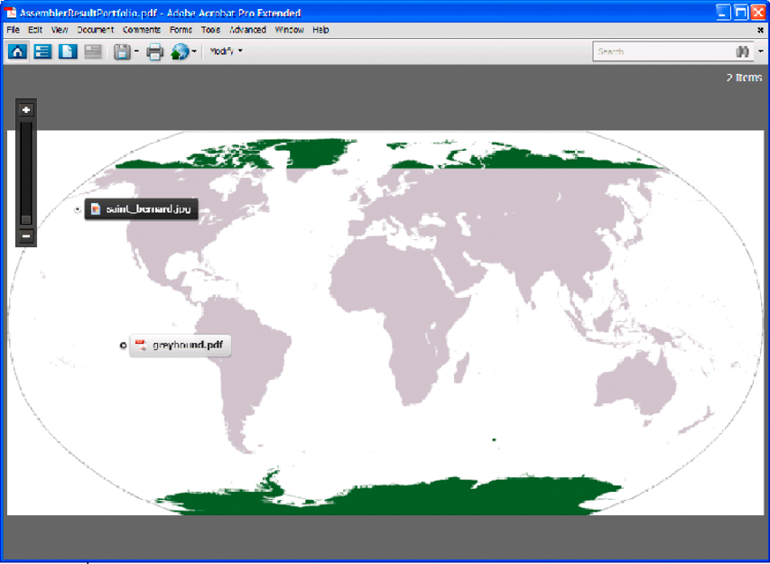

# 組合PDF資料夾 {#assembling-pdf-portfolios}

您可以使用Assembler java和web service API來組合PDF資料夾。 作品集可以結合多種類型的檔案，包括Word檔、影像檔（例如jpeg檔）和PDF檔案。 作品集的版面可以設定為不同的樣式，例如 *「預覽格線」、「在影像上*」版面，甚至 *「旋轉***」。

下圖為具有「在影像上」樣式版面 *的作品集螢幕擷取* 。



建立PDF資料夾是傳遞檔案集的無紙化替代選擇。 使用AEM Forms，您可以使用結構化DDX檔案來叫用Assembler服務來建立作品集。 以下DDX檔案是建立PDF資料夾的DDX檔案範例。

```as3
 <DDX xmlns="https://ns.adobe.com/DDX/1.0/">
     <PDF result="portfolio1.pdf">
         <Portfolio>
             <Navigator source="myNavigator">
                 <Resource name="navigator/image.xxx" source="myImage.png"/>
             </Navigator>
         </Portfolio>
         <PackageFiles source="dog1"  >
              <FieldData name="X">72</FieldData>
             <FieldData name="Y">72</FieldData>
             <File filename="saint_bernard.jpg" mimetype="image/jpeg"/>
         </PackageFiles>
         <PackageFiles source="dog2"  >
             <FieldData name="X">120</FieldData>
             <FieldData name="Y">216</FieldData>
             <File filename="greyhound.pdf"/>
         </PackageFiles>
     </PDF>
 </DDX>
```

DXX檔案必須包含含 `Portfolio` 有巢狀標籤的標 `Navigator` 記。 請注意，只有在 `<Resource name="navigator/image.xxx" source="myImage.png"/>` 指派為onImage版面 `myNavigator` 導覽器時，才需要標籤： `AdobeOnImage.nav`。 此標籤允許Assembler服務選擇要用作資料夾背景的影像。 包含 `PackageFiles` 和標 `File` 記，以定義封裝檔案的檔案名稱和MIME類型。

>[!NOTE]
>
>如需Assembler服務的詳細資訊，請參閱「AEM Forms的 [服務參考」](https://www.adobe.com/go/learn_aemforms_services_63)。

>[!NOTE]
>
>有關DDX文檔的詳細資訊，請參 [閱Assembler Service和DDX Reference](https://www.adobe.com/go/learn_aemforms_ddx_63)。

## 步驟摘要 {#summary-of-steps}

若要建立PDF資料夾，請執行下列工作：

1. 包含專案檔案。
1. 建立PDF匯寫程式式用戶端。
1. 參考現有的DDX檔案。
1. 參考所需檔案。
1. 設定執行時期選項。
1. 組合作品集。
1. 儲存組合的作品集。

**包含專案檔案**

在您的開發專案中加入必要的檔案。 如果要使用Java建立客戶端應用程式，請包括必要的JAR檔案。 如果您使用web services，請確定您包含proxy檔案。

必須將下列JAR檔案添加到項目的類路徑中：

* adobe-livecycle-client.jar
* adobe-usermanager-client.jar
* adobe-assembler-client.jar
* adobe-utilities.jar（若AEM Forms部署在JBoss上，則為必要項）
* jbossall-client.jar（如果AEM Forms部署在JBoss上，則為必要）

**建立PDF匯寫程式式用戶端**

在以寫程式方式執行匯編器操作之前，請建立匯編器服務客戶端。

**參考現有的DDX檔案**

必須參考DDX檔案才能組合PDF資料夾。 此DDX檔案必須包 `Portfolio`含、 `Navigator` 和 `PackageFiles` 元素。

**參考所需檔案**

若要組合PDF資料夾，請參考所有代表要組合的檔案的檔案。 例如，將DDX文檔中指定的所有影像檔案傳遞到Assembler服務。 請注意，在本節中指定的DDX檔案中會參照這些檔案： *myImage.png**和saint_bernard.jpg*。

當組合PDF資料夾時，請將NAV檔案（導覽檔案）傳遞至Assembler服務。 您傳遞至Assembler服務的NAV檔案取決於要建立的PDF資料夾類型。 例如，若要建立「 *On an Image* 」版面，請傳遞AdobeOnImage.nav檔案。 您可以在下列資料夾中找到NAV檔案：

`<Install folder>\Acrobat 9.0\Acrobat\Navigators`

從Acrobat 9（或更新版本）安裝目錄複製NAV檔案。 將NAV檔案置於您的用戶端應用程式可存取的位置。 所有檔案都會傳遞到Map集合對象中的Assembler服務。

>[!NOTE]
>
>與「組合PDF資料夾」相關的快速入門使用AdobeOnImage.nav。

**設定執行時期選項**

您可以設定運行時選項，以控制Assembler服務在執行作業時的行為。 例如，您可以設定一個選項，指示Assembler服務在遇到錯誤時繼續處理作業。

**組合作品集**

若要組合PDF資料夾，您稱之為 `invokeDDX` 操作。 Assembler服務會在集合物件中傳回PDF資料夾。

**儲存組合的作品集**

PDF資料夾會在系列物件中傳回。 重複收集物件並將PDF資料夾儲存為PDF檔案。

**另請參閱**

[使用Java API組合PDF資料夾](#assemble-a-pdf-portfolio-using-the-java-api)

[使用web service API組合PDF資料夾](#assemble-a-pdf-portfolio-using-the-web-service-api)

[包含AEM Forms java程式庫檔案](/help/forms/developing/invoking-aem-forms-using-java.md#including-aem-forms-java-library-files)

[設定連接屬性](/help/forms/developing/invoking-aem-forms-using-java.md#setting-connection-properties)

[以程式設計方式組合PDF檔案](/help/forms/developing/programmatically-assembling-pdf-documents.md)

## 使用Java API組合PDF資料夾 {#assemble-a-pdf-portfolio-using-the-java-api}

使用Assembler Service API(Java)來組合PDF資料夾：

1. 包含專案檔案。

   在Java專案的類別路徑中包含用戶端JAR檔案，例如adobe-assembler-client.jar。

1. 建立PDF匯寫程式式用戶端。

   * 建立包 `ServiceClientFactory` 含連接屬性的對象。
   * 使用其 `AssemblerServiceClient` 建構函式並傳遞物件，以建立物 `ServiceClientFactory` 件。

1. 參考現有的DDX檔案。

   * 使用 `java.io.FileInputStream` 其建構子並傳遞指定DDX檔案位置的字串值，建立表示DDX文檔的對象。
   * 使用其 `com.adobe.idp.Document` 建構函式並傳遞物件，以建立物 `java.io.FileInputStream` 件。

1. 參考所需檔案。

   * 使用 `java.util.Map` 建構函式建立用來儲存輸入PDF檔案的物 `HashMap` 件。
   * 使用其 `java.io.FileInputStream` 建構函式建立物件。 傳遞所需NAV檔案的位置（針對建立作品集所需的每個檔案重複此工作）。
   * 建立物 `com.adobe.idp.Document` 件並傳遞包含NAV檔 `java.io.FileInputStream` 案的物件（對建立作品集所需的每個檔案重複此工作）。
   * 通過調用對象的方 `java.util.Map` 法並傳遞以 `put` 下參數，向對象添加條目：

      * 代表索引鍵名稱的字串值。 此值必須與DDX文檔中指定的源元素的值匹配。 （針對建立作品集所需的每個檔案重複此工作）。
      * 包 `com.adobe.idp.Document` 含PDF檔案的物件。 （針對建立作品集所需的每個檔案重複此工作）。

1. 設定執行時期選項。

   * 使用 `AssemblerOptionSpec` 其建構函式建立儲存執行時期選項的物件。
   * 調用屬於該對象的方法，以設定運行時選項以滿足您的業務 `AssemblerOptionSpec` 要求。 例如，若要指示Assembler服務在發生錯誤時繼續處理作業，請叫用 `AssemblerOptionSpec` 物件的方 `setFailOnError` 法並傳遞 `false`。

1. 組合作品集。

   叫用物 `AssemblerServiceClient` 件的方 `invokeDDX` 法並傳遞下列必要值：

   * 表 `com.adobe.idp.Document` 示要使用的DDX文檔的對象
   * 包 `java.util.Map` 含建立PDF資料夾所需檔案的物件。
   * 指定 `com.adobe.livecycle.assembler.client.AssemblerOptionSpec` 運行時選項的對象，包括預設字型和作業日誌級別
   此方 `invokeDDX` 法會傳回包 `com.adobe.livecycle.assembler.client.AssemblerResult` 含已組合之PDF資料夾和發生的任何例外的物件。

1. 儲存組合的作品集。

   若要取得PDF資料夾，請執行下列動作：

   * 叫用 `AssemblerResult` 物件的方 `getDocuments` 法。 此方法返回對 `java.util.Map` 像。
   * 重複該對 `java.util.Map` 像，直到找到結果對 `com.adobe.idp.Document` 像。
   * 叫用物 `com.adobe.idp.Document` 件的方 `copyToFile` 法以擷取PDF資料夾。

**另請參閱**

[快速入門（SOAP模式）:使用Java API組合PDF資料夾](/help/forms/developing/assembler-service-java-api-quick.md#quick-start-soap-mode-assembling-pdf-portfolios-using-the-java-api)

[包含AEM Forms java程式庫檔案](/help/forms/developing/invoking-aem-forms-using-java.md#including-aem-forms-java-library-files)

[設定連接屬性](/help/forms/developing/invoking-aem-forms-using-java.md#setting-connection-properties)

## 使用web service API組合PDF資料夾 {#assemble-a-pdf-portfolio-using-the-web-service-api}

使用Assembler Service API(web service)來組合PDF資料夾：

1. 包含專案檔案。

   建立使用MTOM的Microsoft .NET專案。 在設定服務引用時，請確保使用以下WSDL定義： `http://localhost:8080/soap/services/AssemblerService?WSDL&lc_version=9.0.1`。

   >[!NOTE]
   >
   >以代 `localhost` 管AEM Forms之伺服器的IP位址取代。

1. 建立PDF匯寫程式式用戶端。

   * 使用其 `AssemblerServiceClient` 預設建構函式建立物件。
   * 使用建 `AssemblerServiceClient.Endpoint.Address` 構函式建立物 `System.ServiceModel.EndpointAddress` 件。 將指定WSDL的字串值傳遞至AEM Forms服務(例如 `http://localhost:8080/soap/services/AssemblerService?blob=mtom`)。 您不需要使用屬 `lc_version` 性。 建立服務參考時，將使用此屬性。
   * 獲取 `System.ServiceModel.BasicHttpBinding` 欄位值以建立對 `AssemblerServiceClient.Endpoint.Binding` 像。 將返回值轉換為 `BasicHttpBinding`。
   * 將物 `System.ServiceModel.BasicHttpBinding` 件欄位設 `MessageEncoding` 為 `WSMessageEncoding.Mtom`。 此值可確保使用MTOM。
   * 執行下列工作以啟用基本HTTP驗證：

      * 指派AEM表單使用者名稱至欄位 `AssemblerServiceClient.ClientCredentials.UserName.UserName`。
      * 為欄位分配相應的口令值 `AssemblerServiceClient.ClientCredentials.UserName.Password`。
      * 將常數值指 `HttpClientCredentialType.Basic` 派給欄位 `BasicHttpBindingSecurity.Transport.ClientCredentialType`。
      * 將常數值指 `BasicHttpSecurityMode.TransportCredentialOnly` 派給欄位 `BasicHttpBindingSecurity.Security.Mode`。

1. 參考現有的DDX檔案。

   * 使用其 `BLOB` 建構函式建立物件。 對 `BLOB` 像用於儲存DDX文檔。
   * 通過調 `System.IO.FileStream` 用其建構子並傳遞一個字串值來建立對象，該字串值表示DDX文檔的檔案位置以及開啟檔案的模式。
   * 建立儲存物件內容的位元組 `System.IO.FileStream` 陣列。 您可以取得物件的屬性，以決定位元組 `System.IO.FileStream` 的大 `Length` 小。
   * 調用物件的方法，以串流資料填 `System.IO.FileStream` 入位元組 `Read` 陣列。 傳遞要讀取的位元組陣列、起始位置和串流長度。
   * 為對象 `BLOB` 賦值其屬性， `MTOM` 使其包含位元組陣列的內容。

1. 參考所需檔案。

   * 對於每個輸入檔案，請使用 `BLOB` 其建構子建立對象。 對 `BLOB` 像用於儲存輸入檔案。
   * 通過調 `System.IO.FileStream` 用其建構子並傳遞一個字串值來建立對象，該字串值表示輸入檔案的檔案位置以及開啟檔案的模式。
   * 建立儲存物件內容的位元組 `System.IO.FileStream` 陣列。 您可以取得物件的屬性，以決定位元組 `System.IO.FileStream` 的大 `Length` 小。
   * 調用物件的方法，以串流資料填 `System.IO.FileStream` 入位元組 `Read` 陣列。 傳遞要讀取的位元組陣列、起始位置和串流長度。
   * 為對象 `BLOB` 分配欄位時， `MTOM` 請使用位元組陣列的內容來填充該對象。
   * 建立對 `MyMapOf_xsd_string_To_xsd_anyType` 像。 此收集物件用於儲存建立PDF資料夾所需的輸入檔案。
   * 對於每個輸入檔案，建立一個 `MyMapOf_xsd_string_To_xsd_anyType_Item` 對象。
   * 為對象欄位指定代表鍵名 `MyMapOf_xsd_string_To_xsd_anyType_Item` 的字串 `key` 值。 此值必須與DDX文檔中指定的元素值匹配。 （對每個輸入檔案執行此任務。）
   * 將儲存 `BLOB` 輸入檔案的對象指派給對 `MyMapOf_xsd_string_To_xsd_anyType_Item` 像的字 `value` 段。 （請對每個輸入的PDF檔案執行此工作。）
   * 將對象 `MyMapOf_xsd_string_To_xsd_anyType_Item` 添加到對 `MyMapOf_xsd_string_To_xsd_anyType` 像。 調用對 `MyMapOf_xsd_string_To_xsd_anyType` 像的方 `Add` 法並傳遞對 `MyMapOf_xsd_string_To_xsd_anyType` 像。 （請對每個輸入的PDF檔案執行此工作。）

1. 設定執行時期選項。

   * 使用 `AssemblerOptionSpec` 其建構函式建立儲存執行時期選項的物件。
   * 通過為屬於該對象的資料成員分配值，設定運行時選項以滿足您的業務需 `AssemblerOptionSpec` 求。 例如，若要指示Assembler服務在發生錯誤時繼續處理作業，請指 `false` 派給 `AssemblerOptionSpec` 物件的資料 `failOnError` 成員。

1. 組合作品集。

   叫用物 `AssemblerServiceClient` 件的方 `invokeDDX` 法並傳遞下列值：

   * 代 `BLOB` 表DDX文檔的對象
   * 包 `MyMapOf_xsd_string_To_xsd_anyType` 含所需檔案的對象
   * 指定 `AssemblerOptionSpec` 運行時選項的對象
   該方 `invokeDDX` 法返回 `AssemblerResult` 一個對象，該對象包含作業結果和所發生的任何異常。

1. 儲存組合的作品集。

   若要取得新建立的PDF資料夾，請執行下列動作：

   * 存取物 `AssemblerResult` 件的欄 `documents` 位，此欄位是包含 `Map` 結果PDF檔案的物件。
   * 重複該對 `Map` 像，以獲得每個結果文檔。 然後，將該陣列成員轉 `value` 換為 `BLOB`。
   * 存取PDF檔案的物件屬性，以擷取代表PDF文 `BLOB` 件的二進位 `MTOM` 資料。 這會傳回可寫出至PDF檔案的位元組陣列。

**另請參閱**

[使用MTOM叫用AEM Forms](/help/forms/developing/invoking-aem-forms-using-web.md#invoking-aem-forms-using-mtom)

[使用SwaRef叫用AEM表格](/help/forms/developing/invoking-aem-forms-using-web.md#invoking-aem-forms-using-swaref)
