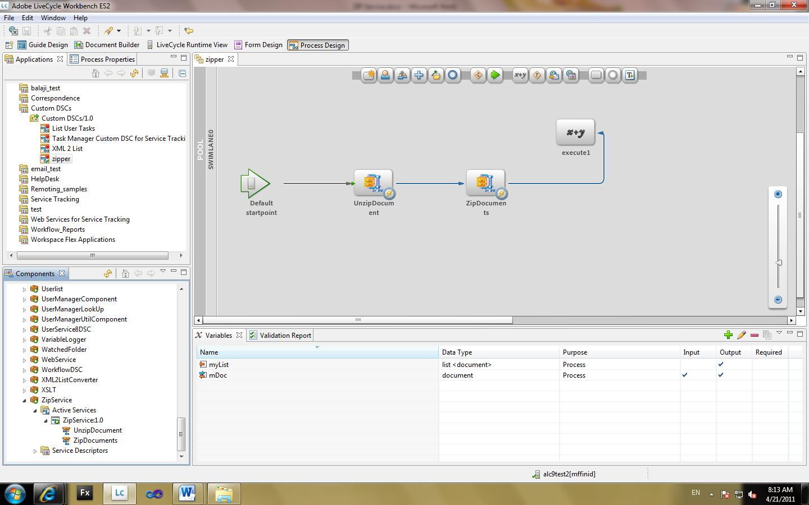

# 在JEE自訂DSC上使用AEM Forms來壓縮和解壓縮檔案 {#compressing-decompressing-files}

## 必備條件知識 {#prerequisites}

在JEE程式管理、基本Java™程式設計和建立自訂元件方面使用AEM Forms的體驗。

**其他必要其他產品**

Java™編輯器，例如 [Eclipse](https://www.eclipse.org/) 或 [Netbeans IDE](https://netbeans.apache.org/)

## 使用者層級 {#user-level}

中級

JEE上的AEM Forms可讓開發人員建立自訂ASC (Acrobat服務容器)，以建立豐富的現成功能。 建立這類元件可插入JEE執行階段環境的AEM Forms，並達到預期目的。 本文會說明如何建立自訂ZIP服務，可用來將檔案清單壓縮成.zip檔案，並將.zip解壓縮成檔案清單。

## 建立自訂ASC元件 {#create-custom-dsc-component}

建立具有兩個服務作業的自訂ASC元件，以便您可以壓縮和解壓縮檔案清單。 此元件使用java.util.zip套件進行壓縮和解壓縮。

若要建立自訂ASC元件：

1. 將adobe-livecycle-client.jar檔案新增至程式庫
1. 新增必要的圖示
1. 建立公用類別
1. 建立兩個名為UnzipDocument和ZipDocuments的公用方法
1. 撰寫壓縮與解壓縮的邏輯

您可在此處找到代碼：

```java
/*
 * Custom DSC : ZIP Utility
 * Purpose: This is a LiveCycle ES2 custom component used to Compress & Decompress List of Documents
 * Author: Nithiyanandam Dharmadass
 * Organization: Ministry of Finance, Kingdom of Bahrain
 * Last modified Date: 18/Apr/2011
 */
package nith.lces2.dsc;

import java.util.zip.ZipEntry;
import java.util.zip.ZipInputStream;
import com.adobe.idp.Document;
import java.io.ByteArrayOutputStream;
import java.io.InputStream;
import java.util.ArrayList;
import java.util.List;
import java.util.zip.ZipOutputStream;

public class ZIPService {

    static final int BUFFER = 2048; // 2MB buffer size

    public java.util.List UnzipDocument(com.adobe.idp.Document zipDocument) throws Exception {
        ZipInputStream zis = new ZipInputStream(zipDocument.getInputStream());

        ZipEntry zipFile;

        List resultList = new ArrayList();

        while ((zipFile = zis.getNextEntry()) != null) {

            ByteArrayOutputStream byteArrayOutStream = new ByteArrayOutputStream();

            int count;  // an int variable to hold the number of bytes read from input stream
            byte data[] = new byte[BUFFER];
            while ((count = zis.read(data, 0, BUFFER)) != -1) {
                byteArrayOutStream.write(data, 0, count);   // write to byte array
            }

            com.adobe.idp.Document unzippedDoc = new Document(byteArrayOutStream.toByteArray());  // create an idp document
            unzippedDoc.setAttribute("file", zipFile.getName());
            unzippedDoc.setAttribute("wsfilename", zipFile.getName());  // update the wsfilename attribute
            resultList.add(unzippedDoc);
        }
        return resultList;  // List of uncompressed documents
    }

    public com.adobe.idp.Document ZipDocuments(java.util.List listOfDocuments,java.lang.String zipFileName) throws Exception {

        if (listOfDocuments == null || listOfDocuments.size() == 0) {
            return null;
        }

        ByteArrayOutputStream byteArrayOutStream = new ByteArrayOutputStream();
        ZipOutputStream zos = new ZipOutputStream(byteArrayOutStream);  // ZIP Output Stream

        for (int i = 0; i < listOfDocuments.size(); i++) {
            Document doc = (Document) listOfDocuments.get(i);
            InputStream docInputStream = doc.getInputStream();
            ZipEntry zipEntry = new ZipEntry(doc.getAttribute("file").toString());
            zos.putNextEntry(zipEntry);
            int count;
            byte data[] = new byte[BUFFER];
            while ((count = docInputStream.read(data, 0, BUFFER)) != -1) {
                zos.write(data, 0, count);  // Read document content and add to zip entry
            }
            zos.closeEntry();
        }
        zos.flush();
        zos.close();

        Document zippedDoc = new Document(byteArrayOutStream.toByteArray());
        if(zipFileName==null || zipFileName.equals(""))
        {
            zipFileName = "CompressedList.zip";
        }
        zippedDoc.setAttribute("file", zipFileName);
        return zippedDoc;
    }
}
```

## 建立Component.XML檔案 {#create-component-xml-file}

必須在定義服務操作及其引數的封裝的根資料夾中建立component.xml檔案。

component.xml檔案顯示於此處：

```xml
<?xml version="1.0" encoding="UTF-8"?>
<component xmlns="https://adobe.com/idp/dsc/component/document">
<!-- Unique id identifying this component -->
   <component-id>ZipService</component-id>

<!-- Version -->
   <version>1.0</version>

<!-- Start of the Service definition -->
   <services>
<!-- Unique name for service descriptor.
           The value is used as the default name for
           deployed services -->
      <service name="ZipService">
<!-- service implementation class definition -->
        <implementation-class>nith.lces2.dsc.ZIPService</implementation-class>

<!-- description -->
        <description>Compress or Decompress list of documents</description>

<!--  You can provide your own icons for a distinct look   -->
          <small-icon>icons/Zip_icon16.png</small-icon>
          <large-icon>icons/Zip_icon32.png</large-icon>


<!-- automatically deploys the service and starts it after installation -->
         <auto-deploy service-id="ZipService" />

         <operations>
<!-- method name in the interface setSmtpHost-->
            <operation name="UnzipDocument">
<!-- input parameters to the "send" method -->
              <input-parameter name="zipDocument" title="Input ZIP Document" type="com.adobe.idp.Document">
                    <hint>A ZIP File to be decompressed</hint>
                </input-parameter>
                <output-parameter name="resultList" title="Decompressed list of documents" type="java.util.List">
                    <hint>Decompressed ZIP list</hint>
                </output-parameter>
            </operation>
            <operation name="ZipDocuments">
<!-- input parameters to the "send" method -->
              <input-parameter name="listOfDocuments" title="List of Documents" type="java.util.List">
                    <hint>A list of documents to be Compressed</hint>
                </input-parameter>
                <input-parameter name="zipFileName" title="Result File Name" type="java.lang.String">
                    <hint>The name of compressed file (optional)</hint>
                </input-parameter>

                <output-parameter name="zippedDoc" title="Compressed Zip file" type="com.adobe.idp.Document">
                    <hint>Compressed ZIP File</hint>
                </output-parameter>
            </operation>
             </operations>
      </service>
   </services>
</component>
```

## 封裝和部署元件 {#packaging-deploying-component}

1. 編譯Java™專案並建立.JAR檔案。
1. 透過Workbench在JEE執行階段將元件（.JAR檔案）部署至AEM Forms。
1. 從Workbench啟動服務（請參閱下圖）。



## 在工作流程中使用壓縮服務 {#using-zip-service-in-workflows}

自訂服務的UnzipDocument作業現在可以接受檔案變數作為輸入，並傳回檔案變數清單作為輸出。


同樣地，自訂元件的ZipDocuments作業可接受檔案清單作為輸入，將其壓縮為zip檔案並傳回壓縮檔案。


下列工作流程協調流程說明如何解壓縮指定的ZIP檔案、將其壓縮回另一個ZIP檔案並傳回輸出（請參閱下圖）。


## 部分業務使用案例 {#business-use-cases}

您可將此ZIP服務用於下列使用案例：

* 尋找指定資料夾中的所有檔案，並將檔案以壓縮檔案格式傳回。

* 提供包含若干PDF檔案的ZIP檔案，在解壓縮這些檔案後可延伸讀取器。 這需要JEEReader擴充功能模組上的AEM Forms。

* 提供包含異質性檔案型別的ZIP檔案，該檔案可使用產生PDF服務解壓縮並轉換成PDF檔案。

* 原則會保護檔案清單，並以ZIP檔案傳回。

* 可讓使用者以單一ZIP檔案下載流程執行個體的所有附件。
