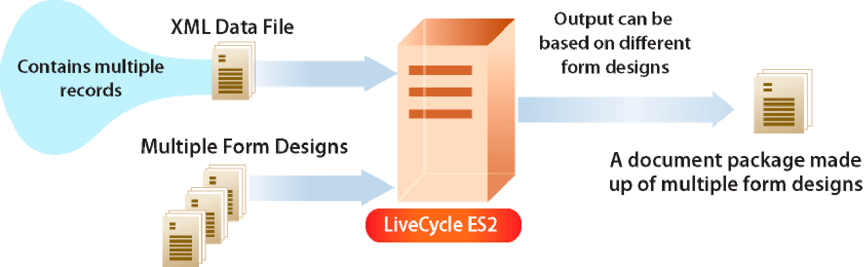

# 建立檔案輸出串流 {#creating-document-output-streams}

**關於輸出服務**

「輸出」服務可讓您將檔案輸出為PDF（包括PDF/A檔案）、PostScript、印表機控制語言(PCL)，以及下列標籤格式：

* Zebra - ZPL
* Intermec - IPL
* Datamax - DPL
* TecToshiba - TPCL

使用「輸出」服務，您可以將XML表單資料與表單設計合併，並將檔案輸出至網路印表機或檔案。

有兩種方式可讓您將表單設計（XDP檔案）傳遞至輸出服務。 您可以將包含表 `com.adobe.idp.Document` 單設計的例項傳遞至輸出服務。 或者，您可以傳遞指定表單設計位置的URI值。 在「使用AEM表單進行程式設計」中， *將討論這兩種方式*。

>[!NOTE]
>
>輸出服務不支援包含應用程式物件特定指令碼的Acroform PDF檔案。 不會轉譯包含應用程式物件特定指令碼的Acroform PDF檔案。

以下各節說明如何使用URI值將表單設計傳遞至輸出服務：

* [建立PDF檔案](creating-document-output-streams.md#creating-pdf-documents)
* [建立PDF/A檔案](creating-document-output-streams.md#creating-pdf-a-documents)

以下各節說明如何在實例中傳遞表單 `com.adobe.idp.Document` 設計：

* [將位於Content services中的檔案（不建議使用）傳送至輸出服務](creating-document-output-streams.md#passing-documents-located-in-content-services-deprecated-to-the-output-service)
* [使用片段建立PDF檔案](creating-document-output-streams.md#creating-pdf-documents-using-fragments)

在決定要使用哪種技巧時，有一個考量是，如果您要從其他AEM Forms服務取得表單設計，然後在例項中傳 `com.adobe.idp.Document` 遞。 「將文 *件傳送至輸出服務* 」和「使用 ** 片段建立PDF檔案」區段都會顯示如何從其他AEM Forms服務取得表單設計。 第一個區段會從Content Services擷取表單設計（已過時）。 第二部分從Assembler服務檢索表單設計。

如果從固定位置（如檔案系統）獲取表單設計，則可以使用其中一種技術。 也就是說，您可以指定XDP檔案的URI值，或使用例 `com.adobe.idp.Document` 項。

要在建立PDF文檔時傳遞指定表單設計位置的URI值，請使用該 `generatePDFOutput` 方法。 同樣地，若要在建 `com.adobe.idp.Document` 立PDF檔案時將例項傳遞至「輸出」服務，請使用此 `generatePDFOutput2` 方法。

將輸出流發送到網路打印機時，您也可以使用其中一種技術。 要通過傳遞包含表單設計的實例將輸出流 `com.adobe.idp.Document` 發送到打印機，請使用該 `sendToPrinter2`方法。 要通過傳遞URI值將輸出流發送到打印機，請使用該 `sendToPrinter`方法。 「將 *打印流發送到打印機* 」部分使用 `sendToPrinter` 該方法。

您可以使用輸出服務完成以下任務：

* [建立PDF檔案](creating-document-output-streams.md#creating-pdf-documents)
* [建立PDF/A檔案](creating-document-output-streams.md#creating-pdf-a-documents)
* [將位於Content services中的檔案（不建議使用）傳送至輸出服務](creating-document-output-streams.md#passing-documents-located-in-content-services-deprecated-to-the-output-service)
* [使用片段建立PDF檔案](creating-document-output-streams.md#creating-pdf-documents-using-fragments)
* [列印至檔案](creating-document-output-streams.md#printing-to-files)
* [傳送列印串流至印表機](creating-document-output-streams.md#sending-print-streams-to-printers)
* [建立多個輸出檔案](creating-document-output-streams.md#creating-multiple-output-files)
* [建立搜尋規則](creating-document-output-streams.md#creating-search-rules)
* [平面化PDF檔案](creating-document-output-streams.md#flattening-pdf-documents)

   ***注意&#x200B;**:如需Output服務的詳細資訊，請參閱「AEM[表格的服務參考」](https://www.adobe.com/go/learn_aemforms_services_63)。*

## 建立PDF檔案 {#creating-pdf-documents}

您可以使用「輸出」服務來建立以您提供的表單設計和XML表單資料為基礎的PDF檔案。 由輸出服務建立的PDF檔案不是互動式PDF檔案；用戶不能輸入或修改表單資料。

如果您想要建立適用於長期儲存的PDF檔案，建議您建立PDF/A檔案。 (請參 [閱建立PDF/A檔案](creating-document-output-streams.md#creating-pdf-a-documents)。)

若要建立可讓使用者輸入資料的互動式PDF表單，請使用Forms服務。 (請參 [閱轉換互動式PDF表單](/help/forms/developing/rendering-forms.md#rendering-interactive-pdf-forms)。)

>[!NOTE]
>
>如需Output服務的詳細資訊，請參閱「AEM [表格的服務參考」](https://www.adobe.com/go/learn_aemforms_services_63)。

### 步驟摘要 {#summary-of-steps}

要建立PDF文檔，請執行以下步驟：

1. 包含專案檔案。
1. 建立輸出客戶端對象。
1. 參考XML資料來源。
1. 設定PDF執行時期選項。
1. 設定演算執行時期選項。
1. 產生PDF檔案。
1. 檢索操作的結果。

**包含專案檔案**

在您的開發專案中加入必要的檔案。 如果要使用Java建立客戶端應用程式，請包括必要的JAR檔案。 如果您使用web services，請確定您包含proxy檔案。

必須將以下JAR檔案添加到項目的類路徑中：

* adobe-livecycle-client.jar
* adobe-usermanager-client.jar
* adobe-output-client.jar
* adobe-utilities.jar（若AEM Forms部署在JBoss上，則為必要項）
* jbossall-client.jar（如果AEM Forms部署在JBoss上，則為必要）

如果AEM Forms部署在非JBoss的支援J2EE應用程式伺服器上，您將需要將adobe-utilities.jar和jbossall-client.jar檔案取代為JAR檔案，這些檔案是部署AEM Forms的J2EE應用程式伺服器專屬檔案。

**建立輸出客戶端對象**

在以寫程式方式執行輸出服務操作之前，必須建立輸出服務客戶端對象。 如果您使用Java API，請建立物 `OutputClient` 件。 如果您使用Output web service API，請建立物 `OutputServiceService` 件。

**參考XML資料來源**

若要將資料與表單設計合併，您必須參考包含資料的XML資料來源。 您計畫填入資料的每個表單欄位都必須有XML元素。 XML元素名稱必須與欄位名稱相符。 如果XML元素與表單欄位不對應，或XML元素名稱與欄位名稱不符，則會忽略它。 如果指定了所有XML元素，則不需要匹配XML元素的顯示順序。

請考慮以下貸款申請表示例。


要將資料合併到此表單設計中，必須建立與表單對應的XML資料源。 以下XML代表與範例抵押申請表格對應的XDP XML資料來源。

```as3
 <?xml version="1.0" encoding="UTF-8" ?>
 - <xfa:datasets xmlns:xfa="https://www.xfa.org/schema/xfa-data/1.0/">
 - <xfa:data>
 - <data>
     - <Layer>
         <closeDate>1/26/2007</closeDate>
         <lastName>Johnson</lastName>
         <firstName>Jerry</firstName>
         <mailingAddress>JJohnson@NoMailServer.com</mailingAddress>
         <city>New York</city>
         <zipCode>00501</zipCode>
         <state>NY</state>
         <dateBirth>26/08/1973</dateBirth>
         <middleInitials>D</middleInitials>
         <socialSecurityNumber>(555) 555-5555</socialSecurityNumber>
         <phoneNumber>5555550000</phoneNumber>
     </Layer>
     - <Mortgage>
         <mortgageAmount>295000.00</mortgageAmount>
         <monthlyMortgagePayment>1724.54</monthlyMortgagePayment>
         <purchasePrice>300000</purchasePrice>
         <downPayment>5000</downPayment>
         <term>25</term>
         <interestRate>5.00</interestRate>
     </Mortgage>
 </data>
 </xfa:data>
 </xfa:datasets>
```

**設定PDF執行時期選項**

在建立PDF文檔時設定檔案URI選項。 此選項指定輸出服務所生成的PDF檔案的名稱和位置。

>[!NOTE]
>
>您不必設定檔案URI執行時期選項，而是可以程式設計方式從Output服務傳回的複雜資料類型擷取PDF檔案。 不過，透過設定檔案URI執行時期選項，您不需要建立以程式設計方式擷取PDF檔案的應用程式邏輯。

**設定渲染運行時選項**

建立PDF檔案時，您可以設定演算執行時期選項。 雖然這些選項不是必要的（與PDF執行時期選項不同），但您可以執行例如改善輸出服務的效能等工作。 例如，您可以快取輸出服務使用的表單設計，以提升其效能。

如果您使用標籤的Acrobat表單作為輸入，則無法使用Output服務Java或web service API來關閉標籤的設定。 如果您嘗試以程式設計方式將此選項設 `false`定為，結果的PDF檔案仍會加上標籤。

>[!NOTE]
>
>如果您未指定演算執行時期選項，則會使用預設值。 如需演算執行時期選項的詳細資訊，請參閱 `RenderOptionsSpec` 類別參考。 (請參閱 [AEM Forms API參考](https://www.adobe.com/go/learn_aemforms_javadocs_63_en))。

**產生PDF檔案**

在您參考包含表單資料的有效XML資料來源並設定執行時期選項後，就可以叫用「輸出」服務，以產生PDF檔案。

當產生PDF檔案時，您會指定「輸出」服務建立PDF檔案所需的URI值。 表單設計可儲存在伺服器檔案系統等位置，或是AEM Forms應用程式的一部分。 使用內容根URI值可以參考作為Forms應用程式一部分的表單設計（或其他資源，例如影像檔案） `repository:///`。 例如，請考慮以下名為 *Loan.xdp的表單設計* ，位於名為 *Applications/FormsApplication的Forms應用程式中*:


若要存取上圖中所示的Loan.xdp檔案，請指 `repository:///Applications/FormsApplication/1.0/FormsFolder/` 定為傳遞至物件方法的 `OutputClient` 第三個參 `generatePDFOutput` 數。 指定表單名稱(*Loan.xdp*)作為傳遞至物件方法 `OutputClient` 的第二個參 `generatePDFOutput` 數。

如果XDP檔案包含影像（或其他資源，例如片段），請將資源放置在與XDP檔案相同的應用程式資料夾中。 AEM Forms會使用內容根URI做為解析影像參照的基本路徑。 例如，如果Loan.xdp檔案包含影像，請確定您將影像置入 `Applications/FormsApplication/1.0/FormsFolder/`。

>[!NOTE]
>
>在調用物件或方法時，您可以 `OutputClient` 參考Forms應用 `generatePDFOutput` 程式 `generatePrintedOutput` URI。

>[!NOTE]
>
>要查看通過引用Forms應用程式中的XDP建立PDF文檔的完整快速入門，請參 [閱快速入門（EJB模式）:使用Java API根據應用程式XDP檔案建立PDF檔案](/help/forms/developing/output-service-java-api-quick.md#quick-start-soap-mode-creating-a-pdf-document-based-on-an-application-xdp-file-using-the-java-api)。

**檢索操作的結果**

輸出服務執行操作後，它返回各種資料項，如指定操作是否成功的狀態XML資料。

**另請參閱**

[使用Java API建立PDF檔案](creating-document-output-streams.md#create-a-pdf-document-using-the-java-api)

[使用web service API建立PDF檔案](creating-document-output-streams.md#create-a-pdf-document-using-the-web-service-api)

[包含AEM Forms java程式庫檔案](/help/forms/developing/invoking-aem-forms-using-java.md#including-aem-forms-java-library-files)

[設定連接屬性](/help/forms/developing/invoking-aem-forms-using-java.md#setting-connection-properties)

[Output Service API快速入門](/help/forms/developing/output-service-java-api-quick.md#output-service-java-api-quick-start-soap)

### 使用Java API建立PDF檔案 {#create-a-pdf-document-using-the-java-api}

使用輸出API(Java)建立PDF檔案：

1. 包含專案檔案。

   在Java專案的類別路徑中包含用戶端JAR檔案，例如adobe-output-client.jar。

1. 建立輸出客戶端對象。

   * 建立包 `ServiceClientFactory` 含連接屬性的對象。
   * 使用其 `OutputClient` 建構函式並傳遞物件，以建立物 `ServiceClientFactory` 件。

1. 參考XML資料來源。

   * 建立 `java.io.FileInputStream` 代表XML資料來源的物件，該XML資料來源是使用其建構函式，並傳遞指定XML檔案位置的字串值，以填入PDF檔案。
   * 使用其 `com.adobe.idp.Document` 建構函式建立物件。 傳遞物 `java.io.FileInputStream` 件。

1. 設定PDF執行時期選項。

   * 使用其 `PDFOutputOptionsSpec` 建構函式建立物件。
   * 調用物件的方法，以設定 `PDFOutputOptionsSpec` 檔案URI `setFileURI` 選項。 傳遞一個字串值，指定輸出服務所產生PDF檔案的位置。 「檔案URI」選項是相對於代管AEM Forms的J2EE應用程式伺服器，而非用戶端電腦。

1. 設定演算執行時期選項。

   * 使用其 `RenderOptionsSpec` 建構函式建立物件。
   * 快取表單設計，以調用物件並傳遞，來改善 `RenderOptionsSpec` 輸出服務 `setCacheEnabled` 的效能 `true`。
   >[!NOTE]
   >
   >如果輸入檔案是Acrobat表單（在Acrobat中建立的表單）或已簽署或認證的XFA檔案，則 `RenderOptionsSpec` 不 `setPdfVersion` 能使用物件方法來設定PDF檔案版本。 輸出PDF檔案會保留原始PDF版本。 同樣地，如果輸入檔案是Acrobat表單或已簽署或認證的XFA檔案，您也無法 `RenderOptionsSpec` 叫 `setTaggedPDF` 用物件的方法來設定標籤的Adobe PDF選項。

   >[!NOTE]
   >
   >如果輸入的PDF檔案經過認證或數位簽 `RenderOptionsSpec` 名，則無法使 `setLinearizedPDF` 用物件的方法來設定線性化的PDF選項。 (請參 [閱數位簽署PDF檔案](/help/forms/developing/digitally-signing-certifying-documents.md#digitally-signing-pdf-documents)*。)*

1. 產生PDF檔案。

   叫用物件的方法並傳 `OutputClient` 遞下列值， `generatePDFOutput` 以建立PDF檔案：

   * 枚舉 `TransformationFormat` 值。 若要產生PDF檔案，請指定 `TransformationFormat.PDF`。
   * 指定表單設計名稱的字串值。
   * 指定表單設計所在內容根目錄的字串值。
   * 包 `PDFOutputOptionsSpec` 含PDF執行時期選項的物件。
   * 包含 `RenderOptionsSpec` 演算執行時間選項的物件。
   * 包 `com.adobe.idp.Document` 含XML資料來源的物件，其中包含要與表單設計合併的資料。
   方 `generatePDFOutput` 法返回 `OutputResult` 包含操作結果的對象。

   >[!NOTE]
   >
   >當透過叫用方法產生PDF文 `generatePDFOutput` 件時，請注意，您無法將資料與已簽署或認證的XFA PDF表單合併。 (請參 [閱數位簽署和認證檔案](/help/forms/developing/digitally-signing-certifying-documents.md#digitally-signing-and-certifying-documents)*。)*

   >[!NOTE]
   >
   >傳 `OutputResult` 回物件的 `getRecordLevelMetaDataList` 方法 `null`*。*

   >[!NOTE]
   >
   >您也可以叫用物件的方法來建 `OutputClient` 立PDF文 `generatePDFOutput2` 件。 (請參 [閱將位於Content Services（不建議使用）的檔案傳遞至輸出服務](creating-document-output-streams.md#passing-documents-located-in-content-services-deprecated-to-the-output-service)*。)*

1. 檢索操作的結果。

   * 通過調 `com.adobe.idp.Document` 用對象的方法來檢索表示 `generatePDFOutput` 操作狀態 `OutputResult` 的對象 `getStatusDoc` 。 此方法返回指定操作是否成功的狀態XML資料。
   * 建立包 `java.io.File` 含操作結果的對象。 請確定副檔名為。xml。
   * 叫用 `com.adobe.idp.Document` 物件的方 `copyToFile` 法，將物件的內容複製至檔案(請確定您使用 `com.adobe.idp.Document` 由方法傳回的物 `com.adobe.idp.Document``getStatusDoc` 件)。
   雖然「輸出」服務會將PDF檔案寫入由傳遞至物件方法的引數所指定的位 `PDFOutputOptionsSpec` 置 `setFileURI` ，但您仍可以呼叫物件的方法，以程式設計方式 `OutputResult` 擷取PDF/A文 `getGeneratedDoc` 件。

**另請參閱**

[步驟摘要](creating-document-output-streams.md#summary-of-steps)

[快速啟動（EJB模式）:使用Java API建立PDF檔案](/help/forms/developing/output-service-java-api-quick.md#quick-start-soap-mode-creating-a-pdf-document-using-the-java-api)

[快速入門（SOAP模式）:使用Java API建立PDF檔案](/help/forms/developing/output-service-java-api-quick.md#quick-start-soap-mode-creating-a-pdf-document-using-the-java-api)

[包含AEM Forms java程式庫檔案](/help/forms/developing/invoking-aem-forms-using-java.md#including-aem-forms-java-library-files)

[設定連接屬性](/help/forms/developing/invoking-aem-forms-using-java.md#setting-connection-properties)

### 使用web service API建立PDF檔案 {#create-a-pdf-document-using-the-web-service-api}

使用輸出API(web service)建立PDF檔案：

1. 包含專案檔案。

   建立使用MTOM的Microsoft .NET專案。 請確定您使用下列WSDL定義： `http://localhost:8080/soap/services/OutputService?WSDL&lc_version=9.0.1`。

   >[!NOTE]
   >
   >以代 `localhost` 管AEM Forms之伺服器的IP位址取代。

1. 建立輸出客戶端對象。

   * 使用其 `OutputServiceClient` 預設建構函式建立物件。
   * 使用建 `OutputServiceClient.Endpoint.Address` 構函式建立物 `System.ServiceModel.EndpointAddress` 件。 將指定WSDL的字串值傳遞至AEM Forms服務(例如 `http://localhost:8080/soap/services/OutputService?blob=mtom`。)您不需要使用屬 `lc_version` 性。 建立服務參考時，將使用此屬性。 不過，請指 `?blob=mtom` 定使用MTOM。
   * 獲取 `System.ServiceModel.BasicHttpBinding` 欄位值以建立對 `OutputServiceClient.Endpoint.Binding` 像。 將返回值轉換為 `BasicHttpBinding`。
   * 將物 `System.ServiceModel.BasicHttpBinding` 件欄位設 `MessageEncoding` 為 `WSMessageEncoding.Mtom`。 此值可確保使用MTOM。
   * 執行下列工作以啟用基本HTTP驗證：

      * 指派AEM表單使用者名稱至欄位 `OutputServiceClient.ClientCredentials.UserName.UserName`。
      * 為欄位分配相應的口令值 `OutputServiceClient.ClientCredentials.UserName.Password`。
      * 將常數值指 `HttpClientCredentialType.Basic` 派給欄位 `BasicHttpBindingSecurity.Transport.ClientCredentialType`。
      * 將常數值指 `BasicHttpSecurityMode.TransportCredentialOnly` 派給欄位 `BasicHttpBindingSecurity.Security.Mode`。

1. 參考XML資料來源。

   * 使用其 `BLOB` 建構函式建立物件。 該 `BLOB` 物件用於儲存將與PDF檔案合併的XML資料。
   * 通過調 `System.IO.FileStream` 用其建構子並傳遞一個字串值來建立對象，該字串值表示包含表單資料的XML檔案的檔案位置。
   * 建立儲存物件內容的位元組 `System.IO.FileStream` 陣列。 您可以取得物件的屬性，以決定位元組 `System.IO.FileStream` 的大 `Length` 小。
   * 調用物件的方法並傳遞 `System.IO.FileStream` 位元組陣列、 `Read` 開始位置和串流長度，以串流資料填入位元組陣列。
   * 為對象 `BLOB` 分配欄位時， `MTOM` 請使用位元組陣列的內容來填充該對象。

1. 設定PDF執行時期選項

   * 使用其 `PDFOutputOptionsSpec` 建構函式建立物件。
   * 指定字串值，指定輸出服務產生給物件資料成員的PDF檔案位置，以設定「檔案URI」 `PDFOutputOptionsSpec` 選 `fileURI` 項。 「檔案URI」選項是相對於代管AEM Forms的J2EE應用程式伺服器，而非用戶端電腦。

1. 設定演算執行時期選項。

   * 使用其 `RenderOptionsSpec` 建構函式建立物件。
   * 快取表單設計，將值指派給物件的資料成員，以 `true` 改善 `RenderOptionsSpec` 輸出服務 `cacheEnabled` 的效能。
   >[!NOTE]
   >
   >如果輸入檔案是Acrobat表單（在Acrobat中建立的表單）或已簽署或認證的XFA檔案，則 `RenderOptionsSpec` 不 `setPdfVersion` 能使用物件方法來設定PDF檔案版本。 輸出PDF檔案會保留原始PDF版本。 同樣地，如果輸入檔案是Acrobat表單或已簽署或認證的XFA檔案，您也無法叫用物件的 `RenderOptionsSpec``setTaggedPDF`*方法來設定標籤的Adobe PDF選項。*

   >[!NOTE]
   >
   >如果輸入的PDF檔案經過認證或數位簽 `RenderOptionsSpec` 名，則無法使 `linearizedPDF` 用物件的成員來設定線性化的PDF選項。 (請參 [閱數位簽署PDF檔案](/help/forms/developing/digitally-signing-certifying-documents.md#digitally-signing-pdf-documents)*。)*

1. 產生PDF檔案。

   叫用物件的方法並傳 `OutputServiceService` 遞下列值， `generatePDFOutput`以建立PDF檔案：

   * 枚舉 `TransformationFormat` 值。 若要產生PDF檔案，請指定 `TransformationFormat.PDF`。
   * 指定表單設計名稱的字串值。
   * 指定表單設計所在內容根目錄的字串值。
   * 包 `PDFOutputOptionsSpec` 含PDF執行時期選項的物件。
   * 包含 `RenderOptionsSpec` 演算執行時間選項的物件。
   * 包 `BLOB` 含XML資料來源的物件，其中包含要與表單設計合併的資料。
   * 由 `BLOB` 方法填充的對 `generatePDFOutput` 像。 該方 `generatePDFOutput` 法使用生成的描述文檔的元資料填充此對象。 （此參數值僅適用於Web服務調用）。
   * 由 `BLOB` 方法填充的對 `generatePDFOutput` 像。 該方 `generatePDFOutput` 法用結果資料填充此對象。 （此參數值僅適用於Web服務調用）。
   * 包 `OutputResult` 含操作結果的對象。 （此參數值僅適用於Web服務調用）。
   >[!NOTE]
   >
   >當透過叫用方法產生PDF文 `generatePDFOutput` 件時，請注意，您無法將資料與已簽署或認證的XFA PDF表單合併。 (請參 [閱數位簽署和認證檔案](/help/forms/developing/digitally-signing-certifying-documents.md#digitally-signing-and-certifying-documents)*。)*

   >[!NOTE]
   >
   >您也可以叫用物件的方法來建 `OutputClient` 立PDF文 `generatePDFOutput2` 件。 (請參 [閱將位於Content Services（不建議使用）的檔案傳遞至輸出服務](creating-document-output-streams.md#passing-documents-located-in-content-services-deprecated-to-the-output-service)*。)*

1. 檢索操作的結果。

   * 通過調 `System.IO.FileStream` 用其建構子並傳遞一個字串值來建立對象，該字串值表示包含結果資料的XML檔案位置。 請確定副檔名為。xml。
   * 建立位元組陣列，儲存物件的 `BLOB` 資料內容，該物件已透過物件的方 `OutputServiceService` 法(第 `generatePDFOutput` 8個參數)填入結果資料。 取得物件的值，以填入 `BLOB` 位元組陣列 `MTOM``field`。
   * 通過調 `System.IO.BinaryWriter` 用其建構子並傳遞對象來建立 `System.IO.FileStream` 對象。
   * 調用物件的方法並傳遞位元組陣列，將位元組 `System.IO.BinaryWriter` 的內容 `Write` 寫入XML檔案。
   另請參閱

   [步驟摘要](creating-document-output-streams.md#summary-of-steps)

   [使用MTOM叫用AEM Forms](/help/forms/developing/invoking-aem-forms-using-web.md#invoking-aem-forms-using-mtom)

   [使用SwaRef叫用AEM表格](/help/forms/developing/invoking-aem-forms-using-web.md#invoking-aem-forms-using-swaref)

   >[!NOTE]
   >
   >物件 `OutputServiceService` 的方法已不 `generateOutput` 再提倡。

## 建立PDF/A檔案 {#creating-pdf-a-documents}

您可以使用「輸出」服務來建立PDF/A檔案。 由於PDF/A是長期保存檔案內容的封存格式，所以所有字型都已內嵌，檔案也未壓縮。 因此，PDF/A檔案通常比標準PDF檔案大。 此外，PDF/A檔案不包含音訊和視訊內容。 如同其他「輸出」服務工作，您提供表單設計和資料，以便與表單設計合併以建立PDF/A檔案。

PDF/A-1規格包含兩個符合等級，即a和b。兩者之間的主要區別在於邏輯結構（可訪問性）支援，而邏輯結構（可訪問性）支援對於符合性級別b不是必需的。無論符合程度如何，PDF/A-1都規定所有字型都內嵌在產生的PDF/A檔案中。

雖然PDF/A是封存PDF檔案的標準，但是如果標準PDF檔案符合您公司的需求，就不必使用PDF/A進行封存。 PDF/A標準的目的，在於建立可長期儲存的PDF檔案，並符合檔案保存要求。 例如，URL無法內嵌在PDF/A中，因為URL可能會隨著時間變成無效。

您的組織必須評估自己的需求、您希望保存文檔的時間長度、檔案大小考慮因素，並確定自己的歸檔策略。 您可以使用DocConverter服務，以程式設計方式判斷PDF檔案是否符合PDF/A規範。 (請參 [閱程式設計決定PDF/A相容](/help/forms/developing/pdf-a-documents.md#programmatically-determining-pdf-a-compliancy)。)

PDF/A檔案必須使用在表單設計中指定的字型，且字型無法取代。 因此，如果位於PDF檔案中的字型無法在主機作業系統(OS)上使用，則會發生例外情況。

在Acrobat中開啟PDF/A檔案時，會顯示一則訊息，確認該檔案為PDF/A檔案，如下圖所示。


>[!NOTE]
>
>AIIM網站有PDF/A常見問答區段，您可從https://www.aiim.org/documents/standards/19005-1_FAQ.pdf [存取](https://www.aiim.org/documents/standards/19005-1_FAQ.pdf)。

>[!NOTE]
>
>如需Output服務的詳細資訊，請參閱「AEM [表格的服務參考」](https://www.adobe.com/go/learn_aemforms_services_63)。

### 步驟摘要 {#summary_of_steps-1}

要建立PDF/A文檔，請執行以下步驟：

1. 包含專案檔案。
1. 建立輸出客戶端對象。
1. 參考XML資料來源。
1. 設定PDF/A執行時期選項。
1. 設定演算執行時期選項。
1. 產生PDF/A檔案。
1. 檢索操作的結果。

**包含專案檔案**

在您的開發專案中加入必要的檔案。 如果要使用Java建立自定義應用程式，請包括必要的JAR檔案。 如果您使用web services，請確定您包含proxy檔案。

必須將下列JAR檔案添加到項目的類路徑中：

* adobe-livecycle-client.jar
* adobe-usermanager-client.jar
* adobe-output-client.jar
* adobe-utilities.jar（若AEM Forms部署在JBoss上，則為必要項）
* jbossall-client.jar（如果AEM Forms部署在JBoss上，則為必要）

如果AEM Forms部署在非JBoss的支援J2EE應用程式伺服器上，您將需要將adobe-utilities.jar和jbossall-client.jar檔案取代為JAR檔案，這些檔案是部署AEM Forms的J2EE應用程式伺服器專屬檔案。

**建立輸出客戶端對象**

在以寫程式方式執行輸出服務操作之前，必須建立輸出服務客戶端對象。 如果您使用Java API，請建立物 `OutputClient` 件。 如果您使用Output web service API，請建立物 `OutputServiceService` 件。

**參考XML資料來源**

若要將資料與表單設計合併，您必須參考包含資料的XML資料來源。 每個要填入資料的表單欄位都必須有XML元素。 XML元素名稱必須與欄位名稱相符。 如果XML元素與表單欄位不對應，或XML元素名稱與欄位名稱不符，則會忽略它。 如果指定了所有XML元素，則不需要匹配XML元素的顯示順序。

**設定PDF/A執行時期選項**

在建立PDF/A文檔時，可以設定「檔案URI」選項。 URI是相對於代管AEM Forms的J2EE應用程式伺服器。 也就是說，如果設定C:\Adobe，則檔案將寫入到伺服器上的資料夾，而不是客戶端電腦。 URI指定輸出服務所生成的PDF/A檔案的名稱和位置。

**設定渲染運行時選項**

您可以在建立PDF/A檔案時設定演算執行時期選項。 您可以設定的兩個PDF/A相關選項是 `PDFAConformance` 和 `PDFARevisionNumber` 值。 此 `PDFAConformance` 值指PDF檔案如何符合指定長期電子檔案保留的要求。 此選項的有效值是 `A` 和 `B`。 有關a級和b級符合性的資訊，請參閱標題為 *ISO 19005-1檔案管理的PDF/A-1 ISO規格*。

值 `PDFARevisionNumber` 是指PDF/A檔案的修訂號。 如需PDF/A檔案修訂版號的詳細資訊，請參閱標題為 *ISO 19005-1檔案管理的PDF/A-1 ISO規格*。

>[!NOTE]
>
>建立PDF/A 1A檔案時，無 `false` 法將標籤的Adobe PDF選項設定為。 PDF/A 1A永遠是標籤的PDF檔案。 此外，建立PDF/A 1B檔案時，您 `true` 無法將標籤的Adobe PDF選項設定為。 PDF/A 1B永遠是未標籤的PDF檔案。

**產生PDF/A檔案**

參考包含表單資料的有效XML資料來源並設定執行時期選項後，您可以叫用「輸出」服務，使其產生PDF/A檔案。

**檢索操作的結果**

輸出服務執行操作後，它返回各種資料項，如指定操作是否成功的XML資料。

**另請參閱**

[使用Java API建立PDF/A檔案](creating-document-output-streams.md#create-a-pdf-a-document-using-the-java-api)

[使用web service API建立PDF/A檔案](creating-document-output-streams.md#create-a-pdf-a-document-using-the-web-service-api)

[包含AEM Forms java程式庫檔案](/help/forms/developing/invoking-aem-forms-using-java.md#including-aem-forms-java-library-files)

[設定連接屬性](/help/forms/developing/invoking-aem-forms-using-java.md#setting-connection-properties)

[Output Service API快速入門](/help/forms/developing/output-service-java-api-quick.md#output-service-java-api-quick-start-soap)

### 使用Java API建立PDF/A檔案 {#create-a-pdf-a-document-using-the-java-api}

使用輸出API(Java)建立PDF/A檔案：

1. 包含專案檔案。

   在Java專案的類別路徑中包含用戶端JAR檔案，例如adobe-output-client.jar。

1. 建立輸出客戶端對象。

   * 建立包 `ServiceClientFactory` 含連接屬性的對象。
   * 使用其 `OutputClient` 建構函式並傳遞物件，以建立物 `ServiceClientFactory` 件。

1. 參考XML資料來源。

   * 建立 `java.io.FileInputStream` 代表XML資料來源的物件，該XML資料來源是使用其建構函式，並傳遞指定XML檔案位置的字串值，以填入PDF/A檔案。
   * 使用其 `com.adobe.idp.Document` 建構函式並傳遞物件，以建立物 `java.io.FileInputStream` 件。

1. 設定PDF/A執行時期選項。

   * 使用其 `PDFOutputOptionsSpec` 建構函式建立物件。
   * 調用物件的方法，以設定 `PDFOutputOptionsSpec` 檔案URI `setFileURI` 選項。 傳遞一個字串值，指定輸出服務所產生PDF檔案的位置。 「檔案URI」選項是相對於代管AEM Forms的J2EE應用程式伺服器，而非用戶端電腦。

1. 設定演算執行時期選項。

   * 使用其 `RenderOptionsSpec` 建構函式建立物件。
   * 通過調 `PDFAConformance` 用對象的方 `RenderOptionsSpec` 法並傳遞指定符 `setPDFAConformance` 合級別的 `PDFAConformance` 枚舉值來設定值。 例如，要指定符合性層A，請通過 `PDFAConformance.A`。
   * 調用物 `PDFARevisionNumber` 件的方法並傳 `RenderOptionsSpec` 遞，以設 `setPDFARevisionNumber` 定值 `PDFARevisionNumber.Revision_1`。
   >[!NOTE]
   >
   >PDF/A檔案的PDF版本為1.4，不論您為物件方法指定 `RenderOptionsSpec` 的值 `setPdfVersion`*為何。*

1. 產生PDF/A檔案。

   叫用物件的方法並傳遞下 `OutputClient` 列值， `generatePDFOutput` 以建立PDF/A檔案：

   * 枚舉 `TransformationFormat` 值。 若要產生PDF/A檔案，請指定 `TransformationFormat.PDFA`。
   * 指定表單設計名稱的字串值。
   * 指定表單設計所在內容根目錄的字串值。
   * 包 `PDFOutputOptionsSpec` 含PDF執行時期選項的物件。
   * 包含 `RenderOptionsSpec` 演算執行時間選項的物件。
   * 包 `com.adobe.idp.Document` 含XML資料來源的物件，其中包含要與表單設計合併的資料。
   方 `generatePDFOutput` 法返回 `OutputResult` 包含操作結果的對象。

   >[!NOTE]
   >
   >傳 `OutputResult` 回物件的 `getRecordLevelMetaDataList` 方法 `null`。

   >[!NOTE]
   >
   >您也可以叫用物件的 `OutputClient``generatePDFOutput`2方法來建立PDF/A檔案。 (請參 [閱將位於Content Services（不建議使用）的檔案傳遞至輸出服務](creating-document-output-streams.md#passing-documents-located-in-content-services-deprecated-to-the-output-service)。)

1. 檢索操作的結果。

   * 呼叫 `com.adobe.idp.Document` 物件的方法，以建立 `generatePDFOutput` 代表方法狀態 `OutputResult` 的物 `getStatusDoc` 件。
   * 建立 `java.io.File` 包含操作結果的對象。 請確定副檔名為。xml。
   * 叫用 `com.adobe.idp.Document` 物件的方 `copyToFile` 法，將物件的內容複製至檔案(請確定您使用 `com.adobe.idp.Document` 由方法傳回的物 `com.adobe.idp.Document``getStatusDoc` 件)。
   >[!NOTE]
   >
   >雖然「輸出」服務會將PDF/A檔案寫入至傳遞至物件方法的引數所指定的位 `PDFOutputOptionsSpec` 置 `setFileURI` ，但您仍可以呼叫物件方法，以程式設計方式 `OutputResult` 擷取PDF/A文 `getGeneratedDoc` 件。

**另請參閱**

[步驟摘要](creating-document-output-streams.md#summary-of-steps)

[快速入門（SOAP模式）:使用Java API建立PDF/A檔案](/help/forms/developing/output-service-java-api-quick.md#quick-start-soap-mode-creating-a-pdf-a-document-using-the-java-api)

[包含AEM Forms java程式庫檔案](/help/forms/developing/invoking-aem-forms-using-java.md#including-aem-forms-java-library-files)

[設定連接屬性](/help/forms/developing/invoking-aem-forms-using-java.md#setting-connection-properties)。

### 使用web service API建立PDF/A檔案 {#create-a-pdf-a-document-using-the-web-service-api}

使用輸出API(web service)建立PDF/A檔案：

1. 包含專案檔案。

   建立使用MTOM的Microsoft .NET專案。 請確定您使用下列WSDL定義： `http://localhost:8080/soap/services/OutputService?WSDL&lc_version=9.0.1`。

   >[!NOTE]
   >
   >以代 `localhost` 管AEM Forms之伺服器的IP位址取代。

1. 建立輸出客戶端對象。

   * 使用其 `OutputServiceClient` 預設建構函式建立物件。
   * 使用建 `OutputServiceClient.Endpoint.Address` 構函式建立物 `System.ServiceModel.EndpointAddress` 件。 將指定WSDL的字串值傳遞至AEM Forms服務(例如 `http://localhost:8080/soap/services/OutputService?blob=mtom`。)您不需要使用屬 `lc_version` 性。 建立服務參考時，將使用此屬性。 不過，請指 `?blob=mtom` 定使用MTOM。
   * 獲取 `System.ServiceModel.BasicHttpBinding` 欄位值以建立對 `OutputServiceClient.Endpoint.Binding` 像。 將返回值轉換為 `BasicHttpBinding`。
   * 將物 `System.ServiceModel.BasicHttpBinding` 件欄位設 `MessageEncoding` 為 `WSMessageEncoding.Mtom`。 此值可確保使用MTOM。
   * 執行下列工作以啟用基本HTTP驗證：

      * 指派AEM表單使用者名稱至欄位 `OutputServiceClient.ClientCredentials.UserName.UserName`。
      * 為欄位分配相應的口令值 `OutputServiceClient.ClientCredentials.UserName.Password`。
      * 將常數值指 `HttpClientCredentialType.Basic` 派給欄位 `BasicHttpBindingSecurity.Transport.ClientCredentialType`。
      * 將常數值指 `BasicHttpSecurityMode.TransportCredentialOnly` 派給欄位 `BasicHttpBindingSecurity.Security.Mode`。

1. 參考XML資料來源。

   * 使用其 `BLOB` 建構函式建立物件。 物 `BLOB` 件用來儲存將與PDF/A檔案合併的資料。
   * 通過調 `System.IO.FileStream` 用其建構子並傳遞一個字串值來建立對象，該字串值表示要加密的PDF文檔的檔案位置以及開啟檔案的模式。
   * 建立儲存物件內容的位元組 `System.IO.FileStream` 陣列。 您可以取得物件的屬性，以決定位元組 `System.IO.FileStream` 的大 `Length` 小。
   * 調用物件的方法並傳遞 `System.IO.FileStream` 位元組陣列、 `Read` 開始位置和串流長度，以串流資料填入位元組陣列。
   * 使用字 `BLOB` 節陣列內容為對象 `MTOM` 分配欄位，以填充對象。

1. 設定PDF/A執行時期選項。

   * 使用其 `PDFOutputOptionsSpec` 建構函式建立物件。
   * 指定字串值，指定輸出服務產生給物件資料成員的PDF檔案位置，以設定「檔案URI」 `PDFOutputOptionsSpec` 選 `fileURI` 項。 「檔案URI」選項是相對於代管AEM Forms的J2EE應用程式伺服器，而非用戶端電腦

1. 設定演算執行時期選項。

   * 使用其 `RenderOptionsSpec` 建構函式建立物件。
   * 將列舉 `PDFAConformance` 值指派給物件的 `PDFAConformance` 資料成員， `RenderOptionsSpec` 以設定 `PDFAConformance` 值。 例如，要指定符合性級別A，請指 `PDFAConformance.A` 派給此資料成員。
   * 將列舉 `PDFARevisionNumber` 值指派給物件的 `PDFARevisionNumber` 資料成員， `RenderOptionsSpec` 以設定 `PDFARevisionNumber` 值。 指派 `PDFARevisionNumber.Revision_1` 給此資料成員。
   >[!NOTE]
   >
   >PDF/A檔案的PDF版本為1.4，不論您指定的值為何。

1. 產生PDF/A檔案。

   叫用物件的方法並傳 `OutputServiceService` 遞下列值， `generatePDFOutput`以建立PDF檔案：

   * TransformationFormat枚舉值。 若要產生PDF檔案，請指定 `TransformationFormat.PDFA`。
   * 指定表單設計名稱的字串值。
   * 指定表單設計所在內容根目錄的字串值。
   * 包 `PDFOutputOptionsSpec` 含PDF執行時期選項的物件。
   * 包含 `RenderOptionsSpec` 演算執行時間選項的物件。
   * 包 `BLOB` 含XML資料來源的物件，其中包含要與表單設計合併的資料。
   * 由 `BLOB` 方法填充的對 `generatePDFOutput` 像。 該方 `generatePDFOutput` 法使用生成的描述文檔的元資料填充此對象。 （此參數值僅適用於Web服務調用。）
   * 由 `BLOB` 方法填充的對 `generatePDFOutput` 像。 該方 `generatePDFOutput` 法用結果資料填充此對象。 （此參數值僅適用於Web服務調用。）
   * 包 `OutputResult` 含操作結果的對象。 （此參數值僅適用於Web服務調用。）
   >[!NOTE]
   >
   >您也可以叫用物件的 `OutputClient``generatePDFOutput`2方法來建立PDF/A檔案。 (請參 [閱將位於Content Services（不建議使用）的檔案傳遞至輸出服務](creating-document-output-streams.md#passing-documents-located-in-content-services-deprecated-to-the-output-service)。)

1. 檢索操作的結果。

   * 通過調 `System.IO.FileStream` 用其建構子並傳遞一個字串值來建立對象，該字串值表示包含結果資料的XML檔案位置。 請確定副檔名為。xml。
   * 建立位元組陣列，儲存物件的 `BLOB` 資料內容，該物件已透過物件的方 `OutputServiceService` 法(第 `generatePDFOutput` 8個參數)填入結果資料。 取得物件欄位的值，以填入 `BLOB` 位元組陣 `MTOM` 列。
   * 通過調 `System.IO.BinaryWriter` 用其建構子並傳遞對象來建立 `System.IO.FileStream` 對象。
   * 調用物件的方法並傳遞位元組陣列，將位元組 `System.IO.BinaryWriter` 的內容 `Write` 寫入XML檔案。

**另請參閱**

[步驟摘要](creating-document-output-streams.md#summary-of-steps)

[使用MTOM叫用AEM Forms](/help/forms/developing/invoking-aem-forms-using-web.md#invoking-aem-forms-using-mtom)

[使用SwaRef叫用AEM表格](/help/forms/developing/invoking-aem-forms-using-web.md#invoking-aem-forms-using-swaref)

## 將位於Content services中的檔案（不建議使用）傳送至輸出服務 {#passing-documents-located-in-content-services-deprecated-to-the-output-service}

「輸出」服務會轉譯非互動式PDF表單，該表單以通常儲存為XDP檔案並在Designer中建立的表單設計為基礎。 您可以將包含 `com.adobe.idp.Document` 表單設計的物件傳遞至Output服務。 然後，輸出服務將呈現位於對象中的表單 `com.adobe.idp.Document` 設計。

將物件傳送至Output服 `com.adobe.idp.Document` 務的好處是，其他AEM Forms服務作業會傳回例 `com.adobe.idp.Document` 項。 也就是說，您可以從其他服務 `com.adobe.idp.Document` 操作中獲取實例並進行渲染。 例如，假設XDP檔案儲存在名為的Content Services（已過時）節點中， `/Company Home/Form Designs`如下圖所示。

您可以以程式設計方式從Content Services（已過時）擷取Loan.xdp，並將XDP檔案傳遞至物件中的Output服 `com.adobe.idp.Document` 務。

>[!NOTE]
>
>如需Forms服務的詳細資訊，請參閱「AEM Forms [的服務參考」](https://www.adobe.com/go/learn_aemforms_services_63)。

### 步驟摘要 {#summary_of_steps-2}

要將從Content Services（不建議使用）獲取的文檔傳遞到Output服務，請執行以下任務：

1. 包含專案檔案。
1. 建立輸出和檔案管理用戶端API物件。
1. 從Content Services擷取表單設計（已過時）。
1. 轉換非互動式PDF表單。
1. 對資料流執行動作。

**包含專案檔案**

將必要的檔案加入您的開發專案。 如果要使用Java建立客戶端應用程式，請包括必要的JAR檔案。 如果您使用web services，請加入proxy檔案。

**建立輸出和文檔管理客戶端API對象**

在以程式設計方式執行輸出服務API操作之前，請先建立輸出用戶端API物件。 此外，由於此工作流程會從Content Services擷取XDP檔案（已停用），因此請建立Document Management API物件。

**從Content services擷取表單設計（已過時）**

使用Java或web service API從Content Services（已過時）擷取XDP檔案。 XDP檔案會傳回至例 `com.adobe.idp.Document` 項(或是 `BLOB` 您使用web services的例項)。 然後，您可以將實 `com.adobe.idp.Document` 例傳遞至Output服務。

**轉換非互動式PDF表單**

若要轉譯非互動式表單，請將 `com.adobe.idp.Document` 從Content Services（不建議使用）傳回的例項傳遞至Output服務。

>[!NOTE]
>
>名為和g的兩 `generatePDFOutput2`種新方 `eneratePrintedOutput2`法接 `com.adobe.idp.Document` 受包含表單設計的對象。 在將打印流發送 `com.adobe.idp.Document`到網路打印機時，還可以將包含表單設計的表單傳遞給輸出服務。

**使用表單資料流執行動作**

您可以將非互動式表單儲存為PDF檔案。 您可在Adobe Reader或Acrobat中檢視表格。

**另請參閱**

[使用Java API將檔案傳送至輸出服務](creating-document-output-streams.md#pass-documents-to-the-output-service-using-the-java-api)

[使用web service API將檔案傳遞至Output Service](creating-document-output-streams.md#pass-documents-to-the-output-service-using-the-web-service-api)

[包含AEM Forms java程式庫檔案](/help/forms/developing/invoking-aem-forms-using-java.md#including-aem-forms-java-library-files)

[設定連接屬性](/help/forms/developing/invoking-aem-forms-using-java.md#setting-connection-properties)

[Output Service API快速入門](/help/forms/developing/output-service-java-api-quick.md#output-service-java-api-quick-start-soap)

[使用片段建立PDF檔案](creating-document-output-streams.md#creating-pdf-documents-using-fragments)

### 使用Java API將檔案傳送至輸出服務 {#pass-documents-to-the-output-service-using-the-java-api}

使用輸出服務和內容服務（已過時）API(Java)傳遞從Content Services（已過時）擷取的檔案：

1. 包含專案檔案。

   在Java專案的類別路徑中包含用戶端JAR檔案，例如adobe-output-client.jar和adobe-contentservices-client.jar。

1. 建立「輸出」和「檔案管理用戶端API」物件。

   * 建立包 `ServiceClientFactory` 含連接屬性的對象。 (請參 [閱設定連接屬性](/help/forms/developing/invoking-aem-forms-using-java.md#setting-connection-properties)。)
   * 使用其 `OutputClient` 建構函式並傳遞物件，以建立物 `ServiceClientFactory` 件。
   * 使用其 `DocumentManagementServiceClientImpl` 建構函式並傳遞物件，以建立物 `ServiceClientFactory` 件。

1. 從Content Services擷取表單設計（已過時）。

   叫用物 `DocumentManagementServiceClientImpl` 件的方 `retrieveContent` 法並傳遞下列值：

   * 一個字串值，它指定添加內容的儲存。 預設商店為 `SpacesStore`。 此值為必要參數。
   * 一個字串值，它指定要檢索的內容的完全限定路徑(例如 `/Company Home/Form Designs/Loan.xdp`)。 此值為必要參數。
   * 指定版本的字串值。 此值為可選參數，您可以傳遞空字串。 在這種情況下，將檢索最新版本。
   該方 `retrieveContent` 法返回包 `CRCResult` 含XDP檔案的對象。 調用 `com.adobe.idp.Document` 物件的方法來 `CRCResult` 擷取例 `getDocument` 項。

1. 轉換非互動式PDF表單。

   叫用物 `OutputClient` 件的方 `generatePDFOutput2` 法並傳遞下列值：

   * 枚舉 `TransformationFormat` 值。 若要產生PDF檔案，請指定 `TransformationFormat.PDF`。
   * 一個字串值，它指定附加資源（如影像）所在的內容根目錄。
   * 表 `com.adobe.idp.Document` 示表單設計的物件(使用物件方法傳 `CRCResult` 回的例 `getDocument` 項)。
   * 包 `PDFOutputOptionsSpec` 含PDF執行時期選項的物件。
   * 包含 `RenderOptionsSpec` 演算執行時間選項的物件。
   * 包 `com.adobe.idp.Document` 含XML資料來源的物件，其中包含要與表單設計合併的資料。
   方 `generatePDFOutput2` 法返回 `OutputResult` 包含操作結果的對象。

1. 對表單資料流執行動作。

   * 調用 `com.adobe.idp.Document` 物件的方法，擷取代表非互動 `OutputResult` 式表單的物 `getGeneratedDoc` 件。
   * 建立包 `java.io.File` 含操作結果的對象。 請確定副檔名為。pdf。
   * 叫用 `com.adobe.idp.Document` 物件的方 `copyToFile` 法，將物件的內容複製至檔案(請確定您使用 `com.adobe.idp.Document` 由方法傳回的物 `com.adobe.idp.Document``getGeneratedDoc` 件)。

**另請參閱**

[步驟摘要](creating-document-output-streams.md#summary-of-steps)

[快速啟動（EJB模式）:使用Java API將檔案傳送至輸出服務](/help/forms/developing/output-service-java-api-quick.md#quick-start-soap-mode-passing-documents-to-the-output-service-using-the-java-api)

[快速入門（SOAP模式）:使用Java API將檔案傳送至輸出服務](/help/forms/developing/output-service-java-api-quick.md#quick-start-soap-mode-passing-documents-to-the-output-service-using-the-java-api)

[包含AEM Forms java程式庫檔案](/help/forms/developing/invoking-aem-forms-using-java.md#including-aem-forms-java-library-files)

[設定連接屬性](/help/forms/developing/invoking-aem-forms-using-java.md#setting-connection-properties)

### 使用web service API將檔案傳遞至Output Service {#pass-documents-to-the-output-service-using-the-web-service-api}

使用輸出服務和內容服務（已過時）API(web service)傳遞從Content Services（已過時）檢索的文檔：

1. 包含專案檔案。

   建立使用MTOM的Microsoft .NET專案。 由於此用戶端應用程式會叫用兩個AEM Forms服務，因此請建立兩個服務參考。 對與「輸出」服務關聯的服務引用使用以下WSDL定義： `http://localhost:8080/soap/services/OutputService?WSDL&lc_version=9.0.1`。

   對與「文檔管理」服務關聯的服務引用使用以下WSDL定義： `http://localhost:8080/soap/services/DocumentManagementService?WSDL&lc_version=9.0.1`。

   由於兩 `BLOB` 個服務引用都使用資料類型，因此在使用資料類 `BLOB` 型時完全限定該資料類型。 在對應的Web服務快速啟動中，所有實例 `BLOB` 都完全限定。

   >[!NOTE]
   >
   >以代 `localhost` 管AEM Forms之伺服器的IP位址取代。

1. 建立「輸出」和「檔案管理用戶端API」物件。

   * 使用其 `OutputServiceClient` 預設建構函式建立物件。
   * 使用建 `OutputServiceClient.Endpoint.Address` 構函式建立物 `System.ServiceModel.EndpointAddress` 件。 將指定WSDL的字串值傳遞至Forms服務(例如 `http://localhost:8080/soap/services/OutputService?blob=mtom`)。 您不需要使用屬 `lc_version` 性。 建立服務參考時，將使用此屬性。)
   * 獲取 `System.ServiceModel.BasicHttpBinding` 欄位值以建立對 `OutputServiceClient.Endpoint.Binding` 像。 將返回值轉換為 `BasicHttpBinding`。
   * 將物 `System.ServiceModel.BasicHttpBinding` 件欄位設 `MessageEncoding` 為 `WSMessageEncoding.Mtom`。 此值可確保使用MTOM。
   * 執行下列工作以啟用基本HTTP驗證：

      * 指派AEM表單使用者名稱至欄位 `OutputServiceClient.ClientCredentials.UserName.UserName`。
      * 為欄位分配相應的口令值 `OutputServiceClient.ClientCredentials.UserName.Password`。
      * 將常數值指 `HttpClientCredentialType.Basic` 派給欄位 `BasicHttpBindingSecurity.Transport.ClientCredentialType`。
   * 將常數值指 `BasicHttpSecurityMode.TransportCredentialOnly` 派給欄位 `BasicHttpBindingSecurity.Security.Mode`。
   >[!NOTE]
   >
   >對服務客戶端重複 `DocumentManagementServiceClient`這些步驟。

1. 從Content Services擷取表單設計（已過時）。

   叫用物件的方 `DocumentManagementServiceClient` 法並傳 `retrieveContent` 遞下列值，以擷取內容：

   * 一個字串值，它指定添加內容的儲存。 預設商店為 `SpacesStore`。 此值為必要參數。
   * 一個字串值，它指定要檢索的內容的完全限定路徑(例如 `/Company Home/Form Designs/Loan.xdp`)。 此值為必要參數。
   * 指定版本的字串值。 此值為可選參數，您可以傳遞空字串。 在這種情況下，將檢索最新版本。
   * 儲存瀏覽連結值的字串輸出參數。
   * 儲存 `BLOB` 內容的輸出參數。 您可以使用此輸出參數來擷取內容。
   * 儲存 `ServiceReference1.MyMapOf_xsd_string_To_xsd_anyType` 內容屬性的輸出參數。
   * 輸出 `CRCResult` 參數。 您可以使用輸出參數來擷取內容，而 `BLOB` 不是使用此物件。

1. 轉換非互動式PDF表單。

   叫用物 `OutputServiceClient` 件的方 `generatePDFOutput2` 法並傳遞下列值：

   * 枚舉 `TransformationFormat` 值。 若要產生PDF檔案，請指定 `TransformationFormat.PDF`。
   * 一個字串值，它指定附加資源（如影像）所在的內容根目錄。
   * 表 `BLOB` 示表單設計的物件(使用Content services傳 `BLOB` 回的例項（已過時）)。
   * 包 `PDFOutputOptionsSpec` 含PDF執行時期選項的物件。
   * 包含 `RenderOptionsSpec` 演算執行時間選項的物件。
   * 包 `BLOB` 含XML資料來源的物件，其中包含要與表單設計合併的資料。
   * 由方 `BLOB` 法填充的輸出對 `generatePDFOutput2` 像。 該方 `generatePDFOutput2` 法使用生成的描述文檔的元資料填充此對象。 （此參數值僅適用於Web服務調用）。
   * 包含 `OutputResult` 操作結果的輸出對象。 （此參數值僅適用於Web服務調用）。
   此方 `generatePDFOutput2` 法會傳回 `BLOB` 包含非互動式PDF表單的物件。

1. 對表單資料流執行動作。

   * 通過調用 `System.IO.FileStream` 其建構子建立對象。 傳遞一個字串值，代表互動式PDF檔案的檔案位置以及開啟檔案的模式。
   * 建立一個位元組陣列，該陣列儲存從方 `BLOB` 法檢索的對象的 `generatePDFOutput2` 內容。 取得物件資料成員的值，以填 `BLOB` 入位元組 `MTOM` 陣列。
   * 通過調 `System.IO.BinaryWriter` 用其建構子並傳遞對象來建立 `System.IO.FileStream` 對象。
   * 調用物件的方法並傳遞位元組陣列，將位元組 `System.IO.BinaryWriter` 的內容 `Write` 寫入PDF檔案。

**另請參閱**

[步驟摘要](creating-document-output-streams.md#summary-of-steps)

[使用MTOM叫用AEM Forms](/help/forms/developing/invoking-aem-forms-using-web.md#invoking-aem-forms-using-mtom)

## 將儲存庫中的文檔傳遞到輸出服務 {#passing-documents-located-in-the-repository-to-the-output-service}

「輸出」服務會轉譯非互動式PDF表單，該表單以通常儲存為XDP檔案並在Designer中建立的表單設計為基礎。 您可以將包含 `com.adobe.idp.Document` 表單設計的物件傳遞至Output服務。 然後，輸出服務將呈現位於對象中的表單 `com.adobe.idp.Document` 設計。

將物件傳送至Output服 `com.adobe.idp.Document` 務的好處是，其他AEM Forms服務作業會傳回例 `com.adobe.idp.Document` 項。 也就是說，您可以從其他服務 `com.adobe.idp.Document` 操作中獲取實例並進行渲染。 例如，假設XDP檔案儲存在AEM Forms儲存庫中，如下圖所示。


Forms ** Folder資料夾是AEM Forms存放庫中的使用者定義位置（此位置為範例，預設不存在）。 在此示例中，名為Loan.xdp的表單設計位於此資料夾中。 除了表單設計外，其他表單文宣（例如影像）也可以儲存在此位置。 位於AEM Forms儲存庫中的資源路徑為：

`Applications/Application-name/Application-version/Folder.../Filename`

您可從AEM Forms存放庫以程式設計方式擷取Loan.xdp，並將它傳遞至物件中的Output服 `com.adobe.idp.Document` 務。

您可以使用兩種方式之一，根據位於儲存庫中的XDP檔案建立PDF。 您可以通過引用傳遞XDP位置，也可以通過寫程式方式從儲存庫中檢索XDP並將其傳遞到XDP檔案中的Output服務。

[快速啟動（EJB模式）:使用Java API根據應用程式XDP檔案建立PDF檔案](/help/forms/developing/output-service-java-api-quick.md#quick-start-soap-mode-creating-a-pdf-document-based-on-an-application-xdp-file-using-the-java-api) （顯示如何參考傳遞XDP檔案的位置）。

[快速啟動（EJB模式）:使用Java API將AEM Forms Repository中的檔案傳遞至「輸出」服務](/help/forms/developing/output-service-java-api-quick.md#quick-start-soap-mode-passing-a-document-located-in-the-repository-to-the-output-service-using-the-java-api)`com.adobe.idp.Document` （顯示如何以程式設計方式從AEM Forms Repository擷取XDP檔案，並將它傳送至例項中的「輸出」服務）。 （本節討論如何執行此任務）

>[!NOTE]
>
>如需Forms服務的詳細資訊，請參閱「AEM Forms [的服務參考」](https://www.adobe.com/go/learn_aemforms_services_63)。

### 步驟摘要 {#summary_of_steps-3}

若要將從AEM Forms儲存庫取得的檔案傳遞至Output服務，請執行下列工作：

1. 包含專案檔案。
1. 建立輸出和檔案管理用戶端API物件。
1. 從AEM Forms存放庫擷取表單設計。
1. 轉換非互動式PDF表單。
1. 對資料流執行動作。

**包含專案檔案**

將必要的檔案加入您的開發專案。 如果要使用Java建立客戶端應用程式，請包括必要的JAR檔案。 如果您使用web services，請加入proxy檔案。

**建立輸出和文檔管理客戶端API對象**

在以程式設計方式執行輸出服務API操作之前，請先建立輸出用戶端API物件。 此外，由於此工作流程會從Content Services擷取XDP檔案（已停用），因此請建立Document Management API物件。

**從AEM Forms Repository擷取表單設計**

使用Repository API從AEM Forms Repository擷取XDP檔案。 (請參閱 [閱讀資源](/help/forms/developing/aem-forms-repository.md#reading-resources)。)

XDP檔案會傳回至例 `com.adobe.idp.Document` 項(或是 `BLOB` 您使用web services的例項)。 然後，您可以將實 `com.adobe.idp.Document` 例傳遞至Output服務。

**轉換非互動式PDF表單**

若要轉譯非互動式表單，請傳 `com.adobe.idp.Document` 遞使用AEM Forms Repository API傳回的例項。

>[!NOTE]
>
>命名並接受包 `generatePDFOutput2`含表 `generatePrintedOutput2`單設 `com.adobe.idp.Document`計的物件的兩種新方法。 在將打印流發送 `com.adobe.idp.Document` 到網路打印機時，還可以將包含表單設計的表單傳遞給輸出服務。

**使用表單資料流執行動作**

您可以將非互動式表單儲存為PDF檔案。 您可在Adobe Reader或Acrobat中檢視表格。

**另請參閱**

[使用Java API將儲存庫中的文檔傳遞到輸出服務](creating-document-output-streams.md#pass-documents-located-in-the-repository-to-the-output-service-using-the-java-api)

[包含AEM Forms java程式庫檔案](/help/forms/developing/invoking-aem-forms-using-java.md#including-aem-forms-java-library-files)

[設定連接屬性](/help/forms/developing/invoking-aem-forms-using-java.md#setting-connection-properties)

[Output Service API快速入門](/help/forms/developing/output-service-java-api-quick.md#output-service-java-api-quick-start-soap)

ResourceRepositoryClient

### 使用Java API將儲存庫中的文檔傳遞到輸出服務 {#pass-documents-located-in-the-repository-to-the-output-service-using-the-java-api}

使用輸出服務和儲存庫API(Java)傳遞從儲存庫檢索到的文檔：

1. 包含專案檔案。

   在Java專案的類別路徑中包含用戶端JAR檔案，例如adobe-output-client.jar和adobe-repository-client.jar。

1. 建立「輸出」和「檔案管理用戶端API」物件。

   * 建立包 `ServiceClientFactory` 含連接屬性的對象。 (請參 [閱設定連接屬性](/help/forms/developing/invoking-aem-forms-using-java.md#setting-connection-properties)。)
   * 使用其 `OutputClient` 建構函式並傳遞物件，以建立物 `ServiceClientFactory` 件。
   * 使用其 `DocumentManagementServiceClientImpl` 建構函式並傳遞物件，以建立物 `ServiceClientFactory` 件。

1. 從AEM Forms Repository擷取表單設計。

   調用 `ResourceRepositoryClient` 物件的方 `readResourceContent` 法，並將指定URI位置的字串值傳遞至XDP檔案。 例如， `/Applications/FormsApplication/1.0/FormsFolder/Loan.xdp`。 此值為必填值。 此方法傳回 `com.adobe.idp.Document` 代表XDP檔案的例項。

1. 轉換非互動式PDF表單。

   叫用物 `OutputClient` 件的方 `generatePDFOutput2` 法並傳遞下列值：

   * 枚舉 `TransformationFormat` 值。 若要產生PDF檔案，請指定 `TransformationFormat.PDF`。
   * 一個字串值，它指定附加資源（如影像）所在的內容根目錄。 例如， `repository:///Applications/FormsApplication/1.0/FormsFolder/`。
   * 表 `com.adobe.idp.Document` 示表單設計的物件(使用物件方法傳 `ResourceRepositoryClient` 回的例 `readResourceContent` 項)。
   * 包 `PDFOutputOptionsSpec` 含PDF執行時期選項的物件。
   * 包含 `RenderOptionsSpec` 演算執行時間選項的物件。
   * 包 `com.adobe.idp.Document` 含XML資料來源的物件，其中包含要與表單設計合併的資料。
   方 `generatePDFOutput2` 法返回 `OutputResult` 包含操作結果的對象。

1. 對表單資料流執行動作。

   * 調用 `com.adobe.idp.Document` 物件的方法，擷取代表非互動 `OutputResult` 式表單的物 `getGeneratedDoc` 件。
   * 建立包 `java.io.File` 含操作結果的對象。 請確定副檔名為。pdf。
   * 叫用 `com.adobe.idp.Document` 物件的方 `copyToFile` 法，將物件的內容複製至檔案(請確定您使用 `com.adobe.idp.Document` 由方法傳回的物 `com.adobe.idp.Document``getGeneratedDoc` 件)。

**另請參閱**

[步驟摘要](creating-document-output-streams.md#summary-of-steps)

[快速啟動（EJB模式）:使用Java API將AEM Forms Repository中的檔案傳遞至「輸出」服務](/help/forms/developing/output-service-java-api-quick.md#quick-start-soap-mode-passing-a-document-located-in-the-repository-to-the-output-service-using-the-java-api)

[包含AEM Forms java程式庫檔案](/help/forms/developing/invoking-aem-forms-using-java.md#including-aem-forms-java-library-files)

[設定連接屬性](/help/forms/developing/invoking-aem-forms-using-java.md#setting-connection-properties)

## 使用片段建立PDF檔案 {#creating-pdf-documents-using-fragments}

您可以使用「輸出」和「匯編器」服務來建立基於片段的輸出流，如PDF文檔。 Assembler服務會根據位於多個XDP檔案中的片段來組合XDP檔案。 組合的XDP檔案會傳遞至Output服務，此服務會建立PDF檔案。 雖然此工作流程顯示正在生成的PDF文檔，但「輸出」服務可以為此工作流生成其他輸出類型，如ZPL。 PDF檔案僅用於討論用途。

下圖顯示此工作流程。


在閱讀「使 *用片段建立PDF檔案*」之前，建議您熟悉使用Assembler服務來組合多份XDP檔案。 (請參 [閱組合多個XDP片段](/help/forms/developing/assembling-pdf-documents.md#assembling-multiple-xdp-fragments)。)

>[!NOTE]
>
>您也可以將由Assembler服務組合的表單設計傳遞至Forms服務，而非Output服務。 輸出服務和表單服務的主要差異在於，表單服務會產生互動式PDF檔案，而輸出服務則會產生非互動式PDF檔案。 此外，Forms服務無法產生像ZPL這樣的印表機輸出串流。

>[!NOTE]
>
>如需Output服務的詳細資訊，請參閱「AEM [表格的服務參考」](https://www.adobe.com/go/learn_aemforms_services_63)。

### 步驟摘要 {#summary_of_steps-4}

若要根據片段建立PDF檔案，請執行下列步驟：

1. 包含專案檔案。
1. 建立Output和Assembler客戶端對象。
1. 使用Assembler服務生成表單設計。
1. 使用「輸出」服務來產生PDF檔案。
1. 將PDF檔案儲存為PDF檔案。

**包含專案檔案**

在您的開發專案中加入必要的檔案。 如果要使用Java建立客戶端應用程式，請包括必要的JAR檔案。 如果您使用web services，請確定您包含proxy檔案。

**建立輸出和匯編客戶端對象**

在以程式設計方式執行輸出服務API操作之前，請先建立輸出用戶端API物件。 此外，由於此工作流調用Assembler服務來建立表單設計，因此建立Assembler Client API對象。

**使用Assembler服務生成表單設計**

使用Assembler服務使用片段來產生表單設計。 Assembler服務返回包 `com.adobe.idp.Document` 含表單設計的實例。

**使用「輸出」服務來產生PDF檔案**

您可以使用「輸出」服務，使用Assembler服務建立的表單設計生成PDF文檔。 將Assembler `com.adobe.idp.Document` 服務返回的實例傳遞到Output服務。

**將PDF檔案儲存為PDF檔案**

在「輸出」服務產生PDF檔案後，您可將它儲存為PDF檔案。

**另請參閱**

[使用Java API根據片段建立PDF檔案](creating-document-output-streams.md#create-a-pdf-document-based-on-fragments-using-the-java-api)

[使用web service API，根據片段建立PDF檔案](creating-document-output-streams.md#create-a-pdf-document-based-on-fragments-using-the-web-service-api)

[包含AEM Forms java程式庫檔案](/help/forms/developing/invoking-aem-forms-using-java.md#including-aem-forms-java-library-files)

[設定連接屬性](/help/forms/developing/invoking-aem-forms-using-java.md#setting-connection-properties)

[Output Service API快速入門](/help/forms/developing/output-service-java-api-quick.md#output-service-java-api-quick-start-soap)

[組合多個XDP片段](/help/forms/developing/assembling-pdf-documents.md#assembling-multiple-xdp-fragments)

[建立PDF檔案](creating-document-output-streams.md#creating-pdf-documents)

### 使用Java API根據片段建立PDF檔案 {#create-a-pdf-document-based-on-fragments-using-the-java-api}

使用Output Service API和Assembler Service API(Java)，根據片段建立PDF檔案：

1. 包含專案檔案。

   在Java專案的類別路徑中包含用戶端JAR檔案，例如adobe-output-client.jar。

1. 建立Output和Assembler客戶端對象。

   * 建立包 `ServiceClientFactory` 含連接屬性的對象。
   * 使用其 `OutputClient` 建構函式並傳遞物件，以建立物 `ServiceClientFactory` 件。
   * 使用其 `AssemblerServiceClient` 建構函式並傳遞物件，以建立物 `ServiceClientFactory` 件。

1. 使用Assembler服務生成表單設計。

   叫用物 `AssemblerServiceClient` 件的方 `invokeDDX` 法並傳遞下列必要值：

   * 表 `com.adobe.idp.Document` 示要使用的DDX文檔的對象。
   * 包 `java.util.Map` 含輸入XDP檔案的對象。
   * 指定 `com.adobe.livecycle.assembler.client.AssemblerOptionSpec` 運行時選項（包括預設字型和作業日誌級別）的對象。
   該方 `invokeDDX` 法返回包 `com.adobe.livecycle.assembler.client.AssemblerResult` 含已裝配的XDP文檔的對象。 要檢索已裝配的XDP文檔，請執行以下操作：

   * 叫用 `AssemblerResult` 物件的方 `getDocuments` 法。 此方法返回對 `java.util.Map` 像。
   * 重複該對 `java.util.Map` 像，直到找到結果對 `com.adobe.idp.Document` 像。
   * 叫用物 `com.adobe.idp.Document` 件的方 `copyToFile` 法，以擷取組合的XDP檔案。


1. 使用「輸出」服務來產生PDF檔案。

   叫用物 `OutputClient` 件的方 `generatePDFOutput2` 法並傳遞下列值：

   * 枚舉 `TransformationFormat` 值。 若要產生PDF檔案，請指定 `TransformationFormat.PDF`
   * 一個字串值，它指定附加資源（如影像）所在的內容根目錄
   * 表 `com.adobe.idp.Document` 示表單設計的對象（使用Assembler服務返回的實例）
   * 包 `PDFOutputOptionsSpec` 含PDF執行時期選項的物件
   * 包含 `RenderOptionsSpec` 演算執行時期選項的物件
   * 包 `com.adobe.idp.Document` 含XML資料來源的物件，其中包含要與表單設計合併的資料
   方 `generatePDFOutput2` 法返回 `OutputResult` 包含操作結果的對象

1. 將PDF檔案儲存為PDF檔案。

   * 叫用 `com.adobe.idp.Document` 物件的方法，擷取代表PDF文 `OutputResult` 件的物 `getGeneratedDoc` 件。
   * 建立包 `java.io.File` 含操作結果的對象。 請確定副檔名為。pdf。
   * 叫用 `com.adobe.idp.Document` 物件的方 `copyToFile` 法，將物件的內容 `com.adobe.idp.Document` 複製至檔案。 (請確定您使用 `com.adobe.idp.Document` 方法傳回 `getGeneratedDoc` 的物件。)

**另請參閱**

[步驟摘要](creating-document-output-streams.md#summary-of-steps)

[快速啟動（EJB模式）:使用Java API根據片段建立PDF檔案](/help/forms/developing/output-service-java-api-quick.md#quick-start-soap-mode-creating-a-pdf-document-based-on-fragments-using-the-java-api)

[快速入門（SOAP模式）:使用Java API根據片段建立PDF檔案](/help/forms/developing/output-service-java-api-quick.md#quick-start-soap-mode-creating-a-pdf-document-based-on-fragments-using-the-java-api)

[包含AEM Forms java程式庫檔案](/help/forms/developing/invoking-aem-forms-using-java.md#including-aem-forms-java-library-files)

[設定連接屬性](/help/forms/developing/invoking-aem-forms-using-java.md#setting-connection-properties)。

### 使用web service API，根據片段建立PDF檔案 {#create-a-pdf-document-based-on-fragments-using-the-web-service-api}

使用Output Service API和Assembler Service API(web service)，以片段為基礎建立PDF檔案：

1. 包含專案檔案。

   建立使用MTOM的Microsoft .NET專案。 對與「輸出」服務關聯的服務引用使用以下WSDL定義：

   ```as3
    http://localhost:8080/soap/services/OutputService?WSDL&lc_version=9.0.1.
   ```

   對與Assembler服務關聯的服務引用使用以下WSDL定義：

   ```as3
    http://localhost:8080/soap/services/AssemblerService?WSDL&lc_version=9.0.1.
   ```

   由於兩 `BLOB` 個服務引用都使用資料類型，因此在使用資料類 `BLOB` 型時完全限定該資料類型。 在對應的Web服務快速啟動中，所有實例 `BLOB` 都完全限定。

   >[!NOTE]
   >
   >以代 `localhost` 管AEM Forms之伺服器的IP位址取代。

1. 建立Output和Assembler客戶端對象。

   * 使用其 `OutputServiceClient` 預設建構函式建立物件。
   * 使用建 `OutputServiceClient.Endpoint.Address` 構函式建立物 `System.ServiceModel.EndpointAddress` 件。 將指定WSDL的字串值傳遞至AEM Forms服務(例如 `http://localhost:8080/soap/services/OutputService?blob=mtom`。)您不需要使用屬 `lc_version` 性。 建立服務參考時，將使用此屬性。 不過，請指 `?blob=mtom` 定使用MTOM。
   * 獲取 `System.ServiceModel.BasicHttpBinding` 欄位值以建立對 `OutputServiceClient.Endpoint.Binding` 像。 將返回值轉換為 `BasicHttpBinding`。
   * 將物 `System.ServiceModel.BasicHttpBinding` 件欄位設 `MessageEncoding` 為 `WSMessageEncoding.Mtom`。 此值可確保使用MTOM。
   * 執行下列工作以啟用基本HTTP驗證：

      * 將AEM表單使用者名稱指派給 `OutputServiceClient.ClientCredentials.UserName.UserName`欄位。
      * 為欄位分配相應的密 `OutputServiceClient.ClientCredentials.UserName.Password`碼值。
      * 將常數值指 `HttpClientCredentialType.Basic` 派給欄 `BasicHttpBindingSecurity.Transport.ClientCredentialType`位。
   * 將常 `BasicHttpSecurityMode.TransportCredentialOnly` 數值指派給欄 `BasicHttpBindingSecurity.Security.Mode`位。
   >[!NOTE]
   >
   >對對象重複這些 `AssemblerServiceClient`步驟。

1. 使用Assembler服務生成表單設計。

   叫用物 `AssemblerServiceClient` 件的方 `invokeDDX` 法並傳遞下列值：

   * 代 `BLOB` 表DDX文檔的對象
   * 包 `MyMapOf_xsd_string_To_xsd_anyType` 含所需檔案的對象
   * 指定 `AssemblerOptionSpec` 運行時選項的對象
   該方 `invokeDDX` 法返回 `AssemblerResult` 一個對象，該對象包含作業結果和所發生的任何異常。 要獲取新建立的XDP文檔，請執行以下操作：

   * 存取物 `AssemblerResult` 件的欄 `documents` 位，此欄位是包含 `Map` 結果PDF檔案的物件。
   * 重複物件 `Map` 以擷取組合的表單設計。 將陣列成員轉 `value` 換為 `BLOB`。 將此實 `BLOB` 例傳遞至Output服務。


1. 使用「輸出」服務來產生PDF檔案。

   叫用物 `OutputServiceClient` 件的方 `generatePDFOutput2` 法並傳遞下列值：

   * 枚舉 `TransformationFormat` 值。 若要產生PDF檔案，請指定 `TransformationFormat.PDF`。
   * 一個字串值，它指定附加資源（如影像）所在的內容根目錄。
   * 表 `BLOB` 示表單設計的對象(使用Assembler `BLOB` 服務返回的實例)。
   * 包 `PDFOutputOptionsSpec` 含PDF執行時期選項的物件。
   * 包含 `RenderOptionsSpec` 演算執行時間選項的物件。
   * 包 `BLOB` 含XML資料來源的物件，其中包含要與表單設計合併的資料。
   * 方法所 `BLOB` 填充的輸出 `generatePDFOutput2` 對象。 該方 `generatePDFOutput2` 法使用生成的描述文檔的元資料填充此對象。 （此參數值僅適用於Web服務調用）。
   * 包含 `OutputResult` 操作結果的輸出對象。 （此參數值僅適用於Web服務調用）。
   此方 `generatePDFOutput2` 法會傳回 `BLOB` 包含非互動式PDF表單的物件。

1. 將PDF檔案儲存為PDF檔案。

   * 通過調用 `System.IO.FileStream` 其建構子建立對象。 傳遞一個字串值，代表互動式PDF檔案的檔案位置以及開啟檔案的模式。
   * 建立一個位元組陣列，該陣列儲存從方 `BLOB` 法檢索的對象的 `generatePDFOutput2` 內容。 取得物件資料成員的值，以填 `BLOB` 入位元組 `MTOM` 陣列。
   * 通過調 `System.IO.BinaryWriter` 用其建構子並傳遞對象來建立 `System.IO.FileStream` 對象。
   * 調用物件的方法並傳遞位元組陣列，將位元組 `System.IO.BinaryWriter` 的內容 `Write` 寫入PDF檔案。

**另請參閱**

[步驟摘要](creating-document-output-streams.md#summary-of-steps)

[使用MTOM叫用AEM Forms](/help/forms/developing/invoking-aem-forms-using-web.md#invoking-aem-forms-using-mtom)

## 列印至檔案 {#printing-to-files}

您可以使用「輸出」服務將PostScript、打印機控制語言(PCL)或以下標籤格式等流打印到檔案：

* Zebra - ZPL
* Intermec - IPL
* Datamax - DPL
* TecToshiba - TPCL

使用「輸出」服務，您可以將XML資料與表單設計合併，並將表單列印至檔案。 下圖顯示了建立雷射和標籤檔案的輸出服務。

>[!NOTE]
>
>有關向打印機發送打印流的資訊，請參 [閱向打印機發送打印流](creating-document-output-streams.md#sending-print-streams-to-printers)。

>[!NOTE]
>
>如需Output服務的詳細資訊，請參閱「AEM [表格的服務參考」](https://www.adobe.com/go/learn_aemforms_services_63)。

### 步驟摘要 {#summary_of_steps-5}

要打印到檔案，請執行以下步驟：

1. 包含專案檔案。
1. 建立輸出客戶端對象。
1. 參考XML資料來源。
1. 設定列印至檔案所需的列印執行時間選項。
1. 將列印串流列印至檔案。
1. 檢索操作的結果。

**包含專案檔案**

在您的開發專案中加入必要的檔案。 如果要使用Java建立客戶端應用程式，請包括必要的JAR檔案。 如果您使用web services，請確定您包含proxy檔案。

必須將下列JAR檔案添加到項目的類路徑中：

* adobe-livecycle-client.jar
* adobe-usermanager-client.jar
* adobe-output-client.jar
* adobe-utilities.jar（若AEM Forms部署在JBoss上，則為必要項）
* jbossall-client.jar（如果AEM Forms部署在JBoss上，則為必要）

如果AEM Forms部署在非JBoss的支援J2EE應用程式伺服器上，您將需要將adobe-utilities.jar和jbossall-client.jar檔案取代為JAR檔案，這些檔案是部署AEM Forms的J2EE應用程式伺服器專屬檔案。 (請參 [閱「包含AEM Forms java程式庫檔案](/help/forms/developing/invoking-aem-forms-using-java.md#including-aem-forms-java-library-files)」)。

**建立輸出客戶端對象**

在以寫程式方式執行輸出服務操作之前，必須建立輸出服務客戶端對象。 如果您使用Java API，請建立物 `OutputClient` 件。 如果您使用Output web service API，請建立物 `OutputServiceService` 件。

**參考XML資料來源**

要打印包含資料的文檔，您必須為要填入資料的每個表單欄位引用包含XML元素的XML資料源。 XML元素名稱必須與欄位名稱相符。 如果XML元素與表單欄位不對應，或XML元素名稱與欄位名稱不符，則會忽略它。 如果指定了所有XML元素，則不需要匹配XML元素的顯示順序。

**將打印所需的打印運行時選項設定為檔案**

要打印到檔案，必須通過指定輸出服務打印到的檔案的位置和名稱來設定檔案URI運行時選項。 例如，若要指示「輸出」服務將名為 *MortgageForm.ps的PostScript檔案列印至C:\Adobe* ，請指定C:\Adobe\MortgageForm.ps。

>[!NOTE]
>
>您可以定義選用的執行時期選項。 如需您可設定的所有選項的詳細資訊，請參閱 `PrintedOutputOptionsSpec`[AEM Forms API參考中的類別參考](https://www.adobe.com/go/learn_aemforms_javadocs_63_en)。

**將列印串流列印至檔案**

在參考包含表單資料的有效XML資料來源並設定列印執行時期選項後，您就可以叫用「輸出」服務，讓它列印檔案。

**檢索操作的結果**

在Output服務執行操作後，它會返回各種資料項，如XML資料，以指定操作是否成功。

**另請參閱**

[使用Java API列印至檔案](creating-document-output-streams.md#print-to-files-using-the-java-api)

[使用web service API列印至檔案](creating-document-output-streams.md#print-to-files-using-the-web-service-api)

[包含AEM Forms java程式庫檔案](/help/forms/developing/invoking-aem-forms-using-java.md#including-aem-forms-java-library-files)

[設定連接屬性](/help/forms/developing/invoking-aem-forms-using-java.md#setting-connection-properties)

[Output Service API快速入門](/help/forms/developing/output-service-java-api-quick.md#output-service-java-api-quick-start-soap)

### 使用Java API列印至檔案 {#print-to-files-using-the-java-api}

使用輸出API(Java)列印至檔案：

1. 包含專案檔案。

   在Java專案的類別路徑中包含用戶端JAR檔案，例如adobe-output-client.jar。

1. 建立輸出客戶端對象。

   * 建立包 `ServiceClientFactory` 含連接屬性的對象。
   * 使用其 `OutputClient` 建構函式並傳遞物件，以建立物 `ServiceClientFactory` 件。

1. 參考XML資料來源。

   * 建立一 `java.io.FileInputStream` 個對象，該對象表示XML資料源，通過使用其建構子並傳遞一個字串值來填充文檔，該字串值指定XML檔案的位置。
   * 使用其 `com.adobe.idp.Document` 建構函式並傳遞物件，以建立物 `java.io.FileInputStream` 件。

1. 設定列印至檔案所需的列印執行時間選項。

   * 使用其 `PrintedOutputOptionsSpec` 建構函式建立物件。
   * 通過調用PrintedOutputOptionsSpec對象的方 `setFileURI` 法並傳遞表示檔案名稱和位置的字串值來指定檔案。 例如，如果您想要將「輸出」服務列印為位於C:\Adobe的名為MortgageForm.ps的PostScript檔案，請指定C:\\Adobe\MortgageForm.ps。
   * 調用物件的方法，並傳遞代表復 `PrintedOutputOptionsSpec` 本數的整 `setCopies` 數值，以指定要列印的份數。

1. 將列印串流列印至檔案。

   調用物件的方法並傳 `OutputClient` 遞下列值， `generatePrintedOutput` 以列印至檔案：

   * 指定 `PrintFormat` 要建立的打印流格式的枚舉值。 例如，若要建立PostScript列印串流，請傳遞 `PrintFormat.PostScript`。
   * 指定表單設計名稱的字串值。
   * 一個字串值，它指定相關輔助檔案（如影像檔案）的位置。
   * 一個字串值，它指定要使用的XDC檔案的位置(如果指定了要使用 `null` 該對象的XDC檔案，則可以 `PrintedOutputOptionsSpec` 傳遞)。
   * 包含 `PrintedOutputOptionsSpec` 列印至檔案所需執行時間選項的物件。
   * 包含 `com.adobe.idp.Document` 包含表單資料之XML資料來源的物件。
   方 `generatePrintedOutput` 法返回 `OutputResult` 包含操作結果的對象。

   >[!NOTE]
   >
   >傳 `OutputResult` 回物件的 `getRecordLevelMetaDataList` 方法 `null`。

1. 檢索操作的結果。

   * 通過調 `com.adobe.idp.Document` 用對象的方法(該方 `generatePrintedOutput` 法返回了該對象)，建立一個表示該方 `OutputResult` 法狀態 `getStatusDoc` 的對象 `OutputResult``generatePrintedOutput` 。
   * 建立 `java.io.File` 包含操作結果的對象。 請確定副檔名為XML。
   * 叫用 `com.adobe.idp.Document` 物件的方 `copyToFile` 法，將物件的內容複製至檔案(請確定您使用 `com.adobe.idp.Document` 由方法傳回的物 `com.adobe.idp.Document``getStatusDoc` 件)。

**另請參閱**

[步驟摘要](creating-document-output-streams.md#summary-of-steps)

[快速入門（SOAP模式）:使用Java API列印至檔案](/help/forms/developing/output-service-java-api-quick.md#quick-start-soap-mode-printing-to-a-file-using-the-java-api)

[包含AEM Forms java程式庫檔案](/help/forms/developing/invoking-aem-forms-using-java.md#including-aem-forms-java-library-files)

[設定連接屬性](/help/forms/developing/invoking-aem-forms-using-java.md#setting-connection-properties)。

### 使用web service API列印至檔案 {#print-to-files-using-the-web-service-api}

使用輸出API(web service)列印至檔案：

1. 包含專案檔案。

   建立使用MTOM的Microsoft .NET專案。 請確定您使用下列WSDL定義： `http://localhost:8080/soap/services/OutputService?WSDL&lc_version=9.0.1`。

   >[!NOTE]
   >
   >以代 `localhost` 管AEM Forms之伺服器的IP位址取代。

1. 建立輸出客戶端對象。

   * 使用其 `OutputServiceClient` 預設建構函式建立物件。
   * 使用建 `OutputServiceClient.Endpoint.Address` 構函式建立物 `System.ServiceModel.EndpointAddress` 件。 將指定WSDL的字串值傳遞至AEM Forms服務(例如 `http://localhost:8080/soap/services/OutputService?blob=mtom`。)您不需要使用屬 `lc_version` 性。 建立服務參考時，將使用此屬性。 不過，請指 `?blob=mtom` 定使用MTOM。
   * 獲取 `System.ServiceModel.BasicHttpBinding` 欄位值以建立對 `OutputServiceClient.Endpoint.Binding` 像。 將返回值轉換為 `BasicHttpBinding`。
   * 將物 `System.ServiceModel.BasicHttpBinding` 件欄位設 `MessageEncoding` 為 `WSMessageEncoding.Mtom`。 此值可確保使用MTOM。
   * 執行下列工作以啟用基本HTTP驗證：

      * 指派AEM表單使用者名稱至欄位 `OutputServiceClient.ClientCredentials.UserName.UserName`。
      * 為欄位分配相應的口令值 `OutputServiceClient.ClientCredentials.UserName.Password`。
      * 將常數值指 `HttpClientCredentialType.Basic` 派給欄位 `BasicHttpBindingSecurity.Transport.ClientCredentialType`。
      * 將常數值指 `BasicHttpSecurityMode.TransportCredentialOnly` 派給欄位 `BasicHttpBindingSecurity.Security.Mode`。

1. 參考XML資料來源。

   * 使用其 `BLOB` 建構函式建立物件。 該 `BLOB` 物件用來儲存表單資料。
   * 通過調 `System.IO.FileStream` 用其建構子並傳遞一個字串值來建立對象，該字串值指定包含表單資料的XML檔案的位置。
   * 建立儲存物件內容的位元組 `System.IO.FileStream` 陣列。 您可以取得物件的屬性，以決定位元組 `System.IO.FileStream` 的大 `Length` 小。
   * 調用物件的方法並傳遞 `System.IO.FileStream` 位元組陣列、 `Read` 開始位置和串流長度，以串流資料填入位元組陣列。
   * 為對象 `BLOB` 賦值其屬性， `binaryData` 使其包含位元組陣列的內容。

1. 設定列印至檔案所需的列印執行時間選項。

   * 使用其 `PrintedOutputOptionsSpec` 建構函式建立物件。
   * 指定檔案的方式為：指派一個字串值，代表檔案的位置和名稱給物 `PrintedOutputOptionsSpec` 件的資料 `fileURI` 成員。 例如，如果您想要將「輸出」服務列印為位於C:\Adobe的名為 *MortgageForm.ps* 的PostScript檔案，請指定C:\\Adobe\MortgageForm.ps。
   * 指定要列印的份數，方法是指派一個整數值，代表物件的資料 `PrintedOutputOptionsSpec` 成員份 `copies` 數。

1. 將列印串流列印至檔案。

   調用物件的方法並傳 `OutputServiceService` 遞下列值， `generatePrintedOutput` 以列印至檔案：

   * 指定 `PrintFormat` 要建立的打印流格式的枚舉值。 例如，若要建立PostScript列印串流，請傳遞 `PrintFormat.PostScript`。
   * 指定表單設計名稱的字串值。
   * 一個字串值，它指定相關輔助檔案（如影像檔案）的位置。
   * 一個字串值，它指定要使用的XDC檔案的位置(如果指定了要使用 `null` 該對象的XDC檔案，則可以 `PrintedOutputOptionsSpec` 傳遞)。
   * 包含 `PrintedOutputOptionsSpec` 打印到檔案所需打印運行時選項的對象。
   * 包含 `BLOB` 包含表單資料之XML資料來源的物件。
   * 由 `BLOB` 方法填充的對 `generatePDFOutput` 像。 該方 `generatePDFOutput` 法使用生成的描述文檔的元資料填充此對象。 （此參數值僅適用於Web服務調用。）
   * 由 `BLOB` 方法填充的對 `generatePDFOutput` 像。 該方 `generatePDFOutput` 法用結果資料填充此對象。 （此參數值僅適用於Web服務調用。）
   * 包 `OutputResult` 含操作結果的對象。 （此參數值僅適用於Web服務調用。）

1. 檢索操作的結果。

   * 通過調 `System.IO.FileStream` 用其建構子並傳遞一個字串值來建立對象，該字串值表示包含結果資料的XML檔案位置。 請確定副檔名為XML。
   * 建立位元組陣列，儲存物件的 `BLOB` 資料內容，該物件已透過物件的方 `OutputServiceService` 法(第 `generatePDFOutput` 8個參數)填入結果資料。 取得物件資料成員的值，以填 `BLOB` 入位元組 `MTOM` 陣列。
   * 通過調 `System.IO.BinaryWriter` 用其建構子並傳遞對象來建立 `System.IO.FileStream` 對象。
   * 調用物件的方法並傳遞位元組陣列，將位元組 `System.IO.BinaryWriter` 的內容 `Write` 寫入XML檔案。

**另請參閱**

[步驟摘要](creating-document-output-streams.md#summary-of-steps)

[使用MTOM叫用AEM Forms](/help/forms/developing/invoking-aem-forms-using-web.md#invoking-aem-forms-using-mtom)

[使用SwaRef叫用AEM表格](/help/forms/developing/invoking-aem-forms-using-web.md#invoking-aem-forms-using-swaref)

## 傳送列印串流至印表機 {#sending-print-streams-to-printers}

您可以使用「輸出」服務將打印流(如PostScript、打印機控制語言(PCL)或以下標籤格式)發送到網路打印機：

* Zebra - ZPL
* Intermec - IPL
* Datamax - DPL
* TecToshiba - TPCL

使用「輸出」服務，您可以將XML資料與表單設計合併，並將表單輸出為列印串流。 例如，您可以建立PostScript列印串流，並將它傳送至網路印表機。 下圖顯示Output服務將打印流發送到網路打印機。

>[!NOTE]
>
>為了演示如何向網路打印機發送打印流，本節使用SharedPrinter打印機協定向網路打印機發送PostScript打印流。

>[!NOTE]
>
>如需Output服務的詳細資訊，請參閱「AEM [表格的服務參考」](https://www.adobe.com/go/learn_aemforms_services_63)。

### 步驟摘要 {#summary_of_steps-6}

要向網路打印機發送打印流，請執行以下步驟：

1. 包含專案檔案。
1. 建立輸出客戶端對象。
1. 參考XML資料來源。
1. 設定列印執行時期選項
1. 擷取要列印的檔案。
1. 將文檔發送到網路打印機。

**包含專案檔案**

在您的開發專案中加入必要的檔案。 如果要使用Java建立客戶端應用程式，請包括必要的JAR檔案。 如果您使用web services，請確定您包含proxy檔案。

必須將下列JAR檔案添加到項目的類路徑中：

* adobe-livecycle-client.jar
* adobe-usermanager-client.jar
* adobe-output-client.jar
* adobe-utilities.jar（若AEM Forms部署在JBoss上，則為必要項）
* jbossall-client.jar（如果AEM Forms部署在JBoss上，則為必要）

如果AEM Forms部署在非JBoss的支援J2EE應用程式伺服器上，您將需要將adobe-utilities.jar和jbossall-client.jar檔案取代為JAR檔案，這些檔案是部署AEM Forms的J2EE應用程式伺服器專屬檔案。

**建立輸出客戶端對象**

在以寫程式方式執行輸出服務操作之前，請建立輸出服務客戶端對象。 如果您使用Java API，請建立物 `OutputClient` 件。 如果您使用Output web service API，請建立物 `OutputServiceClient` 件。

**參考XML資料來源**

要打印包含資料的文檔，您必須為要填入資料的每個表單欄位引用包含XML元素的XML資料源。 XML元素名稱必須與欄位名稱相符。 如果XML元素與表單欄位不對應，或XML元素名稱與欄位名稱不符，則會忽略它。 如果指定了所有XML元素，則不需要匹配XML元素的顯示順序。

**設定列印執行時期選項**

將打印流發送到打印機時，可以設定運行時選項，包括以下選項：

* **副本**:指定要發送到打印機的副本數。 預設值為1。
* **訂書**:當使用訂書機時，設定XCI選項。 此選項可在配置模型中由Staple元素指定，僅用於PS和PCL打印機。
* **OutputJog**:當輸出頁面應進行慢動作（在輸出托盤中實際移動）時，會設定XCI選項。 此選項僅適用於PS和PCL打印機。
* **OutputBin**:用於使打印驅動程式選擇適當輸出站的XCI值。

>[!NOTE]
>
>有關可設定的所有運行時選項的資訊，請參閱類 `PrintedOutputOptionsSpec` 參考。

**擷取要列印的檔案**

擷取要傳送至印表機的列印串流。 例如，您可以擷取PostScript檔案並將它傳送至印表機。

如果您的印表機支援PDF，您可以選擇傳送PDF檔案。 但是，將PDF檔案傳送至印表機的問題是，每家印表機製造商都有不同的PDF解譯器實作。 也就是說，有些印刷廠商會使用Adobe PDF轉譯，但是這要視印表機而定。 其他印表機則有其專屬的PDF解譯器。 因此，列印結果可能會有所不同。

傳送PDF檔案至印表機的另一個限制是，它只會列印；它無法訪問雙面打印器、紙盒選擇和裝訂，除非通過打印機上的設定。

要檢索要打印的文檔，請使用該 `generatePrintedOutput` 方法。 下表指定使用方法時為指定打印流設定的內容 `generatePrintedOutput` 類型。

<table>
 <thead>
  <tr>
   <th><p>列印格式 </p></th>
   <th><p>說明</p></th>
  </tr>
 </thead>
 <tbody>
  <tr>
   <td><p>DPL </p></td>
   <td><p>依預設建立dpl203.xdc或自訂xdc輸出串流。</p></td>
  </tr>
  <tr>
   <td><p>DPL300DPI </p></td>
   <td><p>建立DPL 300 DPI輸出串流。</p></td>
  </tr>
  <tr>
   <td><p>DPL406DPI </p></td>
   <td><p>建立DPL 400 DPI輸出串流。</p></td>
  </tr>
  <tr>
   <td><p>DPL600DPI </p></td>
   <td><p>建立DPL 600 DPI輸出串流。</p></td>
  </tr>
  <tr>
   <td><p>GenericColorPCL </p></td>
   <td><p>建立通用顏色PCL(5c)輸出流。</p></td>
  </tr>
  <tr>
   <td><p>GenericPSLevel3 </p></td>
   <td><p>建立一般PostScript Level 3輸出串流。</p></td>
  </tr>
  <tr>
   <td><p>IPL </p></td>
   <td><p>建立自訂IPL輸出串流。</p></td>
  </tr>
  <tr>
   <td><p>IPL300DPI </p></td>
   <td><p>建立IPL 300 DPI輸出串流。</p></td>
  </tr>
  <tr>
   <td><p>IPL400DPI </p></td>
   <td><p>建立IPL 400 DPI輸出串流。</p></td>
  </tr>
  <tr>
   <td><p>PCL </p></td>
   <td><p>建立通用單色PCL(5e)輸出流。</p></td>
  </tr>
  <tr>
   <td><p>PostScript </p></td>
   <td><p>建立一般PostScript Level 2輸出串流。</p></td>
  </tr>
  <tr>
   <td><p>TPCL </p></td>
   <td><p>建立自定義TPCL輸出流。</p></td>
  </tr>
  <tr>
   <td><p>TPCL305DPI </p></td>
   <td><p>建立TPCL 305 DPI輸出流。</p></td>
  </tr>
  <tr>
   <td><p>TPCL600DPI </p></td>
   <td><p>建立TPCL 600 DPI輸出流。</p></td>
  </tr>
  <tr>
   <td><p>ZPL </p></td>
   <td><p>建立ZPL 203 DPI輸出流。</p></td>
  </tr>
  <tr>
   <td><p>ZPL300DPI </p></td>
   <td><p>建立ZPL 300 DPI輸出流。</p></td>
  </tr>
 </tbody>
</table>

>[!NOTE]
>
>您也可以使用此方法將打印流發送到打印 `generatePrintedOutput2` 機。 但是，與「將打印流發送到打印機」部分關聯的快速啟動使用 `generatePrintedOutput` 方法。

**將打印流發送到網路打印機**

擷取要列印的檔案後，您可以叫用「輸出」服務，以便傳送列印串流至網路印表機。 要使「輸出」服務成功找到打印機，必須同時指定打印伺服器和打印機名稱。 此外，您還必須指定打印協定。

>[!NOTE]
>
>如果PDFG已安裝在forms伺服器上，且伺服器在Windows Server 2008上執行，則無法使用SharedPrinter屬性。 在這種情況下，請使用不同的打印機協定。

>[!NOTE]
>
>如果您使用網路打印機，並且訪問機制是SharedPrinter，則需要指定打印機的完整網路路徑。使用Java API將打印流發送到網路打印機

使用輸出API(Java)將打印流發送到網路打印機：

1. 包含專案檔案。

   在Java專案的類別路徑中包含用戶端JAR檔案，例如adobe-output-client.jar。

1. 建立輸出客戶端對象

   * 建立包 `ServiceClientFactory` 含連接屬性的對象。
   * 使用其 `OutputClient` 建構函式並傳遞物件，以建立物 `ServiceClientFactory` 件。

1. 參考XML資料來源

   * 建立一 `java.io.FileInputStream` 個對象，該對象表示XML資料源，通過使用其建構子並傳遞一個字串值來填充文檔，該字串值指定XML檔案的位置。
   * 使用其 `com.adobe.idp.Document` 建構函式並傳遞物件，以建立物 `java.io.FileInputStream` 件。

1. 設定列印執行時期選項

   建立代 `PrintedOutputOptionsSpec` 表列印執行時期選項的物件。 例如，您可以叫用物件的方法，指定要列 `PrintedOutputOptionsSpec` 印的份 `setCopies` 數。

   >[!NOTE]
   >
   >如果您要產生ZPL列印串流， `PrintedOutputOptionsSpec` 則無法使用物 `setPagination` 件的方法來設定分頁值。 同樣地，您無法為ZPL打印流設定以下選項：OutputJog、PageOffset和Stapler。 此方 `setPagination` 法對PostScript產生無效。 它僅適用於PCL生成。

1. 擷取要列印的檔案

   * 調用物件的方法並傳遞下 `OutputClient` 列值，以 `generatePrintedOutput` 擷取要列印的檔案：

      * 指定 `PrintFormat` 打印流的枚舉值。 例如，若要建立PostScript列印串流，請傳遞 `PrintFormat.PostScript`。
      * 指定表單設計名稱的字串值。
      * 一個字串值，它指定相關輔助檔案（如影像檔案）的位置。
      * 一個字串值，它指定要使用的XDC檔案的位置。
      * 包含 `PrintedOutputOptionsSpec` 列印至檔案所需執行時間選項的物件。
      * 表 `com.adobe.idp.Document` 示XML資料來源的物件，其中包含要與表單設計合併的表單資料。
      此方法返回 `OutputResult` 包含操作結果的對象。

   * 通過調 `com.adobe.idp.Document` 用對象的方法建立要發送到打印 `OutputResult` 機的對 `getGeneratedDoc` 像。 此方法返回對 `com.adobe.idp.Document` 像。


1. 將打印流發送到網路打印機

   調用物件的方法並傳遞下列值，將列 `OutputClient` 印串流 `sendToPrinter` 傳送至網路印表機：

   * 表示 `com.adobe.idp.Document` 要發送到打印機的打印流的對象。
   * 指定 `PrinterProtocol` 要使用的打印機協定的枚舉值。 例如，要指定SharedPrinter協定，請通過 `PrinterProtocol.SharedPrinter`。
   * 指定打印伺服器名稱的字串值。 例如，假設打印伺服器的名稱為PrintSever1，則通過 `\\\PrintSever1`。
   * 指定打印機名稱的字串值。 例如，假設打印機的名稱為Printer1，請傳遞 `\\\PrintSever1\Printer1`。
   >[!NOTE]
   >
   >此 `sendToPrinter` 方法已新增至8.2.1版的AEM Forms API。

### 使用web service API將列印串流傳送至印表機 {#send-a-print-stream-to-a-printer-using-the-web-service-api}

使用Output API(web service)將打印流發送到網路打印機：

1. 包含專案檔案。

   建立使用MTOM的Microsoft .NET專案。 請確定您使用下列WSDL定義： `http://localhost:8080/soap/services/OutputService?WSDL&lc_version=9.0.1`。

   >[!NOTE]
   >
   >以代 `localhost` 管AEM Forms之伺服器的IP位址取代。

1. 建立輸出客戶端對象。

   * 使用其 `OutputServiceClient` 預設建構函式建立物件。
   * 使用建 `OutputServiceClient.Endpoint.Address` 構函式建立物 `System.ServiceModel.EndpointAddress` 件。 將指定WSDL的字串值傳遞至AEM Forms服務(例如 `http://localhost:8080/soap/services/OutputService?blob=mtom`。)您不需要使用屬 `lc_version` 性。 建立服務參考時，將使用此屬性。 不過，請指 `?blob=mtom` 定使用MTOM。
   * 獲取 `System.ServiceModel.BasicHttpBinding` 欄位值以建立對 `OutputServiceClient.Endpoint.Binding` 像。 將返回值轉換為 `BasicHttpBinding`。
   * 將物 `System.ServiceModel.BasicHttpBinding` 件欄位設 `MessageEncoding` 為 `WSMessageEncoding.Mtom`。 此值可確保使用MTOM。
   * 執行下列工作以啟用基本HTTP驗證：

      * 指派AEM表單使用者名稱至欄位 `OutputServiceClient.ClientCredentials.UserName.UserName`。
      * 為欄位分配相應的口令值 `OutputServiceClient.ClientCredentials.UserName.Password`。
      * 將常數值指 `HttpClientCredentialType.Basic` 派給欄位 `BasicHttpBindingSecurity.Transport.ClientCredentialType`。
      * 將常數值指 `BasicHttpSecurityMode.TransportCredentialOnly` 派給欄位 `BasicHttpBindingSecurity.Security.Mode`。

1. 參考XML資料來源。

   * 使用其 `BLOB` 建構函式建立物件。 該 `BLOB` 物件用來儲存表單資料。
   * 通過調用 `System.IO.FileStream` 其建構子建立對象。 傳遞指定包含表單資料之XML檔案位置的字串值。
   * 建立儲存物件內容的位元組 `System.IO.FileStream` 陣列。 透過取得物件的屬性， `System.IO.FileStream` 判斷位元組陣列 `Length` 長度。
   * 調用物件的方法並傳遞 `System.IO.FileStream` 位元組陣列、 `Read` 開始位置和串流長度，以串流資料填入位元組陣列。
   * 為對象 `BLOB` 分配欄位時， `MTOM` 請使用位元組陣列的內容來填充該對象。

1. 設定列印執行時期選項。

   使用其 `PrintedOutputOptionsSpec` 建構函式建立物件。 例如，您可以指定要列印的份數，方法是指派一個整數值，代表物件的資料 `PrintedOutputOptionsSpec` 成員份 `copies` 數。

   >[!NOTE]
   >
   >如果您要產生ZPL列印串流， `PrintedOutputOptionsSpec` 則無法使用物 `pagination` 件的資料成員來設定分頁值。 同樣地，您無法為ZPL打印流設定以下選項：OutputJog、PageOffset和Stapler。 資料 `pagination` 成員對PostScript產生無效。 它僅適用於PCL生成。

1. 擷取要列印的檔案。

   * 調用物件的方法並傳遞下 `OutputServiceService` 列值，以 `generatePrintedOutput` 擷取要列印的檔案：

      * 指定 `PrintFormat` 打印流的枚舉值。 例如，若要建立PostScript列印串流，請傳遞 `PrintFormat.PostScript`。
      * 指定表單設計名稱的字串值。
      * 一個字串值，它指定相關輔助檔案（如影像檔案）的位置。
      * 一個字串值，它指定要使用的XDC檔案的位置。
      * 包含 `PrintedOutputOptionsSpec` 在向網路打印機發送打印流時使用的打印運行時選項的對象。
      * 包含 `BLOB` 包含表單資料之XML資料來源的物件。
      * 由 `BLOB` 方法填充的對 `generatePrintedOutput` 像。 該方 `generatePrintedOutput` 法使用生成的描述文檔的元資料填充此對象。 （此參數值僅適用於Web服務調用。）
      * 由 `BLOB` 方法填充的對 `generatePrintedOutput` 像。 該方 `generatePrintedOutput` 法用結果資料填充此對象。 （此參數值僅適用於Web服務調用。）
      * 包 `OutputResult` 含操作結果的對象。 （此參數值僅適用於Web服務調用。）
   * 獲取 `BLOB` 對象s方法的值，建立要發送到打印 `OutputResult` 機的對 `generatedDoc` 像。 此方法傳回 `BLOB` 包含方法傳回之PostScript資料的物 `generatePrintedOutput` 件。


1. 將打印流發送到網路打印機。

   調用物件的方法並傳遞下列值，將列 `OutputClient` 印串流 `sendToPrinter` 傳送至網路印表機：

   * 表示 `BLOB` 要發送到打印機的打印流的對象。
   * 指定 `PrinterProtocol` 要使用的打印機協定的枚舉值。 例如，要指定SharedPrinter協定，請通過 `PrinterProtocol.SharedPrinter`。
   * 一個 `bool` 值，它指定是否使用先前的參數值。 傳遞值 `true`。 （此參數值僅適用於Web服務調用。）
   * 指定打印伺服器名稱的字串值。 例如，假設打印伺服器的名稱是PrintSever1，請傳遞 `\\\PrintSever1`。
   * 指定打印機名稱的字串值。 例如，假設打印機的名稱為Printer1，請傳遞 `\\\PrintSever1\Printer1`。
   >[!NOTE]
   >
   >此 `sendToPrinter` 方法已新增至8.2.1版的AEM Forms API。

## 建立多個輸出檔案 {#creating-multiple-output-files}

Output服務可以為XML資料源中的每個記錄或包含所有記錄的單個檔案（預設功能為此功能）建立單獨的文檔。 例如，假設有10個記錄位於XML資料來源中，您會指示「輸出」服務使用「輸出服務API」為每個記錄建立個別的PDF檔案（或其他輸出類型）。 因此，輸出服務會產生十份PDF檔案。 （您可以傳送多個列印串流至印表機，而不是建立檔案。）

下圖還顯示了處理包含多個記錄的XML資料檔案的輸出服務。 不過，假設您指示「輸出」服務建立包含所有資料記錄的單一PDF檔案。 在這種情況下，輸出服務將生成一個包含所有記錄的文檔。

下圖顯示Output服務處理包含多個記錄的XML資料檔案。 假設您指示輸出服務為每個資料記錄建立個別的PDF檔案。 在這種情況下，「輸出」服務會為每個資料記錄產生個別的PDF檔案。


以下XML資料顯示包含三個資料記錄的資料檔案範例。

```as3
 <?xml version="1.0" encoding="UTF-8"?>
 <batch>
 <LoanRecord>
     <mortgageAmount>500000</mortgageAmount>
     <lastName>Blue</lastName>
     <firstName>Tony</firstName>
     <SSN>555666777</SSN>
     <PositionTitle>Product Manager</PositionTitle>
     <Address>555 No Where Dr</Address>
     <City>New York</City>
     <StateProv>New York</StateProv>
     <ZipCode>51256</ZipCode>
     <Email>TBlue@NoMailServer.com</Email>
     <PhoneNum>555-7418</PhoneNum>
     <FaxNum>555-9981</FaxNum>
     <Description>Buy a home</Description>
 </LoanRecord>
 <LoanRecord>
     <mortgageAmount>300000</mortgageAmount>
     <lastName>White</lastName>
     <firstName>Sam</firstName>
     <SSN>555666222</SSN>
     <PositionTitle>Program Manager</PositionTitle>
     <Address>557 No Where Dr</Address>
     <City>New York</City>
     <StateProv>New York</StateProv>
     <ZipCode>51256</ZipCode>
     <Email>SWhite@NoMailServer.com</Email>
     <PhoneNum>555-7445</PhoneNum>
     <FaxNum>555-9986</FaxNum>
     <Description>Buy a home</Description>
 </LoanRecord>
 <LoanRecord>
     <mortgageAmount>700000</mortgageAmount>
     <lastName>Green</lastName>
     <firstName>Steve</firstName>
     <SSN>55566688</SSN>
     <PositionTitle>Project Manager</PositionTitle>
     <Address>445 No Where Dr</Address>
     <City>New York</City>
     <StateProv>New York</StateProv>
     <ZipCode>51256</ZipCode>
     <Email>SGreeb@NoMailServer.com</Email>
     <PhoneNum>555-2211</PhoneNum>
     <FaxNum>555-2221</FaxNum>
     <Description>Buy a home</Description>
 </LoanRecord>
 </batch>
```

請注意，啟動和結束每個資料記錄的XML元素是 `LoanRecord`。 此XML元素由產生多個檔案的應用程式邏輯參考。

>[!NOTE]
>
>如需Output服務的詳細資訊，請參閱「AEM [表格的服務參考」](https://www.adobe.com/go/learn_aemforms_services_63)。

### 步驟摘要 {#summary_of_steps-7}

若要根據XML資料來源建立多個PDF檔案，請執行下列步驟：

1. 包含專案檔案。
1. 建立輸出客戶端對象。
1. 參考XML資料來源。
1. 設定PDF執行時期選項。
1. 設定演算執行時期選項。
1. 產生多個PDF檔案。
1. 檢索操作的結果。

**包含專案檔案**

在您的開發專案中加入必要的檔案。 如果要使用Java建立客戶端應用程式，請包括必要的JAR檔案。 如果您使用web services，請確定您包含proxy檔案。

必須將下列JAR檔案添加到項目的類路徑中：

* adobe-livecycle-client.jar
* adobe-usermanager-client.jar
* adobe-output-client.jar
* adobe-utilities.jar（若AEM Forms部署在JBoss上，則為必要項）
* jbossall-client.jar（如果AEM Forms部署在JBoss上，則為必要）

如果AEM Forms部署在非JBoss的支援J2EE應用程式伺服器上，您將需要將adobe-utilities.jar和jbossall-client.jar檔案取代為JAR檔案，這些檔案是部署AEM Forms的J2EE應用程式伺服器專屬檔案。

**建立輸出客戶端對象**

在以寫程式方式執行輸出服務操作之前，必須建立輸出服務客戶端對象。 如果您使用Java API，請建立物 `OutputClient` 件。 如果您使用Output web service API，請建立物 `OutputServiceService` 件。

**參考XML資料來源**

參考包含多個記錄的XML資料來源。 必須使用XML元素來分隔資料記錄。 例如，在本節稍早說明的範例XML資料來源中，會命名分隔資料記錄的XML元素 `LoanRecord`。

每個要填入資料的表單欄位都必須有XML元素。 XML元素名稱必須與欄位名稱相符。 如果XML元素與表單欄位不對應，或XML元素名稱與欄位名稱不符，則會忽略它。 如果指定了所有XML元素，則不需要匹配XML元素的顯示順序。

**設定PDF執行時期選項**

您必須為Output服務設定以下運行時選項，才能基於XML資料源成功建立多個檔案：

* **許多檔案**:指定輸出服務是建立單個文檔還是建立多個文檔。 您可以指定true或false。 要為XML資料源中的每個資料記錄建立單獨的文檔，請指定true。
* **檔案URI**:指定輸出服務生成的檔案的位置。 例如，假設您指定C:\\Adobe\forms\Loan.pdf。 在這種情況下，輸出服務會建立名為Loan.pdf的檔案，並將檔案放在C:\\Adobe\forms folder檔案夾中。 當有多個檔案時，檔案名稱為Loan0001.pdf、Loan0002.pdf、Loan0003.pdf等。 如果您指定檔案位置，則檔案會放在伺服器上，而非用戶端電腦上。
* **記錄名稱**:指定在資料來源中分隔資料記錄的XML元素名稱。 例如，在本節稍早顯示的範例XML資料來源中，會呼叫分隔資料記錄的XML元素 `LoanRecord`。 (您可以為記錄級別指定數值，以指示包含資料記錄的元素級別，而不是設定「記錄名稱」運行時選項。 不過，您只能設定「記錄名稱」或「記錄層級」。 您不能同時設定這兩個值。)

**設定渲染運行時選項**

您可以在建立多個檔案時，設定轉譯執行時期選項。 雖然這些選項不是必需的（與輸出運行時選項不同，這些選項是必需的），但您可以執行諸如提高輸出服務的效能之類的任務。 例如，您可以快取Output服務使用的表單設計，以提升效能。

當輸出服務處理批處理記錄時，它以增量方式讀取包含多個記錄的資料。 即，輸出服務將資料讀取到記憶體中，並在處理記錄批時釋放資料。 當設定兩個執行時期選項中的一個時，「輸出」服務會以遞增方式載入資料。 如果設定「記錄名稱」運行時選項，則「輸出」服務以增量方式讀取資料。 同樣地，如果將「記錄級別」運行時間選項設定為2或更大，則「輸出」服務以增量方式讀取資料。

您可以使用或物件的方法來控制輸出服務是 `PDFOutputOptionsSpec` 否執行 `PrintedOutputOptionSpec` 遞增載 `setLazyLoading` 入。 您可以將值傳遞 `false` 至此方法，以關閉遞增載入。

**產生多個PDF檔案**

在參考包含多個資料記錄並設定執行時期選項的有效XML資料來源後，您就可以叫用「輸出」服務，以產生多個檔案。 產生多個記錄時， `OutputResult` 物件的方 `getGeneratedDoc` 法會傳回 `null`。

**檢索操作的結果**

輸出服務執行操作後，它返回指定操作是否成功的XML資料。 輸出服務會傳回下列XML。 在這種情況下，輸出服務生成了42個文檔。

```as3
 <?xml version="1.0" encoding="UTF-8"?>
 <printResult>
 <status>0</status>
 <requestId>4ad85f9e2</requestId>
 <context/>
 <messages>
 <message>Printed all 42 records successfully.</message>
 </messages>
 <printSpec>
 <input>
 <validated>true</validated>
 <dataFile recordIdField="" recordLevel="0" recordName="LoanRecord"/>
 <sniffRules lookAhead="300"/>
 <formDesign>Loan.xdp</formDesign>
 <contentRoot>C:\Adobe</contentRoot>
 <metadata-spec record="false"/>
 </input>
 <output>
 <format>PDF</format>
 <fileURI>C:\Adobe\forms\Loan.pdf</fileURI>
 <optionString>cacheenabled=true&padebug=false&linearpdf=false&pdfarevisionnumber=1&pdfaconformance=A&taggedpdf=false&TransactionTimeOut=180</optionString>
 <waitForResponse>true</waitForResponse>
 <outputStream>multiple</outputStream>
 </output>
 </printSpec>
 </printResult>
```

**另請參閱**

[包含AEM Forms java程式庫檔案](/help/forms/developing/invoking-aem-forms-using-java.md#including-aem-forms-java-library-files)

[設定連接屬性](/help/forms/developing/invoking-aem-forms-using-java.md#setting-connection-properties)

[Output Service API快速入門](/help/forms/developing/output-service-java-api-quick.md#output-service-java-api-quick-start-soap)

### 使用Java API建立多個PDF檔案 {#create-multiple-pdf-files-using-the-java-api}

使用輸出API(Java)建立多個PDF檔案：

1. 包含專案檔案」

   在Java專案的類別路徑中包含用戶端JAR檔案，例如adobe-output-client.jar。.

1. 建立輸出客戶端對象

   * 建立包 `ServiceClientFactory` 含連接屬性的對象。
   * 使用其 `OutputClient` 建構函式並傳遞物件，以建立物 `ServiceClientFactory` 件。

1. 參考XML資料來源

   * 使用 `java.io.FileInputStream` 其建構函式並傳遞指定XML檔案位置的字串值，以建立代表包含多個記錄之XML資料來源的物件。
   * 使用其 `com.adobe.idp.Document` 建構函式並傳遞物件，以建立物 `java.io.FileInputStream` 件。

1. 設定PDF執行時期選項

   * 使用其 `PDFOutputOptionsSpec` 建構函式建立物件。
   * 調用物件的方法，以設定「 `PDFOutputOptionsSpec` 多個檔案」 `setGenerateManyFiles` 選項。 例如，傳遞值以指 `true` 示「輸出」服務為XML資料來源中的每個記錄建立個別的PDF檔案。 (如果通過， `false`輸出服務將生成包含所有記錄的單個PDF文檔)。
   * 調用物件的方法並傳 `PDFOutputOptionsSpec` 遞字串值 `setFileUri` ，指定「輸出」服務所產生檔案的位置，以設定「檔案URI」選項。 「檔案URI」選項是相對於代管AEM Forms的J2EE應用程式伺服器，而非用戶端電腦。
   * 調用物件的方法，並傳 `OutputOptionsSpec` 遞字串值，指定 `setRecordName` 資料來源中用來分隔資料記錄的XML元素名稱，以設定「記錄名稱」選項。 (例如，請考慮本節稍早說明的XML資料來源。 分隔資料記錄的XML元素名稱為LoanRecord)。

1. 設定渲染運行時選項

   * 使用其 `RenderOptionsSpec` 建構函式建立物件。
   * 快取表單設計，以調用物件並傳遞值，以 `RenderOptionsSpec` 改善輸 `setCacheEnabled` 出服務 `Boolean` 的效能 `true`。

1. 產生多個PDF檔案

   叫用物件的方法並傳 `OutputClient` 遞下列值， `generatePDFOutput` 以產生多個PDF檔案：

   * 列舉 `TransformationFormat` 值。 若要產生PDF檔案，請指定 `TransformationFormat.PDF`。
   * 指定表單設計名稱的字串值。
   * 指定表單設計所在內容根目錄的字串值。
   * 包 `PDFOutputOptionsSpec` 含PDF執行時期選項的物件。
   * 包含 `RenderOptionsSpec` 演算執行時間選項的物件。
   * 包 `com.adobe.idp.Document` 含XML資料來源的物件，其中包含要與表單設計合併的資料。
   方 `generatePDFOutput` 法返回 `OutputResult` 包含操作結果的對象。

1. 檢索操作的結果

   * 建立 `java.io.File` 表示將包含方法結果的XML檔案的對 `generatePDFOutput` 像。 請確定副檔名為。xml。
   * 叫用 `com.adobe.idp.Document` 物件的方 `copyToFile` 法，將物件的內容複製至檔案(請確定您使用 `com.adobe.idp.Document` 由方法傳回的物 `com.adobe.idp.Document``applyUsageRights` 件)。

**另請參閱**

[步驟摘要](creating-document-output-streams.md#summary-of-steps)

[快速啟動（EJB模式）:使用Java API建立多個PDF檔案](/help/forms/developing/output-service-java-api-quick.md#quick-start-soap-mode-creating-multiple-pdf-files-using-the-java-api)

[包含AEM Forms java程式庫檔案](/help/forms/developing/invoking-aem-forms-using-java.md#including-aem-forms-java-library-files)

[設定連接屬性](/help/forms/developing/invoking-aem-forms-using-java.md#setting-connection-properties)

### 使用web service API建立多個PDF檔案 {#create-multiple-pdf-files-using-the-web-service-api}

使用輸出API(web service)建立多個PDF檔案：

1. 包含專案檔案。

   建立使用MTOM的Microsoft .NET專案。 請確定您使用下列WSDL定義： `http://localhost:8080/soap/services/OutputService?WSDL&lc_version=9.0.1`。

   >[!NOTE]
   >
   >以代 `localhost` 管AEM Forms之伺服器的IP位址取代。

1. 建立輸出客戶端對象。

   * 使用其 `OutputServiceClient` 預設建構函式建立物件。
   * 使用建 `OutputServiceClient.Endpoint.Address` 構函式建立物 `System.ServiceModel.EndpointAddress` 件。 將指定WSDL的字串值傳遞至AEM Forms服務(例如 `http://localhost:8080/soap/services/OutputService?blob=mtom`。)您不需要使用屬 `lc_version` 性。 建立服務參考時，將使用此屬性。 不過，請指 `?blob=mtom` 定使用MTOM。
   * 獲取 `System.ServiceModel.BasicHttpBinding` 欄位值以建立對 `OutputServiceClient.Endpoint.Binding` 像。 將返回值轉換為 `BasicHttpBinding`。
   * 將物 `System.ServiceModel.BasicHttpBinding` 件欄位設 `MessageEncoding` 為 `WSMessageEncoding.Mtom`。 此值可確保使用MTOM。
   * 執行下列工作以啟用基本HTTP驗證：

      * 指派AEM表單使用者名稱至欄位 `OutputServiceClient.ClientCredentials.UserName.UserName`。
      * 為欄位分配相應的口令值 `OutputServiceClient.ClientCredentials.UserName.Password`。
      * 將常數值指 `HttpClientCredentialType.Basic` 派給欄位 `BasicHttpBindingSecurity.Transport.ClientCredentialType`。
      * 將常數值指 `BasicHttpSecurityMode.TransportCredentialOnly` 派給欄位 `BasicHttpBindingSecurity.Security.Mode`。

1. 參考XML資料來源。

   * 使用其 `BLOB` 建構函式建立物件。 該對 `BLOB` 像用於儲存包含多個記錄的表單資料。
   * 通過調用 `System.IO.FileStream` 其建構子建立對象。 傳遞一個字串值，該值代表包含多個記錄之XML檔案的檔案位置。
   * 建立儲存物件內容的位元組 `System.IO.FileStream` 陣列。 您可以取得物件的屬性，以決定位元組 `System.IO.FileStream` 的大 `Length` 小。
   * 調用物件的方法並傳遞 `System.IO.FileStream` 位元組陣列、 `Read` 開始位置和串流長度，以串流資料填入位元組陣列。
   * 為對象 `BLOB` 分配欄位時， `MTOM` 請使用位元組陣列的內容來填充該對象。

1. 設定PDF執行時期選項。

   * 使用其 `PDFOutputOptionsSpec` 建構函式建立物件。
   * 將布林值指派給物件的資料成員，以設定「 `OutputOptionsSpec` 多個檔案」 `generateManyFiles` 選項。 例如，將值指派給 `true` 此資料成員，以指示「輸出」服務為XML資料來源中的每個記錄建立個別的PDF檔案。 (如果您指派 `false` 給此資料成員，則輸出服務會產生包含所有記錄的單一PDF)。
   * 通過指定字串值來設定檔案URI選項，該字串值指定輸出服務生成的檔案到對象資料成 `OutputOptionsSpec` 員的 `fileURI` 位置。 「檔案URI」選項是相對於代管AEM Forms的J2EE應用程式伺服器，而非用戶端電腦。
   * 指定字串值，指定資料來源中的XML元素名稱，將資料記錄分隔至物件的資料成員，以設 `OutputOptionsSpec` 定記錄 `recordName` 名稱選項。
   * 通過指定整數值來設定複製選項，該整數值指定輸出服務為對象的資料成員生 `OutputOptionsSpec` 成的復 `copies` 制數。

1. 設定演算執行時期選項。

   * 使用其 `RenderOptionsSpec` 建構函式建立物件。
   * 快取表單設計，將值指派給物件的資料成員，以 `true` 改善 `RenderOptionsSpec` 輸出服務 `cacheEnabled` 的效能。

1. 產生多個PDF檔案。

   叫用物件的方法並傳 `OutputServiceService` 遞下列值， `generatePDFOutput`以建立多個PDF檔案：

   * TransformationFormat枚舉值。 若要產生PDF檔案，請指定 `TransformationFormat.PDF`。
   * 指定表單設計名稱的字串值。
   * 指定表單設計所在內容根目錄的字串值。
   * 包 `PDFOutputOptionsSpec` 含PDF執行時期選項的物件。
   * 包含 `RenderOptionsSpec` 演算執行時間選項的物件。
   * 包 `BLOB` 含XML資料來源的物件，其中包含要與表單設計合併的資料。
   * 由 `BLOB` 方法填充的對 `generatePDFOutput` 像。 該方 `generatePDFOutput` 法使用生成的描述文檔的元資料填充此對象。
   * 由 `BLOB` 方法填充的對 `generatePDFOutput` 像。 該方 `generatePDFOutput` 法用結果資料填充此對象。
   * 包 `OutputResult` 含操作結果的對象。

1. 檢索操作的結果

   * 通過調 `System.IO.FileStream` 用其建構子並傳遞一個字串值來建立對象，該字串值表示包含結果資料的XML檔案位置。 請確定副檔名為。xml。
   * 建立位元組陣列，儲存物件的 `BLOB` 資料內容，該物件已透過物件的方 `OutputServiceService` 法(第 `generatePDFOutput` 8個參數)填入結果資料。 取得物件資料成員的值，以填 `BLOB` 入位元組 `binaryData` 陣列。
   * 通過調 `System.IO.BinaryWriter` 用其建構子並傳遞對象來建立 `System.IO.FileStream` 對象。
   * 調用物件的方法並傳遞位元組陣列，將位元組 `System.IO.BinaryWriter` 的內容 `Write` 寫入XML檔案。

**另請參閱**

[步驟摘要](creating-document-output-streams.md#summary-of-steps)

[使用MTOM叫用AEM Forms](/help/forms/developing/invoking-aem-forms-using-web.md#invoking-aem-forms-using-mtom)

[使用SwaRef叫用AEM表格](/help/forms/developing/invoking-aem-forms-using-web.md#invoking-aem-forms-using-swaref)

## 建立搜尋規則 {#creating-search-rules}

您可以建立搜尋規則，讓「輸出」服務檢查輸入資料，並根據資料內容使用不同的表單設計來產生輸出。 例如，如果文字 *抵押* 位於輸入資料中，則輸出服務可以使用名為Mortgage.xdp的表單設計。 同樣地，如果文本 *汽車* (automobile)位於輸入資料中，則輸出服務可以使用保存為AutomobileLoan.xdp的表單設計。 雖然Output服務可以生成不同的輸出類型，但本節假定Output服務生成PDF檔案。 下圖顯示「輸出」服務，它可處理XML資料檔案並使用許多表格設計之一來產生PDF檔案。

此外，輸出服務還能產生檔案封裝，其中在資料集中提供多個記錄，且每個記錄都與表單設計相符，而單一檔案則由多個表單設計組成。



>[!NOTE]
>
>如需Output服務的詳細資訊，請參閱「AEM [表格的服務參考」](https://www.adobe.com/go/learn_aemforms_services_63)。

### 步驟摘要 {#summary_of_steps-8}

要指示輸出服務在生成文檔時使用搜索規則，請執行以下步驟：

1. 包含專案檔案。
1. 建立輸出客戶端對象。
1. 參考XML資料來源。
1. 定義搜尋規則。
1. 設定PDF執行時期選項。
1. 設定演算執行時期選項。
1. 產生PDF檔案。
1. 檢索操作的結果。

**包含專案檔案**

在您的開發專案中加入必要的檔案。 如果要使用Java建立客戶端應用程式，請包括必要的JAR檔案。 如果您使用web services，請確定您包含proxy檔案。

必須將以下JAR檔案添加到項目的類路徑中：

* adobe-livecycle-client.jar
* adobe-usermanager-client.jar
* adobe-output-client.jar
* adobe-utilities.jar（若AEM Forms部署在JBoss上，則為必要項）
* jbossall-client.jar（如果AEM Forms部署在JBoss上，則為必要）

如果AEM Forms部署在非JBoss的受支援J2EE應用程式伺服器上，則您將需要以JAR檔案取代adobe-utilities.jar和jbossall-client.jar，這些檔案是部署AEM Forms的J2EE應用程式伺服器專用的。

**建立輸出客戶端對象**

在以寫程式方式執行輸出服務操作之前，必須建立輸出服務客戶端對象。

**參考XML資料來源**

每個要填入資料的表單欄位都必須有XML元素。 XML元素名稱必須與欄位名稱相符。 如果XML元素與表單欄位不對應，或XML元素名稱與欄位名稱不符，則會忽略它。 只要指定了所有XML元素，就不需要與XML元素的顯示順序匹配。

**定義搜尋規則**

要定義搜索規則，您可以定義「輸出」服務在輸入資料中搜索的一個或多個文本模式。 對於您定義的每個文本模式，您指定在文本模式所在時使用的相應表單設計。 如果找到文字模式，則輸出服務會使用對應的表單設計來產生輸出。 文本模式的一個示例是 *抵押*。

>[!NOTE]
>
>如果未找到文字圖樣，則會使用預設表格。 請確定您使用的所有表單設計都位於內容根目錄中。

**設定PDF執行時期選項**

設定下列PDF執行時期選項，讓「輸出」服務能夠根據多種表單設計成功建立PDF檔案：

* **檔案URI**:指定輸出服務所生成的PDF檔案的名稱和位置。
* **規則**:指定您定義的規則。
* **LookAHead**:指定從輸入資料檔案開始掃描定義的文本模式時要使用的位元組數。 預設值為500位元組。

**設定渲染運行時選項**

您可以在建立PDF檔案時設定演算執行時期選項。 雖然這些選項不是必要的（與PDF執行時期選項不同），但您可以執行例如改善輸出服務的效能等工作。 例如，您可以快取Output服務使用的表單設計，以提升效能。

**產生PDF檔案**

參考有效的XML資料來源並設定執行時期選項後，您可以叫用「輸出」服務，以產生PDF檔案。 如果Output服務在輸入資料中找到指定的文本模式，則使用相應的表單設計。 如果未使用文字模式，則輸出服務會使用預設的表單設計。

**檢索操作的結果**

輸出服務執行操作後，它返回指定操作是否成功的XML資料。

**另請參閱**

[包含AEM Forms java程式庫檔案](/help/forms/developing/invoking-aem-forms-using-java.md#including-aem-forms-java-library-files)

[設定連接屬性](/help/forms/developing/invoking-aem-forms-using-java.md#setting-connection-properties)

[Output Service API快速入門](/help/forms/developing/output-service-java-api-quick.md#output-service-java-api-quick-start-soap)

### 使用Java API建立搜尋規則 {#create-search-rules-using-the-java-api}

使用輸出API(Java)建立搜尋規則：

1. 包含專案檔案。

   在Java專案的類別路徑中包含用戶端JAR檔案，例如adobe-output-client.jar。

1. 建立輸出客戶端對象。

   * 建立包 `ServiceClientFactory` 含連接屬性的對象。
   * 使用其 `OutputClient` 建構函式並傳遞物件，以建立物 `ServiceClientFactory` 件。

1. 參考XML資料來源。

   * 建立 `java.io.FileInputStream` 代表XML資料來源的物件，該XML資料來源是使用其建構函式，並傳遞指定XML檔案位置的字串值，以填入PDF檔案。
   * 使用其 `com.adobe.idp.Document` 建構函式並傳遞物件，以建立物 `java.io.FileInputStream` 件。

1. 定義搜尋規則。

   * 使用其 `Rule` 建構函式建立物件。
   * 調用物件的方法並傳 `Rule` 遞指定文字 `setPattern` 模式的字串值，以定義文字模式。
   * 調用物件的方法，定義對 `Rule` 應的表單 `setForm` 設計。 傳遞指定表單設計名稱的字串值。
   >[!NOTE]
   >
   >對於要定義的每個文本模式，重複前三個子步驟。

   * 使用建 `java.util.List` 構函式建立物 `java.util.ArrayList` 件。
   * 對於您 `Rule` 所建立的每個物件，請叫用物 `java.util.List` 件的方 `add` 法並傳遞物 `Rule` 件。


1. 設定PDF執行時期選項。

   * 使用其 `PDFOutputOptionsSpec` 建構函式建立物件。
   * 指定「輸出」服務透過叫用物件方法所產生之PDF檔案 `PDFOutputOptionsSpec` 的名稱和位 `setFileURI` 置。 傳遞指定PDF檔案位置的字串值。 「檔案URI」選項是相對於代管AEM Forms的J2EE應用程式伺服器，而非用戶端電腦。
   * 設定您透過叫用物件方法 `PDFOutputOptionsSpec` 所定義的規 `setRules` 則。 傳遞包 `java.util.List` 含物件的物 `Rule` 件。
   * 調用物件的方法，設定要掃描已定義文字模式 `PDFOutputOptionsSpec` 的位元組 `setLookAhead` 數。 傳遞一個整數值，代表位元組數。

1. 設定演算執行時期選項。

   * 使用其 `RenderOptionsSpec` 建構函式建立物件。
   * 快取表單設計，以調用物件並傳遞，來改善輸出 `RenderOptionsSpec` 服務的 `setCacheEnabled` 效能 `true`。

1. 產生PDF檔案。

   調用物件的方法並傳遞下列值，以產生以多 `OutputClient` 種表單設 `generatePDFOutput` 計為基礎的PDF檔案：

   * 枚舉 `TransformationFormat` 值。 若要產生PDF檔案，請指定 `TransformationFormat.PDF`。
   * 指定預設表單設計名稱的字串值。 也就是說，在未找到文字圖樣時使用的表格設計。
   * 一個字串值，它指定表單設計所在的內容根目錄。
   * 包 `PDFOutputOptionsSpec` 含PDF執行時期選項的物件。
   * 包含 `RenderOptionsSpec` 演算執行時間選項的物件。
   * 包 `com.adobe.idp.Document` 含由Output服務搜索定義文本模式的表單資料的對象。
   方 `generatePDFOutput` 法返回 `OutputResult` 包含操作結果的對象。

1. 檢索操作的結果。

   * 呼叫 `com.adobe.idp.Document` 物件的方法，以建立 `generatePDFOutput` 代表方法狀態 `OutputResult` 的物 `getStatusDoc` 件。
   * 建立 `java.io.File` 包含操作結果的對象。 請確定副檔名為。xml。
   * 叫用 `com.adobe.idp.Document` 物件的方 `copyToFile` 法，將物件的內容複製至檔案(請確定您使用 `com.adobe.idp.Document` 由方法傳回的物 `com.adobe.idp.Document``getStatusDoc` 件)。

**另請參閱**

[步驟摘要](creating-document-output-streams.md#summary-of-steps)

[快速啟動（EJB模式）:使用Java API建立搜尋規則](/help/forms/developing/output-service-java-api-quick.md#quick-start-soap-mode-creating-search-rules-using-the-java-api)

[快速入門（SOAP模式）:使用Java API建立搜尋規則](/help/forms/developing/output-service-java-api-quick.md#quick-start-soap-mode-creating-search-rules-using-the-java-api)

[包含AEM Forms java程式庫檔案](/help/forms/developing/invoking-aem-forms-using-java.md#including-aem-forms-java-library-files)

[設定連接屬性](/help/forms/developing/invoking-aem-forms-using-java.md#setting-connection-properties)

### 使用網站服務API建立搜尋規則 {#create-search-rules-using-the-web-service-api}

使用輸出API(web service)建立搜尋規則：

1. 包含專案檔案。

   建立使用MTOM的Microsoft .NET專案。 請確定您使用下列WSDL定義： `http://localhost:8080/soap/services/OutputService?WSDL&lc_version=9.0.1`。

   >[!NOTE]
   >
   >以代 `localhost` 管AEM Forms之伺服器的IP位址取代。

1. 建立輸出客戶端對象。

   * 使用其 `OutputServiceClient` 預設建構函式建立物件。
   * 使用建 `OutputServiceClient.Endpoint.Address` 構函式建立物 `System.ServiceModel.EndpointAddress` 件。 將指定WSDL的字串值傳遞至AEM Forms服務(例如 `http://localhost:8080/soap/services/OutputService?blob=mtom`。)您不需要使用屬 `lc_version` 性。 建立服務參考時，將使用此屬性。 不過，請指 `?blob=mtom` 定使用MTOM。
   * 獲取 `System.ServiceModel.BasicHttpBinding` 欄位值以建立對 `OutputServiceClient.Endpoint.Binding` 像。 將返回值轉換為 `BasicHttpBinding`。
   * 將物 `System.ServiceModel.BasicHttpBinding` 件欄位設 `MessageEncoding` 為 `WSMessageEncoding.Mtom`。 此值可確保使用MTOM。
   * 執行下列工作以啟用基本HTTP驗證：

      * 指派AEM表單使用者名稱至欄位 `OutputServiceClient.ClientCredentials.UserName.UserName`。
      * 為欄位分配相應的口令值 `OutputServiceClient.ClientCredentials.UserName.Password`。
      * 將常數值指 `HttpClientCredentialType.Basic` 派給欄位 `BasicHttpBindingSecurity.Transport.ClientCredentialType`。
      * 將常數值指 `BasicHttpSecurityMode.TransportCredentialOnly` 派給欄位 `BasicHttpBindingSecurity.Security.Mode`。

1. 參考XML資料來源。

   * 使用其 `BLOB` 建構函式建立物件。 該 `BLOB` 物件用來儲存將與PDF檔案合併的資料。
   * 通過調 `System.IO.FileStream` 用其建構子並傳遞一個字串值來建立對象，該字串值表示要加密的PDF文檔的檔案位置以及開啟檔案的模式。
   * 建立儲存物件內容的位元組 `System.IO.FileStream` 陣列。 您可以取得物件的屬性，以決定位元組 `System.IO.FileStream` 的大 `Length` 小。
   * 調用物件的方法並傳遞 `System.IO.FileStream` 位元組陣列、 `Read` 開始位置和串流長度，以串流資料填入位元組陣列。
   * 為對象 `BLOB` 分配欄位時， `MTOM` 請使用位元組陣列的內容來填充該對象。

1. 定義搜尋規則。

   * 使用其 `Rule` 建構函式建立物件。
   * 通過為對象的資料成員指定指定文本模式的字串值來定 `Rule` 義文本 `pattern` 模式。
   * 指定字串值來定義對應的表單設計，該字串值會指定表單設計 `Rule` 給物件的資 `form` 料成員。
   >[!NOTE]
   >
   >對於要定義的每個文本模式，重複前三個子步驟。

   * 建立 `MyArrayOf_xsd_anyType` 儲存規則的物件。
   * 將每個 `Rule` 對象指定給陣列的元 `MyArrayOf_xsd_anyType` 素。 針對每 `MyArrayOf_xsd_anyType` 個物件叫 `Add` 用物件的方 `Rule` 法。


1. 設定PDF執行時期選項

   * 使用其 `PDFOutputOptionsSpec` 建構函式建立物件。
   * 指定字串值，指定輸出服務所產生的PDF檔案位置給物件資料成員，以設定檔 `PDFOutputOptionsSpec` 案URI `fileURI` 選項。 「檔案URI」選項是相對於代管AEM Forms的J2EE應用程式伺服器，而非用戶端電腦。
   * 通過指定整數值來設定複製選項，該整數值指定輸出服務為對象的資料成員生 `PDFOutputOptionsSpec` 成的復 `copies` 制數。
   * 將儲存規則的物件指派給物 `MyArrayOf_xsd_anyType` 件的資料成員，以設定您 `PDFOutputOptionsSpec` 所定義的 `rules` 規則。
   * 指定整數值，表示要掃描至物件資料方法的位元組數，以設定要掃描的位元組數，以找出已定 `PDFOutputOptionsSpec` 義的文 `lookAhead` 字模式。

1. 設定渲染運行時選項

   * 使用其 `RenderOptionsSpec` 建構函式建立物件。
   * 快取表單設計，以透過將值指派給物件的資料成員，來 `true` 改善 `RenderOptionsSpec` 輸出服務 `cacheEnabled` 的效能。
   >[!NOTE]
   >
   >如果輸入檔案是Acrobat表單，則無法使 `RenderOptionsSpec` 用物件的 `pdfVersion` 成員來設定PDF檔案版本。 輸出PDF檔案會保留PDF版本的Acrobat表單。 同樣地，如果輸入檔案是Acrobat表單，您也無法 `RenderOptionsSpec` 使用物件的方 `taggedPDF` 法來設定標籤的PDF選項。

   >[!NOTE]
   >
   >如果輸入的PDF檔案經過認證或數位簽 `RenderOptionsSpec` 名，則無法使 `linearizedPDF` 用物件的成員來設定線性化的PDF選項。 如需詳細資訊，請 [參閱數位簽署PDF檔案](/help/forms/developing/digitally-signing-certifying-documents.md#digitally-signing-pdf-documents)。

1. 產生PDF檔案

   叫用物件的方法並傳 `OutputServiceService` 遞下列值， `generatePDFOutput`以建立PDF檔案：

   * 枚舉 `TransformationFormat` 值。 若要產生PDF檔案，請指定 `TransformationFormat.PDF`。
   * 指定表單設計名稱的字串值。
   * 指定表單設計所在內容根目錄的字串值。
   * 包 `PDFOutputOptionsSpec` 含PDF執行時期選項的物件。
   * 包含 `RenderOptionsSpec` 演算執行時間選項的物件。
   * 包 `BLOB` 含XML資料來源的物件，其中包含要與表單設計合併的資料。
   * 由 `BLOB` 方法填充的對 `generatePDFOutput` 像。 該方 `generatePDFOutput` 法使用生成的描述文檔的元資料填充此對象。 （此參數值僅適用於Web服務調用）。
   * 由 `BLOB` 方法填充的對 `generatePDFOutput` 像。 該方 `generatePDFOutput` 法用結果資料填充此對象。 （此參數值僅適用於Web服務調用）。
   * 包 `OutputResult` 含操作結果的對象。 （此參數值僅適用於Web服務調用）。
   >[!NOTE]
   >
   >當透過叫用方法產生PDF文 `generatePDFOutput` 件時，請注意，您無法將資料與已簽署、認證或包含使用權限的XFA PDF表單合併。 如需使用權的詳細資訊，請參 [閱套用使用權至PDF檔案](/help/forms/developing/assigning-usage-rights.md#applying-usage-rights-to-pdf-documents)。

1. 檢索操作的結果

   * 通過調 `System.IO.FileStream` 用其建構子並傳遞一個字串值來建立對象，該字串值表示包含結果資料的XML檔案位置。 請確定副檔名為XML。
   * 建立位元組陣列，儲存物件的 `BLOB` 資料內容，該物件已透過物件的方 `OutputServiceService` 法(第 `generatePDFOutput` 8個參數)填入結果資料。 取得物件資料成員的值，以填 `BLOB` 入位元組 `MTOM` 陣列。
   * 通過調 `System.IO.BinaryWriter` 用其建構子並傳遞對象來建立 `System.IO.FileStream` 對象。
   * 調用物件的方法並傳遞位元組陣列，將位元組 `System.IO.BinaryWriter` 的內容 `Write` 寫入XML檔案。

**另請參閱**

[步驟摘要](creating-document-output-streams.md#summary-of-steps)

[使用MTOM叫用AEM Forms](/help/forms/developing/invoking-aem-forms-using-web.md#invoking-aem-forms-using-mtom)

[使用SwaRef叫用AEM表格](/help/forms/developing/invoking-aem-forms-using-web.md#invoking-aem-forms-using-swaref)

## 平面化PDF檔案 {#flattening-pdf-documents}

您可以使用「輸出」服務，將互動式PDF檔案轉換為非互動式PDF。 互動式PDF檔案可讓使用者輸入或修改PDF檔案欄位中的資料。 將互動式PDF檔案轉換為非互動式PDF檔案的程式稱為平 *面化*。 當PDF檔案平面化時，使用者無法修改檔案欄位中的資料。 平面化PDF檔案的一個原因是為了確保資料無法修改。

您可以平面化下列類型的PDF檔案：

* 互動式XFA PDF檔案
* Acrobat Forms

嘗試平面化非互動式PDF檔案的PDF會造成例外。

>[!NOTE]
>
>如需Output服務的詳細資訊，請參閱「AEM [表格的服務參考」](https://www.adobe.com/go/learn_aemforms_services_63)。

### 步驟摘要 {#summary_of_steps-9}

若要將互動式PDF檔案平面化為非互動式PDF檔案，請執行下列步驟：

1. 包含專案檔案。
1. 建立輸出客戶端對象。
1. 擷取互動式PDF檔案。
1. 轉換PDF檔案。
1. 將非互動式PDF檔案儲存為PDF檔案。

**包含專案檔案**

在您的開發專案中加入必要的檔案。 如果要使用Java建立客戶端應用程式，請包括必要的JAR檔案。 如果您是使用web services，請確定您包含proxy檔案。

必須將下列JAR檔案添加到項目的類路徑中：

* adobe-livecycle-client.jar
* adobe-usermanager-client.jar
* adobe-output-client.jar
* adobe-utilities.jar（若AEM Forms部署在JBoss上，則為必要項）
* jbossall-client.jar（如果AEM Forms部署在JBoss上，則為必要）

如果AEM Forms部署在非JBoss的支援J2EE應用程式伺服器上，您將需要將adobe-utilities.jar和jbossall-client.jar檔案取代為JAR檔案，這些檔案是部署AEM Forms的J2EE應用程式伺服器專屬檔案。 如需所有AEM Forms JAR檔案位置的詳細資訊，請參 [閱「包含AEM Forms java程式庫檔案」](/help/forms/developing/invoking-aem-forms-using-java.md#including-aem-forms-java-library-files)。

**建立輸出客戶端對象**

在以寫程式方式執行輸出服務操作之前，必須建立輸出服務客戶端對象。 如果您使用Java API，請建立物 `OutputClient` 件。 如果您使用Output web service API，請建立物 `OutputServiceService` 件。

**擷取互動式PDF檔案**

擷取您要轉換為非互動式PDF檔案的互動式PDF檔案。 嘗試轉換非互動式PDF檔案時，會造成例外。

**轉換PDF檔案**

擷取互動式PDF檔案後，您可將它轉換為非互動式PDF檔案。 Output服務會傳回非互動式PDF檔案。

**將非互動式PDF檔案儲存為PDF檔案**

您可以將非互動式PDF檔案儲存為PDF檔案。

**另請參閱**

[使用Java API平面化PDF檔案](creating-document-output-streams.md#flatten-a-pdf-document-using-the-java-api)

[使用web service API平面化PDF檔案](creating-document-output-streams.md#flatten-a-pdf-document-using-the-web-service-api)

[包含AEM Forms java程式庫檔案](/help/forms/developing/invoking-aem-forms-using-java.md#including-aem-forms-java-library-files)

[設定連接屬性](/help/forms/developing/invoking-aem-forms-using-java.md#setting-connection-properties)

[Output Service API快速入門](/help/forms/developing/output-service-java-api-quick.md#output-service-java-api-quick-start-soap)

### 使用Java API平面化PDF檔案 {#flatten-a-pdf-document-using-the-java-api}

使用Output API(Java)將互動式PDF檔案平面化為非互動式PDF檔案：

1. 包含專案檔案。

   在Java專案的類別路徑中包含用戶端JAR檔案，例如adobe-output-client.jar。

1. 建立輸出客戶端對象。

   * 建立包 `ServiceClientFactory` 含連接屬性的對象。
   * 使用其 `OutputClient` 建構函式並傳遞物件，以建立物 `ServiceClientFactory` 件。

1. 擷取互動式PDF檔案。

   * 使用 `java.io.FileInputStream` 其建構函式並傳遞指定互動式PDF檔案位置的字串值，建立代表要轉換之互動式PDF檔案的物件。
   * 使用其 `com.adobe.idp.Document` 建構函式並傳遞物件，以建立物 `java.io.FileInputStream` 件。

1. 轉換PDF檔案。

   調用物件的方法並傳遞下列值，將互動式PDF文 `OutputServiceService` 件轉換 `transformPDF` 為非互動式PDF檔案：

   * 包含 `com.adobe.idp.Document` 互動式PDF檔案的物件。
   * 列舉 `TransformationFormat` 值。 若要產生非互動式PDF檔案，請指定 `TransformationFormat.PDF`。
   * 指定 `PDFARevisionNumber` 修訂號的枚舉值。 由於此參數適用於PDF/A檔案，因此您可以指定 `null`。
   * 一個字串值，代表修訂編號和年份，以冒號分隔。 由於此參數適用於PDF/A檔案，因此您可以指定 `null`。
   * 表示 `PDFAConformance` PDF/A符合性等級的列舉值。 由於此參數適用於PDF/A檔案，因此您可以指定 `null`。
   此方 `transformPDF` 法會傳回 `com.adobe.idp.Document` 包含非互動式PDF檔案的物件。

1. 將非互動式PDF檔案儲存為PDF檔案。

   * 建立物 `java.io.File` 件，並確定副檔名為。pdf。
   * 叫用 `Document` 物件的方 `copyToFile` 法，將物件的內容複製至檔案(請確定您使用 `Document` 由方法傳回的物 `Document``transformPDF` 件)。

**另請參閱**

[步驟摘要](creating-document-output-streams.md#summary-of-steps)

[快速啟動（EJB模式）:使用Java API轉換PDF檔案](/help/forms/developing/output-service-java-api-quick.md#quick-start-soap-mode-transforming-a-pdf-document-using-the-java-api)

[快速入門（SOAP模式）:使用Java API轉換PDF檔案](/help/forms/developing/output-service-java-api-quick.md#quick-start-soap-mode-transforming-a-pdf-document-using-the-java-api)

[包含AEM Forms java程式庫檔案](/help/forms/developing/invoking-aem-forms-using-java.md#including-aem-forms-java-library-files)

[設定連接屬性](/help/forms/developing/invoking-aem-forms-using-java.md#setting-connection-properties)

### 使用web service API平面化PDF檔案 {#flatten-a-pdf-document-using-the-web-service-api}

使用Output API(web service)將互動式PDF檔案平面化為非互動式PDF檔案：

1. 包含專案檔案。

   建立使用MTOM的Microsoft .NET專案。 請確定您使用下列WSDL定義： `http://localhost:8080/soap/services/OutputService?WSDL&lc_version=9.0.1`。

   >[!NOTE]
   >
   >以代 `localhost` 管AEM Forms之伺服器的IP位址取代。

1. 建立輸出客戶端對象。

   * 使用其 `OutputServiceClient` 預設建構函式建立物件。
   * 使用建 `OutputServiceClient.Endpoint.Address` 構函式建立物 `System.ServiceModel.EndpointAddress` 件。 將指定WSDL的字串值傳遞至AEM Forms服務(例如 `http://localhost:8080/soap/services/OutputService?blob=mtom`。)您不需要使用屬 `lc_version` 性。 建立服務參考時，將使用此屬性。 不過，請指 `?blob=mtom` 定使用MTOM。
   * 獲取 `System.ServiceModel.BasicHttpBinding` 欄位值以建立對 `OutputServiceClient.Endpoint.Binding` 像。 將返回值轉換為 `BasicHttpBinding`。
   * 將物 `System.ServiceModel.BasicHttpBinding` 件欄位設 `MessageEncoding` 為 `WSMessageEncoding.Mtom`。 此值可確保使用MTOM。
   * 執行下列工作以啟用基本HTTP驗證：

      * 指派AEM表單使用者名稱至欄位 `OutputServiceClient.ClientCredentials.UserName.UserName`。
      * 為欄位分配相應的口令值 `OutputServiceClient.ClientCredentials.UserName.Password`。
      * 將常數值指 `HttpClientCredentialType.Basic` 派給欄位 `BasicHttpBindingSecurity.Transport.ClientCredentialType`。
      * 將常數值指 `BasicHttpSecurityMode.TransportCredentialOnly` 派給欄位 `BasicHttpBindingSecurity.Security.Mode`。

1. 擷取互動式PDF檔案。

   * 使用其 `BLOB` 建構函式建立物件。 物件 `BLOB` 用來儲存互動式PDF檔案。
   * 呼叫 `System.IO.FileStream` 其建構函式並傳遞代表互動式PDF檔案檔案位置的字串值，以建立物件。
   * 建立儲存物件內容的位元組 `System.IO.FileStream` 陣列。 您可以取得物件的屬性，以決定位元組 `System.IO.FileStream` 的大 `Length` 小。
   * 調用物件的方法並傳遞 `System.IO.FileStream` 位元組陣列、 `Read` 開始位置和串流長度，以串流資料填入位元組陣列。
   * 為對象 `BLOB` 賦值其屬性， `MTOM` 使其包含位元組陣列的內容。

1. 轉換PDF檔案。

   調用物件的方法並傳遞下列值，將互動式PDF文 `OutputClient` 件轉換 `transformPDF` 為非互動式PDF檔案：

   * 包含 `BLOB` 互動式PDF檔案的物件。
   * 枚舉 `TransformationFormat` 值。 若要產生非互動式PDF檔案，請指定 `TransformationFormat.PDF`。
   * 指定 `PDFARevisionNumber` 修訂號的枚舉值。
   * 一個布爾值，它指定是否使 `PDFARevisionNumber` 用枚舉值。 由於此參數適用於PDF/A檔案，因此您可以指定 `false`。
   * 一個字串值，代表修訂編號和年份，以冒號分隔。 由於此參數適用於PDF/A檔案，因此您可以指定 `null`。
   * 表示 `PDFAConformance` PDF/A符合性等級的列舉值。
   * 指定是否使用枚舉值 `PDFAConformance` 的布爾值。 由於此參數適用於PDF/A檔案，因此您可以指定 `false`。
   此方 `transformPDF` 法會傳回 `BLOB` 包含非互動式PDF檔案的物件。

1. 將非互動式PDF檔案儲存為PDF檔案。

   * 調用 `System.IO.FileStream` 其建構函式並傳遞字串值，以建立物件，此字串值代表非互動式PDF檔案的檔案位置。
   * 建立一個位元組陣列，該陣列儲存由方 `BLOB` 法返回的對象的資料內 `transformPDF` 容。 取得物件資料成員的值，以填 `BLOB` 入位元組 `MTOM` 陣列。
   * 通過調 `System.IO.BinaryWriter` 用其建構子並傳遞對象來建立 `System.IO.FileStream` 對象。
   * 調用物件的方法並傳遞位元組陣列，將位元組 `System.IO.BinaryWriter` 的內容 `Write` 寫入PDF檔案。

**另請參閱**

[步驟摘要](creating-document-output-streams.md#summary-of-steps)

[使用MTOM叫用AEM Forms](/help/forms/developing/invoking-aem-forms-using-web.md#invoking-aem-forms-using-mtom)

[使用SwaRef叫用AEM表格](/help/forms/developing/invoking-aem-forms-using-web.md#invoking-aem-forms-using-swaref)
