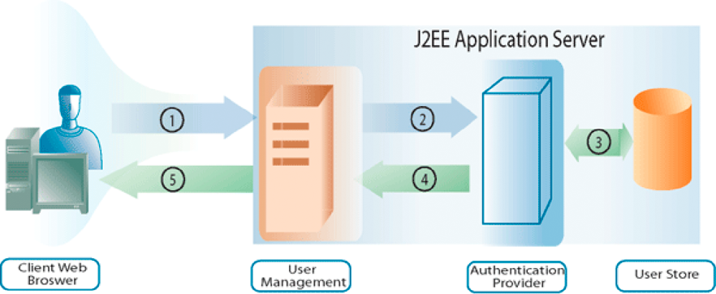

# 管理用戶{#managing-users}

**本文中的範例和範例僅適用於AEM Forms的JEE環境。**

**關於用戶管理**

您可以使用使用者管理API來建立用戶端應用程式，以管理角色、權限和承擔者（可以是使用者或群組），並驗證使用者。 使用者管理API包含下列AEM FormsAPI:

* 目錄管理器服務API
* Authentication Manager服務API
* 授權管理器服務API

使用者管理可讓您指派、移除和決定角色和權限。 它也可讓您指派、移除和查詢網域、使用者和群組。 最後，您可以使用「使用者管理」來驗證使用者。

在[新增使用者](users.md#adding-users)中，您將瞭解如何以程式設計方式新增使用者。 本節使用目錄管理器服務API。

在[刪除用戶](users.md#deleting-users)中，您將瞭解如何以程式設計方式刪除用戶。 本節使用目錄管理器服務API。

在[管理使用者和群組](users.md#managing-users-and-groups)中，您將瞭解本機使用者和目錄使用者之間的差異，並檢視如何使用Java和web service API以程式設計方式管理使用者和群組的範例。 本節使用目錄管理器服務API。

在[管理角色和權限](users.md#managing-roles-and-permissions)中，您將瞭解系統角色和權限，以及您可以通過寫程式方式來增強這些角色和權限，並查看如何使用Java和web服務API以寫程式方式管理角色和權限的示例。 本節同時使用目錄管理器服務API和授權管理器服務API。

在[驗證使用者](users.md#authenticating-users)中，您會看到如何使用Java和web service API以程式設計方式驗證使用者的範例。 本節使用授權管理器服務API。

**瞭解驗證程式**

使用者管理提供內建的驗證功能，也讓您能夠將它與您自己的驗證提供者連接。 當「使用者管理」收到驗證要求（例如，使用者嘗試登入）時，會將使用者資訊傳遞給驗證提供者以進行驗證。 使用者管理會在驗證使用者後，從驗證提供者接收結果。

下圖顯示嘗試登入的一般使用者、使用者管理與驗證提供者之間的互動。

下表說明驗證程式的每個步驟。

<table>
 <thead>
  <tr>
   <th>
步驟
</th>
   <th>
說明
</th>
  </tr>
 </thead>
 <tbody>
  <tr>
   <td>
1
</td>
   <td>
用戶嘗試登錄調用「用戶管理」的服務。 用戶指定用戶名和口令。 
</td>
  </tr>
  <tr>
   <td>
2
</td>
   <td>
使用者管理會將使用者名稱和密碼以及設定資訊傳送至驗證提供者。
</td>
  </tr>
  <tr>
   <td>
3
</td>
   <td>
認證提供者連接至使用者儲存並驗證使用者。
</td>
  </tr>
  <tr>
   <td>
4
</td>
   <td>
驗證提供者會將結果傳回使用者管理。
</td>
  </tr>
  <tr>
   <td>
5
</td>
   <td>
使用者管理可讓使用者登入或拒絕產品存取。
</td>
  </tr>
 </tbody>
</table>

>[!NOTE]
>
>如果伺服器時區與客戶機時區不同，在WebSphere應用程式伺服器群集上使用。NET客戶端在本地SOAP堆棧上使用AEM Forms生成PDF服務的WSDL時，可能會發生以下用戶管理驗證錯誤：

`[com.adobe.idp.um.webservices.WSSecurityHandler] errorCode:12803 errorCodeHEX:0x3203 message:WSSecurityHandler: UM authenticate returns exception : An error was discovered processing the <wsse:Security> header. (WSSecurityEngine: Invalid timestamp The security semantics of message have expired).`

**瞭解目錄管理**

用戶管理與支援到LDAP目錄的連接的目錄服務提供程式(DirectoryManagerService)一起打包。 如果您的組織使用非LDAP儲存庫來儲存用戶記錄，則可以建立與儲存庫一起使用的自己的目錄服務提供程式。

目錄服務提供者應使用者管理的要求，從使用者存放區擷取記錄。 使用者管理會定期在資料庫中快取使用者和群組記錄，以改善效能。

目錄服務提供程式可用於將用戶管理資料庫與用戶儲存同步。 此步驟可確保所有使用者目錄資訊以及所有使用者和群組記錄都是最新的。

此外， DirectoryManagerService還允許您建立和管理域。 網域會定義不同的使用者群。 域的邊界通常根據組織的結構方式或用戶儲存的設定來定義。 使用者管理網域提供驗證提供者和目錄服務提供者使用的組態設定。

在「用戶管理」導出的配置XML中，屬性值`Domains`的根節點包含為「用戶管理」定義的每個域的XML元素。 這些元素中的每一個都包含其他元素，這些元素定義與特定服務提供商相關聯的域的各個方面。

**瞭解objectSID值**

使用Active Directory時，請務必瞭解`objectSID`值並非跨多個網域的唯一屬性。 此值儲存對象的安全標識符。 在多網域環境（例如，網域樹）中，`objectSID`值可以不同。

如果對象從一個Active Directory域移動到另一個域， `objectSID`值將會改變。 某些對象在域中的任何位置都具有相同的`objectSID`值。 例如，像BUILDIN\Administrators、BUILDIN\Power Users等群組無論網域為何都會有相同的`objectSID`值。 這些`objectSID`值是眾所周知的。

## 添加用戶{#adding-users}

您可以使用目錄管理器服務API（Java和web服務），以程式設計方式將用戶添加到AEM Forms。 在添加用戶後，在執行需要用戶的服務操作時可以使用該用戶。 例如，您可以指派任務給新用戶。

### 步驟{#summary-of-steps}摘要

要添加用戶，請執行以下步驟：

1. 包含專案檔案。
1. 建立DirectoryManagerService客戶端。
1. 定義使用者資訊。
1. 將使用者新增至AEM Forms。
1. 確認已添加用戶。

**包含專案檔案**

在您的開發專案中加入必要的檔案。 如果要使用Java建立客戶端應用程式，請包括必要的JAR檔案。 如果您使用web services，請加入proxy檔案。

**建立DirectoryManagerService客戶端**

在以寫程式方式執行目錄管理器服務操作之前，請建立目錄管理器服務API客戶端。

**定義使用者資訊**

當您使用目錄管理器服務API添加新用戶時，請為該用戶定義資訊。 通常，在添加新用戶時，您定義以下值：

* **域名**:用戶所屬的域(例如 `DefaultDom`)。
* **使用者識別碼值**:使用者的識別碼值(例如 `wblue`)。
* **主要類型**:使用者類型(例如，您可以指定 `USER)`。
* **指定名稱**:使用者的指定名稱(例如 `Wendy`)。
* **姓氏**:用戶的族名(例如 `Blue)`。
* **地區**:用戶的地區資訊。

**將用戶添加到AEM Forms**

定義使用者資訊後，您可將使用者新增至AEM Forms。 若要新增使用者，請叫用`DirectoryManagerServiceClient`物件的`createLocalUser`方法。

**確認已添加用戶**

您可以驗證是否已新增使用者，以確保未發生任何問題。 使用使用者識別碼值來尋找新使用者。

**另請參閱**

[使用Java API新增使用者](users.md#add-users-using-the-java-api)

[使用web service API新增使用者](users.md#add-users-using-the-web-service-api)

[包含AEM FormsJava庫檔案](/help/forms/developing/invoking-aem-forms-using-java.md#including-aem-forms-java-library-files)

[設定連接屬性](/help/forms/developing/invoking-aem-forms-using-java.md#setting-connection-properties)

[刪除用戶](users.md#deleting-users)

### 使用Java API {#add-users-using-the-java-api}新增使用者

使用目錄管理器服務API(Java)添加用戶：

1. 包含專案檔案。

   在Java專案的類別路徑中包含用戶端JAR檔案，例如adobe-usermanager-client.jar。

1. 建立DirectoryManagerServices客戶端。

   使用其建構子並傳遞包含連接屬性的`ServiceClientFactory`對象，建立`DirectoryManagerServiceClient`對象。

1. 定義使用者資訊。

   * 使用其建構子建立`UserImpl`對象。
   * 調用`UserImpl`物件的`setDomainName`方法，以設定demain名稱。 傳遞指定網域名稱的字串值。
   * 通過調用`UserImpl`對象的`setPrincipalType`方法來設定承擔者類型。 傳遞指定使用者類型的字串值。 例如，您可以指定`USER`。
   * 調用`UserImpl`物件的`setUserid`方法，以設定使用者識別碼值。 傳遞指定使用者識別碼值的字串值。 例如，您可以指定`wblue`。
   * 調用`UserImpl`物件的`setCanonicalName`方法，以設定標準名稱。 傳遞指定使用者標準名稱的字串值。 例如，您可以指定`wblue`。
   * 調用`UserImpl`物件的`setGivenName`方法來設定指定名稱。 傳遞指定使用者指定名稱的字串值。 例如，您可以指定`Wendy`。
   * 通過調用`UserImpl`對象的`setFamilyName`方法來設定族名。 傳遞指定使用者系列名稱的字串值。 例如，您可以指定`Blue`。

   >[!NOTE]
   >
   >調用屬於`UserImpl`對象的方法以設定其他值。 例如，您可以叫用`UserImpl`物件的`setLocale`方法來設定地區設定值。

1. 將使用者新增至AEM Forms。

   叫用`DirectoryManagerServiceClient`物件的`createLocalUser`方法並傳遞下列值：

   * 代表新用戶的`UserImpl`對象
   * 代表使用者密碼的字串值

   `createLocalUser`方法會傳回指定本機使用者識別碼值的字串值。

1. 確認已添加用戶。

   * 使用其建構子建立`PrincipalSearchFilter`對象。
   * 調用`PrincipalSearchFilter`物件的`setUserId`方法，以設定使用者識別碼值。 傳遞代表使用者識別碼值的字串值。
   * 叫用`DirectoryManagerServiceClient`物件的`findPrincipals`方法並傳遞`PrincipalSearchFilter`物件。 此方法傳回`java.util.List`例項，其中每個元素都是`User`物件。 重複`java.util.List`實例以找到用戶。

**另請參閱**

[步驟摘要](users.md#summary-of-steps)

[快速入門（SOAP模式）:使用Java API新增使用者](/help/forms/developing/user-manager-java-api-quick.md#quick-start-soap-mode-adding-users-using-the-java-api)

[包含AEM FormsJava庫檔案](/help/forms/developing/invoking-aem-forms-using-java.md#including-aem-forms-java-library-files)

[設定連接屬性](/help/forms/developing/invoking-aem-forms-using-java.md#setting-connection-properties)

### 使用web service API {#add-users-using-the-web-service-api}新增使用者

使用目錄管理器服務API（web服務）添加用戶：

1. 包含專案檔案。

   建立使用MTOM的Microsoft .NET專案。 請確定您對服務引用使用以下WSDL定義：`http://localhost:8080/soap/services/DirectoryManagerService?WSDL&lc_version=9.0.1`。

   >[!NOTE]
   >
   >將`localhost`取代為代管AEM Forms的伺服器的IP位址。

1. 建立DirectoryManagerService客戶端。

   * 使用其預設建構子建立`DirectoryManagerServiceClient`對象。
   * 使用`System.ServiceModel.EndpointAddress`建構函式建立`DirectoryManagerServiceClient.Endpoint.Address`物件。 將指定WSDL的字串值傳遞給AEM Forms服務（例如`http://localhost:8080/soap/services/DirectoryManagerService?blob=mtom`）。 您不需要使用`lc_version`屬性。 建立服務參考時，將使用此屬性。 請確定您指定`?blob=mtom`。
   * 獲取`DirectoryManagerServiceClient.Endpoint.Binding`欄位的值，建立`System.ServiceModel.BasicHttpBinding`對象。 將返回值轉換為`BasicHttpBinding`。
   * 將`System.ServiceModel.BasicHttpBinding`物件的`MessageEncoding`欄位設為`WSMessageEncoding.Mtom`。 此值可確保使用MTOM。
   * 執行下列工作以啟用基本HTTP驗證：

      * 將表AEM單用戶名分配給欄位`DirectoryManagerServiceClient.ClientCredentials.UserName.UserName`。
      * 將相應的口令值分配給欄位`DirectoryManagerServiceClient.ClientCredentials.UserName.Password`。
      * 將常數值`HttpClientCredentialType.Basic`分配給欄位`BasicHttpBindingSecurity.Transport.ClientCredentialType`。
      * 將常數值`BasicHttpSecurityMode.TransportCredentialOnly`分配給欄位`BasicHttpBindingSecurity.Security.Mode`。

1. 定義使用者資訊。

   * 使用其建構子建立`UserImpl`對象。
   * 為`UserImpl`物件的`domainName`欄位指派字串值，以設定demain名稱。
   * 通過為`UserImpl`對象的`principalType`欄位指定字串值來設定主體類型。 例如，您可以指定`USER`。
   * 為`UserImpl`物件的`userid`欄位指派字串值，以設定使用者識別碼值。
   * 為`UserImpl`物件的`canonicalName`欄位指派字串值，以設定標準名稱值。
   * 為`UserImpl`物件的`givenName`欄位指派字串值，以設定指定的名稱值。
   * 通過為`UserImpl`對象的`familyName`欄位指定字串值來設定族名值。

1. 將使用者新增至AEM Forms。

   叫用`DirectoryManagerServiceClient`物件的`createLocalUser`方法並傳遞下列值：

   * 代表新用戶的`UserImpl`對象
   * 代表使用者密碼的字串值

   `createLocalUser`方法會傳回指定本機使用者識別碼值的字串值。

1. 確認已添加用戶。

   * 使用其建構子建立`PrincipalSearchFilter`對象。
   * 為`PrincipalSearchFilter`物件的`userId`欄位指派代表使用者識別碼值的字串值，以設定使用者的使用者識別碼值。
   * 叫用`DirectoryManagerServiceClient`物件的`findPrincipals`方法並傳遞`PrincipalSearchFilter`物件。 此方法傳回`MyArrayOfUser`系列物件，其中每個元素都是`User`物件。 重複`MyArrayOfUser`系列以找出使用者。

**另請參閱**

[步驟摘要](users.md#summary-of-steps)

[使用MTOM叫用AEM Forms](/help/forms/developing/invoking-aem-forms-using-web.md#invoking-aem-forms-using-mtom)

[使用SwaRef叫用AEM Forms](/help/forms/developing/invoking-aem-forms-using-web.md#invoking-aem-forms-using-swaref)

## 刪除用戶{#deleting-users}

您可以使用目錄管理器服務API（Java和web service），以程式設計方式從AEM Forms刪除用戶。 刪除用戶後，無法再使用該用戶執行需要用戶的服務操作。 例如，您無法將任務指派給已刪除的用戶。

### 步驟{#summary_of_steps-1}摘要

要刪除用戶，請執行以下步驟：

1. 包含專案檔案。
1. 建立DirectoryManagerService客戶端。
1. 指定要刪除的使用者。
1. 從AEM Forms刪除用戶。

**包含專案檔案**

在您的開發專案中加入必要的檔案。 如果要使用Java建立客戶端應用程式，請包括必要的JAR檔案。 如果您使用web services，請加入proxy檔案。

**建立DirectoryManagerService客戶端**

在以寫程式方式執行目錄管理器服務API操作之前，請建立目錄管理器服務客戶端。

**指定要刪除的使用者**

您可以使用使用者的識別碼值來指定要刪除的使用者。

**從AEM Forms刪除用戶**

若要刪除使用者，請叫用`DirectoryManagerServiceClient`物件的`deleteLocalUser`方法。

**另請參閱**

[使用Java API刪除使用者](users.md#delete-users-using-the-java-api)

[使用web service API刪除使用者](users.md#delete-users-using-the-web-service-api)

[包含AEM FormsJava庫檔案](/help/forms/developing/invoking-aem-forms-using-java.md#including-aem-forms-java-library-files)

[設定連接屬性](/help/forms/developing/invoking-aem-forms-using-java.md#setting-connection-properties)

[新增使用者](users.md#adding-users)

### 使用Java API {#delete-users-using-the-java-api}刪除用戶

使用目錄管理器服務API(Java)刪除用戶：

1. 包含專案檔案。

   在Java專案的類別路徑中包含用戶端JAR檔案，例如adobe-usermanager-client.jar。

1. 建立DirectoryManagerService客戶端。

   使用其建構子並傳遞包含連接屬性的`ServiceClientFactory`對象，建立`DirectoryManagerServiceClient`對象。

1. 指定要刪除的使用者。

   * 使用其建構子建立`PrincipalSearchFilter`對象。
   * 調用`PrincipalSearchFilter`物件的`setUserId`方法，以設定使用者識別碼值。 傳遞代表使用者識別碼值的字串值。
   * 叫用`DirectoryManagerServiceClient`物件的`findPrincipals`方法並傳遞`PrincipalSearchFilter`物件。 此方法傳回`java.util.List`例項，其中每個元素都是`User`物件。 重複`java.util.List`實例以找到要刪除的用戶。

1. 從AEM Forms刪除用戶。

   叫用`DirectoryManagerServiceClient`物件的`deleteLocalUser`方法，並傳遞`User`物件的`oid`欄位值。 叫用`User`物件的`getOid`方法。 使用從`java.util.List`實例檢索的`User`對象。

**另請參閱**

[步驟摘要](users.md#summary-of-steps)

[快速啟動（EJB模式）:使用Java API刪除用戶](/help/forms/developing/user-manager-java-api-quick.md#quick-start-soap-mode-deleting-users-using-the-java-api)

[快速入門（SOAP模式）:使用Java API刪除用戶](/help/forms/developing/user-manager-java-api-quick.md#quick-start-soap-mode-deleting-users-using-the-java-api)

[包含AEM FormsJava庫檔案](/help/forms/developing/invoking-aem-forms-using-java.md#including-aem-forms-java-library-files)

[設定連接屬性](/help/forms/developing/invoking-aem-forms-using-java.md#setting-connection-properties)

### 使用web service API {#delete-users-using-the-web-service-api}刪除用戶

使用目錄管理器服務API（web服務）刪除用戶：

1. 包含專案檔案。

   在Java專案的類別路徑中包含用戶端JAR檔案，例如adobe-usermanager-client.jar。

1. 建立DirectoryManagerService客戶端。

   * 使用其預設建構子建立`DirectoryManagerServiceClient`對象。
   * 使用`System.ServiceModel.EndpointAddress`建構函式建立`DirectoryManagerServiceClient.Endpoint.Address`物件。 將指定WSDL的字串值傳遞給AEM Forms服務（例如`http://localhost:8080/soap/services/DirectoryManagerService?blob=mtom`）。 您不需要使用`lc_version`屬性。 建立服務參考時，將使用此屬性。 確定您指定`blob=mtom.`
   * 獲取`DirectoryManagerServiceClient.Endpoint.Binding`欄位的值，建立`System.ServiceModel.BasicHttpBinding`對象。 將返回值轉換為`BasicHttpBinding`。
   * 將`System.ServiceModel.BasicHttpBinding`物件的`MessageEncoding`欄位設為`WSMessageEncoding.Mtom`。 此值可確保使用MTOM。
   * 執行下列工作以啟用基本HTTP驗證：

      * 將表AEM單用戶名分配給欄位`DirectoryManagerServiceClient.ClientCredentials.UserName.UserName`。
      * 將相應的口令值分配給欄位`DirectoryManagerServiceClient.ClientCredentials.UserName.Password`。
      * 將常數值`HttpClientCredentialType.Basic`分配給欄位`BasicHttpBindingSecurity.Transport.ClientCredentialType`。
      * 將常數值`BasicHttpSecurityMode.TransportCredentialOnly`分配給欄位`BasicHttpBindingSecurity.Security.Mode`。

1. 指定要刪除的使用者。

   * 使用其建構子建立`PrincipalSearchFilter`對象。
   * 為`PrincipalSearchFilter`物件的`userId`欄位指派字串值，以設定使用者識別碼值。
   * 叫用`DirectoryManagerServiceClient`物件的`findPrincipals`方法並傳遞`PrincipalSearchFilter`物件。 此方法傳回`MyArrayOfUser`系列物件，其中每個元素都是`User`物件。 重複`MyArrayOfUser`系列以找出使用者。 從`MyArrayOfUser`集合物件擷取的`User`物件會用來刪除使用者。

1. 從AEM Forms刪除用戶。

   將`User`物件的`oid`欄位值傳遞至`DirectoryManagerServiceClient`物件的`deleteLocalUser`方法，以刪除使用者。

**另請參閱**

[步驟摘要](users.md#summary-of-steps)

[使用MTOM叫用AEM Forms](/help/forms/developing/invoking-aem-forms-using-web.md#invoking-aem-forms-using-mtom)

[使用SwaRef叫用AEM Forms](/help/forms/developing/invoking-aem-forms-using-web.md#invoking-aem-forms-using-swaref)

## 建立組{#creating-groups}

您可以使用目錄管理器服務API（Java和web服務）以程式設計方式建立AEM Forms組。 建立群組後，您可以使用該群組來執行需要群組的服務作業。 例如，您可以指派使用者至新群組。 （請參閱[管理使用者和群組](users.md#managing-users-and-groups)）。

### 步驟{#summary_of_steps-2}摘要

要建立組，請執行以下步驟：

1. 包含專案檔案。
1. 建立DirectoryManagerService客戶端。
1. 確定組不存在。
1. 建立群組。
1. 對組執行操作。

**包含專案檔案**

在您的開發專案中加入必要的檔案。 如果要使用Java建立客戶端應用程式，請包括必要的JAR檔案。

必須將以下JAR檔案添加到項目的類路徑中：

* adobe-livecycle-client.jar
* adobe-usermanager-client.jar
* adobe-utilities.jar(如果AEM Forms部署在JBoss上，則為必要項)
* jbossall-client.jar(如果AEM Forms部署在JBoss上，則為必需)

有關這些JAR檔案位置的資訊，請參見[包括AEM FormsJava庫檔案](/help/forms/developing/invoking-aem-forms-using-java.md#including-aem-forms-java-library-files)。

**建立DirectoryManagerService客戶端**

在以寫程式方式執行目錄管理器服務操作之前，請建立目錄管理器服務API客戶端。

**確定組是否存在**

建立群組時，請確定群組不存在於相同網域中。 也就是說，兩個群組在相同網域內不能有相同的名稱。 要執行此任務，請執行搜索並基於兩個值篩選搜索結果。 將承擔者類型設定為`com.adobe.idp.um.api.infomodel.Principal.PRINCIPALTYPE_GROUP` ，以確保只返回組。 此外，請確定您指定網域名稱。

**建立群組**

確定組不存在於域中後，請建立組並指定以下屬性：

* **CommonName**:群組的名稱。
* **網域**:新增群組的網域。
* **說明**:群組的說明。

**對組執行操作**

建立群組後，您可以使用群組執行動作。 例如，您可以新增使用者至群組。 若要將使用者新增至群組，請擷取使用者和群組的唯一識別碼值。 將這些值傳遞至`addPrincipalToLocalGroup`方法。

**另請參閱**

[使用Java API建立群組](users.md#create-groups-using-the-java-api)

[包含AEM FormsJava庫檔案](/help/forms/developing/invoking-aem-forms-using-java.md#including-aem-forms-java-library-files)

[設定連接屬性](/help/forms/developing/invoking-aem-forms-using-java.md#setting-connection-properties)

[新增使用者](users.md#adding-users)

[刪除用戶](users.md#deleting-users)

### 使用Java API {#create-groups-using-the-java-api}建立群組

使用目錄管理器服務API(Java)建立組：

1. 包含專案檔案。

   在Java專案的類別路徑中包含用戶端JAR檔案，例如adobe-usermanager-client.jar。

1. 建立DirectoryManagerService客戶端。

   使用其建構子並傳遞包含連接屬性的`ServiceClientFactory`對象，建立`DirectoryManagerServiceClient`對象。

1. 確定組是否存在。

   * 使用其建構子建立`PrincipalSearchFilter`對象。
   * 通過調用`PrincipalSearchFilter`對象的`setPrincipalType`對象來設定主類型。 傳遞值`com.adobe.idp.um.api.infomodel.Principal.PRINCIPALTYPE_GROUP`。
   * 調用`PrincipalSearchFilter`物件的`setSpecificDomainName`物件來設定網域。 傳遞指定網域名稱的字串值。
   * 要查找組，請調用`DirectoryManagerServiceClient`對象的`findPrincipals`方法（主體可以是組）。 傳遞指定主類型和域名的`PrincipalSearchFilter`對象。 此方法傳回`java.util.List`例項，其中每個元素都是`Group`例項。 每個群組實例都符合使用`PrincipalSearchFilter`物件所指定的篩選器。
   * 重複`java.util.List`實例。 對於每個元素，檢索組名。 請確定群組名稱不等於新群組名稱。

1. 建立群組。

   * 如果組不存在，請調用`Group`對象的`setCommonName`方法並傳遞指定組名的字串值。
   * 叫用`Group`物件的`setDescription`方法，並傳遞指定群組說明的字串值。
   * 叫用`Group`物件的`setDomainName`方法，並傳遞指定網域名稱的字串值。
   * 叫用`DirectoryManagerServiceClient`物件的`createLocalGroup`方法並傳遞`Group`例項。

   `createLocalUser`方法會傳回指定本機使用者識別碼值的字串值。

1. 對組執行操作。

   * 使用其建構子建立`PrincipalSearchFilter`對象。
   * 調用`PrincipalSearchFilter`物件的`setUserId`方法，以設定使用者識別碼值。 傳遞代表使用者識別碼值的字串值。
   * 叫用`DirectoryManagerServiceClient`物件的`findPrincipals`方法並傳遞`PrincipalSearchFilter`物件。 此方法傳回`java.util.List`例項，其中每個元素都是`User`物件。 重複`java.util.List`實例以找到用戶。
   * 叫用`DirectoryManagerServiceClient`物件的`addPrincipalToLocalGroup`方法，將使用者新增至群組。 傳遞`User`物件`getOid`方法的傳回值。 傳遞`Group`物件的`getOid`方法的傳回值（使用代表新群組的`Group`例項）。

**另請參閱**

[步驟摘要](users.md#summary-of-steps)

[包含AEM FormsJava庫檔案](/help/forms/developing/invoking-aem-forms-using-java.md#including-aem-forms-java-library-files)

[設定連接屬性](/help/forms/developing/invoking-aem-forms-using-java.md#setting-connection-properties)

## 管理用戶和組{#managing-users-and-groups}

本主題說明如何使用(Java)以程式設計方式指派、移除和查詢網域、使用者和群組。

>[!NOTE]
>
>在設定網域時，您必須為群組和使用者設定唯一識別碼。 所選的屬性不僅在LDAP環境中是唯一的，而且必須是不可變的，不會在目錄中更改。 此屬性也必須是簡單的字串資料類型（Active Directory 2000/2003當前允許的唯一例外是`"objectsid"` ，它是二進位值）。 例如，Novell eDirectory屬性`"GUID"`不是簡單的字串資料類型，因此將無法工作。

* 對於Active Directory，請使用`"objectsid"`。
* 對於SunOne，請使用`"nsuniqueid"`。

>[!NOTE]
>
>不支援在LDAP目錄同步進行時建立多個本地用戶和組。 嘗試此程式可能會導致錯誤。

### 步驟{#summary_of_steps-3}摘要

要管理用戶和組，請執行以下步驟：

1. 包含專案檔案。
1. 建立DirectoryManagerService客戶端。
1. 叫用適當的使用者或群組作業。

**包含專案檔案**

在您的開發專案中加入必要的檔案。 如果使用Java建立客戶端應用程式，則包括必要的JAR檔案。 如果您使用web services，請確定您包含proxy檔案。

**建立DirectoryManagerService客戶端**

在以寫程式方式執行目錄管理器服務操作之前，必須建立目錄管理器服務客戶端。 使用Java API，這是透過建立`DirectoryManagerServiceClient`物件來完成的。 使用web service API，這是透過建立`DirectoryManagerServiceService`物件來完成的。

**叫用適當的使用者或群組作業**

建立服務客戶端後，可以調用用戶或組管理操作。 服務客戶端允許您分配、刪除和查詢域、用戶和組。 請注意，可以將目錄承擔者或本地承擔者添加到本地組，但無法將本地承擔者添加到目錄組。

**另請參閱**

[使用Java API管理使用者和群組](users.md#managing-users-and-groups-using-the-java-api)

[使用web service API管理使用者和群組](users.md#managing-users-and-groups-using-the-web-service-api)

[包含AEM FormsJava庫檔案](/help/forms/developing/invoking-aem-forms-using-java.md#including-aem-forms-java-library-files)

[設定連接屬性](/help/forms/developing/invoking-aem-forms-using-java.md#setting-connection-properties)

[User Manager API快速入門](/help/forms/developing/user-manager-java-api-quick.md#user-manager-java-api-quick-start-soap)

### 使用Java API {#managing-users-and-groups-using-the-java-api}管理使用者和群組

若要使用(Java)以程式設計方式管理使用者、群組和網域，請執行下列工作：

1. 包含專案檔案。

   在Java專案的類別路徑中包含用戶端JAR檔案，例如adobe-usermanager-client.jar。 有關這些檔案位置的資訊，請參見[包括AEM FormsJava庫檔案](/help/forms/developing/invoking-aem-forms-using-java.md#including-aem-forms-java-library-files)。

1. 建立DirectoryManagerService客戶端。

   使用其建構子並傳遞包含連接屬性的`ServiceClientFactory`對象，建立`DirectoryManagerServiceClient`對象。 有關資訊，請參閱[設定連接屬性&#x200B;](/help/forms/developing/invoking-aem-forms-using-java.md#setting-connection-properties)*。*

1. 叫用適當的使用者或群組作業。

   要查找用戶或組，請調用`DirectoryManagerServiceClient`對象中用於查找承擔者的方法之一（因為承擔者可以是用戶或組）。 在以下範例中，使用搜尋篩選器（`PrincipalSearchFilter`物件）來呼叫`findPrincipals`方法。

   由於此例中的返回值是包含`Principal`對象的`java.util.List`，因此對結果進行迭代，並將`Principal`對象轉換為`User`或`Group`對象。

   使用結果`User`或`Group`物件（兩者皆繼承自`Principal`介面），擷取工作流程中所需的資訊。 例如，域名和標準名稱值組合在一起可唯一地標識承擔者。 這些檢索方法是分別調用`Principal`對象的`getDomainName`和`getCanonicalName`方法。

   若要刪除本機使用者，請叫用`DirectoryManagerServiceClient`物件的`deleteLocalUser`方法並傳遞使用者的識別碼。

   若要刪除本機群組，請叫用`DirectoryManagerServiceClient`物件的`deleteLocalGroup`方法並傳遞群組的識別碼。

**另請參閱**

[步驟摘要](users.md#summary-of-steps)

[包含AEM FormsJava庫檔案](/help/forms/developing/invoking-aem-forms-using-java.md#including-aem-forms-java-library-files)

[設定連接屬性](/help/forms/developing/invoking-aem-forms-using-java.md#setting-connection-properties)

### 使用web service API {#managing-users-and-groups-using-the-web-service-api}管理使用者和群組

要使用目錄管理器服務API(web service)以寫程式方式管理用戶、組和域，請執行以下任務：

1. 包含專案檔案。

   * 建立一個使用目錄管理器WSDL的Microsoft .NET客戶端元件。 (請參閱[使用Base64編碼叫用AEM Forms。)](/help/forms/developing/invoking-aem-forms-using-web.md#invoking-aem-forms-using-base64-encoding)
   * 參考Microsoft .NET客戶端元件。 （請參閱[建立使用Base64編碼的。NET客戶端元件。）](/help/forms/developing/invoking-aem-forms-using-web.md#creating-a-net-client-assembly-that-uses-base64-encoding)

1. 建立DirectoryManagerService客戶端。

   使用proxy類別的建構函式建立`DirectoryManagerServiceService`物件。

1. 叫用適當的使用者或群組作業。

   要查找用戶或組，請調用`DirectoryManagerServiceService`對象中用於查找承擔者的方法之一（因為承擔者可以是用戶或組）。 在以下範例中，使用搜尋篩選器（`PrincipalSearchFilter`物件）來呼叫`findPrincipalsWithFilter`方法。 使用`PrincipalSearchFilter`對象時，僅當`isLocal`屬性設定為`true`時才返回本地承擔者。 此行為與Java API的行為不同。

   >[!NOTE]
   >
   >如果未在搜尋篩選器中（透過`PrincipalSearchFilter.resultsMax`欄位）指定最大結果數，則最多會傳回1000個結果。 這與使用Java API（預設上限為10個結果）時的行為不同。 此外，搜尋方法（例如`findGroupMembers`）不會產生任何結果，除非搜尋篩選器中指定最大結果數（例如透過`GroupMembershipSearchFilter.resultsMax`欄位）。 這套用至所有繼承自`GenericSearchFilter`類別的搜尋篩選器。 如需詳細資訊，請參閱[AEM FormsAPI參考](https://www.adobe.com/go/learn_aemforms_javadocs_63_en)。

   由於此例中的返回值是包含`Principal`對象的`object[]`，因此對結果進行迭代，並將`Principal`對象轉換為`User`或`Group`對象。

   使用結果`User`或`Group`物件（兩者皆繼承自`Principal`介面），擷取工作流程中所需的資訊。 例如，域名和標準名稱值組合在一起可唯一地標識承擔者。 這些檢索方法是分別調用`Principal`對象的`domainName`和`canonicalName`欄位。

   若要刪除本機使用者，請叫用`DirectoryManagerServiceService`物件的`deleteLocalUser`方法並傳遞使用者的識別碼。

   若要刪除本機群組，請叫用`DirectoryManagerServiceService`物件的`deleteLocalGroup`方法並傳遞群組的識別碼。

**另請參閱**

[步驟摘要](users.md#summary-of-steps)

[使用MTOM叫用AEM Forms](/help/forms/developing/invoking-aem-forms-using-web.md#invoking-aem-forms-using-mtom)

## 管理角色和權限{#managing-roles-and-permissions}

本主題說明如何使用授權管理器服務API(Java)以程式設計方式指派、移除及決定角色和權限。

在AEM Forms,*角色*&#x200B;是一組訪問一個或多個系統級資源的權限。 這些權限是透過「使用者管理」建立，並由服務元件強制執行。 例如，管理員可以將「策略集作者」的角色指派給一組用戶。 然後，Rights Management將允許具有該角色的組的用戶通過管理控制台建立策略集。

角色有兩種類型：*預設角色*&#x200B;和&#x200B;*自訂角色*。 預設角色（*系統角色）*&#x200B;已駐留在AEM Forms。 假定管理員不能刪除或修改預設角色，因此不可變。 因此，管理員建立的自定義角色可以變更，管理員隨後可以修改或刪除這些角色。

角色可讓管理權限更輕鬆。 將角色分配給承擔者時，會自動將一組權限分配給承擔者，並且承擔者的所有特定訪問相關決策都基於該總指派的權限集。

### 步驟{#summary_of_steps-4}摘要

要管理角色和權限，請執行以下步驟：

1. 包含專案檔案。
1. 建立AuthorizationManagerService客戶端。
1. 調用適當的角色或權限操作。

**包含專案檔案**

在您的開發專案中加入必要的檔案。 如果使用Java建立客戶端應用程式，則包括必要的JAR檔案。 如果您使用web services，請確定您包含proxy檔案。

**建立AuthorizationManagerService客戶端**

在以寫程式方式執行User Management AuthorizationManagerService操作之前，必須建立AuthorizationManagerService客戶端。 使用Java API，您可建立`AuthorizationManagerServiceClient`物件來完成此作業。

**調用適當的角色或權限操作**

建立服務客戶端後，可以調用角色或權限操作。 服務客戶端允許您分配、刪除和確定角色和權限。

**另請參閱**

[使用Java API管理角色和權限](users.md#managing-roles-and-permissions-using-the-java-api)

[使用web service API管理角色和權限](users.md#managing-roles-and-permissions-using-the-web-service-api)

[包含AEM FormsJava庫檔案](/help/forms/developing/invoking-aem-forms-using-java.md#including-aem-forms-java-library-files)

[設定連接屬性](/help/forms/developing/invoking-aem-forms-using-java.md#setting-connection-properties)

[User Manager API快速入門](/help/forms/developing/user-manager-java-api-quick.md#user-manager-java-api-quick-start-soap)

### 使用Java API {#managing-roles-and-permissions-using-the-java-api}管理角色和權限

要使用Authorization Manager Service API(Java)管理角色和權限，請執行以下任務：

1. 包含專案檔案。

   在Java專案的類別路徑中包含用戶端JAR檔案，例如adobe-usermanager-client.jar。

1. 建立AuthorizationManagerService客戶端。

   使用其建構子並傳遞包含連接屬性的`ServiceClientFactory`對象，建立`AuthorizationManagerServiceClient`對象。

1. 調用適當的角色或權限操作。

   要為承擔者分配角色，請調用`AuthorizationManagerServiceClient`對象的`assignRole`方法並傳遞以下值：

   * 包含角色標識符的`java.lang.String`對象
   * 包含主標識符的`java.lang.String`對象的陣列。

   要從承擔者中刪除角色，請調用`AuthorizationManagerServiceClient`對象的`unassignRole`方法並傳遞以下值：

   * 包含角色標識符的`java.lang.String`對象。
   * 包含主標識符的`java.lang.String`對象的陣列。

**另請參閱**

[步驟摘要](users.md#summary-of-steps)

[快速入門（SOAP模式）:使用Java API管理角色和權限](/help/forms/developing/user-manager-java-api-quick.md#quick-start-soap-mode-managing-roles-and-permissions-using-the-java-api)

[包含AEM FormsJava庫檔案](/help/forms/developing/invoking-aem-forms-using-java.md#including-aem-forms-java-library-files)

[設定連接屬性](/help/forms/developing/invoking-aem-forms-using-java.md#setting-connection-properties)

### 使用web service API {#managing-roles-and-permissions-using-the-web-service-api}管理角色和權限

使用Authorization Manager Service API(web service)管理角色和權限：

1. 包含專案檔案。

   建立使用MTOM的Microsoft .NET專案。 請確定您使用下列WSDL定義：`http://localhost:8080/soap/services/AuthorizationManagerService?WSDL&lc_version=9.0.1`。

   >[!NOTE]
   >
   >將`localhost`取代為代管AEM Forms的伺服器的IP位址。

1. 建立AuthorizationManagerService客戶端。

   * 使用其預設建構子建立`AuthorizationManagerServiceClient`對象。
   * 使用`System.ServiceModel.EndpointAddress`建構函式建立`AuthorizationManagerServiceClient.Endpoint.Address`物件。 將指定WSDL的字串值傳遞給AEM Forms服務（例如`http://localhost:8080/soap/services/AuthorizationManagerService?blob=mtom`）。 您不需要使用`lc_version`屬性。 建立服務參考時，將使用此屬性。
   * 獲取`AuthorizationManagerServiceClient.Endpoint.Binding`欄位的值，建立`System.ServiceModel.BasicHttpBinding`對象。 將返回值轉換為`BasicHttpBinding`。
   * 將`System.ServiceModel.BasicHttpBinding`物件的`MessageEncoding`欄位設為`WSMessageEncoding.Mtom`。 此值可確保使用MTOM。
   * 執行下列工作以啟用基本HTTP驗證：

      * 將表AEM單用戶名分配給欄位`AuthorizationManagerServiceClient.ClientCredentials.UserName.UserName`。
      * 將相應的口令值分配給欄位`AuthorizationManagerServiceClient.ClientCredentials.UserName.Password`。
      * 將常數值`HttpClientCredentialType.Basic`分配給欄位`BasicHttpBindingSecurity.Transport.ClientCredentialType`。
      * 將常數值`BasicHttpSecurityMode.TransportCredentialOnly`分配給欄位`BasicHttpBindingSecurity.Security.Mode`。

1. 調用適當的角色或權限操作。

   要為承擔者分配角色，請調用`AuthorizationManagerServiceClient`對象的`assignRole`方法並傳遞以下值：

   * 包含角色標識符的`string`對象
   * 包含主標識符的`MyArrayOf_xsd_string`對象。

   要從承擔者中刪除角色，請調用`AuthorizationManagerServiceService`對象的`unassignRole`方法並傳遞以下值：

   * 包含角色標識符的`string`對象。
   * 包含主標識符的`string`對象的陣列。

**另請參閱**

[步驟摘要](users.md#summary-of-steps)

[使用MTOM叫用AEM Forms](/help/forms/developing/invoking-aem-forms-using-web.md#invoking-aem-forms-using-mtom)

## 驗證用戶{#authenticating-users}

本主題說明如何使用Authentication Manager Service API(Java)，讓用戶端應用程式以程式設計方式驗證使用者。

用戶驗證可能需要與儲存安全資料的企業資料庫或其他企業儲存庫交互。

例如，假設使用者在網頁中輸入使用者名稱和密碼，並將值提交至代管Forms的J2EE應用程式伺服器。 Forms自訂應用程式可使用驗證管理員服務來驗證使用者。

如果驗證成功，應用程式將訪問受保護的企業資料庫。 否則，會傳送訊息給使用者，指出使用者並非授權使用者。

下圖顯示應用程式的邏輯流程。

下表說明此圖中的步驟

<table>
 <thead>
  <tr>
   <th>
步驟
</th>
   <th>
說明
</th>
  </tr>
 </thead>
 <tbody>
  <tr>
   <td>
1
</td>
   <td>
用戶訪問網站並指定用戶名和口令。 這項資訊會提交至代管AEM Forms的J2EE應用程式伺服器。
</td>
  </tr>
  <tr>
   <td>
2
</td>
   <td>
用戶憑證通過Authentication Manager服務進行驗證。 如果用戶憑據有效，工作流將繼續執行步驟3。 否則，會傳送訊息給使用者，指出使用者並非授權使用者。
</td>
  </tr>
  <tr>
   <td>
1
</td>
   <td>
從安全企業資料庫檢索用戶資訊和表單設計。 
</td>
  </tr>
  <tr>
   <td>
4
</td>
   <td>
使用者資訊會與表單設計合併，表單會轉譯給使用者。 
</td>
  </tr>
 </tbody>
</table>

### 步驟{#summary_of_steps-5}摘要

若要以程式設計方式驗證使用者，請執行下列步驟：

1. 包含專案檔案。
1. 建立AuthenticationManagerService客戶端。
1. 叫用驗證操作。
1. 如有必要，請擷取內容，讓用戶端應用程式可將它轉送至另一個AEM Forms服務進行驗證。

**包含專案檔案**

在您的開發專案中加入必要的檔案。 如果使用Java建立客戶端應用程式，則包括必要的JAR檔案。 如果您使用web services，請確定您包含proxy檔案。

**建立AuthenticationManagerService客戶端**

您必須先建立AuthenticationManagerService用戶端，才能以程式設計方式驗證使用者。 使用Java API時，請建立`AuthenticationManagerServiceClient`物件。

**叫用驗證操作**

建立服務客戶端後，可以調用驗證操作。 此操作將需要有關使用者的資訊，例如使用者的名稱和密碼。 如果用戶未驗證，則會拋出異常。

**擷取驗證內容**

一旦您驗證了使用者，就可以在已驗證的使用者中建立內容。 然後，您可以使用內容叫用其他AEM Forms服務。 例如，您可以使用內容建立`EncryptionServiceClient`，並使用密碼加密PDF檔案。 確保已驗證的用戶具有調用AEM Forms服務所需的`Services User`角色。

**另請參閱**

[包含AEM FormsJava庫檔案](/help/forms/developing/invoking-aem-forms-using-java.md#including-aem-forms-java-library-files)

[設定連接屬性](/help/forms/developing/invoking-aem-forms-using-java.md#setting-connection-properties)

[User Manager API快速入門](/help/forms/developing/user-manager-java-api-quick.md#user-manager-java-api-quick-start-soap)

[使用密碼加密PDF檔案](/help/forms/developing/encrypting-decrypting-pdf-documents.md#encrypting-pdf-documents-with-a-password)

### 使用Java API {#authenticate-a-user-using-the-java-api}驗證使用者

使用Authentication Manager Service API(Java)驗證使用者：

1. 包含專案檔案。

   在Java專案的類別路徑中包含用戶端JAR檔案，例如adobe-usermanager-client.jar。

1. 建立AuthenticationManagerServices客戶端。

   使用其建構子並傳遞包含連接屬性的`ServiceClientFactory`對象，建立`AuthenticationManagerServiceClient`對象。

1. 叫用驗證操作。

   叫用`AuthenticationManagerServiceClient`物件的`authenticate`方法並傳遞下列值：

   * 包含使用者名稱的`java.lang.String`物件。
   * 包含使用者密碼的位元組陣列（`byte[]`物件）。 您可以叫用`java.lang.String`物件的`getBytes`方法，以取得`byte[]`物件。

   authenticate方法返回`AuthResult`對象，該對象包含有關已驗證用戶的資訊。

1. 擷取驗證內容。

   叫用`ServiceClientFactory`物件的`getContext`方法，此方法會傳回`Context`物件。

   然後叫用`Context`物件的`initPrincipal`方法並傳遞`AuthResult`。

### 使用web service API {#authenticate-a-user-using-the-web-service-api}驗證用戶

使用Authentication Manager Service API(web service)驗證用戶：

1. 包含專案檔案。

   * 建立使用驗證管理器WSDL的Microsoft .NET客戶端元件。 (請參閱[使用Base64編碼叫用AEM Forms。)](/help/forms/developing/invoking-aem-forms-using-web.md#invoking-aem-forms-using-base64-encoding)
   * 參考Microsoft .NET客戶端元件。 (請參閱[使用Base64編碼叫用AEM Forms中的「引用。NET客戶端元件」。)](/help/forms/developing/invoking-aem-forms-using-web.md#invoking-aem-forms-using-base64-encoding)

1. 建立AuthenticationManagerService客戶端。

   使用proxy類別的建構函式建立`AuthenticationManagerServiceService`物件。

1. 叫用驗證操作。

   叫用`AuthenticationManagerServiceClient`物件的`authenticate`方法並傳遞下列值：

   * 包含使用者名稱的`string`物件
   * 包含使用者密碼的位元組陣列（`byte[]`物件）。 通過使用下面示例中顯示的邏輯將包含口令的`string`對象轉換為`byte[]`陣列，可以獲得`byte[]`對象。
   * 傳回的值將是`AuthResult`物件，可用來擷取使用者的相關資訊。 在下列範例中，您會先取得`AuthResult`物件的`authenticatedUser`欄位，然後取得結果`User`物件的`canonicalName`和`domainName`欄位，以擷取使用者的資訊。

**另請參閱**

[使用MTOM叫用AEM Forms](/help/forms/developing/invoking-aem-forms-using-web.md#invoking-aem-forms-using-mtom)

[使用SwaRef叫用AEM Forms](/help/forms/developing/invoking-aem-forms-using-web.md#invoking-aem-forms-using-swaref)

## 以程式設計方式同步使用者{#programmatically-synchronizing-users}

您可以使用「使用者管理API」，以程式設計方式同步使用者。 同步用戶時，您正在使用用戶儲存庫中的用戶資料更新AEM Forms。 例如，假設您向用戶儲存庫添加新用戶。 執行同步操作後，新用戶將成為表AEM單用戶。 此外，您的使用者儲存庫中不再有的使用者也會從AEM Forms移除。

下圖顯示與用戶儲存庫同步的AEM Forms。

下表說明此圖中的步驟

<table>
 <thead>
  <tr>
   <th>
步驟
</th>
   <th>
說明
</th>
  </tr>
 </thead>
 <tbody>
  <tr>
   <td>
3
</td>
   <td>
客戶端應用程式請求AEM Forms執行同步操作。
</td>
  </tr>
  <tr>
   <td>
2
</td>
   <td>
AEM Forms執行同步操作。
</td>
  </tr>
  <tr>
   <td>
1
</td>
   <td>
使用者資訊已更新。
</td>
  </tr>
  <tr>
   <td>
4
</td>
   <td>
用戶可以查看更新的用戶資訊。 
</td>
  </tr>
 </tbody>
</table>

### 步驟{#summary_of_steps-6}摘要

若要以程式設計方式同步使用者，請執行下列步驟：

1. 包含專案檔案。
1. 建立UserManagerUtilServiceClient客戶端。
1. 指定企業網域。
1. 叫用驗證操作。
1. 確定同步操作是否完成

**包含專案檔案**

在您的開發專案中加入必要的檔案。 如果使用Java建立客戶端應用程式，則包括必要的JAR檔案。 如果您使用web services，請確定您包含proxy檔案。

**建立UserManagerUtilServiceClientclient**

您必須先建立`UserManagerUtilServiceClient`物件，才能以程式設計方式同步使用者。

**指定企業網域**

在使用用戶管理API執行同步操作之前，您應指定用戶所屬的企業域。 您可以指定一或多個企業網域。 在以寫程式方式執行同步操作之前，必須使用管理控制台設定企業域。 （請參閱[管理幫助](https://www.adobe.com/go/learn_aemforms_admin_63)。）

**調用同步操作**

指定一個或多個企業域後，可以執行同步操作。 執行此操作所花費的時間取決於用戶儲存庫中的用戶記錄數。

**確定同步操作是否完成**

在以寫程式方式執行同步操作後，可以確定操作是否完成。

**另請參閱**

[包含AEM FormsJava庫檔案](/help/forms/developing/invoking-aem-forms-using-java.md#including-aem-forms-java-library-files)

[設定連接屬性](/help/forms/developing/invoking-aem-forms-using-java.md#setting-connection-properties)

[User Manager API快速入門](/help/forms/developing/user-manager-java-api-quick.md#user-manager-java-api-quick-start-soap)

[使用密碼加密PDF檔案](/help/forms/developing/encrypting-decrypting-pdf-documents.md#encrypting-pdf-documents-with-a-password)

### 使用Java API {#programmatically-synchronizing-users-using-the-java-api}以程式設計方式同步使用者

使用使用者管理API(Java)來同步使用者：

1. 包含專案檔案。

   在Java專案的類別路徑中包含用戶端JAR檔案，例如adobe-usermanager-client.jar和adobe-usermanager-util-client.jar。

1. 建立UserManagerUtilServiceClient客戶端。

   使用其建構子並傳遞包含連接屬性的`ServiceClientFactory`對象，建立`UserManagerUtilServiceClient`對象。

1. 指定企業網域。

   * 調用`UserManagerUtilServiceClient`對象的`scheduleSynchronization`方法以啟動用戶同步操作。
   * 使用`HashSet`建構函式建立`java.util.Set`例項。 請確定您指定`String`為資料類型。 此`Java.util.Set`實例儲存應用同步操作的域名。
   * 對於要添加的每個域名，請調用`java.util.Set`對象的添加方法並傳遞域名。

1. 調用同步操作。

   叫用`ServiceClientFactory`物件的`getContext`方法，此方法會傳回`Context`物件。

   然後叫用`Context`物件的`initPrincipal`方法並傳遞`AuthResult`。

**另請參閱**

[以程式設計方式同步使用者](users.md#programmatically-synchronizing-users)

[包含AEM FormsJava庫檔案](/help/forms/developing/invoking-aem-forms-using-java.md#including-aem-forms-java-library-files)

[設定連接屬性](/help/forms/developing/invoking-aem-forms-using-java.md#setting-connection-properties)
