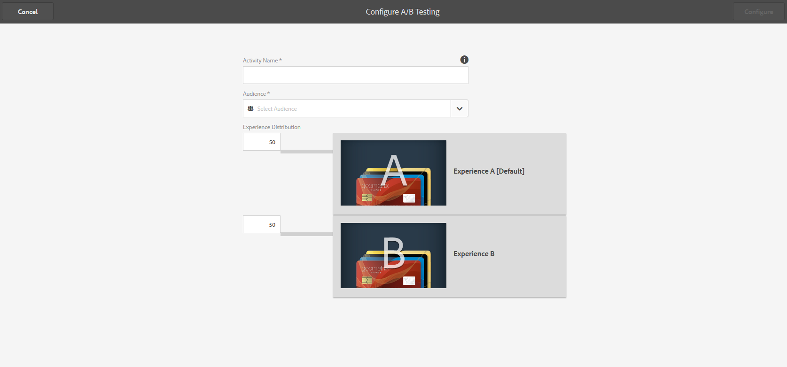
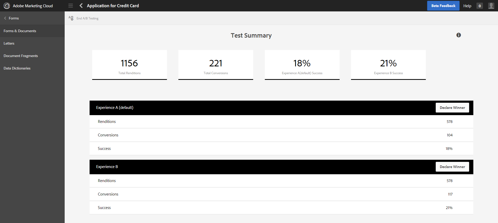

# 針對最適化表單建立和管理A/B測試{#create-and-manage-a-b-test-for-adaptive-forms}

## 概覽 {#overview-br}

如果您的客戶提供的體驗並不吸引人，他們可能會放棄表單。 雖然這令客戶感到挫折，但也可以提升組織的支援數量和成本。 識別並提供合適的客戶體驗以提高轉化率，既重要，也極具挑戰性。 Adobe Experience Manager Forms是解決此問題的關鍵。

AEM Forms與Adobe Marketing cloud解決方案Adobe Target整合，跨多個數位通道提供個人化且吸引人的客戶體驗。 Target的主要功能之一是A/B測試，可讓您快速設定並行A/B測試、向目標使用者呈現相關內容，並識別可提升轉換率的體驗。

有了AEM Forms，您可以即時在最適化表單上設定並執行A/B測試。 它還提供現成可用和可自訂的報告功能，以視覺化您表單體驗的即時效能，並找出最大化使用者參與和轉化的功能。

## 在AEM Forms中設定並整合Target {#set-up-and-integrate-target-in-aem-forms}

在您開始針對最適化表單建立和分析A/B測試之前，您必須先設定Target伺服器並將它整合在AEM Forms中。

### 設定Target {#set-up-target}

若要將AEM與Target整合，請確定您擁有有效的Adobe Target帳戶。 當您向Adobe Target註冊時，會收到用戶端代碼。 您需要用戶端代碼、與Target帳戶關聯的電子郵件，以及密碼，才能將AEM與Target連接。

「用戶端代碼」可識別Adobe target客戶帳戶，並在呼叫Adobe target伺服器時用作URL中的子網域。 繼續之前，請確定您的認證允許您登入https://testandtarget.omniture.com/ 。

### 將Target整合在AEM Forms中 {#integrate-target-in-aem-forms}

執行下列步驟，將執行中的Target伺服器與AEM Forms整合：

1. 在AEM伺服器上，前往https://&lt;*hostname*>:&lt;*port*>/libs/cq/core/content/tools/cloudservices.html。

1. 在「 **Adobe Target** 」區段中，按一下「 **顯示設定** 」，然後按 **** +圖示以新增設定。
如果您是第一次設定目標，請按一下「立 **即設定」。**

1. 在「建立配置」對話框中，指定 **「標題** 」並可 **選地指定配置的「名稱** 」。

1. 按一下&#x200B;**「建立」**。「編輯元件」(Edit component)對話框隨即開啟。
1. 指定您的Target帳戶詳細資訊，例如用戶端代碼、電子郵件和密碼。
1. 從「 **API類型** 」下拉式清單中選擇「余留」。

1. 按一 **下「連線至Adobe Target** 」，以初始化與Target的連線。 如果連接成功，則顯示「Connection successful（連接成功）」消息。 按一 **下訊息上** 「確定」，然後 **在對話方塊上** 按「確定」。 已設定Target帳戶。

1. 如「新增框架」中所述，建 [立Target架構](/help/sites-administering/target.md)。

1. 前往https://&lt;*hostname*>:&lt;*port*>/system/console/configMgr。

1. 按一 **下「AEM Forms Target設定」**。
1. 選取 **Target Framework**。
1. 在「目 **標URL** 」欄位中，指定將執行A/B測試的所有URL。 例如，https://&lt;*hostname*>:&lt;port *>/ for OSGi或https://&lt;hostname*>:&lt;****portLc// for JEE上的AEM Forms伺服器。
請考慮您要為發佈例項設定目標URL，而您的客戶可以使用主機名稱或IP位址來存取該URL，您必須同時將兩者設定為目標URL —— 使用主機名稱及IP位址。 如果您只設定其中一個URL，您的A/B測試將不會針對來自其他URL的客戶執行。 按一 **下** +以指定多個URL。

1. 按一下&#x200B;**「儲存」**。

您的Target伺服器已與AEM Forms整合。 如果您擁有使用Adobe Target的完整授權，現在可以啟用A/B測試。

如果您有完整授權可運用Adobe Target，請在將Target與AEM Forms整合後，使用下列參數啟動伺服器：

`parameter -Dabtesting.enabled=true java -Xmx2048m -XX:MaxPermSize=512M -jar -Dabtesting.enabled=true`

如果AEM實例在JBoss上運行，從完善的交鑰匙中以服務的形式啟動，則在 `jboss\bin\standalone.conf.bat` 檔案中，在以下條目中添加-Dabtesting.enabled=true參數：

`set "JAVA_OPTS=%JAVA_OPTS% -Dadobeidp.serverName=server1 -Dfile.encoding=utf8 -Djava.net.preferIPv4Stack=true -Dabtesting.enabled=true"`

除了jboss伺服器外，您還可以在任何應用程式伺服器的伺服器啟動指令碼中添加-Dabtesting.enabled=true jvm參數。 現在，您可以建立並執行最適化表單的A/B測試。

>[!NOTE]
>
>如果您稍後更新已設定的Target URL，請確定您更新任何執行中的A/B測試，以便它們指向目前的URL。 如需更新A/B測試的詳細資訊，請參 [閱更新A/B測試](/help/forms/using/ab-testing-adaptive-forms.md#p-update-a-b-test-p)。

## 在AEM中建立觀眾 {#create-audiences-within-aem}

AEM可讓您建立對象，並將它用於A/B測試。 您在AEM中建立的觀眾可在AEM Forms中使用。 執行下列步驟，在AEM中建立觀眾：

1. 在製作例項中，點選「 **Adobe Experience Manager** >個人化 **>觀** 眾」 ****。

1. 在「對象」頁面中，點選「 **建立對象>建立目標對象」**。
1. 在「Adobe Target設定」對話方塊中，選取Target設定，然後按一下「確 **定**」。
1. 在「建立新對象」頁面中，建立規則。 規則可讓您將觀眾分類。 例如，您想要根據作業系統來分類觀眾。 您的觀眾A來自Windows，觀眾B來自Linux。

   1. 若要根據Windows對觀眾分類，請在規則#1中選取「 **OS** 」屬性類型。 從「時間」下拉式清單中，選取「 **Windows」。**

   1. 若要根據Linux對觀眾分類，請在規則#2中選取 **OS** 屬性類型。 從「時 **間** 」下拉式清單中，選取 **Linux**，然後按一 **下Next**。

1. 指定已建立對象的名稱，然後按一下「 **儲存**」。

您可以在為表單設定A/B測試時選取對象，如下所示。

## 建立A/B測試 {#create-a-b-test}

執行下列步驟以建立最適化表單的A/B測試。

1. 前往https:// **&lt;** hostname *>的「表單與檔案」:&lt;* port **>/aem/forms.html/content/dam/formsanddocuments。

1. 導覽至包含最適化表單的資料夾。
1. 按一下工 **具欄中** 的「選擇工具」(Select tool)，然後選擇最適化表單。
1. 按一 **下工具** 列中的「更多」，然後 **選取「設定A/B測試」**。 「設定A/B測試」頁面隨即開啟。

[ 適應 ](assets/ab-test-configure-1.png)

1. 指定 **A/B測試的活動名稱** 。

1. 從「對象」下拉式清單中，選取您要為其提供不同表單體驗的對象。 例如，使 **用Chrome的訪客**。 觀眾清單會從已設定的Target伺服器填入。

1. 在體驗 **A和** B的「體驗分發」欄位中，指定以百分比表示的分發，以決定體驗在總觀眾中的分發。 例如，若您分別為體驗A和B指定40、60，則體驗A將提供給40%的觀眾，其餘60%的觀眾將看到體驗B。
1. 按一 **下設定**。 出現對話方塊以確認A/B測試的建立。
1. 按一 **下「編輯體驗B** 」，在編輯模式中開啟最適化表單。 修改表單以建立不同於預設體驗A的體驗。「體驗B」中允許的可能變化包括：

   * CSS或樣式
   * 不同面板或相同面板中欄位的順序
   * 面板布局
   * 面板標題
   * 欄位的說明、標籤和說明文字
   * 不影響或中斷提交流程的指令碼
   * 驗證（客戶端和伺服器端）
   * 體驗主題B.（您可以為體驗B選擇替代主題）

1. 前往「表單與檔案」使用者介面，選取最適化表單，按一 **下「更多**」，然後 **選取「開始A/B測試」**。

您的A/B測試現在正在執行，且指定的對象會根據指定的分佈隨機提供體驗。

## Update A/B test {#update-a-b-test}

您可以更新執行中A/B測試的觀眾和體驗分佈。 若要這麼做：

1. 在「表單與檔案」UI中，導覽至包含執行A/B測試之最適化表單的檔案夾。
1. 選擇最適化表單。
1. 按一 **下「更多** 」，然後選 **取「編輯A/B測試」**。 「更新A/B測試」頁面隨即開啟。

1. 視需要更新受眾和體驗分發。
1. 按一 **下更新**。

## 檢視並分析A/B測試報告 {#view-and-analyze-a-b-test-report}

在您允許A/B測試在所需期間執行後，就可以產生報告並檢查哪些體驗產生了更佳的轉換。 您可以宣告效能較佳的體驗為成功者，或選擇執行其他A/B測試。 若要這麼做，請執行下列步驟：

1. 選取最適化表單，按一 **下「更多**」，然後按 **一下「A/B測試報表」**。 報表隨即顯示。

1. 分析報表，查看您是否有足夠的資料點，將效能較佳的體驗之一宣告為成功者。 您可以選擇繼續進行相同的A/B測試更多時間，或宣告成功者並結束A/B測試。
1. 若要宣告成功者並結束A/B測試，請按一下報告控制 **面板上的「結束A/B測試** 」按鈕。 對話方塊會提示您將其中一個體驗宣告為成功者。 選擇成功者並確認結束A/B測試。
或者，您也可以先按一下個別體驗的「宣告成功者」按 **鈕來宣告成功者** 。 它會提示您確認成功者。 按一 **下** 「是」結束A/B測試。

如果您選擇體驗A做為贏家，A/B測試即將結束，而未來只會為所有觀眾提供體驗A。
