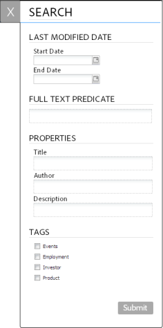

# 存取和填寫已發佈的表單{#accessing-and-filling-published-forms}

在以表單為中心的入口網站部署設定中，表單開發和入口網站開發是兩個不同的活動。 表單設計人員在存放庫中設計和儲存表單時，網頁開發人員會建立網頁應用程式，列出表單並處理提交內容。 接著，Forms會複製到Web層，因為表單存放庫與Web應用程式之間沒有通訊。

這通常會導致管理設定和生產延遲的問題。 例如，如果儲存庫中有較新版本的表單，則表單設計器將替換Web層上的表單，修改Web應用程式，然後在公共站點上重新部署該表單。 重新部署Web應用程式可能會造成伺服器停機。 由於伺服器停機是一項計畫活動，因此無法立即將變更推送至公用網站。

Forms Portal可減少管理開支和生產延遲。 它可讓網頁開發人員透過元件，在使用Adobe Experience Manager(AEM)製作的網站上建立和自訂表單入口網站。

如需表單入口網站及其功能的詳細資訊，請參閱 [在入口網站發佈表單簡介](/help/forms/using/introduction-publishing-forms.md).

## 表單入口網站快速入門 {#getting-started-with-forms-portal}

導覽至已發佈的表單入口網站頁面。 如需建立表單入口網站頁面的詳細資訊，請參閱 [建立表單入口網站頁面](../../forms/using/creating-form-portal-page.md).

Roms入口網站的Search and Lister元件會顯示AEM伺服器的Publish例項中可用的表單。 此清單包含編寫表單入口網站頁面時篩選器中定義的所有表單或表單。 表單入口網站頁面的外觀類似於下圖所示：

範例表單入口網站頁面

### 搜索和Lister {#search-and-lister}

Search和Lister元件可讓您將下列功能新增至表單入口網站：

* 列出現成可用的面板、卡片或格線檢視表單。 它也支援從Forms Manager中的特定資料夾匯入自訂範本清單表單。
* 指定表單的呈現方式 — HTML5、PDF或兩者。
* 指定PDF和XFA表單的呈現方式 — HTML5、PDF或兩者。 非XFA表單為HTML5。
* 啟用根據條件搜尋表單的功能，例如表單屬性、中繼資料和標籤。
* 將表單資料提交至servlet。
* 使用自訂樣式表(CSS)來自訂入口網站的外觀和風格。
* 建立表單連結。

您可以使用下列選項，在Forms Portal頁面中搜尋表單：

* 全文搜索
* 進階搜尋

全文搜索允許您根據指定的關鍵字查找和列出表單。

進階搜尋對話方塊

「進階搜尋」可讓您根據指定的表單屬性來搜尋表單。 這提供比全文搜尋更具體的結果。 進階搜尋包括根據標籤、屬性（例如作者、說明和標題）、修改日期和全文進行搜尋。

Lister根據搜索參數顯示表單。 搜索結果中的每個表單都顯示一個表徵圖，該表徵圖超級連結到關聯的表單。 您可以按一下圖示以開啟並使用相關的表單。

### 填寫表單 {#filling-a-form}

範例最適化表單

您可以從頁面的Search和Lister元件中提供的連結訪問表單。

每個表單都包含幫助資訊，使用者能夠填寫表單。

#### 草稿和提交 {#drafts-and-submission}

使用者可以按一下「儲存」按鈕，以儲存表單草稿。 這可讓使用者在提交表單之前，先在一段時間內處理表單。

表單中填入的資料（包括附件）會儲存為伺服器上的草稿。 表單草稿可以儲存任意次數。 儲存的表單會顯示在頁面「草稿與提交」元件的「草稿」標籤中。

填寫完表單後，用戶按一下表單上的「提交」按鈕提交表單。 已提交的表單會顯示在「頁面」的「草稿與提交」元件的「提交」標籤中。

>[!NOTE]
>
>只有將適用性表單的提交動作設為Forms Portal提交動作時，已提交的表單才會顯示在已提交的Forms標籤中。 如需提交動作的詳細資訊，請參閱 [設定提交動作](../../forms/using/configuring-submit-actions.md).

草稿和提交元件

## 使用提交的表單資料啟動新表單 {#start-a-new-form-using-submitted-form-data}

您需要經常填寫和提交某些表格。 例如，每年都提交個人納稅申報表。 在這種情況下，雖然每次填寫表單時，某些資訊都會發生變化，但大多數資訊（如個人和家庭的詳細資訊）都不會改變。 不過，您仍需從頭再次填寫整個表單。

AEM Forms可協助最佳化表單填寫體驗，並大幅縮短填寫及再次提交表單的時間。 使用者可使用已提交表單的資料，啟動新表單。 此功能內建於 [草稿和提交元件](../../forms/using/draft-submission-component.md). 將草稿和提交元件新增至您的表單入口網站頁面並發佈時，使用者會在已提交的Forms和Forms草稿索引標籤中找到選項，以使用已提交表單的資料啟動新表單。 下圖會反白標示該選項。

按一下按鈕以起始新表單時，該按鈕會開啟一個新表單，其中包含來自相應已提交表單的資料。 您現在可以視需要檢閱和更新資訊，並提交表單。
