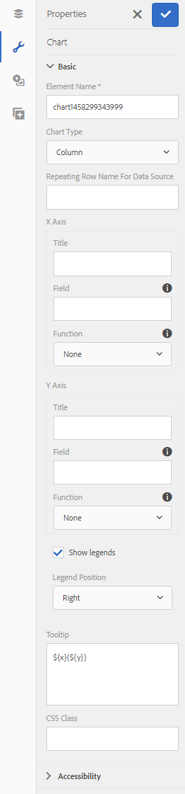
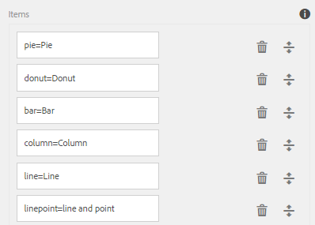

# 最適化表單圖表 {#af-charts}


圖表或圖表是資料的視覺化表示法。 它可讓您將大量資訊壓縮成容易理解且視覺化的格式，讓您更清楚呈現、解譯和分析複雜的資料。
AEM Forms附加元件套件提供立即可用的Chart元件。 您可以在調適型表單和檔案中使用，以可重複的面板和表格以視覺化方式呈現二維資料。 「圖表」元件可讓您新增及設定下列型別的圖表：

1. 圓餅圖
1. 欄
1. 圈狀
1. 長條
1. 線條
1. 線條和點
1. 點
1. 區域

「圖表」元件支援並提供內建的統計函式（總和、平均值、最大值、最小值、模式、中位數、範圍和頻率），以計算圖表和繪製圖表上的值。 除了現成可用的函式之外，您還可以編寫自己的自訂函式，並讓這些函式可用於圖表中。

現在來看看如何新增及設定圖表元件：

## 新增圖表 {#add-chart}

預設情況下，圖表元件可在AEM側邊欄中使用。 您可以將「圖表」元件從AEM側邊欄拖放至製作模式下的最適化表單或檔案。 放置元件時，會建立圖表的預留位置。

## 設定圖表 {#configure-chart}

>[!NOTE]
> 
> 在設定圖表之前，請確定您要設定圖表的面板或表格列已設定為可重複。 您可以在「編輯元件」對話方塊的「重複設定」標籤中，指定可重複面板或表格列的最小和最大計數。

若要設定圖表，請在圖表元件上按一下滑鼠右鍵，然後按一下編輯，開啟「編輯圖表」對話方塊。 該對話方塊包括「標題」和「文字」、「設定」、「進階選項」和「樣式」索引標籤，允許您設定圖表。

### 基本 {#basic}

在「基本」標籤中，您可以設定下列屬性：



* **元素名稱**：JCR內容結構中圖表元素的識別碼。 它不會顯示在圖表上，但在從其他元件、指令碼和SOM運算式參照元素時會有所幫助。
* **圖表型別**：指定要產生的圖表型別。 可用的選項有「圓餅圖」、「環圈圖」、「長條圖」、「直條圖」、「直條圖」、「直線和點」、「點」和「區域」。 在此範例中，圖表型別為「欄」。
* **資料來源的重複資料列名稱**：指定資料來源的表格列或可重複面板的元素名稱。 在範例中，statementDetails是「陳述式詳細資訊」表格中可重複資料列的元素名稱。
* **X軸>標題**：指定X軸的標題。 在此範例中，X軸的標題為「類別」。
* **X軸>欄位**：指定要在X軸上繪製之欄位（或表格中的儲存格）的元素名稱。 在此範例中，類別是在X軸上設定。 在範例表格的「類別」欄中，表格儲存格的元素名稱是「類別」。
* **X軸>使用函式**：指定用於計算X軸上值的統計函式。 在此範例中，選取的選項為「無」。 如需函式的詳細資訊，請參閱使用圖表中的函式。
* **Y軸>標題**：指定Y軸的標題。 在此範例中，Y軸的標題為「費用」。
* **Y軸>欄位**：指定要繪製在Y軸上之欄位（或表格中的儲存格）的元素名稱。 在此範例中，設定Y軸上的量。 在範例表格的「金額」欄中，表格儲存格的元素名稱是amount。
* **Y軸>使用函式**：指定用於計算Y軸值的統計函式。 在此範例中，會新增每個類別中的逗留量，並會在Y軸上繪製計算值。 因此，請從「使用函式」下拉式清單中選取「總計」。 如需函式的詳細資訊，請參閱使用圖表中的函式。
* **圖例位置**：指定圖例相對於圖表的位置。 可用的選項有「右」、「左」、「上」和「下」。
* **顯示圖例**：啟用時顯示圖表的圖例。
* **工具提示**：指定工具提示在圖表中資料點上滑鼠懸停時顯示的格式。 預設值為 **\${x}(\${y})**. 根據圖表型別，當您將滑鼠指向圖表的點、長條圖或切片時，變數 **\${x}** 和 **\${y}** 會以X軸與Y軸上的對應值動態取代，並顯示在工具提示中。 如下面的範例所示，工具提示顯示為 **零售店(5870)** 將滑鼠指向「零售商店」欄時。 若要停用工具提示，請將工具提示欄位保留空白。 此選項不適用於折線圖和面積圖。
* **圖表專屬設定**：除了常見設定外，還提供下列圖表專屬設定：
* **內徑**：適用於環形圖，以指定圖表中內圓的半徑（畫素）。
* **線條顏色**：適用於折線、折線、點和面積圖，以指定圖表中折線的顏色十六進位值。
* **點色彩**：適用於點圖、折線圖和點圖，以指定圖表中點的顏色十六進位值。
* **區域顏色**：可用於區域圖，以指定圖表內線段下區域的顏色十六進位值。
* **CSS類別**：在CSS類別欄位中指定CSS類別的名稱，以套用自訂樣式至圖表。

### 設定 {#configuration}

在「基本」標籤中，您可以定義圖表型別、包含資料的來源面板或表格列、要繪製在圖表的X軸和Y軸上的值，以及可選的統計函式，以計算繪製在圖表上的值。

讓我們詳細瞭解此標籤中的資訊，並透過信用卡對帳單中的可重複表格範例說明。 假設您要產生圖表，以描述並關聯信用卡對帳單之對帳單明細區段中不同類別的總費用，如下所示。

若要完成此作業，您需要在X軸繪製分類，並在Y軸繪製每個分類的總費用。


此範例中使用的信用卡陳述式為最適化檔案，陳述式詳細資料區段為表格，在撰寫模式中如下所示。


讓我們考慮下列產生圖表的需求和條件：

* 此圖表會顯示「對帳單詳細資訊」表格中每個類別的總費用。
* 圖表型別為「欄」，不過您可以視情況選擇任何其他圖表型別。
* 「敘述句詳細資訊」表格中的「表格」列是可重複的。 您可以在表格列屬性的「重複設定」欄位中進行設定。
* 資料列的元素名稱為statementDetails。 您可以在表格列屬性中進行設定。
* 「類別」欄中表格儲存格的元素名稱是「類別」。 您可以內嵌指定。 選取儲存格並點選編輯按鈕。
* 「金額」欄中表格儲存格的元素名稱是amount。 此外，「金額」欄中的表格儲存格是數值方塊。
* 使用指定的設定，範例中的直條圖將顯示如下。 每種顏色代表一個類別，而類別的個別條列專案或金額會加入圖表中。

  

圖例和工具提示顯示如下。


### 樣式 {#styling}

在「樣式化」模式中，您可以設定圖表的寬度（以表單或檔案中可用總寬度的百分比表示）和高度（以畫素表示）。 其他選項包括文字、背景、邊框、效果和CSS覆寫。

若要切換到樣式模式，請在頁面工具列中， **點選>>樣式**.


## 在圖表中使用函式 {#use-functions}

您可以設定圖表以使用統計函式來計算來源資料的值，以便在圖表上繪圖。 雖然圖表元件隨附一些內建函式，但您可以撰寫自己的函式，並讓這些函式可用於圖表設定。

>[!NOTE]
>
> 您可以使用函式來計算圖表中X軸或Y軸的值。

### 預設函式 {#default-functions}

下列函式預設可用於圖表元件：

* **平均值（平均）**：傳回X或Y軸上指定值在其他軸上的平均值。
* **Sum**：傳回X或Y軸上指定值在其他軸上的所有值總和。
* **最大值**：傳回X或Y軸上指定值在其他軸上的最大值。
* **頻率**：傳回X或Y軸上指定值在其他軸上的值數量。
* **Range**：傳回X軸或Y軸上指定值在其他軸上最大值和最小值之間的差異。
* **中間值**：針對其他軸上的指定值，傳回在X或Y軸上將較高值和較低值分成一半的值。
* **最小值**：傳回X或Y軸上指定值在其他軸上的最小值。
* **模式**：針對其他軸上的指定值，傳回X或Y軸上發生次數最多的值

### 自訂函式 {#custom-functions}

除了在圖表中使用預設函式之外，您還可以在JavaScript中編寫自訂函式，並在「圖表」元件的函式清單中使其可用。

函式將一或多個值和類別名稱視為輸入並傳回值。 例如：

```
Multiply(valueArray, category) {
    var val = 1;
    _.each(valueArray, function(value) {
        val = val * value;
    });
    return val;
}
```

編寫自訂函式後，請執行以下操作以使其可用於圖表設定：

1. 在與最適化表單或檔案相關聯的使用者端資料庫中新增自訂函式。
1. 在CRXDE Lite中，使用以下屬性在apps資料夾中建立nt：unstructured節點：
   * 將guideComponentType設定為fd/af/reducer。 （必要）
   * 將值設為自訂JavaScript函式的完整名稱。 （必要）
   * 將jcr：description設定為有意義的名稱。 它會顯示在 **使用函式** 下拉式清單。 例如， **乘**.
   * 將qtip設為函式的簡短說明。 將指標暫留在「使用函式」下拉式清單中的函式名稱上時，它會以工具提示的形式出現。
   * 按一下 **全部儲存** 以儲存組態。
   * 函式現在可用於圖表中。


## 自動重新整理圖表 {#auto-refresh-chart}

當使用者進行下列其中一項作業時，圖表會自動重新整理：
* 新增或移除資料來源面板或表格列的例項。
* 變更資料來源面板或表格列中X或Y軸上繪製的任何值。
* 變更圖表型別。

## 在最適化表單規則中使用圖表型別 {#chart-in-rules}

chartType屬性指定圖表的型別。 可能的值包括圓餅圖、環圈圖、長條圖、直線、線點、點和區域。 這是可編寫指令碼的屬性，這表示您可以在下列專案中使用它： [最適化表單規則](/help/forms/using/rule-editor.md) 以操控圖表設定。 讓我們透過範例來瞭解它。

假設您設定了直條圖。 但是，您也想要為使用者提供一個選項，讓他們從下拉式清單中選取不同的圖表型別並重新繪製圖表。 您可以使用規則中的chartType屬性來達到此目的，如下所示：

1. 從最適化表單的AEM側邊欄拖放下拉式清單元件。
1. 選取元件並點選 .
1. 指定下拉式清單的標題。 例如，選取圖表型別。
1. 在「專案」區段中新增支援的圖表型別，以填入下拉式清單。 按一下&#x200B;**「完成」**。
   

1. 選取下拉式元件並點選 . 在規則編輯器中，在視覺規則編輯器中編寫規則，如下所示。
   

   在此範例中，圖表元件的元素名稱為 **myChart**.

   或者，您也可以在程式碼編輯器中編寫下列規則。

   

   如需撰寫規則的詳細資訊，請參閱 [規則編輯器](/help/forms/using/rule-editor.md)

1. 按一下完成以儲存規則。

現在，您可以從下拉式清單中選取圖表型別，然後按一下「重新整理」以重新繪製圖表。


