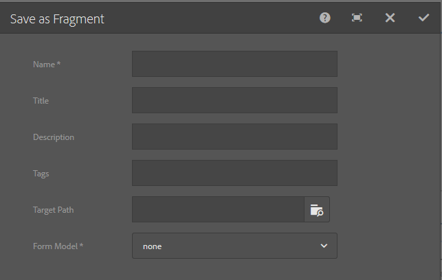

# Adaptive form fragments{#adaptive-form-fragments}

雖然每個表單都是專為特定用途而設計，但大部分表單中都有一些常見的區段，例如提供個人詳細資料，例如姓名和地址、家庭詳細資料、收入詳細資料等。 每次建立新表單時，表單開發人員都必須建立這些常見的區段。

最適化表單提供一種便利的機制，可建立表單區段（例如面板或欄位群組），只需一次，即可跨最適化表單重複使用。 這些可重複使用和獨立作業的區段稱為最適化表單片段。

## 建立片段 {#create-a-fragment}

您可以從頭開始建立最適化表單片段，或將現有最適化表單中的面板儲存為片段。

### 從頭開始建立片段 {#create-fragment-from-scratch}

1. 請登入AEM Forms作者例項，網址為https://[*hostname*]:[*port*]/aem/forms.html。
1. Click **Create > Adaptive Form Fragment**.
1. 指定片段的標題、名稱、說明和標籤。

   >[!NOTE]
   >
   >請確定您指定片段的唯一名稱。 如果已存在同名的另一個片段，則無法建立該片段。

1. 按一下以開啟「 **表單模型** 」(Form Model **)頁籤，然後從「從** 選擇」(Select From)下拉菜單中，為該片段選擇以下模型之一：

   * **無**:指定從頭開始建立片段，而不使用任何表單模型。
   * **表單範本**:指定使用上傳至AEM Forms的XDP範本建立片段。 選擇適當的XDP模板作為片段的表單模型。
   

   還顯示在所選表單模板中標籤為片段的子表單。 您可以從下拉式清單中選取最適化表單片段的子表單。

   

   此外，您還可以通過在下拉框中指定子表單的SOM表達式，使用未在表單模板中標籤為片段的子表單建立自適應表單片段。

   * **XML架構**:指定使用上傳至AEM Forms的XML架構來建立片段。 您可以上傳或從可用的XML結構描述中選擇，作為片段的表單模型。
   

   您也可以從下拉式方塊中選取出現在所選架構中的complexType，以建立最適化表單片段。

   

1. 按一 **下「建立** 」，然後按一下「 **開啟** 」，在編輯模式中以預設範本開啟片段。

在編輯模式中，您可以從AEM sidekick拖放任何最適化表單元件至片段。 如需最適化表單元件的詳細資訊，請參 [閱製作最適化表單簡介](../../forms/using/introduction-forms-authoring.md)。

此外，如果您選擇XML架構或XDP表單範本作為片段的表單模型，則內容搜尋器中會出現顯示表單模型階層的新標籤。 它可讓您將表單模型元素拖放至片段上。 新增的表單模型元素會轉換為表單元件，同時保留相關XDP或XSD的原始屬性。

### 將面板儲存為片段 {#save-panel-as-a-fragment}

1. 開啟包含您要儲存為最適化表單片段的面板的最適化表單。
1. 在面板工具列中，按一下「另 **[!UICONTROL 存為片段」]**。 「另存為片段」對話方塊隨即開啟。

   >[!NOTE]
   >
   >如果您儲存為片段的面板包含子面板，則產生的片段將包含子面板。

1. 在「片段建立」對話方塊中，指定下列資訊：

   * **名稱**:片段的名稱。 預設值是面板的元素名稱。 這是一個強制欄位。
      ***注意&#x200B;**:請確定您指定片段的唯一名稱。 如果已存在同名的另一個片段，則無法建立該片段。*

   * **標題**:片段的標題。 預設值是面板的標題。

   * **說明**:片段說明。

   * **標籤**:標籤片段的中繼資料。

   * **目標路徑**:保存片段的儲存庫路徑。 如果不指定路徑，則在包含自適應表單的節點旁邊建立與片段名稱相同的節點。 片段保存在此節點中。

   * **表單模型**:根據最適化表單的表單模型，此欄位會顯示 **XML架構**、 **表單範本**&#x200B;或 **無**。 這是不可編輯的欄位。

   * **片段模型根**:僅出現在XSD式最適化表單中。 它指定片段模型的根。 您可以從下 **拉式清單** 中選擇／或XSD複雜類型。 請注意，只有在選擇複雜類型作為片段模型根時，才能在另一個自適應形式中重用片段。
如果選擇 **/** 作為片段模型根，則根目錄中的完整XSD樹將顯示在自適應表單資料模型頁籤中。 對於複雜類型片段模型根，只有所選複雜類型的子體在自適應表單資料模型頁籤中可見。

   * **XSD參照**:僅出現在XSD式最適化表單中。 它顯示XML架構的位置。

   * **XDP參考**:僅出現在以XDP為基礎的調適性表單中。 它顯示XDP表單模板的位置。
   

   另存為片段對話框

1. 按一下 **確定**。

   面板將保存在儲存庫中指定或預設位置。 在最適化形式中，面板會由片段的快照所取代。 如下所示，「一般資訊」面板及其子面板（個人資訊和位址）會儲存為片段。

   若要編輯片段，請按一下面 **[!UICONTROL 板工具列中的]** 「編輯資產」。 片段會在新標籤或視窗中以編輯模式開啟。

   

## 使用片段 {#working-with-fragments}

### 設定片段外觀 {#configure-fragment-appearance}

您在最適化表單中插入的任何片段都會顯示為預留位置影像。 預留位置在片段中最多可顯示10個子面板的標題。 您可以設定AEM Forms以顯示完整片段，而非預留位置影像。

執行下列步驟，在表單中顯示完整片段：

1. 前往AEM網頁主控台設定頁面，網址為https:[*host*]:[*port*]/system/console/configMgr。

1. 搜索並按一下「 **[!UICONTROL 最適化表單配置服務」]** ，以在編輯模式下將其開啟。
1. 停用「 **[!UICONTROL 啟用預留位置取代片段]** 」核取方塊，以顯示完整片段，而非預留位置影像。

### 以最適化形式插入片段 {#insert-a-fragment-in-an-adaptive-form}

您建立的最適化表單片段會顯示在AEM內容搜尋器的「最適化表單片段」索引標籤中。 要在自適應表單中插入自適應表單片段：

1. 在編輯模式中開啟最適化表單，您要在其中插入最適化表單片段。
1. 按一 **下側** 欄中的  -browser。 在資產瀏覽器中，從下 **拉式清單中選取「最適化表單片段** 」。

   您也可以選擇根據表單模型（表單範本、XML架構或基本）顯示所有可調式表單片段或篩選器。

1. 將最適化表單片段拖放至最適化表單。

   >[!NOTE]
   >
   >在最適化表單中，不會啟用最適化表單片段進行編寫。 此外，您無法在以JSON為基礎的最適化表單中使用XSD片段，而且方式相反。

自適應表單片段通過參考插入自適應表單中並與獨立自適應表單片段同步。 這表示當您更新最適化表單片段時，變更會反映在使用片段的所有最適化表單中。

### 以最適化形式嵌入片段 {#embed-a-fragment-in-adaptive-form}

您可以按一下「內嵌資產」，選擇將最適化表單片段內嵌在最適化表 **單中：&lt;*fragmentName*>** （新增片段的面板工具列）按鈕，如下列範例影像所示。

>[!NOTE]
>
>內嵌片段不再與獨立片段連結。 您可以從最適化表單中編輯內嵌片段中的元件。

### 在片段中使用片段 {#using-fragments-within-fragments}

您可以建立巢狀的最適化表單片段，這表示您可以將片段拖放至另一個片段，並可以有巢狀的片段結構。

### 變更片段 {#change-fragments}

您可以使用最適化表單片段面板的編輯元件對話方塊中的 **Select Fragment** asset屬性，將最適化表單片段取代或變更為另一個片段。

## 資料系結的片段自動對應 {#auto-mapping-of-fragments-for-data-binding}

當您使用XFA表單範本或XSD複雜類型建立最適化表單片段並將片段拖放至最適化表單時，XFA片段或XSD複雜類型會自動由對應的最適化表單片段取代，其片段模型根會映射至XFA片段或XSD複雜類型。

您可以從「編輯」元件對話方塊中變更片段資產及其系結。

>[!NOTE]
>
>您也可以從AEM內容搜尋器中的「最適化表單片段」庫拖放系結的最適化表單片段，並從最適化表單片段面板的「編輯」元件對話方塊中提供正確的系結參考。

## 管理片段 {#manage-fragments}

您可以使用AEM Forms UI，對最適化表單片段執行數個作業。

1. 前往 `https://[hostname]:[port]/aem/forms.html`.

1. 按一 **下** 「AEM Forms UI」工具列中的「選取」，然後選取最適化的表單片段。 工具列顯示您可以對所選自適應表單片段執行的下列操作。

<table>
 <tbody>
  <tr>
   <td>
<strong>操作</strong>
 </td>
   <td>
<strong>說明</strong>
 </td>
  </tr>
  <tr>
   <td>
開啟
 </td>
   <td>
  在編輯模式下開啟選定的自適應表單片段。   
 </td>
  </tr>
  <tr>
   <td>
檢視屬性
 </td>
   <td>
開啟「屬性」面板。 從「屬性」面板，您可以檢視和編輯屬性、產生預覽，以及上傳所選片段的縮圖影像。 <a href="../../forms/using/manage-form-metadata.md" target="_blank"> 如需詳細資訊，請參 </a>閱管理中繼資料 。   
 </td>
  </tr>
  <tr>
   <td>
複製
 </td>
   <td>
複製所選片段。   「貼上」按鈕會出現在工具列中。   
 </td>
  </tr>
  <tr>
   <td>
下載
 </td>
   <td>
  下載所選片段。   
 </td>
  </tr>
  <tr>
   <td>
預覽
 </td>
   <td>
提供選項，可將XML檔案中的資料與片段合併，以HTML或自訂預覽形式預覽片段。 <a href="/help/forms/using/previewing-forms.md" target="_blank"> 如需詳細資訊，請參 </a>閱預覽表格 。   
 </td>
  </tr>
  <tr>
   <td>
開始審閱／管理審閱
 </td>
   <td>
允許啟動和管理選定片段的審核。 <a href="../../forms/using/create-reviews-forms.md" target="_blank"> 如需詳細資訊，請參 </a>閱建立和管理審核 。   
 </td>
  </tr>
  <tr>
   <td>
建立字典
 </td>
   <td>
生成用於定位所選片段的字典。 <a href="/help/forms/using/lazy-loading-adaptive-forms.md" target="_blank"> 如需詳細資訊，請參閱本 </a>地化最適化表單 。   
 </td>
  </tr>
  <tr>
   <td>
發佈／取消發佈
 </td>
   <td>
  發佈／取消發佈所選片段。   
 </td>
  </tr>
  <tr>
   <td>
刪除
 </td>
   <td>
  刪除選定的片段。   
 </td>
  </tr>
 </tbody>
</table>

## 本地化包含片段的自適應表單 {#localizing-adaptive-form-containing-fragments}

若要本地化包含最適化表單片段的最適化表單，您需要將片段和表單分別本地化。 其理念是將片段本地化一次，然後以多種調適性表單重複使用。

>[!NOTE]
>
>片段中的本地化索引鍵不會出現在最適化表單的XLIFF檔案中。

## 使用片段時需記住的要點 {#key-points-to-remember-when-working-with-fragments}

* 請確定片段名稱是唯一的。 如果存在同名的現有片段，則無法建立該片段。
* 在以XDP為基礎的最適化表單中，如果您將面板儲存為包含其他XDP片段的片段，則產生的片段會自動系結至子XDP片段。 如果是XSD自適應表單，則產生的片段將系結至架構根目錄。
* 當您建立最適化表單片段時，會在CRXDe Lite中建立片段節點，這類似於最適化表單的guideContainer節點。
* 不支援使用不同表單資料模型的自適應表單中的片段。 例如，基於XSD的最適化表單不支援XDP的片段，反之亦然。
* 可透過AEM內容搜尋器中的「最適化表單片段」索引標籤使用最適化表單片段。
* 獨立可調式表單片段中的任何運算式、指令碼或樣式，在參考插入或嵌入可調式表單時都會保留。
* 不能從自適應表單中編輯由引用插入的自適應表單片段。 若要編輯，您可以編輯可獨立執行的最適化表單片段，或將片段內嵌在最適化表單中。
* 發佈最適化表單時，您需要發佈參照在最適化表單中插入的獨立最適化表單片段。
* 當您重新發佈更新的最適化表單片段時，變更會反映在使用片段的最適化表單的已發佈例項中。
* 包含「驗證」元件的最適化表單不支援匿名使用者。 此外，不建議在最適化表單片段中使用Verify元件。
* (僅&#x200B;**限Mac**)為確保表單片段功能在所有案例中都能正常運作，請將下列項目新增至/private/etc/hosts檔案：
   `127.0.0.1 <Host machine>` 主 **機**:部署AEM Forms的Apple mac電腦。

## 參考片段 {#reference-fragments}

您可使用可用來建立表單的參考最適化表單片段。 如需詳細資訊，請參 [閱參考片段](../../forms/using/reference-adaptive-form-fragments.md)。
