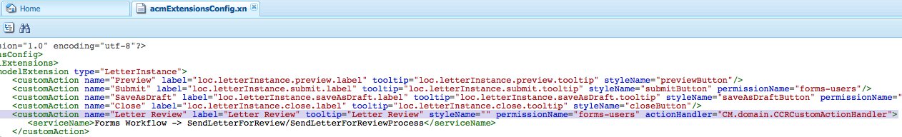

# 在建立對應UI中新增自訂動作／按鈕 {#add-custom-action-button-in-create-correspondence-ui}

## 概覽 {#overview}

Correponse Management解決方案允許您將自定義操作添加到「建立對應」用戶介面。

本檔案中的案例說明如何在「建立對應使用者介面」中建立按鈕，將信件共用為附加在電子郵件中的審核PDF。

### 必備條件 {#prerequisites}

要完成此方案，您需要：

* CRX和JavaScript的相關知識
* LiveCycle Server

## 方案：在「建立對應使用者介面」中建立按鈕，以傳送信函以供審核 {#scenario-create-the-button-in-the-create-correspondence-user-interface-to-send-a-letter-for-review}

在「建立對應使用者介面」中新增含動作的按鈕（此處傳送信函以供審核），包括：

1. 將按鈕添加到建立對應用戶介面
1. 新增動作處理至按鈕
1. 新增LiveCycle程式以啟用動作處理

### 將按鈕新增至「建立對應」使用者介面 {#add-the-button-to-the-create-correspondence-user-interface}

1. 前往並 `https://[server]:[port]/[ContextPath]/crx/de` 以管理員身分登入。
1. 在應用程式檔案夾中，建立名為路徑／結 `defaultApp` 構的檔案夾，類似於defaultApp檔案夾（位於config檔案夾中）。 使用下列步驟建立資料夾：

   1. 以滑鼠右鍵按一 **下下列路徑上的** defaultApp資料夾，然後選取「 **覆蓋節點」**:

      /libs/fd/cm/config/defaultApp/

      

   1. 請確定「覆蓋節點」對話框具有下列值：

      **** 路徑：/libs/fd/cm/config/defaultApp/

      **** 覆蓋位置：/apps/

      **** 匹配節點類型：已勾選

      

   1. 按一下 **確定**。
   1. 按一下「 **全部儲存**」。

1. 複製acmExtensionsConfig.xml檔案（存在於/libs分支下），位於/apps分支下。

   1. 前往「/libs/fd/cm/config/defaultApp/acmExtensionsConfig.xml」

   1. 在acmExtensionsConfig.xml檔案上按一下滑鼠右鍵，然後選取「復 **制」**。

      

   1. 以滑鼠右鍵按一 **下「/apps/fd/cm/config/defaultApp/** 」的預設App資料夾，並選取「貼上」 ****。
   1. 按一下「 **全部儲存**」。

1. 連按兩下您新在apps資料夾中建立的acmExtentionsConfig.xml副本。 檔案隨即開啟以供編輯。
1. 找到下列程式碼：

   ```xml
   <?xml version="1.0" encoding="utf-8"?>
   <extensionsConfig>
       <modelExtensions>
           <modelExtension type="LetterInstance">
     <customAction name="Preview" label="loc.letterInstance.preview.label" tooltip="loc.letterInstance.preview.tooltip" styleName="previewButton"/>
               <customAction name="Submit" label="loc.letterInstance.submit.label" tooltip="loc.letterInstance.submit.tooltip" styleName="submitButton" permissionName="forms-users"/>
               <customAction name="SaveAsDraft" label="loc.letterInstance.saveAsDraft.label" tooltip="loc.letterInstance.saveAsDraft.tooltip" styleName="submitButton" permissionName="forms-users"/>
               <customAction name="Close" label="loc.letterInstance.close.label" tooltip="loc.letterInstance.close.tooltip" styleName="closeButton"/>
           </modelExtension>
       </modelExtensions>
   </extensionsConfig>
   ```

1. 若要以電子郵件寄送信函，您可以使用LiveCycle Forms Workflow。 在acmExtensionsConfig.xml的modelExtension標籤下方新增customAction標籤，如下所示：

   ```xml
    <customAction name="Letter Review" label="Letter Review" tooltip="Letter Review" styleName="" permissionName="forms-users" actionHandler="CM.domain.CCRCustomActionHandler">
         <serviceName>Forms Workflow -> SendLetterForReview/SendLetterForReviewProcess</serviceName>
       </customAction>
   ```

   

   modelExtension標籤包含一組customAction子標籤，可設定動作按鈕的動作、權限和外觀。 以下是customAction組態標籤的清單：

   | **名稱** | **說明** |
   |---|---|
   | 名稱 | 要執行動作的字母數字名稱。 此標籤的值為必要值，必須是唯一的（在modelExtension標籤內），且必須以字母表開頭。 |
   | 標籤 | 動作按鈕上要顯示的標籤 |
   | 工具提示 | 按鈕的工具提示文字，當使用者暫留在按鈕上時會顯示。 |
   | styleName | 套用在動作按鈕上的自訂樣式名稱。 |
   | permissionName | 僅當用戶具有permissionName指定的權限時，才顯示相應的操作。 當您將permissionName指定 `forms-users`為時，所有使用者都可存取此選項。 |
   | actionHandler | 當使用者按一下按鈕時呼叫的ActionHandler類別完全限定名稱。 |

   除了上述參數外，還有其他與customAction相關的設定。 這些額外的組態可透過CustomAction物件提供給處理常式。

   | **名稱** | **說明** |
   |---|---|
   | serviceName | 如果customAction包含名為serviceName的子標籤，則在按一下相關按鈕／連結時，將調用由serviceName標籤表示的名稱的進程。 請確定此程式與Letter PostProcess具有相同的簽名。 在服務名中添加&quot;Forms Workflow ->&quot;前置詞。 |
   | 標籤名稱中包含cm_前置詞的參數 | 如果customAction包含以名稱cm_開頭的子標籤，則在後置處理中（無論是信件後置處理，還是由serviceName標籤表示的特殊處理），這些參數可在輸入XML代碼中，在移除cm_前置詞的相關標籤下使用。 |
   | actionName | 每當貼文程式因點按而發生時，提交的XML會包含一個特殊標籤，其名稱位於標籤下，且標籤的名稱為使用者動作名稱。 |

1. 按一下「 **全部儲存**」。

#### 在/apps分支中使用屬性檔案建立地區設定檔案夾 {#create-a-locale-folder-with-properties-file-in-the-apps-branch}

ACMExtensionsMessages.properties檔案包含「建立對應」使用者介面中各欄位的標籤和工具提示訊息。 若要使自訂動作／按鈕正常運作，請在/apps分支中複製此檔案。

1. 在下列路徑上 **右鍵按一下** 「地區設定」檔案夾，然後選取「 **覆蓋節點」**:

   /libs/fd/cm/config/defaultApp/locale

1. 請確定「覆蓋節點」對話框具有下列值：

   **** 路徑：/libs/fd/cm/config/defaultApp/locale

   **** 覆蓋位置：/apps/

   **** 匹配節點類型：已勾選

1. 按一下 **確定**。
1. 按一下「 **全部儲存**」。
1. 按一下右鍵以下檔案並選擇「復 **制」**:

   `/libs/fd/cm/config/defaultApp/locale/ACMExtensionsMessages.properties`

1. 按一下右鍵以下路 **徑的** locale資料夾，然後選擇 **貼上**:

   `/apps/fd/cm/config/defaultApp/locale/`

   ACMExtensionsMessages.properties檔案被複製到地區設定資料夾中。

1. 要本地化新添加的自定義操作／按鈕的標籤，請為中的相關地區設定建立ACMExtensionsMessages.properties檔案 `/apps/fd/cm/config/defaultApp/locale/`。

   例如，若要本地化本文中建立的自訂動作／按鈕，請建立名為ACMExtensionsMessages_fr.properties的檔案，並包含以下項目：

   `loc.letterInstance.letterreview.label=Revue De Lettre`

   同樣地，您也可以在此檔案中新增更多屬性，例如工具提示和樣式。

1. 按一下「 **全部儲存**」。

#### 重新啟動Adobe Asset Composer建置區塊套裝 {#restart-the-adobe-asset-composer-building-block-bundle}

進行每個伺服器端變更後，請重新啟動Adobe Asset Composer Building Block套件。 在此案例中，伺服器端的acmExtensionsConfig.xml和ACMExtensionsMessages.properties檔案會加以編輯，因此Adobe Asset Composer建置區塊套裝需要重新啟動。

>[!NOTE]
>
>您可能需要清除瀏覽器快取。

1. 前往 `https://[host]:[port]/system/console/bundles`. 如有必要，請以管理員身份登錄。

1. 找到Adobe Asset Composer建置區塊套件。 重新啟動套件：按一下「停止」，然後按一下「開始」。

   

重新啟動Adobe Asset Composer建置區塊套裝後，自訂按鈕會出現在「建立對應使用者介面」中。 您可以在「建立對應使用者介面」中開啟一個字母，以預覽自訂按鈕。

### 新增動作處理至按鈕 {#add-action-handling-to-the-button}

依預設，「建立對應」使用者介面會在cm.domain.js檔案中的下列位置實作ActionHandler:

/libs/fd/cm/ccr/gui/components/admin/clientlibs/ccr/js/cm.domain.js

對於自訂動作處理，請在CRX的/apps分支中建立cm.domain.js檔案的覆蓋。

按一下動作／按鈕時處理動作／按鈕的邏輯包括：

* 將新加入的動作設為可見／不可見：完成方式：覆寫actionVisible()函式。
* 啟用／禁用新添加的操作：完成方式：覆寫actionEnabled()函式。
* 當使用者按一下按鈕時的實際動作處理：可覆寫handleAction()函式的實作。

1. 前往 `https://[server]:[port]/[ContextPath]/crx/de`. 如有必要，請以管理員身份登錄。

1. 在應用程式檔案夾中，建立名 `js` 為CRX /apps分支中的檔案夾，其結構類似於下列檔案夾：

   `/libs/fd/cm/ccr/gui/components/admin/clientlibs/ccrui/js`

   使用下列步驟建立資料夾：

   1. 以滑鼠右鍵按一 **下下列路徑** ，然後選取「覆 **蓋節點」**:

      `/libs/fd/cm/ccr/gui/components/admin/clientlibs/ccrui/js`

   1. 請確定「覆蓋節點」對話框具有下列值：

      **** 路徑：/libs/fd/cm/ccr/gui/components/admin/clientlibs/ccrui/js

      **** 覆蓋位置：/apps/

      **** 匹配節點類型：已勾選

   1. 按一下 **確定**。
   1. 按一下「 **全部儲存**」。

1. 在js資料夾中，使用下列步驟建立名為ccrcustomization.js的檔案，其中包含按鈕動作處理的程式碼：

   1. 在下列路徑上 **右鍵按一下** 「js」檔案夾，然後選 **取「建立>建立檔案」**:

      `/apps/fd/cm/ccr/gui/components/admin/clientlibs/ccrui/js`

      將檔案命名為ccrcustomization.js。

   1. 連按兩下ccrcustomization.js檔案，以在CRX中開啟它。
   1. 在檔案中，貼上下列程式碼，然後按一下「全 **部儲存**:

      ```
      /* for adding and handling custom actions in Extensible Toolbar.
        * One instance of handler will be created for each action.
        * CM.domain.CCRCustomActionHandler is actionHandler class.
        */
      var CCRCustomActionHandler;
          CCRCustomActionHandler = CM.domain.CCRCustomActionHandler = new Class({
              className: 'CCRCustomActionHandler',
              extend: CCRDefaultActionHandler,
              construct : function(action,model){
              }
          });
          /**
           * Called when user user click an action
           * @param extraParams additional arguments that may be passed to handler (For future use)
           */
          CCRCustomActionHandler.prototype.handleAction = function(extraParams){
              if (this.action.name == CCRCustomActionHandler.SEND_FOR_REVIEW) {
                  var sendForReview = function(){
                      var serviceName = this.action.actionConfig["serviceName"];
                      var inputParams = {};
                      inputParams["dataXML"] = this.model.iccData.data;
                      inputParams["letterId"] = this.letterVO.id;
                      inputParams["letterName"] = this.letterVO.name;
                      inputParams["mailId"] = $('#email').val();
                      /*function to invoke the LivecyleService */
                      ServiceDelegate.callJSONService(this,"lc.icc.renderlib.serviceInvoker.json","invokeProcess",[serviceName,inputParams],this.onProcessInvokeComplete,this.onProcessInvokeFail);
                      $('#ccraction').modal("hide");
                  }
                  if($('#ccraction').length == 0){
                      /*For first click adding popup & setting letterName.*/
                      $("body").append(popUp);
                      $("input[id*='letterName']").val(this.letterVO.name);
                      $(document).on('click',"#submitLetter",$.proxy( sendForReview, this ));
                  }
                  $('#ccraction').modal("show");
              }
          };
          /**
           * Should the action be enabled in toolbar
           * @param extraParams additional arguements that may be passed to handler (For future use)
           * @return flag indicating whether the action should be enabled
           */
         CCRCustomActionHandler.prototype.actionEnabled = function(extraParams){
                  /*can be customized as per user requirement*/
                  return true;
          };
          /**
           * Should the action be visible in toolbar
           * @param extraParams additional arguments that may be passed to handler (For future use)
           * @return flag indicating whether the action should be enabled
           */
          CCRCustomActionHandler.prototype.actionVisible = function(extraParams){
              /*Check can be enabled for Non-Preview Mode.*/
              return true;
          };
          /*SuccessHandler*/
          CCRCustomActionHandler.prototype.onProcessInvokeComplete = function(response) {
              ErrorHandler.showSuccess("Letter Sent for Review");
          };
          /*FaultHandler*/
          CCRCustomActionHandler.prototype.onProcessInvokeFail = function(event) {
              ErrorHandler.showError(event.message);
          };
          CCRCustomActionHandler.SEND_FOR_REVIEW  = "Letter Review";
      /*For PopUp*/
          var popUp = '<div class="modal fade" id="ccraction" tabindex="-1" role="dialog" aria-hidden="true">'+
          '<div class="modal-dialog modal-sm">'+
              '<div class="modal-content">' +
                  '<div class="modal-header">'+
                      '<button type="button" class="close" data-dismiss="modal" aria-label="Close"><span aria-hidden="true">&times;</code></button>'+
                      '<h4 class="modal-title"> Send Review </h4>'+
                  '</div>'+
                  '<div class="modal-body">'+
                      '<form>'+
                          '<div class="form-group">'+
                              '<label class="control-label">Email Id</label>'+
                              '<input type="text" class="form-control" id="email">'+
                          '</div>'+
                          '<div class="form-group">'+
                              '<label  class="control-label">Letter Name</label>'+
                              '<input id="letterName" type="text" class="form-control" readonly>'+
                          '</div>'+
                          '<div class="form-group">'+
                              '<input id="letterData" type="text" class="form-control hide" readonly>'+
                          '</div>'+
                      '</form>'+
                  '</div>'+
                  '<div class="modal-footer">'+
                     '<button type="button" class="btn btn-default" data-dismiss="modal"> Cancel </button>'+
                     '<button type="button" class="btn btn-primary" id="submitLetter"> Submit </button>'+
                  '</div>'+
              '</div>'+
          '</div>'+
      '</div>';
      ```

### 新增LiveCycle程式以啟用動作處 <span class="acrolinxCursorMarker"></code>理 {#add-the-livecycle-process-to-enable-action-span-class-acrolinxcursormarker-span-handling}

在此案例中，請啟用下列元件，這些元件是附加元件。zip檔案的一部分：

* DSC元件jar(DSCSample.jar)
* 傳送信函以進行審閱流程LCA(SendLetterForReview.lca)

下載並解壓縮components.zip檔案，以取得DSCSample.jar和SendLetterForReview.lca檔案。 請依照下列程式指定使用這些檔案。
components.zip

#### 設定LiveCycle Server以執行LCA程式 {#configure-the-livecycle-server-to-run-the-lca-process}

>[!NOTE]
>
>只有在您處於OSGI設定中，且要實施的定製類型需要LC整合時，才需要此步驟。

LCA程式會在LiveCycle伺服器上執行，並需要伺服器位址和登入憑證。

1. 前往並 `https://[server]:[port]/system/console/configMgr` 以管理員身分登入。
1. 找到「Adobe liveCycle Client SDK Configuration」（Adobe LiveCycle用戶端SDK設定），然後按一 **下「Edit** 」（編輯圖示）。 「配置」(Configurations)面板隨即開啟。

1. 輸入以下詳細資訊，然後按一下「 **保存**」:

   * **伺服器Url**:動作處理常式程式碼所使用之Send For Review服務之LC伺服器的URL。
   * **使用者名稱**:LC伺服器的管理員用戶名
   * **密碼**:管理員使用者名稱的密碼
   

#### 安裝LiveCycle Archive(LCA) {#install-livecycle-archive-lca}

啟用電子郵件服務程式的必要LiveCycle程式。

>[!NOTE]
>
>若要檢視此程式的功能或建立您自己的類似程式，您需要Workbench。

1. 以管理員身分登入Livecycle Server adminui，網址為 `https:/[lc server]/:[lc port]/adminui`。

1. 導覽至「 **首頁>服務>應用程式與服務>應用程式管理」**。

1. 如果SendLetterForReview應用程式已存在，請略過此程式中的其餘步驟，否則繼續下一步驟。

   

1. 按一 **下匯入**。

1. 按一 **下「選擇檔案** 」，然後選取「SendLetterForReview.lca」。

   

1. 按一下「 **預覽**」。

1. 選取「 **匯入完成時將資產部署至執行階段」**。

1. 按一 **下匯入**。

#### 將ServiceName添加到WhiteListed服務清單 {#adding-servicename-to-the-whitelisted-service-list}

在AEM伺服器中提及您要存取AEM伺服器的LiveCycle服務。

1. 以管理員身份登錄 `https:/[host]/:[port]/system/console/configMgr`。

1. 找到並按一 **下「Adobe liveCycle Client SDK Configuration」**。 出現「Adobe LiveCycle Client SDK Configuration」（Adobe LiveCycle用戶端SDK設定）面板。
1. 在「服務名」清單中，按一下+表徵圖並添加serviceName **SendLetterForReview/SendLetterForReviewProcess**。

1. 按一下&#x200B;**「儲存」**。

#### 設定電子郵件服務 {#configure-the-email-service}

在此案例中，若要讓「通信管理」能夠傳送電子郵件，請在LiveCycle伺服器中設定電子郵件服務。

1. 使用管理員認證登入Livecycle Server adminui，網址為 `https:/[lc server]:[lc port]/adminui`。

1. 導覽至「 **首頁>服務>應用程式與服務>服務管理」**。

1. 找到並按一下「 **EmailService**」。

1. 在 **SMTP主機中**，配置電子郵件服務。

1. 按一下&#x200B;**「儲存」**。

#### 配置DSC服務 {#configure-the-dsc-service}

若要使用Correponsement Management API，請下載DSCSample.jar（在本檔案中附加為components.zip的一部分）並將它上傳至LiveCycle伺服器。 將DSCSample.jar檔案上傳至LiveCycle伺服器後，AEM伺服器會使用DSCSample.jar檔案來存取renderLetter API。

如需詳細資訊，請 [參閱「連接AEM Forms與Adobe LiveCycle](/help/forms/using/aem-livecycle-connector.md)」。

1. 更新DSCSample.jar中cmsa.properties中的AEM伺服器URL，此位置如下：

   DSCSample.jar\com\adobe\livecycle\cmsa.properties

1. 在配置檔案中提供以下參數：

   * **crx.serverUrl**=https:/[host]/:port[/contextpath]/[context URL][AEM URL]
   * **crx.username**= AEM使用者名稱
   * **crx.password**= AEM密碼
   * **crx.appRoot**=/content/apps/cm
   >[!NOTE]
   >
   >每次您在伺服器端進行任何變更時，請重新啟動LiveCycle Server。 如需建立您自己LiveCycle元件的詳細資訊，請參 [閱透過自訂DSC開發擴充LiveCycle ES軟體](https://www.adobe.com/devnet/livecycle/articles/dsc_development.html)。

   DSCSample.jar檔案使用renderLetter API。 如需renderLetter API的詳細資訊，請參 [閱Interface LetterRenderService](https://helpx.adobe.com/aem-forms/6-2/javadocs/com/adobe/icc/ddg/api/LetterRenderService.html)。

#### 將DSC匯入LiveCyle {#import-dsc-to-livecyle}

DSCSample.jar檔案使用renderLetter API，從C作為輸入提供的XML資料，將letter轉譯為PDF位元組。 如需renderLetter和其他API的詳細資訊，請參 [閱Letter Render Service](https://helpx.adobe.com/aem-forms/6-2/javadocs/com/adobe/icc/ddg/api/LetterRenderService.html)。

1. 啟動Workbench並登入。
1. 選擇「 **窗口」>「顯示視圖」>「元件」**。 「元件」檢視會新增至Workbench ES2。

1. 按一下右鍵「 **元件** 」並選擇「 **安裝元件」**。

1. 通過文 **件瀏覽器選擇DSCSample.jar** 檔案，然後按一下「 **開啟」**。
1. 按一下右鍵 **RenderWrapper** ，然後選擇 **啟動元件**。 如果元件啟動，則元件名稱旁會出現綠色箭頭。

## 傳送信函以供審核 {#send-letter-for-review}

在您設定傳送信函以供審核的動作和按鈕後：

1. 清除瀏覽器快取。

1. 在「建立對應」UI中，按一下「 **信函檢閱** 」並指定審核者的電子郵件ID。

1. 按一 **下提交**。


審閱者從系統收到一封電子郵件，信件作為PDF附件。
