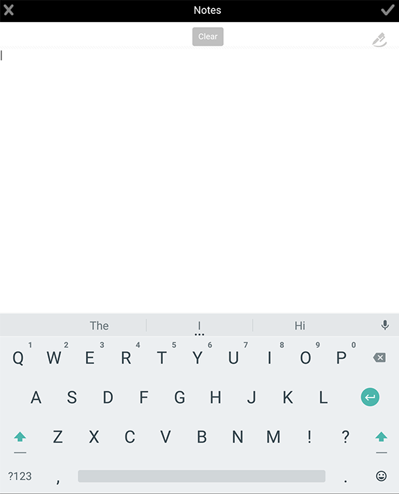

# 添加附件{#adding-attachments}

## 在與AEM Forms Workflow server（JEE上的AEM Forms）同步的表單中新增附件{#adding-annotations}

AEM Forms應用程式可讓您將影像、草圖筆記和文字註解附加至與AEM Forms JEE伺服器同步的表格。 如果您的表單是從AEM Forms Workflow伺服器載入，您的附件會新增至表單。 您可以點選附件按鈕，一起查看表單中的所有附件。 紅色通知指定表單中的附件數。 如果表單中沒有附件，您將看不到紅色通知按鈕。 如果表單中沒有附件，當您點選「附件」按鈕時，您可以選擇附加像片或塗鴉。

您的選項包括：

* **圖庫**:可讓您從裝置上儲存的圖片中新增圖片。

* **相機**:可讓您拍照並加入表單。

* **注意**:可讓您新增塗鴉或文字附註。使用新增塗鴉，使用新增文字附註。

>[!NOTE]
>
>其他AEM Forms應用程式使用者可看到由某位使用者新增的附件。 其他用戶無法刪除用戶添加的附件。

### 「附件」螢幕{#the-attachments-screen}

要查看某個位置中的所有附件，請點選。 您可以在此處添加、更名和刪除附件。

您可以使用「附件」畫面中的&#x200B;**+**&#x200B;按鈕附加另一張圖片、塗鴉或文字。

### 添加照片{#adding-a-photograph}

您可以使用行動裝置的相機或儲存在裝置中的像片來附加表單中的像片。

1. 點選視窗底部的附件按鈕。
1. 在出現的快顯視窗中，點選「**圖庫**&#x200B;或&#x200B;**Camera**」。
1. 根據您選取的選項，執行下列動作：

   1. 如果您選擇&#x200B;**Camera**。

      拍照。 然後點選「**Use** 」按鈕。

      或點選「重拍&#x200B;****」按鈕以重拍像片。

   1. 如果選擇&#x200B;**Gallery**。

      裝置的影像瀏覽器隨即彈出。 在裝置的圖片瀏覽器中，點選您要附加的圖片。

### 添加附註{#adding-a-note}

**Notes**&#x200B;選項可讓您在表單中新增手繪筆畫和文字附件。

1. 點選視窗底部的附件按鈕。
1. 在出現的快顯視窗中點選&#x200B;**Notes**。
1. 在啟動的Notes使用者介面中，擷取手繪文字。

   

   塗鴉

   您可以在塗鴉介面中使用下列選項：

   * **清除**:清除螢幕。
   * **「完成」按鈕**:附加當前塗鴉。
   * **取消按鈕**:放棄當前塗鴉並退出塗鴉用戶介面。
   * :清除塗鴉，並讓您新增文字附註。

   

## 與AEM Forms伺服器同步的表單附件，不含AEM Forms Workflow（OSGi上的AEM Forms）{#attachments-in-forms-synced-with-the-aem-forms-servers-without-aem-forms-workflow-aem-forms-on-osgi}

與AEM Forms OSGi伺服器同步的行動表單附件的運作方式與AEM Forms JEE伺服器類似。

從AEM Forms OSGi伺服器載入應用程式中的最適化表單，不支援表單層級附件。 若要附加影像或文字附註，請在您製作表單時啟用欄位層級附件。 從欄位上的元件瀏覽器拖放檔案附件元件。

在最適化表單中，您可以在記錄檔案(DoR)中檢視附加的檔案。 請參閱[為非XFA自適應表單產生記錄檔案](../../forms/using/generate-document-of-record-for-non-xfa-based-adaptive-forms.md)。
