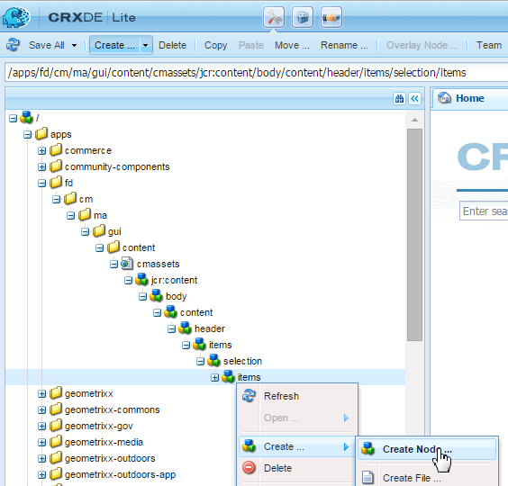
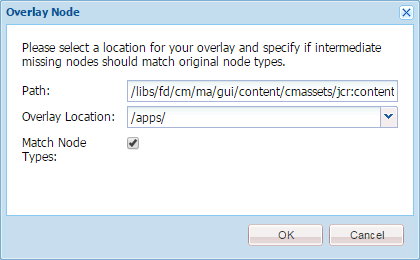

# 新增自訂動作至「資產清單」檢視{#add-custom-action-to-the-asset-listing-view}

## 概覽 {#overview}

Correponse Management解決方案可讓您將自訂動作新增至「管理資產」使用者介面。

您可以為下列項目將自訂動作新增至「資產清單」檢視：

* 一或多個資產類型或字母
* 在選取單一、多個資產／字母或未選取時執行（動作／命令變為作用中）

此自訂功能以新增「下載平面PDF」命令至字母資產清單檢視的藍本來展示。 此自訂案例可讓您的使用者下載單一選定字母的平面PDF。

### 必備條件 {#prerequisites}

若要完成下列或類似的藍本，您必須具備以下知識：

* CRX
* JavaScript
* Java

## 方案：將命令新增至字母清單使用者介面，以下載字母的平面PDF版本 {#addcommandtoletters}

以下步驟將「下載平面PDF」命令新增至字母的資產清單檢視，讓您的使用者下載所選字母的平面PDF。 使用這些步驟搭配適當的程式碼和參數，您可以為不同的資產新增一些其他功能，例如資料字典或文字。

若要自訂「通信管理」，讓您的使用者下載簡單的PDF字母，請完成下列步驟：

1. 前往並 `https://[server]:[port]/[ContextPath]/crx/de` 以管理員身分登入。

1. 在應用程式檔案夾中，使用下列步驟建立名為項目的檔案夾，其路徑／結構類似於位於選擇檔案夾中的項目檔案夾：

   1. 以滑鼠右鍵按一 **下下列路徑** ，然後選取「覆蓋 **節點」**:

      `/libs/fd/cm/ma/gui/content/cmassets/jcr:content/body/content/header/items/selection/items`

      >[!NOTE]
      >
      >此路徑是建立可搭配選取多個資產／字母之一運作的動作的特定路徑。 如果您想要建立不需選取即可運作的動作，則需要為下列路徑建立覆蓋節點，並依此完成其餘步驟：
      >
      >
      >`/libs/fd/cm/ma/gui/content/cmassets/jcr:content/body/content/header/items/default/items`

      

   1. 請確定「覆蓋節點」對話框具有下列值：

      **** 路徑：/libs/fd/cm/ma/gui/content/cmassets/jcr:content/body/content/header/items/selection/items

      **** 位置：/apps/

      **** 匹配節點類型：已選取

      

   1. 按一下 **確定**。 資料夾結構會建立在應用程式資料夾中。

      按一下「 **全部儲存**」。

1. 在新建立的項目資料夾下，為特定資產中的自訂按鈕／動作新增節點(範例：downloadFlatPDF)，使用下列步驟：

   1. 按一下右鍵項目文 **件夾** ，然後選擇「 **建立** 」 **>「**&#x200B;建立節點」。

   1. 確保「建立節點」對話框具有以下值，然後按一下「確 **定」**:

      **** 名稱：downloadFlatPDF（或您要提供給此屬性的名稱）

      **** 類型：nt：非結構化

   1. 按一下您建立的新節點（此處為downloadFlatPDF）。 CRX顯示節點的屬性。

   1. 將下列屬性新增至節點（這裡downloadFlatPDF），然後按一下「全 **部儲存**:

      <table>
        <tbody>
        <tr>
        <td><strong>名稱</strong></td>
        <td><strong>類型</strong></td>
        <td><strong>值和說明</strong></td>
        </tr>
        <tr>
        <td>類別</td>
        <td>字串</td>
        <td>foundation-collection-action</td>
        </tr>
        <tr>
        <td>foundation-collection-action</td>
        <td>字串</td>
        <td><p>{"target":"。cq-manageasset-admin-childpages", "activeSelectionCount":"single","type":"LETTER"}<br /><br /> ActiveSelectionCount <br /><strong></strong> 可以是單個或多個，以允許選擇執行自定義操作的單個或多個資產。</p> <p><strong>類型</strong> 可以是下列項目的一或多個（逗號分隔多個項目）:字母、文字、清單、條件、資料字典</p> </td>
        </tr>
        <tr>
        <td>圖示</td>
        <td>字串</td>
        <td>icon-download<br /><br /> 「Correponsement Management」（對應管理）顯示在命令／選單左側的圖示。 如需可用的不同圖示和設定，請參閱 <a href="https://docs.adobe.com/docs/en/aem/6-3/develop/ref/coral-ui/coralui3/Coral.Icon.html" target="_blank">CoralUI圖示檔案</a>。<br /> </td>
        </tr>
        <tr>
        <td>jcr:primaryType</td>
        <td>名稱</td>
        <td>nt:unstructured</td>
        </tr>
        <tr>
        <td>rel</td>
        <td>字串</td>
        <td>download-flat-pdf-button</td>
        </tr>
        <tr>
        <td>sling:resourceType</td>
        <td>字串</td>
        <td>granite/ui/components/endor/actionbar/button</td>
        </tr>
        <tr>
        <td>文字</td>
        <td>字串</td>
        <td>下載平面PDF（或任何其他標籤）<br /><br /> 「資產清單」介面中顯示的命令</td>
        </tr>
        <tr>
        <td>標題</td>
        <td>字串</td>
        <td>下載所選字母的平面PDF（或任何其他標籤/Alt文本）<br /> 。 <br /> The title is alt text when the user hover the custom command.</td>
        </tr>
        </tbody>
       </table>

1. 在應用程式檔案夾中，使用下列步驟建立名為js的檔案夾，其路徑／結構類似於管理資料夾中的items檔案夾：

   1. 以滑鼠右鍵按一 **下下列路徑** ，然後選取「覆 **蓋節點」**:

      `/libs/fd/cm/ma/gui/components/admin/clientlibs/admin/js`

   1. 請確定「覆蓋節點」對話框具有下列值：

      **** 路徑：/libs/fd/cm/ma/gui/components/admin/clientlibs/admin/js

      **** 位置：/apps/

      **** 匹配節點類型：已選取

   1. 按一下 **確定**。 資料夾結構會建立在應用程式資料夾中。 按一下「 **全部儲存**」。

1. 在js資料夾中，使用下列步驟建立名為formaction.js的檔案，其中包含按鈕動作處理的程式碼：

   1. 在下列路徑上 **右鍵按一下** 「js」檔案夾，然後選 **取「建立>建立檔案」**:

      `/apps/fd/cm/ma/gui/components/admin/clientlibs/admin/js`

      將檔案命名為formaction.js。

   1. 連按兩下檔案，以在CRX中開啟檔案。
   1. 在formaction.js檔案（在/apps分支下）中，從formaction.js檔案復製程式碼至下列位置：

      `/libs/fd/cm/ma/gui/components/admin/clientlibs/admin/js/formaction.js`

      然後在formaction.js檔案（在/apps分支下）的結尾附加下列程式碼，然後按一下「全 **部儲存**:

      ```
      /* Action url for xml file to be added.*/
      var ACTION_URL = "/apps/fd/cm/ma/gui/content/commons/actionhandlers/items/letterpdfdownloader.html";
      
      /* File upload handling*/
      var fileSelectedHandler = function(e){
          if(e && e.target && e.target.value)
              $(".downloadLetterPDFBtn").removeAttr('disabled');
          else
              $(".downloadLetterPDFBtn").attr('disabled','disabled');
      }
      
      /*Handing of Download button in pop up.*/
      var downloadClickHandler = function(){
          $('#downloadLetterPDFDilaog').modal("hide");
          var element = $('.foundation-selections-item');
          var path = $(element).data("path");
          $("#fileUploadForm").attr('action', ACTION_URL + "?letterId="+path).submit();
      }
      
      /*Click handling on action button.*/
      $(document).on("click",'.download-flat-pdf-button',function(e){
          $("#uploadSamepledata").val("");
           if($('#downloadLetterPDFDilaog').length == 0){
              $(document).on("click",".downloadLetterPDFBtn",downloadClickHandler);
              $(document).on("change","#uploadSamepledata",fileSelectedHandler);
              $("body").append(downloadLetterPDFDilaog);
          }
            $('#downloadLetterPDFDilaog').modal("show");
      });
      
      /*Download popup.*/
      var downloadLetterPDFDilaog = '<div id="downloadLetterPDFDilaog" class="coral-Modal notice " role="dialog"  aria-hidden="true">'+
          '<form id="fileUploadForm" method="POST" enctype="multipart/form-data">'+
              '<div class="coral-Modal-header">'+
                  '<h2 class="coral-Modal-title coral-Heading coral-Heading--2" id="modal-header1443020790107-label" tabindex="0">Download Letter as PDF.</h2>'+
                  '<button type="button" class="coral-MinimalButton coral-Modal-closeButton" data-dismiss="modal">×</button>'+
              '</div>'+
              '<div class="coral-Modal-body" id="modal-header1443020790107-message" role="document" tabindex="0">'+
                  '<div class="coral-Modal-message">'+
                      '<p></p>'+
                  '</div>'+
                  '<div class="coral-Modal-uploader">'+
                      '<p>Select sample data for letter.</p>'+
                      '<input type="file" id="uploadSamepledata" name="file" accept=".xml" size="70px">'+
                  '</div>'+
              '</div>'+
           '</form>'+
              '<div class="coral-Modal-footer">'+
                  '<button type="button" class="coral-Button" data-dismiss="modal">Cancel</button>'+
                  '<button type="button" class="coral-Button coral-Button--primary downloadLetterPDFBtn" disabled="disabled">Download</button>'+
              '</div>'+
      '</div>';
      ```

      您在此步驟中新增的程式碼會覆寫libs資料夾下的程式碼，因此將先前的程式碼複製至/apps分支中的formaction.js檔案。 將程式碼從/libs分支複製至/apps分支，可確保先前的功能也能運作。

      上述代碼用於字母特定的操作處理在此過程中建立的命令。 若要處理其他資產的動作，請修改JavaScript程式碼。

1. 在應用程式檔案夾中，使用下列步驟建立名為項目的檔案夾，其路徑／結構類似於位於actionhandlers檔案夾中的項目檔案夾：

   1. 以滑鼠右鍵按一 **下下列路徑** ，然後選取「覆蓋 **節點」**:

      `/libs/fd/cm/ma/gui/content/commons/actionhandlers/items/`

   1. 請確定「覆蓋節點」對話框具有下列值：

      **** 路徑：/libs/fd/cm/ma/gui/content/commons/actionhandlers/items/

      **** 位置：/apps/

      **** 匹配節點類型：已選取

   1. 按一下 **確定**。 資料夾結構會建立在應用程式資料夾中。

   1. 按一下「 **全部儲存**」。

1. 在新建立的項目節點下，為特定資產中的自訂按鈕／操作添加節點(示例：letterpdfdownloader)，使用下列步驟：

   1. 按一下右鍵項目資料夾，然後選擇「 **建立」>「建立節點**」。

   1. 確保「建立節點」對話框具有以下值，然後按一下「確 **定」**:

      **** 名稱：letterpdfdownloader（或您要為此屬性指定的名稱）必須是唯一的。 如果您在此處使用不同的名稱，也請在formaction.js檔案的ACTION_URL變數中指定相同的名稱。)

      **** 類型：nt：非結構化

   1. 按一下您建立的新節點（此處為downloadFlatPDF）。 CRX顯示節點的屬性。

   1. 將下列屬性新增至節點（此處為letterpdfdownloader），然後按一下「全 **部儲存**:

      | **名稱** | **類型** | **值** |
      |---|---|---|
      | sling:resourceType | 字串 | fd/cm/ma/gui/components/admin/clientlibs/admin |

1. 在以下位置使用命令的操作處理代碼建立名為POST.jsp的檔案：

   /apps/fd/cm/ma/gui/components/admin/clientlibs/admin

   1. 在下列路徑 **右鍵按一下** 「管理資料夾」，然後選 **取「建立>建立檔案」**:

      /apps/fd/cm/ma/gui/components/admin/clientlibs/admin

      將檔案命名為POST.jsp。 （檔案名稱僅需要為POST.jsp。）

   1. 連按兩下 **POST.jsp檔案** ，以在CRX中開啟它。
   1. 將下列程式碼新增至POST.jsp檔案，然後按一下「全 **部儲存**:

      此程式碼是字母轉換服務專屬的程式碼。 對於任何其他資產，請將該資產的Java程式庫新增至此程式碼。 如需AEM Forms API的詳細資訊，請參 [閱AEM Forms API](https://adobe.com/go/learn_aemforms_javadocs_63_en)。

      如需AEM程式庫的詳細資訊，請參閱「AEM元 [件」](/help/sites-developing/components.md)。

      ```xml
      /*Import libraries. Here we are downloading letter flat pdf with input xml data so we require letterRender Api. For any other Module functionality we need to first import that library. */
      <%@include file="/libs/foundation/global.jsp"%>
      <!DOCTYPE html lang="en" PUBLIC "-//W3C//DTD XHTML 1.1//EN" "https://www.w3.org/TR/xhtml11/DTD/xhtml11.dtd">
      <%@page import="com.adobe.icc.ddg.api.*"%>
      <%@page import="com.adobe.icc.dbforms.obj.*"%>
      <%@page import="com.adobe.icc.render.obj.*" %>
      <%@page import="com.adobe.icc.services.api.*" %>
      <%@page import="org.apache.sling.api.resource.*" %>
      <%@page import="java.io.File" %>
      <%@page import="java.util.*" %>
      <%@page import="com.adobe.livecycle.content.appcontext.AppContextManager"%>
      <%@page import=" com.adobe.icc.dbforms.exceptions.ICCException"%>
      <%@page import="java.io.InputStream" %>
      <%@page import="java.io.FileInputStream" %>
      <%@page import="org.apache.commons.io.IOUtils" %>
      <%@page session="false" contentType="text/html; charset=utf-8"%>
      <%@taglib prefix="sling" uri="https://sling.apache.org/taglibs/sling/1.0"%>
      <%@taglib prefix="cq" uri="https://www.day.com/taglibs/cq/1.0" %>
       <%@page session="false" contentType="text/html; charset=utf-8"%>
      <%
         AppContextManager.setCurrentAppContext("/content/apps/cm");
         /*Get letter id sent in js file.*/
          String letterId = request.getParameter("letterId");
          if(letterId.lastIndexOf("?") != -1)
              letterId = letterId.substring(0, letterId.indexOf("?"));
          String fileName = null;
          String letterName = null;
          InputStream inputStream = null;
          /*Get xml file data*/
          if (slingRequest.getRequestParameter("file") != null)
              inputStream = slingRequest.getRequestParameter("file").getInputStream();
          if(letterId != null){
              String xmlData = null;
              try{
                  xmlData = IOUtils.toString(inputStream, "UTF-8");
              }
              catch (Exception e) {
                  log.error("Xml data does not exists.");
              }
              /*letter Name from letter letter id.*/
              letterName = letterId.substring(letterId.lastIndexOf("/")+1);
              /*Invoking letter render services API.*/
              LetterRenderService letterRenderService = sling.getService(LetterRenderService.class);
              /*using CM renderLetter api to get pdfbytes.*/
              PDFResponseType  pdfResponseType= letterRenderService.renderLetter(letterId,xmlData,true,false,false,false);
              byte[] bytes = null;
              /*Downloading pdf bytes as pdf.*/
              if(pdfResponseType != null && pdfResponseType.getFile() != null){
                  bytes = pdfResponseType.getFile().getDocument();
                  /*set the response header to enable download*/
                  response.setContentType("application/OCTET-STREAM");
                  response.setHeader("Content-Disposition", "attachment;filename=\"" + letterName + ".pdf\"");
                  response.setHeader("Pragma", "cache");
                  response.setHeader("Cache-Control", "private");
                  out.clear();
                  response.getOutputStream().write(bytes);
              }
          }
          else{
              log.error("Letter id does not exists.");
          }
      %>
      ```

## 使用自訂功能下載字母的平面PDF {#download-flat-pdf-of-a-letter-using-the-custom-functionality}

新增自訂功能以下載字母的平面PDF後，您可以使用下列步驟下載所選字母的平面PDF版本：

1. 前往 `https://[server]:[port]/[ContextPath]/projects.html` 並登入。

1. 選擇 **表單>字母**。 Commense Management會列出系統中可用的信件。
1. 按一 **下「選取** 」，然後按一下字母以選取它。
1. 選取 **更多** > **&lt;下載平面PDF>** （使用本文說明建立的自訂功能）。 將顯示「以PDF格式下載信函」對話框。

   功能表項目名稱、功能和alt-text是根據在方案中建立的自 [訂：將命令新增至字母清單使用者介面，以下載字母的平面PDF版本。](#addcommandtoletters)

   

1. 在「以PDF格式下載信函」對話方塊中，選取您要在PDF中填入資料的相關XML。

   >[!NOTE]
   >
   >在將信函下載為平面PDF之前，您可以使用「建立報表」選項，建立包含信函中資料 **的XML** 檔案。

   

   這封信會以平面PDF格式下載至您的電腦。

