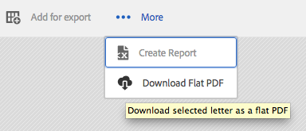
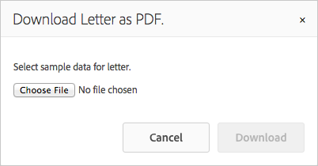

# 將自訂動作新增至資產清單檢視{#add-custom-action-to-the-asset-listing-view}

## 概觀 {#overview}

通訊管理解決方案可讓您將自訂動作新增到管理Assets使用者介面。

您可以將自訂動作新增到資產清單檢視中：

* 一或多個資產型別或字母
* 選取單一、多個資產/字母或不選取時，執行（動作/命令變為使用中）

此自訂功能會透過在「資產清單」檢視中新增命令「下載平面PDF」的案例來示範。 此自訂案例可讓您的使用者下載單一選取字母的平面PDF。

### 先決條件 {#prerequisites}

若要完成下列案例或類似案例，您需要瞭解：

* CRX
* JavaScript
* Java™

## 案例：將命令新增至「信件」清單使用者介面，以下載信件的平面PDF版本 {#addcommandtoletters}

下列步驟會將「下載平面PDF」命令新增至信函的資產清單檢視，並允許使用者下載所選信函的平面PDF。 將這些步驟與適當的程式碼和引數搭配使用，您可以為不同的資產新增一些其他功能，例如資料字典或文字。

若要自訂「通訊管理」，讓您的使用者下載平面信件PDF，請完成下列步驟：

1. 前往`https://'[server]:[port]'/[ContextPath]/crx/de`並以管理員身分登入。

1. 在apps資料夾中，使用下列步驟建立名為items的資料夾，其路徑/結構類似於selection資料夾中的items資料夾：

   1. 在下列路徑的&#x200B;**專案**&#x200B;資料夾上按一下滑鼠右鍵，然後選取&#x200B;**覆蓋節點**：

      `/libs/fd/cm/ma/gui/content/cmassets/jcr:content/body/content/header/items/selection/items`

      >[!NOTE]
      >
      >此路徑專用於建立可與選取多個資產/字母之一搭配使用的動作。 如果您想建立不需選取即可運作的動作，請改為為以下路徑建立覆蓋節點，並據此完成其餘步驟：
      >
      >
      >`/libs/fd/cm/ma/gui/content/cmassets/jcr:content/body/content/header/items/default/items`

      

   1. 請確定「覆蓋節點」對話方塊是否具備下列值：

      **路徑：** /libs/fd/cm/ma/gui/content/cmassets/jcr：content/body/content/header/items/selection/items

      **位置：** /apps/

      **符合節點型別：已選取**

      

   1. 按一下&#x200B;**確定**。 資料夾結構會在apps資料夾中建立。

      按一下&#x200B;**「儲存全部」**。

1. 在新建立的專案資料夾下，使用下列步驟為特定資產（範例：downloadFlatPDF）中的自訂按鈕/動作新增節點：

   1. 用滑鼠右鍵按一下&#x200B;**專案**&#x200B;資料夾，然後選取&#x200B;**建立** > **建立節點**。

   1. 確定[建立節點]對話方塊具有下列值，然後按一下[確定] **&#x200B;**：

      **名稱：** downloadFlatPDF （或您要指定給此屬性的名稱）

      **型別：** nt：unstructured

   1. 按一下您已建立的新節點（此處downloadFlatPDF）。 CRX會顯示節點的屬性。

   1. 將下列屬性新增至節點（此處downloadFlatPDF），然後按一下&#x200B;**儲存全部**：

      <table>
        <tbody>
        <tr>
        <td><strong>名稱</strong></td>
        <td><strong>類型</strong></td>
        <td><strong>值和說明</strong></td>
        </tr>
        <tr>
        <td>類別</td>
        <td>字串</td>
        <td>foundation-collection-action</td>
        </tr>
        <tr>
        <td>foundation-collection-action</td>
        <td>字串</td>
        <td><p>{"target"： "。cq-manageasset-admin-childpages"， "activeSelectionCount"： "single"，"type"： "LETTER"}<br /> <br /> <br /> <strong>activeSelectionCount</strong>可以單一或多重，以允許選擇執行自訂動作的單一或多個資產。</p> <p><strong>型別</strong>可以是下列之一或多個（以逗號分隔多個專案）： LETTER，TEXT，LIST，CONDITION，DATADICTIONARY</p> </td>
        </tr>
        <tr>
        <td>圖示</td>
        <td>字串</td>
        <td>icon-download<br /> <br /> Correspondence Management顯示在命令/功能表左側的圖示。 如需其他可用的圖示和設定，請參閱<a href="https://experienceleague.adobe.com/docs/experience-manager-release-information/aem-release-updates/previous-updates/aem-previous-versions.html" target="_blank">CoralUI圖示檔案</a>。<br /> </td>
        </tr>
        <tr>
        <td>jcr:primaryType</td>
        <td>名稱</td>
        <td>nt:unstructured</td>
        </tr>
        <tr>
        <td>rel</td>
        <td>字串</td>
        <td>download-flat-pdf-button</td>
        </tr>
        <tr>
        <td>sling:resourceType</td>
        <td>字串</td>
        <td>granite/ui/components/endor/actionbar/button</td>
        </tr>
        <tr>
        <td>text</td>
        <td>字串</td>
        <td>下載一般PDF（或任何其他標籤）<br /> <br />出現在「資產清單」介面中的命令</td>
        </tr>
        <tr>
        <td>標題</td>
        <td>字串</td>
        <td>下載所選信件的平面PDF（或任何其他標籤/替代文字）<br /> <br />標題是當使用者將滑鼠懸停在自訂命令上時，「通訊管理」所顯示的替代文字。</td>
        </tr>
        </tbody>
       </table>

1. 在apps資料夾中，使用下列步驟建立名為js的資料夾，其路徑/結構類似於admin資料夾中的items資料夾：

   1. 在下列路徑的&#x200B;**js**&#x200B;資料夾上按一下滑鼠右鍵，然後選取&#x200B;**覆蓋節點**：

      `/libs/fd/cm/ma/gui/components/admin/clientlibs/admin/js`

   1. 請確定「覆蓋節點」對話方塊是否具備下列值：

      **路徑：** /libs/fd/cm/ma/gui/components/admin/clientlibs/admin/js

      **位置：** /apps/

      **符合節點型別：已選取**

   1. 按一下&#x200B;**確定**。 資料夾結構會在apps資料夾中建立。 按一下&#x200B;**「儲存全部」**。

1. 在js資料夾中，建立名為formaction.js的檔案，其中包含按鈕的動作處理程式碼，使用下列步驟：

   1. 在下列路徑的&#x200B;**js**&#x200B;資料夾上按一下滑鼠右鍵，然後選取&#x200B;**建立>建立檔案**：

      `/apps/fd/cm/ma/gui/components/admin/clientlibs/admin/js`

      將檔案命名為formaction.js。

   1. 連按兩下檔案，以在CRX中開啟。
   1. 在formaction.js檔案（在/apps分支下）中，從位於以下位置的formaction.js檔案復製程式碼：

      `/libs/fd/cm/ma/gui/components/admin/clientlibs/admin/js/formaction.js`

      然後在formaction.js檔案的結尾處附加下列程式碼（在/apps分支下），然後按一下&#x200B;**全部儲存**：

      ```javascript
      /* Action url for xml file to be added.*/
      var ACTION_URL = "/apps/fd/cm/ma/gui/content/commons/actionhandlers/items/letterpdfdownloader.html";
      
      /* File upload handling*/
      var fileSelectedHandler = function(e){
          if(e && e.target && e.target.value)
              $(".downloadLetterPDFBtn").removeAttr('disabled');
          else
              $(".downloadLetterPDFBtn").attr('disabled','disabled');
      }
      
      /*Handing of Download button in pop up.*/
      var downloadClickHandler = function(){
          $('#downloadLetterPDFDilaog').modal("hide");
          var element = $('.foundation-selections-item');
          var path = $(element).data("path");
          $("#fileUploadForm").attr('action', ACTION_URL + "?letterId="+path).submit();
      }
      
      /*Click handling on action button.*/
      $(document).on("click",'.download-flat-pdf-button',function(e){
          $("#uploadSamepledata").val("");
           if($('#downloadLetterPDFDilaog').length == 0){
              $(document).on("click",".downloadLetterPDFBtn",downloadClickHandler);
              $(document).on("change","#uploadSamepledata",fileSelectedHandler);
              $("body").append(downloadLetterPDFDilaog);
          }
            $('#downloadLetterPDFDilaog').modal("show");
      });
      
      /*Download popup.*/
      var downloadLetterPDFDilaog = '<div id="downloadLetterPDFDilaog" class="coral-Modal notice " role="dialog"  aria-hidden="true">'+
          '<form id="fileUploadForm" method="POST" enctype="multipart/form-data">'+
              '<div class="coral-Modal-header">'+
                  '<h2 class="coral-Modal-title coral-Heading coral-Heading--2" id="modal-header1443020790107-label" tabindex="0">Download Letter as PDF.</h2>'+
                  '<button type="button" class="coral-MinimalButton coral-Modal-closeButton" data-dismiss="modal">×</button>'+
              '</div>'+
              '<div class="coral-Modal-body" id="modal-header1443020790107-message" role="document" tabindex="0">'+
                  '<div class="coral-Modal-message">'+
                      '<p></p>'+
                  '</div>'+
                  '<div class="coral-Modal-uploader">'+
                      '<p>Select sample data for letter.</p>'+
                      '<input type="file" id="uploadSamepledata" name="file" accept=".xml" size="70px">'+
                  '</div>'+
              '</div>'+
           '</form>'+
              '<div class="coral-Modal-footer">'+
                  '<button type="button" class="coral-Button" data-dismiss="modal">Cancel</button>'+
                  '<button type="button" class="coral-Button coral-Button--primary downloadLetterPDFBtn" disabled="disabled">Download</button>'+
              '</div>'+
      '</div>';
      ```

      您在此步驟中新增的程式碼會覆寫libs資料夾下的程式碼，因此請將先前的程式碼複製到/apps分支中的formaction.js檔案。 將程式碼從/libs分支複製到/apps分支，可確保先前的功能也能運作。

      上述程式碼適用於在此程式中建立的指令的字母特定動作處理。 如需其他資產的動作處理，請修改JavaScript程式碼。

1. 在apps資料夾中，使用下列步驟建立名為items的資料夾，其路徑/結構類似於actionhandlers資料夾中的items資料夾：

   1. 在下列路徑的&#x200B;**專案**&#x200B;資料夾上按一下滑鼠右鍵，然後選取&#x200B;**覆蓋節點**：

      `/libs/fd/cm/ma/gui/content/commons/actionhandlers/items/`

   1. 請確定「覆蓋節點」對話方塊是否具備下列值：

      **路徑：** /libs/fd/cm/ma/gui/content/commons/actionhandlers/items/

      **位置：** /apps/

      **符合節點型別：已選取**

   1. 按一下&#x200B;**確定**。 資料夾結構會在apps資料夾中建立。

   1. 按一下&#x200B;**「儲存全部」**。

1. 在新建立的專案節點下，使用下列步驟新增特定資產（例如：letterpdfdownloader）中自訂按鈕/動作的節點：

   1. 用滑鼠右鍵按一下專案資料夾，然後選取&#x200B;**建立>建立節點**。

   1. 確定[建立節點]對話方塊具有下列值，然後按一下[確定] **&#x200B;**：

      **名稱：** letterpdfdownloader (或您要指定給此屬性的名稱 — 必須是唯一的。 如果您在此處使用不同的名稱，請在formaction.js檔案的ACTION_URL變數中指定相同的名稱。)

      **型別：** nt：unstructured

   1. 按一下您已建立的新節點（此處downloadFlatPDF）。 CRX會顯示節點的屬性。

   1. 將下列屬性新增至節點（此處為letterpdfdownloader），然後按一下&#x200B;**全部儲存**：

      | **名稱** | **類型** | **值** |
      |---|---|---|
      | sling:resourceType | 字串 | fd/cm/ma/gui/components/admin/clientlibs/admin |

1. 在下列位置使用命令的動作處理程式碼，建立名為POST.jsp的檔案：

   /apps/fd/cm/ma/gui/components/admin/clientlibs/admin

   1. 用滑鼠右鍵按一下下列路徑的&#x200B;**管理員**&#x200B;資料夾，然後選取&#x200B;**建立>建立檔案**：

      /apps/fd/cm/ma/gui/components/admin/clientlibs/admin

      將檔案命名為POST.jsp。 (檔案名稱僅需為POST.jsp。)

   1. 連按兩下&#x200B;**POST.jsp**&#x200B;檔案，以在CRX中開啟。
   1. 將下列程式碼新增至POST.jsp檔案，然後按一下[儲存全部] **&#x200B;**：

      此程式碼專用於字母轉譯服務。 若是其他資產，請將該資產的Java™程式庫新增至此程式碼。 如需AEM Forms API的詳細資訊，請參閱[AEM Forms API](https://experienceleague.adobe.com/docs/experience-manager-release-information/aem-release-updates/previous-updates/aem-previous-versions.html)。

      如需AEM資料庫的詳細資訊，請參閱AEM [元件](/help/sites-developing/components.md)。

      ```xml
      /*Import libraries. Here we are downloading letter flat pdf with input xml data so we require letterRender Api. For any other Module functionality we need to first import that library. */
      <%@include file="/libs/foundation/global.jsp"%>
      <!DOCTYPE html lang="en" PUBLIC "-//W3C//DTD XHTML 1.1//EN" "https://www.w3.org/TR/xhtml11/DTD/xhtml11.dtd">
      <%@page import="com.adobe.icc.ddg.api.*"%>
      <%@page import="com.adobe.icc.dbforms.obj.*"%>
      <%@page import="com.adobe.icc.render.obj.*" %>
      <%@page import="com.adobe.icc.services.api.*" %>
      <%@page import="org.apache.sling.api.resource.*" %>
      <%@page import="java.io.File" %>
      <%@page import="java.util.*" %>
      <%@page import="com.adobe.livecycle.content.appcontext.AppContextManager"%>
      <%@page import=" com.adobe.icc.dbforms.exceptions.ICCException"%>
      <%@page import="java.io.InputStream" %>
      <%@page import="java.io.FileInputStream" %>
      <%@page import="org.apache.commons.io.IOUtils" %>
      <%@page session="false" contentType="text/html; charset=utf-8"%>
      <%@taglib prefix="sling" uri="https://sling.apache.org/taglibs/sling/1.0"%>
      <%@taglib prefix="cq" uri="https://www.day.com/taglibs/cq/1.0" %>
       <%@page session="false" contentType="text/html; charset=utf-8"%>
      <%
         AppContextManager.setCurrentAppContext("/content/apps/cm");
         /*Get letter id sent in js file.*/
          String letterId = request.getParameter("letterId");
          if(letterId.lastIndexOf("?") != -1)
              letterId = letterId.substring(0, letterId.indexOf("?"));
          String fileName = null;
          String letterName = null;
          InputStream inputStream = null;
          /*Get xml file data*/
          if (slingRequest.getRequestParameter("file") != null)
              inputStream = slingRequest.getRequestParameter("file").getInputStream();
          if(letterId != null){
              String xmlData = null;
              try{
                  xmlData = IOUtils.toString(inputStream, "UTF-8");
              }
              catch (Exception e) {
                  log.error("Xml data does not exists.");
              }
              /*letter Name from letter letter id.*/
              letterName = letterId.substring(letterId.lastIndexOf("/")+1);
              /*Invoking letter render services API.*/
              LetterRenderService letterRenderService = sling.getService(LetterRenderService.class);
              /*using CM renderLetter api to get pdfbytes.*/
              PDFResponseType  pdfResponseType= letterRenderService.renderLetter(letterId,xmlData,true,false,false,false);
              byte[] bytes = null;
              /*Downloading pdf bytes as pdf.*/
              if(pdfResponseType != null && pdfResponseType.getFile() != null){
                  bytes = pdfResponseType.getFile().getDocument();
                  /*set the response header to enable download*/
                  response.setContentType("application/OCTET-STREAM");
                  response.setHeader("Content-Disposition", "attachment;filename=\"" + letterName + ".pdf\"");
                  response.setHeader("Pragma", "cache");
                  response.setHeader("Cache-Control", "private");
                  out.clear();
                  response.getOutputStream().write(bytes);
              }
          }
          else{
              log.error("Letter id does not exists.");
          }
      %>
      ```

## 使用自訂功能下載信件的平面PDF {#download-flat-pdf-of-a-letter-using-the-custom-functionality}

新增自訂功能來下載信函的平面PDF後，您可以使用下列步驟來下載所選信函的平面PDF版本：

1. 前往`https://'[server]:[port]'/[ContextPath]/projects.html`並登入。

1. 選取&#x200B;**Forms >信件**。 「通訊管理」會列出系統中可用的信件。
1. 按一下&#x200B;**選取**，然後按一下字母以選取它。
1. 選取&#x200B;**更多** > **&lt;下載一般PDF>** （使用本文說明建立的自訂功能）。 將字母下載為PDF對話方塊出現。

   功能表專案名稱、功能和alt-text是根據[中建立的自訂來設定。案例：新增命令至信函清單使用者介面來下載信函的平面PDF版本。](#addcommandtoletters)

   

1. 在「以PDF形式下載信件」對話方塊中，選取要用來在PDF中填入資料的相關XML。

   >[!NOTE]
   >
   >以一般PDF下載信函之前，您可以使用&#x200B;**建立報告**&#x200B;選項來建立包含信函資料的XML檔案。

   

   信函會以一般PDF下載到您的電腦。
