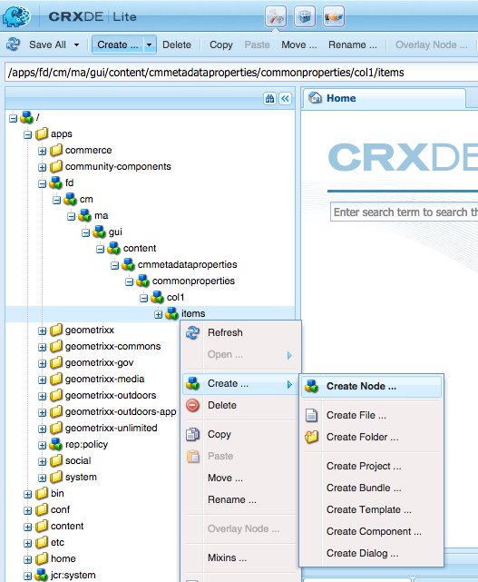
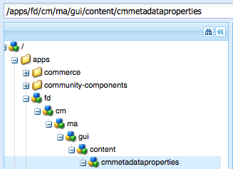
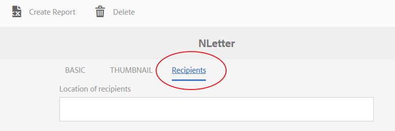
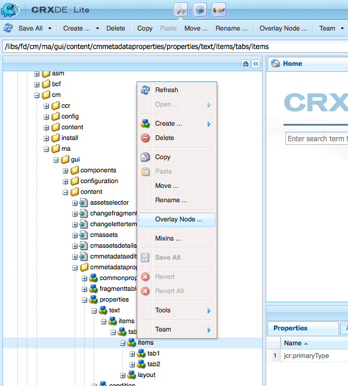

# 將自訂屬性新增至Correponsent Management資產{#add-custom-properties-to-correspondence-management-assets}

## 概覽 {#overview}

您可以自訂Correponse Management使用者介面，並為使用者提供一組自訂的屬性和標籤。 此自訂功能包括將自訂欄位／屬性和標籤新增至特定資產類型／字母或所有資產類型和字母。

## 新增自訂屬性至Correponsement Management資產 {#adding-custom-properties-to-correspondence-management-assets}

以下案例說明如何新增屬性／標籤至Correponsement Management資產和信件：

* 新增公用屬性至所有資產類型
* 新增公用標籤至所有資產類型
* 新增自訂屬性至特定資產類型

透過調整這些藍本中的屬性、路徑和值，您可以根據需求將自訂屬性和標籤新增至不同的資產組。

### 方案：新增公用欄位（屬性）至所有資產類型 {#scenario-adding-a-common-field-property-to-all-the-asset-types}

此藍本說明如何新增自訂屬性至所有資產類型（文字、清單、條件和版面片段）和字母。 使用此方案，您可以將屬性「收件者的位置」新增至所有資產和字母。 「收件者位置」屬性有助於識別資產或信件的交付地區。

>[!NOTE]
>
>如果您已新增自訂屬性，屬性會開始出現在資產建立頁面上。 若要隱藏此類屬性，請參閱「在資產建立和屬性頁面上顯示／隱藏自訂屬性」。


完成下列步驟，將自訂屬性新增至所有資產類型和字母：

1. 前往並 `https://[server]:[port]/[ContextPath]/crx/de` 以管理員身分登入。
1. 在應用程式檔案夾中，使用下列步驟建立名為css的檔案夾，其路徑／結構類似於css檔案夾（位於ccrui檔案夾中）:

   1. 以滑鼠右鍵按一下下列路徑上的items資料夾，然後選取「覆 **蓋節點」**:

      `/libs/fd/cm/ma/gui/content/cmmetadataproperties/commonproperties/col1/items`

      

   1. 請確定「覆蓋節點」對話框具有下列值：

      **** 路徑：/libs/fd/cm/ma/gui/content/cmmetadataproperties/commonproperties/col1/items

      **** 位置：/apps/

      **** 匹配節點類型：已選取

      

   1. 按一下 **確定**。 資料夾結構會建立在應用程式資料夾中。

   1. 按一下「 **全部儲存**」。

1. 在新建立的項目資料夾下，為所有資產新增自訂屬性的節點(範例：GeoLocation)，使用下列步驟：

   1. 按一下右鍵項目資料夾，然後選擇「 **建立** 」>「 **建立節點」**。

      

   1. 確保「建立節點」對話框具有以下值，然後按一下「確 **定」**:

      **** 名稱：GeoLocation（或您要為此屬性提供的名稱）

      **** 類型：nt：非結構化

      

   1. 按一下您建立的新節點（此處為GeoLocation）。 CRX顯示節點的屬性。
   1. 將下列屬性新增至節點（此處為GeoLocation）:

      | **名稱** | **類型** | **值** |
      |---|---|---|
      | fieldLabel | 字串 | 您要指定欄位／屬性的名稱。 (這裡：收件者位置) |
      | 名稱 | 字串 | `./extendedproperties/GeoLocation` （保留值與在項目節點下建立的欄位名稱相同） |
      | renderReadOnly | 布林值 (Boolean) | true |
      | sling:resourceType | 字串 | `granite/ui/components/coral/foundation/form/textfield` |

   1. 按一下「 **全部儲存**」。

1. 若要檢視自訂，請將滑鼠指標暫留在資產（文字、清單、條件或版面片段）或字母上，按一下「檢 **視屬性**」，然後按一下「 **編輯」**。 新欄位（收件者的位置）會顯示在資產／信件屬性的「基本」標籤中。

   >[!NOTE]
   >
   >您可能需要先清除瀏覽器快取，才能在UI中顯示自訂。

   

   >[!NOTE]
   >
   >您新增之所有資產的通用屬性會顯示在資產屬性的基本標籤中。 依預設，所有資產新增的常用屬性會出現在屬性頁面和資產建立頁面上。 若要隱藏常用屬性，您必須 <!--link to show / hide properties]-->。

### 方案：新增自訂下拉式清單和值至自訂屬性／欄位 {#scenario-add-custom-drop-down-and-values-to-a-custom-property-field}

此藍本說明如何新增自訂屬性至所有資產類型，並新增下拉式值。

1. 以滑鼠右鍵按一下下列路徑上的items資料夾，然後選取「覆 **蓋節點」**:

   `/libs/fd/cm/ma/gui/content/cmmetadataproperties/commonproperties/col1/items`

1. 在新建立的覆蓋節點(/apps/fd/cm/ma/gui/content/cmmetadataproperties/commonproperties/col1/items)下，為您需要為其建立nt:unstructured類型的下拉式清單(此處 `geographicallocation`)的每個屬性（欄位）建立一個節點。
1. 將下列屬性新增至節點（此處為地理配置），然後按一下「全 **部儲存**:

   <table>
   <tbody>
   <tr>
      <td><strong>名稱</strong></td>
      <td><strong>類型</strong></td>
      <td><strong>值</strong></td>
   </tr>
   <tr>
      <td>fieldLabel</td>
      <td>字串</td>
      <td>您要指定欄位／屬性的名稱。 (這裡：地理配置)</td>
   </tr>
   <tr>
      <td>名稱</td>
      <td>字串</td>
      <td>./extendedproperties/geographicallocation（保留值與您在items節點下建立的欄位名相同）</td>
   </tr>
   <tr>
      <td>renderReadOnly</td>
      <td>布林值 (Boolean)</td>
      <td>true</td>
   </tr>
   <tr>
      <td>sling:resourceType</td>
      <td>字串</td>
      <td>granite/ui/components/coral/foundation/form/select<br /> </td>
   </tr>
   </tbody>
   </table>

1. 在屬性節點下（此處為geographicallocation），添加一個名稱為的新節點 `items`。 在「項目」節點下，為下拉式清單中的值新增每個節點。 建議您將第一個節點新增為空白，以做為下拉式清單的預設值，並讓使用者為欄位指定任何值。 若要新增多個選項／下拉式值，請重複下列步驟：

   1. 按一下右鍵屬性節點（此處為地理分配），然後選擇「創 **建** 」>「 **建立節點」**。
   1. 輸入欄位名稱，將類型保 `item1,` 留為nt:unstructured，然後按一下「確 **定」**。
   1. 將下列屬性新增至新建立的節點（此處為item1），然後按一下「全 **部儲存**」:

      <table>
         <tbody>
         <tr>
          <td><strong>名稱</strong></td>
          <td><strong>類型</strong></td>
          <td><strong>值</strong></td>
         </tr>
         <tr>
          <td>文字</td>
          <td>字串</td>
          <td>這是使用者可見的下拉式選項值。 保留空白（預設值）值，或輸入值，例如 <strong>International</strong><strong>或Within U</strong>.<br /> </td>
         </tr>
         <tr>
          <td>值</td>
          <td>字串</td>
          <td>儲存在CRXDE中的文字值。 輸入任何唯一關鍵字。 <br /> </td>
         </tr>
         </tbody>
   </table>

   

自訂下拉式清單會在資產屬性中顯示為：


### 方案：所有資產類型的公用標籤 {#scenario-common-tab-for-all-asset-types}

此案例顯示如何將自訂標籤「收件者」新增至所有資產類型（文字、清單、條件和版面片段）和字母。 您可以在「收件者」索引標籤中，規劃將所有與收件者相關的自訂屬性放入。


使用下列程式，您可以新增含欄位的標籤至所有資產：

1. 前往並 `https://[server]:[port]/[ContextPath]/crx/de` 以管理員身分登入。
1. 在應用程式檔案夾中，使用下列步驟建立名為cmmetadataproperties的檔案夾，其路徑／結構類似於cmmetadataproperties檔案夾（位於內容檔案夾中）:

   1. 在下列路徑的cmmetadataproperties資料夾上按一下滑鼠右鍵，然後選取「覆 **蓋節點」**:

      `/libs/fd/cm/ma/gui/content/cmmetadataproperties`

      

   1. 請確定「覆蓋節點」對話框具有下列值：

      **** 路徑：/libs/fd/cm/ma/gui/content/cmmetadataproperties

      **** 位置：/apps/

      **** 匹配節點類型：已選取

   1. 按一下 **確定**。 資料夾結構會建立在應用程式資料夾中。

      

      按一下「 **全部儲存**」。

1. 在cmmetadataproperties資料夾下，新增節點，以建立所有資產的自訂標籤(範例：commontab)，使用下列步驟：

   1. 按一下右鍵cmmetadataproperties資料夾，然後選 **擇「建立** 」>「 **建立節點」**。

      

   1. 確保「建立節點」對話框具有以下值，然後按一下「確 **定」**:

      **** 名稱：commontab（或您要為此屬性提供的名稱）

      **** 類型：nt：非結構化

   1. 按一下已建立的新節點（此處為公用頁籤）。 CRX顯示節點的屬性。
   1. 將以下屬性添加到節點（此處為公用頁籤）:

      <table>
         <tbody>
         <tr>
          <td><strong>名稱</strong></td>
          <td><strong>類型</strong></td>
          <td><strong>值</strong></td>
         </tr>
         <tr>
          <td>jcr:title</td>
          <td>字串</td>
          <td>要指定列的名稱。 (這裡：收件者)</td>
         </tr>
         <tr>
          <td>sling:resourceType</td>
          <td>字串</td>
          <td>granite/ui/components/coral/foundation/container<br /> </td>
   </tr>
         </tbody>
       </table>

   1. 按一下「 **全部儲存**」。

1. 對於在最後一個步驟（此處為公用頁籤）中建立的頁籤節點，請使用以下步驟建立一個名為item的節點：

   1. 按一下右鍵相關節點（此處為公用頁籤），然後選擇「創 **建** 」>「 **建立節點」**。
   1. 確保「建立節點」對話框具有以下值，然後按一下「確 **定」**:

      **** 名稱：項目

      **** 類型：nt：非結構化

   1. 按一下「 **全部儲存」:**

1. 在上一步中（在公用頁籤下）建立的項目節點中，使用以下步驟（要添加更多列，請重複此步驟），在自定義頁籤（公用頁籤）中添加一個用於建立列的節點（此處為Column1）:

   1. 按一下右鍵項目節點，然後選擇「創 **建** 」>「 **建立節點」**。
   1. 確保「建立節點」對話框具有以下值，然後按一下「確 **定」**:

      **** 名稱：Column1（或要為節點提供的名稱——此名稱不會顯示在用戶介面中。）

      **** 類型：nt：非結構化

   1. 將下列屬性新增至節點（此處為Column1），然後按一下「全 **部儲存**:

      <table>
         <tbody>
         <tr>
           <td><strong>名稱</strong></td>
           <td><strong>類型</strong></td>
           <td><strong>值</strong></td>
         </tr>
         <tr>
           <td>sling:resourceType</td>
           <td>字串</td>
           <td>granite/ui/components/coral/foundation/container<br /> </td>
         </tr>
         </tbody>
       </table>

1. 在您在上一步驟（此處為Column1）中建立的節點中，使用以下步驟添加名為items的節點：

   1. 按一下右鍵節點（此處為Column1），然後選擇「創 **建** 」>「 **建立節點」**。
   1. 確保「建立節點」對話框具有以下值，然後按一下「確 **定」**:

      **** 名稱：項目

      **** 類型：nt：非結構化

   1. 按一下「 **全部儲存**」。

1. 若要在自訂標籤中建立欄位（此處為「收件者」），請新增節點（此處為「地理位置」）。 此屬性與您建立的列相對應。 使用下列步驟建立欄位（要建立更多欄位／節點，請重複這些步驟）。:

   1. 按一下右鍵項目節點，然後選擇「創 **建** 」>「 **建立節點」**。
   1. 確保「建立節點」對話框具有以下值，然後按一下「確 **定」**:

      **** 名稱：GeortalLocation（或欄位屬性的其他名稱）

      **** 類型：nt：非結構化

   1. 將下列屬性新增至欄位節點（此處為GeortalLocation），然後按一下「全 **部儲存」**。

      | **名稱** | **類型** | **值** |
      |---|---|---|
      | fieldLabel | 字串 | 收件者的位置（或您要指定欄位的名稱）。 |
      | 名稱 | 字串 | ./extendedproperties/GeortalLocation |
      | renderReadOnly | 布林值 (Boolean) | true |
      | sling:resourceType | 字串 | `/libs/granite/ui/components/coral/foundation/form/textfield` |

1. 若要為「字母」新增此標籤，請在下列路徑建立路徑／結構類似下列項目檔案夾的覆蓋檔案夾：

   `/libs/fd/cm/ma/gui/content/cmmetadataproperties/properties/letter/items/tabs/items`

   若要建立字母或不同資產的覆蓋，請使用下列路徑，將 [資產類型] ，取代為文字、條件、清單、資料字元或片段：

   `/libs/fd/cm/ma/gui/content/cmmetadataproperties/properties/[assettype]/items/tabs/items`

   1. 以滑鼠右鍵按一下下列路徑上的items資料夾，然後選取「覆 **蓋節點」**:

      `/libs/fd/cm/ma/gui/content/cmmetadataproperties/properties/letter/items/tabs/items`

   1. 請確定「覆蓋節點」對話框具有下列值：

      **** 路徑： `/libs/fd/cm/ma/gui/content/cmmetadataproperties/properties/letter/items/tabs/items`

      **** 位置：/apps/

      **** 匹配節點類型：已選取

   1. 按一下 **確定**。 資料夾已建立。 按一下「 **全部儲存**」。

1. 在新建立的項目資料夾中，使用下列步驟新增資產中自訂標籤的節點（此處為mytab —— 此名稱不會顯示在使用者介面中）:

   1. 按一下右鍵項目資料夾，然後選擇「 **建立** 」>「 **建立節點」**。
   1. 確保「建立節點」對話框具有以下值，然後按一下「確 **定」**:

      **** 名稱：mytab（或您要提供給此屬性的名稱）

      **** 類型：nt：非結構化

   1. 按一下已建立的新節點（此處為mytab）。 CRX顯示節點的屬性。
   1. 將以下兩個屬性添加到節點（此處為customtab）:

      <table>
         <tbody>
         <tr>
           <td><strong>名稱</strong></td>
           <td><strong>類型</strong></td>
           <td><strong>值</strong></td>
         </tr>
         <tr>
           <td>路徑<br /> </td>
           <td>字串</td>
           <td>fd/cm/ma/gui/content/cmmetadataproperties/commontab<br /> </td>
         </tr>
         <tr>
           <td>sling:resourceType</td>
           <td>字串</td>
           <td>granite/ui/components/coral/foundation/include<br /> </td>
         </tr>
         </tbody>
       </table>

   1. 按一下「 **全部儲存**」。

1. 若要檢視自訂，請將滑鼠指標暫留在相關資產上（在此附上字母），按一下「檢視屬性」，然後按一下「編 **輯」**。 新的標籤（收件者）和欄位（收件者的位置）會顯示在使用者介面中。

   >[!NOTE]
   >
   >您可能需要先清除瀏覽器快取，才能在UI中顯示自訂。

   

### 方案：新增特定資產類型的自訂屬性 {#scenario-adding-custom-properties-for-specific-asset-types}

此藍本顯示如何將屬性新增至特定資產類型，例如欄位至所有文字資產。 使用此過程，可以將屬性添加到以下其中一個：

* 文字
* 條件
* 清單
* 布局片段
* 資料字典
* 字母

例如，您只想新增文字資產的屬性「收件者位置」，以識別資產與哪個地區相關。  

若要將屬性新增至資產類型，請完成下列步驟：

1. 前往並 `https://[server]:[port]/[ContextPath]/crx/de` 以管理員身分登入。
1. 若要在資產類型（例如「文字」）中建立標籤，請在應用程式檔案夾中建立下列檔案夾結構：

   `/libs/fd/cm/ma/gui/content/cmmetadataproperties/properties/[AssetType]/items/tabs/items`

   [AssetType] = text、condition、list、letter、datactionary或fragment

   建立此資料夾結構的步驟如下：

   1. 以滑鼠右鍵按一下下列路徑上的items資料夾，然後選取「覆 **蓋節點」**:

      `/libs/fd/cm/ma/gui/content/cmmetadataproperties/properties/[AssetType]/items/tabs/items`

      例如，如果要為文本資產建立屬性，請選擇以下資料夾：

      `/libs/fd/cm/ma/gui/content/cmmetadataproperties/properties/text/items/tabs/items`

      

   1. 請確定「覆蓋節點」對話框具有下列值：

      **** 路徑：/libs/fd/cm/ma/gui/content/cmmetadataproperties/properties/[AssetType]/items/tabs/items

      **** 位置：/apps/

      **** 匹配節點類型：已選取

   1. 按一下 **確定**。 資料夾結構會建立在應用程式資料夾中。

      按一下「 **全部儲存**」。

1. 在新建立的項目資料夾中，為資產中的自訂標籤新增節點(範例：customtab)，使用下列步驟：

   1. 按一下右鍵項目資料夾，然後選擇「 **建立** 」>「 **建立節點」**。
   1. 確保「建立節點」對話框具有以下值，然後按一下「確 **定」**:

      **** 名稱：customtab（或您要提供給此屬性的名稱）

      **** 類型：nt：非結構化

   1. 按一下已建立的新節點（此處為customtab）。 CRX顯示節點的屬性。
   1. 將以下兩個屬性添加到節點（此處為customtab）:

      | **名稱** | **類型** | **值** |
      |---|---|---|
      | sling:resourceType | 字串 | granite/ui/components/coral/foundation/container |
      | jcr:title | 字串 | 用戶介面（此處為「我的」頁籤）上的欄位的名稱 |

   1. 按一下「 **全部儲存**」。

1. 在您在上一步驟（此處自訂標籤）中建立的節點中，使用下列步驟新增稱為項目的節點：

   1. 按一下右鍵該節點（此處為自定義頁籤），然後選擇「 **建立** 」>「 **建立節點」**。
   1. 確保「建立節點」對話框具有以下值，然後按一下「確 **定」**:

      **** 名稱：項目

      **** 類型：nt：非結構化

   1. 按一下「 **全部儲存**」。

1. 在上一步中（在customtab下）建立的項目節點中，使用以下步驟（要添加更多列，請重複此步驟）在自定義頁籤中添加用於建立列的節點（此處為Column1）:

   1. 按一下右鍵項目節點，然後選擇「創 **建** 」>「 **建立節點」**。
   1. 確保「建立節點」對話框具有以下值，然後按一下「確 **定」**:

      **** 名稱：Column1（或要為節點提供的名稱）

      **** 類型：nt：非結構化

   1. 將下列屬性新增至節點（此處為Column1），然後按一下「全 **部儲存」**。

      <table>
         <tbody>
         <tr>
           <td><strong>名稱</strong></td>
           <td><strong>類型</strong></td>
           <td><strong>值</strong></td>
         </tr>
         <tr>
           <td>sling:resourceType</td>
           <td>字串</td>
           <td>granite/ui/components/coral/foundation/container<br /> </td>
         </tr>
         </tbody>
       </table>

1. 對於您建立的每列（如前一步中指定的——此處為Column1），請使用以下步驟建立名為item的節點：

   1. 按一下右鍵相關列節點（此處為Column1），然後選擇「創 **建** 」>「 **建立節點」**。
   1. 確保「建立節點」對話框具有以下值，然後按一下「確 **定」**:

      **** 名稱：項目

      **** 類型：nt：非結構化

   1. 按一下「 **全部儲存」:**

1. 對於建立的每列，在「項」節點下建立一個節點，以便在「用戶介面」的「新」頁籤中建立欄位。 重複此步驟，在列中建立更多欄位：

   1. 按一下右鍵相關節點（此處列1下的項），然後選擇「創 **建** 」>「 **建立節點」**。
   1. 確保「建立節點」對話框具有以下值，然後按一下「確 **定」**:

      **** 名稱：您選擇的名稱（此處為GeoLocation）

      **** 類型：nt：非結構化

   1. 將下列屬性新增至節點，然後按一下「全 **部儲存」**。

      | **名稱** | **類型** | **值** |
      |---|---|---|
      | fieldLabel | 字串 | 收件者的位置（或您要指定欄位的名稱）。 |
      | 名稱 | 字串 | `./extendedproperties/GeoLocation` |
      | renderReadOnly | 布林值 (Boolean) | true |
      | sling:resourceType | 字串 | granite/ui/components/coral/foundation/form/textfield |

1. 若要檢視自訂，請將滑鼠指標暫留在相關資產（這裡顯示文字）上，按一下「檢視屬性」，然後按一下「編 **輯」**。 新的標籤和欄位（收件者的位置）會出現在使用者介面中。

   >[!NOTE]
   >
   >您可能需要先清除瀏覽器快取，才能在UI中顯示自訂。

   

### 在「資產建立」頁面上顯示自訂屬性 {#display-custom-properties-on-the-asset-creation-page}

依預設，新增至新標籤的自訂屬性只會顯示在屬性頁面上，而不會顯示在資產建立頁面上，因為資產建立頁面沒有標籤配置。 若要在資產建立頁面上顯示自訂屬性以及其他屬性，您必須執行下列動作：

1. 以滑鼠右鍵按一下下列路徑上的items資料夾，然後選取「覆 **蓋節點」**:

   `/libs/fd/cm/ma/gui/content/createasset/createletter/jcr:content/body/items/form/items/letterWizard/items/properties/items/properties/items/letterproperties/items`

1. 對於字母，請確定「覆蓋節點」對話框具有以下值。 對於其他資產類型，下表提供路徑：

   **** 路徑：/libs/fd/cm/ma/gui/content/createasset/createletter/jcr:content/body/items/form/items/letterWizard/items/properties/items/properties/items/letterproperties/items

   **** 位置：/apps/

   **** 匹配節點類型：已選取

   視資產類型而定，路徑必須是：

   | **資產／檔案類型** | **要添加的路徑** |
   |---|---|
   | 文字 | /libs/fd/cm/gui/content/createasset/createtext/jcr:content/body/items/form/textwizard/items/editproperties/items/properties/items/tabs/items/tab1/tab1/items |
   | 清單 | /libs/fd/cm/gui/content/createasset/createlist/jcr:content/body/items/form/items/listwizard/items/editproperties/items/properties/tabs/items/tabs/tab1/items |
   | 條件 | /libs/fd/cm/gui/content/createasset/createcondition/jcr:content/body/items/form/items/conditionwizard/items/editproperties/items/properties/items/tabs/items/tab1/items |
   | 片段 | /libs/fd/cm/gui/content/createasset/createfragment/jcr:content/body/items/form/items/fragmentwizard/items/properties/properties/items/tabs2/items/tab1/items1/items |
   | 字母 | /libs/fd/cm/ma/gui/content/createasset/createletter/jcr:content/body/items/form/items/letterWizard/items/properties/items/properties/items/letterproperties/items |

1. 按一下 **確定**。 資料夾結構會建立在應用程式資料夾中。

1. 在您建立的覆蓋項目節點下，建立名稱col4（或任何其他名稱）的節點，然後按一下「全 **部儲存」**。

   例如，以下是為字母建立的覆蓋節點。

   `/apps/fd/cm/ma/gui/content/createasset/createletter/jcr:content/body/items/form/items/letterWizard/items/properties/items/properties/items/letterproperties/items`

1. 將下列屬性新增至新建立的節點（此處為col4），然後按一下「全 **部儲存」**:

<table>
 <tbody>
  <tr>
   <td><strong>名稱</strong></td>
   <td><strong>類型</strong></td>
   <td><strong>值</strong></td>
  </tr>
  <tr>
   <td>路徑</td>
   <td>字串</td>
   <td><p>此路徑是指向在以下位置建立的列的指針：</p>
    <ul>
     <li>對於所有資產類型的公用標籤：/apps/fd/cm/ma/gui/content/cmmetadataproperties/commontab/items/col1</li>
     <li>針對不同資產類型的不同屬性：/apps/fd/cm/ma/gui/content/cmmetadataproperties/properties//items/tabs/items/customtab/items/col1</li>
    </ul> </td>
  </tr>
  <tr>
   <td>sling:resourceType</td>
   <td>字串</td>
   <td> granite/ui/components/coral/foundation/include<br /> </td>
  </tr>
 </tbody>
</table>


自訂屬性，語言，顯示在建立字母的UI中

## 自訂清單檢視以顯示自訂屬性 {#customize-the-list-view-to-show-custom-properties}

在您將自訂屬性新增至「對應管理」資產後，您需要在CRX/DE中進一步變更，以確保自訂屬性顯示在「對應管理」UI中。

完成下列步驟，在「對應管理」的資產清單UI中顯示自訂屬性：

1. 前往並 `https://[server]:[port]/[ContextPath]/crx/de` 以管理員身分登入。
1. 在應用程式檔案夾中建立下列檔案夾結構：

   `/libs/fd/cm/ma/gui/content/cmassets/jcr:content/views/lists/columns`

   建立此資料夾結構的步驟如下：

   1. 以滑鼠右鍵按一下下列路徑上的欄資料夾，然後選取「覆 **蓋節點」**:

      `/libs/fd/cm/ma/gui/content/cmassets/jcr:content/views/lists/columns`

   1. 請確定「覆蓋節點」對話框具有下列值：

      **** 路徑：/libs/fd/cm/ma/gui/content/cmassets/jcr:content/views/lists/columns

      **** 位置：/apps/

      **** 匹配節點類型：已選取

   1. 按一下 **確定**。 資料夾結構會建立在應用程式資料夾中。

      按一下「 **全部儲存**」。

1. 對於建立的每個屬性，在列節點下建立一個節點，以在用戶介面中建立列。 重複此步驟，在UI中建立更多欄：

   1. 按一下右鍵相關節點（列），然後選擇「創 **建** 」>「 **建立節點」**。
   1. 確保「建立節點」對話框具有以下值，然後按一下「確 **定」**:

      **** 名稱：您選擇的名稱（此處為GeortalLocation）

      **** 類型：nt：非結構化

   1. 將下列屬性新增至節點，然後按一下「全 **部儲存」**。

      <table>
         <tbody>
         <tr>
           <td><strong>名稱</strong></td>
           <td><strong>類型</strong></td>
           <td><strong>值</strong></td>
         </tr>
         <tr>
           <td>jcr:primaryType</td>
           <td>名稱</td>
           <td><p>nt:unstructured</p> </td>
         </tr>
         <tr>
           <td>jcr:title</td>
           <td>字串</td>
           <td><p>地理位置</p> <p>此值會以欄標題的形式出現在UI中。 </p> </td>
         </tr>
         <tr>
           <td>排序</td>
           <td>布林值 (Boolean)</td>
           <td><p>true</p> <p>值為true表示用戶可以對此列中的值進行排序。 </p> </td>
         </tr>
         </tbody>
       </table>

1. 在應用程式檔案夾中建立下列檔案夾結構：

   `/libs/fd/cm/ma/gui/components/admin/childpagerenderer/childlistpage`

   建立此資料夾結構的步驟如下：

   1. 以滑鼠右鍵按一下下列路徑上的欄資料夾，然後選取「覆 **蓋節點」**:

      `/libs/fd/cm/ma/gui/components/admin/childpagerenderer/childlistpage`

   1. 請確定「覆蓋節點」對話框具有下列值：

      **** 路徑：/libs/fd/cm/ma/gui/components/admin/childpagerenderer/childlistpage

      **** 位置：/apps/

      **** 匹配節點類型：已選取

   1. 按一下 **確定**。 資料夾結構會建立在應用程式資料夾中。

      按一下「 **全部儲存**」。

1. 從以下位置複製childlistpage.jsp檔案：

   /libs/fd/cm/ma/gui/components/admin/childpagerenderer/childlistpage/childlistpage.jsp

   將檔案貼到下列位置：

   /apps//fd/cm/ma/gui/components/admin/childpagerenderer/childlistpage/.

1. 開啟childlistpage.jsp檔案(/apps/fd/cm/ma/gui/components/admin/childpagerenderer/childlistpage/childlistpage.jsp)並進行下列變更：

   1. 將下列內容新增至檔案第19行（依版權聲明）。

      ```
      <%@page import="java.util.Map"%>
      ```

   1. 將函式的下列程式碼新增至檔案結尾，以取得每個自訂屬性的值：

      ```
      <%!
          private String getCustomPropertyValue(Map<String, Object> extendedProperties, String propertyName) {
      
              String propertyValue = "";
              if (extendedProperties.containsKey(propertyName)) {
                  propertyValue = (String) extendedProperties.get(propertyName);
              }
      
              return propertyValue;
          }
      %>
      ```

   1. 在&lt;tr>標籤(&lt;tr &lt;%= attrs.build()%>>)開始之前新增下列項目：

      ```
      <%
          String GeoLocation = "";
          if (asset != null) {
                  Map<String, Object> extendedProperties = asset.getExtendedProperties();
                  if (extendedProperties != null) {
                      GeoLocation = getCustomPropertyValue(extendedProperties,"GeoLocation");
                  }
          }
      %>
      ```

      在程式碼中，GeoLocation是您在建立自訂節點／欄位時，在name屬性中設定的值。 在建立自定義節點／欄位時，您指定了屬性的名稱。/extendedproperties/ prefix:./extendedproperties/GeoLocation。 在程式碼中，首碼不是必要的。

   1. 若要在UI中顯示新屬性，請在結束tr(&lt;/tr>)標籤之前，新增TD標籤，如下所示：

      ```
      <td is="coral-td" value="<%= xssAPI.encodeForHTMLAttr(geographicalLocation) %>"><%= xssAPI.encodeForHTML(geographicalLocation) %></td>
      ```

      要添加更多列，請重複步驟6.3和6.4。

   1. 按一下「 **全部儲存**」。

1. 若要檢視自訂，請開啟檔案片段的清單檢視，或您新增自訂屬性的字母。

   此過程中添加的UI列和屬性將針對所有資產類型顯示。 不過，這些屬性中的值只能針對您原本新增自訂屬性的資產類型輸入和顯示。

   例如，使用藍本：新增特定資產類型的自訂屬性，您新增自訂屬性至文字資產，您只能在文字資產中輸入自訂屬性。 但是，如果您在UI中顯示該自訂屬性，則所有資產類型都會顯示該欄。

   

1. （可選）依預設，新欄會顯示為UI中的最後一欄。 要使列顯示在特定位置，請將以下屬性添加到列節點：

<table>
 <tbody>
  <tr>
   <td><strong>名稱</strong></td>
   <td><strong>類型</strong></td>
   <td><strong>值</strong></td>
  </tr>
  <tr>
   <td>sling:orderBefore</td>
   <td>字串</td>
   <td><p>路徑"/libs/fd/cm/ma/gui/content/cmassets/jcr:content/views/list/columns"上的列節點名稱，自訂欄必須出現在UI上。</p> <p>在這裡，如果您希望「地理位置」欄出現在「版本」欄的前面（左側），請將屬性sling:orderBefore新增至路徑""/apps/fd/cm/ma/gui/content/cmassets/jcr:content/views/list/columns/GeoLocation"的GeoLocation節點，並將屬性值設為版本。</p> </td>
  </tr>
 </tbody>
</table>

當您新增sling:orderBefore屬性以指定欄位時，您也需要更新此程式步驟6.4中指定之對應&lt;td>標籤的順序。 例如，在此情況下，您需要確保「地理位置」的&lt;td>標籤位於「版本」欄的&lt;td>標籤之前：

```xml
<td is="coral-td" value="<%= xssAPI.encodeForHTMLAttr(geographicalLocation) %>"><%= xssAPI.encodeForHTML(geographicalLocation) %></td>
<td is="coral-td" value="<%= xssAPI.encodeForHTMLAttr(version) %>"><%= xssAPI.encodeForHTML(version) %></td>
```

## 啟用自訂屬性的搜尋 {#enable-search-for-custom-properties}

依預設，全文搜尋不包含您使用CRX/DE新增至UI的自訂屬性。

若要在搜尋中包含自訂屬性，您需要允許自訂屬性的索引。

若要允許建立自訂屬性的索引，請完成下列步驟：

1. 前往並 `https://[server]:[port]/[ContextPath]/crx/de` 以管理員身分登入。
1. 轉到並 `/oak:index/cmLucene`在其下添加名為 **aggregates** 的節點。

   1. 按一下右鍵cmLucene資料夾，然後選擇「 **建立** 」>「 **建立節點」**。
   1. 確保「建立節點」對話框具有以下值，然後按一下「確 **定」**:

      **** 名稱：agregates

      **** 類型：nt：非結構化

   1. 按一下「 **全部儲存**」。

1. 在新建的聚合資料夾下，添加節點cm:resource。 在cm:resource下，添加名為include0的節點。

   1. 按一下右鍵聚合資料夾，然後選擇「 **建立** 」>「 **建立節點」**。 確保「建立節點」對話框具有以下值，然後按一下「確 **定」**:

      **** 名稱：cm：資源

      **** 類型：nt：非結構化

   1. 按一下右鍵cm:resource資料夾，然後選擇「創 **建** 」>「 **建立節點」**。 確保「建立節點」對話框具有以下值，然後按一下「確 **定」**:

      **** 名稱：include 0

      **** 類型：nt：非結構化

   1. 按一下已建立的新節點（此處包括0）。 CRX顯示節點的屬性。
   1. 將以下屬性添加到節點（此處包括0）:

      <table>
         <tbody>
         <tr>
           <td><strong>名稱</strong></td>
           <td><strong>類型</strong></td>
           <td><strong>值</strong></td>
         </tr>
         <tr>
           <td>路徑</td>
           <td>字串</td>
           <td>extendedProperties<br /> </td>
         </tr>
         </tbody>
       </table>

   1. 按一下「 **全部儲存**」。

1. 轉到以下位置的屬性，並在其下添加節點位置： `/oak:index/cmLucene/indexRules/cm:resource/properties`

   對您要新增至搜尋的每個自訂屬性重複此步驟。

   1. 按一下右鍵屬性資料夾，然後選 **擇建立** > **建立節點**。
   1. 確保「建立節點」對話框具有以下值，然後按一下「確 **定」**:

      **** 名稱：位置（或您要新增至搜尋的自訂屬性名稱）

      **** 類型：nt：非結構化

   1. 按一下已建立的新節點（此處位置）。 CRX顯示節點的屬性。
   1. 將以下屬性添加到節點（此處位置）:

      | **名稱** | **類型** | **值** |
      |---|---|---|
      | 分析 | 字串 | true |
      | 名稱 | 字串 | extendedProperties/location（或要添加到搜索中的屬性的名稱） |
      | propertyIndex | 布林值 (Boolean) | true |
      | useInSompend | 布林值 (Boolean) | true |

   1. 按一下「 **全部儲存**」。

1. 現在，您可以在全文搜尋中使用自訂屬性值來尋找相關資產。

>[!NOTE]
>
>如果您仍無法搜尋，可能是因為索引問題。 若要重新建立索引，請前往下列節點，並將屬性&quot;re-index&quot;的值變更為true:
>
>/oak:index/cmLucene」和屬性的變更值

## 變更搜尋頁面的預設檢視 {#change-default-view-of-the-search-page}

1. 前往並 `https://[server]:[port]/[ContextPath]/crx/de` 以管理員身分登入。
1. 在應用程式檔案夾中，建立路徑／結構類似於/libs/granite/ui/content/shell/omnisearch/searchresults/singleresults/views中清單檔案夾的名稱為list的檔案夾：

   1. 以滑鼠右鍵按一下下列路徑上的items資料夾，然後選取「覆 **蓋節點」**:

      `/libs/granite/ui/content/shell/omnisearch/searchresults/singleresults/views/list`

   1. 請確定「覆蓋節點」對話框具有下列值：

      **** 路徑：/libs/granite/ui/content/shell/omnisearch/searchresults/singleresults/views/list

      **** 位置：/apps/

      **** 匹配節點類型：已選取

   1. 按一下 **確定**。 資料夾結構會建立在應用程式資料夾中。

   1. 按一下「 **全部儲存**」。

1. 在新建立的節點中，列出以下屬性，然後按一下「全部 **保存**」:

   <table>
   <tbody>
   <tr>
      <td><strong>名稱</strong></td>
      <td><strong>類型</strong></td>
      <td><strong>值</strong></td>
   </tr>
   <tr>
      <td>sling:orderBefore<br /> </td>
      <td>字串</td>
      <td>卡片</td>
   </tr>
   </tbody>
   </table>

1. 自訂會在清單檢視中顯示所有控制台的搜尋結果，包括表單和檔案、資產和網站。

## 變更資產頁面的預設檢視 {#change-default-view-of-the-assets-page}

>[!NOTE]
>
>這些步驟會變更所有控制台的預設檢視，例如表單和檔案、資產和網站。

1. 前往並 `https://[server]:[port]/[ContextPath]/crx/de` 以管理員身分登入。
1. 在應用程式檔案夾中，建立名為list的檔案夾，其路徑／結構類似於位於：

   /libs/fd/cm/ma/gui/content/cmassets/jcr:content/views/

   1. 以滑鼠右鍵按一下下列路徑上的items資料夾，然後選取「覆 **蓋節點」**:

      `/libs/fd/cm/ma/gui/content/cmassets/jcr:content/views/list`

   1. 請確定「覆蓋節點」對話框具有下列值：

      **** 路徑：/libs/fd/cm/ma/gui/content/cmassets/jcr:content/views/list

      **** 位置：/apps/

      **** 匹配節點類型：已選取

   1. 按一下 **確定**。 資料夾結構會建立在應用程式資料夾中。

   1. 按一下「 **全部儲存**」。

1. 在新建立的節點中，列出以下屬性，然後按一下「全部 **保存**」:

   <table>
   <tbody>
   <tr>
      <td><strong>名稱</strong></td>
      <td><strong>類型</strong></td>
      <td><strong>值</strong></td>
   </tr>
   <tr>
      <td>sling:orderBefore<br /> </td>
      <td>字串</td>
      <td>卡片</td>
   </tr>
   </tbody>
   </table>

1. 清除瀏覽器Cookie或使用瀏覽器的Incognito模式來檢視資產。 預設情況下，資產頁面會顯示在卡片版面中。

## 在「資產建立」和「屬性」頁面上顯示／隱藏自訂屬性 {#show-hide-custom-properties-on-asset-creation-and-properties-pages}

若要顯示或隱藏自訂屬性，請完成下列步驟：

1. 在自訂屬性節點（例如地理分配）下，建立名稱為&quot;granite:rendercondition&quot;的「nt:unstructured」的新節點。
1. 將下列屬性新增至節點，然後按一下「全 **部儲存」**:

   <table>
   <tbody>
   <tr>
      <td><strong>名稱</strong></td>
      <td><strong>類型</strong></td>
      <td><strong>值</strong></td>
   </tr>
   <tr>
      <td>sling:resourceType<br /> </td>
      <td>字串</td>
      <td>fd/cm/ma/gui/components/admin/assetsproperties/custompropertyconfig<br /> </td>
   </tr>
   </tbody>
   </table>

1. 若要隱藏資產建立頁面上的此屬性，請新增下列屬性至該屬性，然後按一下「全 **部儲存**:

   <table>
   <tbody>
   <tr>
      <td><strong>名稱</strong></td>
      <td><strong>類型</strong></td>
      <td><strong>值</strong></td>
   </tr>
   <tr>
      <td>hideOnCreate<br /> </td>
      <td>布林值 (Boolean)</td>
      <td>true<br /> </td>
   </tr>
   </tbody>
   </table>

1. 若要隱藏資產屬性頁面上的自訂屬性，請新增下列屬性，然後按一下「全 **部儲存**:

   <table>
   <tbody>
   <tr>
      <td><strong>名稱</strong></td>
      <td><strong>類型</strong></td>
      <td><strong>值</strong></td>
   </tr>
   <tr>
      <td>hideOnEdit<br /> </td>
      <td>布林值 (Boolean)</td>
      <td>true<br /> </td>
   </tr>
   </tbody>
   </table>

   若要再次顯示值，請將屬性值重設為 `false` 或刪除屬性項。
