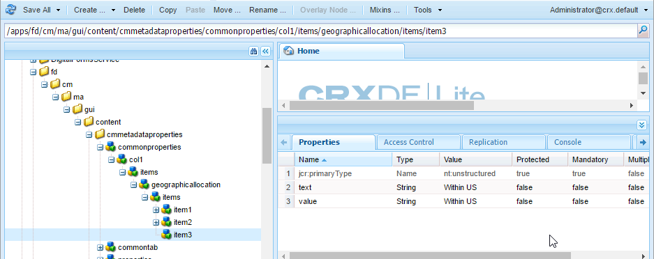

# 新增自訂屬性至通信管理資產{#add-custom-properties-to-correspondence-management-assets}

## 總覽 {#overview}

您可以自訂通信管理使用者介面，並向使用者提供量身打造的屬性和索引標籤集。 此自訂功能包括將自訂欄位/屬性和索引標籤新增至特定資產類型/信函，或所有資產類型和信函。

## 新增自訂屬性至通信管理資產 {#adding-custom-properties-to-correspondence-management-assets}

下列案例顯示如何新增屬性/索引標籤至通信管理資產和信函：

* 新增公用屬性至所有資產類型
* 新增通用索引標籤至所有資產類型
* 新增自訂屬性至特定資產類型

在這些案例中調整屬性、路徑和值後，您可以根據需求將自訂屬性和索引標籤新增至不同的資產集。

### 案例：新增公用欄位（屬性）至所有資產類型 {#scenario-adding-a-common-field-property-to-all-the-asset-types}

此案例顯示如何新增自訂屬性至所有資產類型（文字、清單、條件和版面片段）和字母。 使用此案例，您可以將屬性「收件者位置」新增至所有資產和信函。 收件者屬性的位置有助於識別資產或信函的傳送地理區域與之相關。

>[!NOTE]
>
>如果您已新增自訂屬性，屬性會開始出現在資產建立頁面上。 若要隱藏此類屬性，請參閱在資產建立和屬性頁面上顯示/隱藏自訂屬性。


完成下列步驟，將自訂屬性新增至所有資產類型和信函：

1. 前往 `https://'[server]:[port]'/[ContextPath]/crx/de` 並以管理員身分登入。
1. 在應用程式資料夾中，使用下列步驟建立名為css的資料夾，其路徑/結構類似於css資料夾（位於ccrui資料夾中）:

   1. 按一下右鍵以下路徑上的項資料夾並選擇 **覆蓋節點**:

      `/libs/fd/cm/ma/gui/content/cmmetadataproperties/commonproperties/col1/items`

      

   1. 確定「覆蓋節點」對話方塊有下列值：

      **路徑：** /libs/fd/cm/ma/gui/content/cmmetadataproperties/commonproperties/col1/items

      **位置：** /apps/

      **匹配節點類型：** 已選取

      

   1. 按一下&#x200B;**「確定」**。資料夾結構會在應用程式資料夾中建立。

   1. 按一下 **全部儲存**.

1. 在新建立的項目資料夾下，為所有資產中的自訂屬性新增節點(範例：地理位置)，使用下列步驟：

   1. 按一下右鍵項目資料夾並選擇 **建立** > **建立節點**.

      

   1. 確保「建立節點」對話框具有以下值，然後按一下 **確定**:

      **名稱：** GeoLocation（或您要為此屬性提供的名稱）

      **類型：** nt：非結構化

      

   1. 按一下您建立的新節點（此處為GeoLocation）。 CRX顯示節點的屬性。
   1. 將下列屬性新增至節點（此處為GeoLocation）:

      | **名稱** | **類型** | **值** |
      |---|---|---|
      | fieldLabel | 字串 | 您要提供欄位/屬性的名稱。 (此處：收件者的位置) |
      | 名稱 | 字串 | `./extendedproperties/GeoLocation` （值與您在「項目」節點下建立的欄位名稱相同） |
      | renderReadOnly | 布林值 | true |
      | sling:resourceType | 字串 | `granite/ui/components/coral/foundation/form/textfield` |

   1. 按一下 **全部儲存**.

1. 若要檢視自訂，請將滑鼠移至資產（文字、清單、條件或版面片段）或信函上，按一下 **檢視屬性**，然後按一下 **編輯**. 新欄位（收件者的位置）會顯示在資產/信函屬性的「基本」索引標籤中。

   >[!NOTE]
   >
   >您可能需要先清除瀏覽器快取，才能將自訂項目顯示在UI中。

   

   >[!NOTE]
   >
   >您新增之所有資產的通用屬性會顯示在資產屬性的基本索引標籤中。 依預設，為所有資產新增的通用屬性會出現在屬性頁面和資產建立頁面上。 若要隱藏通用屬性，您必須 <!--link to show / hide properties]-->.

### 案例：新增自訂下拉式清單和值至自訂屬性/欄位 {#scenario-add-custom-drop-down-and-values-to-a-custom-property-field}

此案例顯示如何新增自訂屬性至所有資產類型，以及新增下拉式值至該屬性。

1. 按一下右鍵以下路徑上的項資料夾並選擇 **覆蓋節點**:

   `/libs/fd/cm/ma/gui/content/cmmetadataproperties/commonproperties/col1/items`

1. 在新建立的覆蓋節點下(/apps/fd/cm/ma/gui/content/cmmetadataproperties/commonproperties/col1/items)，為您需要建立下拉式清單的每個屬性（欄位）建立節點(此處 `geographicallocation`)類型nt:unstructured。
1. 將下列屬性新增至節點（此處為地理配置），然後按一下 **全部儲存**:

   <table>
   <tbody>
   <tr>
      <td><strong>名稱</strong></td>
      <td><strong>類型</strong></td>
      <td><strong>值</strong></td>
   </tr>
   <tr>
      <td>fieldLabel</td>
      <td>字串</td>
      <td>您要提供欄位/屬性的名稱。 (此處：地理分配)</td>
   </tr>
   <tr>
      <td>名稱</td>
      <td>字串</td>
      <td>./extendedproperties/geographicallocation（值與您在「項目」節點下建立的欄位名稱相同）</td>
   </tr>
   <tr>
      <td>renderReadOnly</td>
      <td>布林值</td>
      <td>true</td>
   </tr>
   <tr>
      <td>sling:resourceType</td>
      <td>字串</td>
      <td>granite/ui/components/coral/foundation/form/select<br /> </td>
   </tr>
   </tbody>
   </table>

1. 在屬性節點下（此處為地理位置分配），添加名稱為的新節點 `items`. 在「項目」節點下，為下拉式清單中的值新增每個節點。 將第一個節點新增為空白，作為下拉式清單的預設值，以及讓使用者為欄位指定任何值的選項，會是一個正確的作法。 若要新增多個選項/下拉式值，請重複下列步驟：

   1. 按一下右鍵屬性節點（此處為地理分配），然後選擇 **建立** > **建立節點**.
   1. 輸入欄位名稱為 `item1,` 將類型保留為nt:unstructured，然後按一下 **確定**.
   1. 將下列屬性新增至新建立的節點（此處為項目1），然後按一下 **全部儲存**:

      <table>
         <tbody>
         <tr>
          <td><strong>名稱</strong></td>
          <td><strong>類型</strong></td>
          <td><strong>值</strong></td>
         </tr>
         <tr>
          <td>text</td>
          <td>字串</td>
          <td>這是使用者可看見的下拉式選項值。 空白（預設）值請保留空白，或輸入值，例如 <strong>國際</strong> 或 <strong>美國境內</strong>.<br /> </td>
         </tr>
         <tr>
          <td>值</td>
          <td>字串</td>
          <td>儲存在CRXDE中的文本值。 輸入任何唯一關鍵字。 <br /> </td>
         </tr>
         </tbody>
   </table>

   

自訂下拉式清單在資產屬性中顯示如下：


### 案例：所有資產類型的通用索引標籤 {#scenario-common-tab-for-all-asset-types}

此案例顯示如何將自訂索引標籤「收件者」新增至所有資產類型（文字、清單、條件和版面片段）及信函。 「收件者」索引標籤可讓您計畫放置與收件者相關的所有自訂屬性。


您可以依照下列程式，將索引標籤與欄位新增至所有資產：

1. 前往 `https://'[server]:[port]'/[ContextPath]/crx/de` 並以管理員身分登入。
1. 在應用程式資料夾中，使用類似cmmetadataproperties資料夾（位於內容資料夾中）的路徑/結構，建立名為cmmetadataproperties的資料夾：

   1. 按一下右鍵以下路徑的cmmetadataproperties資料夾，然後選擇 **覆蓋節點**:

      `/libs/fd/cm/ma/gui/content/cmmetadataproperties`

      

   1. 確定「覆蓋節點」對話方塊有下列值：

      **路徑：** /libs/fd/cm/ma/gui/content/cmmetadataproperties

      **位置：** /apps/

      **匹配節點類型：** 已選取

   1. 按一下&#x200B;**「確定」**。資料夾結構會在應用程式資料夾中建立。

      

      按一下 **全部儲存**.

1. 在cmmetadataproperties資料夾下，新增節點，以建立所有資產的自訂索引標籤(範例：公用標籤)，請執行下列步驟：

   1. 以滑鼠右鍵按一下cmmetadataproperties資料夾，然後選取 **建立** > **建立節點**.

      

   1. 確保「建立節點」對話框具有以下值，然後按一下 **確定**:

      **名稱：** commontab（或您要為此屬性指定的名稱）

      **類型：** nt：非結構化

   1. 按一下您建立的新節點（此處為公用標籤）。 CRX顯示節點的屬性。
   1. 將下列屬性新增至節點（此處為「公用」索引標籤）:

      <table>
         <tbody>
         <tr>
          <td><strong>名稱</strong></td>
          <td><strong>類型</strong></td>
          <td><strong>值</strong></td>
         </tr>
         <tr>
          <td>jcr:title</td>
          <td>字串</td>
          <td>要指定列的名稱。 (此處：收件者)</td>
         </tr>
         <tr>
          <td>sling:resourceType</td>
          <td>字串</td>
          <td>granite/ui/components/coral/foundation/container<br /> </td>
   </tr>
         </tbody>
       </table>

   1. 按一下 **全部儲存**.

1. 對於在最後一個步驟中建立的頁簽節點（此處為公用頁簽），請使用以下步驟建立名為item的節點：

   1. 按一下右鍵相關節點（此處為「公用」頁簽），然後選擇 **建立** > **建立節點**.
   1. 確保「建立節點」對話框具有以下值，然後按一下 **確定**:

      **名稱：** 項目

      **類型：** nt：非結構化

   1. 按一下 **全部保存：**

1. 在上一步中建立的項節點（公用頁簽下）中，使用以下步驟（要添加更多列，請重複此步驟），在自定義頁簽（公用頁簽）中添加用於建立列的節點（此處為Column1）:

   1. 按一下右鍵項節點並選擇 **建立** > **建立節點**.
   1. 確保「建立節點」對話框具有以下值，然後按一下 **確定**:

      **名稱：** Column1（或您要為節點指定的名稱 — 此名稱不會顯示在使用者介面中。）

      **類型：** nt：非結構化

   1. 將下列屬性新增至節點（此處為Column1），然後按一下 **全部儲存**:

      <table>
         <tbody>
         <tr>
           <td><strong>名稱</strong></td>
           <td><strong>類型</strong></td>
           <td><strong>值</strong></td>
         </tr>
         <tr>
           <td>sling:resourceType</td>
           <td>字串</td>
           <td>granite/ui/components/coral/foundation/container<br /> </td>
         </tr>
         </tbody>
       </table>

1. 在您在上一步驟中建立的節點（此處為Column1）中，使用以下步驟添加名為items的節點：

   1. 按一下右鍵節點（此處為Column1），然後選擇 **建立** > **建立節點**.
   1. 確保「建立節點」對話框具有以下值，然後按一下 **確定**:

      **名稱：** 項目

      **類型：** nt：非結構化

   1. 按一下 **全部儲存**.

1. 若要在自訂索引標籤中建立欄位（此處為收件者），請新增節點（此處為GeorlactionLocation）。 此屬性與您建立的列相對應。 使用下列步驟建立欄位（若要建立更多欄位/節點，請重複這些步驟）。:

   1. 按一下右鍵項節點並選擇 **建立** > **建立節點**.
   1. 確保「建立節點」對話框具有以下值，然後按一下 **確定**:

      **名稱：** GeloralLocation（或欄位屬性的其他名稱）

      **類型：** nt：非結構化

   1. 將下列屬性新增至欄位節點（此處為GeorlactionLocation），然後按一下 **全部儲存**.

      | **名稱** | **類型** | **值** |
      |---|---|---|
      | fieldLabel | 字串 | 收件者的位置（或您要提供欄位的名稱）。 |
      | 名稱 | 字串 | ./extendedproperties/GeorlactionLocation |
      | renderReadOnly | 布林值 | true |
      | sling:resourceType | 字串 | `/libs/granite/ui/components/coral/foundation/form/textfield` |

1. 若要為「信函」新增此索引標籤，請在下列路徑建立具有類似下列項目資料夾之路徑/結構的覆蓋資料夾：

   `/libs/fd/cm/ma/gui/content/cmmetadataproperties/properties/letter/items/tabs/items`

   若要為信函或不同資產建立覆蓋，請使用下列路徑，取代 [assettype] 包含文字、條件、清單、datadictionary或片段：

   `/libs/fd/cm/ma/gui/content/cmmetadataproperties/properties/[assettype]/items/tabs/items`

   1. 按一下右鍵以下路徑上的項資料夾並選擇 **覆蓋節點**:

      `/libs/fd/cm/ma/gui/content/cmmetadataproperties/properties/letter/items/tabs/items`

   1. 確定「覆蓋節點」對話方塊有下列值：

      **路徑：** `/libs/fd/cm/ma/gui/content/cmmetadataproperties/properties/letter/items/tabs/items`

      **位置：** /apps/

      **匹配節點類型：** 已選取

   1. 按一下&#x200B;**「確定」**。資料夾已建立。 按一下 **全部儲存**.

1. 在新建立的項目資料夾中，使用下列步驟，為資產中的自訂索引標籤新增節點（此處為mytab — 此名稱不會顯示在使用者介面中）:

   1. 按一下右鍵項目資料夾並選擇 **建立** > **建立節點**.
   1. 確保「建立節點」對話框具有以下值，然後按一下 **確定**:

      **名稱：** mytab（或您要為此屬性指定的名稱）

      **類型：** nt：非結構化

   1. 按一下您建立的新節點（此處為mytab）。 CRX顯示節點的屬性。
   1. 將下列兩個屬性新增至節點（此處為「自訂」索引標籤）:

      <table>
         <tbody>
         <tr>
           <td><strong>名稱</strong></td>
           <td><strong>類型</strong></td>
           <td><strong>值</strong></td>
         </tr>
         <tr>
           <td>路徑<br /> </td>
           <td>字串</td>
           <td>fd/cm/ma/gui/content/cmmetadatapropertys/commontab<br /> </td>
         </tr>
         <tr>
           <td>sling:resourceType</td>
           <td>字串</td>
           <td>granite/ui/components/coral/foundation/include<br /> </td>
         </tr>
         </tbody>
       </table>

   1. 按一下 **全部儲存**.

1. 若要檢視自訂，請將游標暫留在相關資產上（此處顯示信函），按一下「檢視屬性」，然後按一下 **編輯**. 新的索引標籤（收件者）和欄位（收件者的位置）會顯示在使用者介面中。

   >[!NOTE]
   >
   >您可能需要先清除瀏覽器快取，才能將自訂項目顯示在UI中。

   

### 案例：新增特定資產類型的自訂屬性 {#scenario-adding-custom-properties-for-specific-asset-types}

此案例顯示如何將屬性新增至特定資產類型，例如，將欄位新增至所有文字資產。 使用此程式，您可以將屬性新增至下列其中一項：

* 文字
* 條件
* 清單
* 布局片段
* 資料字典
* 字母

例如，您只想要新增屬性「收件者位置」 ，以識別資產與哪個地理區域相關。  

若要將屬性新增至資產類型，請完成下列步驟：

1. 前往 `https://'[server]:[port]'/[ContextPath]/crx/de` 並以管理員身分登入。
1. 若要在資產類型（例如文字）中建立索引標籤，請在應用程式資料夾中建立下列資料夾結構：

   `/libs/fd/cm/ma/gui/content/cmmetadataproperties/properties/[AssetType]/items/tabs/items`

   [AssetType] =文字、條件、清單、字母、資料字典或片段

   建立此資料夾結構的步驟如下：

   1. 按一下右鍵以下路徑上的項資料夾並選擇 **覆蓋節點**:

      `/libs/fd/cm/ma/gui/content/cmmetadataproperties/properties/[AssetType]/items/tabs/items`

      例如，如果要為文字資產建立屬性，請選取下列資料夾：

      `/libs/fd/cm/ma/gui/content/cmmetadataproperties/properties/text/items/tabs/items`

      

   1. 確定「覆蓋節點」對話方塊有下列值：

      **路徑：** /libs/fd/cm/ma/gui/content/cmmetadatapropertys/properties/[AssetType]/items/tabs/items

      **位置：** /apps/

      **匹配節點類型：** 已選取

   1. 按一下&#x200B;**「確定」**。資料夾結構會在應用程式資料夾中建立。

      按一下 **全部儲存**.

1. 在新建立的項目資料夾中，為資產中的自訂索引標籤新增節點(範例：customtab)，使用下列步驟：

   1. 按一下右鍵項目資料夾並選擇 **建立** > **建立節點**.
   1. 確保「建立節點」對話框具有以下值，然後按一下 **確定**:

      **名稱：** customtab（或您要為此屬性指定的名稱）

      **類型：** nt：非結構化

   1. 按一下您建立的新節點（此處為「自訂」索引標籤）。 CRX顯示節點的屬性。
   1. 將下列兩個屬性新增至節點（此處為「自訂」索引標籤）:

      | **名稱** | **類型** | **值** |
      |---|---|---|
      | sling:resourceType | 字串 | granite/ui/components/coral/foundation/container |
      | jcr:title | 字串 | 使用者介面上欄位的名稱（此處為「我的」索引標籤） |

   1. 按一下 **全部儲存**.

1. 在您在上一步驟中建立的節點（此處為「自訂」索引標籤）中，使用下列步驟新增名為「項目」的節點：

   1. 以滑鼠右鍵按一下節點（此處為「自訂」索引標籤），然後選取 **建立** > **建立節點**.
   1. 確保「建立節點」對話框具有以下值，然後按一下 **確定**:

      **名稱：** 項目

      **類型：** nt：非結構化

   1. 按一下 **全部儲存**.

1. 在您在上一步驟中建立的項目節點（在customtab下）中，使用下列步驟在自訂索引標籤中添加要建立列的節點（此處為Column1）（要添加更多列，請重複此步驟）:

   1. 按一下右鍵項節點並選擇 **建立** > **建立節點**.
   1. 確保「建立節點」對話框具有以下值，然後按一下 **確定**:

      **名稱：** Column1（或要為節點提供的名稱）

      **類型：** nt：非結構化

   1. 將下列屬性新增至節點（此處為Column1），然後按一下 **全部儲存**.

      <table>
         <tbody>
         <tr>
           <td><strong>名稱</strong></td>
           <td><strong>類型</strong></td>
           <td><strong>值</strong></td>
         </tr>
         <tr>
           <td>sling:resourceType</td>
           <td>字串</td>
           <td>granite/ui/components/coral/foundation/container<br /> </td>
         </tr>
         </tbody>
       </table>

1. 對於您建立的每列（如前一步中指定的 — 此處為Column1），請使用以下步驟建立名為item的節點：

   1. 按一下右鍵相關列節點（此處為Column1），然後選擇 **建立** > **建立節點**.
   1. 確保「建立節點」對話框具有以下值，然後按一下 **確定**:

      **名稱：** 項目

      **類型：** nt：非結構化

   1. 按一下 **全部保存：**

1. 對於已建立的每列，在項節點下建立一個節點，以在用戶介面的新頁簽中建立欄位。 重複此步驟，在欄中建立更多欄位：

   1. 按一下右鍵相關節點（此處是「Column1」下的項目），然後選擇 **建立** > **建立節點**.
   1. 確保「建立節點」對話框具有以下值，然後按一下 **確定**:

      **名稱：** 您選擇的名稱（此處為GeoLocation）

      **類型：** nt：非結構化

   1. 將下列屬性新增至節點，然後按一下 **全部儲存**.

      | **名稱** | **類型** | **值** |
      |---|---|---|
      | fieldLabel | 字串 | 收件者的位置（或您要提供欄位的名稱）。 |
      | 名稱 | 字串 | `./extendedproperties/GeoLocation` |
      | renderReadOnly | 布林值 | true |
      | sling:resourceType | 字串 | granite/ui/components/coral/foundation/form/textfield |

1. 若要檢視自訂，請將滑鼠指標暫留在相關資產上（此處顯示文字），按一下「檢視屬性」，然後按一下 **編輯**. 新索引標籤和欄位（收件者的位置）會顯示在使用者介面中。

   >[!NOTE]
   >
   >您可能需要先清除瀏覽器快取，才能將自訂項目顯示在UI中。

   

### 在資產建立頁面上顯示自訂屬性 {#display-custom-properties-on-the-asset-creation-page}

依預設，新增至新索引標籤的自訂屬性只會顯示在屬性頁面上，不會顯示在資產建立頁面上，因為資產建立頁面沒有索引標籤配置。 若要在資產建立頁面上顯示自訂屬性以及其他屬性，您必須執行下列動作：

1. 按一下右鍵以下路徑上的項資料夾並選擇 **覆蓋節點**:

   `/libs/fd/cm/ma/gui/content/createasset/createletter/jcr:content/body/items/form/items/letterWizard/items/properties/items/properties/items/letterproperties/items`

1. 對於字母，請確定「覆蓋節點」對話方塊具有下列值。 對於其他資產類型，下表提供路徑：

   **路徑：** /libs/fd/cm/ma/gui/content/createasset/createteleter/jcr:content/body/items/form/items/letterWizard/items/properties/items/properties/properties/items/letterproperties/items/letterproperties/items

   **位置：** /apps/

   **匹配節點類型：** 已選取

   根據資產類型，路徑必須為下列項目：

   | **資產/檔案類型** | **要添加的路徑** |
   |---|---|
   | 文字 | /libs/fd/cm/ma/gui/content/createasset/createtext/jcr:content/body/items/form/items/textwizard/items/editproperties/items/properties/items/tabs/items/tabs/tab1/items/items/items |
   | 清單 | /libs/fd/cm/ma/gui/content/createasset/createlist/jcr:content/body/items/form/items/listwizard/items/editproperties/items/items/tabs/items/tabs/items/items/items/items/items/items/items/tabs/items/tab1/items |
   | 條件 | /libs/fd/cm/ma/gui/content/createasset/createcondition/jcr:content/body/items/form/items/conditionwizard/items/editproperties/items/properties/items/tabs/items/tabs/items/items/items/items1/items |
   | 片段 | /libs/fd/cm/ma/gui/content/createasset/createfragment/jcr:content/body/items/form/items/fragtwizard/items/properties/properties/items/tabs2/items/tabs1/items |
   | 字母 | /libs/fd/cm/ma/gui/content/createasset/createteleter/jcr:content/body/items/form/items/letterWizard/items/properties/items/properties/properties/items/letterproperties/items/letterproperties/items |

1. 按一下&#x200B;**「確定」**。資料夾結構會在應用程式資料夾中建立。

1. 在您建立的覆蓋項目節點下，建立名稱col4的節點（或任何其他名稱），然後按一下 **全部儲存**.

   例如，以下是為字母建立的覆蓋節點。

   `/apps/fd/cm/ma/gui/content/createasset/createletter/jcr:content/body/items/form/items/letterWizard/items/properties/items/properties/items/letterproperties/items`

1. 將以下屬性添加到新建立的節點（此處為col4），然後按一下 **全部儲存**:

<table>
 <tbody>
  <tr>
   <td><strong>名稱</strong></td>
   <td><strong>類型</strong></td>
   <td><strong>值</strong></td>
  </tr>
  <tr>
   <td>路徑</td>
   <td>字串</td>
   <td><p>此路徑是指向在中建立的列的指針：</p>
    <ul>
     <li>針對所有資產類型的通用索引標籤：/apps/fd/cm/ma/gui/content/cmmetadataproperty/commontab/items/col1</li>
     <li>針對不同資產類型的不同屬性：/apps/fd/cm/ma/gui/content/cmmetadataproperties/properties//items/tabs/items/customtab/items/col1</li>
    </ul> </td>
  </tr>
  <tr>
   <td>sling:resourceType</td>
   <td>字串</td>
   <td> granite/ui/components/coral/foundation/include<br /> </td>
  </tr>
 </tbody>
</table>


自訂屬性，語言，顯示在用於建立信函的UI中

## 自訂清單檢視以顯示自訂屬性 {#customize-the-list-view-to-show-custom-properties}

在您將自訂屬性新增至通信管理資產後，您需要在CRX/DE中進一步變更，以確保自訂屬性顯示在通信管理UI中。

完成下列步驟，在通信管理的資產清單UI中顯示自訂屬性：

1. 前往 `https://'[server]:[port]'/[ContextPath]/crx/de` 並以管理員身分登入。
1. 在應用程式資料夾中建立下列資料夾結構：

   `/libs/fd/cm/ma/gui/content/cmassets/jcr:content/views/lists/columns`

   建立此資料夾結構的步驟如下：

   1. 按一下右鍵以下路徑上的列資料夾，然後選擇 **覆蓋節點**:

      `/libs/fd/cm/ma/gui/content/cmassets/jcr:content/views/lists/columns`

   1. 確定「覆蓋節點」對話方塊有下列值：

      **路徑：** /libs/fd/cm/ma/gui/content/cmassets/jcr:content/views/lists/columns

      **位置：** /apps/

      **匹配節點類型：** 已選取

   1. 按一下&#x200B;**「確定」**。資料夾結構會在應用程式資料夾中建立。

      按一下 **全部儲存**.

1. 對於已建立的每個屬性，在列節點下建立一個節點，以在用戶介面中建立列。 重複此步驟，在UI中建立更多欄：

   1. 按一下右鍵相關節點（欄），然後選取 **建立** > **建立節點**.
   1. 確保「建立節點」對話框具有以下值，然後按一下 **確定**:

      **名稱：** 您選擇的名稱（此處為GeorlactionLocation）

      **類型：** nt：非結構化

   1. 將下列屬性新增至節點，然後按一下 **全部儲存**.

      <table>
         <tbody>
         <tr>
           <td><strong>名稱</strong></td>
           <td><strong>類型</strong></td>
           <td><strong>值</strong></td>
         </tr>
         <tr>
           <td>jcr:primaryType</td>
           <td>名稱</td>
           <td><p>nt:unstructured</p> </td>
         </tr>
         <tr>
           <td>jcr:title</td>
           <td>字串</td>
           <td><p>地理位置</p> <p>此值會顯示為UI中的欄標題。 </p> </td>
         </tr>
         <tr>
           <td>排序</td>
           <td>布林值</td>
           <td><p>true</p> <p>值true表示使用者可以排序此欄中的值。 </p> </td>
         </tr>
         </tbody>
       </table>

1. 在應用程式資料夾中建立下列資料夾結構：

   `/libs/fd/cm/ma/gui/components/admin/childpagerenderer/childlistpage`

   建立此資料夾結構的步驟如下：

   1. 按一下右鍵以下路徑上的列資料夾，然後選擇 **覆蓋節點**:

      `/libs/fd/cm/ma/gui/components/admin/childpagerenderer/childlistpage`

   1. 確定「覆蓋節點」對話方塊有下列值：

      **路徑：** /libs/fd/cm/ma/gui/components/admin/childpagerenderer/childlistpage

      **位置：** /apps/

      **匹配節點類型：** 已選取

   1. 按一下&#x200B;**「確定」**。資料夾結構會在應用程式資料夾中建立。

      按一下 **全部儲存**.

1. 從以下位置複製childlistpage.jsp檔案：

   /libs/fd/cm/ma/gui/components/admin/childpagerenderer/childlistpage/childlistpage.jsp

   將檔案貼到下列位置：

   /apps/fd/cm/ma/gui/components/admin/childpagerenderer/childlistpage/。

1. 開啟childlistpage.jsp檔案(/apps/fd/cm/ma/gui/components/admin/childpagerenderer/childlistpage/childlistpage.jsp)，然後進行以下更改：

   1. 將下列內容新增至檔案的第19行（遵循版權聲明）。

      ```jsp
      <%@page import="java.util.Map"%>
      ```

   1. 將函式的下列程式碼新增至檔案結尾，此函式可取得每個自訂屬性的值：

      ```jsp
      <%!
          private String getCustomPropertyValue(Map<String, Object> extendedProperties, String propertyName) {
      
              String propertyValue = "";
              if (extendedProperties.containsKey(propertyName)) {
                  propertyValue = (String) extendedProperties.get(propertyName);
              }
      
              return propertyValue;
          }
      %>
      ```

   1. 在 &lt;tr> 標籤(&lt;tr attrs.build=&quot;&quot;>>):

      ```jsp
      <%
          String GeoLocation = "";
          if (asset != null) {
                  Map<String, Object> extendedProperties = asset.getExtendedProperties();
                  if (extendedProperties != null) {
                      GeoLocation = getCustomPropertyValue(extendedProperties,"GeoLocation");
                  }
          }
      %>
      ```

      在程式碼中，GeoLocation是您在建立自訂節點/欄位時，在name屬性中設定的值。 建立自訂節點/欄位時，您已使用指定屬性名稱。/extendedproperties/前置詞：./extendedproperties/GeoLocation。 在程式碼中，首碼不是必要的。

   1. 若要在UI中顯示新屬性，請在結尾tr(&lt;/tr>)標籤：

      ```jsp
      <td is="coral-td" value="<%= xssAPI.encodeForHTMLAttr(geographicalLocation) %>"><%= xssAPI.encodeForHTML(geographicalLocation) %></td>
      ```

      若要新增更多欄，請重複步驟6.3和6.4。

   1. 按一下 **全部儲存**.

1. 若要檢視自訂，請開啟檔案片段的清單檢視，或您已新增自訂屬性的信函。

   此程式中新增的UI欄和屬性會針對所有資產類型而顯示。 不過，這些屬性中的值只能針對您原本新增自訂屬性的資產類型輸入並顯示。

   例如，使用藍本：為您新增自訂屬性至文字資產的特定資產類型新增自訂屬性，您只能為文字資產輸入自訂屬性。 不過，如果您在UI中顯示該自訂屬性，則所有資產類型都會顯示欄。

   

1. （選用）依預設，新欄會顯示為UI中的最後一欄。 要使列顯示在特定位置，請將以下屬性添加到列節點：

<table>
 <tbody>
  <tr>
   <td><strong>名稱</strong></td>
   <td><strong>類型</strong></td>
   <td><strong>值</strong></td>
  </tr>
  <tr>
   <td>sling:orderBefore</td>
   <td>字串</td>
   <td><p>路徑"/libs/fd/cm/ma/gui/content/cmassets/jcr:content/views/list/columns"的欄節點名稱，自訂欄需要出現在UI上。</p> <p>在此，如果您希望「地理位置」欄在「版本」欄的前面（左側）顯示，請將屬性sling:orderBefore新增至「地理位置」節點，路徑為「"/apps/fd/cm/ma/gui/content/cmassets/jcr:content/views/list/columns/GeoLocation」，並將屬性值設為版本。</p> </td>
  </tr>
 </tbody>
</table>

當您新增sling:orderBefore屬性以指定欄位時，也需要更新對應的順序 &lt;td> 標籤。 例如，在此情況下，您需要確保 &lt;td> 地理位置標籤放置在 &lt;td> 「版本」欄的標籤：

```xml
<td is="coral-td" value="<%= xssAPI.encodeForHTMLAttr(geographicalLocation) %>"><%= xssAPI.encodeForHTML(geographicalLocation) %></td>
<td is="coral-td" value="<%= xssAPI.encodeForHTMLAttr(version) %>"><%= xssAPI.encodeForHTML(version) %></td>
```

## 啟用自訂屬性搜尋 {#enable-search-for-custom-properties}

依預設，全文搜尋不包含您使用CRX/DE新增至UI的自訂屬性。

若要在搜尋中納入自訂屬性，您需要允許建立自訂屬性的索引。

若要允許建立自訂屬性的索引，請完成下列步驟：

1. 前往 `https://'[server]:[port]'/[ContextPath]/crx/de` 並以管理員身分登入。
1. 前往 `/oak:index/cmLucene`並添加名為 **匯總** 下。

   1. 按一下右鍵cmLucene資料夾並選擇 **建立** > **建立節點**.
   1. 確保「建立節點」對話框具有以下值，然後按一下 **確定**:

      **名稱：** 匯總

      **類型：** nt：非結構化

   1. 按一下 **全部儲存**.

1. 在新建立的匯總資料夾下，新增節點cm:resource。 在cm:resource下，添加名為include0的節點。

   1. 以滑鼠右鍵按一下匯總資料夾並選取 **建立** > **建立節點**. 確保「建立節點」對話框具有以下值，然後按一下 **確定**:

      **名稱：** cm:resource

      **類型：** nt：非結構化

   1. 按一下右鍵cm:resource資料夾，然後選擇 **建立** > **建立節點**. 確保「建立節點」對話框具有以下值，然後按一下 **確定**:

      **名稱：** include0

      **類型：** nt：非結構化

   1. 按一下您建立的新節點（此處包含0）。 CRX顯示節點的屬性。
   1. 將下列屬性新增至節點（此處包含0）:

      <table>
         <tbody>
         <tr>
           <td><strong>名稱</strong></td>
           <td><strong>類型</strong></td>
           <td><strong>值</strong></td>
         </tr>
         <tr>
           <td>路徑</td>
           <td>字串</td>
           <td>extendedProperties<br /> </td>
         </tr>
         </tbody>
       </table>

   1. 按一下 **全部儲存**.

1. 轉至以下位置的屬性，並在其下添加節點位置： `/oak:index/cmLucene/indexRules/cm:resource/properties`

   對您要新增至搜尋的每個自訂屬性重複此步驟。

   1. 按一下右鍵屬性資料夾並選擇 **建立** > **建立節點**.
   1. 確保「建立節點」對話框具有以下值，然後按一下 **確定**:

      **名稱：** 位置（或您要新增至搜尋的自訂屬性名稱）

      **類型：** nt：非結構化

   1. 按一下您建立的新節點（此處位置）。 CRX顯示節點的屬性。
   1. 將下列屬性新增至節點（此處位置）:

      | **名稱** | **類型** | **值** |
      |---|---|---|
      | 分析 | 字串 | true |
      | 名稱 | 字串 | extendedProperties/location（或您要新增至搜尋的屬性名稱） |
      | propertyIndex | 布林值 | true |
      | useInSougkent | 布林值 | true |

   1. 按一下 **全部儲存**.

1. 現在，您可以在全文搜尋中使用自訂屬性值來尋找相關資產。

>[!NOTE]
>
>如果您仍無法搜尋，可能是因為索引問題。 要重新索引，請轉至以下節點，並將屬性「re-index」的值更改為true:
>
>/oak:index/cmLucene」和屬性的變更值

## 更改搜索頁的預設視圖 {#change-default-view-of-the-search-page}

1. 前往 `https://'[server]:[port]'/[ContextPath]/crx/de` 並以管理員身分登入。
1. 在應用程式資料夾中，建立名為list的資料夾，其路徑/結構類似於位於/libs/granite/ui/content/shell/omnisearch/searchresults/singleresults/views中的清單資料夾：

   1. 按一下右鍵以下路徑上的項資料夾並選擇 **覆蓋節點**:

      `/libs/granite/ui/content/shell/omnisearch/searchresults/singleresults/views/list`

   1. 確定「覆蓋節點」對話方塊有下列值：

      **路徑：** /libs/granite/ui/content/shell/omnisearch/searchresults/singleresults/views/list

      **位置：** /apps/

      **匹配節點類型：** 已選取

   1. 按一下&#x200B;**「確定」**。資料夾結構會在應用程式資料夾中建立。

   1. 按一下 **全部儲存**.

1. 在新建立的節點中，列出，添加以下屬性，然後按一下 **全部儲存**:

   <table>
   <tbody>
   <tr>
      <td><strong>名稱</strong></td>
      <td><strong>類型</strong></td>
      <td><strong>值</strong></td>
   </tr>
   <tr>
      <td>sling:orderBefore<br /> </td>
      <td>字串</td>
      <td>卡片</td>
   </tr>
   </tbody>
   </table>

1. 自訂會在「清單」檢視中顯示所有主控台的搜尋結果，包括Forms和檔案、資產和網站。

## 變更資產頁面的預設檢視 {#change-default-view-of-the-assets-page}

>[!NOTE]
>
>這些步驟會變更所有主控台(例如Forms和檔案、資產和網站)的預設檢視。

1. 前往 `https://'[server]:[port]'/[ContextPath]/crx/de` 並以管理員身分登入。
1. 在應用程式資料夾中，建立名為list的資料夾，其路徑/結構類似於位於：

   /libs/fd/cm/ma/gui/content/cmassets/jcr:content/views/

   1. 按一下右鍵以下路徑上的項資料夾並選擇 **覆蓋節點**:

      `/libs/fd/cm/ma/gui/content/cmassets/jcr:content/views/list`

   1. 確定「覆蓋節點」對話方塊有下列值：

      **路徑：** /libs/fd/cm/ma/gui/content/cmassets/jcr:content/views/list

      **位置：** /apps/

      **匹配節點類型：** 已選取

   1. 按一下&#x200B;**「確定」**。資料夾結構會在應用程式資料夾中建立。

   1. 按一下 **全部儲存**.

1. 在新建立的節點中，列出，添加以下屬性，然後按一下 **全部儲存**:

   <table>
   <tbody>
   <tr>
      <td><strong>名稱</strong></td>
      <td><strong>類型</strong></td>
      <td><strong>值</strong></td>
   </tr>
   <tr>
      <td>sling:orderBefore<br /> </td>
      <td>字串</td>
      <td>卡片</td>
   </tr>
   </tbody>
   </table>

1. 清除瀏覽器Cookie或使用瀏覽器的無痕模式來檢視資產。 資產頁面依預設會顯示在卡片版面中。

## 在「資產建立」和「屬性」頁面上顯示/隱藏自訂屬性 {#show-hide-custom-properties-on-asset-creation-and-properties-pages}

若要顯示或隱藏自訂屬性，請完成下列步驟：

1. 在自訂屬性節點（例如地理分配）下，建立一個名為「granite:rendercondition」的「nt:unstructured」類型的新節點。
1. 將下列屬性新增至節點，然後按一下 **全部儲存**:

   <table>
   <tbody>
   <tr>
      <td><strong>名稱</strong></td>
      <td><strong>類型</strong></td>
      <td><strong>值</strong></td>
   </tr>
   <tr>
      <td>sling:resourceType<br /> </td>
      <td>字串</td>
      <td>fd/cm/ma/gui/components/admin/assetsproperties/custompropertyconfig<br /> </td>
   </tr>
   </tbody>
   </table>

1. 若要在資產建立頁面上隱藏此屬性，請新增下列屬性至該屬性，然後按一下 **全部儲存**:

   <table>
   <tbody>
   <tr>
      <td><strong>名稱</strong></td>
      <td><strong>類型</strong></td>
      <td><strong>值</strong></td>
   </tr>
   <tr>
      <td>hideOnCreate<br /> </td>
      <td>布林值</td>
      <td>true<br /> </td>
   </tr>
   </tbody>
   </table>

1. 若要隱藏資產屬性頁面上的自訂屬性，請新增下列屬性至該屬性，然後按一下 **全部儲存**:

   <table>
   <tbody>
   <tr>
      <td><strong>名稱</strong></td>
      <td><strong>類型</strong></td>
      <td><strong>值</strong></td>
   </tr>
   <tr>
      <td>hideOnEdit<br /> </td>
      <td>布林值</td>
      <td>true<br /> </td>
   </tr>
   </tbody>
   </table>

   若要再次顯示值，請將屬性值重設為 `false` 或刪除屬性項。
