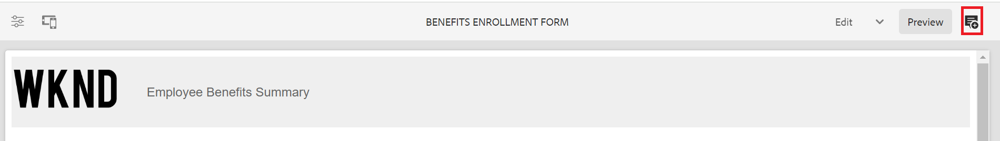
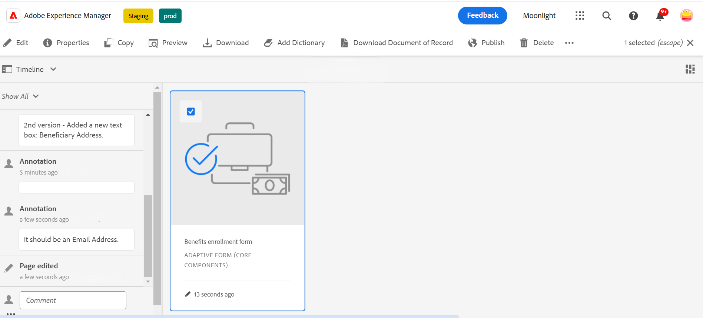

# 最適化表單的版本設定、稽核和註解

<!--
 This feature is under the early adopter program. If you're interested in joining our early access program for this feature, send an email from your official address to aem-forms-ea@adobe.com to request access 
-->

預設不會啟用此功能。 您可以從您的官方地址寫信到aem-forms-ea@adobe.com，以要求存取此功能。

最適化表單核心元件可讓表單作者在表單中新增版本設定、註釋和註解。 這些功能可讓使用者建立並管理多個版本、透過註釋共同作業，以及將附註新增至特定表單區段，藉此簡化表單開發，進而增強表單建置體驗。

請觀看此逐步影片，瞭解最適化表單中的版本設定、註解和註釋功能。

>[!VIDEO](https://video.tv.adobe.com/v/3463265)

## 必備條件 {#prerequisite-versioning}

若要在最適化表單中使用版本設定、註解和附註功能，請確定您的AEM 6.5 Forms環境已啟用[最適化表單核心元件](https://experienceleague.adobe.com/en/docs/experience-manager-65/content/forms/adaptive-forms-core-components/enable-adaptive-forms-core-components)。

## 最適化表單版本設定 {#adaptive-form-versioning}

最適化表單版本設定有助於將版本新增至表單。 表單作者可輕鬆建立多個版本的表單，最後再使用適合業務目標的版本。 此外，表單使用者也可以將表單還原成先前的版本。 它也會協助作者透過預覽來比較表單的任意兩個版本，讓他們更能從UI角度分析表單。 以下逐一介紹各項最適化表單版本設定功能：

### 建立表單版本 {#create-a-form-version}

若要建立表單的版本，請遵循下列步驟：

1. 在您的AEM Forms環境中，導覽至&#x200B;**[!UICONTROL 表單]**>**[!UICONTROL Forms與檔案]**，然後選取您的&#x200B;**表單**。
1. 從左側面板上的選取下拉式清單中，選取&#x200B;**[!UICONTROL 版本]**。
   
1. 按一下左下方面板上的&#x200B;**三個點**，然後按一下&#x200B;**[!UICONTROL [另存為版本]]**。
1. 為表單版本提供標籤，您也可以透過註解新增有關表單的資訊。
   

### 更新表單版本 {#update-a-form-version}

編輯和更新表單後，您會為表單新增版本。 請依照上一節提供的步驟，為表單命名新版本，如影像所示：

### 還原表單版本 {#revert-a-form-version}

若要將表單版本還原成上一個版本，請選取表單版本，按一下&#x200B;**[!UICONTROL 還原成這個版本]**。

### 比較表單版本 {#compare-form-versions}

表單作者可比較兩個不同的表單版本，以供預覽。 若要比較版本，請選取任一表單版本，然後按一下[與目前版本比較]。**** 它會在預覽模式中顯示兩個不同的表單版本。

## 新增註解 {#add-comments}

稽核是一種機制，可讓一或多個稽核者在表單上加上註解。 任何表單使用者都可以評論表單或透過評論來檢閱表單。 若要在表單上加上註解，請選取&#x200B;**[!UICONTROL 表單]**，然後新增&#x200B;**[!UICONTROL 註解]**&#x200B;至表單。

>[!NOTE]
> 如上所述，當您在調適型表單核心元件中使用註解時，表單功能[新增稽核者至表單](/help/forms/using/create-reviews-forms.md)會停用。

## 新增註解 {#adaptive-form-annotations}

在許多情況下，表單群組使用者需要新增註解至表單以供檢閱，例如關於表單的特定標籤或元件。 在這種情況下，作者可以使用註解。
若要將註解新增至表單，請執行下列步驟：

1. 以&#x200B;**[!UICONTROL 編輯]**&#x200B;模式開啟表單。

1. 按一下位於右上邊欄的&#x200B;**新增圖示** （如影像所示）。
   

1. 現在，按一下位於左上邊欄的&#x200B;**新增圖示** （如影像中所指定）以新增註解。
   

1. 現在，您可以新增註解，用多種顏色繪製草圖以形成元件。

1. 若要檢視您在表單中新增的所有註解，請選取您的表單，然後您會看到註解已新增至左側面板，如影像所示。

   

## 另請參閱

* [比較最適化Forms核心元件](/help/forms/using/compare-forms-core-components.md)
