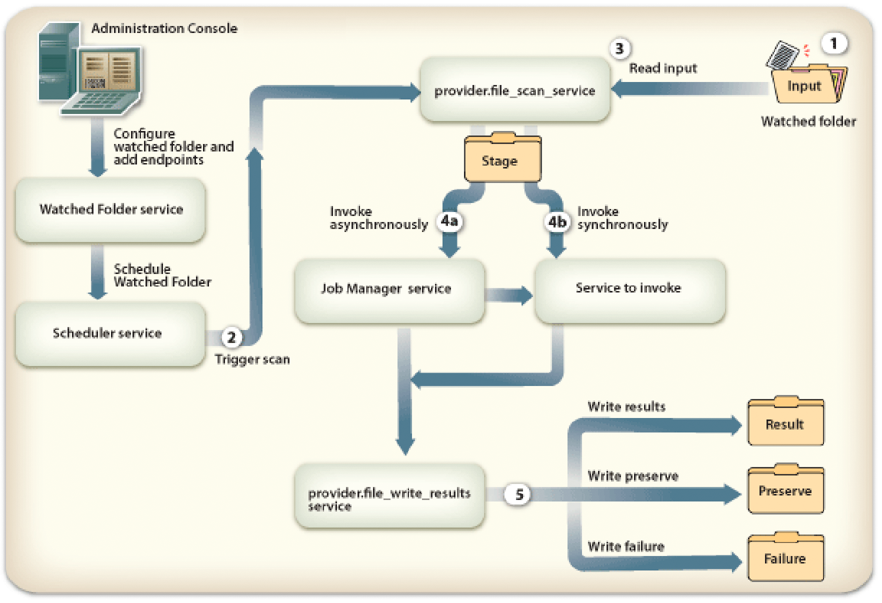
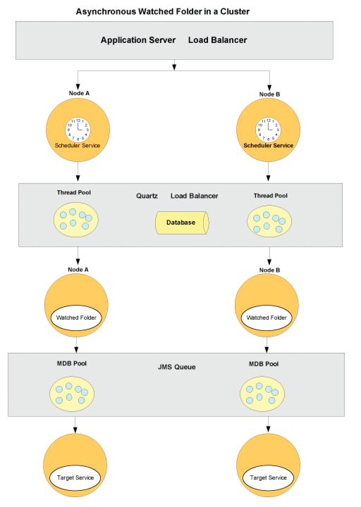

# 配置監視的資料夾端點 {#configuring-watched-folder-endpoints}

管理員可以配置網路資料夾(稱為 *watched資料夾*)，以便當用戶將檔案（如PDF檔案）放置到watched資料夾中時，會調用已配置的服務操作並操作該檔案。 服務執行指定操作後，會將修改的檔案保存到指定的輸出資料夾中。

## 配置Watched資料夾服務 {#configuring-the-watched-folder-service}

在配置監視資料夾端點之前，請配置「監視資料夾」服務。 Watched folder服務的配置參數有兩個用途：

* 要配置所有受監視資料夾端點的通用屬性
* 為所有受監視的資料夾端點提供預設值

配置Watched Folder服務後，您將為目標服務添加Watched folder端點。 添加端點時，可以設定值，如服務名和操作名，以便在檔案或資料夾放置到配置的「監視資料夾」服務的輸入資料夾中時調用。 如需設定Watched資料夾服務的詳細資訊，請參閱「 [Watched資料夾服務」設定](/help/forms/using/admin-help/configure-service-settings.md#watched-folder-service-settings)。

## 建立監看的資料夾 {#creating-a-watched-folder}

您可以透過下列兩種方式建立受監視的檔案夾：

* 配置監視資料夾端點的設定時，在「路徑」框中鍵入父目錄的完整路徑，並附加要建立的監視資料夾的名稱，如以下示例所示：
   `  C:\MyPDFs\MyWatchedFolder`由於MyWatchedFolder資料夾尚不存在，AEM表格會嘗試在該位置建立資料夾。

* 在配置監視資料夾端點之前在檔案系統上建立資料夾，然後在「路徑」框中鍵入完整路徑。

在群集環境中，將用作監視資料夾的資料夾必須在檔案系統或網路上可訪問、可寫和共用。 在這種情況下，群集的每個應用程式伺服器實例都必須具有對同一共用資料夾的訪問權限。

在Windows中，如果應用程式伺服器以服務形式運行，則必須通過以下方式之一以對共用資料夾的適當訪問權限啟動該伺服器：

* 將應用程式伺服器服務「登錄為 **」參數** ，配置為以對共用監視資料夾具有適當訪問權限的特定用戶身份啟動。
* 將應用程式伺服器服務「啟動為本地系統」選項配置為允許服務與案頭交互。 此選項要求共用監視資料夾可供所有人訪問和寫入。

## 將受監視的資料夾連結在一起 {#chaining-together-watched-folders}

可以將受監視資料夾連結在一起，以便一個受監視資料夾的結果文檔是下一個受監視資料夾的輸入文檔。 每個受監視的資料夾都可以叫用不同的服務。 通過以此方式配置受監視的資料夾，可以調用多個服務。 例如，一個受監視的檔案夾可將PDF檔案轉換為Adobe postScript®，而另一個受監視的檔案夾可將PostScript檔案轉換為PDF/A格式。 為此，只需將第一個端點定義的受監視資料夾的 *result* 資料夾設定為指向由第二個端點定義的受監視資料夾的 *input* folder即可。

第一次轉換的輸出將移至\path\result。 第二個轉換的輸入為\path\result，第二個轉換的輸出將移至\path\result\result （或您在「結果資料夾」方塊中為第二個轉換定義的目錄）。

## 使用者如何與受監視的資料夾互動 {#how-users-interact-with-watched-folders}

對於受監視資料夾端點，用戶可以通過複製輸入檔案或資料夾或將其從案頭拖動到受監視資料夾來調用。 檔案會依檔案送達順序處理。

對於受監視資料夾端點，如果作業只需要一個輸入檔案，則用戶可以將該檔案複製到受監視資料夾的根目錄。

如果作業包含多個輸入檔案，使用者必須在包含所有必要檔案的受監視檔案夾階層外部建立檔案夾。 此新資料夾應包含輸入檔案（若程式需要，也可選擇包含DDX檔案）。 建立工作資料夾後，使用者會將它複製至受監視資料夾的輸入資料夾。

>[!NOTE]
>
>請確定應用程式伺服器已刪除對受監視檔案夾中檔案的存取權。 如果AEM表單在掃描後無法從輸入檔案夾刪除檔案，關聯的程式將會無限期地被叫用。

## Watched資料夾輸出 {#watched-folder-output}

當輸入是檔案夾且輸出包含多個檔案時，AEM表單會建立與輸入檔案夾同名的輸出檔案夾，並將輸出檔案複製到該檔案夾。 當輸出包含包含鍵值對的文檔映射（如輸出進程的輸出）時，鍵將用作輸出檔案名。

端點進程產生的輸出檔案名不能包含字母、數字和句點(.)以外的字元在副檔名之前。 AEM表單會將其他字元轉換為其十六進位值。

客戶端應用程式從監視資料夾結果資料夾中拾取結果文檔。 進程錯誤記錄在監視的資料夾故障資料夾中。

## Watched資料夾的運作方式 {#how-watched-folder-works}

Watched folder模組包含以下服務：

* Watched資料夾服務
* provider.file_scan_service
* provider.file_write_results_service

除了上述服務外，Watched folder還依賴於其他服務，包括調度程式服務以調度作業，以及Job manager服務以支援目標服務的非同步調用。

### Watched資料夾如何處理呼叫請求 {#how-watched-folder-processes-an-invocation-request}

Watched folder服務可處理端點的建立、更新和刪除。 管理員建立端點後，會根據指定的重複間隔或cron表達式，將這些端點安排為由調度器服務觸發。

此圖說明Watched folder如何處理呼叫請求。

使用受監視資料夾調用服務的過程如下：

1. 客戶端應用程式將檔案或資料夾放置在監視的資料夾輸入資料夾中。
1. 當作業掃描間隔發生時，調度程式服務會調用provider.file_scan_service來處理輸入資料夾中的檔案或資料夾。
1. provider.file_scan_service會執行下列任務：

   * 掃描輸入資料夾以查找與包含檔案模式匹配的檔案或資料夾，並排除指定的排除檔案模式的檔案或資料夾。 最舊的檔案或檔案夾會先被擷取。 還會選擇比等待時間更早的檔案和資料夾。 在一次掃描中，要處理的檔案或資料夾的數量取決於批處理大小。 有關檔案模式的資訊，請參 [閱關於檔案模式](configuring-watched-folder-endpoints.md#about-file-patterns)。 如需設定批次大小的詳細資訊，請參閱「 [Watched資料夾服務」設定](/help/forms/using/admin-help/configure-service-settings.md#watched-folder-service-settings)。
   * 選取要處理的檔案或檔案夾。 如果檔案或資料夾未完全下載，則會在下次掃描中拾取它們。 為確保資料夾已完全下載，管理員應使用排除檔案模式，以名稱建立資料夾。 資料夾具有所有檔案後，必須將其更名為包含檔案模式中指定的模式。 此步驟可確保資料夾具有調用服務所需的所有必要檔案。 如需確保資料夾已完全下載的詳細資訊，請參 [閱受監視資料夾的提示與秘訣](configuring-watched-folder-endpoints.md#tips-and-tricks-for-watched-folders)。
   * 在選取檔案或檔案夾進行處理後，將檔案或檔案夾移至舞台檔案夾。
   * 根據端點輸入參數映射，將舞台資料夾中的檔案或資料夾轉換為適當的輸入。 如需輸入參數映射的範例，請參閱 [受監視資料夾的提示與秘訣](configuring-watched-folder-endpoints.md#tips-and-tricks-for-watched-folders)。

1. 為端點配置的目標服務將同步或非同步調用。 使用為端點配置的用戶名和密碼調用目標服務。

   * 同步呼叫會直接呼叫目標服務，並立即處理回應。
   * 對於非同步調用，目標服務通過作業管理器服務被調用，該服務將請求放在隊列中。 Job Manager Service則會呼叫provider.file_write_results_service來處理結果。

1. provider.file_write_results_service可處理目標服務調用的響應或失敗。 成功時，輸出將基於端點配置保存到結果資料夾。 如果端點配置為在成功完成時保留結果，則provider.file_write_results_service也會保留源。

   當調用目標服務導致失敗時，provider.file_write_results_service會將失敗原因記錄在failure.log檔案中，並將該檔案放在failure資料夾中。 根據為端點指定的配置參數建立故障資料夾。 當管理員為端點配置設定「保留失敗時」選項時，provider.file_write_results_service也會將源檔案複製到故障資料夾。 有關從故障資料夾恢復檔案的資訊，請參 [閱故障點和恢復](configuring-watched-folder-endpoints.md#failure-points-and-recovery)。

## Watched資料夾端點設定 {#watched-folder-endpoint-settings}

使用下列設定來設定受監視的資料夾端點。

**** 名稱：（必要）識別端點。 請勿包含&lt;字元，因為它會截斷顯示在工作區中的名稱。 如果輸入URL作為端點的名稱，請確保它符合RFC1738中指定的語法規則。

**** 說明：端點的說明。 請勿包含&lt;字元，因為它會截斷Workspace中顯示的說明。

**** 路徑：（必要）指定受監視的資料夾位置。 在群集環境中，此設定必須指向可從群集中的每台電腦訪問的共用網路資料夾。

**** 非同步：將調用類型標識為非同步或同步。 預設值為非同步。 建議對長壽命進程使用非同步，而對瞬態或短壽命進程則建議使用同步。

**** Cron運算式：如果必須使用cron運算式來排程監看的資料夾，請輸入cron運算式。 配置此設定時，將忽略重複間隔。

**** 重複間隔：掃描監視資料夾以進行輸入的間隔（秒）。 除非啟用「限制」設定，否則「重複間隔」應比處理平均作業的時間長；否則，系統可能會超載。 預設值為5。 如需詳細資訊，請參閱批次大小的說明。

**** 重複計數：受監視資料夾掃描資料夾或目錄的次數。 值-1表示無限掃描。 預設值為-1。

**** 限制：選取此選項時，它會限制AEM表單在任何指定時間處理的受監視檔案夾工作數。 作業的最大數量由「批大小」值確定。 （請參閱關於頻寬限制。）

**** 用戶名：（必要）從受監視資料夾叫用目標服務時所使用的使用者名稱。 預設值為SuperAdmin。

**** 域名：（必要）使用者的網域。 預設值為DefaultDom。

**** 批大小：每次掃描要拾取的檔案或資料夾數。 用於防止系統過載；一次掃描太多檔案可能會造成當機。 預設值為2。

「重複間隔」和「批次大小」設定可決定「監視的資料夾」在每次掃描中擷取多少個檔案。 Watched資料夾使用Quartz線程池掃描輸入資料夾。 線程池與其他服務共用。 如果掃描間隔較小，線程將經常掃描輸入資料夾。 如果檔案經常被丟入監視資料夾，則應將掃描間隔保持在較小。 如果檔案不常被丟棄，請使用較大的掃描間隔，以便其他服務可以使用線程。

如果要丟棄的檔案數量很大，請使批處理大小較大。 例如，如果受監視資料夾端點調用的服務每分鐘可處理700個檔案，並且用戶以相同的速率將檔案拖放到輸入資料夾中，則將「批次大小」設定為350，將「重複間隔」設定為30秒，將有助於「監視資料夾」效能，而不會導致經常掃描受監視資料夾的成本。

當檔案拖放至受監視的檔案夾時，會列出輸入中的檔案，如此一來，當每秒都有掃描時，就會降低效能。 增加掃描間隔可以改善效能。 如果要丟棄的檔案體積較小，請相應調整「批次大小」和「重複間隔」。 例如，如果每秒丟棄10個檔案，請嘗試將「重複間隔」設定為1秒，將「批次大小」設定為10。

**** 等待時間：建立資料夾或檔案後掃描檔案之前等待的時間（以毫秒為單位）。 例如，如果等待時間為3,600,000毫秒（1小時），而檔案是在一分鐘前建立的，則此檔案會在59分鐘或更久之後被擷取。 預設值為0。

此設定對於確保檔案或資料夾被完全複製到輸入資料夾非常有用。 例如，如果要處理大檔案，而要下載該檔案需要10分鐘，請將等待時間設定為10&amp;ast;60 &amp;ast;1000毫秒。 如果檔案未保存10分鐘，則禁止監視資料夾掃描檔案。

******排除檔案模式：分號**;已分隔的模式清單，監視資料夾用來判斷要掃描和擷取的檔案和檔案夾。 不會掃描任何具有此模式的檔案或資料夾以進行處理。

當輸入是包含多個檔案的檔案夾時，此設定很實用。 資料夾的內容可以複製到名稱由受監視資料夾挑選的資料夾中。 這可防止被監視的資料夾在完全複製到輸入資料夾之前拾取要處理的資料夾。

您可以使用檔案模式來排除：

* 具有特定檔案副檔名的檔案；例如，&amp;ast;.dat、&amp;ast;.xml、&amp;ast;.pdf。
* 具有特定名稱的檔案；例如，資料。&amp;ast;將排除名為 *data1*、 *data2*&#x200B;等的檔案和資料夾。
* 名稱和副檔名中包含複合表達式的檔案，如下例所示：

   * 資料[0-9][0-9][0-9]。[dD][aA][tT]
   * &amp;ast;。[dD][Aa][Tt]
   * &amp;ast;。[Xx]毫[米][Ll]

有關檔案模式的詳細資訊，請參 [閱關於檔案模式](configuring-watched-folder-endpoints.md#about-file-patterns)。

******包含檔案模式：（必填）分號**;已分隔的模式清單，該清單是受監視的資料夾用來判斷要掃描和擷取的資料夾和檔案。 例如，如果「包含檔案模式」是input&amp;ast;，則所有與input&amp;ast匹配的檔案和資料夾；都被撿起來了。 這包括名為input1、input2等的檔案和資料夾。

預設值為&amp;ast;並指示所有檔案和資料夾。

您可以使用檔案模式來包含：

* 具有特定檔案副檔名的檔案；例如，&amp;ast;.dat、&amp;ast;.xml、&amp;ast;.pdf。
* 具有特定名稱的檔案；例如，資料。&amp;ast;會包含名為 *data1*、 *data2*&#x200B;等的檔案和資料夾。
* 名稱和副檔名中包含複合表達式的檔案，如下例所示：

   * 資料[0-9][0-9][0-9]。[dD][aA][tT]
   * &amp;ast;。[dD][Aa][Tt]
   * &amp;ast;。[Xx]毫[米][Ll]

有關檔案模式的詳細資訊，請參 [閱關於檔案模式](configuring-watched-folder-endpoints.md#about-file-patterns)。

**** 結果資料夾：儲儲存存結果的資料夾。 如果結果未顯示在此資料夾中，請檢查失敗資料夾。 只讀檔案不會被處理，並將保存在失敗資料夾中。 此值可以是具有下列檔案模式的絕對或相對路徑：

* %F =檔案名前置詞
* %E =副檔名
* %Y =年（已滿）
* %y =年（最後兩位）
* %M =月
* %D =月中的某天
* %d =年
* %H =小時（24小時時鐘）
* %h =小時（12小時時鐘）
* %m =分鐘
* %s =秒
* %l =毫秒
* %R =隨機數（介於0和9之間）
* %P =進程或作業ID

例如，如果是2009年7月17日的8 PM，而您指定 `C:/Test/WF0/failure/%Y/%M/%D/%H/`，則結果資料夾為 `C:/Test/WF0/failure/2009/07/17/20`。

如果路徑不是絕對的，而是相對的，則會在監視的資料夾內建立資料夾。 預設值為result/%Y/%M/%D/，即監視資料夾內的「結果」資料夾。 有關檔案模式的詳細資訊，請參 [閱關於檔案模式](configuring-watched-folder-endpoints.md#about-file-patterns)。

***注意&#x200B;**:結果資料夾的大小越小，「監視資料夾」的效能就越好。 例如，如果監視資料夾的預估負載是每小時1000個檔案，請嘗試類似模式，`result/%Y%M%D%H`以便每小時建立新的子資料夾。 如果載入較小（例如，每天1000個檔案），您可使用類似的模式`result/%Y%M%D`。*

**** 保留資料夾：成功掃描和拾取檔案後儲存檔案的位置。 路徑可以是絕對路徑、相對路徑或空目錄路徑。 可以使用檔案模式，如「結果資料夾」中所述。 預設值為preserve/%Y/%M/%D/。

**** 故障資料夾：保存失敗檔案的資料夾。 此位置始終相對於監視的資料夾。 可以使用檔案模式，如「結果資料夾」中所述。

只讀檔案不會被處理，並將保存在失敗資料夾中。

預設值為failure/%Y/%M/%D/。

**** 失敗時保留：在無法對服務執行操作時保留輸入檔案。 預設值為true。

**** 覆寫重複的檔案名稱：當設定為True時，將覆蓋結果資料夾和保留資料夾中的檔案。 當設定為False時，名稱將使用帶有數字索引尾碼的檔案和資料夾。 預設值為False。

**** 清除持續時間：（必要）結果資料夾中的檔案和資料夾在早於此值時被清除。 此值以天計。 此設定在確保結果資料夾未滿時非常有用。

值為-1天表示從不刪除結果資料夾。 預設值為-1。

**** 操作名稱：（必要）可指派給受監視資料夾端點的操作清單。

**** 輸入參數映射：用於配置處理服務和操作所需的輸入。 可用的設定取決於使用監視資料夾端點的服務。 以下是兩種輸入：

**** 常值：監看資料夾會使用在顯示欄位中輸入的值。 支援所有基本的Java類型。 例如，如果API使用輸入（例如String、long、int和Boolean），則字串將轉換為正確的類型並調用服務。

**** 變數：輸入的值是受監視資料夾用於選擇輸入的檔案模式。 例如，在加密密碼服務（其中輸入文檔必須是PDF檔案）中，用戶可以使用&amp;ast;.pdf作為檔案模式。 監視資料夾將拾取監視資料夾中與此模式匹配的所有檔案，並調用每個檔案的服務。 使用變數時，所有輸入檔案都會轉換為檔案。 僅支援使用「檔案」作為輸入類型的API。

**** 輸出參數映射：用於配置服務和操作的輸出。 可用的設定取決於使用監視資料夾端點的服務。

「監看資料夾」輸出可以是單一檔案、檔案清單或檔案地圖。 然後，這些輸出文檔將使用在「輸出參數映射」中指定的模式保存在結果資料夾中。

**注意**:指 *定可產生唯一輸出檔名的名稱可改善效能。 例如，假設服務返回一個輸出文檔，而「輸出參數映射」將其映射到`%F.%E`（輸入檔案的檔案名和副檔名）。 在這種情況下，如果用戶每分鐘都刪除具有相同名稱的檔案，並將結果資料夾配置為`result/%Y/%M/%D`，且「覆寫重複檔案名」設定關閉，則「監視資料夾」將嘗試解析重複檔案名。 解析重複檔案名的過程可能會影響效能。 在此情況下，將「輸出參數映射」變更`%F_%h_%m_%s_%l`為將小時、分鐘、秒和毫秒添加到名稱中，或者確保刪除的檔案具有唯一的名稱可能會提高效能。*

## 關於檔案模式 {#about-file-patterns}

管理員可以指定可叫用服務的檔案類型。 可為每個受監視的資料夾建立多個檔案模式。 檔案模式可以是下列檔案屬性之一：

* 具有特定檔案名副檔名的檔案；例如&amp;ast;.dat、&amp;ast;.xml、&amp;ast;.pdf;
* 具有特定名稱的檔案；例如，資料。&amp;ast;
* 名稱和副檔名中包含複合表達式的檔案，如下例所示：

   * 資料[0-9][0-9][0-9]。[dD][aA][tT]
   * &amp;ast;。[dD][Aa][Tt]
   * &amp;ast;。[Xx]毫[米][Ll]

管理員可以定義輸出資料夾的檔案模式，以儲存結果。 對於輸出資料夾（結果、保留和失敗），管理員可以指定以下任一檔案模式：

* %Y =年（已滿）
* %y =年（最後兩位）
* %M =月、
* %D =月中的某天，
* %d =年份中的某天，
* %h =小時，
* %m =分鐘，
* %s =秒，
* %R = 0-9之間的隨機數
* %J =作業名稱

例如，結果資料夾的路徑可能是 `C:\Adobe\Adobe_Experience_Manager_forms\BarcodedForms\%y\%m\%d`。

輸出參數映射也可以指定其他模式，例如：

* %F =源檔案名
* %E =源檔案名副檔名

如果輸出參數映射模式以&quot;File.separator&quot;（路徑分隔符）結尾，則會建立一個資料夾並將內容複製到該資料夾中。 如果模式未以&quot;File.separator&quot;結束，則會以該名稱建立內容（結果檔案或資料夾）。 如需輸出參數映射的詳細資訊，請參 [閱監看資料夾的提示與秘訣](configuring-watched-folder-endpoints.md#tips-and-tricks-for-watched-folders)。

## 關於頻寬限制 {#about-throttling}

為監視資料夾端點啟用頻寬限制時，它會限制在任何指定時間可處理的監視資料夾作業數。 作業的最大數量由批次大小值確定，該值也可在「監視資料夾」端點中配置。 達到限制限制時，將不會輪詢監視資料夾輸入目錄中的傳入文檔。 在完成其他受監視資料夾作業並進行另一次輪詢嘗試之前，這些文檔還將保留在輸入目錄中。 在同步處理的情況下，在單輪詢中處理的所有作業都將計入限制，即使作業在單個線程中連續處理。

>[!NOTE]
>
>頻寬限制不會隨群集而擴展。 啟用頻寬限制時，集群整體處理的作業數不會超過「批大小」中指定的任何給定時間。 此限制是整個群集的，並非群集中每個節點的特定限制。 例如，如果批處理大小為2，則單個節點處理兩個作業時可以達到限制限制，而且在完成一個作業之前，其他節點都不會輪詢輸入目錄。

### 調節的運作方式 {#how-throttling-works}

「監視資料夾」在每個「重複間隔」掃描輸入資料夾，選擇「批次大小」中指定的檔案數，並為每個檔案調用目標服務。 例如，如果「批次大小」為4，則在每次掃描時，「監視資料夾」會擷取4個檔案、建立4個呼叫請求並叫用目標服務。 在完成這些請求之前，如果調用「監視資料夾」，則無論前四個作業是否完成，它都將重新啟動四個作業。

調節功能可防止「監視資料夾」在先前的作業未完成時調用新作業。 「監視資料夾」將檢測正在進行的作業，並根據批處理大小減去正在進行的作業來處理新作業。 例如，在第二次調用中，如果完成的作業數只有3個，而一個作業仍在進行中，則「監視資料夾」只調用3個作業。

* 「監視資料夾」依賴於舞台資料夾中存在的檔案數，以瞭解正在進行的作業數。 如果檔案在舞台檔案夾中仍未處理，「監看的檔案夾」將不會叫用任何其他工作。 例如，如果批處理大小為4且3個作業已停止，「監視資料夾」在後續調用中將只調用一個作業。 有多種情形會導致檔案在舞台檔案夾中仍未處理。 當作業停止時，管理員可以終止表單工作流程管理頁面上的程式，讓「監視資料夾」將檔案移出舞台資料夾。
* 如果表單伺服器在「監視資料夾」可以調用作業之前關閉，管理員可以將檔案移出舞台資料夾。 有關資訊，請參 [閱故障點和恢復](configuring-watched-folder-endpoints.md#failure-points-and-recovery)。
* 如果Forms伺服器正在運行，但Job manager服務回叫時Watched folder沒有運行（當服務未按順序啟動時），管理員可以將檔案移出舞台資料夾。 有關資訊，請參 [閱故障點和恢復](configuring-watched-folder-endpoints.md#failure-points-and-recovery)。

## 效能與擴充能力 {#performance-and-scalability}

Watched資料夾可在單一節點上共提供100個資料夾。 「監視資料夾」的效能取決於表單伺服器的效能。 對於非同步調用，效能更依賴於「作業管理器」隊列中的系統負載和作業。

向群集添加節點可以改善Watched資料夾效能。 通過Quartz調度器和Job manager服務在非同步請求的情況下，監視的資料夾作業分佈在群集節點上。 所有作業都保存在資料庫中。

Watched folder取決於調度程式服務來調度、取消調度和重新調度作業。 其他服務（如事件管理服務、用戶管理器服務和電子郵件提供程式服務）可共用調度程式服務線程池。 這會影響「監視資料夾」的效能。 當所有服務都開始使用調度程式服務線程池時，將需要調整調度程式服務線程池。

## 集群中的監視資料夾 {#watched-folders-in-a-cluster}

在群集中，Watched folder取決於Quartz調度程式和Job Manager服務，以實現負載平衡和故障切換。 有關Quartz群集行為的詳細資訊，請參 [閱Quartz Documentation](https://www.quartz-scheduler.org/documentation)。

Watched folder會在每次民調問答中執行下列三項主要工作：

* 掃描資料夾
* 叫用目標服務
* 處理結果

負載平衡和故障轉移行為會根據監視資料夾的配置是同步還是非同步調用而改變。

### 群集中的同步監視資料夾 {#synchronous-watched-folder-in-a-cluster}

對於同步調用，Quartz負載平衡器決定哪個節點將獲得輪詢事件。 獲取輪詢事件的節點將執行所有任務：掃描資料夾、叫用目標服務並處理結果。

對於同步調用，當一個節點出現故障時，Quartz調度器將新輪詢事件發送到其他節點。 在失敗節點上啟動的調用將丟失。 有關如何恢復與失敗作業關聯的檔案的詳細資訊，請參 [閱故障點和恢復](configuring-watched-folder-endpoints.md#failure-points-and-recovery)。

### 叢集中的非同步監視資料夾 {#asynchronous-watched-folder-in-a-cluster}

對於非同步調用，Quartz負載平衡器決定哪個節點將獲得輪詢事件。 獲取輪詢事件的節點將掃描輸入資料夾並調用目標服務，方法是將請求放在「作業管理器」服務隊列中。 作業管理器服務負載平衡器負責決定哪個節點將處理調用請求。 即使節點A建立了調用請求，節點B也有可能最終處理該請求。 或者，啟動調用請求的節點也可能最終處理請求。

對於非同步調用，當一個節點出現故障時，Quartz調度器將新輪詢事件發送到其他節點。 在失敗節點上建立的調用請求將位於「作業管理器」服務隊列中，並將發送到其他節點進行處理。 未為其建立調用請求的檔案將保留在階段資料夾中。 有關如何恢復與失敗作業關聯的檔案的詳細資訊，請參 [閱故障點和恢復](configuring-watched-folder-endpoints.md#failure-points-and-recovery)。

## 故障點和恢復 {#failure-points-and-recovery}

在每個民調問答事件中，「Watched資料夾」會鎖定輸入資料夾、將符合包含檔案模式的檔案移至舞台資料夾，然後解除鎖定輸入資料夾。 需要鎖定，這樣兩個線程就不會提取同一組檔案並處理它們兩次。 發生這種情況的機率會隨著小重複間隔和大批量而增加。 將檔案移動到舞台資料夾後，輸入資料夾將被解鎖，以便其他線程可以掃描該資料夾。 此步驟有助於提供高吞吐量，因為其他線程可以在一個線程處理檔案時進行掃描。

將檔案移動到舞台資料夾後，將為每個檔案建立調用請求，並調用目標服務。 有時候，「監視資料夾」無法恢復舞台資料夾中的檔案：

* 如果伺服器在「監視資料夾」建立調用請求之前關閉，則舞台資料夾中的檔案將保留在舞台資料夾中，並且不會恢復。
* 如果「監視資料夾」已成功為舞台資料夾中的每個檔案建立調用請求，並且伺服器崩潰，則基於調用類型有兩種行為：

**** 同步：如果「監視資料夾」設定為同步叫用服務，則舞台資料夾中的所有檔案在舞台資料夾中仍未處理。

**** 非同步：在這種情況下，「監視資料夾」依賴於「作業管理器」服務。 如果作業管理器服務回叫「監視資料夾」，則舞台資料夾中的檔案會根據呼叫結果移至「保留」或「失敗」資料夾。 如果作業管理員服務未回叫「監視資料夾」，則檔案在「階段」資料夾中仍將保留未處理。 當「作業管理員」回呼時，「監視資料夾」未執行時，就會發生這種情況。

### 在階段資料夾中恢復未處理的源檔案 {#recovering-unprocessed-source-files-in-the-stage-folder}

當「監視資料夾」無法處理舞台資料夾中的來源檔案時，您可以復原未處理的檔案。

1. 重新啟動應用程式伺服器或節點。
1. （可選）停止「監看的資料夾」處理新的輸入檔案。 如果您略過此步驟，將更難判斷哪些檔案在舞台檔案夾中未處理。 若要防止「監視資料夾」處理新的輸入檔案，請執行下列任一項工作：

   * 在「應用程式與服務」中，將受監視資料夾端點的「包含檔案模式」參數變更為不符合任何新輸入檔案的項目(例如，輸入 `NOMATCH`)。
   * 暫停正在建立新輸入檔案的進程。
   請等到AEM表單恢復並處理所有檔案。 大部分的檔案都應該復原，而且任何新的輸入檔案都應正確處理。 您等待Watched資料夾恢復和處理檔案的時間長度取決於要調用的操作長度和要恢復的檔案數。

1. 決定哪些檔案無法處理。 如果您等了適當的時間並完成上一步驟，而且舞台檔案夾中仍保留未處理的檔案，請前往下一個步驟。

   >[!NOTE]
   >
   >您可以查看舞台目錄中檔案的日期和時間戳。 您可以根據檔案的數量和正常處理時間來判斷哪些檔案已過時，可視為卡住。

1. 將未處理檔案從舞台目錄複製到輸入目錄。
1. 如果您在步驟2中阻止「監視資料夾」處理新的輸入檔案，請將「包含檔案模式」變更為其上一個值，或重新啟用您停用的程式。

## 受監視資料夾的安全注意事項 {#security-considerations-for-watched-folders}

每個受監視的資料夾都配置了用戶名和密碼。 這些憑證會在叫用服務時使用。 Watched folder依賴於共用資料夾受到基礎安全檔案系統保護的事實，因此只有受監視資料夾的所有者才能訪問共用資料夾。

## 受監視資料夾的提示與秘訣 {#tips-and-tricks-for-watched-folders}

以下是設定「Watched Folder」端點時的一些提示和秘訣：

* 如果您在Windows上有一個正在處理影像檔案的監視資料夾，請為「包含檔案模式」或「排除檔案模式」選項指定值，以防止Windows自動產生的Thumbs.db檔案被監視資料夾輪詢。
* 如果指定cron運算式，則會忽略重複間隔。 cron表達式的使用基於Quartz開源作業調度系統1.4.0版。
* 批大小是在監視資料夾的每次掃描中將拾取的檔案或資料夾的數量。 如果批處理大小設定為兩個檔案或資料夾，則在監視的資料夾輸入資料夾中放置10個檔案或資料夾，則每次掃描中只會拾取兩個檔案或資料夾。 在下次掃描中（將在重複間隔中指定的時間之後發生），將會拾取下兩個檔案。
* 對於檔案模式，管理員可以指定規則運算式，並新增對萬用字元模式的支援，以指定檔案模式。 Watched folder會修改規則運算式，以支援萬用字元模式，例如&amp;ast;。&amp;ast;或&amp;ast;.pdf。 規則運算式不支援這些萬用字元模式。
* Watched folder會掃描輸入資料夾以進行輸入，在開始處理檔案或資料夾之前，不知道來源檔案或資料夾是否已完全複製到輸入資料夾。 要確保在拾取檔案或資料夾之前將源檔案或資料夾完全複製到監視資料夾的輸入資料夾，請執行以下任務：

   * 使用等待時間，即「監視資料夾」從上次修改時間等待的時間（以毫秒為單位）。 如果您有大型檔案要處理，請使用此功能。 例如，如果下載檔案需要10分鐘，請將等待時間指定為10&amp;ast;60 &amp;ast;1000毫秒。 如果「監視資料夾」的檔案沒有10分鐘的舊檔案，則此操作將阻止該檔案被拾取。
   * 使用排除檔案模式並包含檔案模式。 例如，如果排除檔案模式為 `ex*` ，而包含檔案模式為 `in*`,Watched資料夾會擷取以&quot;in&quot;開頭的檔案，而不會擷取以&quot;ex&quot;開頭的檔案。 若要複製大型檔案或檔案夾，請先重新命名檔案或檔案夾，讓名稱以&quot;ex&quot;開頭。 名為&quot;ex&quot;的檔案或檔案夾完全複製至受監視的檔案夾後，將它重新命名為&quot;in&amp;ast;&quot;。

* 使用清除持續時間來保持結果資料夾的乾淨。 「Watched Folder」（監視的資料夾）會清除清除清除持續時間中提及的時間之前的所有檔案。 持續時間以天為單位。
* 新增「監視資料夾」端點時，在選取作業名稱后，會填入輸入參數映射。 對於操作的每個輸入，產生一個輸入參數映射欄位。 以下是輸入參數映射的範例：

   * 輸 `com.adobe.idp.Document` 入：如果服務操作具有類型輸入 `Document`，管理員可以將映射類型指定為 `Variable`。 Watched folder會根據為輸入參數指定的檔案模式，從Watched folder的輸入資料夾中擷取輸入。 如果管理員指 `*.pdf` 定為參數，則每個副檔名為。pdf的檔案都會被擷取、轉換為，並 `com.adobe.idp.Document`呼叫服務。
   * 輸 `java.util.Map` 入：如果服務操作具有類型輸入 `Map`，則管理員可以將映射類型指定 `Variable` 為，並輸入具有類似模式的映射值 `*.pdf`。 例如，服務需要兩個物件的地圖， `com.adobe.idp.Document` 這些物件代表輸入資料夾中的兩個檔案，例如1.pdf和2.pdf。 Watched folder會建立以索引鍵作為檔案名稱的地圖，以值作為 `com.adobe.idp.Document`。
   * 輸 `java.util.List` 入：如果服務操作的輸入類型為「清單」，管理員可以將映射類型指 `Variable` 定為，並輸入具有類似模式的映射值 `*.pdf`。 當PDF檔案拖放至輸入檔案夾時，「Watched檔案夾」會建立代表這些檔案的 `com.adobe.idp.Document` 物件清單，並叫用目標服務。
   * 針對 `java.lang.String`:管理員有兩個選項。 首先，管理員可以將映射類型指定為 `Literal` ，並輸入映射值作為字串，如「 `hello.` Watched Folder」（監視資料夾）將用字串調用服務 `hello`。 其次，管理員可以將映射類型指定為 `Variable` ，並輸入具有類似模式的映射值 `*.txt`。 在後一種情況下，副檔名為。txt的檔案將會讀取為強制為字串的檔案，以叫用服務。
   * Java基本類型：管理員可以將映射類型指定 `Literal` 為並提供值。 「監視資料夾」會以指定的值叫用服務。

* Watched folder是用來處理檔案的。 支援的輸 `com.adobe.idp.Document`出是 `org.w3c.Document`、 `org.w3c.Node`以及這些類型的清單和映射。 任何其他類型都會導致失敗資料夾中的失敗輸出。
* 如果結果不在結果資料夾中，請驗證failure資料夾以查看是否發生了故障。
* 如果在非同步模式中使用，「Watched資料夾」的運作效果最佳。 在此模式下，Watched folder會將呼叫請求置入佇列並回叫。 然後，會以非同步方式處理佇列。 未設定「非同步」選項時，「監視資料夾」會同步叫用目標服務，而「流程引擎」會等待服務完成並產生請求結果。 如果目標服務處理請求需要很長時間，「監視資料夾」可能會出現逾時錯誤。
* 建立用於導入和導出操作的受監視資料夾不允許抽象檔案名。 當使用受監視的資料夾調用「表單資料整合」服務時，輸出檔案的檔案副檔名類型可能與文檔對象類型的預期輸出格式不匹配。 例如，如果調用導出操作的監視資料夾的輸入檔案是包含資料的XFA表單，則輸出應是XDP資料檔案。 要獲得具有正確檔案副檔名的輸出檔案，可以在輸出參數映射中指定該檔案。 在此示例中，可以使用%F.xdp進行輸出參數映射。
* 「監視的資料夾」可能會在輸入檔案被完全複製至資料夾之前，先加以處理。 在UNIX上，檔案鎖定不是強制的，因為它在Windows上。 因此，當檔案複製至受監視的檔案夾時，「受監視的檔案夾」可能會將檔案移至舞台，而不需等待檔案復本完成。 此行為僅會處理部分輸入檔案。 目前有兩種解決方法：

   * 解決方法1

      1. 指定「排除檔案模式」的模式，例如temp&amp;ast;.ps。
      1. 將以temp（例如temp1.ps）開頭的檔案複製到受監視的檔案夾。
      1. 將檔案完全複製到監視資料夾後，更名檔案，使其與為「包括檔案模式」指定的模式相對應。 接著，「Watched Folder」（監視資料夾）將完成的檔案移至舞台。
   * 解決方法2

      如果您知道將檔案複製到受監視檔案夾所需的最長時間，請指定「等待時間」的秒數。 然後，「監視資料夾」會等待指定的時間長度，再將檔案移至舞台。

      Windows上的檔案不會出現此問題，因為Windows在寫入一個線程時鎖定檔案。 但是，Windows上的資料夾發生此問題。 對於資料夾，必須遵循解決方法1中的步驟。

* 如果「監視資料夾」的「保留資料夾名稱」端點屬性設定為空目錄路徑，則不會按照應該清除的方式清除轉移目錄。 目錄仍包含已處理的檔案和臨時資料夾。

## 受監控資料夾的服務特定建議 {#service-specific-recommendations-for-watched-folders}

對於所有服務，您應調整受監視檔案夾的批次大小和重複間隔，讓「受監視檔案夾」擷取新檔案和檔案夾以進行處理的速率不會超過AEM表單伺服器可處理的工作速率。 實際使用的參數可能因配置的監視資料夾數、使用監視資料夾的服務以及處理器上作業的密集程度而異。

### 產生PDF服務建議 {#generate-pdf-service-recommendations}

* 「產生PDF」服務一次只能針對下列檔案類型轉換一個檔案：Microsoft Word、Microsoft Excel、Microsoft powerPoint、Microsoft Project、AutoCAD、Adobe Photoshop®、Adobe FrameMaker®和Adobe pageMaker®。 這些是長期存在的工作；因此，請務必將批次大小保持在低設定。 如果群集中有更多節點，還會增加重複間隔。
* 對於PostScript(PS)、封裝的PostScript(EPS)和影像檔案類型，「產生PDF」服務可以並行處理多個檔案。 您應根據伺服器的容量和群集中的節點數，小心調整會話Bean池大小（該大小控制將並行進行的轉換數）。 然後，將批處理大小增加到與您嘗試轉換的檔案類型的會話Bean池大小相等的數字。 輪詢頻率應由群集中的節點數決定；不過，由於「產生PDF」服務處理這類工作的速度相當快，因此您可以將重複間隔設定為低值，例如5或10。
* 雖然「產生PDF」服務一次只能轉換一個OpenOffice檔案，但轉換速度相當快。 PS、EPS和影像轉換的上述邏輯也適用於OpenOffice轉換。
* 為了在集群中實現均勻的負載分配，請保持批量小並增加重複間隔。

### 編碼表單服務建議 {#barcoded-forms-service-recommendations}

* 為了在處理條形碼表單（小檔案）時獲得最佳效能，請輸入「批 `10` 次大小」和「重 `2` 復間隔」。
* 當許多檔案放在輸入資料夾中時，可能會發生名為 *thumbs.db的隱藏檔案錯誤* 。 因此，建議將包含檔案的「包含檔案模式」設定為為輸入變數指定的相同值(例如 `*.tiff`)。 這會使「監視資料夾」無法處理資料庫檔案。
* 批次大小值和重複 `5` 間隔的值通 `2` 常都足夠，因為Barcoded Forms服務通常需要大約0.5秒來處理一個條形碼。
* 「監視資料夾」不會等到「進程引擎」完成作業後，再選擇新檔案或資料夾。 它會持續掃描受監視的資料夾並叫用目標服務。 此行為可能會使引擎過載，導致資源問題和逾時。 請確定您使用重複間隔和批次大小來限制「監看資料夾」輸入。 如果有更多受監視的資料夾，或者啟用端點上的頻寬限制，則可以增加重複間隔並減少批量大小。 有關頻寬限制的資訊，請參 [閱關於頻寬限制](configuring-watched-folder-endpoints.md#about-throttling)。
* Watched folder模擬在用戶名和域名中指定的用戶。 「監視資料夾」直接調用服務，或者當該進程短時，以此用戶身份調用該服務。 對於長期的進程，該進程與系統上下文一起調用。 管理員可以為「監視資料夾」設定作業系統原則，以決定允許或拒絕存取的使用者。
* 使用檔案模式來組織結果、失敗及保留檔案夾。 (請參 [閱關於檔案模式](configuring-watched-folder-endpoints.md#about-file-patterns)。)

* Watched folder依靠Quartz排程器掃描受監視的資料夾。 Quartz調度器具有用於掃描它們的線程池。 如果受監視資料夾的重複間隔非常低（&lt; 5秒），而批次大小很高(> 2)，則可能會發生競爭情況。 當出現此情況時，兩個Quartz線程會拾取一個檔案：

   * 其中一個線程成功找到該檔案並用該檔案調用目標服務。
   * 第二個線程看到檔案，但在嘗試查找檔案是否有效（讀或寫檔案）時失敗，這會導致錯誤失敗，表明檔案是只讀的，因此無法處理。 只有在重複間隔較小且批次大小較高時，才會發生此情況。

