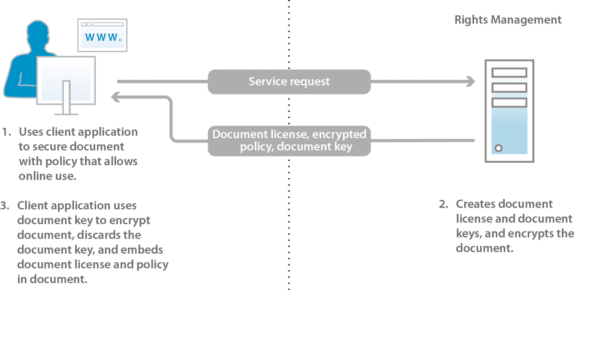

# 關於檔案安全性 {#about-document-security}

檔案安全性可確保只有授權的使用者才能使用您的檔案。 使用檔案安全性，您可以安全地散布您以支援格式儲存的任何資訊。 支援的檔案格式包括：

* Adobe PDF檔案
* Microsoft® Word、Excel和PowerPoint檔案

如需有關原則如何保護支援檔案類型的詳細資訊，請參 [閱其他檔案安全性資訊](https://www.adobe.com/go/learn_aemforms_doc_security_63)。

使用檔案安全性，您可以輕鬆建立、儲存並套用預先定義的機密設定至檔案。 為防止資訊擴散到您的觸及範圍以外，您也可以監控並控制收件者在您分發檔案後使用檔案的方式。

您可以使用原則來保護檔案。 原 *則* 是包含機密設定和授權使用者清單的資訊集合。 您在原則中指定的機密設定會決定收件者如何使用您套用原則的檔案。 例如，您可以指定收件者是否可以列印或複製文字、編輯文字，或在受保護的檔案中新增簽名和留言。

檔案安全性使用者可透過使用者網頁建立原則。 管理員使用Document Security網頁來建立包含所有授權使用者皆可使用之共用原則的原則集。

雖然原則會儲存在檔案安全性中，但您仍可透過用戶端應用程式將原則套用至檔案。 如何套用原則至PDF檔案，在 *Acrobat說明中有詳細說明*。 應用程式的 *Acrobat Reader DC擴充功能說明中記載了使用其他應用程式（例如Microsoft Office）來套用原則* 。

將原則套用至檔案時，原則中指定的機密設定會保護檔案所包含的資訊。 機密設定也可保護PDF檔案中的任何檔案（文字、音訊或視訊）。 您可以將受原則保護的檔案分發給受原則授權的收件者。

**檔案存取控制與稽核**

使用原則保護檔案可讓您持續控制該檔案，即使在您分發檔案後亦然。 您可以監控檔案、變更原則、防止使用者繼續存取檔案，以及切換套用至檔案的原則。

透過檔案安全性，您可以監控受原則保護的檔案並追蹤事件，例如授權或未授權使用者嘗試開啟檔案時。

**元件**

檔案安全性包含伺服器與使用者介面：

**** 伺服器：檔案安全性的核心元件，用來執行使用者驗證、政策的即時管理以及機密性應用等交易。 伺服器還為策略、審計記錄和其他相關資訊提供中央儲存庫。

**** 網頁：您建立原則、管理受原則保護的檔案，以及監控與受原則保護的檔案相關的事件的介面。 管理員也可以設定全域選項，例如使用者驗證、稽核和傳訊給受邀的使用者，以及管理受邀的使用者帳戶。

圖中的步驟如下：

1. 文檔所有者使用網頁建立策略。 檔案擁有者可以建立只有他們才能存取的個人化政策。 管理員和原則集協調者可以在授權使用者可存取的原則集內建立共用原則。
1. 文檔所有者應用策略，然後保存並分發文檔。 檔案可以透過電子郵件、網路資料夾或網站散發。
1. 收件者會在適當的用戶端應用程式中開啟檔案。 收件者可以根據其原則使用檔案。
1. 文檔所有者、策略集協調者或管理員可以使用網頁跟蹤文檔並修改對它們的訪問權限。

## 關於檔案安全性使用者 {#about-document-security-users}

使用檔案安全性的不同使用者類型可完成不同的工作：

* 系統管理員或其他資訊系統(IS)人員會安裝及設定檔案安全性。 此人也可能負責設定伺服器、網頁、原則和檔案的全域設定。

   這些設定可能包括，例如，基本檔案安全URL、稽核和隱私通知、受邀使用者註冊通知，以及預設離線租用期。

* 檔案安全管理員可建立原則和原則集，並視需要為使用者管理受原則保護的檔案。 此外，他們還會建立受邀的使用者帳戶，並監控系統、檔案、使用者、原則、原則集和自訂事件。 他們還可能負責與系統管理員一起配置全局伺服器、網頁和策略設定。

   管理員可以在管理控制台的「使用者管理」區域中為使用者指派下列角色。 指派這些角色的使用者會在管理控制台的Document Security使用者介面區域中執行其工作。

   **Document Security super administrator**

   具有此角色的使用者可存取管理控制台中的所有檔案安全性設定。 這些權限與角色關聯：

   * 管理配置
   * 管理原則
   * 管理原則集
   * 管理檔案
   * 管理檔案發佈者
   * 管理受邀的使用者和本機使用者
   * 檢視事件
   * 委派
   * 邀請外部使用者
   **Document Security Administrator**

   具有此角色的使用者可使用管理控制台檔案安全性區段中的「設定」頁面，來設定檔案安全性伺服器。 此權限與角色「管理配置」相關聯。

   ***注意&#x200B;**:具有此角色的用戶還必須具有管理控制台用戶角色，才能登錄到管理控制台並編輯任何與配置相關的設定。*

   **文檔安全策略集管理員**

   具有此角色的使用者可以使用管理控制台的檔案保全區段來編輯其他使用者的原則，以及建立、編輯和刪除原則集。 當策略集管理員建立策略集時，他們可以為該策略集分配策略集協調器。 這些權限與角色關聯：

   * 管理原則
   * 管理原則集
   * 管理檔案
   * 管理檔案發佈者
   * 檢視事件
   * 委派
   ***注意&#x200B;**:具有此角色的用戶還必須具有管理控制台用戶角色，才能登錄到管理控制台並編輯任何與配置相關的設定。*

   **檔案安全性管理受邀使用者和本機使用者**

   具有此角色的使用者可執行管理相關檔案安全性網頁上所有受邀與本機使用者所需的工作。 這些權限與角色關聯：

   * 管理受邀的使用者和本機使用者
   * 邀請外部使用者
   * 存取使用者網頁
   ***注意&#x200B;**:具有此角色的用戶還必須具有管理控制台用戶角色，才能登錄到管理控制台並編輯任何與配置相關的設定。*

   **檔案安全性邀請使用者**

   具有此角色的使用者可邀請使用者。 這些權限與角色關聯：

   * 邀請外部使用者
   * 存取使用者網頁
   **檔案安全性使用者**

   具有此角色的使用者可存取檔案保全使用者網頁。 此角色也可指派給管理員，以允許管理員使用使用者頁面建立原則。 此權限與角色訪問最終用戶網頁相關聯。

* 組織內擁有有效檔案保全帳戶的使用者會建立自己的原則、使用原則來保護檔案、追蹤及管理受原則保護的檔案，以及監控與其檔案相關的事件。
* 原則集協調者管理檔案、檢視事件，以及管理其他原則集協調者（根據其權限）。 管理員將用戶指定為特定策略集的策略集協調者。
* 您組織外部的使用者（例如，商業合作夥伴）若檔案位於Document Security Document Security Directory中，管理員會為其建立帳戶，或是透過自動化電子郵件邀請程式向Document security註冊，都可以使用受原則保護的檔案。 根據管理員啟用存取設定的方式，受邀的使用者也可能擁有將原則套用至檔案、建立、修改和刪除其原則，以及邀請其他外部使用者使用受原則保護檔案的權限。
* 開發人員使用AEM表單SDK，將自訂應用程式與檔案安全性整合。

Document Security管理員可在「使用者管理」中使用下列權限來建立自訂角色：

* Document security Manage Configuration
* Document Security Manage Incited和Local Users
* Document Security Manage Policy Sets
* Document Security Manage Policy Sets
* 檔案安全性檢視伺服器事件
* 文檔安全性更改策略所有者

## 原則與受原則保護的檔案 {#policies-and-policy-protected-documents}

原 *則* ，定義一組機密設定，以及可存取套用原則之檔案的使用者。 策略還允許動態更改文檔的權限。 它會授與檔案保護人員變更機密設定的權限，以撤銷檔案的存取權或切換原則。

使用Adobe Acrobat® pro和Acrobat Standard可將原則保護套用至PDF檔案。 原則保護可套用至其他檔案類型，例如Microsoft Word、Excel和PowerPoint檔案，方法是使用用戶端應用程式並安裝適當的Acrobat Reader DC擴充功能。

### 策略的運作方式 {#how-policies-work}

原則包含授權使用者的相關資訊以及套用至檔案的機密設定。 使用者可以是您組織中的任何人，也可以是您組織外部擁有帳戶的人。 如果管理員啟用了用戶邀請功能，甚至可以將新用戶添加到策略中，因此可以啟動註冊邀請電子郵件流程。

原則中的機密設定會決定收件者如何使用檔案。 例如，您可以指定收件者是否可以列印或複製文字、進行變更，或在受保護的檔案中新增簽名和留言。 相同的原則也可以指定特定使用者的不同機密設定。

>[!NOTE]
>
>透過原則套用的機密設定會覆寫任何可能已套用至Acrobat中PDF檔案的設定，方法是使用密碼或憑證安全性選項。 （如需詳細資訊，請參閱Acrobat說明）。

使用者和管理員可透過Document Security網頁建立原則。 一次只能套用一個原則至檔案。 您可以使用下列其中一種方法來套用原則：

* 在Acrobat或其他用戶端應用程式中開啟檔案，並選取原則來保護檔案的安全。
* 在Microsoft outlook中以電子郵件附件的形式傳送檔案。 在這種情況下，您可以從原則清單中選取原則，或選取Acrobat以預設機密設定建立的自動產生原則，以僅保護電子郵件訊息收件者的檔案。

可以使用客戶端應用程式從文檔中刪除策略。

圖中的步驟如下：

1. 檔案擁有者會使用允許線上使用的原則，從支援的用戶端應用程式保護檔案。
1. 檔案安全性會建立檔案授權和檔案金鑰，並加密原則。 檔案授權、加密原則和檔案金鑰會傳回用戶端應用程式。
1. 使用文檔密鑰加密文檔，並捨棄文檔密鑰。 此檔案現在內嵌授權與政策。 這些任務在支援的客戶端應用程式中執行。

當您將原則套用至檔案時，檔案包含的資訊(包括PDF檔案中的任何包含檔案（文字、音訊或視訊），都會受到原則中指定的機密設定的保護。 檔案安全性會產生一份授權與加密資訊，然後內嵌在檔案中。 當您分發檔案時，檔案安全性可驗證嘗試開啟檔案的收件者，並根據原則中指定的權限授權存取權。

如果啟用離線使用，收件者也可以在原則中指定的時段離線使用受原則保護的檔案（沒有作用中的網際網路或網路連線）。

### 受原則保護檔案的運作方式 {#how-policy-protected-documents-work}

若要開啟和使用受原則保護的檔案，原則必須包含您的收件者名稱，而且您必須擁有有效的檔案保全帳戶。 若是PDF檔案，您需要Acrobat或Adobe Reader®。 對於其他檔案類型，您需要安裝Acrobat Reader DC擴充功能之檔案的適當應用程式。

當您嘗試開啟受原則保護的檔案時，Acrobat、Adobe Reader或Acrobat Reader DC擴充功能會連接至檔案安全性，以驗證您的身分。 然後，您可以繼續登入。 如果正在檢查文檔使用情況，則會顯示通知消息。 在檔案安全性決定要授與哪些檔案權限後，它會管理檔案的解密。 然後，您可以根據原則機密設定使用檔案。

圖中的步驟如下：

1. 檔案使用者在支援的用戶端應用程式中開啟檔案，並與伺服器進行驗證。 檔案識別碼會傳送至檔案安全伺服器。
1. 檔案安全性會驗證使用者、檢查授權政策並建立憑證。 憑證（包含檔案金鑰和權限）會傳回給用戶端應用程式。
1. 使用文檔密鑰解密文檔，並捨棄文檔密鑰。 然後，可以根據策略的機密設定來使用文檔。 這些任務在支援的客戶端應用程式中執行。

您可以在以下條件下繼續使用文檔：

* 無限期或在原則中指定的有效期間內
* 直到管理員或套用原則的人員廢止檔案的存取權或變更原則

如果原則允許離線存取，您也可以離線使用受原則保護的檔案（沒有網際網路或網路連線）。 您必須先登入檔案安全性，才能同步檔案。 然後，您可以在策略中指定的離線租用期間使用文檔。

離線租用期間結束時，您必須再次將檔案與檔案安全性同步，方法是上線並開啟受原則保護的檔案，或在用戶端應用程式中使用命令。 (如需詳 *細資訊* ，請參閱 *Acrobat說明或適當的Acrobat Reader DC擴充功能說明* 。)

如果您使用「儲存」或「另存新檔」功能表命令儲存受原則保護的檔案副本，系統會自動為新檔案套用並強制執行原則。 此外，也會針對原始檔案，檢查並記錄嘗試開啟新檔案等事件。

## 策略集 {#policy-sets}

*策略集* ，用於對具有共同業務目的的一組策略進行分組。 然後，這些策略集將提供給系統中的用戶子集。

每個策略集可以有一個或多個關聯的策略集協調者。 策略集協調者是管理員或具有其他權限的用戶。 策 *略集協調員* ，通常是組織中的專家，他可以在特定策略集中最好地編寫策略。

策略集協調者可以執行以下任務：

* 建立新原則
* 編輯和刪除策略集中的任何策略
* 編輯策略集設定
* 添加和刪除策略集協調者
* 查看策略集中任何策略或文檔的策略和文檔事件
* 撤銷檔案的存取權
* 切換檔案的原則。

策略集由具有此權限的管理員和策略集協調員在Document Security管理網頁中建立和刪除。

策略集通常提供給有限數量的用戶使用，方法是指定域中哪些用戶或組可以使用策略集中的策略來保護文檔。

安裝文檔安全性後，將建立一個名為「全局策略集」的 *預設策略集*。 安裝軟體的管理員管理此策略集。
