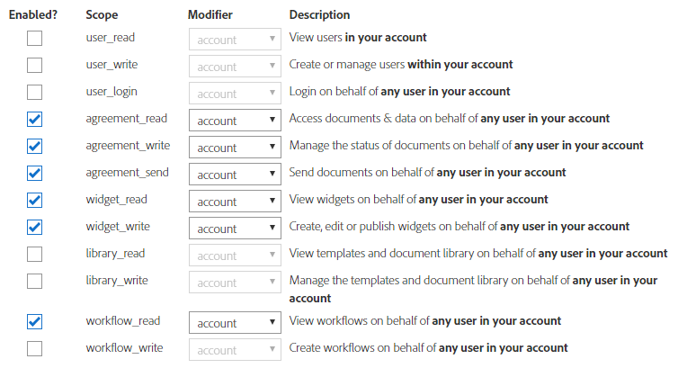

# 將[!DNL Adobe Sign]與AEM [!DNL Forms]整合{#integrate-adobe-sign-with-aem-forms}

Adobe 建議使用新式且可擴充的資料擷取[核心元件](https://experienceleague.adobe.com/docs/experience-manager-core-components/using/adaptive-forms/introduction.html)，用來[建立新的最適化表單](/help/forms/using/create-an-adaptive-form-core-components.md)或[將最適化表單新增到 AEM Sites 頁面](/help/forms/using/create-or-add-an-adaptive-form-to-aem-sites-page.md)。這些元件代表最適化表單建立方面的重大進步，可確保令人印象深刻的使用者體驗。本文會介紹使用基礎元件編寫最適化表單的舊方法。

| 版本 | 文章連結 |
| -------- | ---------------------------- |
| AEM as a Cloud Service  | [按一下這裡](https://experienceleague.adobe.com/docs/experience-manager-cloud-service/content/forms/integrate/services/adobe-sign-integration-adaptive-forms.html?lang=en#adobe-acrobat-sign-for-government) |
| AEM 6.5 | 本文章 |

[!DNL Adobe Sign]啟用最適化表單的電子簽章工作流程。 電子簽名有助於改善處理法律、銷售、薪資、人力資源管理及許多領域文件的工作流程。

在標準 [!DNL Adobe Acrobat Sign] 和最適化表單情境下，用戶會填寫最適化表單來申請服務。例如，信用卡申請表和市民福利表單。用戶申請、提交和簽署申請表單時，此表單會被傳送給服務提供者，以進一步動作。服務提供者便會審查申請並使用 [!DNL Adobe Acrobat Sign] 標記已核准申請。AEM Forms同時支援適用於政府的Adobe Acrobat Sign和Adobe Acrobat Sign Solutions。 根據您的授權和需求，您可以將AEM Forms與以下任一解決方案整合或連線：

* [連結AEM Forms與Adobe Acrobat Sign](#adobe-sign)
* [連線適用於政府的AEM Forms與Adobe Acrobat Sign Solutions](#adobe-acrobat-sign-for-government)

## 連結AEM Forms與Adobe Acrobat Sign {#adobe-sign}

若要將&#x200B;**[!DNL AEM Forms]**&#x200B;與&#x200B;**[!DNL Adobe Acrobat Sign]**&#x200B;連線，請設定先決條件區段中列出的軟體和帳戶，並將Adobe Sign連線至您的所有AEM Forms作者和Publish執行個體：

## 先決條件 {#prerequisites}

您需要下列專案才能將[!DNL Adobe Sign]與AEM [!DNL Forms]整合：

* 有效的[Adobe Sign開發人員帳戶。](https://acrobat.adobe.com/us/en/why-adobe/developer-form.html)
* 已啟用[SSL](/help/sites-administering/ssl-by-default.md) AEM [!DNL Forms]伺服器。
* [Adobe Sign API 應用程式](https://www.adobe.io/apis/documentcloud/sign/docs.html#!adobedocs/adobe-sign/master/gstarted/create_app.md).
* [!DNL Adobe Sign] API 應用程式的認證 (用戶端 ID 和用戶端密碼)。
* 重新設定時，從作者和發佈執行個體中移除現有的[!DNL Adobe Sign]設定。
* 使用製作和發佈執行個體的[同一密碼編譯金鑰](/help/sites-administering/security-checklist.md#make-sure-you-properly-replicate-encryption-keys-when-needed)。

## 使用AEM [!DNL Forms]設定[!DNL Adobe Sign] {#configure-adobe-sign-with-aem-forms}

先決條件就緒後，執行以下步驟，在作者執行個體上使用AEM [!DNL Forms]設定[!DNL Adobe Sign]：

1. 在AEM [!DNL Forms]作者執行個體上，瀏覽至&#x200B;**工具**  > **[!UICONTROL 一般]** > **[!UICONTROL 設定瀏覽器]**。
1. 在&#x200B;**[!UICONTROL 設定瀏覽器]**&#x200B;頁面上，選取&#x200B;**[!UICONTROL 建立]**。
   * 如需詳細資訊，請參閱[設定瀏覽器](/help/sites-administering/configurations.md)檔案。
1. 在&#x200B;**[!UICONTROL 建立設定]**&#x200B;對話方塊中，指定設定的&#x200B;**[!UICONTROL 標題]**、啟用&#x200B;**[!UICONTROL 雲端設定]**，並選取&#x200B;**[!UICONTROL 建立]**。 這會建立一個設定容器。
1. 瀏覽至&#x200B;**工具**  > **[!UICONTROL Cloud Service]** > **[!UICONTROL Adobe Sign]**，並選取您在上一步中建立的設定容器。

   >[!NOTE]
   >
   >您可以執行步驟1至4來建立設定容器，並在容器中建立[!DNL Adobe Sign]設定，或使用&#x200B;**工具**  > **[!UICONTROL Cloud Service]** > **[!UICONTROL Adobe Sign]**&#x200B;中的現有`global`資料夾。 如果您在新的設定容器中建立設定，在建立最適化表單時，請確保在&#x200B;**[!UICONTROL 設定容器]**&#x200B;欄位中指定容器名稱。

   >[!NOTE]
   >
   >請確定Cloud Service設定頁面的URL以&#x200B;**HTTPS**&#x200B;開頭。 如果沒有，請[啟用AEM [!DNL Forms]伺服器的SSL](/help/sites-administering/ssl-by-default.md)。

1. 在設定頁面上，點選「**[!UICONTROL 建立]**」以在AEM [!DNL Forms]中建立[!DNL Adobe Sign]設定。
1. 在&#x200B;**[!UICONTROL 建立Adobe Sign設定]**&#x200B;頁面的&#x200B;**[!UICONTROL 一般]**&#x200B;標籤中，指定設定的&#x200B;**[!UICONTROL 名稱]**，然後點選&#x200B;**[!UICONTROL 下一步]**。 您可以選擇指定標題並瀏覽以選取設定的縮圖。
1. 現在您可以&#x200B;**[!UICONTROL 選取方案]**&#x200B;以選取[!DNL Adobe Acrobat Sign]。

   

1. 將您目前瀏覽器視窗中的URL複製到記事本，並從URL移除部分/`ui#/aem`。 在稍後步驟中，需要修改過的URL才能使用[!DNL AEM Forms]設定[!DNL Adobe Acrobat Sign]應用程式。 點選[!UICONTROL 下一步]。

1. 在&#x200B;**[!UICONTROL 設定]**&#x200B;索引標籤中，
   * **[!UICONTROL OAuth URL]**&#x200B;欄位包含預設URL，其中包含Adobe Sign資料庫分片。 URL 的格式是：

     `https://<shard>/public/oauth/v2`

     例如：
     `https://secure.na1.echosign.com/public/oauth/v2`

   * **[!UICONTROL 存取權杖URL]**&#x200B;欄位包含預設URL，其中包含Adobe Sign資料庫分片。 URL 的格式是：

     `https://<shard>/oauth/v2/token`

     例如：
     `https://api.na1.echosign.com/oauth/v2/token`

   其中：

   **na1** 是指預設的資料庫分片。您可以修改資料庫分片的值。確保[!DNL &#x200B; Adobe Acrobat Sign] Cloud Configurations 指向[正確的分片](https://helpx.adobe.com/sign/using/identify-account-shard.html)。

   >[!NOTE]
   >
   >* 保持&#x200B;**建立Adobe Acrobat Sign設定**&#x200B;頁面開啟。 不要關閉它。 在設定[!DNL Adobe Acrobat Sign]應用程式的OAuth設定後，您可以擷取&#x200B;**使用者端識別碼**&#x200B;和&#x200B;**使用者端密碼**，如即將進行的步驟所述。
   >* 登入您的Adobe Sign帳戶後，請瀏覽至&#x200B;**[!UICONTROL Acrobat Sign API]** > **[!UICONTROL API資訊]** > **[!UICONTROL REST API方法檔案]** > **[!UICONTROL OAuth存取Token]**，以存取與Adobe Sign OAuth URL和存取權杖URL相關的資訊。

1. 設定 [!DNL Adobe Sign] 應用程式的 OAuth 設定：

   1. 開啟瀏覽器視窗並登入[!DNL Adobe Sign]開發人員帳戶。
   1. 選取為AEM [!DNL Forms]設定的應用程式，然後選取&#x200B;**[!UICONTROL 為應用程式設定OAuth]**。
   1. 將&#x200B;**[!UICONTROL 使用者端識別碼]**&#x200B;和&#x200B;**[!UICONTROL 使用者端密碼]**&#x200B;複製到記事本。
   1. 在&#x200B;**[!UICONTROL 重新導向URL]**&#x200B;方塊中，新增上一步中複製的HTTPS URL。
   1. 為[!DNL Adobe Sign]應用程式啟用下列OAuth設定，然後按一下&#x200B;**[!UICONTROL 儲存]**。

   * agreement_read
   * agreement_write
   * agreement_send
   * widget_write
   * workflow_read

   如需設定 [!DNL Adobe Sign] 應用程式的 OAuth 設定並取得金鑰的逐步資訊，請參閱「[設定應用程式的 OAuth 設定](https://www.adobe.io/apis/documentcloud/sign/docs.html#!adobedocs/adobe-sign/master/gstarted/configure_oauth.md)」開發人員文件。

   

<!--
1. Go back to the **[!UICONTROL Create Adobe Sign Configuration]** page. In the **[!UICONTROL Settings]** tab, the **[!UICONTROL OAuth URL]** field mentions the  default URL. The format of the URL is:

   `https://<shard>/public/oAuth/v2`

   For example: 
   `https://secure.na1.echosign.com/public/oauth/v2`

   where:

   **na1** refers to the default database shard.

   You can modify the value for the database shard. Restart the server to be able to use the new value for the database shard.

   >[!NOTE]
   >
   >Ensure that your author and publish instance configurations point to the same shard. If you create multiple Adobe Sign configurations for an organization, ensure all the configurations utilize the same shard. -->

1. 返回&#x200B;**[!UICONTROL 建立Adobe Sign設定]**&#x200B;頁面。 在&#x200B;**[!UICONTROL 設定]**&#x200B;索引標籤中，指定&#x200B;**使用者端識別碼** （也稱為應用程式識別碼）和&#x200B;**使用者端密碼**。 使用為AEM Forms建立的Adobe Sign應用程式[&#128279;](https://opensource.adobe.com/acrobat-sign/developer_guide/helloworld.html#get-the-app-id-and-secret)的使用者端ID和使用者端密碼。

1. 選取&#x200B;**[!UICONTROL 同時啟用附件的Adobe Sign]**&#x200B;選項，以將最適化表單附加的檔案附加至要簽名的對應[!DNL Adobe Sign]檔案。

1. 選取&#x200B;**[!UICONTROL 連線至Adobe Sign]**。 提示輸入認證時，請提供建立[!DNL Adobe Sign]應用程式時使用的帳戶使用者名稱和密碼。

   

1. 點選&#x200B;**[!UICONTROL 建立]**&#x200B;以建立[!DNL Adobe Sign]設定。
1. 開啟AEM Web Console。 URL是`https://'[server]:[port]'/system/console/configMgr`
1. 開啟&#x200B;**[!UICONTROL Forms Common Configuration Service].**
1. 在&#x200B;**[!UICONTROL 允許]**&#x200B;欄位中，**選取**&#x200B;所有使用者 — 所有使用者（匿名或登入）都可以預覽附件、驗證和簽署表單，然後按一下&#x200B;**[!UICONTROL 儲存]。**&#x200B;作者執行個體設定為使用[!DNL Adobe Sign]。
1. Publish設定。
1. 使用[復寫](https://experienceleague.adobe.com/docs/experience-manager-65/deploying/configuring/replication.html)在對應發佈執行個體上建立相同的組態。

現在，[!DNL Adobe Sign]已與AEM [!DNL Forms]整合，並準備用於調適型表單。 若要[在最適化表單中使用Adobe Sign服務](../../forms/using/working-with-adobe-sign.md#configure-adobe-sign-for-an-adaptive-form)，請在最適化表單屬性中指定上述建立的設定容器。

>[!NOTE]
>
>若要設定Adobe Sign沙箱，您可以依照[Adobe Sign](#adobe-sign)中說明的相同設定步驟操作。

## 連線適用於政府的AEM Forms與Adobe Acrobat Sign Solutions {#adobe-acrobat-sign-for-government}

將AEM Forms與適用於政府的Adobe Acrobat Sign Solutions連線是多步驟流程。 其中涉及：

* 為您的AEM執行個體建立重新導向URL
* 與適用於政府團隊的Adobe Sign解決方案共用重新導向URL和範圍
* 接收來自Adobe Sign團隊的認證
* 使用收到的憑證將AEM Forms與適用於政府的Adobe Acrobat Sign Solutions連線

### 開始之前 {#prerequisites-for-adobe-sign-for-acrobat-sign-for-government}

開始將AEM Forms與Adobe Acrobat Sign解決方案連線之前，

* 確保已布建您政府用[Adobe Acrobat Sign Solutions](https://opensource.adobe.com/acrobat-sign/signgov/gstarted.html#account-provisioning)帳戶。
* 您的AEM [!DNL Forms]伺服器已啟用[SSL](/help/sites-administering/ssl-by-default.md) 。
* 您的AEM [!DNL Forms]伺服器正在使用[相同的加密金鑰](/help/sites-administering/security-checklist.md#make-sure-you-properly-replicate-encryption-keys-when-needed)作為製作和發佈執行個體。

### 將AEM Forms連線至適用於政府的Adobe Acrobat Sign Solutions {#connect-adobe-acrobat-sign-for-government}

#### 為您的AEM執行個體建立重新導向URL

1. 在您的AEM Forms執行個體上，瀏覽至&#x200B;**[!UICONTROL 工具]**  > **[!UICONTROL 一般]** > **[!UICONTROL 設定瀏覽器]**。
1. 在&#x200B;**[!UICONTROL 設定瀏覽器]**&#x200B;頁面上，選取&#x200B;**[!UICONTROL 建立]**。
1. 在&#x200B;**[!UICONTROL 建立設定]**&#x200B;對話方塊中，指定設定的&#x200B;**[!UICONTROL 標題]**、啟用&#x200B;**[!UICONTROL 雲端設定]**，並選取&#x200B;**[!UICONTROL 建立]**。 這會建立一個設定容器。 請確認容器/資料夾名稱未包含任何空格。

1. 瀏覽至&#x200B;**[!UICONTROL 工具]**  > **[!UICONTROL Cloud Service]** > **[!UICONTROL Adobe Acrobat Sign]**，並開啟您在上一步中建立的設定容器。 建立最適化表單時，請在&#x200B;**[!UICONTROL 設定容器]**&#x200B;欄位中指定容器名稱。
1. 在設定頁面上，選取「**[!UICONTROL 建立]**」以在AEM Forms中建立[!DNL Adobe Acrobat Sign]設定。
1. 將您目前瀏覽器視窗的URL從URL複製到記事本。 此URL稱為`re-direct URL`。 在下一節中，您會與Adobe Sign團隊共用`re-direct URL`和`Scopes`，並要求認證（使用者端ID和使用者端密碼）。

>[!NOTE]
>
>
>* `re-direct URL`應包含[最上層](https://en.wikipedia.org/wiki/Top-level_domain)網域。 例如 `https://adobe.com/libs/adobesign/cloudservices/adobesign/createcloudconfigwizard/cloudservices.html/conf/global`
>* 請勿使用本機URL做為`re-direct URL`。 例如，`https://localhost:4502/libs/adobesign/cloudservices/adobesign/createcloudconfigwizard/cloudservices.html/conf/global`。

#### 與Adobe Sign團隊共用重新導向URL和範圍並接收認證

適用於政府的Adobe Acrobat Sign解決方案團隊需要為您的Adobe Acrobat Sign應用程式（如下所列）啟用`re-direct URL`和某些範圍，才能產生認證（使用者端ID和使用者端密碼），讓您將AEM Forms與適用於政府的Adobe Acrobat Sign Solutions連線。

與您的Adobe Acrobat Sign政府解決方案代表[Adobe Professional Services團隊成員](https://opensource.adobe.com/acrobat-sign/signgov/gstarted.html#password)共用`scopes` （如下所列），以及建立並記下上一節的最後一步的`re-direct URL`。

**_領域_**

* [!DNL agreement_read]
* [!DNL agreement_write]
* [!DNL agreement_send]
* [!DNL widget_read]
* [!DNL widget_write]
* [!DNL workflow_read]
* [!DNL offline_access]

代表會產生認證並與您共用。 在下一節中，您會使用認證（使用者端ID和使用者端密碼）來連線AEM Forms和適用於政府的Adobe Acrobat Sign Solutions。

#### 使用收到的認證連線AEM Forms與適用於政府的Adobe Acrobat Sign Solutions

1. 在瀏覽器中開啟`re-direct URL`。 您在[在您的AEM執行個體](#create-redirect-url)區段上建立重新導向URL的最後一步中建立並記下`re-direct URL`。

1. 在&#x200B;**[!UICONTROL 建立Adobe Sign組態]**&#x200B;頁面的&#x200B;**[!UICONTROL 一般]**&#x200B;標籤中，指定組態的&#x200B;**[!UICONTROL 名稱]**，並選取&#x200B;**[!UICONTROL 下一步]**。 您可以選擇指定&#x200B;**[!UICONTROL 標題]**&#x200B;並瀏覽以選取設定的&#x200B;**[!UICONTROL 縮圖]**。 按一下「**[!UICONTROL 下一步]**」。

1. 在&#x200B;**[!UICONTROL 建立Adobe Sign組態]**&#x200B;頁面的&#x200B;**[!UICONTROL 設定]**&#x200B;標籤中，針對&#x200B;**[!UICONTROL 選取解決方案]**&#x200B;選項，選取[!DNL Adobe Acrobat Sign Solutions for Government]。

   政府用

1. 在&#x200B;**[!UICONTROL 電子郵件]**&#x200B;欄位中，指定與您Adobe Acrobat Sign Solutions政府帳戶相關的電子郵件地址。

1. 在&#x200B;**[!UICONTROL 設定]**&#x200B;索引標籤中，
   * **[!UICONTROL OAuth URL]**&#x200B;欄位包含預設URL，其中包含Adobe Sign資料庫分片。 URL 的格式是：

     `https://<shard>/api/gateway/adobesignauthservice/api/v1/authorize`

     例如：
     `https://secure.na1.adobesign.us/api/gateway/adobesignauthservice/api/v1/authorize`

   * **[!UICONTROL 存取權杖URL]**&#x200B;欄位包含預設URL，其中包含Adobe Sign資料庫分片。 URL 的格式是：

     `https://<shard>/api/gateway/adobesignauthservice/api/v1/token`

     例如：
     `https://secure.na1.adobesign.us/api/gateway/adobesignauthservice/api/v1/token`

   其中：

   **na1** 是指預設的資料庫分片。您可以修改資料庫分片的值。確保[!DNL &#x200B; Adobe Acrobat Sign] Cloud Configurations 指向[正確的分片](https://helpx.adobe.com/sign/using/identify-account-shard.html)。

   >[!NOTE]
   >
   >* 登入您的Adobe Sign帳戶後，請瀏覽至&#x200B;**[!UICONTROL Acrobat Sign API]** > **[!UICONTROL API資訊]** > **[!UICONTROL REST API方法檔案]** > **[!UICONTROL OAuth存取Token]**，以存取與Adobe Sign oAuth URL和存取權杖URL相關的資訊。

1. 在上一節中，將Adobe Acrobat Sign為政府解決方案代表([Adobe Professional Services團隊成員])共用的認證用作[**[!UICONTROL 使用者端識別碼]**&#x200B;和&#x200B;**[!UICONTROL 使用者端密碼]**]。

1. 選取&#x200B;**[!UICONTROL 為附件啟用Adobe Acrobat Sign]**&#x200B;選項，以將最適化表單附加的檔案附加至要簽名的對應[!DNL Adobe Acrobat Sign]檔案。

1. 選取&#x200B;**[!UICONTROL 連線至Adobe Sign]**。 出現認證提示時，請提供在建立 [!DNL Adobe Acrobat Sign] 應用程式時使用的帳戶使用者名稱和密碼。系統要求確認`Adobe Acrobat Sign for Government Solutions`和的存取時，請按一下&#x200B;**[!UICONTROL 允許存取]**。 如果認證正確且您允許 [!DNL AEM Forms] 存取您的 [!DNL Adobe Acrobat Sign] 開發人員帳戶，則會出現與以下訊息相似的成功訊息。

   

   出現認證提示時，請提供在建立 [!DNL Adobe Acrobat Sign] 應用程式時使用的帳戶使用者名稱和密碼。當要求您確認`your account`的存取權時，請按一下&#x200B;**[!UICONTROL 允許存取]**。

1. 選取&#x200B;**[!UICONTROL 建立]**&#x200B;以建立組態。
1. 開啟AEM Web Console。 URL是`https://'[server]:[port]'/system/console/configMgr`
1. 開啟&#x200B;**[!UICONTROL Forms Common Configuration Service].**
1. 在&#x200B;**[!UICONTROL 允許]**&#x200B;欄位中，**選取**&#x200B;所有使用者 — 所有使用者（匿名或登入）都可以預覽附件、驗證和簽署表單，然後按一下&#x200B;**[!UICONTROL 儲存]。**&#x200B;作者執行個體設定為使用[!DNL Adobe Sign]。

1. Publish設定。
1. 使用[復寫](https://experienceleague.adobe.com/docs/experience-manager-65/deploying/configuring/replication.html)在對應發佈執行個體上建立相同的組態。

現在，您可以[在最適化表單](working-with-adobe-sign.md)或[AEM Workflow](/help/forms/using/aem-forms-workflow-step-reference.md#sign-document-step-sign-document-step)中新增Adobe Acrobat Sign欄位。 請確定您將用於Cloud Service設定的設定容器新增到為[!DNL Adobe Acrobat Sign]啟用的所有最適化Forms。 您可以從最適化表單的屬性指定設定容器。

## 設定[!DNL Adobe Sign]排程器以同步處理簽署狀態 {#configure-adobe-sign-scheduler-to-sync-the-signing-status}

[!DNL Adobe Sign]啟用的最適化表單只會在所有簽署者完成簽署程式後提交。 根據預設，[!DNL Adobe Sign]排程器服務排程為每24小時檢查（輪詢）簽署者回應。 您可以變更環境的預設間隔。 執行以下步驟來變更預設間隔：

1. 使用系統管理員認證登入AEM [!DNL Forms]伺服器，並瀏覽至&#x200B;**工具** > **[!UICONTROL 作業]** > **[!UICONTROL 網頁主控台]**。

   您也可以在瀏覽器視窗中開啟下列URL：
   `https://[localhost]:'port'/system/console/configMgr`

1. 找到並開啟&#x200B;**[!UICONTROL Adobe Sign組態服務]**&#x200B;選項。 在&#x200B;**[!UICONTROL 狀態更新排程器運算式]**&#x200B;欄位中指定[cron運算式](https://en.wikipedia.org/wiki/Cron#CRON_expression)，然後按一下&#x200B;**[!UICONTROL 儲存]**。 例如，若要在每日午夜12點執行組態服務，請在&#x200B;**[!UICONTROL 狀態更新排程器運算式]**&#x200B;欄位中指定`0 0 0 1/1 * ? *`。

[!DNL Adobe Sign]同步狀態的預設間隔現在已變更。

## 相關文章 {#related-articles}

* [在最適化表單中使用Adobe Sign](../../forms/using/working-with-adobe-sign.md)
* [Adobe Sign具有表單中心工作流程](/help/forms/using/aem-forms-workflow-step-reference.md#sign-document-step-sign-document-step)
* [搭配AEM Forms使用Adobe Sign （影片）](https://helpx.adobe.com/experience-manager/kt/forms/using/adobe-sign-integration-feature-video.html)
