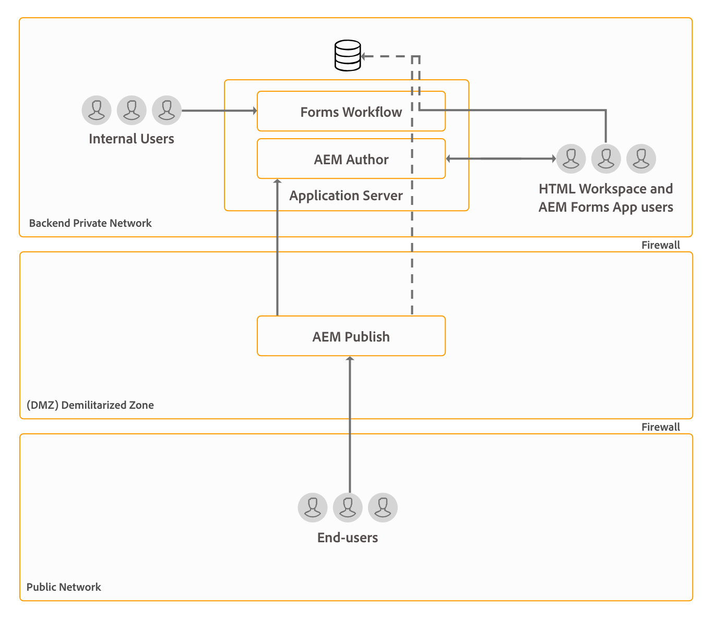

# AEM Forms的架構和部署拓撲 {#architecture-and-deployment-topologies-for-aem-forms}

## 建築 {#architecture}

AEM Forms是部署在AEM中的應用程式，為AEM套件。 此套件稱為AEM Forms附加套件。 AEM Forms附加元件套件包含部署在AEM OSGi容器中的兩項服務（API提供者），以及由AEM Sling架構管理的servlets或JSP（提供前端和REST API功能）。 下圖描述了此設定：

AEM Forms的架構包含下列元件：

* **** 核心AEM服務：AEM為已部署應用程式提供的基本服務。 這些服務包括JCR相容內容儲存庫、OSGI服務容器、工作流程引擎、信任存放區、金鑰存放區等。 這些服務可供AEM Forms應用程式使用，但AEM Forms套件不提供。 這些服務是整個AEM堆疊中不可或缺的一部份，而各種AEM Forms元件都會使用這些服務。
* **** 表單服務：提供表單相關功能，例如建立、組合、分發和封存PDF檔案、新增數位簽章以限制檔案存取，以及解碼條碼化表單。 這些服務可公開供AEM中共同部署的自訂程式碼使用。
* **** 網頁層：JSP或servlet，以通用和表單服務為基礎，提供下列功能：

   * **前端製作**:表單製作和表單管理使用者介面，以製作和管理表單。
   * **表單轉譯和提交前端**:AEM Forms的使用者可使用的使用者對應介面（例如，公民存取政府網站）。 這提供表單轉譯（在網頁瀏覽器中顯示表單）和提交功能。
   * **REST API**:JSP和servlet會匯出表單服務子集，供HTTP型用戶端（例如表單mobile SDK）遠端使用。

**** OSGi上的AEM Forms:OSGi環境上的AEM Forms是標準AEM Author或AEM Publish，並部署在其上的AEM Forms套件。 您可以在單一伺服器環境、農場和叢集 [設定中，在OSGi上執行AEM Forms](/help/sites-deploying/recommended-deploys.md)。 叢集設定僅適用於AEM Author例項。

**** JEE上的AEM Forms:AEM Forms on JEE是AEM Forms伺服器，在JEE堆疊上執行。 它有AEM Author與AEM Forms附加套件，以及其他AEM Forms JEE功能，可共同部署在應用程式伺服器上執行的單一JEE堆疊上。 您可以在單一伺服器和叢集設定中，在JEE上執行AEM Forms。 JEE上的AEM Forms僅需執行檔案安全性、流程管理，以及LiveCycle客戶升級至AEM Forms。 以下是在JEE上使用AEM Forms的一些其他案例：

* **** HTML工作區支援（適用於使用HTML工作區的客戶）:AEM Forms on JEE可啟用具有處理例項的單一登入、支援在處理例項上轉譯的特定資產，以及處理在HTML工作區中轉譯的表單提交。
* **進階的其他表單／互動式通訊資料處理**:AEM Forms on JEE可用於在需要進階流程管理功能的複雜使用情形中，額外處理表單／互動式通訊資料（並將結果儲存至適當的資料儲存）。

AEM Forms on JEE也包含下列AEM元件支援服務：

* **** 整合的使用者管理：可讓JEE上的AEM Forms使用者在OSGi使用者上辨識為AEM表單，並協助OSGi和JEE使用者啟用SSO。 在需要OSGi上的AEM表單和JEE上的AEM表單之間單一登入（例如HTML工作區）的情況下，這是必要的。
* **** 資產托管：AEM Forms on JEE可支援在OSGi的AEM Forms上轉譯的資產（例如HTML5表格）。

AEM Forms製作使用者介面不支援建立記錄檔案(DOR)、PDF表單和HTML5表單。 這些資產是使用單機版Forms Designer應用程式設計，並個別上傳至AEM Forms Manager。 或者，對於JEE上的AEM Forms，表單可設計為應用程式（在AEM Forms Workbench中）資產，並部署至JEE伺服器上的AEM Forms。

OSGi上的AEM Forms和JEE上的AEM Forms都具備工作流程功能。 您可以針對OSGi上的AEM表單快速建立和部署各種工作的基本工作流程，而不需在JEE上安裝AEM Forms的完整流程管理功能。 OSGi上的AEM Forms上的「表 [單導向」工作流程功能與JEE上的AEM Forms的「流程管理」功能有一些不同](/help/forms/using/capabilities-osgi-jee-workflows.md)。 在OSGi的AEM Forms上開發和管理以表單為中心的工作流程時，會使用熟悉的AEM Workflow和AEM Inbox功能。

## 術語 {#terminologies}

下列影像顯示各種AEM Form伺服器組態及其元件，這些元件用於典型的AEM Forms部署：

**** 作者：作者例項是在標準「作者」執行模式中執行的AEM Forms伺服器。 它可以是JEE上的AEM Forms或OSGi環境上的AEM Forms。 它適用於內部使用者、表單和互動式通訊設計人員和開發人員。 它提供下列功能：

* **** 製作和管理表單和互動式通訊：設計人員和開發人員可以建立和編輯最適化表單和互動式通訊、上傳其他在外部建立的表單類型，例如在Adobe Forms Designer中建立的表單，並使用Forms Manager主控台管理這些資產。
* **** 表單與互動式通訊發佈：裝載於作者例項的資產可發佈至發佈例項，以執行執行時期作業。 資產發佈使用AEM的複製功能。 Adobe建議在所有作者例項上配置複製代理，以手動將發佈的表單推送至處理例項，而在處理例項上配置另一個複製代理，並啟用 *On Receive* trigger以自動將收到的表單複製至發佈例項。

**** 發佈：發佈例項是在標準「發佈」執行模式中執行的AEM Forms伺服器。 發佈例項適用於表單型應用程式的使用者，例如存取公開網站和送出表單的使用者。 它提供下列功能：

* 為使用者轉譯和送出表單。
* 將原始提交的表單資料傳輸到處理實例，以便在最終記錄系統中進一步處理和儲存。 AEM Forms中提供的預設實作會使用AEM的反向複製功能來達成此目的。 另外，還提供另一種實施方式，可將表單資料直接推送至處理伺服器，而非先將表單資料儲存在本機（後者是進行反向複製以啟動的先決條件）。 擔心在發佈例項上儲存可能敏感資料的客戶，可進入此替代實 [作](/help/forms/using/configuring-draft-submission-storage.md)，因為處理例項通常位於更安全的區域。
* 轉譯和送出互動式通訊和信件：在發佈實例上呈現互動式通信和信函，並將相應資料提交到處理實例以用於儲存和後處理。 資料可以儲存在本機發佈例項上，稍後再反向複製至處理例項（預設選項），或直接推送至處理例項，而不需儲存在發佈例項上。 後一種實施對注重安全性的客戶非常有用。

**** 處理：以「作者」執行模式執行的AEM Forms例項，未指派任何使用者給表單管理員群組。 您可以將AEM Forms部署在JEE上，或將AEM Forms部署在OSGi上，做為處理例項。 不會指派使用者來確保表單製作和管理活動不會在「處理」例項上執行，而且只會在「作者」例項上執行。 處理實例啟用以下功能：

* **** 處理來自發佈例項的原始表單資料：這主要是在透過AEM工作流程的「處理」例項上實現，當資料送達時會觸發。 工作流程可使用現成可用的「表單資料模型」步驟，將資料或檔案封存至適當的資料儲存。
* **表單資料的安全儲存**:處理提供防火牆後的原始表單資料存放庫，與使用者隔離。 作者實例和發佈實例的最終用戶都不能訪問此儲存庫。

   >[!NOTE]
   >
   > Adobe建議使用協力廠商資料存放區來儲存最終處理的資料，而不要使用AEM儲存庫。

* **** 儲存和後處理從發佈例項到達的對應資料：AEM工作流程會對對應的字母定義執行選擇性的後置處理。 這些工作流程可將最終處理的資料儲存至適當的外部資料儲存區。

* **HTML工作區代管**:處理例項會代管HTML工作區的前端。 HTML工作區為相關的任務／群組指派提供UI，以供審核和核准程式使用。

處理實例配置為在「作者」運行模式下運行，因為：

* 它允許從發佈實例中反向複製原始表單資料。 預設資料儲存處理程式需要反向複製功能。
* AEM工作流程是處理來自發佈例項的原始表單資料的主要方式，建議您在作者式系統上執行。

## JEE上AEM Forms的物理拓撲示例 {#sample-physical-topologies-for-aem-forms-on-jee}

以下建議的AEM Forms on JEE拓撲主要適用於從LiveCycle或舊版AEM Forms on JEE升級的客戶。 Adobe建議在OSGi上使用AEM Forms進行最新安裝。 建議在JEE上新安裝AEM Forms，但僅適用於使用Document Security和Process Management功能。

### 使用檔案服務或檔案安全性功能的拓撲 {#topology-for-using-document-services-or-document-security-capabilities}

AEM Forms客戶計畫只使用檔案服務或檔案安全性功能，其拓撲可能與下方顯示的拓撲類似。 此拓撲建議使用單一AEM Forms例項。 您也可以視需要建立AEM Forms伺服器的叢集或群組。 當大部分使用者以程式設計方式存取AEM Forms伺服器的功能，且透過使用者介面的干預最少時，建議使用此拓撲。 該拓撲結構有助於文檔服務的批處理操作。 例如，使用輸出服務每天建立數百份不可編輯的PDF檔案。

雖然AEM Forms可讓您從單一伺服器設定並執行所有功能，但您仍應進行容量規劃、負載平衡，並針對生產環境中的特定功能設定專屬伺服器。 例如，若是使用PDF Generator服務的環境，每天可轉換數千頁並新增數位簽章以限制檔案存取權，請針對PDF Generator服務和數位簽章功能設定個別的AEM Forms伺服器。 它有助於提供最佳效能，並可獨立擴展伺服器。

### 使用AEM Forms流程管理的拓撲 {#topology-for-using-aem-forms-process-management}

AEM Forms客戶計畫使用AEM Forms流程管理功能，例如，HTML Workspace的拓撲可能類似於下方顯示的拓撲。 JEE伺服器上的AEM Forms可以是單一伺服器或叢集組態。

如果您要從LiveCycle ES4升級，除了在JEE上新增AEM Author內建至AEM Forms外，此拓撲會與您在LiveCycle中已有的功能緊密相映。 此外，執行升級的客戶的叢集需求並無改變。 如果您在叢集環境中使用AEM Forms，您可以在AEM 6.5 Forms中繼續使用相同的功能。 若要重新安裝AEM Forms of JEE以使用HTML Workspace，則另需執行內建至JEE環境的AEM作者例項。

表單資料儲存是第三方資料儲存，用於儲存表單的最終處理資料和互動式通訊。 這是拓撲中的可選元素。 您也可以選擇設定處理實例，並視需要將其儲存庫用作最終的記錄系統。

建議客戶使用拓撲，以便在JEE伺服器上使用AEM Forms來提供流程管理功能（HTML工作區），而不需使用任何後處理、最適化表單、HTML5表單和互動式通訊功能。

### 使用最適化表單、HTML5表單、互動式通訊功能的拓撲 {#topology-for-using-adaptive-forms-html-forms-interactive-communication-capabilities}

AEM Forms客戶計畫使用AEM Forms資料擷取功能，例如最適化表單、HTML5表單、PDF表單，其拓撲可能類似於下方顯示的拓撲。 此拓撲也建議您使用AEM Forms的互動式通訊功能。

您可以對上述建議的拓撲進行以下更改／自定義：

* 使用HTML Workspace和AEM Forms應用程式需要AEM作者或處理例項。 您可以使用內建至JEE伺服器上的AEM Forms的AEM作者例項，而不是設定額外的外部AEM作者伺服器。
* AEM Author或Processing執行個體僅適用於OSGi、最適化表單、表單入口網站和互動式通訊的表單導向工作流程。
* 互動式通訊代理UI通常在組織內執行。 因此，您可以在專用網路中保留代理UI的發佈伺服器。
* OSGi實例中內建至JEE伺服器上的AEM Forms的AEM表單，也可在OSGi和Watched資料夾上執行以表單為中心的工作流程。

## 在OSGi上使用AEM Forms的物理拓撲示例 {#sample-physical-topologies-for-using-aem-forms-on-osgi}

### 適用於資料擷取、互動式通訊、OSGi功能表單導向工作流程的拓撲 {#topology-for-data-capture-interactive-communication-form-centric-workflow-on-osgi-capabilities}

AEM Forms客戶計畫使用AEM Forms資料擷取功能，例如最適化表單、HTML5表單、PDF表單，其拓撲可能類似於下方顯示的拓撲。 此拓撲也建議您針對OSGi功能使用互動式通訊和表單導向工作流程，例如，針對商業程式工作流程使用AEM Inbox和AEM Forms App。

### 用於離線批處理的監視資料夾功能的拓撲 {#topology-for-using-watched-folder-capabilities-for-offline-batch-processing}

AEM Forms客戶計畫使用「監看的檔案夾」進行批次處理，其拓撲可能與下方顯示的拓撲類似。 拓撲會顯示叢集環境，但您會根據負載決定使用單一執行個體或AEM Forms伺服器群組。 第三方資料來源是您自己的記錄系統。 它用作「監視的資料夾」的輸入源。 拓撲還以打印檔案的形式顯示輸出。 您也可以將輸出內容儲存至檔案系統、透過電子郵件傳送，以及使用其他自訂方法來使用輸出。

### 使用檔案服務功能進行離線API處理的拓撲 {#topology-for-using-document-services-capabilities-for-offline-api-based-processing}

AEM Forms客戶計畫只使用檔案服務功能，其拓撲可能類似於下方顯示的拓撲。 此拓撲建議在OSGi伺服器上使用AEM Forms叢集。 當大部分使用者以程式設計方式（使用API）存取AEM Forms伺服器的功能，並透過使用者介面進行干預時，建議使用此拓撲。 該拓撲在多種軟體客戶端場景中非常有用。 例如，多位客戶使用PDF Generator服務，隨選建立PDF檔案。

雖然AEM Forms可讓您從單一伺服器設定並執行所有功能，但您應進行容量規劃、負載平衡，並針對生產環境中的特定功能設定專屬伺服器。 例如，對於使用PDF Generator服務每天轉換數千頁的環境，以及擷取資料的多個調適性表單，請針對PDF Generator服務和最適化表單功能設定個別的AEM Forms伺服器。 它有助於提供最佳效能，並可獨立擴展伺服器。

