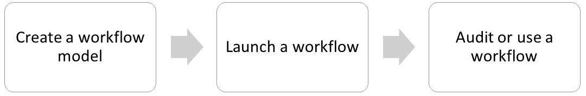
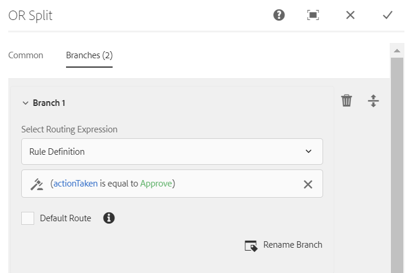

# OSGi上的表單導向工作流程{#forms-centric-workflow-on-osgi}

企業會從數以百計的表單、各種後端系統以及線上或離線資料來源收集資料。 此外，他們還有一組動態的使用者，可針對資料做出決策，這需要反覆審查和核准程式。

大型組織和企業除了針對內部和外部受眾的審查和核准工作流程外，還有重複性工作。 例如，將PDF檔案轉換為其他格式。 手動完成這些工作時，需要耗費大量時間和資源。 企業也有法律要求，要求以數位方式簽署檔案並封存表單資料，以便日後以預先定義的格式使用。

## OSGi上以表單為中心的工作流程簡介 {#introduction-to-forms-centric-workflow-on-osgi}

您可以使用AEM Workflows，快速建立以表單為基礎的調適性工作流程。 這些工作流程可用於審閱與核准、商業程式流程、開始檔案服務、與Adobe Sign簽名工作流程整合，以及類似的作業。 例如，信用卡申請處理、員工離開核准工作流程，將表單儲存為PDF檔案。 此外，這些工作流程可在組織內或跨網路防火牆使用。

有了OSGi上以表單為中心的工作流程，您就可以在OSGi堆疊上快速建立和部署各種工作的工作流程，而不需在JEE堆疊上安裝完整的流程管理功能。 工作流程的開發與管理使用熟悉的AEM Workflow和AEM Inbox功能。 工作流程是自動化實際商業流程的基礎，這些流程跨越多個軟體系統、網路、部門甚至組織。

設定後，這些工作流程可以手動觸發，以完成定義的程式，或在使用者提交表單或信件時以程式 [設計方式](/help/forms/using/cm-overview.md) 執行。 透過這項增強的AEM Workflow功能，AEM Forms提供兩種不同但類似的功能。 在部署策略中，您需要決定哪一種適合您。 檢視OSGi [上](../../forms/using/capabilities-osgi-jee-workflows.md) 「以表單為中心的AEM工作流程」與JEE上「流程管理」的比較。 此外，如需部署拓撲，請參 [閱AEM Forms的架構和部署拓撲](/help/forms/using/aem-forms-architecture-deployment.md)。

OSGi上的表單導向工作流程可擴充 [AEM Inbox](/help/sites-authoring/inbox.md) ，並為AEM Workflow編輯器提供額外的元件（步驟），以新增對AEM Forms導向工作流程的支援。 擴充的AEM收件匣具有類似 [AEM Forms Workspace的功能](../../forms/using/introduction-html-workspace.md)。 除了管理以人為中心的工作流程（核准、審閱等），您還可以使用AEM工作流程來自動化檔案服務相關的作業(例如 [Generate PDF](/help/sites-developing/workflows-step-ref.md))和電子簽署(Adobe Sign)檔案。

所有AEM Forms工作流程步驟都支援使用變數。 變數可讓工作流程步驟在執行時期保留和傳遞跨步驟的中繼資料。 您可以建立不同類型的變數，以儲存不同的資料類型。 您也可以建立變數集合（陣列），以儲存多個相關、相同類型資料的例項。 通常，當您需要根據變數所包含的值做出決策，或儲存流程稍後需要的資訊時，會使用變數或變數集合。 如需在這些以表單為中心的工作流程元件（步驟）中使用變數的詳細資訊，請參閱OSGi —— 步驟參考上的 [Forms導向工作流程](../../forms/using/aem-forms-workflow-step-reference.md)。 如需建立和管理變數的詳細資訊，請參閱「AEM工 [作流程中的變數」](../../forms/using/variable-in-aem-workflows.md)。

下圖描述了在OSGi上建立、運行和監視以表單為中心的工作流的端到端過程。

## 開始之前 {#before-you-start}

* 工作流程是實際商業程式的表現。 讓您的實際業務流程和業務流程參與者清單隨時可用。 此外，在開始建立工作流程之前，請先準備好文宣（最適化表單、PDF檔案等）。
* 工作流程可以有多個階段。 這些階段會顯示在「AEM收件匣」中，並報告工作流程的進度。 將業務流程劃分為邏輯階段。
* 您可以設定AEM工作流程的指派工作步驟，以傳送電子郵件通知給使用者或受指派者。 因此，請啟 [用電子郵件通知](#configure-email-service)。
* 工作流程也可以使用Adobe Sign進行數位簽名。 如果您打算在工作流程中使用Adobe Sign，請在 [工作流程中使用Adobe Sign](../../forms/using/adobe-sign-integration-adaptive-forms.md) 之前，先為AEM Forms設定Adobe Sign。

## Create a workflow model {#create-a-workflow-model}

工作流模型由業務流程的邏輯和流程組成。 它由一系列步驟組成。 這些步驟是AEM元件。 您可以視需要使用參數和指令碼來擴充工作流程步驟，以提供更多功能和控制功能。 AEM Forms除了提供現成可用的AEM步驟外，還提供一些步驟。 如需AEM和AEM Forms步驟的詳細清單，請參閱「 [OSGi —— 步驟參考」上的「](/help/sites-developing/workflows-step-ref.md) AEM Workflow Step Reference [and](../../forms/using/aem-forms-workflow.md)Forms-centric workflow」。

AEM提供直覺式使用者介面，可使用提供的工作流程步驟來建立工作流程模型。 有關建立工作流模型的逐步說明，請參閱創 [建工作流模型](/help/sites-developing/workflows-models.md)。 下列範例提供逐步指示，以建立核准和審核工作流程的工作流程模型：

>[!NOTE]
>
>您必須是工作流編輯器組的成員，才能建立或編輯工作流模型。

### 建立核准和審核工作流程的模型 {#create-a-model-for-an-approval-and-review-workflow}

審批和審核工作流程適用於需要人為干預才能做出決策的任務。 下面的示例為由前台銀行代理填充的抵押貸款申請建立工作流模型。 填妥申請後，即會傳送申請核准。 之後，核准的申請會以Adobe Sign傳送給申請人進行電子簽名。

此示例以下附加的包的形式提供。 使用套件管理器匯入並安裝範例。 您也可以執行以下步驟，為應用程式手動建立工作流模型：

此範例會建立由前台銀行代理所填寫的抵押申請工作流程模型。 填寫完申請後，會傳送申請以供核准。 稍後，核准的應用程式會傳送給客戶，以利用Adobe Sign進行電子簽名。 您可以使用套件管理器匯入並安裝範例。

[取得檔案](assets/example-mortgage-loan-application.zip)

1. 開啟「工作流模型」控制台。 預設URL為https://[Server]:[port]/libs/cq/workflow/admin/console/content/models.html/etc/workflow/models
1. 依次選擇 **建立**、創 **建模型**。 將出現「添加工作流模型」(Add Workflow Model)對話框。
1. 輸入 **Title** and **Name** （可選）。 例如，抵押貸款申請。 點選「 **完成**」。
1. 選取新建立的工作流程模型，並點選「 **編輯」**。 現在，您可以新增工作流程步驟來建立商業邏輯。 首次建立工作流模型時，它包含：

   * 步驟：流開始和流結束。 這些步驟代表工作流程的開始和結束。 這些步驟是必要步驟，無法編輯或移除。
   * 名為步驟1的參與者步驟示例。 此步驟已設定為指派工作項目給管理員使用者。 移除此步驟。

1. 啟用電子郵件通知。 您可以在OSGi上設定以表單為中心的工作流程，以傳送電子郵件通知給使用者或受指派者。 執行下列設定以啟用電子郵件通知：

   1. 前往https:// Server[]:[port]/system/console/configMgr的AEM Configuration Manager。
   1. 開啟 **[!UICONTROL Day CQ Mail Service設定]** 。 指定 **[!UICONTROL SMTP伺服器主機名、]** SMTP伺服器埠 **[!UICONTROL 、]** 「寄件者」地址欄位 **** 。 按一下&#x200B;**[!UICONTROL 「儲存」]**。
   1. 開啟 **[!UICONTROL Day CQ Link Externalizer設定]** 。 在「網 **[!UICONTROL 域]** 」欄位中，指定本機、作者和發佈例項的實際主機名稱/IP位址和埠號。 按一下&#x200B;**[!UICONTROL 「儲存」]**。

1. 建立工作流程階段。 工作流程可以有多個階段。 這些階段會顯示在「AEM收件匣」中，並報告工作流程的進度。

   若要定義舞台，請點選「  」圖示以開啟工作流程模型屬性、開啟「 **Stages** 」標籤、新增工作流程模型的階段，並點選「 **儲存與關閉」**。 對於貸款申請示例，請建立階段：貸款申請、貸款申請狀態、待簽檔案和已簽署貸款檔案。

1. 將「指定任務」步驟 **瀏覽器拖放到工作流模型中** 。 將它作為模型的第一步。

   指派任務元件將由工作流建立的任務指派給用戶或組。 除了指定任務外，您還可以使用元件為任務指定自適應表單或非互動式PDF。 需要有最適化表單才能接受使用者的輸入，而非互動式PDF或唯讀最適化表單則用於僅審核工作流程。

   您也可以使用步驟來控制任務的行為。 例如，建立自動記錄檔案、將工作指派給特定使用者或群組、已提交資料的路徑、要預先填入的資料路徑，以及預設動作。 如需指派工作步驟選項的詳細資訊，請參閱OSGi —— 步驟參考文 [件上的Forms導向工作流程](../../forms/using/aem-forms-workflow.md) 。

   

   對於抵押申請示例，請將指派任務步驟配置為使用只讀自適應表單，並在任務完成後顯示PDF文檔。 此外，選擇允許批准貸款請求的用戶組。 在「動 **作** 」標籤上停用 **「提交** 」選項。 建立字 **串資料類型的actionTaken** 變數，並將變數指定為 **路由變數**。 例如，actionTaken。 此外，還添加批准和拒絕路由。 路由會在AEM收件匣中顯示為個別動作（按鈕）。 工作流程會根據使用者點選的動作（按鈕）來選取分支。

   您可以導入示例包，該示例包可在章節的開頭部分下載，以獲得為例如抵押貸款應用程式配置的分配任務步驟的所有欄位的完整值集。

1. 將OR Split元件從步驟瀏覽器拖放至工作流程模型。 「或分割」(OR Split)在工作流中建立一個分割，之後只有一個分支處於活動狀態。 此步驟可讓您將條件式處理路徑引入工作流程。 您可以視需要將工作流程步驟新增至每個分支。

   您可以使用規則定義、ECMA指令碼或外部指令碼為分支定義路由表達式。

   使用表達式編輯器為Branch 1和Branch 2建立路由表達式。 這些路由運算式可協助您根據AEM收件匣中的使用者動作來選擇分支。

   **分支1的路由表達式**

   當使用者點選「 **AEM收件匣** 」中的「核准」時，Branch 1就會啟動。

   

   **分支2的路由表達式**

   當使用者點選「 **AEM收件匣中** 」時，Branch 2就會啟動。

   

   如需使用變數建立路由運算式的詳細資訊，請參閱「AEM表 [單工作流程中的變數」](../../forms/using/variable-in-aem-workflows.md)。

1. 新增其他工作流程步驟以建立商業邏輯。

   對於抵押示例，將生成記錄文檔、兩個分配任務步驟和一個簽署文檔步驟添加到模型的Branch 1，如下圖所示。 一個指派任務步驟是顯示待簽署 **的貸款檔案並傳送給申請人** ，另一個指派任務元件 **是顯示已簽署的檔案**。 此外，還可將指派任務元件添加到分支2。 當使用者在AEM收件匣中點選「拒絕」時，就會啟動它。

   對於為例如抵押貸款應用程式配置的分配任務步驟、記錄步驟文檔和簽署文檔步驟的所有欄位的完整值集，請導入示例包，該示例包可在本節的開頭下載。

   工作流程模型已就緒。 您可以透過各種方法啟動工作流程。 如需詳細資訊，請 [參閱「在OSGi上啟動以表單為中心的工作流程」](../../forms/using/aem-forms-workflow.md#main-pars-header)。

   

## 建立以表單為中心的工作流程應用程式 {#create-a-forms-centric-workflow-application}

應用程式是與工作流程相關聯的最適化表單。 當應用程式透過「收件匣」提交時，會啟動相關的工作流程。 若要將表單工作流程設為AEM Inbox和AEM Forms應用程式中的應用程式，請執行下列動作以建立工作流程應用程式：

>[!NOTE]
>
>您必須是fd-administrator組的成員，才能建立和管理工作流應用程式。

1. 在您的AEM作者例項上，請前往  > **[!UICONTROL Forms]**> Manage Workflow Application **[!UICONTROL ，然後點選]****** CreateCreate。
1. 在「建立工作流應用程式」窗口中，為以下欄位提供輸入，然後點選「創 **建**」。 會建立新應用程式，並列在「工作流程應用程式」畫面中。

<table>
 <tbody>
  <tr>
   <td>欄位</td>
   <td>說明</td>
  </tr>
  <tr>
   <td>標題</td>
   <td>標題會顯示在「AEM收件匣」中，並協助使用者選擇應用程式。 保持描述性。 例如，儲蓄帳戶開立應用程式。  </td>
  </tr>
  <tr>
   <td>名稱 </td>
   <td>指定應用程式的名稱。 除字母、數字、連字型大小和底線以外的所有字元都將替換為連字型大小。 </td>
  </tr>
  <tr>
   <td>說明</td>
   <td>說明會顯示在「AEM收件匣」中。 在說明欄位中提供應用程式的詳細資訊。 例如，應用程式的用途。  </td>
  </tr>
  <tr>
   <td>最適化表單</td>
   <td>
指定最適化表單的路徑。 當使用者啟動應用程式時，會顯示指定的最適化表單。
 
<strong>注意</strong>:工作流程應用程式不支援長度超過一頁或需要在Apple iPad上捲動的表單和PDF檔案。 當應用程式在Apple iPad上開啟時，當最適化表單或PDF檔案長於頁面時，第二個頁面的表單欄位和內容會遺失。
 </td>
  </tr>
  <tr>
   <td>存取群組</td>
   <td>
選取群組。 應用程式只會顯示在「AEM收件匣」中，顯示給所選群組的成員。 訪問組選項使工作流用戶組的所有組都可供選擇。 
   </td>
  </tr>
  <tr>
   <td>預填服務</td>
   <td>為最適 <a href="../../forms/using/prepopulate-adaptive-form-fields.md#aem-forms-custom-prefill-service" target="_blank">化表單選擇</a> 「預填」服務。  </td>
  </tr>
  <tr>
   <td>工作流程模型</td>
   <td>為應用程 <a href="../../forms/using/aem-forms-workflow.md#create-a-workflow-model">式選取工作</a> 流程模型。 工作流模型由業務流程的邏輯和流程組成。 </td>
  </tr>
  <tr>
   <td>資料檔案路徑</td>
   <td>在crx-repository中指定資料檔案的路徑。 路徑與最適化表單裝載相關，並包含資料檔案的名稱。 請務必包含檔案的完整名稱，包括副檔名（如果適用）。 例如，[payload]/data.xml。 </td>
  </tr>
  <tr>
   <td>附件路徑</td>
   <td>在crx-repository中指定附件資料夾的路徑。 附件路徑相對於裝載位置。 例如，[payload]/data.xml。 </td>
  </tr>
  <tr>
   <td>記錄文件路徑</td>
   <td>在crx-repository中指定記錄檔案的路徑。 該路徑相對於自適應表單有效載荷位置。 請務必包含檔案的完整名稱，包括副檔名（如果適用）。 例如，[payload]/DOR/creditcard.pdf。</td>
  </tr>
 </tbody>
</table>

## 在OSGi上啟動以表單為中心的工作流程 {#launch}

您可以透過下列方式啟動或觸發以表單為中心的工作流程：

* [從AEM收件匣提交應用程式](#inbox)
* [從AEM Forms應用程式送出應用程式](#afa)

* [提交最適化表單](#af)
* [使用監視資料夾](#watched)

* [提交互動式通訊或信函](#letter)

### 從AEM收件匣提交應用程式 {#inbox}

您建立的工作流應用程式作為「收件箱」中的應用程式可用。 屬於工作流程使用者群組的使用者可以填寫並送出觸發相關工作流程的應用程式。 如需使用AEM Inbox來送出應用程式及管理工作的詳細資訊，請參閱「 [在AEM收件匣中管理表單應用程式和工作」](../../forms/using/manage-applications-inbox.md)。

### 從AEM Forms應用程式送出應用程式 {#afa}

AEM Forms應用程式與AEM Forms伺服器同步，可讓您變更帳戶中的表單資料、工作、工作流程應用程式和儲存的資訊（草稿／範本）。 如需詳細資訊，請參 [閱「AEM Forms應用程式](/help/forms/using/aem-forms-app.md) 」和相關文章。

### 提交最適化表單 {#af}

您可以設定最適化表單的提交動作，以在提交最適化表單時啟動工作流程。 最適化表單提 **供「叫用AEM Workflow** submit」動作，以在提交最適化表單時啟動工作流程。 如需提交動作的詳細資訊，請參 [閱設定提交動作](../../forms/using/configuring-submit-actions.md)。 若要透過AEM Forms應用程式提交最適化表單，請啟用最適化表單屬性中的「與AEM表單應用程式同步」。

您可以設定最適化表單，以便從AEM Forms應用程式同步、送出和觸發工作流程。 如需詳細資訊，請 [參閱使用表格](/help/forms/using/working-with-form.md)。

### 使用監視的資料夾 {#watched}

管理員（fd-administrators組的成員）可以配置網路資料夾，以在用戶將檔案（如PDF檔案）放在資料夾中時運行預配置的工作流。 工作流完成後，它可以將結果檔案保存到指定的輸出資料夾。 此類資料夾稱為「 [Watched Folder」](../../forms/using/watched-folder-in-aem-forms.md)。 請執行下列程式，以設定受監視的資料夾以啟動工作流程：

1. 在您的AEM作者例項上，前往  > **Forms ****> Configure Watched Folder。** 將顯示已配置的監視資料夾的清單。
1. 點選 **[!UICONTROL 新]**。 隨即顯示欄位清單。 指定下列欄位的值，以設定工作流程的「監看資料夾」:

<table>
 <tbody>
  <tr>
   <td>欄位</td>
   <td>說明</td>
  </tr>
  <tr>
   <td>名稱</code></td>
   <td>指定「Watched」檔案夾的名稱。 此欄位僅支援英數字元。</td>
  </tr>
  <tr>
   <td>路徑</code></td>
   <td>指定「監視資料夾」的實際位置。 在叢集環境中，使用可從AEM叢集節點存取的共用網路資料夾。</td>
  </tr>
  <tr>
   <td>處理檔案使用</code></td>
   <td>選擇「工 作流 </code>」選項。 </code></td>
  </tr>
  <tr>
   <td>工作流程模型</code></td>
   <td>Select a workflow model.  </td>
  </tr>
  <tr>
   <td>輸出檔案模式</code></td>
   <td>指定輸出檔案和目錄的目錄結構。 您也可以指定輸 <a href="/help/forms/using/admin-help/configuring-watched-folder-endpoints.md" target="_blank">出檔案和目錄的模式</a>。</td>
  </tr>
 </tbody>
</table>

1. 點選「 **進階**」。 為下列欄位指定值，然後點選「建 **立」**。 「Watched Folder」（監視資料夾）已配置為啟動工作流。 現在，每當檔案置於「Watched資料夾」的輸入目錄時，就會觸發指定的工作流程。

   | 欄位 | 說明 |
   |---|---|
   | 承載對應程式篩選條件 | 當您建立受監視的檔案夾時，會在crx-repository中建立檔案夾結構。 資料夾結構可當成工作流程的裝載。 您可以編寫指令碼來對應AEM Workflow，以接受來自受監視檔案夾結構的輸入。 現成可用的實施，並列在「裝載映射器過濾器」中。 如果您沒有自訂實作，請選取預設實作。 |

   「進階」標籤包含更多欄位。 這些欄位中，大部分都包含預設值。 若要瞭解所有欄位，請參閱「建立 [或設定受監視的檔案夾](/help/forms/using/admin-help/configuring-watched-folder-endpoints.md) 」文章。

### 提交互動式通訊或信函 {#letter}

在提交互動式通訊或信函時，您可在OSGi上建立關聯並執行以表單為中心的工作流程。 在信件管理工作流程中，用於後處理互動式通訊和信件。 例如，以電子郵件傳送、列印、傳真或封存最終信件。 如需詳細步驟，請參 [閱互動式通訊和信件的後置處理](../../forms/using/submit-letter-topostprocess.md)。

## 其他配置 {#additional-configurations}

### 設定電子郵件服務 {#configure-email-service}

您可以使用「AEM工作流程」的「指派工作」和「傳送電子郵件」步驟來傳送電子郵件。 執行以下步驟來指定電子郵件伺服器和發送電子郵件所需的其他配置：

1. 前往https:// Server[]:[port]/system/console/configMgr的AEM Configuration Manager。
1. 開啟 **[!UICONTROL Day CQ Mail Service設定]** 。 指定 **[!UICONTROL SMTP伺服器主機名、]** SMTP伺服器埠 **[!UICONTROL 、]** 「寄件者」地址欄位 **** 。 按一下&#x200B;**[!UICONTROL 「儲存」]**。
1. 開啟 **[!UICONTROL Day CQ Link Externalizer設定]** 。 在「網 **[!UICONTROL 域]** 」欄位中，指定本機、作者和發佈例項的實際主機名稱/IP位址和埠號。 按一下&#x200B;**[!UICONTROL 「儲存」]**。

### 清除工作流實例 {#purge-workflow-instances}

最小化工作流實例數可提高工作流引擎的效能，因此您可以定期從儲存庫中清除已完成或正在運行的工作流實例。 有關詳細資訊，請參 [閱：定期清除工作流實例](/help/sites-administering/workflows-administering.md#定期清除工作流實例)。
