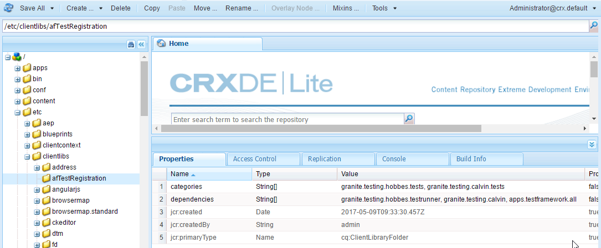

# 自動測試可調式表單{#automate-testing-of-adaptive-forms}

## 概覽 {#overview}

最適化表單是客戶互動不可或缺的一部分。 請務必透過您在表單中所做的每項變更來測試您的調適性表單，例如推出新的修正套件或變更表單規則。 然而，功能測試的適應性表單及其中的每個領域可能都很麻煩。

Calvin可讓您在網頁瀏覽器中自動測試您的調適性表單。 Calvin利用 [Hobbes](/help/sites-developing/hobbes.md)的使用者介面來執行測試，並提供下列工具：

* 用於建立測試的JavaScript API。
* 用於運行測試的用戶介面。

使用Calvin，您就可以在CRXDE中建立測試案例，並直接在網頁瀏覽器中執行UI測試，以徹底測試您最適化表單的下列方面：

<table>
 <tbody>
  <tr>
   <td><strong>測試的自適應表單外觀</strong></td>
   <td><strong>說明</strong></td>
  </tr>
  <tr>
   <td>最適化表單的預填體驗</td>
   <td>
    <ul>
     <li>表單是否會根據資料模型類型預先填入？</li>
     <li>表單物件的預設值是否如預期預先填入？</li>
    </ul> </td>
  </tr>
  <tr>
   <td>提交最適化表單的體驗</td>
   <td>
    <ul>
     <li>提交時是否產生正確資料？</li>
     <li>在提交期間，表單是否在伺服器上重新驗證？</li>
     <li>是否為正在執行的表單配置了提交操作？</li>
    </ul> </td>
  </tr>
  <tr>
   <td><p>運算式規則</p> <p> </p> </td>
   <td>
    <ul>
     <li>與表單物件相關的運算式（例如計算、可見、退出欄位後執行指令碼）是否在執行相關UI作業後執行？<br /> </li>
    </ul> </td>
  </tr>
  <tr>
   <td>驗證</td>
   <td>
    <ul>
     <li>執行操作後，欄位驗證是否按預期執行？</li>
    </ul> </td>
  </tr>
  <tr>
   <td><p>延遲載入</p> <p> </p> </td>
   <td>
    <ul>
     <li>按一下標籤（或面板的任何導覽項目）時，會根據延遲載入設定從伺服器擷取HTML嗎？</li>
    </ul></td>
  </tr>
  <tr>
   <td><p>UI互動</p> </td>
   <td>
    <ul>
     <li><a href="https://helpx.adobe.com/aem-forms/6-3/calvin-sdk-javascript-api/calvin.html#toc2__anchor" target="_blank">測試與最適化表單物件的UI互動</a></li>
    </ul> </td>
  </tr>
 </tbody>
</table>

### 必備條件 {#prerequisites}

在使用本文章建立測試案例之前，您需要瞭解下列事項：

* 使用 [Hobbes建立測試套裝並執行測試案例](https://docs.adobe.com/docs/en/aem/6-3/develop/components/hobbes.html)
* [Hobbes JavaScript API](https://docs.adobe.com/docs/en/aem/6-2/develop/ref/test-api/index.html)
* [Calvin javaScript API](https://helpx.adobe.com/aem-forms/6-3/calvin-sdk-javascript-api/calvin.html)

## 範例：使用Hobbes做為測試架構，為最適化表單建立測試套件 {#example-create-a-test-suite-for-an-adaptive-form-using-hobbes-as-testing-framework}

以下範例將逐步帶您建立測試套裝，以測試多個調適性表單。 您需要為每個需要測試的表單建立個別的測試案例。 依照類似下列步驟並在步驟11中修改JavaScript程式碼，您可以建立自己的測試套裝來測試您的自適應表單。

1. 前往網頁瀏覽器中的CRXDE Lite: `https://[server]:[port]/crx/de`。
1. 按一下右鍵/etc/clientlibs子資料夾，然後按一下「創 **建** 」>「 **建立節點」**。 輸入名稱（此處為afTestRegistration），將節點類型指定為cq:ClientLibraryFolder，然後按一下「 **確定」。**

   clientlibs資料夾包含應用程式的註冊方面（JS和Init）。 建議您在clientlibs資料夾中註冊所有Hobbes測試套裝物件，這些物件是特定於表單的。

1. 在新建立的節點（此處為afTestRegistration）中指定下列屬性值，然後按一下「全 **部儲存」**。 這些屬性可協助Hobbes將資料夾辨識為測試。 若要將此用戶端程式庫重複用於其他用戶端程式庫中，請將它命名為granite.testing.calvin.tests。

<table>
 <tbody>
  <tr>
   <td>屬性</td>
   <td>類型</td>
   <td>值</td>
  </tr>
  <tr>
   <td><p>類別</p> </td>
   <td><p>String[]</p> </td>
   <td><p>granite.testing.hobbes.tests, granite.testing.calvin.tests</p> </td>
  </tr>
  <tr>
   <td><p>依賴性</p> </td>
   <td><p>String[]</p> </td>
   <td><p>granite.testing.hobbes.testrunner, granite.testing.calvin, apps.testframework.all</p> </td>
  </tr>
 </tbody>
</table>

>[!NOTE]
>
>granite.testing.calvin.af clientlib包含所有最適化表單API。 這些API是Calvin命名空間的一部分。



1. 按一下右鍵測試節點(此處為 **afTestRegistration)** ，然後按一下「 **建立** 」 **>「創**&#x200B;建檔案」。 命名js.txt檔案，然後按一下「 **確定**」。
1. 在js.txt檔案中，新增下列文字：

   ```
   #base=.
   js.txt
   ```

1. 按一 **下「全部儲存** 」，然後關閉js.txt檔案。
1. 按一下右鍵測試節點(此處為 **afTestRegistration)** ，然後單 **擊「建立** 」>「 **建立檔案」**。 為檔案命名init.js，然後按一下「 **確定**」。
1. 將下列程式碼複製至init.js檔案，然後按一下「全 **部儲存**:

   ```
   (function(window, hobs) {
       'use strict';
       window.testsuites = window.testsuites || {};
     // Registering the test form suite to the sytem
     // If there are other forms, all registration should be done here
       window.testsuites.testForm = new hobs.TestSuite("Adaptive Form - Demo Test", {
           path: '/etc/clientlibs/afTestRegistration/init.js',
           register: true
       });
    // window.testsuites.testForm1 = new hobs.TestSuite("testForm1");
   }(window, window.hobs));
   ```

   上述程式碼會建立名為「最適化表 **單——示範測試」的測試套裝**。 若要建立不同名稱的測試套裝，請依此變更名稱。

1. 按一 **下「建** 立 **>建立節點** 」，在clientlib檔案夾下，針對您要測試的每個表單建立節點。 此範例使用名為 **testForm** 的節點來測試名為testForm的自適 **應表單**。 指定下列屬性，然後按一下「 **確定**」:

   * 名稱：testForm（您的表單名稱）
   * 類型：cq:ClientLibraryFolder

1. 將下列屬性新增至新建立的節點（此處為testForm），以測試最適化表單：

   | **屬性** | **類型** | **值** |
   |---|---|---|
   | 類別 | String[] | granite.testing.hobbes.tests、granite.testing.hobbes.tests.testForm |
   | 依賴性 | String[] | granite.testing.calvin.tests |

   >[!NOTE]
   >
   >此範例使用對用戶端lib granite.testing.calvin.tests的依賴，以提供更佳的管理。 此範例也新增用戶端程式庫類別&quot;granite.testing.hobbes.testForm&quot;，以視需要重複使用此用戶端程式庫。

   

1. 在您為測試表單（此處為testForm）建立的檔案夾上按一下滑鼠右鍵，然後選取「建立 **>建** 立檔案」 ****。 將檔案命名為scriptingTest.js，然後新增下列程式碼至檔案，然後按一下「全 **部儲存」。**

   若要使用下列程式碼來測試另一個最適化表單，請變更 **navigateTo** （行11、36和62）中表單的路徑和名稱，以及個別的測試案例。 如需測試表單和表單物件不同方面的API的詳細資訊，請參閱 [Calvin API](https://helpx.adobe.com/aem-forms/6-3/calvin-sdk-javascript-api/calvin.html)。

   ```
   (function(window, hobs) {
       'use strict';
   
    var ts = new hobs.TestSuite("Script Test", {
           path: '/etc/clientlibs/testForm/scriptingTest.js',
     register: false
    })
   
       .addTestCase(new hobs.TestCase("Checking execution of calculate script")
           // navigate to the testForm which is to be tested
           .navigateTo("/content/forms/af/testForm.html?wcmmode=disabled")
           // check if adaptive form is loaded
           .asserts.isTrue(function () {
               return calvin.isFormLoaded()
           })
           .execSyncFct(function () {
               // create a spy before checking for the expression
               calvin.spyOnExpression("panel1.textbox1");
               // setValue would trigger enter, set the value and exit from the field
               calvin.setValueInDOM("panel1.textbox", "5");
           })
           // if the calculate expression was setting "textbox1" value to "5", let's also check that
           .asserts.isTrue(function () {
               return calvin.isExpressionExecuted("panel1.textbox1", "Calculate");
           })
           .execSyncFct(function () {
               calvin.destroySpyOnExpression("panel1.textbox1");
           })
           .asserts.isTrue(function () {
               return calvin.model("panel1.textbox1").value == "5"
           })
       )
   
       .addTestCase(new hobs.TestCase("Calculate script Test")
           // navigate to the testForm which is to be tested
           .navigateTo("/content/forms/af/cal/demoform.html?wcmmode=disabled&dataRef=crx:///content/forms/af/cal/prefill.xml")
           // check if adaptive form is loaded
           .asserts.isTrue(function () {
               return calvin.isFormLoaded()
           })
   
           .execSyncFct(function () {
               // create a spy before checking for the expression
               calvin.spyOnExpression("panel2.panel1488218690733.downPayment");
               // setValue would trigger enter, set the value and exit from the field
               calvin.setValueInDOM("panel2.panel1488218690733.priceProperty", "1000000");
           })
           .asserts.isTrue(function () {
               return calvin.isExpressionExecuted("panel2.panel1488218690733.downPayment", "Calculate");
           })
           .execSyncFct(function () {
               calvin.destroySpyOnExpression("panel2.panel1488218690733.downPayment");
           })
           .asserts.isTrue(function () {
               // if the calculate expression was setting "downPayment" value to "10000", let's also check that
      return calvin.model("panel2.panel1488218690733.downPayment").value == 10000
           })
       )
   
       .addTestCase(new hobs.TestCase("Checking execution of Value commit script")
           // navigate to the testForm which is to be tested
           .navigateTo("/content/forms/af/cal/demoform.html?wcmmode=disabled&dataRef=crx:///content/forms/af/cal/prefill.xml")
           // check if adaptive form is loaded
           .asserts.isTrue(function () {
               return calvin.isFormLoaded()
           })
   
           .execSyncFct(function () {
               // create a spy before checking for the expression
               calvin.spyOnExpression("panel2.panel1488218690733.priceProperty");
               // setValue would trigger enter, set the value and exit from the field
               calvin.setValueInDOM("panel2.panel1488218690733.priceProperty", "100");
           })
           .asserts.isTrue(function () {
               return calvin.isExpressionExecuted("panel2.panel1488218690733.priceProperty", "Value Commit");
           })
           .execSyncFct(function () {
               calvin.destroySpyOnExpression("panel2.panel1488218690733.priceProperty");
           })
           .asserts.isTrue(function () {
            // if the value commit expression was setting "textbox1488215618594" value to "0", let's also check that
               return calvin.model("panel2.panel1488218690733.textbox1488215618594").value == 0
           })
       );
   
    // register the test suite with testForm
     window.testsuites.testForm.add(ts);
   
    }(window, window.hobs));
   ```

   將建立測試案例。 繼續執行測試案例，透過Hobbes測試最適化表單。 如需執行測試案例的步驟，請參 [閱使用自動測試來測試您的UI](/help/sites-developing/hobbes.md)。

您也可以將套件安裝在附加的檔案SampleTestPackage.zip中，以取得與範例中說明的步驟相同的結果：使用Hobbes做為測試架構，為最適化表單建立測試套件。

[取得檔案](assets/sampletestpackage.zip)

## 使用自動測試來測試您的UI {#testing-your-ui-using-automated-tests}

### 執行單一測試套裝 {#running-a-single-test-suite}

測試套裝可個別執行。 當您執行測試套裝時，頁面會隨著測試案例及其動作的執行而變更，結果會在測試完成後顯示。 圖示表示結果。

複選標籤圖示表示通過的測試：復 

「X」圖示表示測試失敗：交 

若要執行測試套裝：

1. 在「測試」面板中，按一下或點選您要執行的測試案例名稱，以展開動作的詳細資訊。

   

1. 按一下或點選「執行測試」按鈕。 

   

1. 測試執行時，預留位置會以頁面內容取代。

   

1. 點選或按一下說明以開啟「結果」面板，以檢視「測試案例」的結果。 點選或按一下「結果」面板中測試案例的名稱，會顯示所有詳細資料。

   

測試AEM最適化表單的步驟與測試AEM UI的步驟類似。 如需測試最適化表單的詳細資訊，請參閱測試您的UI中 [的下列主題](https://helpx.adobe.com//experience-manager/6-3/help/sites-developing/hobbes.html):

* 檢視測試套裝
* 執行多個測試

## 字彙表 {#glossary}

<table>
 <tbody>
  <tr>
   <td><strong>期限</strong></td>
   <td><strong>說明</strong></td>
  </tr>
  <tr>
   <td><p>測試套件</p> </td>
   <td><p>測試套裝是相關測試案例的集合。</p> </td>
  </tr>
  <tr>
   <td><p>測試案例</p> </td>
   <td><p>測試案例代表使用者使用您的UI所執行的工作。 將測試案例新增至您的測試套裝，以測試使用者執行的活動。</p> </td>
  </tr>
  <tr>
   <td><p>動作</p> </td>
   <td><p>動作是在UI中執行手勢的方法，例如按一下按鈕或以值填入輸入方塊。</p> <p>chout.actions.Wanfies、tower.actions.Core和tower.utils.af類的方法是您可在測試中使用的動作。 所有動作都會同步執行。</p> </td>
  </tr>
  <tr>
   <td><p>製作或發佈環境</p> </td>
   <td><p>一般而言，表單可在作者或發佈環境中進行測試。 在發佈環境中，預設會限制執行測試的存取權。 這是因為與測試運行程式相關的所有客戶端庫都位於JCR結構的/libs內。</p> </td>
  </tr>
 </tbody>
</table>

