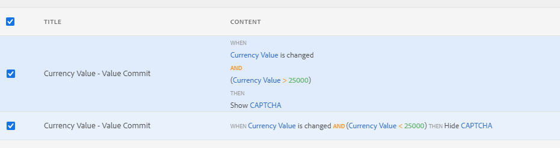

# 在最適化表單中使用驗證碼{#using-captcha-in-adaptive-forms}

驗證碼（Captcha，完全自動化的公共圖靈測試，可區分電腦和人）是線上交易中常用的一種程式，用於區分人和自動程式或機器人。 這會帶來挑戰並評估使用者回應，以判斷其為與網站互動的人或機器人。 它可防止機器人張貼垃圾訊息或惡意用途，讓使用者在測試失敗時繼續執行，有助於確保線上交易的安全。

AEM Forms支援適用性表單中的驗證碼。 您可以使用Google的reCAPTCHA服務來實作CAPTCHA。

>[!NOTE]
>
>* AEM Forms僅支援reCaptcha v2。 不支援任何其他版本。
>* AEM Forms應用程式的離線模式不支援適用性表單中的驗證碼。

>


## 通過Google配置ReCAPTCHA服務{#google-recaptcha}

表單作者可使用Google的reCAPTCHA服務，在最適化表單中實作CAPTCHA。 它提供進階驗證碼功能，可保護您的網站。 如需reCAPTCHA如何運作的詳細資訊，請參閱[Google reCAPTCHA](https://developers.google.com/recaptcha/)。


若要在AEM Forms中實作reCAPTCHA服務：

1. 從Google取得[reCAPTCHA API金鑰組](https://www.google.com/recaptcha/admin)。 其中包含網站金鑰和機密。
1. 為雲端服務建立設定容器。

   1. 前往「**[!UICONTROL 工具>一般>設定瀏覽器]**」。
      * 如需詳細資訊，請參閱[設定瀏覽器](/help/sites-administering/configurations.md)檔案。
   1. 請執行下列操作以啟用雲配置的全局資料夾，或跳過此步驟以建立和配置雲服務配置的其他資料夾。

      1. 在「配置瀏覽器」中，選擇&#x200B;**[!UICONTROL global]**&#x200B;資料夾，然後點選&#x200B;**[!UICONTROL Properties]**。

      1. 在「配置屬性」對話框中，啟用&#x200B;**[!UICONTROL 雲配置]**。
      1. 點選&#x200B;**[!UICONTROL 儲存並關閉]**&#x200B;以儲存設定並退出對話方塊。
   1. 在「設定瀏覽器」中，點選「**[!UICONTROL 建立]**」。
   1. 在「建立配置」對話框中，指定資料夾的標題並啟用&#x200B;**[!UICONTROL 雲配置]**。
   1. 點選&#x200B;**[!UICONTROL 建立]**&#x200B;以建立為雲端服務設定啟用的資料夾。


1. 為reCAPTCHA設定雲端服務。

   1. 在AEM製作例項上，前往 > **Cloud Services**。
   1. 點選&#x200B;**[!UICONTROL reCAPTCHA]**。 「設定」頁面隨即開啟。 選取在上一步中建立的設定容器，然後點選&#x200B;**[!UICONTROL Create]**。
   1. 指定reCAPTCHA服務的名稱、網站金鑰和密鑰，然後點選&#x200B;**[!UICONTROL Create]**&#x200B;以建立雲端服務設定。
   1. 在「編輯元件」對話方塊中，指定在步驟1取得的網站和機密金鑰。 點選「**儲存設定**」，然後點選「**確定」以完成設定。**

   設定reCAPTCHA服務後，即可在最適化表單中使用。 如需詳細資訊，請參閱[在最適化表單中使用CAPTCHA](#using-captcha) 。

## 在最適化表單{#using-captcha}中使用CAPTCHA

若要在最適化表單中使用CAPTCHA:

1. 在編輯模式中開啟最適化表單。

   >[!NOTE]
   >
   >建立最適化表單時，請確定選取的設定容器包含reCAPTCHA雲端服務。 您也可以編輯最適化表單屬性，以變更與表單相關聯的設定容器。

1. 從元件瀏覽器，將&#x200B;**Captcha**&#x200B;元件拖放至最適化表單。

   >[!NOTE]
   >
   >不支援在最適化表單中使用多個驗證碼元件。 此外，不建議在標示為延遲載入的面板或片段中使用CAPTCHA。

   >[!NOTE]
   >
   >驗證碼具有時效性，約一分鐘後過期。 因此，建議將驗證碼元件放置在最適化表單中的提交按鈕之前。

1. 選取您新增的驗證碼元件，然後點選以編輯其屬性。
1. 指定驗證碼介面工具集的標題。 預設值為&#x200B;**Captcha**。 如果不想顯示標題，請選擇&#x200B;**隱藏標題**。
1. 如果您依照[Google](#google-recaptcha)ReCAPTCHA服務所述來設定reCAPTCHA服務，請從&#x200B;**Captcha服務**&#x200B;下拉式清單中選取&#x200B;**reCaptcha**&#x200B;以啟用reCAPTCHA服務。 從「設定」下拉式清單中選取設定。 此外，為reCAPTCHA介面工具集選擇大小為&#x200B;**Normal**&#x200B;或&#x200B;**Compact**。

   >[!NOTE]
   >
   >請勿從驗證碼服務下拉式清單中選取&#x200B;**[!UICONTROL 預設]**，因為預設的AEM驗證碼服務已遭取代。

1. 儲存屬性。

reCAPTCHA服務已在最適化表單上啟用。 您可以預覽表單，並查看驗證碼正常運作。

### 根據規則{#show-hide-captcha}顯示或隱藏CAPTCHA元件

您可以選取根據套用至適用性表單中元件的規則，來顯示或隱藏CAPTCHA元件。 點選元件，選取，然後點選&#x200B;**[!UICONTROL Create]**&#x200B;以建立規則。 有關建立規則的詳細資訊，請參閱[規則編輯器](rule-editor.md)。

例如，只有當表單中的「貨幣值」欄位值超過25000時，CAPTCHA元件才必須顯示在適用性表單中。

點選表單中的&#x200B;**[!UICONTROL 貨幣值]**&#x200B;欄位並建立下列規則：



### 進行驗證碼驗證 {#validate-captcha}

提交表單時，或根據使用者動作和條件進行驗證驗證時，您都可以在適用性表單中驗證驗證碼。

#### 在表單提交{#validation-form-submission}時驗證驗證碼

在提交最適化表單時自動驗證驗證碼：

1. 點選CAPTCHA元件，然後選取以檢視元件屬性。
1. 在&#x200B;**[!UICONTROL 驗證CAPTCHA]**&#x200B;區段中，選取&#x200B;**[!UICONTROL 在表單提交時驗證CAPTCHA]**。
1. 點選以儲存元件屬性。

#### 驗證使用者動作和條件的驗證碼{#validate-captcha-user-action}

若要根據條件和使用者動作驗證驗證驗證碼：

1. 點選CAPTCHA元件，然後選取以檢視元件屬性。
1. 在&#x200B;**[!UICONTROL 驗證CAPTCHA]**&#x200B;區段中，選取&#x200B;**[!UICONTROL 驗證使用者動作]**&#x200B;的CAPTCHA。
1. 點選以儲存元件屬性。

[!DNL Experience Manager Forms] 提 `ValidateCAPTCHA` 供API以使用預先定義的條件驗證驗證碼。您可以使用自訂提交動作或在適用性表單中定義元件規則，來叫用API。

以下是使用預先定義的條件驗證CAPTCHA之`ValidateCAPTCHA` API的範例：

```javascript
if (slingRequest.getParameter("numericbox1614079614831").length() >= 5) {
    	GuideCaptchaValidatorProvider apiProvider = sling.getService(GuideCaptchaValidatorProvider.class);
        String formPath = slingRequest.getResource().getPath();
        String captchaData = slingRequest.getParameter(GuideConstants.GUIDE_CAPTCHA_DATA);
        if (!apiProvider.validateCAPTCHA(formPath, captchaData).isCaptchaValid()){
            response.setStatus(400);
            return;
        }
    }
```

此範例表示，只有在使用者填入表單時指定的數值方塊位數大於5時，`ValidateCAPTCHA` API才會驗證表單中的驗證碼。

**選項1:使 [!DNL Experience Manager Forms] 用ValidateCAPTCHA API使用自訂提交動作來驗證CAPTCHA**

執行下列步驟以使用`ValidateCAPTCHA` API使用自訂提交動作來驗證CAPTCHA:

1. 將包含`ValidateCAPTCHA` API的指令碼新增至自訂提交動作。 如需自訂提交動作的詳細資訊，請參閱[建立適用性Forms的自訂提交動作](custom-submit-action-form.md)。
1. 從適用性表單的&#x200B;**[!UICONTROL Submission]**&#x200B;屬性中的&#x200B;**[!UICONTROL Submit Action]**&#x200B;下拉式清單中，選取自訂提交動作的名稱。
1. 點選&#x200B;**[!UICONTROL 提交]**。 驗證碼會根據自訂提交動作的`ValidateCAPTCHA` API中定義的條件進行驗證。

**選項2:提 [!DNL Experience Manager Forms] 交表單前，請使用ValidateCAPTCHA API驗證使用者動作的CAPTCHA**

您也可以在適用性表單中的元件上套用規則，以叫用`ValidateCAPTCHA` API。

例如，您可以在適用性表單中新增&#x200B;**[!UICONTROL 驗證CAPTCHA]**&#x200B;按鈕，並建立規則以在按一下按鈕時叫用服務。

下圖說明如何在按一下&#x200B;**[!UICONTROL 驗證CAPTCHA]**&#x200B;按鈕時叫用服務：


您可以使用規則編輯器叫用包含`ValidateCAPTCHA` API的自訂servlet，並根據驗證結果啟用或停用適用性表單的提交按鈕。

同樣地，您也可以使用規則編輯器加入自訂方法，以在適用性表單中驗證驗證碼字。

### 新增自訂驗證碼服務{#add-custom-captcha-service}

[!DNL Experience Manager Forms] 提供reCAPTCHA作為CAPTCHA服務。不過，您可以新增自訂服務以顯示在&#x200B;**[!UICONTROL CAPTCHA服務]**&#x200B;下拉式清單中。

以下是介面實作的範例，以新增其他CAPTCHA服務至您的適用性表單：

```javascript
package com.adobe.aemds.guide.service;

import org.osgi.annotation.versioning.ConsumerType;

/**
 * An interface to provide captcha validation at server side in Adaptive Form
 * This interface can be used to provide custom implementation for different captcha services.
 */
@ConsumerType
public interface GuideCaptchaValidator {
    /**
     * This method should define the actual validation logic of the captcha
     * @param captchaPropertyNodePath path to the node with CAPTCHA configurations inside form container
     * @param userResponseToken  The user response token provided by the CAPTCHA from client-side
     *
     * @return  {@link GuideCaptchaValidationResult} validation result of the captcha
     */
     GuideCaptchaValidationResult validateCaptcha(String captchaPropertyNodePath, String userResponseToken);

    /**
     * Returns the name of the captcha validator. This should be unique among the different implementations
     * @return  name of the captcha validator
     */
     String getCaptchaValidatorName();
}
```

`captchaPropertyNodePath` 是指Sling存放庫中CAPTCHA元件的資源路徑。使用此屬性來包含驗證碼元件的特定詳細資訊。 例如， `captchaPropertyNodePath`包含在CAPTCHA元件上設定的reCAPTCHA雲配置資訊。 雲配置資訊提供用於實施reCAPTCHA服務的&#x200B;**[!UICONTROL 站點密鑰]**&#x200B;和&#x200B;**[!UICONTROL 密鑰]**&#x200B;設定。

`userResponseToken` 是指在表 `g_recaptcha_response` 單中解決驗證碼後產生的。
