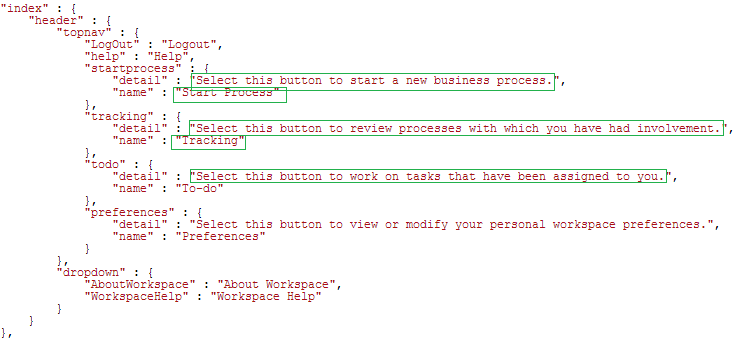

# 變更AEM Forms工作區使用者介面的地區設定{#changing-the-locale-of-aem-forms-workspace-user-interface}

AEM Forms工作區提供現成可用的英文、法文、德文和日文支援。 它也提供將AEM Forms工作區使用者介面當地語系化為其他語言的功能。

若要將AEM Forms工作區使用者介面當地語系化為您選擇的語言：

* 將AEM Forms工作區的文字當地語系化。
* 將收合的類別、佇列和程式當地語系化。
* 本地化日期選擇器

在執行上述步驟之前，請確定您遵循「AEM Forms工作區自訂的 [一般步驟」中所列的步驟](../../forms/using/generic-steps-html-workspace-customization.md)。

>[!NOTE]
>
>若要變更AEM Forms工作區登入畫面的語言，請參 [閱建立新登入畫面](../../forms/using/creating-new-login-screen.md)。

## 本地化文字 {#localizing-text}

請執行下列步驟，新增對語言「新 *增* 」和瀏覽器地區設 *定代碼*。

1. 登入CRXDE Lite。
CRXDE Lite的預設URL為 `https://[server]:[port]/lc/crx/de/index.jsp`。
1. 導覽至該位置並 `apps/ws/locales` 建立新資料夾 `nw.`
1. 將檔案從 `translation.json`位置復 `/apps/ws/locales/en-US` 制至位置 `/apps/ws/locales/nw` 。
1. 導覽至並 `/apps/ws/locales/nw` 開啟以 `translation.json` 進行編輯。 對translation.json檔案進行地區設定特定的變更。

   下列範例包含AEM Forms工作區英文和法文地區設定的translation.json檔案。

    

## 本地化收合的類別、隊列和流程 {#localizing-collapsed-categories-queues-and-processes}

AEM Forms工作區使用影像來顯示類別、佇列和程式的標題。 您需要開發套件才能將這些標題當地語系化。 如需建立開發套件的詳細資訊，請參閱「 [建立AEM Forms工作區程式碼」。](../../forms/using/introduction-customizing-html-workspace.md#main-pars-heading-3)

在下列步驟中，假設新的本地化影像檔案為 *Categories_nw.png*、 *Queue_nw.png*&#x200B;和 *Processes_nw.png*。 建議的影像寬度為19像素。

>[!NOTE]
>
>若要尋找瀏覽器的瀏覽器語言地區設定程式碼。 開啟 `https://[server]:[port]/lc/libs/ws/Locale.html`.


執行下列步驟來本地化影像：

1. 使用WebDAV用戶端，將影像檔案置於 */apps/ws/images資料夾中* 。
1. 導覽至 */apps/ws/css*。 開啟 *newStyle.css* ，以進行編輯並新增下列項目：

   ```
   #categoryListBar .content.nw {
        background: #3e3e3e url(../images/Categories_nw.png) no-repeat 10px 10px;
    }
   
   #filterListBar .content.nw {
       background: #3e3e3e url(../images/Queues_nw.png) no-repeat 10px 10px;
   }
   
   #processNameListBar .content.nw {
       background: #3e3e3e url(../images/Processes_nw.png) no-repeat 10px 10px;
   }
   ```

1. 執行「工作區自訂」文章中列出的所 [有語義變更](../../forms/using/introduction-customizing-html-workspace.md) 。
1. 導覽至 *js/runtime/utility檔案夾* ，並開啟 ** usersession.js檔案以進行編輯。
1. 找出原始程式碼區塊中列出的程式碼，並新增條件 *lang !== &#39;nw&#39;* to if statement:

   ```
   // Orignal code
   setLocale = function () {
           var lang = $.trim(i18n.lng());
           if (lang === null || lang === '' || (lang !== 'fr-FR' && lang !== 'de-DE' && lang !== 'ja-JP')) {
               window.lcWorkspace.locale = 'en-US';
           } else {
               window.lcWorkspace.locale = lang;
           }
       }
   ```

   ```
   //new code
    setLocale = function () {
           var lang = $.trim(i18n.lng());
           if (lang === null || lang === '' || (lang !== 'fr-FR' && lang !== 'de-DE' && lang !== 'ja-JP' && lang !== 'nw')) {
               window.lcWorkspace.locale = 'en-US';
           } else {
               window.lcWorkspace.locale = lang;
           }
       }
   ```

## 本地化日期選擇器 {#localizing-date-picker}

您需要開發套件來本地化 *datepicker* API。 如需建立開發套件的詳細資訊，請參閱「 [建立AEM Forms工作區程式碼」](../../forms/using/introduction-customizing-html-workspace.md#main-pars-heading-3)。

1. 下載並解壓 [jQuery UI Package](https://jqueryui.com/download/all/)，導覽至 *&lt;解壓縮jquery UI package>*\jquery-ui-1.10.2.zip\jquery-ui-1.10.2\ui\i18n。
1. 將jquery.ui.datepicker-nw.js檔案的地區設定程式碼新複製到apps/ws/js/libs/jquerui，並對檔案進行地區設定特定變更。
1. 導覽至 `apps/ws/js` 並開啟檔 `jquery.ui.datepicker-nw.js` 案以進行編輯。
1. 在main.js檔案中，為檔案建立 `jquery.ui.datepicker-nw.js.` 別名的程式碼 `jquery.ui.datepicker-nw.js` 為：

   ```
   jqueryuidatepickernw : pathprefix + 'libs/jqueryui/jquery.ui.datepicker-nw'
   ```

1. 使用別 `jqueryuidatepickernw` 名將檔案包 `jquery.ui.datepicker-nw.js` 含在所有使用日期選擇器的檔案中。 日期選擇器用於下列檔案：

   * `js/runtime/views/outofoffice.js`
   * `js/runtime/views/searchtemplatedetails.js`
   以下范常式式碼說明如何新增jquery.ui.datepicker-nw.js項目：

   ```
   //Original Code
   define([
       'jquery',
       'underscore',
       'backbone',
       'jqueryui',
       'jqueryuidatepickerja',
       'jqueryuidatepickerde',
       'jqueryuidatepickerfr',
       'slimscroll',
       'usersearchview',
       'logmanagerutil',
       'loggerutil'
   ], function ($, _, Backbone, jQueryUI, jQueryUIDatePickerJA, jQueryUIDatePickerDE, jQueryUIDatePickerFR, slimScroll, UserSearch, LogManager, Logger) {
   ```

   ```
   // Code with Date Picker alias for new language
   define([
       'jquery',
       'underscore',
       'backbone',
       'jqueryui',
       'jqueryuidatepickerja',
       'jqueryuidatepickerde',
       'jqueryuidatepickerfr',
       'jqueryuidatepickernw', // Date Picker alias
       'slimscroll',
       'usersearchview',
       'logmanagerutil',
       'loggerutil'
   ], function ($, _, Backbone, jQueryUI, jQueryUIDatePickerJA, jQueryUIDatePickerDE, jQueryUIDatePickerFR, jQueryUIDatePickerNW, slimScroll, UserSearch, LogManager, Logger) {
   ```

1. 在所有使用日期選擇器API的檔案中，變更預設的日期選擇器API設定。 日期選擇器API用於下列檔案：

   * apps\ws\js\runtime\views\searchtemplatedetails.js
   * apps\ws\js\runtime\views\outofoffice.js
   變更下列程式碼以新增地區設定：

   ```
   if (locale === 'ja-JP') {
      $.datepicker.setDefaults($.datepicker.regional.ja);
   } else if (locale === 'de-DE') {
      $.datepicker.setDefaults($.datepicker.regional.de);
   } else if (locale === 'fr-FR') {
      $.datepicker.setDefaults($.datepicker.regional.fr);
   } else {
      $.datepicker.setDefaults($.datepicker.regional['']);
   }
   ```

   ```
   if (locale === 'ja-JP') {
       $.datepicker.setDefaults($.datepicker.regional.ja);
   } else if (locale === 'de-DE') {
       $.datepicker.setDefaults($.datepicker.regional.de);
   } else if (locale === 'fr-FR') {
       $.datepicker.setDefaults($.datepicker.regional.fr);
   } else if (locale === 'nw') {
       $.datepicker.setDefaults($.datepicker.regional.nw);
   } else {
       $.datepicker.setDefaults($.datepicker.regional['']);
   }
   ```

[聯絡支援](https://www.adobe.com/account/sign-in.supportportal.html)
