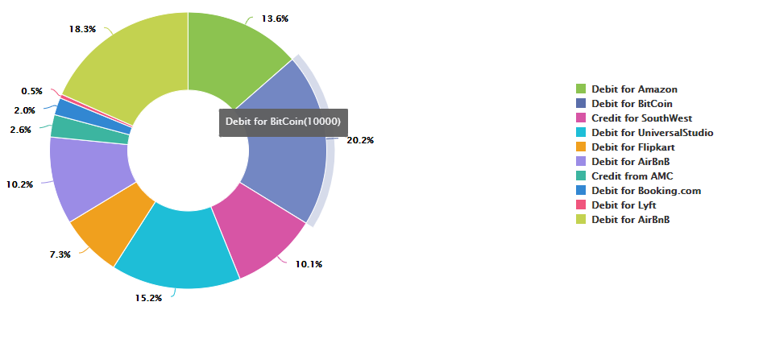

# 在互動式通訊中使用圖表{#using-charts-in-interactive-communications}

圖表或圖表是資料的視覺表示。 它將大量資訊匯整為簡單易懂的視覺化格式，讓互動式通訊的接收者能夠更清楚地視覺化、解譯和分析複雜的資料。

在建立互動式通訊時，您可以新增圖表，以視覺化方式呈現來自互動式通訊表單資料模型的二維資料。 圖表元件允許您添加和配置以下類型的圖表：圓形、圓柱形、環圈形、條形、折線、折線和點、點、面積和像限。

## 在互動式通訊中新增及設定圖表 {#add-and-configure-chart-in-an-interactive-communication}

執行以下步驟以添加和配置互動式通信中的圖表：

1. 從「 **互動式** 」通訊的側點點選「元件」。
1. 將 **Chart** （圖表）元件拖放至下列其中一個元件：

   * 列印頻道：目標區域或影像欄位
   * 網路頻道：面板或目標區域

1. 在「Interactive Communication」（互動式通信）編輯器中點選圖表元件， **[!UICONTROL 然後從「]** 元件」工具欄 )」。

   圖表屬性顯示在左窗格中。

   

   列印通道中折線圖的基本屬性

   

   Web通道中線型圖的基本屬性

1. 根據頻 [道類型](../../forms/using/chart-component-interactive-communications.md#configure-chart-properties) ，設定圖表屬性。
1. （僅限列印頻道）在「 **[!UICONTROL 代理設定」中]**，指定代理是否必須使用此圖表。 如果 **[!UICONTROL i t是「代理使用此圖表」選項的必選項]****** ，則代理可以點選「代理」UI的「內容」頁籤中圖表的眼睛表徵圖以顯示或隱藏圖表。

   

1. 點選  以儲存圖表屬性。

   點選「 **[!UICONTROL 預覽]** 」可檢視與圖表關聯的外觀和資料。 點選 **[!UICONTROL 編輯]** ，重新設定圖表的屬性。

## 配置圖表屬性 {#configure-chart-properties}

在建立列印和Web頻道的圖表時設定下列屬性：

<table>
 <tbody>
  <tr>
   <td>欄位</td>
   <td>說明</td>
   <td>頻道類型</td>
  </tr>
  <tr>
   <td>名稱</td>
   <td>圖表元素的識別碼。 在此欄位中指定的圖表名稱在圖表上不可見。 它用於引用來自其他元件、指令碼和SOM表達式的元素。</td>
   <td>印刷與網頁</td>
  </tr>
  <tr>
   <td>圖表類型</td>
   <td>您要產生的圖表類型。 可用的選項有圓形、圓柱、環圈、條形、折線、折線和點、點和區域。</td>
   <td>印刷與網頁</td>
  </tr>
  <tr>
   <td>系列&gt;多系列</td>
   <td>選擇以添加在X軸和Y軸上繪製的表單資料模型收集項目的多個系列。</td>
   <td>印刷與網頁</td>
  </tr>
  <tr>
   <td>系列&gt;資料模型物件</td>
   <td>表單資料模型收集項目的名稱，以新增多個系列至圖表。<br /> 為X軸和Y軸上繪製的屬性選擇父表單資料模型對象屬性，以形成有意義的系列。 您綁定的資料模型對象必須是「數字」、「字串」或「日期」類型。</td>
   <td>印刷與網頁</td>
  </tr>
  <tr>
   <td>顯示排列</td>
   <td>選擇將各系列的數值排列成序。</td>
   <td>印刷與網頁</td>
  </tr>
  <tr>
   <td>X軸&gt;標題</td>
   <td>X軸的標題。</td>
   <td>印刷與網頁</td>
  </tr>
  <tr>
   <td>X軸&gt;資料模型物件</td>
   <td><p>要在X軸上繪製的表單資料模型收集項的名稱。</p> <p>選擇相同父資料模型對象的兩個收集／陣列類型屬性，這些屬性相對於彼此有意義，以在圖表的X和Y軸上繪製圖。 您綁定的資料模型對象必須是「數字」、「字串」或「日期」類型。</p> </td>
   <td>印刷與網頁</td>
  </tr>
  <tr>
   <td>Y軸&gt;標題</td>
   <td>Y軸的標題。 </td>
   <td>印刷與網頁</td>
  </tr>
  <tr>
   <td>Y軸&gt;資料模型物件</td>
   <td><p>要在Y軸繪製的表單資料模型收集項目。 在打印通道中，Y軸的資料模型對象應為「編號」類型。</p> <p>選擇相同父資料模型對象的兩個收集／陣列類型屬性，這些屬性相對於彼此有意義，以在圖表的X和Y軸上繪製圖。 </p> </td>
   <td>印刷與網頁</td>
  </tr>
  <tr>
   <td>Y軸&gt;函式</td>
   <td>統計／自訂函式，用於計算Y軸上的值。</td>
   <td>印刷與網頁</td>
  </tr>
  <tr>
   <td>隱藏物件</td>
   <td>選擇該選項可在最終輸出中隱藏圖表。</td>
   <td>印刷與網頁</td>
  </tr>
  <tr>
   <td>標題</td>
   <td>圖表的標題。 </td>
   <td>列印</td>
  </tr>
  <tr>
   <td>高度</td>
   <td>圖表的高度（以像素為單位）。</td>
   <td>列印</td>
  </tr>
  <tr>
   <td>寬度</td>
   <td>圖表的寬度（以像素為單位）。 您可以使用樣式圖層或套用主題，控制Web頻道中圖表的寬度。</td>
   <td>列印</td>
  </tr>
  <tr>
   <td>強制分頁符之前</td>
   <td>選擇以在圖表前添加強制分頁符，並將圖表放在新頁面的頂部。 </td>
   <td>列印</td>
  </tr>
  <tr>
   <td>強制分頁符之後</td>
   <td>選擇以在圖表後面添加強制分頁符，並將圖表後面的內容放在新頁面的頂部。 </td>
   <td>列印</td>
  </tr>
  <tr>
   <td>縮排</td>
   <td>從頁面左側縮排圖表。 </td>
   <td>列印</td>
  </tr>
  <tr>
   <td>工具提示</td>
   <td><p>工具提示顯示在網頁頻道圖表資料點上滑滑鼠的格式。 預設值為${x}(${y})。 根據圖表類型，當您將滑鼠指向圖表中的點、長條或切片時，變數${x}和${y}會動態地以X軸和Y軸上的對應值取代，並顯示在工具提示中。</p> <p>若要停用工具提示，請將「工具提 <span class="uicontrol">示</code> 」欄位留空。 此選項不適用於折線圖和面積圖。 例如，請參 <a href="../../forms/using/chart-component-interactive-communications.md#main-pars-header-e1f6">閱範例1:列印和網頁中的圖表輸出</a>。</code></p> </td>
   <td>Web</td>
  </tr>
  <tr>
   <td>圖表特定的組態</td>
   <td><p>除了常見配置外，還提供以下圖表特定配置：</p>
    <ul>
     <li><strong>顯示圖例：啟 </strong>用時顯示圓形圖或環圈圖的圖例。</li>
     <li><strong>圖例位置：指 </strong>定圖例相對於圖表的位置。 可用的選項有「右」、「左」、「上」和「下」。 建議在列印頻道中使用右側圖例。</li>
     <li><strong>內半徑</strong>:可用於環圈圖，以指定圖表中內圓的半徑（以像素為單位）。</li>
     <li><strong>線條顏色</strong>:可用於折線圖、折線圖、點圖和面積圖，以指定圖表中折線的顏色。</li>
     <li><strong>點顏色</strong>:可用於「點」和「折線」和「點」圖表，以指定圖表中點的顏色。<br /> </li>
     <li><strong>區域顏色</strong>:面積圖可用來指定圖表折線下方區域的顏色。</li>
     <li><strong>參考點&gt;系結類型：可 </strong>用於像限圖<strong> , </strong>以指定參考點的綁定類型。 使用靜態文本或資料模型對象屬性來定義參考點的值。</li>
     <li><strong>參照點&gt; X軸：如 </strong>果從「綁定類型」( <span class="uicontrol">Binding Type</code> )下拉清單中選擇「靜態」(Static)，以指定參考點的X軸值，則可用於像限圖。</code></li>
     <li><strong>參照點&gt; y軸：如 </strong>果從「綁定類型」( <span class="uicontrol">Binding Type</code> )下拉清單中選擇「靜態」(Static)，以指定參考點的Y軸值，則可用於像限圖。</code></li>
     <li><strong>系列的參考點&gt;資料模型對象：如 </strong>果從「綁定類型」下拉清單中選 <span class="uicontrol">擇「資料模型對象</code> 」，則可用於多個像限圖。 定義表單資料模型物件屬性以確認參考點的系列. </code></li>
     <li><strong>系列的參考點&gt;資料模型對象值：如 </strong>果從「綁定類型」下拉清單中選 <span class="uicontrol">擇「資料模型對象</code> 」，則可用於多個像限圖。 使用系列的表單資料模型對象屬性和此欄位中定義的值來標識參考點的系列。</code></li>
     <li><strong>「參考點」(Reference Point)&gt;「參考點的資料模型對象」(Data Model Object):如果 </strong>從「綁定類型」下拉列 <span class="uicontrol">表中選擇「資料模型對象</code> 」，則可用於像限圖。 定義表單資料模型對象屬性，該屬性與X軸和Y軸上繪製的屬性同級。 此外，對於多個系列，請定義資料模型對象屬性，該屬性是為系列定義的資料模型對象屬性的子實體。</code></li>
     <li><strong>「參考點」(Reference Point)&gt;「資料模型」(Data Model)參考點的對象值：如果 </strong>從「綁定類型」下拉列 <span class="uicontrol">表中選擇「資料模型對象</code> 」，則可用於像限圖。 使用參考點的表單資料模型對象屬性和在此欄位中定義的值來標識圖表的參考點。<br /><strong> 像限 </strong>標籤&gt;左上角：可用於像限圖以指定左上像限的名稱。</code></li>
     <li><strong></strong> 像限標籤&gt;右上：可用於像限圖以指定右上像限的名稱。</li>
     <li><strong>像限標籤&gt;右下：可 </strong>用於像限圖，以指定右下方像限的名稱。</li>
     <li><strong>像限標籤&gt;左下角：可 </strong>用於像限圖，以指定左下像限的名稱。</li>
    </ul> </td>
   <td>印刷與網頁</td>
  </tr>
 </tbody>
</table>

## 在圖表中使用函式 {#use-functions-in-chart}

您可以設定圖表，使用統計函式從來源資料計算值，以便在圖表上繪圖。 在圖表中套用函式，即可繪製表格資料模型未直接提供的資料。


雖然Chart元件隨附一些內建函式，但您可以編寫自訂函 [數](../../forms/using/chart-component-interactive-communications.md#main-pars-header-473010287) ，並將它們用於Web頻道的圖表設定中。

Chart元件預設提供以下函式：

**平均值（平均值）** ：傳回X或Y軸上其他軸上指定值的平均值。

**Sum** 返回X軸或Y軸上另一個軸上給定值的所有值的總和。

**Maximum** （最大值）返回X軸或Y軸上其它軸上給定值的最大值。

**頻率** ：傳回X或Y軸上另一個軸上給定值的值數。

**範圍** ：傳回X軸或Y軸上某個給定值在其它軸上的最大值與最小值之間的差異。

**中位** (Median)傳回在X或Y軸上，對於另一個軸上的指定值，將較高值和較低值分隔一半的值。

**最小** ：返回X軸或Y軸上其它軸上給定值的最小值。

**模式** ：返回在X或Y軸上出現次數最多的值，以表示另一個軸上的給定值。

如需詳細資訊，請參 [閱範例2:求和與頻率函式在折線圖中的應用](../../forms/using/chart-component-interactive-communications.md#main-pars-header-ae38)。

### 網頁頻道中的自訂函式 {#customfunctionsweb}

除了使用圖表中的預設函式外，您還可以在JavaScript™中編寫自訂函式，並將它們列在Web頻道的圖表元件的函式清單中。

函式將陣列或值和類別名稱作為輸入並返回值。 例如：

```
Multiply(valueArray, category) {
 var val = 1;
 _.each(valueArray, function(value) {
 val = val * value;
 });
 return val;
}
```

編寫自訂函式後，請執行下列動作，以便在圖表設定中使用：

1. 將自訂函式新增至與相關互動式通訊關聯的用戶端程式庫。 如需詳細資訊，請 [參閱設定提交動作](/help/forms/using/configuring-submit-actions.md)[和使用用戶端程式庫](/help/sites-developing/clientlibs.md)。

1. 若要在「函式」下拉式清單中顯示自訂函式，請在CRXDe Lite中，使用下列屬性 `nt:unstructured` 在apps資料夾中建立節點：

   * 新增 `guideComponentType` 值為的屬性 `fd/af/reducer`。 （強制）

   * 將屬性 `value` 新增至自訂JavaScript™函式的完全限定名稱。 （必要），並將其值設為自訂函式的名稱，例如「乘法」。
   * 新增 `jcr:description` 包含您要顯示為「函式」下拉式清單中自訂函式名稱的值的屬性。 例如， **Mulply**。

   * 新增具 `qtip` 有值的屬性，該值將是自訂函式的簡短說明。 將指標暫留在「函式」下拉式清單中的函式名稱上時， **工具提示** 。

1. 按一 **下「全部** 」以儲存設定。

函式現在可用於圖表中。

## 範例1:列印和網頁中的圖表輸出 {#chartoutputprintweb}

在「基本」頁籤中，您定義圖表類型、包含資料的源表單資料模型屬性、要在圖表的X軸和Y軸上繪製的標籤，以及可選的統計函式，以計算在圖表上繪製的值。

讓我們在使用互動式通訊產生的卡片陳述式的協助下，詳細瞭解基本屬性中最低要求的資訊。 請考慮您要生成一個圖表來描述語句中不同費用的金額。 您希望使用不同類型的圖表來輸出互動式通訊的平面和網頁。

### 列印表 {#columnchartprint}

若要完成此作業，請指定下列屬性：

* **[!UICONTROL 名稱]** -指定圖表的名稱。
* **[!UICONTROL 圖表類型]** -從下 **拉式清單中** ，選取「欄」。
* **[!UICONTROL 標題]** -為X軸指定費用類型，為Y軸指定事務處理金額。
* **[!UICONTROL 資料模型對象]** -選擇資料模型對象屬性，以建立X軸（費用類型）和Y軸（事務金額）的資料綁定。


互動式通訊列印頻道中的欄點陣圖

### 網頁環圈圖 {#donutchartweb}

若要完成此作業，請指定下列屬性：

* **[!UICONTROL 名稱]** -指定圖表的名稱。
* **[!UICONTROL 圖表類型]** -從下 **** 拉式清單中選取「環圈」。
* **[!UICONTROL 資料模型對象]** -選擇資料模型對象屬性，以建立X軸（費用類型）和Y軸（事務金額）的資料綁定。
* **[!UICONTROL 內半徑]** -將「內半徑」值指定為150，以指定圖表中內圓的半徑（以像素為單位）。
* **[!UICONTROL 工具提示]** -使用${x}(${y})預設格式來顯示工具提示。 工具提示會顯示為：費用類型（事務處理金額）。 範例：比特幣借記(10000)。



互動式通訊網路頻道中的環圈圖

## 範例2:和頻函式在折線圖中的應用 {#applicationsumfrequency}

在圖表中套用函式，即可繪製表格資料模型未直接提供的資料。 在此範例中，我們使用信用卡對帳單範例來瞭解如何將總和和和頻率函式套用至圖表。


無函式的折線圖，具有兩筆「AirBnB借記」交易

### Sum函式 {#sum-function}

您可以套用sum函式，將多個相同資料屬性例項的值相加，並只顯示一次。 例如，在下圖中，Sum函式會套用在Y軸上，以累計AirBnB交易（2050和1050）的兩個借項金額，且只顯示一個交易(3100)。

Sum函式可讓圖形在您想要拼貼和顯示相同資料屬性之許多例項的sum時更有用。


### 頻率函式 {#frequency-function}

「頻率」(Frequency)函式返回另一個軸上給定值的Y軸數。 在Y軸（交易金額）上應用頻率函式時，圖表顯示AirBnB交易發生了兩次借項，其餘的交易類型也發生了一次。


## 範例3:Web中的多系列像限圖 {#example-multi-series-quadrant-chart-in-web}

圖表以曲線表示在特定日期範圍內執行的事務處理金額。 像限圖可將圖表區域劃分為四個標籤區域。 字元使用X軸和Y軸的靜態參照點。 使用多系列功能，根據銀行名稱來分隔資料。

若要完成此作業，請指定下列屬性：

* **** 名稱：指定圖表的名稱。
* **** 圖表類型：從下 **拉式清單** 中選取像限。

* 選中「多 **個系列** 」複選框。
* **資料模型物件**:指定系列的資料模型對象屬性。 庫名稱的資料模型對象屬性是在X軸和Y軸中繪製的資料模型對象屬性的父屬性。
* **** 資料模型物件：選擇資料模型對象屬性以建立X軸（事務日期）和Y軸（事務金額）的資料綁定。
* 在「參 **考點」(Reference Point** )部分中，選 **擇「靜態** 」(Static)作為「綁定類型」(Binding Type)。

* 指定X軸和Y軸參照點的值。
* 指定左上、右上、右下和左下四像限的像限標籤。
* 選中「顯 **示圖例** 」複選框以顯示銀行名稱的顏色代碼。


