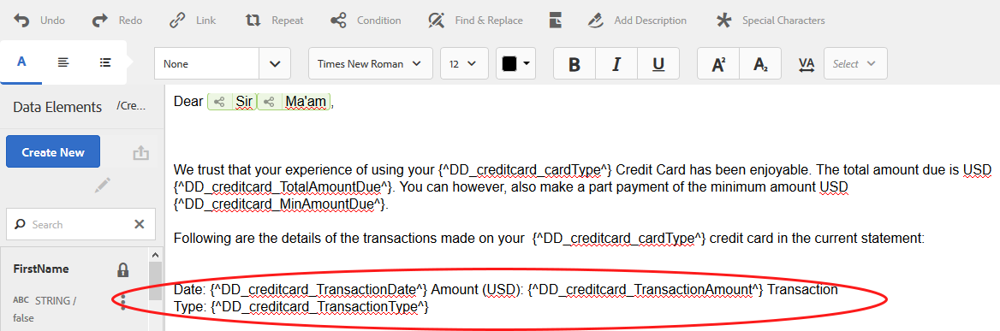
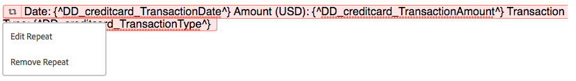

# 內嵌條件，並在互動式通訊和信件中重複{#inline-condition-and-repeat-in-interactive-communications-and-letters}

## 內嵌條件 {#inline-conditions}

AEM Forms可讓您在文字模組中使用內嵌條件，以自動呈現依賴與表單資料模型（在互動式通訊中）或資料字典（以字母表示）相關的內容或資料的文字。 內嵌條件會根據條件評估為true或false，顯示特定內容。

條件對表單資料模型／資料字典或最終用戶提供的資料值執行計算。 使用內嵌條件，您可以節省時間並減少人為錯誤，同時建立高度情境化和個人化的互動式通訊／信件。

如需詳細資訊，請參閱：

* [建立互動式通訊](../../forms/using/create-interactive-communication.md)
* [通信管理概述](/help/forms/using/cm-overview.md)
* [互動式通訊中的文字](../../forms/using/texts-interactive-communications.md)

### 範例：使用規則在互動式通訊中條件化內嵌文字 {#example-using-rules-to-conditionalize-inline-text-in-interactive-communication}

若要在互動式通訊中條件化句子、段落或文字字串，您可以在適當的文字檔案片段中建立規則。 下列範例使用規則，只向互動式通訊的美國收件者顯示免付費電話。

如需詳細資訊，請參閱互動式通訊中文字 [中的建立規則](../../forms/using/texts-interactive-communications.md)。

在互動式通訊和代理中加入文字片段後，會使用代理UI來準備互動式通訊後，就會評估收件者的（表單資料模型）資料，而文字只會顯示給美國的收件者。

### 範例：在字母中使用內嵌條件來呈現適當的位址 {#example-using-inline-condition-in-a-letter-to-render-the-appropriate-address}

通過在相應的文本模組中插入內嵌條件，可以在字母中插入內嵌條件。 下列範例使用兩個條件來評估並顯示以DD元素「性別」為基礎的信件中的適當位址Sir或Ma&#39;am。 使用類似的步驟，您可以建立其他條件。

>[!NOTE]
>
>如果您的現有資產包含舊的條件／重複運算式（6.2 SP1 CFP 4之前版本），則資產會顯示舊的條件語法並重複。 但是，舊的條件／重複操作有效。 新舊條件／重複表達式相互相容，以建立新舊條件／重複表達式的嵌套混合。

1. 在相關的文本模組中，選擇要條件化的文本部分並點選「條 **件**」。

   

   出現「Condition（條件）」對話框，其中包含空條件。

   

   >[!NOTE]
   >
   >無法儲存空白或無效的條件運算式。 必須有有效的條件運算式內 `${}` 部才能儲存運算式。

1. 請執行下列動作來建立條件，以評估選取／條件化文字是否出現在字母中，然後點選核取標籤以儲存運算式：

   點選兩下DD元素，將其插入條件中。 插入適當的運算子，並在對話方塊中建構下列條件。

   ```java
   ${DD_creditcard_Gender=="Male"}
   ```

   如需有關建立運算式的詳細資訊，請參閱「運 **算式產生器」中的「使用運算式產生器建立運算式** 和遠端 [函式」](../../forms/using/expression-builder.md)。 運算式中指定的值必須支援資料字典中的元素。 如需詳細資訊，請參 [閱資料字典](../../forms/using/data-dictionary.md)。

   插入條件後，可將滑鼠指標暫留在條件左側的控點上，以檢視該條件。 您可以點選控點來檢視條件的快顯功能表，讓您編輯或移除條件。

    

1. 選取文字以插入類似條件 `Ma'am`。

   ```java
   ${DD_creditcard_Gender == "Female"}
   ```

1. 預覽相關字母，並注意文字會根據內嵌條件轉譯。 您可以使用以下方式輸入「DD元素性別」的值：

   * 在預覽含範例資料的字母時，根據相關資料字典建立範例XML資料檔案。
   * 附加至相關資料字典的XML資料檔案。
   如需詳細資訊，請參 [閱資料字典](../../forms/using/data-dictionary.md)。

   

## 重複 {#repeat}

您的互動式通訊／信函中可能包含動態資訊，例如信用卡對帳單中的交易，其例項或發生次數可能會隨每個產生的信函而持續變更。 使用重複，您可以在文字檔案片段中格式化和建構此類動態資訊。

此外，您可以在重複構造中指定規則／條件，以條件化在交互通信／字母中呈現的資訊／條目。

### 範例：在互動式通訊中使用重複，以格式化、建構及顯示信用卡交易清單 {#example-using-repeat-in-an-interactive-communication-to-format-structure-and-display-a-list-of-credit-card-transactions}

以下範例提供使用重複來建構和轉換互動式通訊中信用卡交易的步驟。

1. 在基於表單資料模型的文本文檔片段中，插入相關的表單資料模型對象（以及標籤所需的嵌入文本，如本例所示）:

   

   >[!NOTE]
   >
   >可重複內容必須至少包含一個類型為「集合」的屬性。

1. 選取要套用重複的內容。

   

1. 點選「重複」。

   出現「重複」(Repeat)對話框。

   

1. 選取「分行符號」(Line Break)作為分隔符號，並視需要點選「新增條件」(Add Condition)以建立規則。 您也可以使用文字做為分隔符號，並指定要用作分隔符號的文字字元。

   此時將顯示「建立規則」對話框。

1. 建立規則以顯示日期為2018年2月28日之後的事務處理，以便在互動式通訊中僅包含3月的事務處理。

   >[!NOTE]
   >
   >此示例假設座席將在2018年3月底建立語句。 否則，您可以建立另一個規則以包含2018年3月後2018年4月01日之前的交易，以排除2018年3月之後的交易。

   

1. 儲存條件／規則，然後儲存重複。 條件式重複會套用至選取的內容。

   

   在滑鼠移至上方時，文字檔案片段會顯示「條件」和重複套用至內容的分隔符號。

1. 儲存文字檔案片段並預覽相關的互動式通訊。 根據表單資料模型中的資料，對元素套用的重複會呈現與預覽中下列類似的交易詳細資料：

   

### 範例：以信函格式、結構和顯示信用卡交易清單重複使用 {#example-using-repeat-in-a-letter-to-format-structure-and-display-a-list-of-credit-card-transactions}

以下範例提供使用重複來建構並轉換信用卡交易的步驟。 使用類似的步驟，您可以在不同的情況下使用重複。

1. 開啟（在編輯或建立時）文字模組，其中包含可轉譯重複／動態資料的DD元素，並在DD元素周圍內嵌必要文字。 例如，文本模組具有以下DD元素，以在信用卡上建立事務處理對帳單：

   ```
   {^DD_creditcard_TransactionDate^} {^DD_creditcard_TransactionAmount^}
   {^DD_creditcard_TransactionType^}
   ```

   這些DD元素會產生信用卡上進行交易的清單，其中包含下列資訊：

   事務處理日期、事務處理金額和事務處理類型（借項或貸項）

1. 在DD元素中嵌入文本，使語句更易讀，如：

   

   ```
   Date: {^DD_creditcard_TransactionDate^} Amount (USD): {^DD_creditcard_TransactionAmount^} Transaction Type: {^DD_creditcard_TransactionType^}
   ```

   但是，尚未完成格式化語句的生成工作。 如果您根據目前所做的工作來轉譯信函，該信函會顯示為：

   

   要重複靜態文本和DD元素，需要應用重複，如後續步驟中所述。

1. 選擇要重複的靜態文本和DD元素，如下所示：

   

1. 點選「 **重複**」。 出現「重複」對話框，其中包含空的內嵌條件。

   

1. 如果需要，請插入條件以選擇性地呈現交易，例如呈現大於50美分的交易金額：

   ```
   ${DD_creditcard_TransactionAmount > 0.5}
   ```

   否則，如果您不需要選擇性地轉譯資訊（此處的交易），請在對話方塊中刪除下列項目，將條件保留為空白： `${}`。 當重複運算式視窗為空時（不需要重複時不含${}），或包含有效的重複條件時，會啟用儲存重複運算式。

1. 選取分隔符號以格式化動態文字，並點選核取標籤以儲存：

   * **分行**:在輸出字母中的每個事務處理條目之後插入分行符號。
   * **文字**:在輸出字母中的每個事務條目後面插入指定的文本字元。
   插入條件後，帶有重複的文本將以紅色加亮，其左側將顯示一個控點。 您可以將滑鼠指標暫留在重複的左側控制滑塊上，以檢視重複的構造。

   

   您可以點選控點來檢視重複的快顯功能表，讓您編輯或移除重複的構造。

   

1. 預覽相關字母，並注意文字會根據重複顯示。 您可以使用下列方式輸入DD元素的值：

   * 在預覽含範例資料的字母時，根據相關資料字典建立範例XML資料檔案。
   * 附加至相關資料字典的XML資料檔案。
   如需詳細資訊，請參 [閱資料字典](https://helpx.adobe.com/aem-forms/6-2/data-dictionary.html)。

   

   靜態文本與事務詳細資訊一起重複。 在此過程中對文本重複應用有助於重複靜態文本。 此條件${DD_creditcard_TransactionAmount > 0.5}可確保不會在信函中呈現低於USD .5的交易。

   >[!NOTE]
   >
   >您只能在建立或編輯相關文字模組時插入條件並重複。 在預覽字母時，雖然您可以編輯文字模組，但無法插入條件或重複。

## 使用內嵌條件並重複——某些使用案例 {#using-inline-condition-and-repeat-some-use-cases}

### 在條件中重複 {#repeat-within-condition}

您可能需要在條件內使用重複。 「對應管理」允許您在內嵌條件結構內使用重複。

例如，在條件（格式為綠色）中重複下列內容（格式為紅色）。

當重複轉譯信用卡交易時，條件${DD_creditcard_nooftransactions > 0}可確保只有在至少有一項交易時才轉譯重複建構。


同樣地，您也可以根據您的需求建立：

* 條件內的一個或多個條件
* 重複內的一個或多個條件
* 條件和在條件或重複內重複的組合

### 空的內嵌條件 {#empty-inline-condition}

您可能需要稍後插入空白的內嵌條件以及內嵌文字和DD元素。 「通信管理」允許您執行此操作。


不過，建議您盡可能先在文字模組中插入文字和DD元素，並使用預期的格式（例如項目符號），然後套用內嵌條件。
