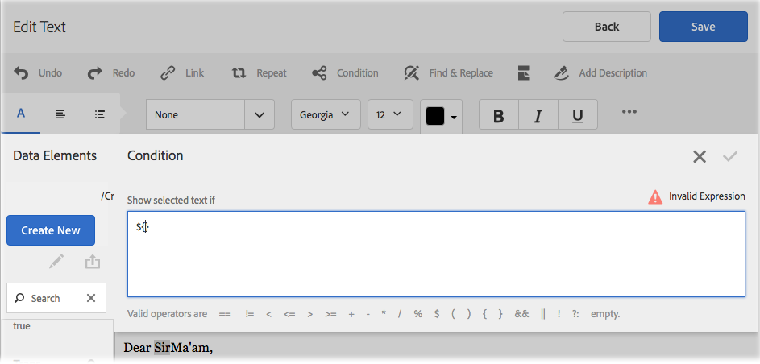

# 內聯條件和在互動式通信和字母中重複{#inline-condition-and-repeat-in-interactive-communications-and-letters}

## 內聯條件 {#inline-conditions}

AEM Forms允許您在文本模組中使用內嵌條件來自動呈現依賴於與表單資料模型（在交互通信中）或資料字典（在字母中）關聯的上下文或資料的文本。 內聯條件根據條件評估為true或false顯示特定內容。

條件對表單資料模型/資料字典或最終用戶提供的資料值執行計算。 使用內聯條件，您可以節省時間並減少人為錯誤，同時建立高度上下文化和個性化的互動式通信/字母。

有關詳細資訊，請參閱：

* [建立互動式通信](../../forms/using/create-interactive-communication.md)
* [信件管理概述](/help/forms/using/cm-overview.md)
* [互動式通信中的文本](../../forms/using/texts-interactive-communications.md)

### 示例：使用規則在互動式通信中條件化內聯文本 {#example-using-rules-to-conditionalize-inline-text-in-interactive-communication}

要在互動式通信中條件化句子、段落或文本字串，可以在相應的文本文檔片段中建立規則。 以下示例使用規則只向互動式通信的美國收件人顯示免費號碼。

有關詳細資訊，請參閱中的「以文本形式建立規則」 [互動交流中的文本](../../forms/using/texts-interactive-communications.md)。

一旦將文本片段包含在交互通信中，代理使用代理UI準備交互通信，則會評估收件人（表單資料模型）的資料，並且該文本僅顯示給美國的收件人。

### 示例：在字母中使用內聯條件來呈現相應地址  {#example-using-inline-condition-in-a-letter-to-render-the-appropriate-address}

通過在相應的文本模組中插入內聯條件，可以在字母中插入內聯條件。 以下示例使用兩個條件在基於DD元素「性別」的信函中評估和顯示相應的地址（Sir或Ma&#39;am）。 使用類似步驟，可建立其它條件。

>[!NOTE]
>
>如果現有資產包含舊條件/重複表達式（6.2 SP1 CFP 4之前），則資產將顯示舊條件語法並重複。 但是，舊情況/重複工作。 新條件和舊條件/重複表達式彼此相容，以建立新舊條件/重複表達式的嵌套混合。

1. 在相關文本模組中，選擇要條件化並點擊的文本部分 **條件**。

   

   出現「條件」(Condition)對話框，但條件為空。

   

   >[!NOTE]
   >
   >無法保存空或無效的條件表達式。 內部必須有一個有效的條件表達式 `${}` 的子菜單。

1. 執行以下操作以構建一個條件，用於評估所選/條件化文本是否出現在字母中，然後點擊複選標籤以保存表達式：

   按兩下DD元素將其插入條件中。 插入相應的運算子並在對話框中構造以下條件。

   ```javascript
   ${DD_creditcard_Gender=="Male"}
   ```

   有關建立表達式的詳細資訊，請參見 **使用表達式生成器建立表達式和遠程函式** 在 [表達式生成器](../../forms/using/expression-builder.md)。 對於資料字典中的元素，必須支援表達式中指定的值。 有關詳細資訊，請參見 [資料字典](../../forms/using/data-dictionary.md)。

   插入條件後，可將滑鼠懸停在條件左側的手柄上以查看條件。 可以點擊手柄查看條件的彈出菜單，該菜單允許您編輯或刪除條件。

    

1. 通過選擇文本插入類似條件 `Ma'am`。

   ```javascript
   ${DD_creditcard_Gender == "Female"}
   ```

1. 預覽相關字母並注意根據內嵌條件呈現文本。 您可以使用以下方法輸入DD要素「性別」的值：

   * 在用示例資料預覽字母時，基於相關資料字典建立的示例XML資料檔案。
   * 附加到相關資料字典的XML資料檔案。

   有關詳細資訊，請參見 [資料字典](../../forms/using/data-dictionary.md)。

   

## 重複 {#repeat}

您的互動式通信/信函中可能包含動態資訊，例如信用卡對帳單中的事務處理，其實例或發生情況可能會隨著每個生成的信函而不斷變化。 使用重複，可以在文本文檔片段中格式化和構造此類動態資訊。

此外，可以在重複構造中指定規則/條件，以對在交互通信/字母中呈現的資訊/條目進行條件化。

### 示例：在互動式通信中使用重複以格式化、構造和顯示信用卡交易清單 {#example-using-repeat-in-an-interactive-communication-to-format-structure-and-display-a-list-of-credit-card-transactions}

下面的示例向您介紹了使用重複來構造和呈現互動式通信中的信用卡交易記錄的步驟。

1. 在基於表單資料模型的文本文檔片段中，插入相關表單資料模型對象（以及標籤所需的嵌入文本，如本例所示）:

   

   >[!NOTE]
   >
   >可重複內容必須至少包含一個「集合」類型的屬性。

1. 選擇要應用重複的內容。

   

1. 按一下「Repeat（重複）」。

   出現「重複」(Repeat)對話框。

   

1. 選擇「換行符」作為分隔符，並根據需要按一下「添加條件」以建立規則。 還可以將文本用作分隔符並指定要用作分隔符的文本字元。

   將出現「建立規則」對話框。

1. 建立規則以顯示日期為2018年2月28日之後的事務處理，以便在互動式通信中僅包括3月份的事務處理。

   >[!NOTE]
   >
   >本示例假定代理將在2018年3月底建立語句。 否則，您可以建立另一個規則以包括2018-04-01之前的事務以排除2018年3月之後的事務。

   

1. 保存條件/規則，然後保存重複。 條件重複將被應用到所選內容。

   

   在滑鼠懸停時，文本文檔片段將顯示「條件」和應用於內容的重複操作中使用的分隔符。

1. 保存文本文檔片段並預覽相關的互動式通信。 根據表單資料模型中的資料，對元素應用的重複操作將呈現與預覽中類似的事務處理詳細資訊：

   

### 示例：在信件中使用重複設定信用卡交易記錄的格式、結構和顯示清單 {#example-using-repeat-in-a-letter-to-format-structure-and-display-a-list-of-credit-card-transactions}

下面的示例向您介紹了使用repeat來構造和在信函中呈現信用卡交易記錄的步驟。 使用類似步驟，可以在不同的場景中使用重複。

1. 開啟（編輯或建立時）具有DD元素的文本模組，該DD元素會呈現重複/動態資料並將所需文本嵌入到DD元素周圍。 例如，文本模組具有以下DD元素以在信用卡上建立交易記錄對帳單：

   ```javascript
   {^DD_creditcard_TransactionDate^} {^DD_creditcard_TransactionAmount^}
   {^DD_creditcard_TransactionType^}
   ```

   這些DD元素將提供信用卡上進行的事務處理的清單，其中包含以下資訊：

   事務處理日期、事務處理金額和事務處理類型（借項或貸項）

1. 在DD元素中嵌入文本，使語句更易讀，如：

   

   ```javascript
   Date: {^DD_creditcard_TransactionDate^} Amount (USD): {^DD_creditcard_TransactionAmount^} Transaction Type: {^DD_creditcard_TransactionType^}
   ```

   但是，呈現格式良好的語句的任務尚未完成。 如果根據到目前為止所完成的工作來呈現字母，則會顯示如下：

   

   要重複靜態文本和DD元素，需要應用重複，如後續步驟中所述。

1. 選擇要重複的靜態文本和DD元素，如下所示：

   

1. 點擊 **重複**。 出現「重複」對話框，其內嵌條件為空。

   

1. 如果需要，請插入一個條件以選擇性地呈現交易，例如呈現大於50美分的交易金額：

   ```javascript
   ${DD_creditcard_TransactionAmount > 0.5}
   ```

   否則，如果不需要選擇性地呈現資訊（此處的事務），請通過刪除對話框中的以下內容來保持條件為空： `${}`。 當重複表達式窗口為空（不需要重複時不帶${}）或包含有效的重複條件時，將啟用保存重複表達式。

1. 選擇用於格式化動態文本的分隔符，然後點擊複選標籤以保存：

   * **換行符**:在輸出字母中的每個事務處理條目後插入換行符。
   * **文本**:在輸出字母中的每個事務處理條目後插入指定的文本字元。

   插入條件後，帶有重複項的文本將以紅色加亮，並在其左側顯示一個手柄。 可將滑鼠懸停在重複項左側的控制滑塊上以查看重複構造。

   

   可以點擊手柄查看重複的彈出菜單，該菜單允許編輯或刪除重複構造。

   

1. 預覽相關信件，並注意根據重複顯示文本。 可以使用以下方法輸入DD元素的值：

   * 在用示例資料預覽字母時，基於相關資料字典建立的示例XML資料檔案。
   * 附加到相關資料字典的XML資料檔案。

   有關詳細資訊，請參見 [資料字典](https://helpx.adobe.com/aem-forms/6-2/data-dictionary.html)。

   

   靜態文本與事務詳細資訊一起重複。 對此過程中的文本應用重複可促進重複靜態文本。 條件${DD_creditcard_TransactionAmount > 0.5}可確保在字母中不呈現低於USD.5的事務。

   >[!NOTE]
   >
   >只能在建立或編輯相關文本模組時插入條件並重複。 在預覽字母時，雖然可以對文本模組進行編輯，但無法插入條件或重複。

## 使用內聯條件並重複 — 某些使用情形  {#using-inline-condition-and-repeat-some-use-cases}

### 在條件內重複 {#repeat-within-condition}

您可能需要在條件內使用重複。 「通信管理」允許您在內聯條件構造中使用重複。

例如，在條件（格式為綠色）內重複（以紅色格式設定）以下內容。

當重複呈現信用卡交易記錄時，條件${DD_creditcard_nooftransactions > 0}確保僅在至少存在一個交易記錄時才呈現重複構造。


同樣，根據您的要求，您可以建立：

* 條件中的一個或多個條件
* 重複內的一個或多個條件
* 條件和在條件或重複內重複的組合

### 內聯條件為空 {#empty-inline-condition}

您可能需要稍後插入空的內聯條件並嵌入文本和DD元素。 Oracle Tergement允許您執行此操作。


但是，建議在可能的情況下，首先在文本模組中插入文本和DD元素，並使用預期的格式設定（如項目符號），然後應用內嵌條件。
