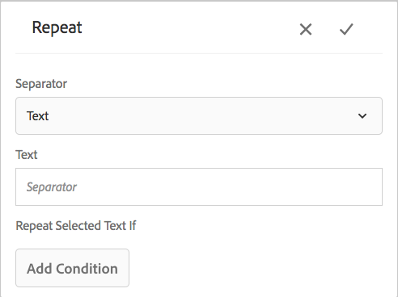
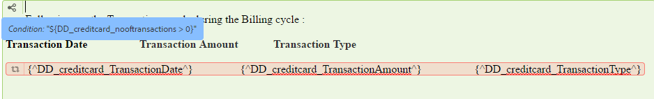

# 內嵌條件並在互動式通訊和信函中重複{#inline-condition-and-repeat-in-interactive-communications-and-letters}

## 內嵌條件 {#inline-conditions}

AEM Forms可讓您在文字模組中使用內嵌條件，以自動轉譯取決於與表單資料模型（互動式通訊）或資料字典（字母）相關聯的內容或資料的文字。 內嵌條件會根據條件評估為true或false來顯示特定內容。

條件會對表單資料模型/資料字典或一般使用者提供的資料值執行計算。 使用內嵌條件，您可以節省時間並減少人為錯誤，同時建立高度情境化和個人化的互動式通訊/信函。

如需詳細資訊，請參閱：

* [建立互動式通訊](../../forms/using/create-interactive-communication.md)
* [通信管理概述](/help/forms/using/cm-overview.md)
* [互動式通訊中的文字](../../forms/using/texts-interactive-communications.md)

### 範例：使用規則條件化互動式通訊中的內嵌文字 {#example-using-rules-to-conditionalize-inline-text-in-interactive-communication}

要在互動式通信中條件化句子、段落或文本字串，可以在相應的文本文檔片段中建立規則。 下列範例使用規則，只向互動式通訊的美國收件者顯示免付費電話號碼。

如需詳細資訊，請參閱以文字建立規則，位於 [互動式通信中的文本](../../forms/using/texts-interactive-communications.md).

一旦您將文本片段包含在互動式通信中，並且代理使用代理UI準備互動式通信後，將評估收件者（表單資料模型）的資料，並且該文本只顯示給美國的收件者。

### 範例：在信函中使用內嵌條件來轉譯適當的地址  {#example-using-inline-condition-in-a-letter-to-render-the-appropriate-address}

您可以在適當的文字模組中插入內嵌條件，將內嵌條件插入信函中。 下列範例使用兩個條件，根據DD元素「性別」，在信函中評估及顯示適當的位址（Sir或Ma&#39;am）。 使用類似步驟，您可以建立其他條件。

>[!NOTE]
>
>如果您的現有資產包含舊的條件/重複運算式（6.2版SP1 CFP 4之前），則資產會顯示舊的條件語法並重複。 不過，舊條件/重複有效。 新和舊條件/重複運算式彼此相容，以建立新舊條件/重複運算式的巢狀混合。

1. 在相關文字模組中，選取您要條件化並點選的文字部分 **條件**.

   

   出現「Condition（條件）」對話框，其中包含空條件。

   

   >[!NOTE]
   >
   >無法保存空或無效的條件表達式。 內部必須有有效的條件式運算式 `${}` 以儲存運算式。

1. 執行以下操作可構建一個條件，用於評估所選/條件化文本是否出現在信函中，然後點選複選標籤以保存表達式：

   點選兩下DD元素以在條件中插入它。 插入適當的運算子，並在對話方塊中建構下列條件。

   ```javascript
   ${DD_creditcard_Gender=="Male"}
   ```

   如需建立運算式的詳細資訊，請參閱 **使用運算式產生器建立運算式和遠端函式** in [運算式產生器](../../forms/using/expression-builder.md). 必須支援資料字典中的元素使用運算式中指定的值。 如需詳細資訊，請參閱 [資料字典](../../forms/using/data-dictionary.md).

   插入條件後，您可以將滑鼠移至條件左側的控制代碼上，以檢視條件。 您可以點選控制滑塊來查看條件的彈出菜單，該菜單允許您編輯或刪除條件。

    

1. 選取文字以插入類似條件 `Ma'am`.

   ```javascript
   ${DD_creditcard_Gender == "Female"}
   ```

1. 預覽相關信函，並注意文字已根據內嵌條件轉譯。 您可以使用以下項目輸入DD元素「性別」的值：

   * 在使用範例資料預覽信函時，根據相關資料字典建立的範例XML資料檔案。
   * 附加至相關資料字典的XML資料檔案。

   如需詳細資訊，請參閱 [資料字典](../../forms/using/data-dictionary.md).

   

## 重複 {#repeat}

您的互動式通信/信函中可能有動態資訊，例如信用卡對帳單中的交易，其實例或發生次數可能隨著每個生成的信函而不斷變化。 使用重複，您可以在文字檔案片段中格式化和建構此類動態資訊。

此外，您可以在重複構造內指定規則/條件，以條件化在互動式通信/信函中呈現的資訊/條目。

### 範例：在互動式通訊中使用重複，以設定、建構和顯示信用卡交易清單 {#example-using-repeat-in-an-interactive-communication-to-format-structure-and-display-a-list-of-credit-card-transactions}

以下示例為您提供了使用重複來在互動式通信中構造和呈現信用卡交易的步驟。

1. 在基於表單資料模型的文本文檔片段中，插入相關的表單資料模型對象（以及標籤所需的嵌入文本，如本示例所示）:

   

   >[!NOTE]
   >
   >可重複的內容必須至少包含一個「集合」類型的屬性。

1. 選取要套用重複的內容。

   

1. 點選「重複」。

   將出現「重複」對話框。

   

1. 選取「分行符號」作為分隔符號，並視需要點選「新增條件」以建立規則。 您也可以使用文字作為分隔符號，並指定要作為分隔符號的文字字元。

   將出現「建立規則」對話框。

1. 建立規則以顯示日期為2018年2月28日之後的交易記錄，以在互動式通訊中僅包含3月的交易記錄。

   >[!NOTE]
   >
   >此範例假設代理將在2018年3月底建立陳述式。 否則，您可以建立另一個規則來納入2018年3月2018-04-01之前的交易，以排除2018年3月之後的交易。

   

1. 儲存條件/規則，然後儲存重複。 條件重複會套用至選取的內容。

   

   將滑鼠移至上方時，文字檔案片段會顯示條件，以及重複套用至內容時所使用的分隔符號。

1. 保存文本文檔片段並預覽相關的互動式通信。 根據表單資料模型中的資料，對元素應用的重複將呈現類似於預覽中的以下事務詳細資訊：

   

### 範例：在信函中重複使用，以格式、結構和顯示信用卡交易清單 {#example-using-repeat-in-a-letter-to-format-structure-and-display-a-list-of-credit-card-transactions}

以下示例提供了使用重複來構造和在信函中呈現信用卡交易的步驟。 使用類似步驟，您可以在不同案例中使用重複。

1. 開啟（在編輯或建立時）文字模組，其中包含可呈現重複/動態資料的DD元素，並在DD元素周圍嵌入所需文字。 例如，文本模組具有以下DD元素，以在信用卡上建立交易報表：

   ```javascript
   {^DD_creditcard_TransactionDate^} {^DD_creditcard_TransactionAmount^}
   {^DD_creditcard_TransactionType^}
   ```

   這些DD元素將呈現在信用卡上進行的事務處理的清單，其中包含以下資訊：

   事務處理日期、事務處理金額和事務處理類型（借項或貸項）

1. 將文字內嵌在DD元素內，讓陳述式更容易閱讀，例如：

   

   ```javascript
   Date: {^DD_creditcard_TransactionDate^} Amount (USD): {^DD_creditcard_TransactionAmount^} Transaction Type: {^DD_creditcard_TransactionType^}
   ```

   但是，尚未完成格式化語句的轉譯工作。 如果您根據目前所做的工作來轉譯信函，則會顯示如下：

   

   要重複靜態文本和DD元素，需要應用重複，如後續步驟中所述。

1. 選取您要重複的靜態文字以及DD元素，如下所示：

   

1. 點選 **重複**. 出現「Repeat（重複）」對話框，其中包含空的內嵌條件。

   

1. 如果需要，請插入一個條件以選擇性地呈現交易，例如呈現大於50美分的交易金額：

   ```javascript
   ${DD_creditcard_TransactionAmount > 0.5}
   ```

   否則，如果您不需要選擇性地呈現資訊（此處的交易），請在對話方塊中刪除下列項目，將條件保持空白： `${}`. 當重複運算式視窗為空時（不需要重複時不含${}）或包含有效的重複條件時，儲存重複運算式便會啟用。

1. 選取分隔符號，以格式化動態文字，並點選核取記號以儲存：

   * **分行**:在輸出信函中的每個交易項目後面插入分行符號。
   * **文字**:在輸出字母中的每個事務項後插入指定的文本字元。

   插入條件後，重複的文本將以紅色突出顯示，其左側將顯示句柄。 您可以將滑鼠移至重複項目左側的控點上，以檢視重複的建構。

   

   您可以點選控制滑塊以查看重複的彈出菜單，該菜單允許您編輯或刪除重複構造。

   

1. 預覽相關信函，並注意文字會根據重複次數呈現。 您可以使用以下項輸入DD元素的值：

   * 在使用範例資料預覽信函時，根據相關資料字典建立的範例XML資料檔案。
   * 附加至相關資料字典的XML資料檔案。

   如需詳細資訊，請參閱 [資料字典](https://helpx.adobe.com/aem-forms/6-2/data-dictionary.html).

   

   靜態文本與事務詳細資訊一起重複。 在此過程中對文本重複應用，可方便重複靜態文本。 條件${DD_creditcard_TransactionAmount > 0.5}可確保信函中不呈現低於USD .5的交易。

   >[!NOTE]
   >
   >您只能在建立或編輯相關文字模組時插入條件並重複。 預覽信函時，雖然您可以編輯文字模組，但無法插入條件或重複。

## 使用內嵌條件並重複 — 某些使用案例  {#using-inline-condition-and-repeat-some-use-cases}

### 在條件內重複 {#repeat-within-condition}

您可能需要在條件內使用重複。 「通信管理」可讓您在內嵌條件建構中使用重複。

例如，在條件（綠色格式）中重複（紅色格式）以下內容。

當重複轉譯信用卡交易時，條件${DD_creditcard_nooftransactions > 0}確保只有在至少有一個交易時才呈現重複構造。



同樣地，您可以根據需求建立：

* 條件內的一或多個條件
* 重複內的一或多個條件
* 條件與在條件或重複內重複的組合

### 空內嵌條件 {#empty-inline-condition}

您之後可能需要插入空的內嵌條件以及內嵌文字和DD元素。 「通信管理」可讓您執行此操作。


但建議您盡可能先在文字模組中插入文字和DD元素，並使用預期的格式（例如項目符號），然後套用內嵌條件。
