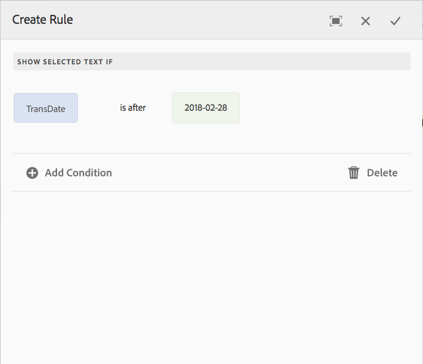

# 互動式通訊和字母中的內嵌條件和重複{#inline-condition-and-repeat-in-interactive-communications-and-letters}

## 內嵌條件 {#inline-conditions}

AEM Forms可讓您在文字模組中使用內嵌條件，根據與表單資料模型（在互動式通訊中）或資料字典（在信函中）相關聯的內容或資料來自動轉譯文字。 內嵌條件會根據條件評估為true或false來顯示特定內容。

條件會針對表單資料模型/資料字典或一般使用者所提供的資料值執行計算。 使用內嵌條件，您可以節省時間並減少人為錯誤，同時建立高度情境化的個人化互動式通訊/信件。

如需詳細資訊，請參閱：

* [建立互動式通訊](../../forms/using/create-interactive-communication.md)
* [通訊管理概觀](/help/forms/using/cm-overview.md)
* [互動式通訊中的文字](../../forms/using/texts-interactive-communications.md)

### 範例：使用規則在互動式通訊中條件化內嵌文字 {#example-using-rules-to-conditionalize-inline-text-in-interactive-communication}

若要在互動式通訊中條件化句子、段落或文字字串，您可以在適當的文字檔案片段中建立規則。 下列範例使用規則，只向互動式通訊的美國收件者顯示免付費號碼。

如需詳細資訊，請參閱互動式通訊中[文字的建立規則](../../forms/using/texts-interactive-communications.md)。

一旦您將文字片段納入互動式通訊中，且代理程式使用代理程式UI準備互動式通訊後，就會評估收件者的（表單資料模型）資料，且文字僅會顯示給美國的收件者。

### 範例：在信函中使用內嵌條件來轉譯適當的位址  {#example-using-inline-condition-in-a-letter-to-render-the-appropriate-address}

您可以在信函中插入內嵌條件，方法是在適當的文字模組中插入內嵌條件。 下列範例使用兩個條件，根據DD元素Gender評估並顯示信函中的適當地址Sir或Ma&#39;am。 使用類似的步驟，您可以建立其他條件。

>[!NOTE]
>
>如果您現有的資產包含舊的條件/重複運算式（6.2 SP1 CFP 4以前版本），資產會顯示條件和重複的舊語法。 但是，舊的條件/重複會運作。 新舊條件/重複運算式會相互相容，以建立巢狀混合舊條件和新條件/重複運算式。

1. 在相關的文字模組中，選取您要條件化的文字部分，並選取&#x200B;**條件**。

   

   「條件」對話方塊會以空白條件顯示。

   

   >[!NOTE]
   >
   >無法儲存空白或無效的條件運算式。 `${}`內必須有有效的條件運算式才能儲存運算式。

1. 執行下列操作來建構條件，以評估信函中是否顯示所選/條件化的文字，然後選取核取記號以儲存運算式：

   連按兩下DD元素，將其插入條件中。 插入適當的運運算元，並在對話方塊中建構下列條件。

   ```javascript
   ${DD_creditcard_Gender=="Male"}
   ```

   如需建立運算式的詳細資訊，請參閱[運算式產生器](../../forms/using/expression-builder.md)中的&#x200B;**使用運算式產生器**&#x200B;建立運算式與遠端函式。 資料字典中的元素必須支援運算式中指定的值。 如需詳細資訊，請參閱[資料字典](../../forms/using/data-dictionary.md)。

   插入條件後，您可以將滑鼠移至條件左側的控點上，以檢視條件。 您可以選取操作框來檢視條件的躍現式選單，讓您編輯或移除條件。

    

1. 選取文字`Ma'am`插入類似的條件。

   ```javascript
   ${DD_creditcard_Gender == "Female"}
   ```

1. 預覽相關信件，並注意文字是根據內嵌條件轉譯。 您可以使用以下方式輸入DD元素Gender的值：

   * 根據相關資料字典建立的範例XML資料檔案，同時預覽包含範例資料的字母。
   * 附加到相關資料字典的XML資料檔案。

   如需詳細資訊，請參閱[資料字典](../../forms/using/data-dictionary.md)。

   

## 重複 {#repeat}

您的互動式通訊/信函中可能有動態資訊，例如信用卡對帳單中的交易，其例項或發生次數可能會隨著每個產生的信函而不斷變更。 使用重複，您可以在文字檔案片段中格式化及建構這類動態資訊。

此外，您可以在重複建構中指定規則/條件，以條件化互動式通訊/信函中轉譯的資訊/專案。

### 範例：在互動式通訊中使用重複來格式化、建構並顯示信用卡交易清單 {#example-using-repeat-in-an-interactive-communication-to-format-structure-and-display-a-list-of-credit-card-transactions}

下列範例提供在互動式通訊中使用重複來建構及呈現信用卡交易的步驟。

1. 在基於表單資料模型的文字檔案片段中，插入相關的表單資料模型物件（以及標籤所需的內嵌文字，如以下範例所示）：

   

   >[!NOTE]
   >
   >可重複內容必須至少包含一個型別Collection的屬性。

1. 選取要套用重複的內容。

   

1. 選取「重複」。

   出現「重複」對話方塊。

   

1. 選取「分行符號」作為分隔符號，並視需要選取「新增條件」以建立規則。 您也可以使用文字做為分隔符號，並指定要做為分隔符號使用的文字字元。

   「建立規則」對話方塊隨即顯示。

1. 建立規則以顯示日期在2018年2月28日之後的交易，以便在「互動式通訊」中僅包含3月份的交易。

   >[!NOTE]
   >
   >此範例假設代理程式會在2018年3月底建立陳述式。 否則，您可以建立另一個規則來包含2018-04-01之前的交易，以排除2018年3月之後的交易。

   

1. 儲存條件/規則，然後儲存重複。 條件重複將套用至選取的內容。

   

   將滑鼠移到上方時，文字檔案片段會顯示套用至內容的重複中所使用的條件和分隔符號。

1. 儲存文字檔案片段並預覽相關的互動式通訊。 根據表單資料模型中的資料，在元素上套用的重複會呈現類似於預覽中的下列交易詳細資訊：

   

### 範例：在信函中使用重複來格式化、建構並顯示信用卡交易清單 {#example-using-repeat-in-a-letter-to-format-structure-and-display-a-list-of-credit-card-transactions}

下列範例提供您使用重複來建構和轉譯信函中信用卡交易的步驟。 使用類似的步驟，您便可以在不同的案例中重複使用。

1. 開啟（在編輯或建立時）文字模組，此模組具有轉譯重複/動態資料的DD元素，並將所需文字內嵌於DD元素周圍。 例如，文字模組有下列DD元素，可用來建立信用卡上的交易陳述式：

   ```javascript
   {^DD_creditcard_TransactionDate^} {^DD_creditcard_TransactionAmount^}
   {^DD_creditcard_TransactionType^}
   ```

   這些DD元素會呈現信用卡上的交易清單，其中包含下列資訊：

   交易日期、交易金額及交易型態（借方或貸方）

1. 將文字內嵌於DD元素中，讓陳述式更具可讀性，例如：

   

   ```javascript
   Date: {^DD_creditcard_TransactionDate^} Amount (USD): {^DD_creditcard_TransactionAmount^} Transaction Type: {^DD_creditcard_TransactionType^}
   ```

   不過，呈現格式化良好的陳述式的工作尚未完成。 如果您根據目前已完成的工作來轉譯信件，則會顯示如下：

   

   要與DD元素一起重複靜態文字，您需要按照後續步驟中的說明套用重複。

1. 選取您要重複的靜態文字和DD元素，如下所示：

   

1. 選取&#x200B;**重複**。 「重複」對話方塊會出現，內嵌條件為空白。

   

1. 如有必要，請插入條件以選擇性地轉譯交易，例如轉譯大於50分的交易金額：

   ```javascript
   ${DD_creditcard_TransactionAmount > 0.5}
   ```

   否則，如果您不需要選擇性地呈現資訊（此處為交易），請刪除對話方塊中的下列專案，讓條件保持空白： `${}`。 當重複運算式視窗空白（不需要重複時沒有${}）或包含有效的重複條件時，會啟用儲存重複運算式。

1. 選取用於格式化動態文字的分隔符號，並選取核取標籤以儲存：

   * **分行符號**：在輸出字母的每個交易專案之後插入分行符號。
   * **文字**：在輸出字母的每個交易專案之後插入指定的文字字元。

   插入條件後，具有重複的文字會以紅色反白顯示，且左側會出現控制點。 您可以將滑鼠停留在重複左側的操作框上以檢視重複建構。

   

   您可以選取操作框來檢視重複的躍現式選單，讓您編輯或移除重複建構。

   

1. 預覽相關信件，並注意文字會根據重複轉譯。 您可以使用以下方式輸入DD元素的值：

   * 根據相關資料字典建立的範例XML資料檔案，同時預覽包含範例資料的字母。
   * 附加到相關資料字典的XML資料檔案。

   如需詳細資訊，請參閱[資料字典](https://helpx.adobe.com/aem-forms/6-2/data-dictionary.html)。

   

   靜態文字會與交易詳細資料重複。 透過在此程式中套用至文字的重複操作，可促進重複靜態文字。 條件${DD_creditcard_TransactionAmount > 0.5}可確保信件中未轉譯USD .5以下的交易。

   >[!NOTE]
   >
   >您只能在建立或編輯相關文字模組時插入條件並重複。 預覽信函時，雖然您可以編輯文字模組，但無法插入條件或重複。

## 使用內嵌條件和重複 — 部分使用案例  {#using-inline-condition-and-repeat-some-use-cases}

### 在條件中重複 {#repeat-within-condition}

您可能需要在條件內使用重複。 「通訊管理」可讓您在內嵌條件建構中使用重複。

例如，下列是在條件中重複（格式化為紅色） （格式化為綠色）。

當重複產生信用卡交易時，條件${DD_creditcard_nooftransactions > 0}可確保只有在至少有一個交易時，才會產生重複建構。


同樣地，根據您的需求，您可以建立：

* 條件中的一個或多個條件
* 重複中的一或多個條件
* 條件和重複條件的組合，在條件或重複內重複

### 空的內嵌條件 {#empty-inline-condition}

您可能需要稍後插入空的內嵌條件並嵌入文字和DD元素。 「通訊管理」可讓您這麼做。


不過，建議您儘可能先將文字和DD元素插入具有預期格式的文字模組中（例如專案符號），然後再套用內嵌條件。
