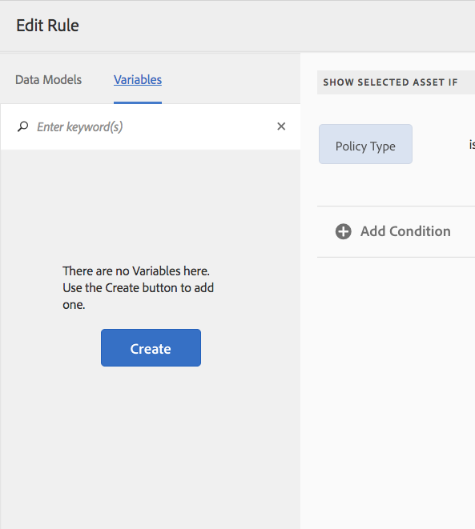

# 互動式通訊的條件{#conditions-in-interactive-communications}

建立和編輯要用於互動式通訊的條件片段——條件是用於建立互動式通訊的4種檔案片段之一。 其他三種是文字、清單和版面片段。

## 概覽 {#overview}

條件是可包含在「互動式通訊」中的檔案片段。 其他檔案片段為 [文字](../../forms/using/texts-interactive-communications.md)、清單和版面片段。 條件可讓您根據提供的資料和規則，定義一或多個內容相關的資產，以納入互動式通訊中。

範例：

* 在信用卡對帳單中，根據客戶的信用卡類型顯示信用卡年費和信用卡影像。
* 在保險費到期提醒中，顯示根據客戶所在州稅額計算的稅額。

根據套用的規則和傳遞至規則的值，呈現條件中的資產。 條件中的規則可檢查下列資料類型中的值：

* 關聯表單資料模型的屬性
* 您在條件中建立的任何變數
* 字串
* 數字
* 數學表達式
* 日期

## Create condition {#createcondition}

1. 選擇「 **[!UICONTROL 表單]** >文 **[!UICONTROL 件片段」]**。
1. 選擇「 **[!UICONTROL 建立]** 」>「 **[!UICONTROL 條件」]**。
1. 指定下列資訊：

   * **[!UICONTROL 標題]**:（可選）輸入條件的標題。 標題不必是唯一的，可以有特殊字元和非英文字元。 條件會以其標題（如果有的話）來參照，例如縮圖和屬性中。
   * **[!UICONTROL 名稱]**:資料夾內條件的唯一名稱。 任何狀態下，檔案夾中都不能有相同名稱的兩個檔案片段（文字、條件或清單）。 在「名稱」欄位中，您只能輸入英文字元、數字和連字型大小。 「名稱」欄位會根據「標題」欄位自動填入。 在「標題」欄位中輸入的特殊字元、空格、數字和非英文字元將在「名稱」欄位中替換為連字元。 雖然「標題」欄位中的值會自動複製到「名稱」，但您可以編輯值。

   * **[!UICONTROL 說明]**:鍵入文檔片段的說明。
   * **[!UICONTROL 表單資料模型]**:（可選）選擇「表單資料模型」單選按鈕，以基於表單資料模型建立條件。 選擇「表單資料模型」單選按鈕後，將 **[!UICONTROL 顯示「表單資料模型]** 」欄位。 瀏覽並選取表單資料模型。 在建立互動式通訊的條件時，請確定您使用的資料模型與您要在互動式通訊中使用的資料模型相同。 如需表單資料模型的詳細資訊，請參 [閱資料整合](../../forms/using/data-integration.md)。

   * **[!UICONTROL 標籤]**:（可選）若要建立自訂標籤，請在文字欄位中輸入值，然後點選Enter。 儲存此條件時，會建立新新增的標籤。

1. 點選「 **[!UICONTROL 下一步]**」。

   「建立條件」頁面。

   

1. 點選「 **[!UICONTROL 新增資產」]**。

   「選擇資產」頁面隨即出現，並顯示可用的文字、清單、條件和影像，以便在條件中新增。

   >[!NOTE]
   >
   >「選擇資產」頁中只顯示基於無的、新建立的資產和基於FDM的資產（使用與建立的條件相同的FDM建立）。

1. 點選適當的資產以選取要包含在條件中的資產，然後點選「 **[!UICONTROL 完成]**」。

   建立條件」頁面，並列出新增的資產。

   

   您可以使用下列選項來管理條件中的資產：

   

   **[拒絕變更]。**點選此圖示可拒絕條件中對資產和規則所做的變更。   **[B]接受變更。**點選此圖示可接受您在條件中對資產和規則所做的變更。   **[複製資產]。**點選此圖示可在條件中建立資產的復本以及套用的規則（如果有）。 然後，您可以繼續編輯複製資產的規則和資產。 複製資產對於建立類似規則以根據特定上下文顯示替代資產非常有用。   **[顯示]「預覽」。**點選此圖示可在「建立\編輯條件」頁面中顯示資產的預覽。   **[重新排序]。**點選並按住此圖示可拖放資產，以在條件內重新排序資產。

   您可以選取下列選項，以指定條件在執行時期的運作方式：

   * **多結果評估已禁用\啟用多結果評估**:啟用此選項（顯示為「啟用多個結果評估」）時，會評估所有規則，結果是所有真實規則的總和。 如果此選項已停用（顯示為「已停用多重結果評估」），則只會評估第一個發現為true的規則，並變成條件的輸出。

   * **分頁符**:選取此選項( )，在條件的資產之間新增分頁符。 如果未選取此選項( )，如果條件溢出至列印輸出中的下一頁，則整個條件會移至下一頁，而非在條件中資產之間的頁面中斷。

1. 點選 **[!UICONTROL 「建立規則]** 」以新增規則以視需要顯示或隱藏資產。 若要在規則中使用變數，請參閱 [建立變數](#variables)。 如需詳細資訊，請參 [閱新增規則至條件](#ruleeditor)。

   已建立的規則將出現在「建立條件」螢幕的RULE列中。

   

   >[!NOTE]
   >
   >您可以在條件中插入已套用規則或重複套用的資產。

1. 點選「 **[!UICONTROL 儲存]**」。

   條件即會建立。 現在，您可以在建立互動式通訊時，繼續將條件當做建置區塊。

   >[!NOTE]
   >
   >若要儲存新或編輯的條件，您必須針對條件中新增的每個資產至少有一個規則。

## 編輯條件 {#edit-a-condition}

您可以使用下列步驟編輯條件。 您也可以選擇彈出式選單中的「編輯片段」，從「互動式通訊」中編輯條件。

1. 選擇「 **[!UICONTROL 表單]** >文 **[!UICONTROL 件片段」]**。
1. 導覽至條件並選取它。
1. 點選 **[!UICONTROL 編輯]**。
1. 在條件中進行必要的更改。 如需條件中可變更資訊的詳細資訊，請參閱「建立 [條件」](#createcondition)。
1. 點選「 **[!UICONTROL 儲存]** 」，然後點 **[!UICONTROL 選「關閉」]**。

## 在條件中建立規則 {#ruleeditor}

在條件中使用規則編輯器，您可以建立規則以根據預設條件顯示或隱 **藏資產**。 這些條件可基於：

* 字串
* 數字
* 數學表達式
* 日期
* 關聯表單資料模型的屬性
* 您可 [能已建立](#variables) 的任何變數

### 在條件中建立規則 {#create-rule-in-condition}

1. 建立或編輯條件時，請點選  （規則編輯器）圖示以取得相關資產。

   此時將顯示「建立規則」對話框。 除了字串、數字、數學運算式和日期之外，規則編輯器中也提供下列功能，以建立規則的陳述式：

   * 關聯表單資料模型的屬性
   * 您可 [能已](#variables) 建立的任何變數。
   

   選擇要評估的適當選項。

   >[!NOTE]
   >
   >建立規則以顯示資產時不支援收集屬性。

1. 選取適當的運算子來評估規則，例如「等於」、「包含」和「開頭為」。
1. 插入評估運算式、字串、資料模型屬性、變數或日期。

   

   規則：當原則類型為標準時顯示資產

   * 在建立或編輯規則時，您也可以點選  (Resize)以展開「建立規則／編輯規則」對話方塊。 展開的全視窗對話方塊可讓您建立變 [數](#variables) ，以建立規則。 再次點選「調整大小」，返回一般的「建立規則」對話方塊。

   * 您也可以在規則中建立多個條件。

1. 點選「 **[!UICONTROL 完成]**」。

   規則會套用至資產。

## 在條件中建立和使用變數 {#variables}

在條件中建立或編輯規則時，您可以點選  (Resize)以展開「建立規則\編輯規則」對話方塊。 展開的全視窗對話框允許您：

* 在規則中建立和使用變數
* 規則中的拖放表單資料模型屬性和變數

再次點選「調整大小」，返回「建立規則\編輯規則」對話方塊。

### 建立變數 {#create-variables}

1. 在條件中建立或編輯規則時，您可以點選  (Resize)以展開「建立規則\編輯規則」對話方塊。

   出現「Expanded, full-window（展開的全窗口）」對話框。

   

1. 在左窗格中，點選「變 **[!UICONTROL 數」]**。

   此時會出現「變數」窗格。

   

1. 點選「 **[!UICONTROL 建立]**」。

   「建立變數」窗格隨即出現。

1. 輸入下列資訊並點選「 **[!UICONTROL 建立]**:

   * **[!UICONTROL 名稱]**:變數的名稱。
   * **[!UICONTROL 說明]**:（可選）輸入有關變數的說明。
   * **[!UICONTROL 類型]**:選取變數類型：字串、數字、布林值或日期。
   * **[!UICONTROL 僅允許特定值]**:對於字串和數字變數，您可以確保代理從特定值集中選擇，以用於代理UI中的預留位置。 若要指定值集，請選取此選項，然後指定值欄位中允許的逗號分 **[!UICONTROL 隔值]** 。

1. 點選「 **[!UICONTROL 建立]**」。

   變數會建立並列在「變數」窗格中。

1. 若要在規則中插入變數，請將變數拖放至規則中某個選項的預留位置。
1. 建立有效規則後，請點選「完 **[!UICONTROL 成」]**。

   如有需要，請繼續在條件中進行進一步的更改並保存。

