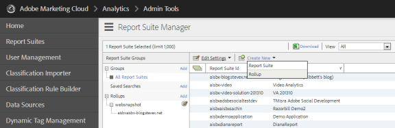
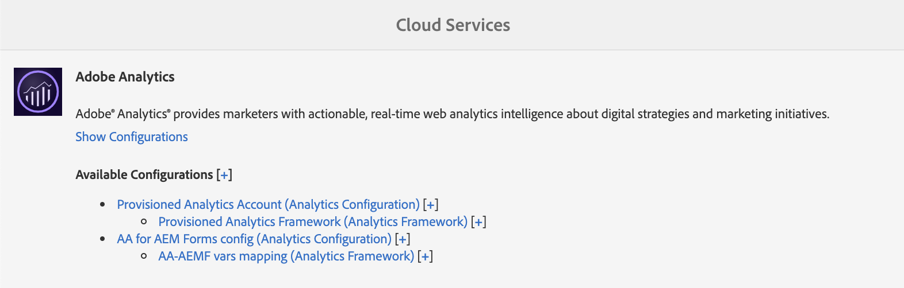

# 設定分析和報告{#configuring-analytics-and-reports}

AEM Forms與Adobe Analytics整合，可讓您擷取並追蹤已發佈表單和檔案的效能量度。 分析這些量度的目的，是根據使表單或檔案更有用所需變更的資料，做出明智的決策。

>[!NOTE]
>
>AEM Forms中的分析功能是AEM Forms附加套件的一部分。 如需安裝附加元件套件的詳細資訊，請參 [閱安裝與設定AEM Forms](../../forms/using/installing-configuring-aem-forms-osgi.md)。
>
>除了附加元件套件外，您還需要AEM例項的Adobe Analytics帳戶和管理員權限。 如需解決方案的詳細資訊，請參 [閱Adobe Analytics](https://www.adobe.com/solutions/digital-analytics.html)。

## 概覽 {#overview}

您可以使用Adobe Analytics來發現使用者在使用最適化表單、HTML5表單和互動式通訊時所面臨的互動模式和問題。 Adobe分析立即可追蹤並儲存下列參數的相關資訊：

* **平均填寫時間**:填寫表格的平均時間。
* **轉譯**:表單開啟的次數。
* **草稿**:表單在草稿狀態中儲存的次數。
* **提交**:提交表單的次數。
* **中止**:使用者離開表單而未填寫的次數。

您可以自訂Adobe Analytics以新增／移除更多參數。 除了上述資訊外，報表還包含下列HTML5和最適化表單各面板的相關資訊：

* **時間**:在面板和面板欄位上的逗留時間。
* **錯誤**:在面板和面板欄位上遇到的錯誤數。
* **說明**:使用者開啟面板說明和面板欄位的次數。

## 建立報表套裝 {#creating-report-suite}

Analytics資料會儲存在稱為報表套裝的客戶專屬儲存庫中。 若要建立報表套裝並使用Adobe Analytics，您必須擁有有效的Adobe Marketing cloud帳戶。 在執行下列步驟之前，請確定您擁有有效的Adobe Marketing cloud帳戶。

執行下列步驟以建立報表套裝。

1. 登入https://sc.omniture.com/login/(英 [文)](https://sc.omniture.com/login/)
1. 在Marketing cloud中，選取「管 **理** >管 **理控制台** > **報表套裝**」。
1. 在「 **報表套裝管理** 員」中選 **取「建立新** >報表套裝」。

   

   建立新的報表套裝

1. 請確定第一個下拉式清單已設為「從范 **本建立」** ，然後選取「 **商務」**。
1. 找出「 **報表套裝ID** 」欄位並新增報表套裝ID。 例如，JJEsquire。 報表套裝ID會顯示在「報表套裝ID」欄位下方。 它包含自動首碼，通常是公司名稱。
1. 新增網 **站標題**。 例如，JJEsquire Getting Suite。 此標題會用於Analytics UI。 在您的程式碼中使用報表套裝ID。
1. 從下拉 **式清單中選** 取時區。 此報表套裝中的所有資料都會根據定義的時區進行記錄。
1. 將「基 **本URL** 」和「預 **設頁面** 」欄位留空。 這兩個值僅用於從Adobe Marketing cloud介面連結至您的網站。
1. 將「上 **線日期** 」設為今天。 「上線日期」會決定報表套裝啟動的日期。
1. 在「預 **計的每日頁面檢視次數** 」欄位中，輸入100。 使用此欄位可估計您預計每天網站的頁面檢視次數。 此估計值可讓Adobe針對您要收集的資料，配置適當數量的硬體。
1. 從下拉 **式清單中選取** 「基本貨幣」。 此報表套裝中的所有貨幣資料都會轉換並儲存為此貨幣格式。
1. 按一 **下建立報表** 套裝。 您應該會看到頁面重新整理，並顯示報表套裝已成功建立的訊息。
1. 選取新建立的報表套裝。 導覽至「 **編輯設定** >一 **般** >一 **般帳戶設定」**。

   

   一般帳戶設定

1. 在「一般帳戶設定」畫面中，啟用「地 **理報表」**，然後按一下「 **儲存」。**
1. 導覽至「 **編輯設定** >流 **量** >流 **量變數」**。
1. 在報表套裝中，設定並啟用下列流量變數。

   * **formName**:最適化表單的識別碼。
   * **formInstance**:最適化表單例項的識別碼。 啟用此變數的路徑報表。
   * **fieldName**:最適化表單欄位的識別碼。 啟用此變數的路徑報表。
   * **panelName**:最適化表單面板的識別碼。 啟用此變數的路徑報表。
   * **formTitle**:表單標題。
   * **fieldTitle**:表單欄位的標題。
   * **panelTitle**:表單面板的標題。
   * **analyticsVersion**:表單分析的版本。

1. 導覽至「 **編輯設定** > **轉換** >成 **功事件」**。 定義並啟用下列成功事件：

   | 成功事件 | 類型 |
   |---|---|
   | 放棄 | 計數器 |
   | 渲染 | 計數器 |
   | panelVisit | 計數器 |
   | fieldVisit | 計數器 |
   | 儲存 | 計數器 |
   | 錯誤 | 計數器 |
   | 說明 | 計數器 |
   | 提交 | 計數器 |
   | timeSpent | 數值 |

   >[!NOTE]
   >
   >用來設定AEM Forms分析的事件編號和prop編號必須與 [AEM Analytics設定中使用的事件編號和prop編號不同](/help/sites-administering/adobeanalytics.md) 。

1. 登出Adobe Marketing cloud帳戶。

## 建立雲端服務設定 {#creating-cloud-service-configuration}

雲端服務設定是有關您Adobe Analytics帳戶的資訊。 此設定可讓Adobe Experience Manager(AEM)連線至Adobe Analytics。 為您使用的每個Analytics帳戶建立個別的設定。

1. 以管理員身分登入您的AEM作者實例。
1. 在左上角，按一下「 **Adobe Experience Manager** > **Tools** > Deployment ********> Cloud Services」。
1. 找到 **Adobe Analytics圖示** 。 按一下 **顯示配置** ，然後繼續按一下 **[]** +以添加新配置。

   如果您是首次使用者，請按一下「立 **即設定」**。

1. 將標題新增至新設定（填寫「名稱」欄位是選擇性的）。 例如，我的分析設定。 按一下&#x200B;**「建立」**。

1. 當「編輯」面板在設定頁面上開啟時，請填入下列欄位：

   * **公司**:Adobe Analytics中您公司的名稱。
   * **使用者名稱**:用來登入Adobe Analytics的名稱。
   * **密碼**:上述帳戶的Adobe Analytics密碼。
   * **資料中心**:Adobe Analytics帳戶的資料中心。

1. 按一 **下「連線至Analytics」**。 出現對話框，並顯示連接成功的消息。 按一下 **確定**。

## 建立雲端服務架構 {#creating-cloud-service-framework}

Adobe Analytics架構是Adobe Analytics變數與AEM變數之間的一組映射。 使用架構來設定表單如何將資料填入Adobe Analytics報表。 架構與Adobe Analytics組態相關聯。 您可以為每個配置建立多個框架。

1. 在AEM雲端服務主控台上，按一下「 **Adobe Analytics**」下方的「顯示設定」。
1. 按一下 **[Analytics設定旁]** 的+連結。

   

   Adobe Analytics設定

1. 鍵入框 **架的** And **Name** ，選擇 **Adobe Analytics** Framework，然後按一下 **** Create title。 此框架將開啟以供編輯。
1. 在側面pod的「報表套裝」區段中，按一下「 **Add Item**」（新增項目），然後使用下拉式清單來選取框架將與之互動的報表套裝ID（例如JJEsquire）。
1. 在「報表套裝ID」旁，選取您要傳送資訊至報表套裝的伺服器例項。

   

1. 將表 **單分析元件** (Form Analytics) **從SideKick** )拖曳至架構上。
1. 若要將Analytics變數與元件中定義的變數對應，請將變數從AEM Content Finder拖曳至追蹤元件上的欄位。

   

1. 使用sidekick中的頁 **面標籤啟動框架** ，按一下「啟 **動框架」**。

## 設定AEM Forms Analytics設定服務 {#configuring-aem-forms-analytics-configuration-service}

1. 在作者例項上，開啟AEM Web Console Configuration Manager（AEM網頁主控台組態管理器） `https://<server>:<port>;/system/console/configMgr`於。
1. 尋找並開啟AEM Forms Analytics設定

   

   AEM Forms Analytics Configuration服務

1. 指定下列欄位的適當值，然後按一下「 **儲存**」。

   * **SiteCatalyst架構**:選擇在「設定跟蹤框架」部分中定義的框架／配置。
   * **欄位時間追蹤基準**:指定必須追蹤欄位瀏覽的持續時間（以秒為單位）。 預設值為0。 當值大於0（零）時，會傳送兩個個別的追蹤事件至Adobe Analytics伺服器。 第一個事件會指示分析伺服器停止追蹤退出欄位。 第二個事件會在經過指定的持續時間後傳送。 第二個事件會指示分析伺服器開始追蹤已造訪欄位。 使用兩個不同的事件有助於精確測量欄位逗留時間。 當值為0（零）時，會傳送單一追蹤事件至Adobe Analytics伺服器。

   * **Analytics報表同步cron**:指定從Adobe Analytics擷取報表的cron運算式。 預設值為0 0 2 ?* *.

   * **** 擷取報表逾時：指定持續時間（以秒為單位），等候伺服器回應分析報表。 預設時間為120秒。
   >[!NOTE]
   >
   >逾時報表擷取作業，然後指定的秒數，最多可能需要10秒。

1. 在發佈例項上重複步驟1-3以設定分析。

現在，您可以啟用表單分析並產生分析報表。

## 啟用表單或檔案的分析 {#enabling-analytics-for-a-form-or-document}

1. 請登入AEM入口網站，網址為 `https://[hostname]:[port]`。
1. 按一 **下「表單」>「表單與檔案**」，選取表單或檔案，然後按一下「啟 **用分析」**。 分析已啟用。

   

   啟用表單分析

   ******答：啟用Analytics按鈕** B。選取的表格

   如需檢視表單分析報表的詳細資訊，請參閱「檢 [視和瞭解AEM表單分析報表」](../../forms/using/view-understand-aem-forms-analytics-reports.md)

