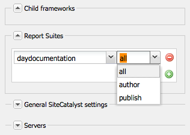

# 使用Cloud Service架構的Analytics {#analyticsusingcloudframework}

AEM Forms與Analytics整合，可讓您擷取及追蹤已發佈表單和檔案的效能量度。 分析這些量度的目的，是根據讓表單或檔案更實用所需的變更資料，做出明智的決策。

>[!NOTE]
>
>AEM Forms中的分析功能屬於AEM Forms附加套件的一部分。 如需安裝附加套件的詳細資訊，請參閱 [安裝和設定AEM Forms](../../forms/using/installing-configuring-aem-forms-osgi.md).
>
>除了附加套件之外，您還需要AEM例項的Adobe Analytics帳戶和管理員權限。 如需解決方案的相關資訊，請參閱 [Adobe Analytics](https://www.adobe.com/solutions/digital-analytics.html).

您也可以使用Adobe啟動來執行分析。 如需如何將AEM Forms與AdobeLaunch整合的詳細資訊，請參閱 [使用Adobe啟動的Analytics](/help/forms/using/integrate-aem-forms-with-adobe-analytics.md).

## 概觀 {#overview}

您可以使用Adobe Analytics來探索使用者在使用最適化表單、HTML5表單和互動式通訊時所面臨的互動模式和問題。 Adobe分析會立即追蹤並儲存下列參數的相關資訊：

* **平均填充時間**:填寫表單的平均逗留時間。
* **轉譯**:表單開啟的次數。
* **草稿**:表單保存為草稿狀態的次數。
* **提交**:表單的提交次數。
* **中止**:使用者未填妥表單就離開的次數。

您可以自訂Adobe Analytics以新增/移除更多參數。 除了上述資訊外，報表還包含下列關於HTML5和最適化表單的每個面板的資訊：

* **時間**:面板和面板欄位的逗留時間。
* **錯誤**:在面板和面板欄位上遇到的錯誤數。
* **說明**:使用者開啟面板說明和面板欄位的次數。

## 建立報表套裝 {#creating-report-suite}

Analytics資料會儲存在稱為報表套裝的客戶專屬存放庫中。 若要建立報表套裝並使用Adobe Analytics，您必須具備有效的Adobe Marketing Cloud帳戶。 執行下列步驟之前，請確定您擁有有效的Adobe Marketing Cloud帳戶。

執行下列步驟來建立報表套裝。

1. 登入 [https://sc.omniture.com/login/](https://sc.omniture.com/login/)
1. 在Marketing Cloud中，選取 **管理** > **Admin Console** > **報表套裝**.
1. 選擇 **新建** > **報表套裝** （位於「報表套裝管理器」中）。

   

   建立新的報表套裝

1. 請確定第一個下拉式清單已設為 **從範本建立** 然後選取 **商務**.
1. 找出 **報表套裝ID** 欄位和新增報表套裝ID。 例如，JJEsquire。 報表套裝ID會顯示在「報表套裝ID」欄位下方。 其中包含自動首碼，通常是公司名稱。
1. 新增 **網站標題**. 例如，JJEsquire Getting Started Suite。 此標題用於Analytics UI。 在程式碼中使用報表套裝ID。
1. 選取 **時區** 中。 此報表套裝中的所有資料都會根據定義的時區記錄。
1. 保留 **基本URL** 和 **預設頁面** 欄位空白。 這兩個值只會從Adobe Marketing Cloud介面用來連結至您的網站。
1. 保留 **上線日期** 設為今天。 「上線日期」決定報表套裝啟動的日期。
1. 在 **預估的每日頁面檢視次數** 欄位，鍵入100。 使用此欄位可預估您預計的每日網站頁面檢視次數。 此估計值可讓Adobe配置適當數量的硬體，以處理您要收集的資料。
1. 選取 **基本貨幣** 中。 此報表套裝中的所有貨幣資料都會以此貨幣格式轉換和儲存。
1. 按一下 **建立報表** 套裝。 您應該會看到頁面重新整理，並顯示報表套裝已成功建立的訊息。
1. 選取新建立的報表套裝。 導覽至 **編輯設定** > **一般** > **一般帳戶設定**.

   

   一般帳戶設定

1. 在「一般帳戶設定」畫面中，啟用 **Geography報表**，然後按一下 **儲存。**
1. 導覽至 **編輯設定** > **流量** > **流量變數**.
1. 在報表套裝中，設定並啟用下列流量變數。

   * **formName**:最適化表單的識別碼。
   * **formInstance**:適用性表單例項的識別碼。 啟用此變數的路徑報表。
   * **fieldName**:最適化表單欄位的識別碼。 啟用此變數的路徑報表。
   * **panelName**:最適化表單面板的識別碼。 啟用此變數的路徑報表。
   * **formTitle**:表單的標題。
   * **fieldTitle**:表單欄位的標題。
   * **panelTitle**:表單面板的標題。
   * **analyticsVersion**:表單分析的版本。

1. 導覽至 **編輯設定** > **轉換** > **成功事件**. 定義並啟用下列成功事件：

   | 成功事件 | 類型 |
   |---|---|
   | 放棄 | 計數器 |
   | 轉譯 | 計數器 |
   | panelVisit | 計數器 |
   | fieldVisit | 計數器 |
   | 儲存 | 計數器 |
   | 錯誤 | 計數器 |
   | 說明 | 計數器 |
   | 提交 | 計數器 |
   | timeSpent | 數值 |

   >[!NOTE]
   >
   >用來設定AEM Forms分析的事件編號和Prop編號，必須與中使用的事件編號和Prop編號不同 [AEM analytics](/help/sites-administering/adobeanalytics.md) 設定。

1. 登出Adobe Marketing Cloud帳戶。

## 建立Cloud Service配置 {#creating-cloud-service-configuration}

Cloud Service設定是Adobe Analytics帳戶的相關資訊。 此設定可讓Adobe Experience Manager(AEM)連線至Adobe Analytics。 為您使用的每個Analytics帳戶建立個別的設定。

1. 以管理員身分登入您的AEM製作例項。
1. 在左上角，按一下 **Adobe Experience Manager** > **工具**  > **Cloud Services** > **舊版Cloud Services**.
1. 找出 **Adobe Analytics** 表徵圖。 按一下 **顯示配置** 然後繼續按一下 **[+]** 新增配置。

   如果您是首次使用者，請按一下 **立即配置**.

1. 將標題新增至新設定（填寫「名稱」欄位為選填）。 例如，我的分析設定。 按一下&#x200B;**建立**。

1. 在設定頁面上開啟「編輯」面板時，請填入下列欄位：

   * **公司**:貴公司的名字在Adobe Analytics上。
   * **使用者名稱**:用來登入Adobe Analytics的名稱。
   * **密碼**:上述帳戶的Adobe Analytics密碼。
   * **資料中心**:Adobe Analytics帳戶的資料中心。

1. 按一下 **連線至Analytics**. 出現對話方塊，其中顯示連線成功的訊息。 按一下&#x200B;**「確定」**。

## 建立Cloud Service框架 {#creating-cloud-service-framework}

Adobe Analytics架構是Adobe Analytics變數和AEM變數之間的一組對應。 使用架構設定表單填入資料至Adobe Analytics報表的方式。 架構與Adobe Analytics設定相關聯。 您可以為每個設定建立多個架構。

1. 在AEM雲端服務主控台上，按一下 **顯示配置**，位於Adobe Analytics底下。
1. 按一下 **[+]** Analytics設定旁的連結。

   

   Adobe Analytics組態

1. 輸入 **標題** 和 **名稱** 對於框架，請選擇 **Adobe Analytics** 框架，然後按一下 **建立**. 架構隨即開啟供編輯。
1. 在側面Pod的「報表套裝」區段中，按一下 **新增項目**，然後使用下拉式清單來選取框架將與其互動的報表套裝ID（例如JJEsquire）。
1. 在報表套裝ID旁，選取您要傳送資訊至報表套裝的伺服器例項。

   

1. 拖曳 **表單分析元件** 從 **其他** 類別從SideKick到框架。
1. 若要將AEM變數與元件中定義的變數對應，請將變數從Analytics內容尋找器拖曳至追蹤元件上的欄位。

   

1. 使用 **頁面標籤** 在sidekick中，按一下 **啟動框架**.

## 設定AEM Forms Analytics設定服務 {#configuring-aem-forms-analytics-configuration-service}

1. 在製作例項上，開啟AEM Web Console Configuration manager(位於 `https://<server>:<port>;/system/console/configMgr`.
1. 找出並開啟AEM Forms Analytics設定

   

   AEM Forms Analytics設定服務

1. 為下列欄位指定適當的值，然後按一下 **儲存**.

   * **SiteCatalyst框架**:選取您在「設定追蹤架構」區段中定義的架構/設定。
   * **欄位時間追蹤基線**:指定必須追蹤欄位造訪的持續時間（以秒為單位）。 預設值為 0。當值大於0（零）時，會傳送兩個不同的追蹤事件至Adobe Analytics伺服器。 第一個事件會指示Analytics伺服器停止追蹤已退出欄位。 第二個事件會在經過指定的持續時間後傳送。 第二個事件會指示Analytics伺服器開始追蹤已造訪的欄位。 使用兩個不同的事件有助於準確測量欄位逗留時間。 當值為0（零）時，會將單一追蹤事件傳送至Adobe Analytics伺服器。

   * **Analytics報表同步cron**:指定從Adobe Analytics擷取報表的cron運算式。 預設值為0 0 2 ? &#42; &#42;.

   * **擷取報表逾時：** 指定等待伺服器回應分析報表的持續時間（以秒為單位）。 預設時間為120秒。
   >[!NOTE]
   >
   >逾時報表擷取作業，然後是指定的秒數，最多可能需要10秒。

1. 在發佈例項上重複步驟1至3以設定分析。

現在，您可以啟用表單分析並產生分析報表。

## 為表單或檔案啟用分析 {#enabling-analytics-for-a-form-or-document}

1. 登入AEM入口網站： `https://[hostname]:'port'`.
1. 按一下 **Forms > Forms與檔案**，選擇表單或文檔，然後按一下 **啟用Analytics**. 分析已啟用。

   

   為表單啟用分析

   **答：** 啟用Analytics按鈕 **B.** 所選表單

   如需檢視表單分析報表的詳細資訊，請參閱 [檢視及了解AEM Forms分析報表](../../forms/using/view-understand-aem-forms-analytics-reports.md).
